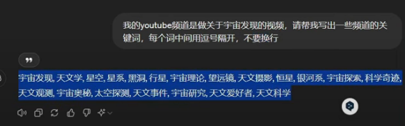
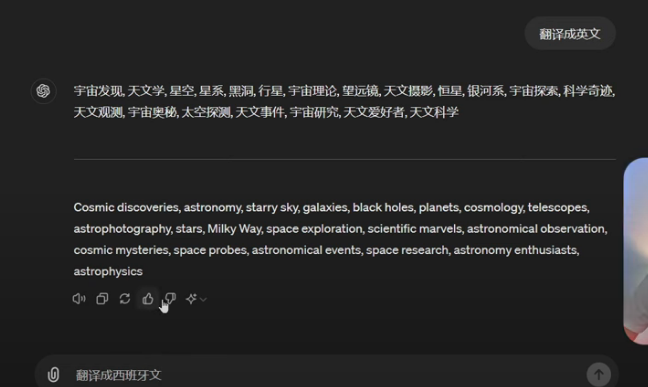

# Open Youtube Channel

## Reference Video
https://www.youtube.com/watch?v=zEcNHMosmrU&t=168s

## have old channel, how to create a new channel?
- right up corner   
- settings  
- add or manage your channel (you can see all channel and add channel)
- create a channel

## channel back platform
- right up corner 
- youtube studio

## look other channel
- right up corner   
- settings  
- add or manage your channel (you can see all channel and add channel)

## new channel settings---Customization
- important
  - name
  - handle (search url)
  - description (use gpt to help generate; add more language, use DeepL to translate multiple language(英文，中文，西班牙文))
  - links (relate to other platform, such as Github and Medium)
  - watermark
- beauty
  - profile picture（use midjourney to help generate, if want free, discord can use it）
  - banner image (use canva to help generate, search "youtube channel banner")

## new channel settings---settings
- important
  - channel->basic info->country of residence->America (Note:do not choose China, which relate to fee)
  - channel->basic info->keywords

请帮我写出一些频道的关键词，每个词中间用逗号隔开，不要换行

