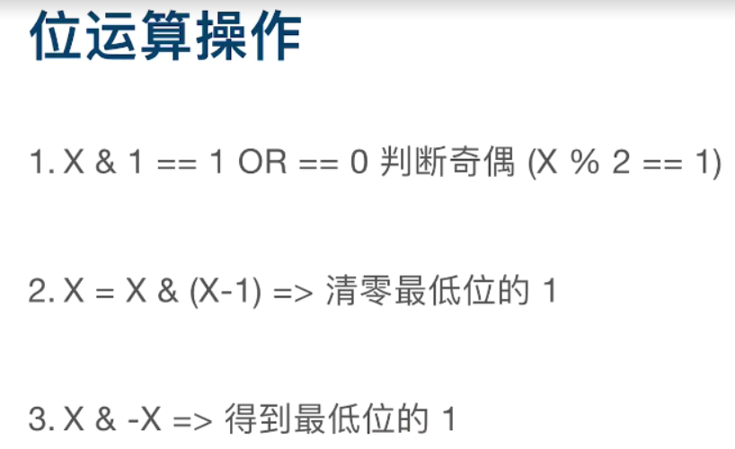
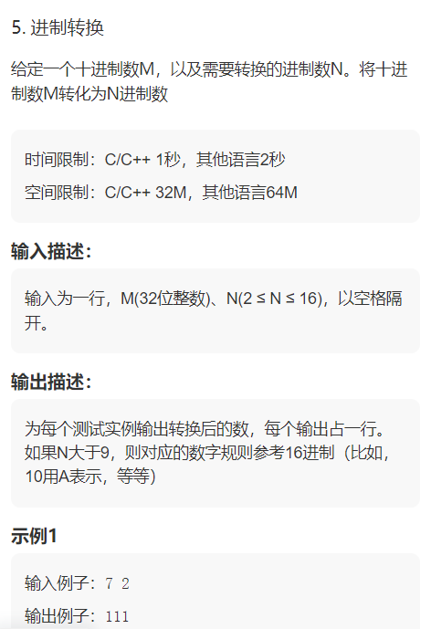

# 二进制与位运算

[链接](https://www.runoob.com/w3cnote/bit-operation.html) <br/>
左移变大 （*2） <br/>
右移变小（/2） <br/>
奇数（二进制末位是1） <br/>
偶数（二进制末位是0） <br/>
x&1 == 1   可以判断末位是否是1 <br/>
x >>= 1  末位去掉一位 <br/>
## 位运算
 <br/>
基本原理 <br/>

0s 表示一串 0，1s 表示一串 1。 <br/>

x ^ 0s = x      x & 0s = 0      x | 0s = x <br/>
x ^ 1s = ~x     x & 1s = x      x | 1s = 1s <br/>
x ^ x = 0       x & x = x       x | x = x <br/>
利用 x ^ 1s = ~x 的特点，可以将一个数的位级表示翻转；利用 x ^ x = 0 的特点，可以将三个数中重复的两个数去除，只留下另一个数。 <br/>

1^1^2 = 2 <br/>
利用 x & 0s = 0 和 x & 1s = x 的特点，可以实现掩码操作。一个数 num 与 mask：00111100 进行位与操作，只保留 num 中与 mask 的 1 部分相对应的位。 <br/>

01011011 & <br/>
00111100 <br/>
-------- <br/>
00011000 <br/>
利用 x | 0s = x 和 x | 1s = 1s 的特点，可以实现设值操作。一个数 num 与 mask：00111100 进行位或操作，将 num 中与 mask 的 1 部分相对应的位都设置为 1。 <br/>

01011011 | <br/>
00111100 <br/>
-------- <br/>
01111111 <br/>
位与运算技巧 <br/>

n&(n-1) 去除 n 的位级表示中最低的那一位 1。例如对于二进制表示 01011011，减去 1 得到 01011010，这两个数相与得到 01011010。 <br/>

01011011 & <br/>
01011010 <br/>
-------- <br/>
01011010 <br/>
n&(-n) 得到 n 的位级表示中最低的那一位 1。-n 得到 n 的反码加 1，也就是 -n=~n+1。例如对于二进制表示 10110100，-n 得到 01001100，相与得到 00000100。 <br/>

10110100 & <br/>
01001100 <br/>
-------- <br/>
00000100 <br/>
n-(n&(-n)) 则可以去除 n 的位级表示中最低的那一位 1，和 n&(n-1) 效果一样。 <br/>

移位运算 <br/>
(Java 中无符号右移为 ">>>"，有符号右移为">>" ) <br/>
>> n 为算术右移，相当于除以 2n，例如 -7 >> 2 = -2。 <br/>

11111111111111111111111111111001  >> 2 <br/>
-------- <br/>
11111111111111111111111111111110 <br/>
>>> n 为无符号右移，左边会补上 0。例如 -7 >>> 2 = 1073741822。 <br/>

11111111111111111111111111111001  >>> 2 <br/>
-------- <br/>
00111111111111111111111111111111 <br/>
<< n 为算术左移，相当于乘以 2n。-7 << 2 = -28。 <br/>

11111111111111111111111111111001  << 2 <br/>
-------- <br/>
11111111111111111111111111100100 <br/>
mask 计算 <br/>

要获取 111111111，将 0 取反即可，~0。 <br/>

要得到只有第 i 位为 1 的 mask，将 1 向左移动 i-1 位即可，1<<(i-1) 。例如 1<<4 得到只有第 5 位为 1 的 mask ：00010000。 <br/>

要得到 1 到 i 位为 1 的 mask，(1<<i)-1 即可，例如将 (1<<4)-1 = 00010000-1 = 00001111。 <br/>

要得到 1 到 i 位为 0 的 mask，只需将 1 到 i 位为 1 的 mask 取反，即 ~((1<<i)-1)。 <br/>

Java 中的位操作 <br/>

static int Integer.bitCount();           // 统计 1 的数量 <br/>
static int Integer.highestOneBit();      // 获得最高位 <br/>
static String Integer.toBinaryString(int i);     // 转换为二进制表示的字符串 <br/>
## 进制转换
### 十进制转其他进制
 <br/>
```shell
import java.util.*; <br/>

// 注意类名必须为 Main, 不要有任何 package xxx 信息 <br/>
public class Main { <br/>
    public static void main(String[] args) { <br/>
        Scanner in = new Scanner(System.in); <br/>
        // 注意 hasNext 和 hasNextLine 的区别 <br/>
        while (in.hasNextInt()) { // 注意 while 处理多个 case <br/>
            int m = in.nextInt(); <br/>
            int n = in.nextInt(); <br/>
            boolean flag = false; <br/>
            if(m == 0) { <br/>
                System.out.print(0); <br/>
            } else if(m < 0){ <br/>
                flag = true; <br/>
                m = -m; <br/>
            } <br/>
            List<Integer> r = new ArrayList<>(); <br/>
            while(m > 0) { <br/>
                r.add(m%n); <br/>
                m /= n; <br/>
            } <br/>
            if(flag) { <br/>
                System.out.print("-"); <br/>
            }              <br/>
            for(int i = r.size()-1; i >= 0; i--) { <br/>
                if(r.get(i) < 10) { <br/>
                    System.out.print(r.get(i)); <br/>
                } else { <br/>
                    switch(r.get(i)){ <br/>
                        case 10 : System.out.print("A");break; <br/>
                        case 11 : System.out.print("B");break; <br/>
                        case 12 : System.out.print("C");break; <br/>
                        case 13 : System.out.print("D");break; <br/>
                        case 14 : System.out.print("E");break; <br/>
                        case 15 : System.out.print("F");break;                    <br/>
                    } <br/>
                } <br/>
            }             <br/>
        } <br/>
    } <br/>
} <br/>
```
## 前置知识: 原码、反码、补码 [参考](https://www.cnblogs.com/zhangziqiu/archive/2011/03/30/computercode.html) (注意: 计算机底层运算都靠补码进行
正数： 原码=反码=补码 <br/>
负数： <br/>
反码=原码除符号位取反 <br/>
补码=反码+1 <br/>
为什么用补码：为了只进行加法运算，且符号位一同进行运算 <br/>


为什么-x的补码计算方式是~x + 1: <br/>
-x = 0 - x，0减去一个数需要向前借1位，即100...00 - x  <br/>
哪个数加上x能产生这种进位的效果呢? <br/>
首先x + (~x)，那么x的所有位就都为1了，再加上1 相当于进了1位的同时x所在位全为0 <br/>
所以~x+1能做到进位效果，所以-x的补码表示为~x+1 <br/>
常用二进制计算技巧: <br/>
```cpp
// 1. n的二进制表示中第k位是0还是1 <br/>
n >> k & 1  // n >> k 可把第k位移到个位，然后 x & 1 可知个位是0还是1 <br/>
    
// 2. lowbit，返回x的二进制表示中最右边的1及之后的0 <br/>
// 原数a: 1... 1 0 0 <br/>
// 取反b: 0... 0 1 1 <br/>
// 加一c: 0... 1 0 0 <br/>
// a & c: 0000 1 0 0 <br/>
lowbit(x) = x & -x; // 或 x & (~x + 1) <br/>
// 应用:  <br/>
// 1. 统计x中1的个数: 循环x -= lowbit(x) 统计x为0时减了几次 <br/>
```

