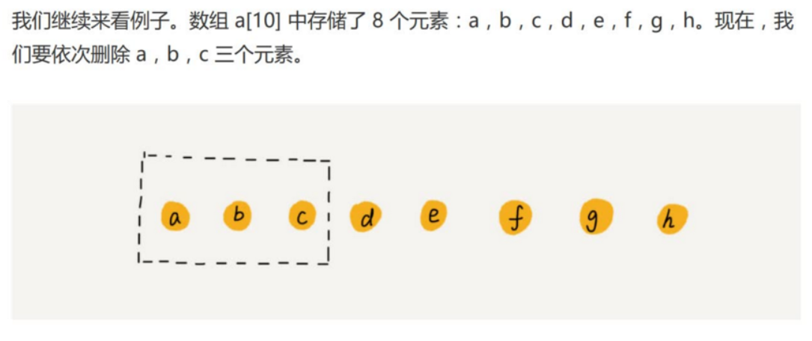

# 数组
## 特点
1. 属于线性表  

线性表，只有前后两个方向：数组、链表、栈、队列  
非线性表：树、图  

2. 连续的内存空间和相同类型的数据  
3. 优：随机访问O(1)  

随机访问是指通过下标访问。  
查找 != 随机访问，即便是排好序的用二分查找，时间复杂度为O(logn)）  

4. 缺：增删元素要做大量的数据搬移工作(O(n)  

低效，可以改进吗？如果不必保证原有顺序，那可以！  
## 如何做到随机访问：一维数组的内存寻址公式
a[i]_address = base_address + i * data_type_size  
为什么很多编程语言中数组都从0开始编号，而不是从1开始？  
数组下标从0开始，下标代表着偏移量，如果从1开始计数，内存寻址公式要改为a[i]_address = base_address + （i-1） * data_type_size，每次访问数组多了一次减法运算。  
## 改进低效插入（应用：快排）
在第k位插入元素，直接把原先第k位元素放到最后，把新元素插入第k位。  
时间复杂度就从O(n)降到O(1)。  
这个处理思想在快排中有用到。  
## 改进低效删除（应用：JVM的标记清除垃圾回收算法）
  
为了避免d,e,f,g,h这几个数据会被搬移三次，我们可以先记录下已经删除的数据。 每次的删除操作并不是真正地搬移数据，只是记录数据已经被删除。当数组没有更多空间存储数据时，我们再触发执行一次真正的删除操作，这样就大大减少了删除操作导致的数据搬移。    
 这就是 JVM 标记清除垃圾回收算法的核心思想。   
## 容器能否完全替代数组？
### ArrayList优势
1) 将很多数组操作的细节封装起来（eg. 数组插入、删除数据时需要搬移其他数据等）  
2) 支持动态扩容（每次存储空间不够，会将空间自动扩容1.5倍大小）  
Note： 因为扩容操作涉及内存申请和数据搬移，是比较耗时的。所以， 如果事先能确定需要存储的数据大小，最好在创建 ArrayList 的时候事先指定数据大小， 事先指定数据大小可以省掉很多次内存申请和数据搬移操作。    
### 用数组更适合的情况
1) 使用基本类型又特别关注性能（ArrayList只能存包装类， 而 Autoboxing、Unboxing 则有一定的性能消耗）  
2) 多维数组，用数组更直观  
3) 大小事先已知且操作简单  
