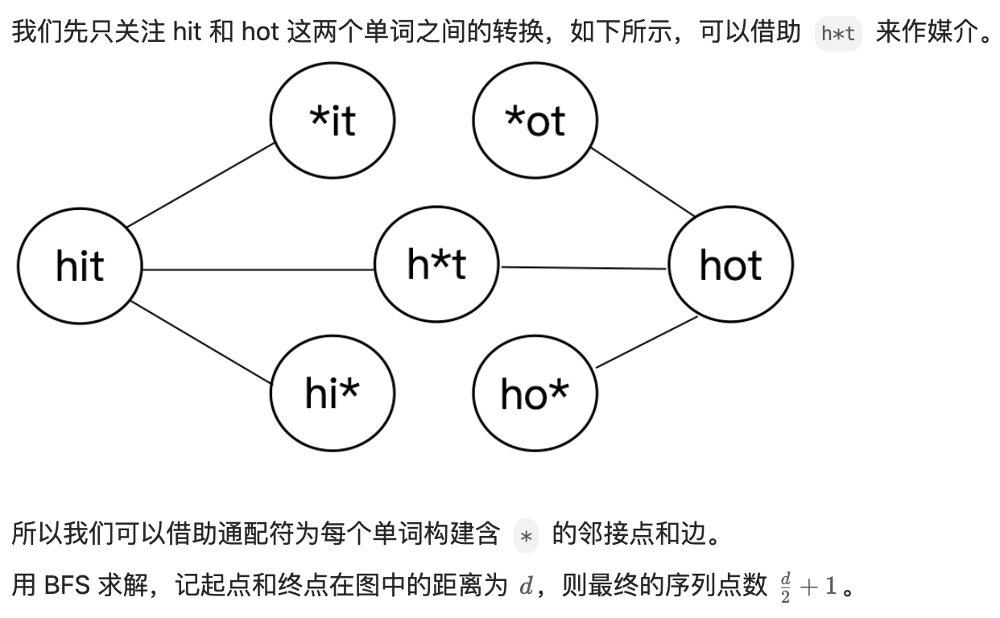

# 做题经验总结
- 通用
    - 先理清思路，列好整体思路大纲再着手开始写
    - 额外定义函数作为内部函数，省去写self.,内部函数要定义在其他代码的上面，否则找不到，内部函数中可以用其他代码中定义的变量
- 面试时做算法题
    - 询问题目细节
    - 把想到的几个思路和各自的时间复杂度都跟面试官说一遍
    - 敲定一个方案后，列出思路大纲
    - 开始写代码，最好边写边说你正在做什么
    - 测试代码通过
- 笔试做算法题
    - 根据数据范围和时空复杂度要求筛选可用方案
    - 敲定一个方案后，列出思路大纲
    - 开始写代码
    - 测试代码通过
- 一些常用变量命名保持一致
    - pre, nxt
    - begin, end
    - slow, fast

## 面试算法常考题型


## 根据数据范围和时空复杂度推断可用算法
一般ACM或者笔试题的时间限制是1秒或2秒。

C++在1秒内大约能执行10^8次操作，因此时间复杂度小于10^8即可接受

根据数据范围锁定可取的时间复杂度，再根据时间复杂度筛选可用的算法
- O(1) [可用]
    - 数组访问
    - 链表增删
    - 哈希表
- O(logn) [可用]
    - 二分查找
    - 快速幂
    - 平衡二叉树操作
    - 对数级分治
- O(n) [可用]
    - 单层for循环
    - 找最大值
    - 栈/队列/单调栈/单调队列
    - 双指针
    - 滑动窗口
    - KMP
    - 前缀和
    - 哈希计数
    - 桶/计数排序
- O(nlogn) [n<=$10^5$可用]
    - 排序
        - 归并排序
        - 快速排序
    - 递归
    - 堆/优先队列
    - 分治
    - 树状数组
    - 线段树
    - 贪心
- O($n^2$) [n<=$10^4$可用]
    - 双重for循环
    - 动态规划
    - DFS/BFS
- O($n^3$) [n<=500可用]
    - Floyd 算法
- O($2^n$) [n<=20可用]
- O(n!) [n<=10可用]
    - 全排列
    - 回溯
    - 子集生成

不同算法的时间复杂度
- 循环 
    - 单层 O(n)
    - 双层 O(n^2)
- 排序
    - O(nlogn)
- 二分查找
    - O(logn)
- 递归
    - 分析递归多少层，每层的复杂度
    - 例如，归并排序为logn层，每层是O(n)复杂度，所以整体复杂度是O(nlogn)
- 双指针
    - 看似两层循环，但只用关注内层指针的循环次数，不超过n，所以复杂度是O(n)
- 数据结构
    - 链表：增删节点O(1)
    - 栈/队列：O(1)
    - 单调栈/单调队列：O(n)
    - KMP：O(n)
    - 并查集：路径压缩最坏O(logn)，再加按秩合并O(loglogn)
    - 堆排序：堆是完全二叉树，高度logn，加入或删除数据，复杂度与高度呈线性，O(logn)
    - 哈希表：增删改查O(1)
- 搜索问题
    - 全排列：转化为树，每层结点数分别为n! (n-1)! (n-2)!
    - 其他层相对最后一层是无穷小量，每个结点都要O(n)循环一遍数字，所以是O(n*n!)
- 图论
    - 图的搜索：dfs和bfs，每个点和每条边都会被遍历一次，所以O(n + m)
    - dijkstra算法：
        - 朴素版，两重循环，都循环点，O(n^2)；
        - 堆优化：操作m次堆，O(mlogm)，且m << n^2，也即O(mlogn)
    - bellman-ford：循环点再循环边，O(nm)
    - spfa：最短路，最差O(nm)，实际快很多；判断负环，O(nm)
    - floyd算法：三重循环，O(n^3)
    - prim算法：两重循环，O(n^2)
    - kruskal算法：边排序O(mlogm)，遍历边O(m)，O(mlogm)
    - 染色法：图的遍历，dfs或bfs，O(n + m)
    - 匈牙利算法：遍历点时，遍历边，复杂度O(nm)
- 数学知识
    - 判断质数：O(sqrt(n))
    - 筛质数：两重循环相关，n*调和级数，O(nlogn)
        - 补充：如果加优化，只筛质数倍数，O(nloglogn)
    - 最大公约数：O(logn)
    - 快速幂：k二进制有多少位，循环多少次，logk
- DP
    - DP计算量 = 状态数量 * 状态转移的计算量
    - 背包问题：看循环或套公式
    - 分组背包：状态数量nv，计算量O(n)，复杂度O(vn^2)，或者直接看三层循环
    - 最长上升子序列Ⅱ:外层循环n次，内层二分logn次，O(nlogn)
    - 蒙德里安的梦想：优化后，外层枚举列m，内层枚举当前列所有状态2^n，m*2^n
    - 没有上司的舞会：状态数，所有边n-1，计算量O(1)，复杂度O(n)
    - 滑雪：两维dp，状态数为n^2，计算量O(1)，复杂度O(n^2)
- 贪心
    - 排序 + 循环：O(nlogn)

## 解题技巧汇总
### 链表题解题技巧(6项)
1.哨兵节点：头节点有变动时必须用

2.快慢指针：定位特定节点

3.删除当前节点：将下一个节点的值给当前节点，并删除下一个节点

4.相交链表（2个链表的尾部重合）找相交点：2个指针到尾部后换到另一个链表上，当2个指针指向同一个节点，就是相交点

5.环形链表找环的入口点：快慢指针重合后，快指针回到原点1倍速和慢指针重逢点即入口点
```
证明
       a：入环前长度 b：入环到相遇点 c：相遇点到入环点
       slow走的距离：a + k1(b+c) + b
       fast走的距离：a + k2(b+c) + b
       2(a + k1(b+c) + b) =  a + k2(b+c) + b
       2a + 2b + 2k1(b+c) = a + b + k2(b+c)
       a = (k2-2k1) (b+c) - b
       a = (k2-2k1-1)(b+c) + c
       a = k(b+c) + c
```

6.环形链表环的长度：找到环的入口点后，一个指针待在入口点，另一个指针走一圈（通过比对入口点指针知道是否走了一圈），记录下走的距离即为环的距离

### 动态规划解题技巧(3项)
1.状态定义：1）一维还是二维，2）dp[i]/dp[i][j]代表意义 

2.初始状态：边界

3.状态转移：1）转移方程，2）dp数组填入内容的顺序

### 回溯解题技巧
1.backtrack传参：只传2种参数，1种是进行到哪一步的定位，1种是回溯结束时要得到的数据

2.结束条件

3.每个backtrack有几种情况

4.每种情况 1）剪枝 2）前置更新 3）backtrack递归调用 4）后置恢复

### 图论解题技巧
拓扑排序（eg.课程先后顺序）
- 1.**定义并构造邻接表adj(Adjacency List)和入度数列表**
- 2.将入度数为0的加入队列 (BFS)

```
adj = defaultdict(list) # 出度
enter_nums = [0] * numCourses # 入度个数
```

BFS
- 最短路用BFS
       - 创建虚拟节点

难点：
- 将一个问题建图（数学建模），构造为邻接表
- 优化建图（eg.127 单词接龙）
       - 依据朴素的思路，我们可以枚举每一对单词的组合，判断它们是否恰好相差一个字符，以判断这两个单词对应的节点是否能够相连。但是这样效率太低，我们可以优化建图。
       - 具体地，我们可以**创建虚拟节点**。对于单词 hit，我们创建三个虚拟节点 *it、h*t、hi*，并让 hit 向这三个虚拟节点分别连一条边即可。如果一个单词能够转化为 hit，那么该单词必然会连接到这三个虚拟节点之一。对于每一个单词，我们枚举它连接到的虚拟节点，把该单词对应的 id 与这些虚拟节点对应的 id 相连即可。



## Reference
- https://www.acwing.com/blog/content/5006/
- https://www.acwing.com/blog/content/32/
- https://www.acwing.com/blog/content/16975/