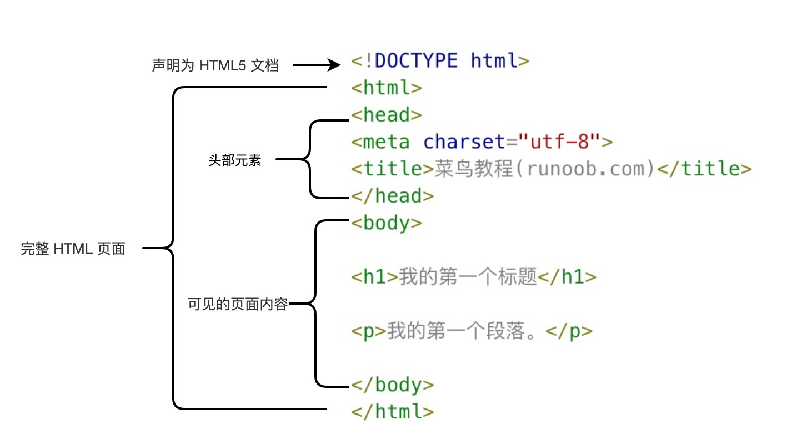

# HTML

超文本标记语言（英语：HyperText Markup Language，简称：HTML） <br/>
[HTML参考手册-菜鸟教程](https://www.runoob.com/tags/ref-byfunc.html) <br/>
[HTML菜鸟教程](https://www.runoob.com/html/html-tutorial.html) <br/>
使用技巧 <br/>
1、查看网页源代码：鼠标右键，选择“查看网页源代码” <br/>
_2、VS Code 和 Sublime Text 还可以配合 Emmet 插件来提高编码速度。_ <br/>
_Emmet 官网：_[http://emmet.io/](http://emmet.io/) <br/>

规范 <br/>
1、所有元素都必须被关闭，空元素也是哦 <br/>
2、标签（小写） <br/>
3、属性（小写） <br/>

网页结构 <br/>
 <br/>

学习内容 <br/>
```
1、元素=标签+内容，没有内容称为空元素 <br/>

2、标签 <br/>
标题<h1>-<h6> <br/>
段落<p> <br/>
Note：浏览器会自动地在标题和段落的前后添加空行（</p> 是块级元素） <br/>
换行 <br/>

Note：当显示页面时，浏览器会移除源代码中多余的空格，空行和换行。所有连续的空格，空行，换行都会被算作一个空格。 <br/>
水平线<hr> <br/>
链接<a> <br/>
图像<map><area> <br/>
表格<table> <br/>
列表<ul><ol><dl> <br/>
区块<div><span> <br/>
表单<form><input><textarea><button> <br/>

3、属性 <br/>
通用属性，class,id,style,title <br/>
Note：可通过style属性直接写样式，也可通过class属性从head里的style元素或样式文件引入样式 <br/>

4、注释  <!-- 这是一个注释 --> <br/>

5、格式化标签：粗体，斜体，放大，缩小，下标，上标，缩写，引用，文字方向等 <br/>

6、光标形状：  <br/>
箭头：一般情况 <br/>
小手：点击链接 <br/>
小竖线：文档编辑 <br/>

7、链接 <br/>
1）点击链接的光标形状 <br/>
当您把鼠标指针移动到网页中的某个链接上时，箭头会变为一只小手。 <br/>
2）点击链接的前中后样式变化 <br/>
默认情况下，链接将以以下形式出现在浏览器中： <br/>

- 一个未访问过的链接显示为蓝色字体，当鼠标悬浮时带有下划线。 <br/>
- 访问过的链接显示为紫色。 <br/>
- 点击链接时，链接显示为红色并带有下划线。 <br/>

注意：如果为这些超链接设置了 CSS 样式，展示样式会根据 CSS 的设定而显示。 <br/>
3）跳转地址（herf与id属性） <br/>
在标签<a> 中使用了href属性来描述链接的地址。 <br/>
通过id在当前页面链接到指定位置，如返回首页或目录跳转。 <br/>
<a href="#C4">查看章节 4</a> <br/>
<h2>章节 1</h2> <br/>
<h2>章节 2</h2> <br/>
<h2>章节 3</h2> <br/>
<h2 id="C4">章节 4</h2> <br/>
4）窗口显示位置（target属性） <br/>
target="_blank"  在新窗口打开 <br/>
target="_top"  跳出框架（不展示外层嵌套的侧边和上边栏） <br/>
target="iframe_a" 在指定框架内打开 <br/>
5）链接的内容：不仅文本，也可以是图片或其他 <br/>

8、头部 <br/>
可以添加在头部区域的元素标签为: <title>, <base>, <meta>, <style>, <link>, <script>, <noscript>  <br/>
通过 <style>标签定义内部样式表 <br/>
通过 <link>标签定义外部样式表 <br/>

9、CSS <br/>
CSS 可以通过以下方式添加到HTML中: <br/>

- 内联样式- 在HTML元素中使用"style"** 属性** <br/>
- 内部样式表 -在HTML文档头部 <head> 区域使用<style>** 元素** 来包含CSS <br/>
- 外部引用 - 使用外部 CSS** 文件** <br/>

最好的方式是通过外部引用CSS文件. <br/>

10、块级元素block与内联元素inline <br/>
1)**块级元素**或**内联元素** <br/>
大多数 HTML 元素被定义为**块级元素**或**内联元素**。 <br/>
块级元素在浏览器显示时，通常会以新行来开始（和结束）。例如：<h1>, <p>, <ul>, <table> <br/>
内联元素在显示时通常不会以新行开始。例如：<b>, <td>, <a>,  <br/>
2)<div> 和 <span>  <br/>
<div> 和 <span> 元素没有特定的含义。 <br/>
<div>是块级元素，可用于组合其他 HTML 元素的容器。 <br/>
<span>是内联元素，可用作文本的容器。 <br/>
3)布局 <br/>
一般用<div>元素进行布局。 <br/>
**Tip:** 由于创建高级的布局非常耗时，使用模板是一个快速的选项。通过搜索引擎可以找到很多免费的网站模板（您可以使用这些预先构建好的网站布局，并优化它们）。 <br/>
用<iframe>元素嵌套页面  <br/>
```