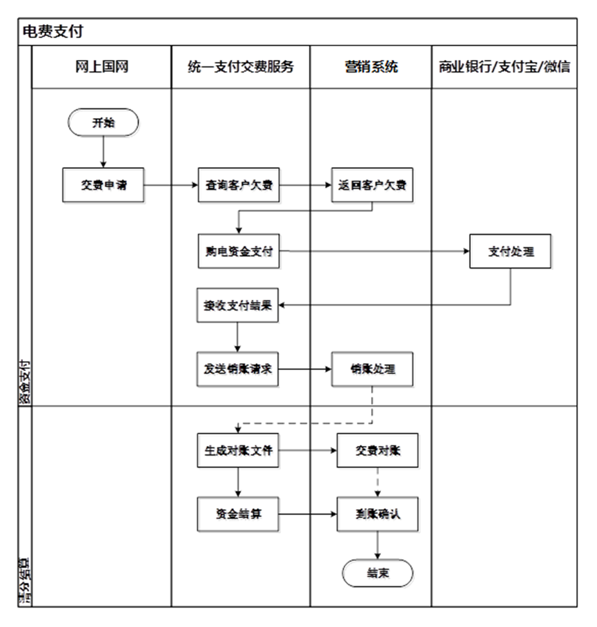

# 国网 —— 交电费功能模块
## 重点
项目中RocketMQ应用场景：普通消息，分布式事务 <br/>

项目中Redis应用场景：缓存和分布式锁 <br/>

项目里RedisLock设置的过期时间是多长（30s），超时了怎么处理（ttl，给锁续命） <br/>

项目有多大的并发量：500qps    100w日活 <br/>

你所处的角色：电费业务是我们国网的核心业务 <br/>

项目中最大的技术挑战：RedisLock/RocketMQ的丢失（4个方面可能导致丢失），幂等，一致性，高可用（主从读写分离，多主避免无法写，多个生产者和消费者，会涉及负载均衡） <br/>

支付风控：有健全的前置校验 <br/>

操作：数据库crud；HTTP请求；FeignClient跨服务调用；Dubbo直连 <br/>

## 用户操作
### 1、网上国网App交电费按钮

展示户号列表（基础/静态的信息（户名和用电地址），通过userId从用户中心获取） <br/>

    绑定的户号+交费历史记录：去重排序 <br/>

mq发送普通消息，**异步批量**查欠费信息（实时的信息，从各省侧营销中心）放**redis缓存**，加速下一步查询欠费信息，避免延迟 <br/>

```
mqCommonSendService.sendMqMessage(UUID.randomUUID().toString(), MqTagEnum.BILL_XZMQ_XZ.getTag(), JSONObject.toJSONString(recharge)); <br/>
```
专门有一个项目做消息相关的，监听消息，然后消费消息，根据户号FeignClient批量调营销欠费查询 <br/>

### 2、勾选户号

如果有缓存，取缓存；没有缓存，单个查欠费信息，然后放缓存（实时的信息，从各省侧营销中心） <br/>

户号分为两种类型，预付费（开通了智能缴费，自动扣费，余额不足20，自动充值100）和后付费 <br/>

勾选后的户号，后付费会显示应交金额，预付费会显示余额（欠费时，应交金额为正，余额为负） <br/>

### 3、确认交费

发起：调下单接口+拉起支付宝SDK进行支付 <br/>

下单接口处理： <br/>

参数校验 <br/>

下单：策略模式进行多网省差异化处理(多态，父类引用指向子类对象；隔离修改，无障碍扩展；依据省码获取包名类名，通过反射获取子类)（落表：付款信息表，销售订单表） <br/>

```java
String name = ProvinceRouteConstant.PROVINCE_ROUTE_MAP.get(provinceCode); <br/>
provinceService = (IProvinceService) Class.forName(name).newInstance(); <br/>
```
预下单：调支付宝的接口，用来拉起支付宝SDK <br/>

主要字段： <br/>

商户号（用于展示收款方） <br/>

商户订单号[唯一标识，不展示] <br/>

金额（用于展示金额） <br/>

回调地址（支付成功后，会主动回调的接口） <br/>

### 4、支付

支付界面左上角返回键：取消订单 <br/>

未支付退出界面，30分钟内：立即支付、取消订单 <br/>

30分钟后，订单关闭跑批 <br/>

### 5、支付后的信息展示

付款信息表中付款状态改为付款中 <br/>

改状态的必要性 <br/>

    1.没有继续付款、取消订单的按钮了 <br/>

    2.防止订单关闭跑批 <br/>

    3.可以做支付结果查询进行补偿 <br/>

### 6、销账（就是发货）

发起：支付成功主动回调 or 支付结果查询跑批 <br/>

处理： <br/>

防重复锁RedisLock
```
// key 是订单号 <br/>
// value是uuid <br/>
// ttl 自动续时 <br/>
redisLock.getDistributedLock("ORDER_" + token, "1", 1000); <br/>
```

分布式事务：本地事务和发消息到MQ的一致性（订单表改状态为已付款，发货中，mq发送营销系统发货） <br/>
用MQ的ACK机制+重试机制+死信队列监控报警人工处理保证接收消息一定成功 <br/>


更新付款信息表中付款状态改为已付款 <br/>

更新销售订单表中付款状态改为已付款，发货状态改为发货中 <br/>

生成交电费订单表 <br/>

调各省营销中心的销账接口 <br/>

销账成功，修改表的发货状态为成功，订单状态为完成 <br/>

## 补偿机制（定时任务）
补偿机制：订单关闭，支付结果查询，销账结果查询，退款申请，退款查询 <br/>

根据几张主要表的一些状态，用定时任务找出对应情况，做相应处理 <br/>

付款状态，订单状态，发货状态、退款状态 <br/>

成功，失败，未明，处理中 <br/>

| 5个 | 付款状态 | 发货状态 | （退款表，发货失败才有记录）退款状态 |
| --- | --- | --- | --- |
| 订单关闭  超过30min 处理1000条 | 未付款 | 未发货 | - |
| 支付结果查询  处理200条 三分钟查一次，查过15次后仍然没有明确的支付结果，不再查询 | 付款中 | 未发货 | - |
| 销账结果查询 处理10条 | 已付款 | 发货中 |  |
| 退款申请 给支付宝传退款回调地址 | 已付款 | 发货失败 | 未退款 |
| 退款结果查询 | 已付款 | 发货失败 | 退款中 |

## 对账（定时任务）
每天进行对账，凌晨2点 <br/>

下载对账文件，存到本地，生成对账记录表和对账明细表 <br/>

查询记录表未对账的，更新为对账中 <br/>

查询明细表对应1000条 <br/>

如果明细表查询为空，则对账完成 <br/>

如果不为空，支付和退款分开进行 <br/>

### 支付对账：支付宝的一条支付记录

1）查付款信息表： 有：继续      无：本方缺失 <br/>

2）查对账状态：未完成状态：继续      其他状态：重复对账 <br/>

3）对比金额：一致：继续  不一致：内容差异 <br/>

4）对比付款状态： <br/>

支付宝成功： <br/>

本地： <br/>

    已付款：对账完成    <br/>
    未付款或付款中状态：发起销账，对账完成     <br/>
    已关闭或付款失败：走退款，对账完成 <br/>

支付宝失败： <br/>

本地： <br/>

    已付款：对方异常   <br/>
    未付款或付款中状态：对账完成     <br/>
    已关闭或付款失败：改支付状态，关闭订单，对账完成 <br/>

5）改状态为已对账 <br/>

### 退款对账：支付宝的一条退款记录
1）查退款表： 有：继续      无：本方缺失 <br/>

2）查对账状态：未完成状态：继续      其他状态：重复对账 <br/>

3）对比金额：一致：继续  不一致：内容差异 <br/>

4）对比退款状态 <br/>

支付宝成功： <br/>

本地： <br/>

    成功：对账完成    <br/>
    其他：走对应逻辑，对账完成 <br/>

支付宝失败： <br/>

本地： <br/>

    退款成功：对方异常 <br/>
    其他：走对应逻辑，对账完成 <br/>

5）改状态为已对账 <br/>


### 营销对账

支付对账完成，营销对账未完成 <br/>

按【支付渠道+账务日期+核算单位】查询交电费订单表 <br/>

统计销账状态为成功和未明的记录，为营销系统生成对账文件 <br/>

通知营销系统 <br/>

## 各省营销系统相关（27个网省）
对于它们来说，我们是统一支付交费平台 <br/>

1、欠费信息查询接口 <br/>
2、销账接口 <br/>
3、营销对账 <br/>
4、结算 <br/>

省：电力公司(又指，商户号、核算单位)=1：多 <br/>

 <br/>