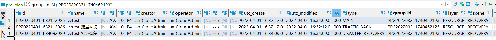
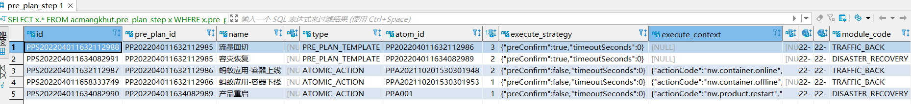
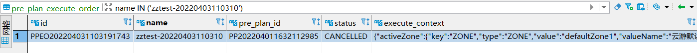
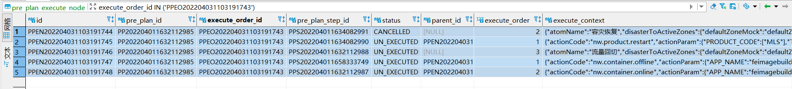

# 浩鲸 —— 守夜人监控平台（高可用平台）

## 技术栈：sofastack(sofaboot,sofarpc)
## 背景：日常风险防控场景

自动巡检：定期自动化的对系统稳定性和可用性进行巡检，推送巡检结果  

风险大盘（风险事件的汇总）：监控、巡检、诊断出的风险和告警信息汇总  

应急预案（应急响应）：根据常见的故障场景的处理过程，对原子操作进行编排组合，形成可执行的应急预案，当风险事件发生时，可以快速自动化执行（特点：效率高，可复用，透明化，降成本）  

基本操作：创建预案，执行预案  
基本需求：初始化的变动，新增或更新原子能力，流程上待确认参数填写，原子能力配置项  
## 特点：toB，客户多是银行
线上排查问题，是在客户的环境下，需要客户的员工配合  

客户用的版本不一样，变更代码都需要向下兼容  

## 初始化
### 初始化任务

系统配置初始化（策略2：因为数据库是共享的，所以更新数据库，只需要操作一次）  

功能切换初始化（策略2：因为数据库是共享的，所以更新数据库，只需要操作一次）  

预案原子操作初始化（策略2：因为数据库是共享的，所以更新数据库，只需要操作一次）  

### 初始化策略

1.全局执行一次，产品版本升级、部署都不会执行  

2.每次部署时，所有服务器中需要其中一台执行一次  

3.每次部署时，执行多次，每台服务器都执行  

### 预案原子操作初始化步骤

1.遍历预案原子操作枚举类PrePlanActionCode（枚举类定义了名称，唯一标识，所属范畴，支持场景，用户是否可见，展示顺序，原子操作参数类，依赖的系统配置）  

所属范畴：通用，产品层，网络层，应用层，服务层，数据层，基础设施层  

参数类上加注解，名称，描述，基础校验，展示顺序  

2.校验，依赖的系统配置如果不存在，则设置为用户不可见  

3.用枚举类更新数据库表（PrePlanAction,PrePlanActionParam）  

## 数据库表
### 在页面上不可操作变更的（初始化来的）

#### pre_plan_action（PPA） 预案操作
和代码里枚举类PrePlanActionCode一一对应，在枚举类配置即可，会同步到数据库里  
#### pre_plan_action_param（PPAP）预案操作相关参数
每个预案操作都有相应的参数，在枚举类里指定，会同步到数据库里  
### 在页面上可以操作变更的
#### 创建预案（仅添加2个表：pre_plan和pre_plan_step）
##### pre_plan（PP）预案
scene：预案场景  

    EMERGENCY：应急预案  

    SELF_RECOVERY：自愈预案  

    RECOVERY：容灾预案  

type：预案类型（应急预案和自愈预案都是MAIN，容灾预案分4类，容灾切换DISASTER_SWITCH，容灾恢复DISASTER_RECOVERY，流量回切TRAFFIC_BACK，MAIN）  

atomic：是否是原子预案（0、1，应急预案和自愈预案都是1，容灾预案2者都有）  

应急预案和自愈预案不用groupid和layer  

应急预案和自愈预案是对应一条，创建1条Main  
容灾预案，新增多条，存放一个MAIN和配置的细分类型（新增1+n条）（细分类型n个，取值1-3之间）  

  

##### pre_plan_step（PPS）预案步骤

1个容灾预案每个配置的细分类型新增1条，每个细分类型的每个步骤又各自新增1条  

（新增n+m条）  

（细分类型n个，取值1-3之间）  

（各细分类型的步骤共m个）  

细分类型的取值：  

pre_plan_id均对应pre_plan的MAIN的id  

atom_id对应各自pre_plan的细分类型的id  

name是类型名  

type是PRE_PLAN_TEMPLATE  

execute_order预案步骤执行顺序：3个类型的执行顺序是固定的，从左到右  

execute_strategy：{"preConfirm":true,"timeoutSeconds":0}  

execute_context：为空  

步骤的取值：  

pre_plan_id对应pre_plan的细分类型的id  

atom_id对应pre_plan_action的id  

name是步骤名  

type是ATOMIC_ACTION  

execute_order预案步骤执行顺序：同一类型的步骤都从1开始，按上下的顺序执行  

execute_strategy：{"preConfirm":false,"timeoutSeconds":0}  

execute_context：json串  

  

#### 创建预案执行单
##### pre_plan_execute_order（PPEO）预案执行单
预案可执行多次，每次执行会生成一条预案执行单  

Special Note：预案执行时的更新参数操作，仅针对该次预案的执行，而与原本预案的参数没有关系  

  

##### pre_plan_execute_node（PPEN）预案执行节点
一个预案执行单对应的预案执行节点个数等于pre_plan_step的条数  
  

## 日常工作（需求&缺陷）

### 需求

一般需求都是几句话描述，我需要把这个具象化，询问相关人员（客户，需求提出者，代码里自己找）确认需求细节，梳理改动范围，后面才进行开发工作。  

#### 新增一个原子操作（产品下线，saas应用扩缩容，中间件熔断，限流，降级能力的对接）

#### 新增saas应用扩缩容原子操作：

金融分布式架构平台页面上的操作是，点击扩缩容后会创建发布单，但是执行发布单需要手动操作，而且扩容的时候，每扩容一个pod，就得确认一下才能往下进行，把这些都处理成一键自动化。  

我的处理：从金融分布式架构平台页面上找到相应的操作接口和流程查询接口，根据当前的状态，调用执行执行单和确认扩容的接口。查询接口更新状态比较慢，处理成死循环，只有状态变更完成了或报错了才退出循环，且每次查询完都sleep(10000) 间隔10s（这样一般请求1-3次就可拿到结果），避免请求超级多次查询接口。  

#### 容器实例下拉框支持过滤非Running的功能：

1）先梳理现有的原子操作，哪些新建时，参数有容器实例下拉框  

2）再梳理哪些不需要过滤，全部都要；哪些过滤掉非Running的；哪些过滤掉				Running的（这些会找云游平台去确认）  

3）有些容器实例非必填，如不填，是对应用服务下所有的容器实例生效，这样的情况		也要按上述过滤。  

4）开发工作：查询条件加状态  

5）需要前端配合，给前端提需求  

#### 执行时支持待确认参数填写：执行时，缺少参数，会有下一步让用户填写参数

#### GW_OP_CONFIG自动化配置改造

#### 代码整体优化：清理不再使用的原子能力配置项

#### 系统参数支持结构化编辑：需求只有一句话，需要从梳理那些可以进行结构化编辑开始，有些对象有map结构，需要改成list结构才能适配现有的结构化。

#### IAM降级

### 缺陷

#### 线上缺陷（私有化部署，eg.交通银行），arthas

Java 线上问题排查神器 [Arthas](https://developer.aliyun.com/article/764933)  

#### 日常缺陷
