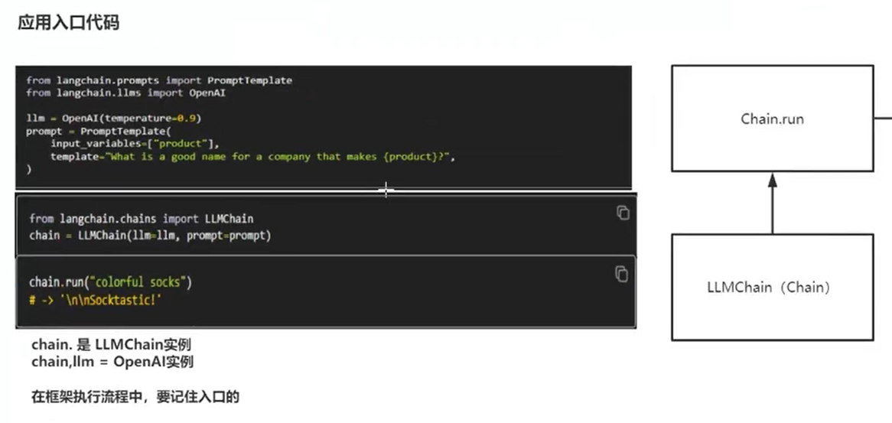
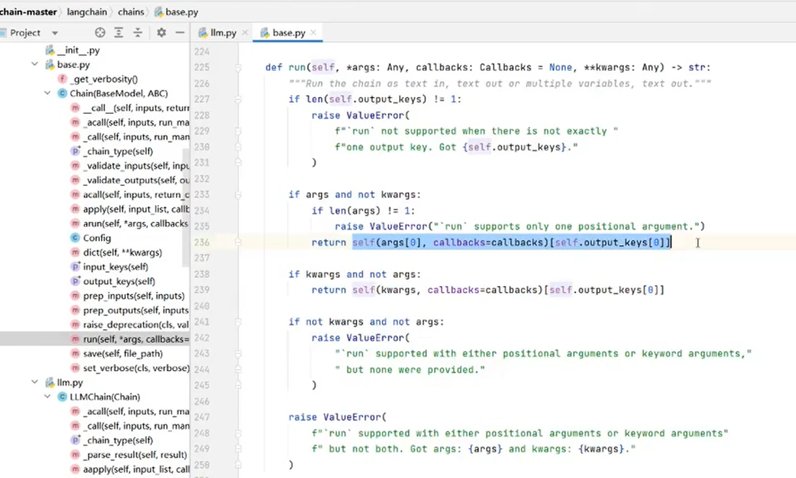
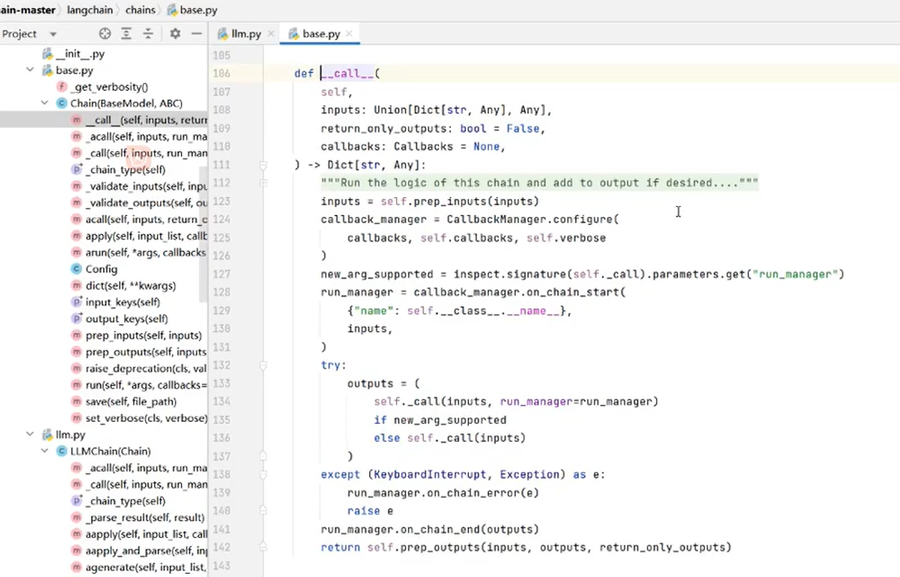
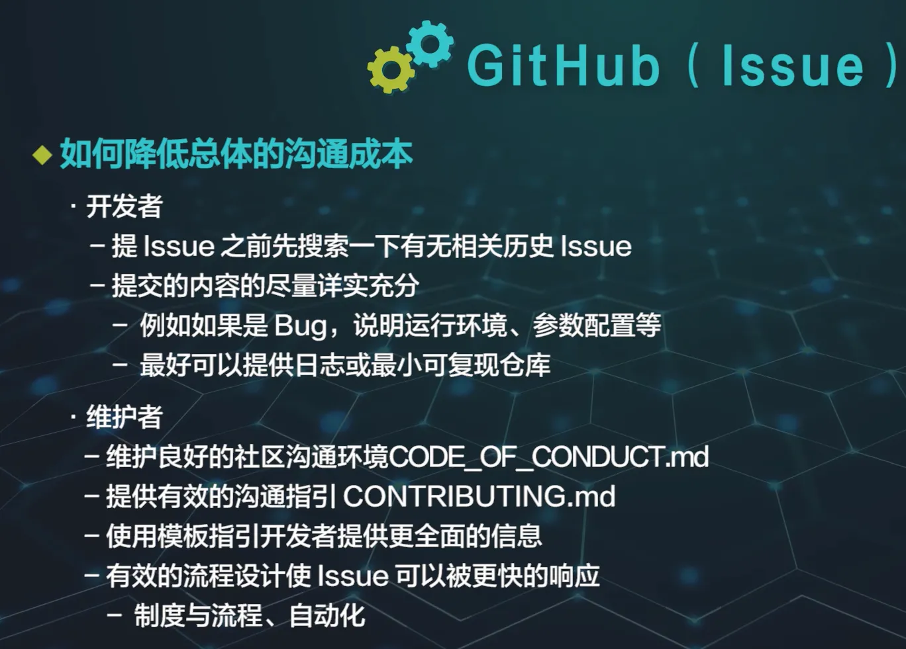
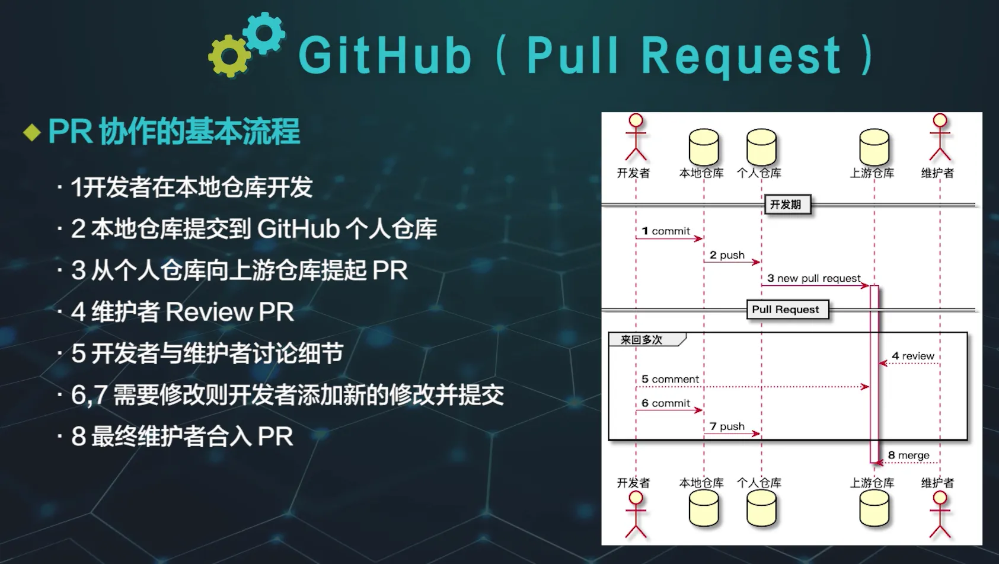

# 经验积累

## 1. 如何看源码
### 1.1. 第一步：有一个示例代码
方式一：找源码里的test

方式二：让AI帮忙写用于看源码的简单示例代码
### 1.2. 第二步：找到源码入口
先找到入口，切记，入口只有一个



哪里是入口？run方法，直接能跑起来的地方
Note：如果从第一行代码作为入口看，那要看死自己啊

### 1.3. 第三步：从入口看下去
#### 1.3.1. Step1：直接去LLMChain找run方法->没找到
第一反应该怎么办？答：看有没有父类  

方法论：
不管什么框架，其结构一定都是：接口->抽象类->实现类。接口定义模式，抽象类定义流程，实现类定义逻辑。

大部分框架源码用到了模板方法，装饰器，代理，工厂，单例这几个设计模式

不推荐大家打断点去调试

#### 1.3.2. Step2：在父类Chain里找到了run方法->有很多if判断后抛异常的直接忽略不用看，直接看真正做实事的，提高效率

####  1.3.3. Step3：代码chain.run("colorful socks")有一个参数，所以只有图中标蓝的那一行代码需要看


这个语法是python的新特性，self()直接会调用__call__函数，这是一个约定

#### 1.3.4. Step4：看__call__函数


开源框架里的注释一定要多看

特殊场景的跳过，只看通用场景

## 2. 如何贡献开源代码



### 2.1. Step1：找要贡献的内容（fix or feature）

- 找issue，把issue分配assign给自己
- 自己发现bug，创建issue，把issue分配assign给自己
- 不关联issue，直接进行下一步
- 看技术路线图roadmap，找自己可参与的feature

筛选issue
- "-linked:pr"用于过滤掉已关联PR的issue
- "label:"area: agent""用于按标签缩小范围
```
is:issue is:open -linked:pr label:"area: agent"
```

### 2.2. Step2：fork代码到个人Github仓库，然后clone个人的该项目到本地
```
git clone xxx
```
### 2.3. Step3：在本地创建新分支，在新分支上改代码写单测，格式化代码 format/lint，进行功能测试
```
# Note：分支名命名最好能体现本次的贡献代码的内容
git checkout -b fix-xxx-bug
```

### 2.4. Step4：add + commit + push
```
git add .

# Note：commit内容要更具体体现本次的贡献代码的内容
git commit -m "xxx"

# Note：以新创建的分支提交到远程个人Github仓库
git push origin fix-xxx-bug
```

### 2.5. Step5：创建PR (Pull Request)
- 进入你的 fork 版本的 GitHub 仓库
- 你会看到一个“Compare & pull request” 按钮，点击它
- 添加描述，说明你的修改
- 提交 PR，等待维护者审核和合并
- 维护者可能会要求你修改一些内容，记得关注你的 PR 哦


## 3. 代码经验积累
### 3.1. verbose
这个词源自英文单词 "verbose", 意味着 "啰嗦的" 或 "详细的”，当verbose设置为True时，程序会输出更多的信息，在开发调试阶段，可以帮助开发者了解程序的内部运行情况

```
verbose: bool = True
```
### 3.2. 对象作为函数:__call__方法
- 在 Python 中，实例可以表现得像一个函数，这是通过定义类的__call__方法实现的。当一个类定义了 __call__方法时，其实例可以被像普通函数那样调用。这种技术通常用于创建行为类似于函数的对象，同时又保持了类实例的状态和方法。
- __call__方法允许一个类的实例表现得像一个函数
- 当尝试像调用函数一样调用一个对象时，Python会自动调用该对象的__call__方法

示例
```python
class Adder:
    def __init__(self, n):
        self.n = n

    def __call__(self, x):
        return self.n + x

# 创建一个Adder类的实例
adder = Adder(5)

# 由于Adder类定义了__call__方法，所以可以像函数一样调用其实例
result = adder(10) # 相当于调用 adder.__call__(10)
print(result) # 输出15
```