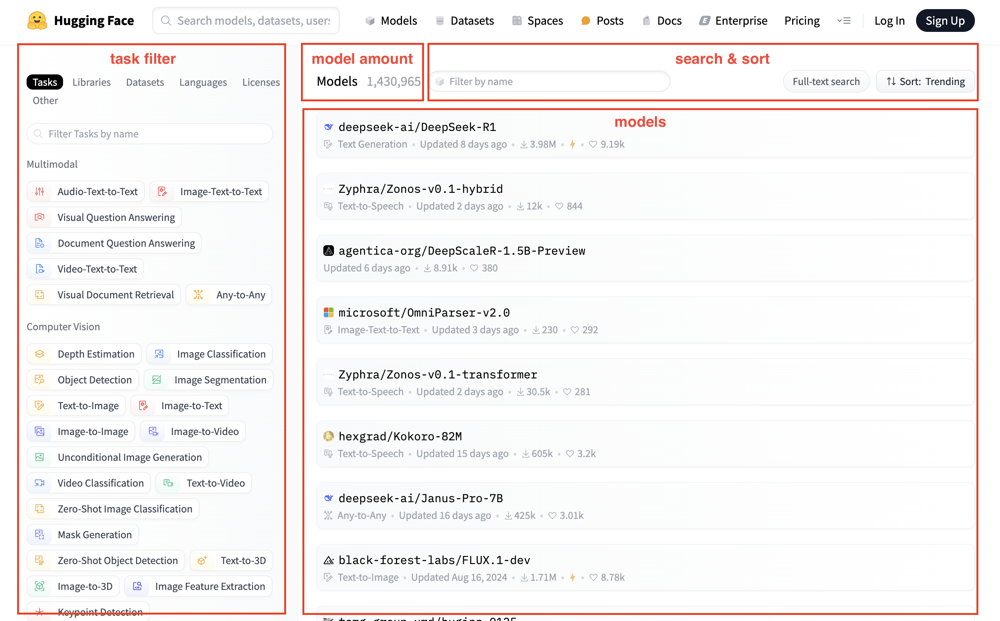
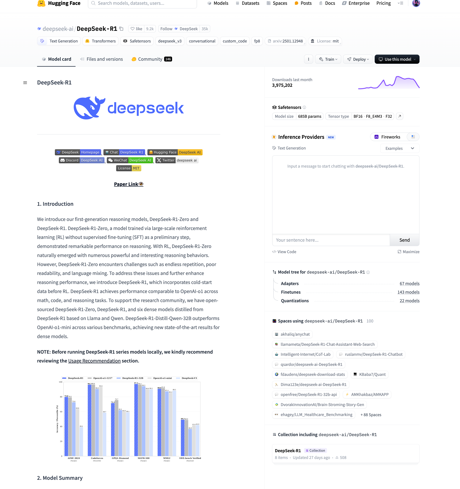
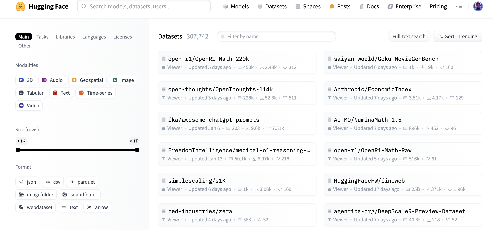
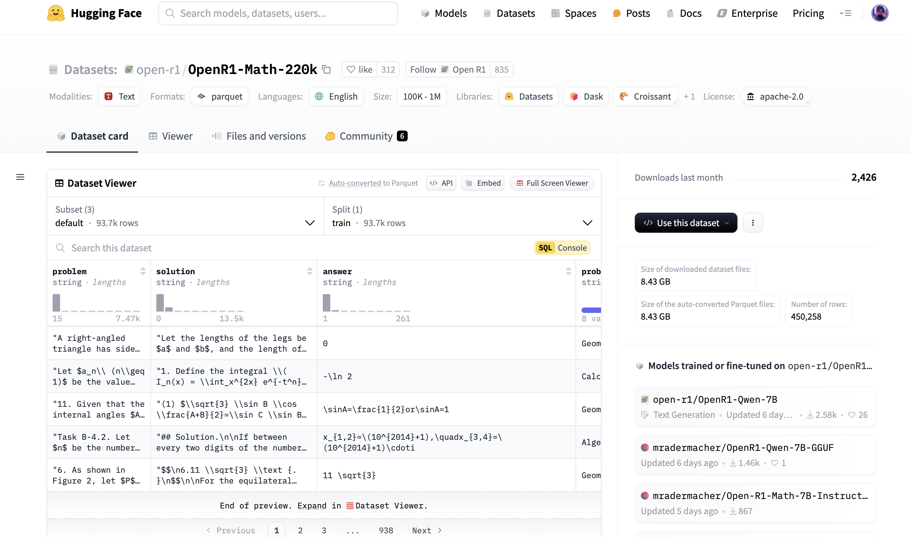

# Hugging Face and Transformers
## 概览
官网：https://huggingface.co/

简介：Hugging Face 是一个专注于自然语言处理（NLP）和人工智能的开源平台，提供了丰富的工具和资源，帮助开发者和研究人员快速构建、训练和部署机器学习模型。

主要功能：
- 模型库 Models
    - 模型下载
    - 模型分享
- 数据集 Datasets
    - 数据集下载
    - 数据集分享
- 分享空间 Spaces
    - 支持 Gradio 和 Streamlit 等工具，快速构建可视化界面
    - 用于展示模型效果、测试模型性能或作为教学工具
- Transformers库
    - Hugging Face 的核心开源库，支持多种深度学习框架（如 PyTorch、TensorFlow）,提供预训练模型的加载、微调和推理功能
- Accelerate库
    - 帮助Pytorch用户很方便的实现 multi-GPU/TPU/fp16
- Daily Papers
    - 提供 AI 领域的最新研究论文，用户可以与作者互动并推荐相关论文
- 文档库 Docs
    - 各种模型算法等说明使用文档
- 课程 Courses
    - https://huggingface.co/learn
- 社区论坛

## Models
模型列表页
- 涵盖了各种任务，可根据任务选择模型，也可以直接搜索模型名称
- 不带前缀是官方提供的模型，带前缀是第三方提供的模型

模型详情页
- Model card: 模型介绍
- File and versions: 模型文件
- Use this model: 使用该模型的样例代码
- Inference Providers: 界面提供
- Model tree: 模型的变体
- Spaces using model: 使用该模型的Space

## Datasets
数据集列表页

数据集详情页

