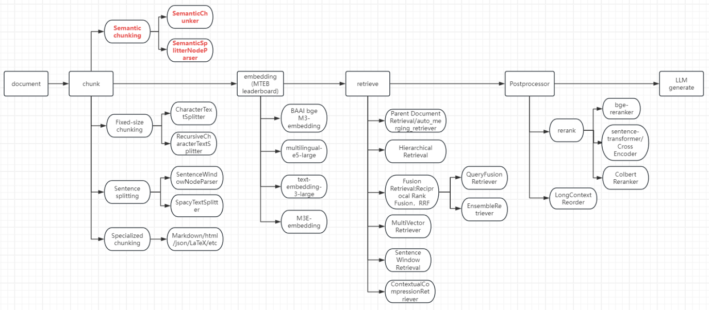
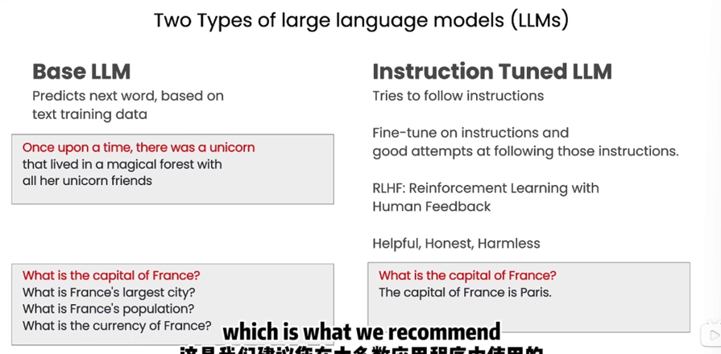

# My Projects
## 思考
能增强LLM的方式：Continue PreTrain, Fine-Tune, RAG。什么时候用什么
## 个人想要做的实践项目
- 面试助手
- 品牌运营（运营podcast,运营youtube,运营小红书,运营哔哩哔哩）
- 个人管理（记录、专注、自律、健康生活）
- 智能爬虫：追踪AI前沿 RSS订阅 DenseHub

### 面试助手（MVP）

事前：

1.从招聘网站收集信息（核心技术点）

做一个自动调研招聘网站JD知识点的功能，根据面试技能点，思考可以怎么改进（和llm聊聊拓宽思路），达到像我手动调研的结果

- 实现调研的自动化
    - 明确需求
        - 让AI辅助思考：根据职位关键词/技能关键词，给一个报告
        - 通过职位关键词查技能关键词
        - 通过技能关键词查职位关键词

2.准备面试（面试准备，算法准备，行为面试准备）

3.投简历和面试记录

4.给全面简历，根据JD生成强相关的一页简历

5.在互联网上，根据公司、JD或根据岗位名称，搜集相关面经，针对性复习

6.根据公司、JD或根据岗位名称，进行模拟面试

事中：

1.录音（有个问题，录下的面试官的声音太小了，几乎听不到）

2.实时辅助面试

事后：

1.事后根据录音总结面试问的问题，并分析评价用户面试的整体情况和每个问题的回答情况

2.将AI作为军师，全过程数据录音转文本让AI分析

补充：

1.英文翻译，把面试官的英文翻译为中文，把候选人的中文翻译为英文

### 智能爬虫：追踪AI前沿
探索：智能爬虫，不管什么网站，自己写代码爬取，自己克服反爬安全验证等（可以做很多事情）

### 个人管理（记录、专注、自律、健康生活）

### 品牌运营（运营podcast,运营youtube,运营小红书,运营哔哩哔哩）

## 项目
弄一个结合agent,graphrag,知识图谱，多模态的项目，并与自己的需求结合起来

实践1：Agent+RAG+Prompt+后端+搜索+知识图谱+多模态+多轮对话+模型API对接

langchain+llamaindex+向量数据库GraghRAG+Ollama+Chainlit UI

实践2：复现Deepseek+模型数据组织/预训练/微调/强化学习+linux+Transformers/Huggingface

- 项目
  - unwindai
    - Build AI Research Agent with Memory to search Academic Papers
      - https://www.theunwindai.com/p/build-ai-research-agent-with-memory-to-search-academic-papers
- 备选可参与的开源项目
  - 视频会议摘要和问答
  - 语音大模型
  - 面试总结
  - 英语雅思助教

会议纪要（录屏/录音->视频或音频）
转文字
内容校对
内容提炼（大标题，小标题，每个小标题有时间戳,生成markdown,甚至生成脑图）

格式调整

基于RAG的本地知识库

https://github.com/1Panel-dev/MaxKB  （基于RAG的本地知识库）

[Github Trending 微信推送机器人](https://blog.csdn.net/m0_73382195/article/details/136061949?ops_request_misc=%257B%2522request%255Fid%2522%253A%25221120f7cb7afe9b292aa00ab1cd0fae6d%2522%252C%2522scm%2522%253A%252220140713.130102334..%2522%257D&request_id=1120f7cb7afe9b292aa00ab1cd0fae6d&biz_id=0&utm_medium=distribute.pc_search_result.none-task-blog-2~all~sobaiduend~default-1-136061949-null-null.142^v101^pc_search_result_base9&utm_term=github%20trending&spm=1018.2226.3001.4187)

GitHubTrendingRSS
Unofficial RSS feed generator for GitHub Trending
项目地址: https://gitcode.com/gh_mirrors/gi/GitHubTrendingRSS

## vector database
### milvus
#### RRF
倒数排名融合

alibaba

### faiss
