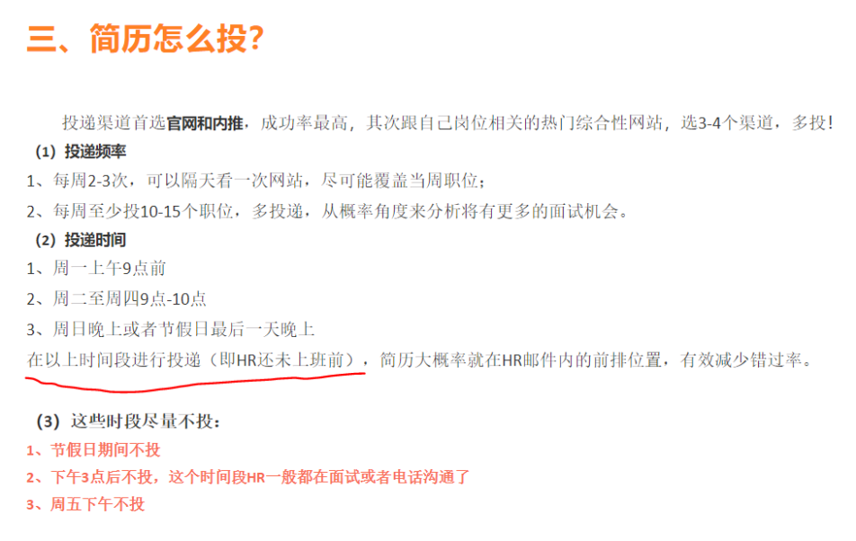
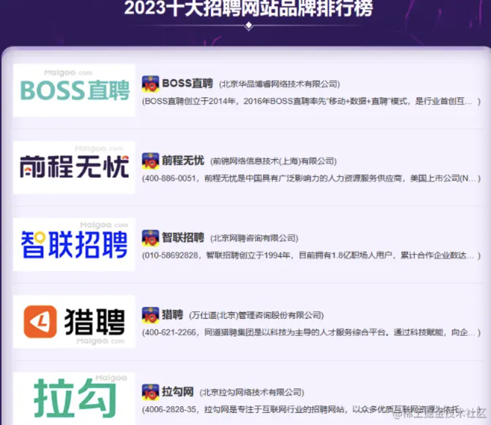

# 找工作平台
## 简历怎么投

## 官网
## 国外平台
- Linkedin 社交和找工作的网站
    - https://www.linkedin.com
    - 维护身份：维护Linkedin的主页Profile和英文简历，设置资料对外公开。hr找人之前可能会看，会有一个好印象。（很多公司招聘平台可以选择从 LinkedIn 直接导入简历，省去了重复填写信息的无效劳动）
    - 找工作：有很多岗位
    - 内推：找linkedin上同一公司相同职位的人内推
    - 推荐指数：5🌟
- Glassdoor
    - https://www.glassdoor.com/Community/index.htm
    - 了解薪资情况和公司情况，可查看很多员工对公司的评价
    - 推荐指数：5🌟
- 电鸭
    - https://eleduck.com/
    - 推荐指数：3🌟
- Github: https://github.com/eliaszon/Programmers-Overseas-Job-Interview-Handbook
    - 可以搜索信息，关键词：remote jobs
    - 推荐指数：3🌟
- Blind
    - https://www.teamblind.com/
    - 国外版脉脉
    - 推荐指数：3🌟
- Monster
    - https://www.monster.lu/en/
    - 没有那么顺手，作为补充
    - 推荐指数：2🌟
- Indeed
    - https://www.indeed.com/
    - 没有那么顺手，作为补充
    - 推荐指数：2🌟
- 德国找工作
    - Xing (Linkedin的德国版本，既是社交网站，又是找工作的网站)
        - https://www.xing.com/
        - 和Linkedin的招聘岗位重复率挺高的，不用额外花时间在这上面
        - 推荐指数：1🌟
    - JobInGermany
        - https://germany.jobsinnetwork.com/

### 投递方式

1.对应官网上投递

2.没有官网的公司，一般需要发邮件给hr, 把所有材料压缩成一个PDF给hr

### 投递资料

1.英文简历（不要放年龄性别照片）

2.求职信/介绍信（模板：[https://anschreiben.com/](https://www.youtube.com/redirect?event=video_description&redir_token=QUFFLUhqbkJ3OVB0TS1Pc0NWcXNxVzRXN3laanB3TkU5UXxBQ3Jtc0tsUlJicUstRDhHRWpsTGlPSWk5T0FTOGo4RXhoZWJOdXM5dWFwak5adWx2SVN6dVVkajU4UVVqOGlFM2dFMWJfeTVncVJPYUdqdUw3am1HblRhYW95cXA0cGIwQlMyU1k3NXlNbWpQZWJBZ09SUWx3aw&q=https%3A%2F%2Fanschreiben.com%2F&v=SgMHV4i0wGs)）

3.简历中提到的证书、材料等一并打包

### 面试成功关键

1.工作经历

2.沟通能力

3.团队合作意识

4.专业技能

### Behavior面试
Amazon

### 面试流程

1.HR面  
1.5. Assignment  
2.技术面  
3.Manager面

准备：

提前写英文稿

- 最成功的案例
- 最失败的案例
- 最困难的案例
- 优点是什么，体现优点的案例
- 缺点是什么，体现缺点的案例
- 和领导同事矛盾冲突的解决案例
- 表现自己领导力、组织力、沟通力的案例
- 怎么学习，有哪些学习途径
- 怎么排查问题

万能模板：

- 问题背景
- 如何解决
- 结果

## 国内平台
建议是 —— **多选几个平台**投放简历！
- 通过上面的岗位分析，发现Boss、智联、猎聘的岗位相对多一点。
- 上面三个平台的的公司交集估计只有20%，也就是说大部分公司只在一个（或两个）平台上发布职位，大公司可能会全平台发布，因此求职建议多几个平台投放。

### 0. 内推：脉脉、牛客网、官网
### 1. BOSS 直聘
**特点**：
- **直聊机制**：求职者可以直接和招聘负责人沟通，无需通过繁琐的第三方流程。
- **职位推荐**：基于算法推荐适合的岗位，减少搜索成本。但是要注意：【已读不回】的情况同样盛行，因此需要有较好的打招呼语。
- **灵活高效**：适合小公司和中型公司招聘，节奏快。

**适用人群**：
更适合求职经验较少的求职者，或希望快速进入小型团队的开发者。但对于大厂或岗位层级较高的求职者，BOSS 直聘的适配度可能会降低。

### 2. 拉勾网
**特点**：
- **专注互联网行业**：平台职位集中在互联网领域，特别是程序员岗位。
- **职位透明**：薪资、福利、岗位要求等信息展示较为详细。公司质量相对较好，真实度也比较高。
- **面试保障**：通过平台发起面试请求，部分公司有较高的反馈率。

**适用人群**：
适合希望进入中型互联网公司的开发者，特别是对薪资透明度要求较高的求职者。不过需要注意拉勾的部分岗位竞争较为激烈，简历通过率会偏低。

### 3. 猎聘
**特点**：
- **中高端岗位**：猎聘更偏向于中高端招聘市场，许多岗位需要一定工作经验。有大量猎头驻扎，帮助推荐合适岗位。
- **猎头资源**：求职者有机会对接猎头，【理论上】可以获得更多高薪和管理岗位机会推荐。
- **职业测评**：平台提供简历优化和职业规划服务。

**适用人群**：
适合有一定工作经验的程序员，想要和猎头接触，尤其是希望向管理岗或高薪岗位转型的求职者。(ps：但是要注意，不能以电视中的猎头来参考实际中的猎头哈！电视与现实区别还是蛮大的😂)

### 4. 前程无忧（51Job）&& 智联招聘
**特点**：
- **传统平台**：两家都是国内较早的招聘平台，行业覆盖面广。不局限于互联网。
- **职位数量多**：尤其是传统行业的岗位，信息丰富。并且具有一件海投的功能
- **企业认证**：在之前智联招聘上虚假岗位很多，并且有很多的岗位虚标。目前，这种情况好了不少

**适用人群**：
适合寻求传统企业或非互联网行业岗位的程序员，但平台整体偏向中小企业，大厂岗位占比相对较少。

### 看公司靠不靠谱
判断一个公司是否靠谱，大概有下面几个角度：
- 公司做什么的？
    - 公司所处行业或主要业务，是toB、toC，还是toG（政府机关），或者是人力外包。如果是toB可能会存在出差、驻场开发等问题，如果是toG（政府机关）可能存在技术老旧、出差等问题。
    - 看企业工商信息的“知识产权”，可以看出公司的一些专利、网站备案、软件著作权。如果专利较多，说明公司的技术实力不错。软件著作权里可以看到公司做的一些软件项目。软件、专利内容也能看出公司的大概的业务范围。
- 公司规模：如成立日期、注册资本、员工数量（参保人数）、是否上市等。
- 公司状况：公司的工商信息、经营状况、知识产权、公司风险等。
    - 公司和员工存在劳务纠纷，需谨慎
- 公司评价：他人对公司的评价（包括薪资、福利等）。
    - 通过看准网看看网友对公司的评价。不过注意既然是来自网友评论，是否准确、客观就很难说了。

查公司信息的工具
- 支付宝-芝麻企业信用，支付宝小程序。同上，不用VIP可以看很多信息。
- 企查查：查企业的工商信息，内容比较丰富、全面。不注册也可查，但注册登录后可看的信息更多一点，基本也就够了，冲了VIP才能看所有信息。
- 爱企查：同上，差不多。
- 看准网、职友集：类似大众点评，不仅能看公司的工商信息（没上面两个网站丰富），还能看网友们的评价、工资信息，都是来自网友的点评分享。

## 体制内（北京&浙江）
- 人设部官网
- 北京市人社局官网-事业单位招考都在这
- 国家电网人力资源招聘
- 中石化人才招聘网
- 各银行官网
	- 银行考试
	- 北京农商行
- 中国电信/联通/移动
- 高校人才网
- 国聘网
	- 军工央企-智元研究院