# 基础
- [基础](#基础)
- [面向对象](#面向对象)
  - [1、Java 语言有哪些特点？](#1java-语言有哪些特点)
  - [2、面向对象](#2面向对象)
    - [（1）面向对象与面向过程（处理问题的不同角度）](#1面向对象与面向过程处理问题的不同角度)
    - [（2）面向对象三大特性：封装、继承、多态](#2面向对象三大特性封装继承多态)
    - [（3）封装](#3封装)
      - [访问修饰符](#访问修饰符)
    - [（4）继承](#4继承)
    - [（5）多态](#5多态)
      - [重载与重写](#重载与重写)
  - [3、接口与抽象类](#3接口与抽象类)
  - [4、Object类的方法](#4object类的方法)
  - [5、final关键字](#5final关键字)
  - [6、final、finally、finalize的区别](#6finalfinallyfinalize的区别)
  - [7、==与equals](#7与equals)
  - [8、hashCode与equals](#8hashcode与equals)
  - [9、深拷贝与浅拷贝](#9深拷贝与浅拷贝)
  - [10、Java创建对象的方式](#10java创建对象的方式)
  - [11、new创建对象的过程了解吗？](#11new创建对象的过程了解吗)
  - [12、反射机制](#12反射机制)
  - [13、序列化](#13序列化)
    - [什么是序列化？什么是反序列化？](#什么是序列化什么是反序列化)
    - [说说有几种序列化方式？](#说说有几种序列化方式)
- [数据类型](#数据类型)
  - [1、Java有哪些数据类型](#1java有哪些数据类型)
  - [2、自动类型转换\&强制类型转换](#2自动类型转换强制类型转换)
  - [3、自动拆箱\&自动装箱](#3自动拆箱自动装箱)
  - [4、switch case的表达式可以是什么类型？](#4switch-case的表达式可以是什么类型)
  - [5、String 类可以被继承吗？](#5string-类可以被继承吗)
  - [6、String、StringBuffer与StringBuilder](#6stringstringbuffer与stringbuilder)
  - [7、String str1 = new String("abc")和 String str2 = "abc" 的区别？](#7string-str1--new-stringabc和-string-str2--abc-的区别)
  - [8、字符串拼接jdk1.8优化](#8字符串拼接jdk18优化)
  - [9、Integer a= 127，Integer b = 127；Integer c= 128，Integer d = 128；，相等吗?](#9integer-a-127integer-b--127integer-c-128integer-d--128相等吗)
  - [10、double与BigDecimal](#10double与bigdecimal)
  - [11、泛型（类型参数化）](#11泛型类型参数化)
- [异常](#异常)
  - [1、Java中异常处理体系](#1java中异常处理体系)
  - [2、异常处理方式](#2异常处理方式)
  - [3、异常处理要点](#3异常处理要点)
  - [4、三道经典异常处理代码题](#4三道经典异常处理代码题)


# 面向对象
## 1、Java 语言有哪些特点？
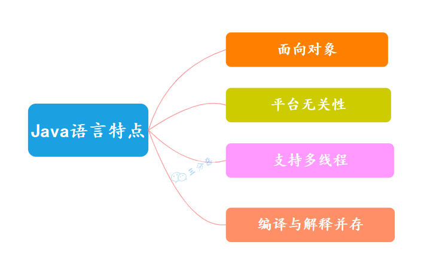 <br/>

- 面向对象（封装、继承、多态） <br/>
- 平台无关性（JVM） <br/>
- 支持多线程（C++语言没有内置的多线程机制，需调用操作系统的多线程功能） <br/>
- 编译与解释并存（先编译为字节码文件，然后JVM分别为各平台进行解释） <br/>
## 2、面向对象
### （1）面向对象与面向过程（处理问题的不同角度）
面向过程更注重事情的每一个步骤及顺序，面向对象更注重事情有哪些参与者（对象）、及各自需要做什么。 <br/>
面向过程：性能好（单片机、嵌入式开发、Linux/Unix考虑性能的一般用面向过程开发） <br/>
面向对象：易维护（低耦合）、易复写（继承）、易扩展（多态） <br/>
### （2）面向对象三大特性：封装、继承、多态
封装：访问修饰符，只暴露需要被外界访问的，隐藏细节，保护机制 <br/>
继承：复用代码，模板 <br/>
多态：父类(或接口)引用指向子类对象。好处：隔离修改；无障碍扩展（修改或扩展都不用动原有的代码） <br/>
### （3）封装
#### 访问修饰符
Java 支持 4 种不同的访问权限。 <br/>
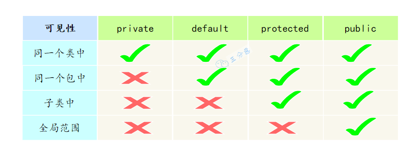 <br/>
### （4）继承
继承有以下三个要点： <br/>

1. ⼦类拥有⽗类对象所有的属性和⽅法（包括私有属性和私有⽅法），但是⽗类中的私有属性和⽅法⼦类是⽆法访问，只是拥有。 <br/>
2. ⼦类可以拥有⾃⼰属性和⽅法，即⼦类可以对⽗类进⾏扩展。 <br/>
3. ⼦类可以⽤⾃⼰的⽅式实现⽗类的⽅法（重写）。 <br/>
### （5）多态
多态的实现形式：继承和接口 <br/>
#### 重载与重写
方法的重载和重写都是实现多态的方式，区别在于前者实现的是编译时的多态性，而后者实现的是运行时的多态性。 <br/>

| 区别点 | 重载 overload | 重写 overwrite |
| --- | --- | --- |
| 定义 | 同一个类中多个同名方法根据不同的传参来执行不同的逻辑处理 | 子类对父类方法的重新改造，外部样子不能改变，内部逻辑可以改变。 |
| 发生范围 | 同一个类 | 子类 |
| 返回值，方法名，参数列表 | 方法名相同，参数列表必须不同（个数，顺序，类型）<br/>返回值可不同 | 返回值类型、方法名、参数列表必须相同 | 
| 发生阶段 | 编译期（重载解析） | 运行期 |
| 异常 | 可不同 | 比父类更小异常。（里氏代换原则）<br/>抛出异常范围要小于等于父类 | 
| 访问修饰符 | 可不同 | 比父类更好访问。<br/>访问修饰符范围大于等于父类。如果父类方法访问修饰符为final,static,private，则子类不能重写，但是被static修饰的方法能够被再次声明。 | 
| 构造方法 | 可重载 | 不可重写 |

## 3、接口与抽象类
设计层面：抽象类（模板设计，代码复用，概念的归纳），接口（行为规范，功能的归纳） <br/>
数量限制：一个类可以实现多个接口，但只能继承一个抽象类。接口可以继承多个接口。 <br/>
变量：接口中除了static和final变量，不能有其他变量；抽象类可以有各种变量 <br/>
方法修饰符:接口方法默认修饰符是public；抽象类方法除了不能是private，其他修饰符均可 <br/>
演变： <br/>
抽象类概念的变化： <br/>
jdk8：抽象类可以有非抽象方法 <br/>
接口概念的变化： <br/>
jdk7及更早版本：接口中只能有常量变量和抽象方法 <br/>
jdk8：接口中可以有默认方法和静态方法 <br/>
jdk9：接口中引入了私有方法和私有静态方法 <br/>
## 4、Object类的方法
Object 类是所有类的父类，也就是说，所有类都可以调用它的方法。 <br/>
它主要提供了以下 11 个方法，大概可以分为六类。 <br/>
 <br/>
## 5、final关键字
final 表示不可变的意思，可用于修饰类、方法和变量： <br/>

- 被 final 修饰的类不可以被继承 <br/>
- 被 final 修饰的方法不可以被重写 <br/>
- 被 final 修饰的变量不可变，被 final 修饰的变量必须被显式的指定初始值。还得注意的是，这里的不可变指的是变量的引用不可变，不是引用指向的内容的不可变。例如： <br/>
```java
final StringBuilder sb = new StringBuilder("abc");
sb.append("d");
System.out.println(sb);  //abcd
```
一张图说明： <br/>
 <br/>
## 6、final、finally、finalize的区别

- final 用于修饰变量、方法和类：final 修饰的类不可被继承；修饰的方法不可被重写；修饰的变量不可变。 <br/>
- finally 作为异常处理的一部分，它只能在 try/catch 语句中，并且附带一个语句块表示这段语句最终一定被执行（无论是否抛出异常），经常被用在需要释放资源的情况下，System.exit (0) 可以阻断 finally 执行。 <br/>
- finalize 是在 java.lang.Object 里定义的方法，也就是说每一个对象都有这么个方法。这个方法在 gc 启动，该对象被回收的时候被调用。一个对象的 finalize 方法只会被调用一次，finalize 被调用不一定会立即回收该对象，所以有可能调用 finalize 后，该对象又不需要被回收了，然后到了真正要被回收的时候，因为前面调用过一次，所以不会再次调用 finalize 了，进而产生问题，因此不推荐使用 finalize 方法。  <br/>
## 7、==与equals
==：看地址是否一致 <br/>
基本数据类型在常量池，JVM做了优化，相同值只保留一份，已经存在就不创建了。引用数据类型在堆，不同对象不一样。 <br/>
equals：默认也是==，比较地址，只有重写了equals才能比较值 <br/>
String默认重写了equals，所以是比较值。自定义类需要自己重写equals。 <br/>
## 8、hashCode与equals
场景：HashSet检查重复，先用hashCode()获取哈希码（也称散列码，一个int整数，将对象的内存地址转换为整数返回），确定在哈希表（散列表）中的位置，如果此位置没有值，就没有重复。如果此位置有值，用equals()检查值是否相等，如果全都不相等，就表明没有重复。 <br/>
作用：大大减少了equals的次数，大大提高了执行速度。 <br/>
为什么重写equals时必须重写hashCode方法： hashCode() 的默认⾏为是对堆上的对象产⽣独特值。如果没有重写 hashCode()，则该 class 的两个对象⽆论如何都不会相等。 <br/>
## 9、深拷贝与浅拷贝
|  | 浅拷贝 | 深拷贝 |
| --- | --- | --- |
| 影响 | 不安全<br/>修改引用对象会影响原对象 | 安全 <br/>修改引用对象不会影响原对象 | 
| 相同点 | 对基本数据类型进⾏值传递 |  |
| 不同点 | 引用同一个对象（只拷贝了引用地址） | 完全拷贝一个对象 |
| 实现 | Object 类提供的clone()方法可以非常简单地实现对象的浅拷贝。 | - 重写clone()方法 <br/>- 序列化：可以先将原对象序列化，再反序列化成拷贝对象。 <br/> | 

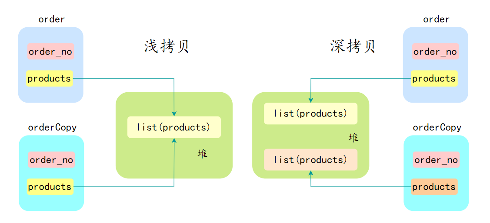 <br/>
## 10、Java创建对象的方式
Java 中有以下四种创建对象的方式: <br/>
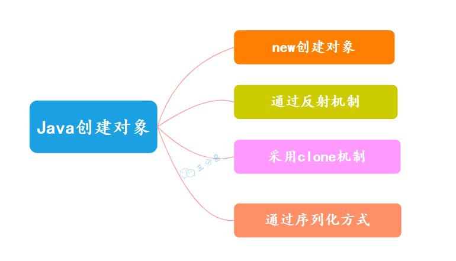 <br/>
前两者都需要显式地调用构造方法。对于 clone 机制,需要注意浅拷贝和深拷贝的区别，对于序列化机制需要明确其实现原理，在Java 中序列化可以通过实现 Externalizable 或者 Serializable 来实现。 <br/>
## 11、new创建对象的过程了解吗？

- 首先检查这个指令的参数是否能在常量池中定位到一个类的符号引用 <br/>
- 检查这个符号引用代表的类是否已被加载、解析和初始化过。如果没有，就先执行相应的类加载过程 <br/>
- 类加载检查通过后，接下来虚拟机将为新生对象分配内存。 <br/>
- 内存分配完成之后，虚拟机将分配到的内存空间（但不包括对象头）进行初始化。 <br/>
- 接下来设置对象头，请求头里包含了对象是哪个类的实例、如何才能找到类的元数据信息、对象的哈希码、对象的 GC 分代年龄等信息。 <br/>

这个过程大概图示如下： <br/>
 <br/>
## 12、反射机制
（1）反射的原理？ <br/>
我们都知道 Java 程序的执行分为编译和运行两步，编译之后会生成字节码(.class)文件，JVM 进行类加载的时候，会加载字节码文件，将类型相关的所有信息加载进方法区，反射就是去获取这些信息，然后进行各种操作。 <br/>
只要能得到.class字节码文件，那么通过反射机制我们不仅能看到.class所对应Java文件中的属性方法等信息，而且还能调用它所对应Java文件里的方法。 <br/>
（2）反射常见用法 <br/>
查看		clazz.getDeclaredFields()/clazz.getDeclaredMethods() <br/>
装载		Class.forName("全类名").newInstance(); <br/>
调用 <br/>
反射最核心的四个类： <br/>
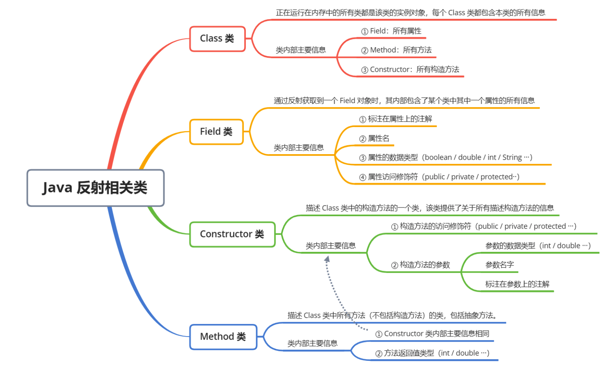 <br/>
## 13、序列化
### 什么是序列化？什么是反序列化？
什么是序列化，序列化就是**把 Java 对象转为二进制流**，方便存储和传输。 <br/>
所以**反序列化就是把二进制流恢复成对象**。 <br/>
 <br/>
序列化和反序列化 <br/>
类比我们生活中一些大件物品的运输，运输的时候把它拆了打包，用的时候再拆包组装。 <br/>
Serializable 接口有什么用？ <br/>
这个接口只是一个标记，没有具体的作用，但是如果不实现这个接口，在有些序列化场景会报错，所以一般建议，创建的 JavaBean 类都实现 Serializable。 <br/>
serialVersionUID 又有什么用？ <br/>
serialVersionUID 就是起验证作用。 <br/>

```java 
private static final long serialVersionUID = 1L;
```
我们经常会看到这样的代码，这个 ID 其实就是用来验证序列化的对象和反序列化对应的对象 ID 是否一致。 <br/>
这个 ID 的数字其实不重要，无论是 1L 还是 IDE 自动生成的，只要序列化时候对象的 serialVersionUID 和反序列化时候对象的 serialVersionUID 一致的话就行。 <br/>
如果没有显示指定 serialVersionUID ，则编译器会根据类的相关信息自动生成一个，可以认为是一个指纹。 <br/>
所以如果你没有定义一个 serialVersionUID， 结果序列化一个对象之后，在反序列化之前把对象的类的结构改了，比如增加了一个成员变量，则此时的反序列化会失败。 <br/>
因为类的结构变了，所以 serialVersionUID 就不一致。 <br/>
Java 序列化不包含静态变量？ <br/>
序列化的时候是不包含静态变量的。 <br/>
如果有些变量不想序列化，怎么办？ <br/>
对于不想进行序列化的变量，使用transient关键字修饰。 <br/>
transient 关键字的作用是：阻止实例中那些用此关键字修饰的的变量序列化；当对象被反序列化时，被 transient 修饰的变量值不会被持久化和恢复。transient 只能修饰变量，不能修饰类和方法。 <br/>
### 说说有几种序列化方式？
Java 序列化方式有很多，常见的有三种： <br/>
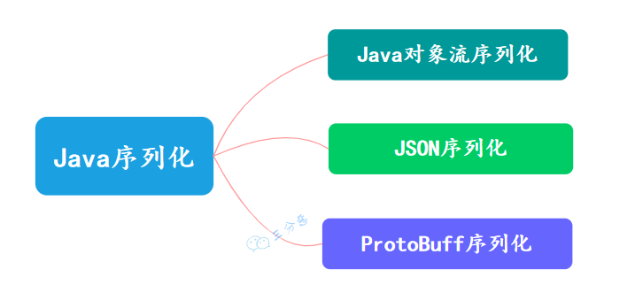 <br/>
Java常见序列化方式 <br/>

- Java 对象序列化 ：Java 原生序列化方法即通过 Java 原生流(InputStream 和 OutputStream 之间的转化)的方式进行转化，一般是对象输出流 ObjectOutputStream和对象输入流ObjectInputStream。 <br/>
- Json 序列化：这个可能是我们最常用的序列化方式，Json 序列化的选择很多，一般会使用 jackson 包，通过 ObjectMapper 类来进行一些操作，比如将对象转化为 byte 数组或者将 json 串转化为对象。 <br/>
- ProtoBuff 序列化：ProtocolBuffer 是一种轻便高效的结构化数据存储格式，ProtoBuff 序列化对象可以很大程度上将其压缩，可以大大减少数据传输大小，提高系统性能。 <br/>
# 数据类型
## 1、Java有哪些数据类型
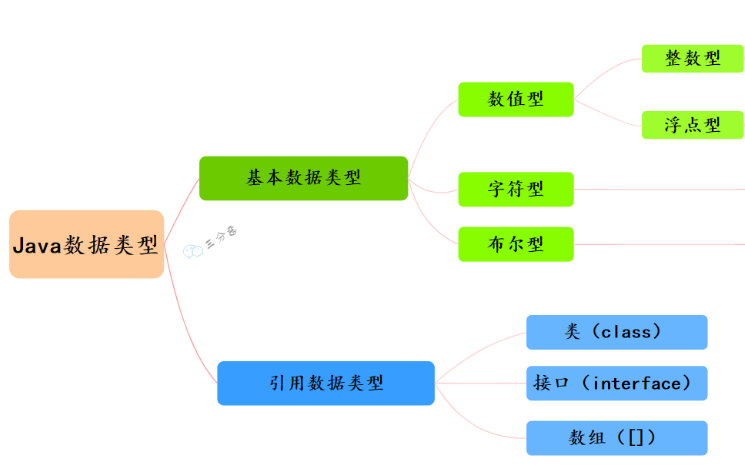 <br/>
8种基本数据类型：byte(1),short(2),int(4),long(8),float(4),double(8),char(2),boolean(1) <br/>
## 2、自动类型转换&强制类型转换
自动类型转换：把小的类型赋值给大的类型，会自动转换 <br/>
强制类型转换：把大的类型赋值给小的类型，要手动进行强制类型转换 <br/>
 <br/>
示例： <br/>
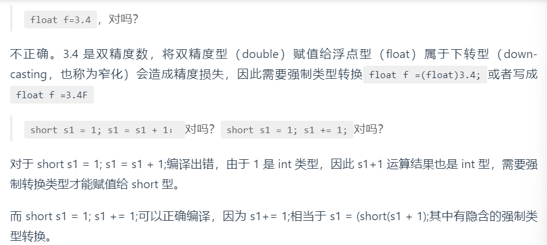 <br/>
## 3、自动拆箱&自动装箱
拆箱：将包装类转为基本数据类型 <br/>
装箱：将基本数据类型转为包装类 <br/>
Java 可以自动对基本数据类型和它们的包装类进行装箱和拆箱 <br/>
 <br/>
```java
Integer i = 10;  //装箱
int n = i;   //拆箱
```
## 4、switch case的表达式可以是什么类型？
可以是byte,short,int,char,enum,String类型 <br/>
不可以是long,float,double,boolean类型 <br/>
新特性：在JDK12后，不再出现case穿透现象，不需要在每个case后加break。还支持用->替代：。 <br/>
## 5、String 类可以被继承吗？
不行。String 类使用 final 修饰，是所谓的不可变类，无法被继承。 <br/>
## 6、String、StringBuffer与StringBuilder
String对象是不可变的，任何修改都会生成新的对象，会造成很大的内存开销，适用操作少量数据 <br/>
StringBuffer线程安全（加了锁），性能较低，适用多线程下操作大量数据 <br/>
StringBuilder线程不安全，性能好，适用单线程下操作大量数据 <br/>
## 7、String str1 = new String("abc")和 String str2 = "abc" 的区别？
 <br/>

|  | String a = new String("abc"); | String b= "abc"; |
| --- | --- | --- |
| 相同点 | 两个语句都会去字符串常量池中检查是否已经存在 “abc”，如果有则直接使用，如果没有则会在常量池中创建 “abc” 对象。 |  |
| 不同点 | 还会在堆里创建一个 "abc" 字符串对象实例 | 没有其他操作了 |
| 创建了几个对象 | 一个或两个。<br/>如果字符串常量池已经有“abc”，则是一个；否则是两个。 | 零个或一个。 <br/>如果字符串常量池已经有“abc”，则是零个；否则是一个。 | 
| 具体处理过程 | 在编译阶段JVM先去常量池中查找是否存在“abc”，如果不存在，则在常量池中开辟一个空间存储“abc”。在运行时期，通过String类的构造器在堆内存中new了一个空间，然后将常量池中的“abc”复制一份存放到该堆空间中，在栈中开辟名字为str2的空间，存放堆中new出来的这个String对象的地址值。 | 在编译期，JVM会去常量池来查找是否存在“abc”，如果不存在，就在常量池中开辟一个空间来存储“abc”；如果存在，就不用新开辟空间。然后在栈内存中开辟一个名字为str1的空间，来存储“abc”在常量池中的地址值。 |
| 引用指向 | 堆 | 常量池 |
| 时间、空间使用 | 多（性能低，耗内存） | 少（性能高，低内存） |

String st1＝“abc”； <br/>
String st2＝“abc”；// 常量池里有，就不再创建，指向常量池的那一个 <br/>
st1＝＝st2 是true <br/>

String st3＝new String（“abc”） <br/>
String st4＝new String（“abc”）// 每写一遍，就会创建一个新对象，指向堆里新创建的对象 <br/>
st3＝＝st4 是false <br/>
## 8、字符串拼接jdk1.8优化
String 的确是不可变的，“**+**”的拼接操作，其实是会生成新的对象。 <br/>
例如： <br/>
```java
String a = "hello ";
String b = "world!";
String ab = a + b;
```
在**jdk1.8 之前**，a 和 b 初始化时位于字符串常量池，ab 拼接后的对象位于堆中。经过拼接新生成了 String 对象。如果拼接多次，那么会生成多个中间对象。 <br/>
内存如下： <br/>
 <br/>
jdk1.8之前的字符串拼接 <br/>
在**Java8 时**JDK 对“+”号拼接进行了优化，上面所写的拼接方式会被优化为基于 StringBuilder 的 append 方法进行处理。Java 会在编译期对“+”号进行处理。 <br/>
下面是通过 javap -verbose 命令反编译字节码的结果，很显然可以看到 StringBuilder 的创建和 append 方法的调用。 <br/>
```java
stack=2, locals=4, args_size=1
     0: ldc           #2                  // String hello
     2: astore_1 
     3: ldc           #3                  // String world! 
     5: astore_2 
     6: new           #4                  // class java/lang/StringBuilder 
     9: dup 
    10: invokespecial #5                  // Method java/lang/StringBuilder."<init>":()V 
    13: aload_1 
    14: invokevirtual #6                  // Method java/lang/StringBuilder.append:(Ljava/lang/String;)Ljava/lang/StringBuilder;
    17: aload_2 
    18: invokevirtual #6                  // Method java/lang/StringBuilder.append:(Ljava/lang/String;)Ljava/lang/StringBuilder; 
    21: invokevirtual #7                  // Method java/lang/StringBuilder.toString:()Ljava/lang/String; 
    24: astore_3 
    25: return
```
也就是说其实上面的代码其实相当于： <br/>
```java
String a = "hello ";
String b = "world!";
StringBuilder sb = new StringBuilder();
sb.append(a); 
sb.append(b); 
String ab = sb.toString(); 
```
此时，如果再笼统的回答：通过加号拼接字符串会创建多个 String 对象，因此性能比 StringBuilder 差，就是错误的了。因为本质上加号拼接的效果最终经过编译器处理之后和 StringBuilder 是一致的。 <br/>
当然，循环里拼接还是建议用 StringBuilder，为什么，因为循环一次就会创建一个新的 StringBuilder 对象，大家可以自行实验。 <br/>
## 9、Integer a= 127，Integer b = 127；Integer c= 128，Integer d = 128；，相等吗?
答案是 a 和 b 相等，c 和 d 不相等。 <br/>
Integer a= 127 这种赋值，是用到了 Integer 自动装箱的机制。 <br/>
自动装箱的时候会判断缓存里是否有（即整型字面量的值在-128 到 127 之间），有的话直接引用缓存池中的 Integer 对象，没有才会创建新的对象。 <br/>
什么是 Integer 缓存？ <br/>
根据实践发现大部分的数据操作都集中在值比较小的范围，因此 Integer 搞了个缓存池，默认范围是 -128 到 127，可以修改缓存的最大值，但最小值改不了。 <br/>
## 10、double与BigDecimal
double <br/>
科学计数法存储 <br/>
float 符号位(1bit) 指数(8 bit) 尾数（有效数字）(23 bit) <br/>
double 符号位(1bit) 指数(11 bit) 尾数(52 bit) <br/>
Java中float的精度为6-7位有效数字。double的精度为15-16位。 <br/>
**float和double的精度是由尾数的位数来决定的**,其整数部分始终是一个隐含着的“1”，由于它是不变的，故不能对精度造成影响。float：2^23 = 8388608，一共七位，由于最左为1的一位省略了，这意味着最多能表示8位数：28388608 = 16777216 。有8位有效数字，但绝对能保证的为7位，也即float的精度为7-8位有效数字；double：2^52 = 4503599627370496，一共16位，同理，double的精度为16-17位。 <br/>
[double为什么丢失精度](https://cloud.tencent.com/developer/article/1468551) <br/>

BigDecimal <br/>
我们在使用BigDecimal时，使用它的BigDecimal(String)构造器创建对象才有意义。其他的如BigDecimal b = new BigDecimal(1)这种，还是会发生精度丢失的问题。 <br/>
我们一般使用BigDecimal来解决商业运算上丢失精度的问题的时候，**声明BigDecimal对象的时候一定要使用它构造参数为String的类型的构造器**。 <br/>
BigDecimal(String)如何做到不丢失精度：String转成字符数组来进行计算的 <br/>
[BigDecimal 一定不会丢失精度吗](https://zhuanlan.zhihu.com/p/147993987) <br/>
## 11、泛型（类型参数化）
Java 泛型了解么？什么是类型擦除？介绍一下常用的通配符？ <br/>
什么是泛型？ <br/>
Java 泛型（generics）是 JDK 5 中引入的一个新特性, 泛型提供了编译时类型安全检测机制，该机制允许程序员在编译时检测到非法的类型。泛型的本质是参数化类型，也就是说所操作的数据类型被指定为一个参数。 <br/>

```java
List<Integer> list = new ArrayList<>();

list.add(12);
//这里直接添加会报错
list.add("a");
Class<? extends List> clazz = list.getClass();
Method add = clazz.getDeclaredMethod("add", Object.class);
//但是通过反射添加，是可以的
add.invoke(list, "kl");

System.out.println(list);
```
泛型一般有三种使用方式:**泛型类**、**泛型接口**、**泛型方法**。 <br/>
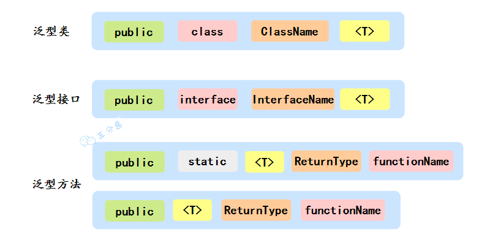 <br/>
泛型类、泛型接口、泛型方法 <br/>
**1.泛型类**： <br/>

```java
//此处T可以随便写为任意标识，常见的如T、E、K、V等形式的参数常用于表示泛型
//在实例化泛型类时，必须指定T的具体类型
public class Generic<T>{ 

    private T key; 

    public Generic(T key) { 
        this.key = key; 
    } 

    public T getKey(){ 
        return key; 
    } 
} 
```
如何实例化泛型类： <br/>

```java
Generic<Integer> genericInteger = new Generic<Integer>(123456); 
```
**2.泛型接口** ： <br/>

```java
public interface Generator<T> { 
    public T method(); 
} 
```
实现泛型接口，指定类型： <br/>

```java
class GeneratorImpl<T> implements Generator<String>{ 
    @Override 
    public String method() { 
        return "hello"; 
    } 
} 
```
**3.泛型方法** ： <br/>

```java
public static < E > void printArray( E[] inputArray ) 
   { 
         for ( E element : inputArray ){ 
            System.out.printf( "%s ", element ); 
         }
         System.out.println();
    } 
```
使用： <br/>

```java
// 创建不同类型数组： Integer, Double 和 Character 
Integer[] intArray = { 1, 2, 3 }; 
String[] stringArray = { "Hello", "World" }; 
printArray( intArray  ); 
printArray( stringArray  ); 
```
泛型常用的通配符有哪些？ <br/>
**常用的通配符为： T，E，K，V，？** <br/>

- ？ 表示不确定的 java 类型 <br/>
- T (type) 表示具体的一个 java 类型 <br/>
- K V (key value) 分别代表 java 键值中的 Key Value <br/>
- E (element) 代表 Element <br/>

什么是泛型擦除？ <br/>
所谓的泛型擦除，官方名叫“类型擦除”。 <br/>
Java 的泛型是伪泛型，这是因为 Java 在编译期间，所有的类型信息都会被擦掉。 <br/>
也就是说，在运行的时候是没有泛型的。 <br/>
例如这段代码，往一群猫里放条狗： <br/>

```java
LinkedList<Cat> cats = new LinkedList<Cat>(); 
LinkedList list = cats;  // 注意我在这里把范型去掉了，但是list和cats是同一个链表！
list.add(new Dog());  // 完全没问题！ 
```
因为 Java 的范型只存在于源码里，编译的时候给你静态地检查一下范型类型是否正确，而到了运行时就不检查了。上面这段代码在 JRE（Java**运行**环境）看来和下面这段没区别： <br/>

```java
LinkedList cats = new LinkedList();  // 注意：没有范型！ <br/>
LinkedList list = cats; <br/>
list.add(new Dog()); <br/>
```
为什么要类型擦除呢？ <br/>
主要是为了向下兼容，因为 JDK5 之前是没有泛型的，为了让 JVM 保持向下兼容，就出了类型擦除这个策略。 <br/>
# 异常
## 1、Java中异常处理体系
Java 的异常体系是分为多层的。 <br/>
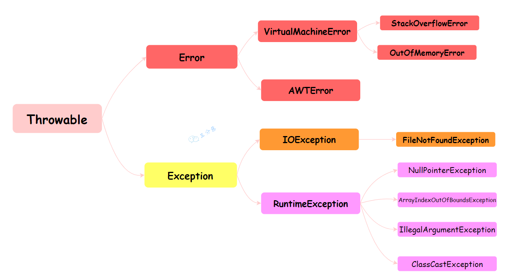 <br/>
Java异常体系 <br/>
Throwable是 Java 语言中所有错误或异常的基类，又分为Error和Exception。 <br/>
Error 是系统内部错误，比如虚拟机异常，是程序无法处理的。 <br/>
Exception是程序问题导致的异常，又分为两种： <br/>

- RuntimeException 运行时异常：程序运行中出现异常 <br/>

Java编译器不会强制必须用try从句捕获它，编译可通过。 <br/>
eg.索引越界异常，空指针异常 <br/>

- CheckedException 受检异常：编译器会强制检查并要求处理的异常。 <br/>

必须进行处理，捕获或抛出，否则报错，编译不通过 <br/>
eg.文件未发现异常 <br/>
## 2、异常处理方式
针对异常的处理主要有两种方式： <br/>
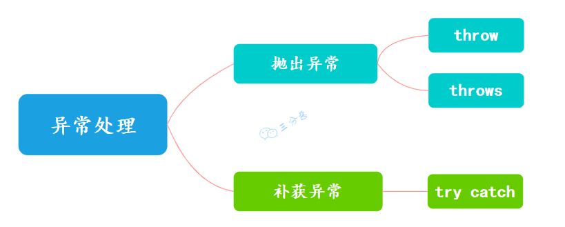 <br/>

- **遇到异常不进行具体处理，而是继续抛给调用者 （throw，throws）** <br/>

抛出异常有三种形式，一是 throw,一个 throws，还有一种系统自动抛异常。 <br/>
throws 用在方法上，后面跟的是异常类，可以跟多个；而 throw 用在方法内，后面跟的是异常对象。 <br/>

- **try catch 捕获异常** <br/>

在 catch 语句块中补货发生的异常，并进行处理。 <br/>
## 3、异常处理要点
（1）try <br/>
应该用多个try.catch.finally来包围应该被监控的代码，对于无须监控的代码，不应受try的影响。 <br/>
反例：try包围了所有代码 <br/>
（2）catch <br/>
在catch中不要只简单地抛出异常，要尽可能地处理异常，尽可能保证业务流程能正常运行，如果是在无法保证，也应友好的告诉用户当前的状况。 <br/>
（3）finally <br/>
finally应当尽可能的回收内存资源：关闭连接对象；关闭IO对象；clear方法清空集合；指向比较大内存空间的obj=null; <br/>
finally一定会执行，之前有return也会执行，除非之前通过System.exit(0);语句终止程序。 <br/>
（4）Exception <br/>
先用专业的异常来处理，最后用Exception异常来处理。如果不用专业的异常处理类，就无法知道异常的具体信息。 <br/>
反例：直接用Exception处理。 <br/>
（5）for循环异常处理 <br/>
要从csv文件中读100条数据，把它们依次插入数据库，即使其中一条有错，也不影响其他插入，从而把影响降到最低。异常处理时不能把for循环包到try里，而是把每次插入动作包到try里。 <br/>
## 4、三道经典异常处理代码题
题目 1 <br/>
```java
public class TryDemo { 
    public static void main(String[] args) { 
        System.out.println(test()); 
    } 
    public static int test() { 
        try { 
            return 1;
        } catch (Exception e) { 
            return 2; 
        } finally { 
            System.out.print("3"); 
        } 
    } 
}
```
执行结果：31。 <br/>
try、catch。finally 的基础用法，在 return 前会先执行 finally 语句块，所以是先输出 finally 里的 3，再输出 return 的 1。 <br/>
题目 2 <br/>
```java
public class TryDemo { 
    public static void main(String[] args) { 
        System.out.println(test1()); 
    } 
    public static int test1() {
        try {
            return 2; 
        } finally {
            return 3;
        }
    } 
} 
```
执行结果：3。 <br/>
try 返回前先执行 finally，结果 finally 里不按套路出牌，直接 return 了，自然也就走不到 try 里面的 return 了。 <br/>
finally 里面使用 return 仅存在于面试题中，实际开发这么写要挨吊的。 <br/>
题目 3 <br/>
```java
public class TryDemo { 
    public static void main(String[] args) { 
        System.out.println(test1()); 
    } 
    public static int test1() { 
        int i = 0; 
        try { 
            i = 2; 
            return i;
        } finally { 
            i = 3; 
        } 
    } 
} 
```
执行结果：2。 <br/>
大家可能会以为结果应该是 3，因为在 return 前会执行 finally，而 i 在 finally 中被修改为 3 了，那最终返回 i 不是应该为 3 吗？ <br/>
但其实，在执行 finally 之前，JVM 会先将 i 的结果暂存起来，然后 finally 执行完毕后，会返回之前暂存的结果，而不是返回 i，所以即使 i 已经被修改为 3，最终返回的还是之前暂存起来的结果 2。 <br/>
