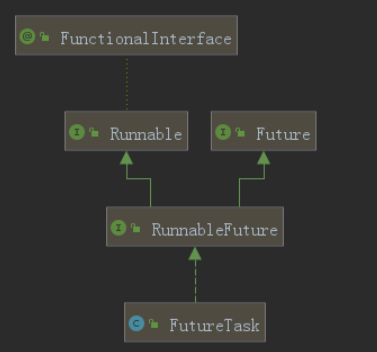
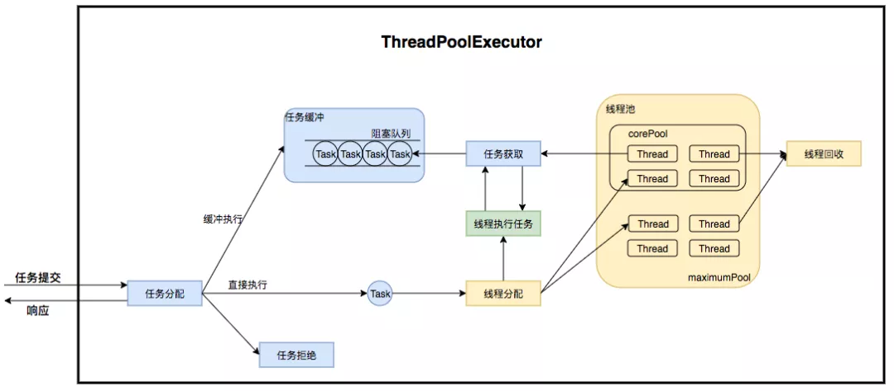

# 并发
## 基础
### 并发
#### 并发与并行
并行：单位时间内，多个任务同时执行

并发：同一时间段，多个任务都在执行 (单位时间内不一定同时执行)

#### 进程、线程与并发
##### 进程让操作系统的并发性成为了可能
###### CPU采用时间片轮转方式运行进程
CPU为每个进程分配一个时间段，称作它的时间片。如果在时间片结束时进程还在运行，则暂停这个进程的运行，并且CPU分配给另一个进程（这个过程叫做上下文切换）。如果进程在时间片结束前阻塞或结束，则CPU立即进行切换，不用等待时间片用完。

使用进程+CPU时间片轮转方式的操作系统，在宏观上看起来同一时间段执行多个任务

如果是单核CPU，宏观上看有多任务在执行，但任意时刻都只有一个任务在占用CPU资源

##### 线程让进程的内部并发成为了可能
不满足于一个进程在一段时间只能做一件事，如果一个进程有多个子任务时，只能逐个得执行这些子任务，很影响效率

比如杀毒软件在检测用户电脑时，如果在某一项检测中卡住了，那么后面的检测项也会受到影响。或者说当你使用杀毒软件中的扫描病毒功能时，在扫描病毒结束之前，无法使用杀毒软件中清理垃圾的功能，这显然无法满足人们的要求。

一个进程包含多个线程，一个线程负责一个单独的子任务

#### 并发编程的好处
避免因I/O操作、网络等原因阻塞

提高程序的执行效率和运行速度，提高系统整体的并发能力和性能

多任务处理

多核时代，提高CPU利用率

#### 并发编程带来的问题
上下文切换

死锁

内存泄漏

受限于硬件和软件的资源闲置问题

### 程序、进程、线程
#### 程序
一段静态代码

程序是静态的

#### 进程
正在运行的程序

进程是动态的

各个进程之间互不干扰

进程是程序的一次执行过程，是系统运行程序的基本单位，因此进程是动态的。系统运行一个程序即是一个进程从创建，运行到消亡的过程。

在 Java 中，当我们启动 main 函数时其实就是启动了一个 JVM 的进程，而 main 函数所在的线程就是这个进程中的一个线程，也称主线程。 在 windows 中通过查看任务管理器的方式，我们就可以清楚看到 windows 当前运行的进程（.exe 文件的运行）。 一个 Java 程序的运行是 main 线程和多个其他线程同时运行。

##### 资源分配的基本单位
单独占有一定的内存地址空间

#### 线程
进程中执行的一个子任务

被称为轻量级进程

线程是一个比进程更小的执行单位。一个进程在其执行的过程中可以产生多个线程。

操作系统调度的基本单位

#### 进程与线程区别
##### 本质区别：是否单独占有内存地址空间及其他系统资源（比如I/O）。各进程是独立的，而同一进程中的线程极有可能会相互影响。
一个进程内的多个线程共享进程的堆和元空间，每个线程有自己的程序计数器，虚拟机栈和本地方法栈（详见JVM）

重要区别：进程是操作系统进行资源分配的基本单位；线程是操作系统调度的基本单位

进程：重量级，开销大；通信复杂，共享复杂，同步简单；可靠性高；
线程：轻量级，开销小；通信简单，共享简单，同步复杂；可靠性低；

### 线程
#### 线程的上下文切换
别称：进程切换/任务切换

CPU时间片轮转，从一个进程或线程切换到另一个进程或线程，保存上一个任务状态并加载下一个任务状态的过程就是一次上下文切换

上下文切换通常是计算密集型的，意味着此操作会消耗大量的 CPU 时间，事实上，可能是操作系统中时间消耗最大的操作，故线程也不是越多越好。如何减少系统中上下文切换次数，是提升多线程性能的一个重点课题。

##### 上下文
###### CPU寄存器
是cpu内部的少量的速度很快的闪存，通常存储和访问计算过程的中间值提高计算机程序的运行速度

###### 程序计数器
是一个专用的寄存器，用于表明指令序列中 CPU 正在执行的位置，存的值为正在执行的指令的位置或者下一个将要被执行的指令的位置，具体实现依赖于特定的系统

#### 线程死锁
##### 

###### 

线程 A 通过 synchronized (resource1) 获得 resource1 的监视器锁，然后通过Thread.sleep(1000);让线程 A 休眠 1s 为的是让线程 B 得以执行，然后获取到 resource2 的监视器锁。线程 A 和线程 B 休眠结束了都开始企图请求获取对方的资源，然后这两个线程就会陷入互相等待的状态，这也就产生了死锁。

##### 产生死锁的4个必要条件
###### 互斥条件（临界资源）
该资源任意一个时刻只能由一个线程占用

###### 请求并持有条件（请求与保持条件）
一个进程因请求资源而阻塞时，对已获得的资源保持不放

###### 不可剥夺条件
线程已获得的资源在末使用完之前不能被其他线程强行剥夺，只有自己使用完毕后才释放资源

###### 循环等待条件
若干进程之间形成一种头尾相接的循环等待资源关系

##### 如何避免死锁
###### 破坏请求与保持条件
一次性申请所有资源

###### 破坏不剥夺条件
占用部分资源的线程进一步申请其他资源时，如果申请不到，可以主动释放它占有的资源 

###### 破坏循环等待条件
按某一顺序申请资源，释放资源则反序释放

##### 怎么排查死锁

### sleep()与wait()
#### 相同点
两者都可以暂停线程的执行

#### 最主要区别
sleep 方法没有释放锁，而 wait 方法释放了锁 （wait释放cpu资源，同时释放锁；sleep释放cpu资源，但是不释放锁，所以易死锁）

#### wait
通常被用于线程间交互/通信

##### 是Object类的非静态方法
为什么 wait() ⽅法不定义在 Thread 中？

wait() 是让获得对象锁的线程实现等待，会⾃动释放当前线程占有的对象锁。每个对象（ Object ）都拥有对象锁，既然要释放当前线程占有的对象锁并让其进⼊ WAITING 状态，⾃然是要操作对应的对象（ Object ）⽽⾮当前的线程（ Thread ）。

wait可以指定时间，也可以不指定

wait()不会自动苏醒，需要notify()或notifyAll()唤醒
wait(timeout)超时后会自动苏醒

wait必须放在同步块或同步方法中

#### sleep
通常被用于暂停执行

##### 是Thread类的静态方法
为什么 sleep() ⽅法定义在 Thread 中？

因为 sleep() 是让当前线程暂停执⾏，不涉及到对象类，也不需要获得对象锁。

sleep必须指定时间

会自动苏醒

sleep可以放在任意位置，不必放同步块里

## 线程和线程池
### Thread类
与创建线程
#### 创建线程的不同方式，实质都是一样的，都是使用了Thread类的构造方法

（Note：Thread类是一个Runnable接口的实现类）
常用3个构造方法
Thread()
Thread(Runnable target) // 参数里的Runnable target可以理解为要执行的任务
Thread(Runnable target, String name) // 指定线程名称

#### 创建线程方式
##### Thread()方法
###### 继承Thread类

##### Thread(Runnable)方法
###### 实现Runnable接口
####### 非函数式编程（老式）
public class Demo {

    public static class MyRunnableImp implements Runnable {
        @Override
        public void run() {
            System.out.println("Hello Thread");
        }
    }

    public static void main(String[] args) {
         Thread myThread = new Thread(new MyRunnableImp());       
         myThread.start();
    }
}

####### 函数式编程（推荐，无须创建一个实现Runnable接口的类）

public class Demo {

    public static void main(String[] args) {
         Thread myThread = new Thread(() -> {
             System.out.println("Hello Thread");
         });
         myThread.start();    
    }
}

###### 实现Callable接口

Callable与Runnable类似，同样是只有一个抽象方法的函数式接口。不同的是，Callable提供的方法是有返回值的，而且支持泛型

public class Demo {

    public static class MyCallableImp implements Callable<Integer> {
        @Override
        public Integer call() {    // 有返回值
            System.out.println("Hello Thread");
            return 1024;
        }
    }

    public static void main(String[] args) {
         FutureTask<Integer> futureTask = new FutureTask<Integer>(new MyCallableImp());
         Thread myThread = new Thread(futureTask);       
         myThread.start();
         while(!futureTask.isDone()) { } // 等futureTask完成后取值
         int result = futureTask.get();
         System.out.println(result); 
    }
}

#### 创建线程方式比较
##### 继承Thread类 < 实现Runnable接口
由于Java“单继承，多实现”的特性，Runnable接口使用起来比Thread更灵活，更符合面向对象，降低了线程对象和线程任务的耦合性

##### 实现Runnable接口 < 实现Callable接口
实现Runnable接口和实现Thread类创建的线程，run方法没有返回值。而有时我们希望执行任务完成后有一个返回值，Callable接口为我们解决了这个问题，这也是所谓的异步模型。

#### 启动线程
调用start()方法后，线程启动

我们在程序里面调用了start()方法后，虚拟机会先为我们创建一个线程，然后等到这个线程第一次得到时间片时再调用run()方法。

注意不可多次调用start()方法。在第一次调用start()方法后，再次调用start()方法会抛出IllegalThreadStateException异常。执行完毕后（处于terminated状态）再次调用也是不可以的。

##### 为什么我们调用 start() 方法时会执行 run() 方法，为什么我们不能直接调用 run() 方法？
###### new 一个 Thread，线程进入了新建状态。调用 start() 方法，会启动一个线程并使线程进入了就绪状态，当分配到时间片后就可以开始运行了。 start() 会执行线程的相应准备工作，然后自动执行 run() 方法的内容，这是真正的多线程工作。 而直接执行 run() 方法，会把 run 方法当成一个 main 线程下的普通方法去执行，并不会在某个线程中执行它，所以这并不是多线程工作。 
一句话概括：调用start方法，JVM会创建一个线程，由新线程执行run方法

#### Thread类
##### Thread类的属性
（线程的属性）
class Thread implements Runnable {
    private volatile String name; // 线程名
    private volatile int threadStatus; // 线程的状态
    private ThreadGroup group; // 线程组
    private int priority; // 线程的优先级
    private Runnable target; // 线程要执行的任务
    private boolean daemon = false; // 是否是守护线程，默认不是
    ThreadLocal.ThreadLocalMap threadLocals; // ThreadLocal相关
    ThreadLocal.ThreadLocalMap inheritableThreadLocals; // ThreadLocal相关
}

###### 细节
####### 线程组
作用：用于对线程的批量控制，起到统一控制线程的优先级和检查线程的权限的作用

每个Thread必然存在于一个ThreadGroup中，Thread不能独立于ThreadGroup存在。
创建线程时可以指定线程组，如果没指定，默认是父线程（当前执行new Thread的线程）的线程组。
线程组还可以包含其他的线程组，不仅仅是线程。线程组是一个树状的结构，每个线程组下面可以有多个线程或者线程组。

####### 线程的优先级
范围是1-10，默认是5，可以指定

优先级高的更大概率会优先执行，但是不可靠，无法保证线程的执行顺序。
因为这里所说的是Java中线程的优先级，并不是操作系统的线程优先级，两者不一定一样（比如有些操作系统只支持3级划分：低，中，高），Java只是给操作系统一个优先级的参考值，操作系统不一定会采纳，线程最终在操作系统的优先级是多少还是由操作系统决定。真正的调用顺序，是由操作系统的线程调度算法决定的。

线程组也有优先级，如果某个线程优先级大于线程所在线程组的最大优先级，那么该线程的优先级将会失效，取而代之的是线程组的最大优先级

####### 守护线程
Java中的线程分为两类，分别为 daemon 线程（守护线程）和 user 线程（用户线程，非守护线程）

main函数所在的线程是一个用户线程，垃圾回收线程是一个守护线程

如果某线程是守护线程，那如果所有的非守护线程都结束了，这个守护线程也会自动结束。

应用场景是：当所有非守护线程结束时，结束其余的子线程（守护线程）自动关闭，就免去了还要继续关闭子线程的麻烦。

一个线程默认是非守护线程，可以通过Thread类的setDaemon(boolean on)来设置。

守护线程默认的优先级比较低

####### 线程的生命周期与基本状态
######## Java线程的6个状态
######### Thread.java

Thread.java

VM.class

######### 细节
########## new 新建
创建了线程，尚未启动，还没调用Thread实例的start()方法

########## runnable 可执行/可运行
对应操作系统线程的ready和running两个状态，将这两个状态统称为 RUNNABLE（运⾏中） 状态

########## blocked 阻塞
等待锁的释放

########## waiting 等待
等待其他线程唤醒

########## timed_waiting 超时等待
等待超时时间到后自动唤醒

########## terminated 终止
执行完毕

######### 线程状态转换

######## 操作系统线程的5个状态
在现在的操作系统中，线程是被视为轻量级进程的，所以操作系统线程的状态其实和操作系统进程的状态是一致的

######### 5个状态
new 新建

########## ready 就绪
等待CPU分配资源

########## running 执行/运行
CPU分配了资源

running状态的下一个状态可能是ready/waiting/terminated。其他状态的下一个状态只有一种选择。

waiting 等待

terminated 终止

####### ThreadLocal
/线程局部变量
/线程本地变量
######## 作用
######### 1、线程间隔离
########## 实现每⼀个线程都有⾃⼰的专属本地变量
########### 

如果你创建了一个ThreadLocal变量，那么访问这个变量的每个线程都会有这个变量的一个本地拷贝，多个线程操作这个变量的时候，实际是操作自己本地内存里面的变量，从而起到线程隔离的作用，避免了线程安全问题。

########### 为什么将ThreadLocal定义在线程外，让多个线程共用一个ThreadLocal呢
因为多个线程都需要有这个变量（都需要同样的功能，例如日志相关的变量），避免每个线程都创建一次变量写重复代码，也为了更好的维护代码

当一个变量，【多个线程都想有该变量】且【多个线程希望该变量只有本线程能操作】时，就把这样的变量定义为ThreadLocal

######### 2、线程内共享（避免不必要的参数传递）
1、使用static修饰ThreadLocal变量，会生成一个ThreadLocal对象，该变量在一个线程内只有一个（多实例共享一个变量，更有利于在线程内共享变量）
2、不使用static修饰ThreadLocal变量，该变量所在的类如果有多个实例对象，会生成多个ThreadLocal对象，该变量在一个线程内会有多个（每个实例用不同的变量，实例间没法共享）

########## 为什么要用static修饰
########### 1、static防止无意义多实例
如果变量ThreadLocal是非static的就会造成每次生成实例都要生成不同的ThreadLocal对象,虽然这样程序不会有什么异常,但是会浪费内存资源.造成内存泄漏

2、为了让多实例共享同一个变量

######## 使用
ThreadLocal类最常用的就是set方法和get方法。

######### 例子
########## 例子1
########### 

从输出中可以看出，虽然 Thread-0 已经改变了 formatter 的值，但 Thread-1 默认格式化值与初始化值相同，其他线程也⼀样。

########## 例子2
输出结果为：
I am Thread1
I am Thread2

######## 实现原理/源码解析
######### ThreadLocalMap的结构
（ThreadLocal 的核心）
########## 

1个Thread里有1个ThreadLocalMap，ThreadLocalMap里存储数据的是一个数组，数组的类型是Entry，Entry是一个键值对，key是ThreadLocal对象的弱引用，可以理解为一个变量 ，value是Object 对象，也可以通过泛型定义为其他类型，如String,Integer,Date等，是该变量的值。

########## 开放地址法的基本思想就是：一旦发生了冲突，那么就去寻找下一个空的地址（下标+1）

######### Thread类里的ThreadLocalMap属性
########## Thread类有一个类型为ThreadLocal.ThreadLocalMap的实例变量threadLocals，每个线程都有一个属于自己的ThreadLocalMap

######### ThreadLocal类里的set方法
从上图ThreadLocal 类的 set() ⽅法可看出，最终的变量是放在了当前线程的ThreadLocalMap 中，并不是存在 ThreadLocal 上， ThreadLocal 可以理解为只是 ThreadLocalMap 的封装，传递了变量值。

######## ThreadLocal 内存泄露问题是怎么导致的？
“弱引用：只要垃圾回收机制一运行，不管JVM的内存空间是否充足，都会回收该对象占用的内存。”（回收的时机是下一次GC的时候）

######### 内存泄露问题
########## 不再使用的key被回收了，value没有被回收
ThreadLocalMap 中使⽤的 key 为 ThreadLocal 的弱引⽤，⽽ value 是强引⽤。所以，如果ThreadLocal 没有被外部强引⽤的情况下（即ThreadLocal Reference这个强引用被销毁后），在垃圾回收的时候，key 会被清理掉，⽽ value 不会被清理掉。这样⼀来， ThreadLocalMap 中就会出现 key 为 null 的 Entry。假如我们不做任何措施的话，value永远⽆法被 GC 回收，这个时候就可能会产⽣内存泄露。 

######### 延伸问题：为什么key要设计成弱引用？
key设计成弱引用同样是为了防止内存泄漏。
假如key被设计成强引用，不再使用的key和value都不会被回收。

每个ThreadLocal对象上有2种引用。一种是强引用（一般有1个强引用），是定义该变量的地方进行的引用。另一种是弱引用（一般有几个线程使用，就有几个弱引用），每个使用该变量的Thread，在其内部的ThreadLocalMap里有对该ThreadLocal对象的弱引用。

解释：如果ThreadLocal Reference被销毁，此时它指向ThreadLocal的强引用就没有了，但是此时key还强引用指向ThreadLocal，就会导致ThreadLocal不能被回收，这时候就发生了内存泄漏的问题

######### 解决
########## ThreadLocalMap 实现中已经考虑了这种情况，在调⽤ set() 、 get() 、 remove() ⽅法的时候，会清理掉 key 为 null 的记录。使⽤完ThreadLocal ⽅法后最好⼿动调⽤ remove() ⽅法

######## 使用场景
######### 资源持有

######### 线程一致

######### 线程安全
########## 

########### Spring 中的单例 Bean 会存在线程安全问题吗？

存在线程安全问题。 因为单例 Bean，是全局只有一个 Bean，所有线程共享。如果说单例 Bean，是一个无状态的，也就是线程中的操作不会对 Bean 中的成员变量执行查询以外的操作，那么这个单例 Bean 是线程安全的。比如 Spring mvc 的 Controller、Service、Dao 等，这些 Bean 大多是无状态的，只关注于方法本身。 假如这个 Bean 是有状态的，也就是会对 Bean 中的成员变量进行写操作，那么可能就存在线程安全的问题。 

############ 如何解决
将 Bean 中的成员变量保存在 ThreadLocal 中。
我们知道 ThredLocal 能保证多线程下变量的隔离，可以在类中定义一个 ThreadLocal 成员变量，将需要的可变成员变量保存在 ThreadLocal 里，这是推荐的一种方式。

########### 那ThreadLocal有什么作用呢？如果只是单纯的想要线程隔离，在每个线程中声明一个私有变量就好了呀，为什么要使用ThreadLocal？

如果开发者希望将类的某个静态变量（user ID或者transaction ID）与线程状态关联，则可以考虑使用ThreadLocal。

最常见的ThreadLocal使用场景为用来解决数据库连接、Session管理等。数据库连接和Session管理涉及多个复杂对象的初始化和关闭。如果在每个线程中声明一些私有变量来进行操作，那这个线程就变得不那么“轻量”了，需要频繁的创建和关闭连接。
cookie、session等等数据隔离都可以通过ThreadLocal去实现。

我们常用的数据库连接池也用到了ThreadLocal：

数据库连接池的连接交给ThreadLoca进行管理，保证当前线程的操作都是同一个Connnection

######### 并发计算

######### ThreadLocal在开源框架中的应用
Quartz

Mybatis

Netty 中的FastThreadLocal 和 Dubbo 中的InternalThreadLocal 都对JDK的 ThreadLocal 进行了增强

######## 扩展：InheritableThreadLocal
######### 作用：父线程给子线程传值
在子线程Thread.init的时候，如果父线程的inheritableThreadLocals不为空，就把它赋给子线程的inheritableThreadLocals

######### 使用
父线程set,子线程get

##### Thread类的常用方法
###### 静态方法
currentThread()：静态方法，返回对当前正在执行的线程对象的引用

sleep()：静态方法，使当前线程睡眠一段时间

yield()：yield在英语里有放弃的意思，同样，这里的yield()指的是当前线程愿意让出对当前处理器的占用。这里需要注意的是，就算当前线程调用了yield()方法，程序在调度的时候，也还有可能继续运行这个线程的

####### interrupted()
检测当前线程是否被中断，与 isInterrupted 不同的是，该方法如果发现当前线程被中断，则会清除中断标志

###### 非静态方法
####### start()：开始执行线程的方法，java虚拟机会调用线程内的run()方法
详见启动线程

####### join()：使当前线程等待另一个线程执行完毕之后再继续执行，内部调用的是Object类的wait方法实现的
join()方法是Thread类的一个实例方法。它的作用是让当前线程陷入“等待”状态，等join的这个线程执行完成后，再继续执行当前线程。

应用场景：
有时候，主线程创建并启动了子线程，如果子线程中需要进行大量的耗时运算，主线程往往将早于子线程结束之前结束。

如果主线程想等待子线程执行完毕后，获得子线程中的处理完的某个数据，就要用到join方法了。

####### interrupt()
中断线程，例如，当线程A运行时，线程B可以调用线程interrupt() 方法来设置线程的中断标志为true 并立即返回。设置标志仅仅是设置标志, 线程A实际并没有被中断， 会继续往下执行。

####### isInterrupted()
检测当前线程是否被中断

##### 线程常用调度方法
###### 

Note：除了wait,notify，notifyAll是Object类的方法，其他都是Thread类的方法

### 线程池与
创建线程池
#### 池化思想
池化技术的思想主要是为了减少每次获取资源的消耗，提⾼对资源的利⽤率。

##### 应用
###### 数据库连接池
预先申请数据库连接，提升申请连接的速度，降低系统的开销

http连接池

线程池

###### 实例池
循环使用对象，减少资源在初始化和释放时的昂贵损耗

Spring的IOC容器

###### 内存池
预先申请内存，提升申请内存速度，减少内存碎片

#### 线程池的好处
##### 降低资源消耗
通过池化技术**重复利用**已创建的线程，降低线程创建和销毁造成的损耗

##### 提高响应速度
任务到达时，无需等待线程创建即可立即执行

##### 控制并发的数量
并发数量过多，可能会导致资源消耗过多，从而造成服务器崩溃。（主要原因）

##### 提高线程的可管理性
线程是稀缺资源，如果无限制创建，不仅会消耗系统资源，还会因为线程的不合理分布导致资源调度失衡，降低系统的稳定性。使用线程池可以**进行统一的分配、调优和监控**。

##### 提供更多更强大的功能
线程池具备可拓展性，允许开发人员向其中增加更多的功能。比如延时定时线程池ScheduledThreadPoolExecutor，就允许任务延期执行或定期执行

#### 线程池在业务中的应用
##### 场景1：快速响应用户请求-IO密集型（尽可能多的处理任务，减少IO阻塞时间）

##### 场景2：快速处理批量任务-CPU密集型（即，计算密集型）（尽量快的处理任务）

阿里巴巴在其《Java开发手册》中也强制规定：线程资源必须通过线程池提供，不允许在应用中自行显式创建线程

#### 创建线程池
##### 方案选择
创建线程池的不同方式，实质都是一样的，都是使用了ThreadPoolExecutor的构造函数

阿里巴巴《Java开发手册》 【强制要求】线程池不允许使用 Executors 去创建，而是通过 ThreadPoolExecutor 的方式，这样的处理方式让写的同学更加明确线程池的运行规则，规避资源耗尽的风险。

Executors创建的线程池存在OOM的风险，Executors 返回的线程池对象的弊端如下：
1） FixedThreadPool 和 SingleThreadPool：允许的请求队列长度为 Integer.MAX_VALUE，可能会堆积大量的请求，从而导致 OOM（out of memery：内存溢出）。
2）CachedThreadPool：允许的创建线程数量为 Integer.MAX_VALUE，可能会创建大量的线程，从而导致 OOM（out of memery：内存溢出）。

所以综上情况所述，我们推荐使用 ThreadPoolExecutor 的方式进行线程池的创建，因为这种创建方式更可控，并且更加明确了线程池的运行规则，可以规避一些未知的风险。

##### ThreadPoolExecutor类提供的4种构造方法（推荐）
###### Java中的线程池顶层接口是Executor接口，ThreadPoolExecutor是这个接口的实现类

顶层接口Executor提供了一种思想：将任务提交和任务执行进行解耦。用户无需关注如何创建线程，如何调度线程来执行任务，用户只需提供Runnable对象，将任务的运行逻辑提交到执行器(Executor)中，由Executor框架完成线程的调配和任务的执行部分

####### 线程池在内部实际上构建了一个生产者消费者模型，将线程和任务两者解耦，并不直接关联，从而良好的缓冲任务，复用线程。线程池的运行主要分成两部分：任务管理、线程管理。任务管理部分充当生产者的角色，当任务提交后，线程池会判断该任务后续的流转：（1）直接申请线程执行该任务；（2）缓冲到队列中等待线程执行；（3）拒绝该任务。线程管理部分是消费者，它们被统一维护在线程池内，根据任务请求进行线程的分配，当线程执行完任务后则会继续获取新的任务去执行，最终当线程获取不到任务的时候，线程就会被回收。
任务管理和线程管理解耦

任务管理：生产者
线程管理：消费者

线程池的本质是对任务和线程的管理，而做到这一点最关键的思想就是将任务和线程两者解耦，不让两者直接关联，才可以做后续的分配工作。线程池中是以生产者消费者模式，通过一个阻塞队列来实现的。阻塞队列缓存任务，工作线程从阻塞队列中获取任务。

###### 4种构造方法
####### 5个参数
5个必须参数

####### 6个参数
在5个必须参数基础上，加上threadFactory

在5个必须参数基础上，加上handler

#######  7个参数
在5个必须参数基础上，加上threadFactory和handler

###### 7个参数

需要重点关注
corePoolSize、
maximumPoolSize、
workQueue、
handler
这四个
####### 5个必须参数
核心线程数 corePoolSize

最大线程数 maximumPoolSize

闲置超时时间 keepAliveTime

keepAliveTime的单位 unit

######## 任务队列 workQueue
######### 常用
########## LinkedBlockingQueue 链式阻塞队列
底层数据结构是链表，默认大小是Integer.MAX_VALUE，也可以指定大小

有界，但默认的大小太大，可以看成无界

##########  ArrayBlockingQueue 数组阻塞队列
底层数据结构是数组，需要指定队列的大小

有界

########## SynchronousQueue 同步队列
内部容量为0，每个put操作必须等待一个take操作，反之亦然

没有任何内部容量，甚至连一个队列的容量都没有，需要区别容量为1的ArrayBlockingQueue、LinkedBlockingQueue

########## DelayQueue 延迟队列
延迟时间到了，才能够从队列中获取元素

无界，没有大小限制

########## PriorityBlockingQueue 优先队列
基于优先级的无界阻塞队列（优先级的判断通过构造函数传入的Compator对象来决定），内部控制线程同步的锁采用的是非公平锁。

######### 扩展：阻塞队列 BlockingQueue（是一个接口）
########## 主要方法

####### 2个非必须参数
######## 线程工厂 threadFactory
创建线程的工厂 ，用于批量创建线程，统一在创建线程时设置一些参数，如是否守护线程、线程的优先级等。如果不指定，会新建一个默认的线程工厂。

######### 推荐使用guava提供的ThreadFactoryBuilder来创建线程池，不仅可以避免OOM的问题，还可以自定义线程名称，更加方便的出错的时候溯源

######## 拒绝策略 handler
AbortPolicy 丢弃任务并抛出异常（默认）

DiscardPolicy 丢弃任务但不抛出异常

DiscardOldestPolicy 丢弃队列头部的任务后执行任务

CallerRunsPolicy 由调用线程执行任务

###### 线程池的线程数怎么配置
/线程池调优
线程在Java中属于稀缺资源，线程池不是越大越好也不是越小越好。任务分为计算密集型（CPU密集型）、IO密集型、混合型。不同类型线程池的参数配置不同，当然，实际应用中没有固定的公式，需要结合测试和监控来进行调整。

####### 计算密集型
计算密集型：大部分都在用CPU跟内存，加密，逻辑操作业务处理等。

######## 配置
计算密集型一般推荐线程池不要过大，一般是CPU数 + 1，+1是因为可能存在页缺失(就是可能存在有些数据在硬盘中需要多来一个线程将数据读入内存)。如果线程池数太大，可能会频繁的进行线程上下文切换跟任务调度。

####### IO密集型

IO密集型：数据库链接，网络通讯传输等。

######## 配置
线程数适当大一点，机器的CPU核心数*2

####### 线程池调优
具体调优案例，可参考美团技术博客

######## 事前评估
线程池配置没有固定的公式，通常事前会对线程池进行一定评估，常见的评估方案如图

######## 事中
结合监控告警机制，分析线程池的问题，或者可优化点，结合线程池动态参数配置机制来调整配置

######## 事后
事后要注意仔细观察，随时调整

####### 动态化线程池
######## 简化线程池配置
线程池构造参数有7个，但是最核心的是3个：corePoolSize、maximumPoolSize，workQueue（队列类型），它们最大程度地决定了线程池的任务分配和线程分配策略。

考虑到在实际应用中我们获取并发性的场景主要是两种：
（1）并行执行子任务，提高响应速度。
这种情况下，应该使用**同步队列**，没有什么任务应该被缓存下来，而是应该立即执行。
（2）并行执行大批次任务，提升吞吐量。
这种情况下，应该使用**有界队列**，使用队列去缓冲大批量的任务，队列容量必须声明，防止任务无限制堆积。

所以线程池只需要提供这三个关键参数的配置，并且提供两种队列的选择，就可以满足绝大多数的业务需求，Less is More。

######## 参数可动态修改
将线程池的参数从代码中迁移到分布式配置中心上，实现线程池参数可动态配置和即时生效

######## 增加线程池监控
对某事物缺乏状态的观测，就对其改进无从下手。在线程池执行任务的生命周期添加监控能力，帮助开发同学了解线程池状态

##### Executors工具类提供的4种静态方法（不推荐）

Note：此处是工具类，不是Executor接口
底层是ThreadPoolExecutor类5个参数的构造方法

###### 

###### 4种
####### CachedThreadPool

######## 适用场景
适用于并发执行大量短期的小任务

######## 特点
1.核心线程数为0
2.最大线程数为Integer.MAX_VALUE，即无限大，可能会因为无限创建线程，导致OOM
3.阻塞队列是SynchronousQueue
4.非核心线程空闲存活时间为60秒

######## 表现
创建临时的非核心线程处理任务，处理完之后60秒没接到下一个任务就销毁。新来的任务找不到临时的非核心线程，就创建一个新的来处理任务

####### SingleThreadPool

######## 适用场景
适用于串行执行任务的场景，一个任务一个任务地执行

######## 特点
核心线程数=最大线程数=1
阻塞队列是无界队列LinkedBlockingQueue，可能会导致OOM

######## 表现
创建唯一的线程处理任务，超出1个的任务放队列

####### FixedThreadPool

######## 适用场景
适用于处理CPU密集型的任务，确保CPU在长期被工作线程使用的情况下，尽可能的少的分配线程，即适用执行长期的任务

######## 特点
核心线程数=最大线程数=n
阻塞队列是无界队列LinkedBlockingQueue，可能会导致OOM

######## 表现
创建固定数量的线程处理任务，超出数量的任务放队列

####### ScheduledThreadPool

######## 

######## 特点
最大线程数为Integer.MAX_VALUE，也有OOM的风险
阻塞队列是DelayedWorkQueue

######## 适用场景
定时任务/计划任务

在给定的延迟之后运行任务

周期性重复执行任务

######## 主要方法

#########  scheduleAtFixedRate
按某种速率周期执行
该方法在initialDelay时长后第一次执行任务，以后每隔period时长，再次执行任务。注意，period是从任务开始执行算起的。开始执行任务后，定时器每隔period时长检查该任务是否完成，如果完成则再次启动任务，否则等该任务结束后才再次启动任务

######### scheduleWithFixDelay
在某个延迟后执行
该方法在initialDelay时长后第一次执行任务，以后每当任务执行完成后，等待delay时长，再次执行任务

###### Cached与Fixed的区别

#### 线程池运作机制

#### 线程池的状态
/线程池的生命周期
/生命周期管理
##### 

###### running
该状态的线程池会接收新任务，并处理阻塞队列中的任务

###### shutdown
该状态的线程池不会接收新任务，但会处理阻塞队列中的任务

###### stop
该状态的线程不会接收新任务，也不会处理阻塞队列中的任务，而且会中断正在运行的任务

###### tidying
该状态表明所有的任务已经运行终止，记录的任务数量为0

###### terminated
该状态表示线程池彻底终止

##### 线程池运行的状态，并不是用户显式设置的，而是伴随着线程池的运行，由内部来维护。线程池内部使用一个变量维护两个值：运行状态(runState)和线程数量 (workerCount)。在具体实现中，线程池将运行状态(runState)、线程数量 (workerCount)两个关键参数的维护放在了一起
private final AtomicInteger ctl = new AtomicInteger(ctlOf(RUNNING, 0));

ctl这个AtomicInteger类型，是对线程池的运行状态和线程池中有效线程的数量进行控制的一个字段， 它同时包含两部分的信息：线程池的运行状态 (runState) 和线程池内有效线程的数量 (workerCount)，高3位保存runState，低29位保存workerCount，两个变量之间互不干扰。用一个变量去存储两个值，可避免在做相关决策时，出现不一致的情况，不必为了维护两者的一致，而占用锁资源。通过阅读线程池源代码也可以发现，经常出现要同时判断线程池运行状态和线程数量的情况。线程池也提供了若干方法去供用户获得线程池当前的运行状态、线程个数。这里都使用的是位运算的方式，相比于基本运算，速度也会快很多。 

## 线程内存模型/
Java内存模型/
JMM(Java Memory Model)
### JMM与Java内存区域划分的区别与联系
#### 区别
两者是不同的概念层次。JMM是抽象的，他是用来描述一组规则，通过这个规则来控制各个变量的访问方式，围绕原子性、有序性、可见性等展开的。而Java运行时内存的划分是具体的，是JVM运行Java程序时，必要的内存划分。

#### 联系
都存在私有数据区域和共享数据区域。一般来说，JMM中的主内存属于共享数据区域，他是包含了堆和方法区；同样，JMM中的本地内存属于私有数据区域，包含了程序计数器、本地方法栈、虚拟机栈。

### 线程共享：主内存
线程私有：工作内存/本地内存
#### 

所有的共享变量都存在主内存中。

每个线程都保存了一份该线程使用到的共享变量的副本

#### 本地内存是JMM的 一个抽象概念，并不真实存在。它其实涵盖了缓存、写缓冲区、寄存器以及其他的硬件和编译器优化
图里面的是一个双核 CPU 系统架构 ，每个核有自己的控制器和运算器，其中控制器包含一组寄存器和操作控制器，运算器执行算术逻辑运算。每个核都有自己的一级缓存，在有些架构里面还有一个所有 CPU 共享的二级缓存。 那么 Java 内存模型里面的工作内存，就对应这里的 Ll 缓存或者 L2 缓存或者 CPU 寄存器。

### JMM控制的规则
#### 背景与存在的问题
这是因为现代计算机为了高效，往往会在高速缓存区中缓存共享变量，因为cpu访问缓存区比访问内存要快得多。

在当前的 Java 内存模型下，线程可以把变量保存本地内存（⽐如机器的寄存器）中，⽽不是直接在主存中进⾏读写。这就可能造成⼀个线程在主存中修改了⼀个变量的值，⽽另外⼀个线程还继续使⽤它在寄存器中的变量值的拷⻉，造成数据的不⼀致。

#### JMM对问题的解决
Java线程之间的通信由Java内存模型（简称JMM）控制。JMM通过控制主内存与每个线程的本地内存之间的交互，来提供内存可见性保证。

根据JMM的规定，线程对共享变量的所有操作都必须在自己的本地内存中进行，不能直接从主内存中读取。线程对本地内存的更新要刷新到主内存中去

##### 案例
如果线程A与线程B之间要通信的话，必须经历下面2个步骤：
线程A将本地内存A中更新过的共享变量刷新到主内存中去。
线程B到主内存中去读取线程A之前已经更新过的共享变量。
所以，线程A无法直接访问线程B的工作内存，线程间通信必须经过主内存。

所以线程B并不是直接去主内存中读取共享变量的值，而是先在本地内存B中找到这个共享变量，发现这个共享变量已经被更新了，然后本地内存B去主内存中读取这个共享变量的新值，并拷贝到本地内存B中，最后线程B再读取本地内存B中的新值。

### 指令重排与happens-before
#### 指令重排
（编译器和处理器）
##### 表现
代码在执⾏的过程中的先后顺序，Java 在编译器以及运⾏期间的优化，代码的执⾏顺序未必就是编写代码时候的顺序

##### 从Java源代码到最终实际执行的指令序列，会经历下面3种重排序

编译器优化的重排序。编译器在不改变单线程程序语义的前提下，可以重新安排语句的执行顺序。

指令级并行的重排序。现代处理器采用了指令级并行技术（Instruction-Level Parallelism，ILP）来将多条指令重叠执行。如果不存在数据依赖性，处理器可以改变语句对应 机器指令的执行顺序。

内存系统的重排序。由于处理器使用缓存和读/写缓冲区，这使得加载和存储操作看上去可能是在乱序执行。

##### 目的：提高性能，减少中断
计算机在执行程序时，为了提高性能，编译器和处理器常常会对指令做重排

##### 为什么指令重排序可以提高性能？
因为可以减少停顿

流水线技术产生了，它的原理是指令1还没有执行完，就可以开始执行指令2，而不用等到指令1执行结束之后再执行指令2，这样就大大提高了效率。

但是，流水线技术最害怕中断，恢复中断的代价是比较大的，所以我们要想尽办法不让流水线中断。指令重排就是减少中断的一种技术。

指令重排对于提高CPU处理性能十分必要。虽然由此带来了乱序的问题，但是这点牺牲是值得的。指令重排可以保证串行语义一致，但是没有义务保证多线程间的语义也一致。所以在多线程下，指令重排序可能会导致一些问题。

##### 指令重拍的限制
happens-before

###### as-if-serial
保证单线程程序的执行结果不被改变

为了遵守as-if-serial语义，编译器和处理器不会对存在数据依赖关系的操作做重排序，因为这种重排序会改变执行结果。但是，如果操作之间不存在数据依赖关系，这些操作就可能被编译器和处理器重排序。

####### 示例

#### JMM平衡【编译器处理器】和【程序员】
一方面，程序员需要JMM提供一个强的内存模型来编写代码；另一方面，编译器和处理器希望JMM对它们的束缚越少越好，这样它们就可以最可能多的做优化来提高性能，希望的是一个弱的内存模型。

JMM考虑了这两种需求，并且找到了平衡点，对编译器和处理器来说，只要不改变程序的执行结果（单线程程序和正确同步了的多线程程序），编译器和处理器怎么优化都行。

而对于程序员，JMM提供了happens-before规则（JSR-133规范），满足了程序员的需求——简单易懂，并且提供了足够强的内存可见性保证。换言之，程序员只要遵循happens-before规则，那他写的程序就能保证在JMM中具有强的内存可见性。

##### 对于未同步的多线程程序，JMM只提供最小安全性。JMM没有保证未同步程序的执行结果与该程序在顺序一致性中执行结果一致。因为如果要保证执行结果一致，那么JMM需要禁止大量的优化，对程序的执行性能会产生很大的影响。
JMM不保证对64位的long型和double型变量的写操作具有原子性

JMM不保证所有线程能看到一致的操作执行顺序。（因为JMM不保证所有操作立即可见）

JMM不保证单线程内的操作会按程序的顺序执行，但是JMM保证单线程下的重排序不影响执行结果

#### happens-before
（程序员）
是一个给程序员使用的规则，只要程序员在写代码的时候遵循happens-before规则，JVM就能保证指令在多线程之间的顺序性符合程序员的预期

在更底层，JMM通过内存屏障来实现内存的可见性以及禁止重排序。为了程序员的方便理解，提出了happens-before，它更加的简单易懂，从而避免了程序员为了理解内存可见性而去学习复杂的重排序规则以及这些规则的具体实现方法。

JMM使用happens-before的概念来定制两个操作之间的执行顺序。这两个操作可以在一个线程以内，也可以是不同的线程之间。因此，JMM可以通过happens-before关系向程序员提供跨线程的内存可见性保证。

如果操作A happens-before操作B，那么操作A在内存上所做的操作对操作B都是可见的，不管它们在不在一个线程。

我们只需要关心happens-before规则，不用关心JVM到底是怎样执行的。只要确定操作A happens-before操作B就行了。

##### Java中天然的happens-before关系

###### 细节
传递性：如果A happens-before B，且B happens-before C，那么A happens-before C

程序顺序规则（单线程保证有序）：【一个线程中的每一个操作】先于【该线程中的任意后续操作】

监视器锁规则：【锁的解锁】先于【随后对这个锁的加锁】

volatile变量规则：【对一个volatile域的写】先于【任意后续对这个volatile域的读】

start规则：如果线程A执行操作ThreadB.start()启动线程B，那么【A线程的ThreadB.start()操作】先于【线程B中的任意操作】

join规则：如果线程A执行操作ThreadB.join()并成功返回，那么【线程B中的任意操作】先于【线程A从ThreadB.join()到操作成功返回】

## 并发编程的三个重要特征/线程内存模型的三大特性
原子性、有序性、可见性是并发编程中非常重要的基础概念，JMM的很多技术都是围绕着这三大特性展开

### 细节
#### 原子性
##### 要么所有的操作都执⾏且不会被中断，要么都不执⾏
看一行代码可以拆分为几个操作，如果是多个操作，就不能保证原子性

###### 常用范例
####### i++
正常情况下，运⾏上⾯的代码理应输出 2500 。但你真正运⾏了上⾯的代码之后，你会发现输出结果可能⼩于 2500

i++等价于i = i+1，是3步的复合操作，不能保证原子性

volatile不能保证原子性

####### 单例模式的双重锁检查实现
详见volatile

保证：synchronized，ReentrantLock，AtomicInteger

#### 可见性
当⼀个变量对共享变量进⾏了修改，那么另外的线程都是⽴即可以看到修改后的最新值

在Java中，使用的是共享内存并发模型。每个线程的栈中的变量是私有的，不会在线程之间共享，也就不会有内存可见性问题，也不受内存模型的影响。而在堆中的变量是共享的，本文称为共享变量，所以内存可见性是针对的共享变量。

保证：synchronized，volatile，final

#### 有序性
对于一个线程的执行代码，从前往后依次执行，单线程下可以认为程序是有序的，但是并发时有可能会发生指令重排

保证：synchronized，volatile

## 并发编程的关键问题
### 两个关键问题
线程间如何通信？即：线程之间以何种机制来交换信息

线程间如何同步？即：线程以何种机制来控制不同线程间操作发生的相对顺序

### 线程通信
#### 方式
##### 线程同步
线程同步是线程之间按照一定的顺序执行

###### 实现
####### 锁
synchronized

volatile

##### 等待/通知机制
wait，notify，notifyAll

##### 信号量
volatile实现信号量

Semaphore

应用场景：多个线程（超过2个）相互合作

##### 管道
管道是基于“管道流”的通信方式。JDK提供了PipedWriter、 PipedReader、 PipedOutputStream、 PipedInputStream。其中，前面两个是基于字符的，后面两个是基于字节流的。

应用场景：使用管道多半与I/O相关，用于线程之间的数据传输

##### 其他通信方式
join方法

ThreadLocal类

## volatile关键字
### 用法
只能用于变量

### 原理
CAS

### 使用场景
#### 作为一个“轻量级”的锁来使用
volatile提供了一种比锁更轻量级的线程间的通信机制

volatile仅仅保证对单个volatile变量的读/写具有原子性，而锁可以保证整个临界区代码的执行具有原子性。所以在功能上，锁比volatile更强大；在性能上，volatile更有优势

#### 禁止指令重排的一些使用场景
##### 单例模式的双重检查（校验）锁实现
双重检查：在加锁前后两次判断uniqueInstance==null

如果这里的变量声明不使用volatile关键字，是可能会发生错误的。它可能会被重排序。如果线程A执行了步骤1和步骤3，但是步骤2还没有执行完。这个时候另一个线程B它会判定instance不为空，然后直接返回了一个未初始化完成的instance！

### 功能
#### 保证变量的可见性（保证可见性）
##### 不使用volatile

使用volatile

##### 实现
当一个线程对volatile修饰的变量进行写操作时，JMM会立即把该线程对应的本地内存中的共享变量的值刷新到主内存

当一个线程对volatile修饰的变量进行读操作时，JMM会立即把该线程对应的本地内存置为无效，从主内存中读取共享变量的值

#### 防止指令重排（保证有序性）
禁止volatile变量与普通变量重排序

##### 实现
###### 内存屏障
硬件层面，内存屏障分两种：读屏障（Load Barrier）和写屏障（Store Barrier）

####### 2个作用
阻止屏障两侧的指令重排序

强制把写缓冲区/高速缓存中的脏数据等写回主内存，或者让缓存中相应的数据失效

####### 策略
在每个volatile写操作前插入一个StoreStore屏障；
在每个volatile写操作后插入一个StoreLoad屏障；
在每个volatile读操作后插入一个LoadLoad屏障；
在每个volatile读操作后再插入一个LoadStore屏障。

####### 屏障分类
Note：Load代表读操作，Store代表写操作

######## 分类
######### LoadLoad屏障
对于这样的语句Load1; LoadLoad; Load2，在Load2及后续读取操作要读取的数据被访问前，保证Load1要读取的数据被读取完毕

######### StoreStore屏障
对于这样的语句Store1; StoreStore; Store2，在Store2及后续写入操作执行前，这个屏障会把Store1强制刷新到内存，保证Store1的写入操作对其它处理器可见

######### LoadStore屏障
对于这样的语句Load1; LoadStore; Store2，在Store2及后续写入操作被刷出前，保证Load1要读取的数据被读取完毕

######### StoreLoad屏障
对于这样的语句Store1; StoreLoad; Load2，在Load2及后续所有读取操作执行前，保证Store1的写入对所有处理器可见。它的开销是四种屏障中最大的（冲刷写缓冲器，清空无效化队列）。在大多数处理器的实现中，这个屏障是个万能屏障，兼具其它三种内存屏障的功能

## synchronized与ReentrantLock
### synchronized与ReentrantLock的区别与联系
#### 联系
都是可重入锁

##### 性能差不多
 在JDK6锁优化以前，synchronized的性能比ReenTrantLock差很多。
但是JDK6开始，增加了适应性自旋、锁消除等，两者性能就差不多了

#### 区别
synchronized 依赖于 JVM（是关键字） ⽽ ReentrantLock 依赖于 API

##### ReentrantLock ⽐ synchronized 增加了⼀些⾼级功能
###### 等待可中断
ReentrantLock 提供了⼀种能够中断等待锁的线程的机制，通过
lock.lockInterruptibly() 来实现这个机制。也就是说正在等待的线程可以选择放弃等待，改为处
理其他事情。

###### 可实现公平锁
ReentrantLock 可以指定是公平锁还是⾮公平锁。⽽ synchronized 只能是⾮公平
锁。所谓的公平锁就是先等待的线程先获得锁。 ReentrantLock 默认情况是⾮公平的，可以通过
ReentrantLock 类的 ReentrantLock(boolean fair) 构造⽅法来制定是否是公平的。

###### 可实现选择性通知
（锁可以绑定多个条件）
synchronized 关键字与 wait() 和
notify() / notifyAll() ⽅法相结合可以实现等待/通知机制。 ReentrantLock 类当然也可以实现，但
是需要借助于 Condition 接⼝与 newCondition() ⽅法。

### synchronized和volatile的区别
1.volatile本质是在告诉jvm当前变量在寄存器中的值是不确定的，需要从主存中读取；synchronized则是锁定当前变量，只有当前线程可以访问该变量，其他线程被阻塞住   

2.volatile仅能使用在变量级别，synchronized则可以使用在变量、方法和代码块

3.volatile不保证原子性，能保证可见性和有序性；synchronized三者都能保证

4.volatile不会造成线程的阻塞，而synchronized会造成线程阻塞

5.volatile不会引起线程上下文的切换和调度，性能要优于锁，总开销要比锁小

### synchronized关键字
首先需要明确的一点是：Java多线程的锁都是基于对象的，Java中的每一个对象都可以作为一个锁。

还有一点需要注意的是，我们常听到的类锁其实也是对象锁。

Java类只有一个Class对象（可以有多个实例对象，多个实例共享这个Class对象），而Class对象也是特殊的Java对象。所以我们常说的类锁，其实就是Class对象的锁。

#### 用法
##### 3种形式

###### 等价写法1：锁是实例对象

等价写法2：锁是Class对象

如果一个线程 A 调用一个实例对象的非静态 synchronized 方法，而线程 B 需要调用这个实例对象所属类的静态 synchronized 方法，是允许的，不会发生互斥现象，因为访问静态 synchronized 方法占用的锁是当前类的锁，而访问非静态 synchronized 方法占用的锁是当前实例对象锁。

#### 作用
##### 保证原子性
被synchronized修饰的类或对象的所有操作都是原子的，因为在执行操作之前必须先获得类或对象的锁，直到执行完才能释放。

##### 保证可见性
synchronized对一个类或对象加锁时，一个线程如果要访问该类或对象必须先获得它的锁，而这个锁的状态对于其他任何线程都是可见的，并且在释放锁之前会将对变量的修改刷新到共享内存当中，保证资源变量的可见性。

##### 保证有序性
synchronized保证了每个时刻都只有一个线程访问同步代码块，也就确定了线程执行同步代码块是分先后顺序的，保证了有序性。

#### 锁膨胀/锁升级
##### Java6对synchronized进行了优化：引入了几种锁的状态，根据锁竞争状况，进行锁升级膨胀的过程
JDK1.6引入了偏向锁，如果只有一个线程，偏向锁即在对象内部存了当前的线程id，该线程释放锁，偏向锁并不会释放，即对象头不会改变，再来加锁，比较线程id是不是自己的，如果是该线程，则直接进入。
 如果多个线程争抢锁，会进行锁升级，把偏向锁升级为轻量级锁。 
如果线程太多了，又会把轻量级锁升级为重量级锁。 
如果未启用偏向锁，锁会直接从无锁升级为轻量级锁 
自适应自旋：根据上一次加锁是否加锁成功以及容易程度来决定自旋多少次，如果自旋后还没获取到锁，就升级为重量级锁

##### 对象头
Java锁都是基于对象的，锁的信息放在对象的对象头里的MarkWord里

##### 过程
无锁->偏向锁->轻量级锁->重量级锁

###### 锁升级过程，这个方向基本上是不可逆的

###### 偏向锁的设置
JVM默认延时4s自动开启偏向锁，可通过 
-XX:BiasedLockingStartupDelay=0 取消延时

如果不要偏向锁，可通过 
-XX:-UseBiasedLocking=false来设置

##### 各种锁的优缺点对比

### ReentrantLock类
#### 使用
一般是lock()和unlock()方法配合try/finally 语句块来完成。

#### 主要功能函数
lock() //阻塞模式获取资源 
‍lockInterruptibly() //如果当前线程未被 中断，则获取锁。
tryLock() //仅在调用时锁未被另一个线程保持的情况下，才获取该锁。
tryLock(time) //在一段时间内尝试获取资源
‍unlock() //释放资源，为了保证一定执行，放在finally中执行。

#### Condition 控制线程通信
Condition 是需要结合具体Lock实现类使用的一种通信类接口。 Condition实例实质上被绑定到一个锁上。要为特定Lock 实例获得Condition 实例，请使用其newCondition() 方法。

##### 常用方法
void await() 
      // 造成当前线程在接到信号或被中断之前一直处于等待状态。
boolean await(long time, TimeUnit unit) 
      // 造成当前线程在接到信号、被中断或到达指定等待时间之前一直处于等待状态。
long    awaitNanos(long nanosTimeout) 
      // 造成当前线程在接到信号、被中断或到达指定等待时间之前一直处于等待状态。
void    awaitUninterruptibly() 
      // 造成当前线程在接到信号之前一直处于等待状态。
boolean awaitUntil(Date deadline) 
      // 造成当前线程在接到信号、被中断或到达指定最后期限之前一直处于等待状态。
void    signal() 
      // 唤醒一个等待线程。
void    signalAll() 
      // 唤醒所有等待线程。

## JUC
### 介绍
java.util.concurrent包：定义了并发编程中很常用的实用工具类。

J.U.C包中很多工具类都是基于AQS实现的

### 

atomic包：原子类：核心是CAS，主要提供了一系列原子变量更新操作的类，提供非阻塞式算法基础

locks包：核心是AQS这个抽象队列同步器框架

并发容器
线程池里的任务队列就是BlockingQueue

执行框架与线程池

并发工具类

### 构成
#### executor
线程池
详见线程和线程池

#### locks
锁
##### AQS
抽象队列同步器（AQS，AbstractQueuedSynchronizer）

###### 字面理解
抽象：抽象类，只实现一些主要逻辑，有些方法由子类实现；
队列：使用先进先出（FIFO）队列存储数据；
同步：实现了同步的功能。

这个类在java.util.concurrent.locks包下⾯

###### 作用
####### 是一个Java线程同步的框架，是JDK中很多锁工具的核心实现框架，使用AQS能简单且高效地构造出应用广泛的同步器，比如我们提到的ReentrantLock，Semaphore，ReentrantReadWriteLock，SynchronousQueue，FutureTask等等皆是基于AQS的
######## 

Semaphore用state表示剩余的许可数量。
CountDownLatch用state表示闭锁的状态，如关闭、打开。

ReentrantLock加锁解锁时API层核心方法的映射关系

ReentrantLock用state表示所有者线程已经重复获取该锁的次数。

###### 实现原理
####### 

####### 组成
######## state
######### 维护了一个volatile int state（代表共享资源）来表示同步状态。（类似红绿灯，控制线程排队或者放行的）
AQS 使用一个 volatile 修饰的 int 类型的成员变量 state 来表示同步状态，修改同步状态成功即为获得锁，volatile 保证了变量在多线程之间的可见性，修改 State 值时通过 CAS 机制来保证修改的原子性

########## 不同的场景下，有不同的意义。

在可重入锁这个场景下，state就用来表示加锁的次数。0表示无锁，每加一次锁，state就加1，释放锁，state就减1。

######## CLH队列
/双向队列
/双向链表队列
/线程同步队列
/FIFO线程等待队列
######### 是个双向链表，有FIFO先进先出特性（多线程争用资源被阻塞时会进入此队列） 来完成资源获取线程的排队工作（线程排队）
CLH队列
 CLH：Craig、Landin and Hagersten队列，是单向链表，AQS中的队列是CLH变体的虚拟双向队列（FIFO）

CLH变体队列
获取不到同步状态，会将节点进行自旋获取锁，自旋一定次数失败后会将线程阻塞，相对于 CLH 队列性能较好

###### 资源共享方式
####### 2种
######## Exclusive 独占模式
资源是独占的，一次只能一个线程获取。如ReentrantLock

######## Share 共享模式
同时可以被多个线程获取，具体的资源个数可以通过参数指定。如Semaphore/CountDownLatch

一般情况下，子类只需要根据需求实现其中一种模式，当然也有同时实现两种模式的同步类，如ReadWriteLock

###### 主要方法
####### 这几个方法都是Final修饰的，说明子类中无法重写它们。我们可以通过修改State字段表示的同步状态来实现多线程的独占模式和共享模式（加锁过程）。

AQS的设计是基于模板方法模式的，以下这些方法并没有在AQS具体实现，而是直接抛出异常（这里不使用抽象方法的目的是：避免强迫子类中把所有的抽象方法都实现一遍，减少无用功，这样子类只需要实现自己关心的抽象方法即可，比如 Semaphore 只需要实现 tryAcquire 方法而不用实现其余不需要用到的模版方法）

isHeldExclusively()：该线程是否正在独占资源。只有用到condition才需要去实现它。

tryAcquire(int)：独占方式。尝试获取资源，成功则返回true，失败则返回false。

tryRelease(int)：独占方式。尝试释放资源，成功则返回true，失败则返回false。

tryAcquireShared(int)：共享方式。尝试获取资源。负数表示失败；正数和0表示成功，0表示没有剩余可用资源，正数表示还有剩余资源。

tryReleaseShared(int)：共享方式。尝试释放资源，如果释放后允许唤醒后续等待结点返回true，否则返回false。

##### 锁的分类
###### 可重入锁和非可重入锁
可重入锁：支持一个线程对资源重复加锁。

synchronized和ReentrantLock都是可重入锁。

###### 公平锁和非公平锁
要根据实际的需求来选择非公平锁和公平锁。

ReentrantLock支持非公平锁和公平锁两种。

####### 公平锁
优：等待锁的线程不会饿死

缺：吞吐效率低

####### 非公平锁
优：吞吐效率高

缺：可能会发生线程饥饿（有一些线程长时间得不到锁）

###### 读写锁和排他锁
####### 排他锁
排他锁在同一时刻只允许一个线程进行访问。

synchronized和ReentrantLock，其实都是“排它锁”。

####### 读写锁
读写锁可以在同一时刻允许多个读线程访问。
内部维护了两个锁：一个读锁，一个写锁。通过分离读锁和写锁，使得在“读多写少”的环境下，大大地提高了性能。

ReentrantReadWriteLock

######## StampedLock
性能是非常优异的，基本上可以取代ReentrantReadWriteLock的作用

StampedLock把读锁分为了“乐观读锁”和“悲观读锁”两种

ReentrantReadWriteLock会发生“写饥饿”的现象，但StampedLock不会。它是怎么做到的呢？它的核心思想在于，在读的时候如果发生了写，应该通过重试的方式来获取新的值，而不应该阻塞写操作。这种模式也就是典型的无锁编程思想，和CAS自旋的思想一样。这种操作方式决定了StampedLock在读线程非常多而写线程非常少的场景下非常适用，同时还避免了写饥饿情况的发生。

###### 轻量级锁和重量级锁
####### 轻量级锁
CAS、无锁、自旋锁、乐观锁、轻量级锁、compareAndSwap、compareAndSet

####### 重量级锁
synchronized、同步锁、互斥锁、悲观锁、重量级锁

##### ReentrantLock与Condition
详见synchronized和ReentrantLock

#### collections
并发集合容器

ConcurrentHashMap

ConcurrentLinkedQueue

ConcurrentLinkedDeque

##### CopyOnWrite容器
（写时复制的容器）
并发场景常用设计思想——写入时复制思想

适用“读多写少”的并发场景

原理：对容器进行写操作时，不改变原容器，而是写入复制的新容器里，最后将原容器引用指向新容器

（add操作：先把原容器进行copy，然后在新的副本上进行“写操作”，最后再切换引用，在此过程中是加了锁的；
remove操作：将remove元素之外的其他元素拷贝到新的副本中，然后再将原容器的引用指向新的副本中，因为remove操作也是“写操作”所以也是要加锁的）

优点：无须加锁，实现读写分离。无需任何同步措施，大大增强了读的性能。
（遍历线程非安全的List(如：ArrayList和 LinkedList)的时候，若中途有别的线程对List容器进行修改，那么会抛出ConcurrentModificationException异常，CopyOnWrite避免了该异常）

###### 缺点
每次执行写操作都会将原容器进行拷贝一份，数据量大的时候，内存会存在较大的压力，可能会引起频繁Full GC

在写操作执行过程中，读不会阻塞，但读取到的却是老容器的数据。如果希望写入的数据马上能准确地读取，请不要使用CopyOnWrite容器

###### 实现
CopyOnWriteArrayList

CopyOnWriteArraySet

#### aotmic
##### CAS与原子操作
###### 乐观锁与悲观锁
乐观锁（CAS）多用于“读多写少“的环境，避免频繁加锁影响性能；而悲观锁多用于”写多读少“的环境，避免频繁自旋失败和重试影响性能。

乐观锁没有锁的存在，不可能出现死锁

###### CAS（Compare And Swap）
CAS是一种原子操作，它是一种系统原语，是一条CPU的原子指令，从CPU层面保证它的原子性

####### Java实现CAS的原理
Unsafe类提供了相关的native方法

public final class Unsafe {
    public final native boolean compareAndSwapObject(Object var1, long var2, Object var4, Object var5);

    public final native boolean compareAndSwapInt(Object var1, long var2, int var4, int var5);

    public final native boolean compareAndSwapLong(Object var1, long var2, long var4, long var6);
}

####### CAS经典三大问题

######## ABA问题
######### 解决
加版本号或时间戳

Java提供了AtomicStampReference类，它的compareAndSet方法首先检查当前的对象引用值是否等于预期引用，并且当前印戳（Stamp）标志是否等于预期标志，如果全部相等，则以原子方式将引用值和印戳标志的值更新为给定的更新值

######## 循环性能开销
描述：自旋CAS，如果一直循环执行，一直不成功，会给CPU带来非常大的执行开销

解决：限制自旋次数，超过一定次数，就停止自旋

######## 只能保证一个变量的原子操作
######### 解决
改用锁来保证操作的原子性

将多个变量封装成一个对象，通过AtomicReference来保证原子性

###### 原子操作类
JDK提供了一些用于原子操作的类，在java.util.concurrent.atomic包下面

这个底层就是调用了Unsafe类的方法来实现的

####### 

在Atomic包里一共提供了12个类，属于4种类型的原子更新方式

####### 分类
######## 原子更新基本类型
AtomicBoolean

AtomicInteger

AtomicLong

######## 原子更新数组
AtomicIntegerArray

AtomicLongArray

AtomicReferenceArray

######## 原子更新对象（引用）
######### AtomicReference
把多个变量放到一个对象里面进行CAS操作

AtomicStampedReference

AtomicMarkableReference

######## 原子更新字段（属性）
AtomicIntegerFieldUpdater

AtomicLongFieldUpdater

AtomicReferenceFieldUpdater

#### tools
并发工具类

##### Semaphore
/信号量
限制线程的数量
用来控制同时访问特定资源的线程数量

用途：可以用于做流量控制，特别是公用资源有限的应用场景，比如数据库连接

###### 原理
Semaphore内部有一个继承了AQS的同步器Sync，重写了tryAcquireShared方法。在这个方法里，会去尝试获取资源。

如果获取失败（想要的资源数量小于目前已有的资源数量），就会返回一个负数（代表尝试获取资源失败）。然后当前线程就会进入AQS的等待队列。

##### CountDownLatch、
 CyclicBarrier与Phaser
###### CountDownLatch 
/闭锁
/倒数计数器
CountDown代表计数递减，Latch是“门闩”的意思。也有人把它称为“屏障”。

假设某个线程在执行任务之前，需要等待其它线程完成一些前置任务，必须等所有的前置任务都完成，才能开始执行本线程的任务。

原理：内部同样是一个继承了AQS的实现类Sync

CountDownLatch是一个同步工具类，它允许一个或多个线程一直等待，直到其他线程的操作执行完后再执行 CountDownLatch是通过一个计数器来实现的，当我们在new 一个CountDownLatch对象的时候需要带入该计数器值，该值就表示了线程的数量。每当一个线程完成自己的任务后，计数器的值就会减1。当计数器的值变为0时，就表示所有的线程均已经完成了任务，然后就可以恢复等待的线程继续执行了。

####### 使用场景
######## 需要等待某个条件达到要求后才能做后面的事情；
一个或多个线程等待其他线程完成操作
等所有玩家都上线之后，才能开打

######## 细分
协调子线程结束动作：等待所有子线程运行结束

协调子线程开始动作：统一各线程动作开始的时机

####### 主要方法
countDown()： count减一
getCount()：获取count
await()：等待count为0，如果没有到达0，就只有阻塞等待了。
await(timeout)：可以设置超时时间

需要注意的是构造器中的计数值（count）实际上就是闭锁需要等待的线程数量。这个值只能被设置一次，而且CountDownLatch没有提供任何机制去重新设置这个计数值。

###### CyclicBarrier
/同步屏障
“循环的屏障”。前面提到了CountDownLatch一旦计数值count被降为0后，就不能再重新设置了，它只能起一次“屏障”的作用。而CyclicBarrier拥有CountDownLatch的所有功能，还可以使用reset()方法重置屏障。

实现原理：实现原理和CountDownLatch完全不同，CyclicBarrier内部使用的是Lock + Condition实现的等待/通知模式

最核心的方法，仍然是await()

如果当前线程不是第一个到达屏障的话，它将会进入等待，直到其他线程都到达，除非发生被中断、屏障被拆除、屏障被重设等情况

###### CyclicBarrier和CountDownLatch区别

Phaser

##### Exchanger
/交换者
两个线程交换数据

用途：Exchanger也可以用于校对工作，比如我们需要将纸制银行流水通过人工的方式录入成电子银行流水，为了避免错误，采用AB岗两人进行录入，录入到Excel之后，系统需要加载这两个Excel，并对两个Excel数据进行校对，看看是否录入一致

Exchanger一般用于两个线程之间更方便地在内存中交换数据，因为其支持泛型，所以我们可以传输任何的数据，比如IO流或者IO缓存。

两个线程通过 exchange方法交换数据，如果第一个线程先执行exchange()方法，它会一直等待第二个线程也执行exchange方法，当两个线程都到达同步点时，这两个线程就可以交换数据，将本线程生产出来的数据传递给对方

###### 特性
此类提供对外的操作是同步的；
用于成对出现的线程之间交换数据；
可以视作双向的同步队列；
可应用于基因算法、流水线设计等场景。

那么问题来了，Exchanger只能是两个线程交换数据吗？那三个调用同一个实例的exchange方法会发生什么呢？答案是只有前两个线程会交换数据，第三个线程会进入阻塞状态。

需要注意的是，exchange是可以重复使用的。也就是说。两个线程可以使用Exchanger在内存中不断地再交换数据。

