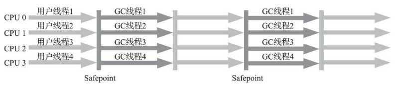
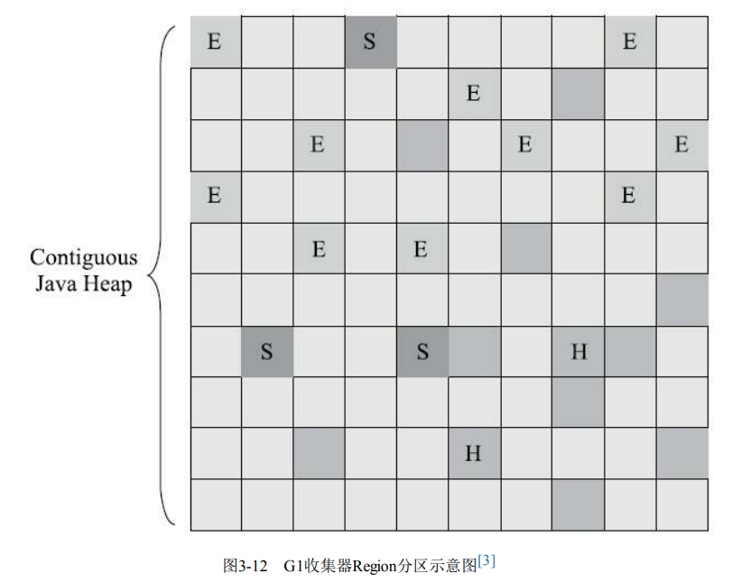

# JVM
## 1、概述
### Java技术体系
#### 优点
##### 平台无关性&语言无关性

###### 平台无关性
一次编译，到处运行

各硬件平台有针对性的JVM，可以将同一份字节码文件解释为对应平台的机器码

###### 语言无关性
任何能编译成字节码文件的语言，都能被JVM运行。JVM 只认识 .class 文件，它不关心是何种语言生成了 .class 文件，只要 .class 文件符合 JVM 的规范就能运行。 目前已经有 JRuby、Jython、Scala 等语言能够在 JVM 上运行。它们有各自的语法规则，不过它们的编译器都能将各自的源码编译成符合 JVM 规范的 .class 文件，从而能够借助 JVM 运行它们。

Java 语言中的各种变量、关键字和运算符号的语义最终都是由多条字节码命令组合而成的， 因此字节码命令所能提供的语义描述能力肯定会比 Java 语言本身更加强大。
因此，有一些 Java 语言本身无法有效支持的语言特性，不代表字节码本身无法有效支
持。

###### 为什么说 Java 语言“编译与解释并存”？
####### 

##### 自动化内存管理
###### 内存自动分配与内存回收（垃圾收集）技术
避免了绝大部分内存泄漏和指针越界问题

##### 热点代码检测和运行时编译及优化
运行时间增长可获得更高性能

##### 完善的应用程序接口
丰富的第三方类库

#### 组成
##### 编程语言
狭义：Java

广义：Java、Kotlin、Scala、Clojure、JRuby、Groovy等可运行于JVM上的编程语言

各硬件平台的JVM实现

Class文件格式

Java类库API

第三方类库

### JDK、JRE、JVM

### Java发展史
发布 1995年

Java SE 8(LTS)   2014年3月

Java SE 11(LTS)   2018年9月

Java SE 17(LTS)  2021年9月

Java SE 21(LTS)  2023年9月

### Java虚拟机
#### 标准规范
JVM有多种实现版本，都要遵循统一的标准规范

#### 实现
##### HotSpot虚拟机
使用范围最广的JVM

HotSpot，顾名思义，是基于热点代码探测的，有JIT即时编译功能，能提供更高质量的本地代码

#### JVM体系架构
HotSpot JVM Architecture
主要包括3个组件

##### 类装载子系统 Class Loader Subsystem
类加载过程

类加载器

##### 运行时数据区 Runtime Data Areas
内存模型

##### 字节码执行引擎 Execution Engine
###### Interpreter 解释器
顺序读取并执行字节码指令

###### JIT (Just In Time Compiler) 即时编译
抵消了Interpreter执行速度慢的缺点并提高了性能。 JIT编译器同时编译字节码的类似部分（热点代码），从而减少了编译所需的总时间。

###### GC（Garbage Collection）
引用分类

判断对象是否存活

垃圾收集算法

垃圾收集器

JVM性能调优

## 2、类加载机制
### Class文件结构
Class 文件是二进制文件，它的内容具有严格的规范，文件中没有任何空格，全都是连续的0/1。Class 文件中的所有内容被分为两种类型：无符号数、表。

       无符号数：无符号数表示 Class 文件中的值，这些值没有任何类型，但有不同的长度。u1、u2、u4、u8 分别代表 1/2/4/8 字节的无符号数。
       表：由多个无符号数或者其他表作为数据项构成的复合数据类型。

#### 构成
##### 魔数
1-4字节

表示Class文件类型

16 进制表示的“CAFE BABE”

##### 版本信息
###### 5-8字节
5-6 次版本号

7-8 主版本号

###### 表示JDK版本
高版本的 JDK 能向下兼容以前版本的 Class 文件，但不能运行以后版本的 Class 文件，即使文
件格式并未发生任何变化，虚拟机也必需拒绝执行超过其版本号的 Class 文件

##### 常量池
###### 字面值常量
字面值常量就是我们在程序中定义的字符串、被 final 修饰的值

###### 符号引用
符号引用就是我们定义的各种名字：类和接口的全限定名、字段的名字和描述符、方法的名字和描述符

##### 访问标志
识别一些类或者接口层次的访问信息，包括：这个 Class 是类还是接口；是否定义为 public 类型；是否被 abstract/final修饰

类索引、父类索引、接口索引集合

##### 字段表集合
存储本类涉及到的成员变量，包括实例变量和类变量，但不包括方法中的局部变量

方法表集合

##### 属性表集合
方法表的属性表集合中有一张 Code 属性表，用于存储当前方法经编译器编译后的字节码指令

### 类加载过程/类的生命周期
类加载过程即是指JVM虚拟机把.class文件中类信息加载进内存，并进行解析生成对应的class对象的过程。
JVM不是一开始就把所有的类都加载进内存中，而是只有第一次遇到某个需要运行的类时才会加载，且只加载一次。（JVM在执行某段代码时，遇到了class A， 然而此时内存中并没有class A的相关信息，于是JVM就会到相应的class文件中去寻找class A的类信息，并加载进内存中，这就是我们所说的类加载过程。）

类加载过程包括5个阶段：加载、验证、准备、解析、初始化

类的生命周期包括7各阶段：类加载5个阶段、使用、卸载

验证、准备、解析3个阶段统称为连接

#### 5个阶段
##### 加载：把class字节码文件从各个来源通过类加载器装载入内存中
###### “加载”是“类加载”过程的一个阶段，不能混淆这两个名词。在加载阶段，虚拟机需要完成 3 件
事：
1、通过类的全限定名获取该类的二进制字节流。
2、将二进制字节流所代表的静态结构转化为方法区的运行时数据结构。
3、在内存中（堆中）创建一个代表该类的 java.lang.Class 对象，作为方法区这个类的各种数据的访问入口。
获取二进制字节流/字节码来源途径：
1、从 zip 包中读取，如 jar、war等
2、从网络中获取，如 Applet
3、通过动态代理技术生成代理类的二进制字节流
4、由 JSP 文件生成对应的 Class 类
5、从数据库中读取，如 有些中间件服务器可以选择把程序安装到数据库中来完成程序代码在
集群间的分发。

##### 验证：主要是为了保证加载进来的字节流符合虚拟机规范，不会造成安全错误

###### 文件格式验证
验证字节流是否符合 Class 文件格式的规范，并且能被当前版本的虚拟机处理

比如常量中是否有不被支持的常量？文件中是否有不规范的或者附加的其他信息？

###### 元数据验证
比如该类是否继承了被final修饰的类？类中的字段，方法是否与父类冲突？是否出现了不合理的重载？

###### 字节码验证
本阶段是验证过程中最复杂的一个阶段，是对方法体进行语义分析，保证方法在运行时不会出现危害虚拟机的事件。

###### 符号引用验证
比如校验符号引用中通过全限定名是否能够找到对应的类？校验符号引用中的访问性（private，public等）是否可被当前类访问？

##### 准备
###### 为类变量（或称静态变量或静态成员变量，被static修饰的变量）分配内存并赋零值

Note：注意不是实例变量
扩展：类变量和局部变量的区别

类变量会赋零值，局部变量不会赋零值，如果局部变量没有被初始化就会编译报错

示例：此时A==0

##### 解析
###### 将常量池中的符号引用（类、接口、字段和方法的符号引用）替换为直接引用
两个重点：

####### ● 符号引用。即一个字符串，但是这个字符串给出了一些能够唯一性识别一个方法，一个变量，一个类的相关信息。
符号引用与虚拟机实现的内存布局无关，引
用的目标并不一定是已经加载到虚拟机内存当中的内容。

####### ● 直接引用。可以理解为一个内存地址，或者一个偏移量。
直接引用是可以直接指向目标的指针、相对偏移量或者是一个能间接定位到目标的句柄。

直接引用是和虚拟机实现的内存布局直接相关的，同一个符号引用在不同虚拟机实例上翻译出来的直接引用一般不会相同。如果有了直接引用，那引用的目标必定已经在虚拟机的内存中存在。

虚拟机实现可以对第一次解析的结果进行缓存，譬如在运行时直接引用常量池中的记录，并把常量标识为已解析状态，从而避免解析动作重复进行。

举个例子来说，现在调用方法hello()，这个方法的地址是1234567，那么hello就是符号引用，1234567就是直接引用。

在解析阶段，虚拟机会把所有的类名，方法名，字段名这些符号引用替换为具体的内存地址或偏移量，也就是直接引用。

##### 初始化：对类的静态变量初始化
###### 执行所有用户自定义的初始值赋值操作

初始化阶段就是执行类构造器<clinit>()方法的过程。<clinit>()并不是程序员在Java代码中直接编写的方法，它是Javac编译器的自动生成物，<clinit>()方法是由编译器自动收集类中的所有类变量的赋值动作和静态语句块（static{}块）中的
语句合并产生的，【执行赋值操作和类的静态代码块来初始化静态成员变量】
示例：在此阶段，执行了A=1后又执行了A=2（所有的用户自定义的初始值都在初始化阶段赋值），执行顺序是文件中出现的顺序

编译器收集的顺序是由语句在源文件中出现的顺序决定的，静态语句块中只能访问
到定义在静态语句块之前的变量，定义在它之后的变量，在前面的静态语句块可以赋值，但是不能访
问

·<clinit>()方法对于类或接口来说并不是必需的，如果一个类中没有静态语句块，也没有对变量的
赋值操作，那么编译器可以不为这个类生成<clinit>()方法

Java 虚拟机规范没有强制约束类加载过程的第一阶段（即：加载）什么时候开始，但对于“初
始化”阶段，有着严格的规定。有且仅有 5 种情况必须立即对类进行初始化

###### 主动引用与被动引用
这 5 种场景中的行为称为对一个类进行主动引用，除此之外，其它所有引用类的方式都不会触
发初始化，称为被动引用。

####### 被动引用情形举例
通过子类引用父类的静态字段，不会导致子类初始化。

对于静态字段，只有直接定义这个字段的类才会被初始化，因此通过其子类来引用父类中定义
的静态字段，只会触发父类的初始化而不会触发子类的初始化。

通过数组定义来引用类，不会触发此类的初始化。

不会触发数组类型的初始化，但会触发“[L 全类名”这个类的初始化，它由虚拟机自动生
成，直接继承自 java.lang.Object，创建动作由字节码指令 newarray 触发。

常量在编译阶段会存入调用类的常量池中，本质上并没有直接引用到定义常量的类，因此不会触发定义常量的类的初始化，调用类和定义常量的类在编译成 Class 之后就没有任何联系了。

###### 5种情形
在遇到 new、putstatic、getstatic、invokestatic 字节码指令时，如果类尚未初始化，则需要先触发其初始化。

对类进行反射调用时，如果类还没有初始化，则需要先触发其初始化。

初始化一个类时，如果其父类还没有初始化，则需要先初始化父类。
如果同时包含多个静态变量和静态代码块，则按照自上而下的顺序依次执行。

虚拟机启动时，用于需要指定一个包含 main() 方法的主类，虚拟机会先初始化这个主类。

当使用 JDK 1.7 的动态语言支持时，如果一个 java.lang.invoke.MethodHandle 实例最后的解析结果为 REF_getStatic、REF_putStatic、REF_invokeStatic 的方法句柄，并且这个方法句柄所对应的类还没初始化，则需要先触发其初始化。

加载、验证、准备、初始化和卸载这 5 个阶段的顺序是确定的，类的加载过程必须按照这种顺
序按部就班地开始（注意是“开始”，而不是“进行”或“完成”），
而解析阶段则不一定：它在某些情况下可以在初始化后再开始，这是为了支持 Java 语言的运行时绑定。
加载阶段与连接阶段的部分内容交叉进行，加载阶段尚未完成，连接阶段可能已经开始了。但这两个阶段的开始时间仍然保持着固定的先后顺序。

#### 接口的加载过程 vs 类加载过程 
接口加载过程与类加载过程稍有不同。
当一个类在初始化时，要求其父类全部都已经初始化过了，但是一个接口在初始化时，并不要
求其父接口全部都完成了初始化，当真正用到父接口的时候才会初始化。

#### 类加载机制和spring中Bean的生命周期
##### 执行main方法之前
###### 编译
当使用IntelliJ IDEA等集成开发环境（IDE）编写Java源代码时，编译通常是在您点击运行按钮执行main方法之前自动进行的，IDEA会在后台自动调用Java编译器（javac）来编译更新后的源代码

修改代码的同时就进行了编译，这样可以立即检查和纠正语法错误和其他编译错误

##### 执行main方法
###### 类加载机制和spring中Bean的生命周期
####### 执行main方法后会触发类加载过程，同时如果使用了Spring框架，也会涉及到Spring Bean的生命周期，包括实例化（其实是3步的组合）、属性填充、初始化和销毁等阶段。具体如下：
######## 类加载结果：将字节码文件加载到内存中，生成对应的Class对象。
######### 加载
########## 在堆中为Class对象分配内存，生成Class对象
Class对象是类加载后在内存中的一个数据结构，包含了类的结构信息，如类的字段、方法、父类、接口等，可以通过反射机制获取类相关的信息，包括字段、方法、注解等。通过该对象，可以对类进行实例化、调用方法和访问字段等操作。

验证

######### 准备
赋零值

解析

######### 初始化
赋初始值

######## Spring Bean的实例化（其实是3步的组合）：
为对象在堆内存中分配内存空间，给属性赋默认值，执行构造函数
在Spring框架中，当Spring容器创建一个Bean的实例时，它会按照以下步骤进行：

######### 分配内存：Spring容器为Bean对象分配所需的内存空间。这是通过在堆内存中分配一块内存来实现的。内存大小取决于Bean的实例变量和方法所占用的空间。
分配内存

######### 给属性赋零值：在分配内存之后，Spring容器会为Bean的属性赋予默认值。这些默认值可以是基本数据类型的默认值（如0、false、null），也可以是引用类型的默认值（如null）。这些默认值可以在后续的属性填充阶段中被覆盖或修改。
赋零值

######### 执行构造函数：在分配内存和属性赋默认值之后，Spring容器会调用Bean的构造函数来创建Bean的实例。构造函数是初始化对象的方法，它可以进行一些必要的设置和初始化操作。构造函数执行后，Bean的实例就被创建并保存在内存中。
赋初始值

######## 属性注入/属性填充
通过set方法为属性赋值

######## 初始化
执行init方法（Note:这个不是构造函数，init方法是一个普通方法）

#### Java类的初始化顺序
##### 待排序项：
Java 父类构造函数，父类静态成员变量，父类普通成员变量，父类静态代码块，父类代码块，
子类构造函数 子类静态成员变量，子类普通成员变量，子类静态代码块，子类代码块

###### 结论
####### 无继承
静态成员变量（类加载过程的连接阶段的准备阶段）》静态代码块（类加载过程的初始化阶段）
》成员变量》代码块》构造函数（Bean的实例化。Note：SpringBean的生命周期中在实例化之后的属性注入和初始化，可以视为都是Spring自己调用的普通方法实现的）

####### 有继承
父类静态成员变量》父类静态代码块》子类静态成员变量》子类静态代码块
》父类成员变量》父类代码块》父类构造函数
》子类成员变量》子类代码块》子类构造函数

##### 没有继承情况下
1. 执行顺序 
    1. 静态成员变量
    2. 静态代码块
    3. 普通成员变量
    4. 普通代码块
    5. 构造函数

2. 总结：

        1. 静态->普通
        2. 变量->代码块->构造函数
        3. 构造函数是最后执行的

3. 代码简易实现：

    public class Father {

        private static String name = "zct";
        private int age = 50;

        {
            System.out.println("father age: "+age);
            System.out.println("father 我是普通代码块");
        }

        static{
            System.out.println("father static name: "+name);
            System.out.println("father 我是静态代码块");
        }

        public Father(){
            System.out.println("father 我是构造函数");
        }

    }

4. 测试：

    @org.junit.Test
    public void test(){
      Father father = new Father();
    }

5. 测试结果：

    father static name: zct
    father 我是静态代码块
    father age: 50
    father 我是普通代码块
    father 我是构造函数

##### 有继承情况下
1. 执行顺序 
    1. 父类的静态成员变量
    2. 父类的静态代码块
    3. 子类的静态成员变量
    4. 子类的静态代码块
    5. 父类的成员变量
    6. 父类的代码块
    7. 父类的构造函数
    8. 子类的成员变量
    9. 子类的代码块
    10. 子类的构造函数

2. 总结：

    1. 先静态再普通，先父类再子类
    如果子类有静态成员变量和静态代码块，则执行完父类的静态成员变量和静态代码块后，接着执行子类的静态变量和静态代码块，
    否则直接按照父类的变量->代码块->构造函数，再执行子类的变量->代码块->构造函数
    需要注意的是子类的静态变量和静态代码块是优先于父类的普通成员变量和代码块以及构造函数的。

3. 代码简易实现：

    public class Son extends Father{

        private static String name = "zlc";
        private int age = 26;
        {
            System.out.println("son age: "+age);
            System.out.println("son 我是普通代码块");
        }

        static{
            System.out.println("son static name: "+name);
            System.out.println("son 我是静态代码块");
        }

        public Son(){
            System.out.println("son 我是构造函数");
        }
    }   

4. 测试：

    @org.junit.Test
    public void test(){
        Son son = new Son();
    }

5. 测试结果：

    father static name: zct
    father 我是静态代码块
    son static name: zlc
    son 我是静态代码块
    father age: 50
    father 我是普通代码块
    father 我是构造函数
    son age: 26
    son 我是普通代码块
    son 我是构造函数

### 类加载器
#### 判断类是否相同
任意一个类，都由加载它的类加载器和这个类本身一同确立其在 Java 虚拟机中的唯一性

同一个类，被不同类加载器加载出来，会是不同的两个类

#### 加载器种类
系统提供了3种类加载器。也可以自定义类加载器。

##### 3种类加载器
###### 启动类加载器 
Bootstrap Class Loader
负责加载 <JAVA_HOME>\lib 目录中的所有
类库

###### 平台类加载器 
Platform Class Loader
负责加载 <JAVA_HOME>\lib\ext 目录中的所有
类库

原本的扩展类加载器Extension Class Loader，JDK9改了，引入模块，改为平台类加载器

###### 应用程序类加载器/系统类加载器 
Application Class Loader
负责加载用户类路径（classpath）上所指定的类库

程序中默认的类加载器

#### 双亲委派模型
描述类加载器之间的层次关系

目的：确保每个类的唯一

工作过程：优先委派给父类去加载，父类无法加载，则自己尝试加载

在 java.lang.ClassLoader 中的 loadClass() 方法中实现该过程。

##### 如何破坏双亲委派机制
如果不想打破双亲委派模型，就重写 ClassLoader 类中的 findClass() 方法即可，无法被父类加载器加载的类最终会通过这个方法被加载

如果想打破双亲委派模型则需要重写 loadClass()方法

#### 扩展：Tomcat 的类加载机制
Tomcat 是主流的 Java Web 服务器之一，为了实现一些特殊的功能需求，自定义了一些类加载器。

Tomcat类加载器

Tomcat 实际上是破坏了双亲委派模型的。

Tomact 是 web 容器，可能需要部署多个应用程序。不同的应用程序可能会依赖同一个第三方类库的不同版本，但是不同版本的类库中某一个类的全路径名可能是一样的。如多个应用都要依赖 hollis.jar，但是 A 应用需要依赖 1.0.0 版本，但是 B 应用需要依赖 1.0.1 版本。这两个版本中都有一个类是 com.hollis.Test.class。如果采用默认的双亲委派类加载机制，那么无法加载多个相同的类。

所以，Tomcat 破坏了双亲委派原则，提供隔离的机制，为每个 web 容器单独提供一个 WebAppClassLoader 加载器。每一个 WebAppClassLoader 负责加载本身的目录下的 class 文件，加载不到时再交 CommonClassLoader 加载，这和双亲委派刚好相反。

## 3、自动内存管理
### 内存区域划分
#### 划分为5个部分

JDK1.8 元空间替代了方法区。元空间不在虚拟机中，而是使用本地内存。

#### 线程私有区

生命周期：随线程生死，随方法出入栈
##### 虚拟机栈 VM Stack
（服务于：执行Java方法，也就是执行字节码）
###### 栈帧内存空间
虚拟机栈描述的是Java方法执行的内存模型：每个Java方法被执行的时候，JVM都会同步创建一个栈帧（Stack Frame）。每一个方法从被调用到执行完毕的过程，就对应着一个栈帧在虚拟机栈中从入栈到出栈的过程。

####### 存放
局部变量表

######## 操作数栈
放临时的操作数，操作完成后出栈赋值给局部变量

动态链接

方法出口信息

###### 两类异常状况
####### StackOverflowError
栈深度超过允许的最大深度

####### OutOfMemoryError
无法申请到足够内存

HotSpot不会进行栈的动态扩展，但每个方法初次申请如果内存不够，会报OOM

##### 本地方法栈/C栈 Native Method Stack
（服务于：执行虚拟机本地（Native）方法，很多Native方法都是用C语言实现的）
HotSpot虚拟机把本地方法栈和虚拟机栈合二为一了

##### 程序计数器 Program Counter Register
###### 定义
当前线程所执行的字节码的行号指示器

执行Java方法时，程序计数器的值为正在执行的虚拟机字节码指令的地址；执行本地（Native）方法时，程序计数器值为空（Undefined）

###### 作用
字节码解释器通过改变程序计数器来依次读取字节码指令，从而实现代码的流程控制

多线程场景，线程上下文切换后，程序计数器确保线程恢复到正确的执行位置

###### 特点
是一块较小的内存空间

唯一一个不会出现OOM的内存区域

#### 线程共享区
##### 堆 Heap
存放实例对象

###### 对象一定分配在堆中吗？有没有了解逃逸分析技术？
并不是所有实例对象都分配在堆上。现在，由于即时编译技术的进步，尤其是逃逸分析技术的日渐强大，栈上分配、标量替换优化手段使得实例对象不分配在堆上。
####### 逃逸分析
在编译期间，JIT 会对代码做很多优化。其中有一部分优化的目的就是减少内存堆分配压力，其中一种重要的技术叫做逃逸分析。

目的：看是否能进行优化，将对象不分配在堆上，从而减少堆内存的分配压力

######## 定义
逃逸分析是指分析指针动态范围的方法，它同编译器优化原理的指针分析和外形分析相关联。当变量（或者对象）在方法中分配后，其指针有可能被返回或者被全局引用，这样就会被其他方法或者线程所引用，这种现象称作指针（或者引用）的逃逸(Escape)。

通俗讲：局部对象被外部（外部方法，外部线程）所调用

######## 逃逸强度

######### 不逃逸

######### 方法逃逸
当一个对象被 new 出来之后，它可能被外部所调用，如果是作为参数传递到外部了，就称之为方法逃逸。

######### 线程逃逸
如果对象还有可能被外部线程访问到，例如赋值给可以在其它线程中访问的实例变量，这种就被称为线程逃逸。

####### 逃逸分析后的优化点
######## 栈上分配

适用：不逃逸&方法逃逸
如果确定一个对象不会逃逸到线程之外，那么就可以考虑将这个对象在栈上分配，对象占用的内存随着栈帧出栈而销毁，这样一来，垃圾收集的压力就降低很多。

######## 同步消除

适用：不逃逸&方法逃逸
线程同步本身是一个相对耗时的过程，如果逃逸分析能够确定一个变量不会逃逸出线程，无法被其他线程访问，那么这个变量的读写肯定就不会有竞争， 对这个变量实施的同步措施也就可以安全地消除掉。

######## 标量替换

适用：不逃逸
如果一个数据是基本数据类型，不可拆分，它就被称之为标量。把一个 Java 对象拆散，将其用到的成员变量恢复为原始类型来访问，这个过程就称为标量替换。假如逃逸分析能够证明一个对象不会被方法外部访问，并且这个对象可以被拆散，那么可以不创建对象，直接用创建若干个成员变量代替，可以让对象的成员变量在栈上分配和读写。

###### 细分
####### 经典分代
######## 部分垃圾收集器共同设计风格
Eden : From Survivor : To Survivor=8:1:1

1）new出来的对象先放Eden区
2）Eden区满了，就把Eden区存活对象copy到From Survivor区（Minor GC）
3）Eden区和From Survivor区满了，就把两个区存活对象copy到To Survivor区（Minor GC）
4）年轻代空间都满了，就把年轻代存活对象copy到年老代（Minor GC）
5）年老代满了，启动Full GC，对所有3代进行全面回收，耗时很长

####### 不采用分代
部分垃圾收集器的设计风格

####### 线程私有的分配缓冲区（TLAB，Thread Local  Allocation Buffer）
目的：更快地分配内存，提升对象分配效率

###### 特点
JVM所管理的内存中最大的一块

JVM调优主要是优化堆区内存的使用效率

Java堆是垃圾收集器管理的内存区域，也被称为GC堆

###### 堆大小配置
通过参数-Xmx和-Xms设定

###### 异常状况
####### OutOfMemoryError
Java堆没有足够内存进行实例分配，并且堆也无法再扩展

##### JDK7 方法区 Method Area（JDK8 元空间 Meta Space）
###### 存放
####### 类型信息（字节码文件）
######## Note：类加载过程中生成的Class对象，存在于堆中，不在方法区，静态变量和Class对象绑定在一起，也在堆中
周志明《深入理解JVM-第三版》里说明了

####### 常量
######## 运行时常量池 
Runtime Constant Pool
这个区域是包含在方法区里的，不过，对于JVM的操作而言，它是一个核心的角色。因此在JVM规范里特别提到了它的重要性。除了包含每个类和接口的常量，它也包含了所有方法和变量的引用。简而言之，当一个方法或者变量被引用时，JVM通过运行时常量区来查找方法或者变量在内存里的实际地址。

Class文件中除了有类的版本、字段、方法、接口等描述信息外，还有一项信息是常量池表（Constant Pool Table），用于存放编译期生
成的各种字面量与符号引用，这部分内容将在类加载后存放到方法区的运行时常量池中。

除了保存Class文件中描述的符号引用外，还会把由符号引用翻译出来的直接引用也存储在运行时常量池中[

并非预置入Class文件中常量池的内容才能进入方法区运行时常量池，运行期间也可以将新的常量放入池中，这种特性被开发人员利用得比较多的便是String类的intern()方法。

即时编译器编译后的代码缓存

内存回收效率低，方法区中的信息一般需要长期存在，GC分代划分作为永久代。主要回收目标：常量池的回收和类型的卸载

JDK1.8以后，元空间替代了方法区
最大区别：元空间并不在虚拟机中，而是使用本地内存
因此，默认情况下，元空间的大小仅受本地内存限制

### 内存分配

内存回收决定内存分配
#### 对象的内存布局
分为3块区域

##### 对象头
###### Mark Word 记录运行时数据
哈希码

GC分代年龄

####### 锁相关信息
锁状态标志

线程持有的锁

偏向线程ID

偏向时间戳

###### 类型指针
通过该指针确定对象属于哪个类

对象访问方式为直接指针访问方式（HotSpot采用此），则需要；
对象访问方式为句柄访问方式，则不需要

如果对象是数组：数组长度

##### 实例数据
###### 成员变量
父类的成员变量也包括进来

##### 对齐填充
###### 确保总长度是8字节的整数倍
对象头部分正好是 8 字节的倍数（1 倍或 2 倍），因此，当对象实例数据部分没有对齐时，就需要通过对齐填充来补全

#### 对象的创建/new过程/实例化过程
##### 类加载检查
检查常量池中是否有这个类的符号引用，并且检查这个符号引用所代表的类是否已被加载、连接和初始化过。如果没有，那么必须先执行相应的类加载过程。

##### 分配内存
所需内存大小在类加载完成便可确认，在堆中分配对应大小内存空间

Note：选择垃圾收集器不同，内存分配方式不同

###### 两种方式
####### 指针碰撞 Bump The Pointer
######## Java堆内存规整
垃圾回收算法采用的标记复制算法或标记整理算法

指针作为空闲内存和已使用内存的分界点，分配内存只需移动指针，向空闲内存方向移动对象大小的距离

####### 空闲列表 Free List
######## Java堆内存不规整
垃圾回收算法采用的标记清除算法

空闲列表维护了空闲可用的内存块，分配内存只需从中找到一块比对象大的内存分配给对象

###### JVM 里 new 对象时，堆会发生抢占吗？JVM 是怎么设计来保证线程安全的？
####### 堆抢占
会，假设 JVM 虚拟机上，每一次 new 对象时，指针就会向右移动一个对象 size 的距离，一个线程正在给 A 对象分配内存，指针还没有来的及修改，另一个为 B 对象分配内存的线程，又引用了这个指针来分配内存，这就发生了抢占。

####### 2种解决方案
● 采用 CAS 分配重试的方式来保证更新操作的原子性

● 每个线程在 Java 堆中预先分配一小块内存，也就是本地线程分配缓冲（Thread Local AllocationBuffer，TLAB），要分配内存的线程，先在本地缓冲区中分配，只有本地缓冲区用完了，分配新的缓存区时才需要同步锁定

###### 内存分配规则
分配规则不固定，分配规则取决于选择的垃圾收集器组合以及相关的参数配置

####### 普遍内存分配规则
对象优先在Eden分配

######## 对象进入老年代4种情形
######### 大对象直接进老年代
一个大对象（占用大量连续内存空间的对象，一般是数组，长字符串等）直接进入老年代，避免在 Eden 区及两个 Survivor 区之间发生大量的内存复制

 -XX:PretenureSizeThreshold

######### 长期存活对象将进入老年代
JVM 给每个对象定义了一个对象年龄计数器（对象头里的GC分代年龄）。当新生代发生一次 Minor GC 后，存活下来的对象年龄 +1，当年龄超过一定值时（默认是15），就将超过该值的所有对象转移到老年代中去。

-XX:MaxTenuringThreshold

######### 动态对象年龄判定
如果当前新生代的 Survivor 中，相同年龄所有对象大小的总和大于 Survivor 空间的一半（众数），年龄>= 该年龄（众数）的对象就可以直接进入老年代，无须等到 MaxTenuringThreshold 中要求的年龄。

######### 空间分配担保
空间分配担保：新生代有大量对象存活，Survivor无法容纳的对象直接进入老年代。

只要老年代的连续空间<新生代对象总大小或者历次晋升的平均大小，即无法给新生代作担保，就会进行 Full GC。

赋零值

设置对象头信息

赋初始值

#### 对象的访问方式
栈上的引用reference访问堆中实例对象的方式

##### 分类

Note：根据reference存放的地址类型不同，访问对象方式不同
###### 直接指针访问方式

Note：HotSpot采用此，但有例外情况用句柄访问方式
reference存放实例对象的地址

对象头里的类型指针指向方法区中的类型数据地址（Note：对象类型数据地址不是Class对象的地址）

优：访问对象只需要一次寻址操作，性能上比句柄访问方式快一倍；堆中不需要分配“句柄池”的内存空间

缺：对象头需存储类型数据的地址

###### 句柄访问方式
reference存放句柄地址

堆中有块“句柄池”的内存空间，句柄包含了对象实例数据与类型数据的地址信息。

优：对象头无需存储类型数据的地址

缺：堆中需要分配“句柄池”的内存空间

### 内存回收

哪些内存需要回收：判断对象是否存活
什么时候回收：Mnior GC 和 Full GC
怎么回收：垃圾收集器与垃圾收集算法
#### 关注区域
程序计数器、虚拟机栈、本地方法栈随线程而生，也随线程而灭；栈帧随着方法的开始而入
栈，随着方法的结束而出栈。这几个区域的内存分配和回收都具有确定性，在这几个区域内不
需要过多考虑回收的问题，因为方法结束或者线程结束时，内存自然就跟随着回收了

而对于 Java 堆和方法区，我们只有在程序运行期间才能知道会创建哪些对象，这部分内存的分
配和回收都是动态的，垃圾收集器所关注的正是这部分内存

#### 哪些内存需要回收
##### 堆

判定对象是否存活
若一个对象不被任何对象或变量引用，那么它就是无效对象，需要被回收

###### 引用
JDK2之前，一个对象只有
被引用或者没有被引用两种状态

JDK2之后，引用分为4类
4 种引用强度依次逐渐减弱

####### 4种引用
######## 强引用 Strong Referrence
存在引用就不会被回收

最传统的普遍存在的引用赋值 Object obj = new Object();

######## 软引用 Soft Reference
内存溢出前将被回收

食之无味，弃之可惜的对象（还有用，但非必须），内存够保留，内存紧张可抛弃

通常用来实现缓存，如果有空闲内存则保留，内存不足时清理掉

######## 弱引用 Weak Reference
下次垃圾回收将被回收

######## 虚引用/幽灵引用/幻影引用  
Phantom Reference
一个对象是否有虚引用的存在，完全不会对其生存时间构成影响，也无法通过虚引用来取得一个对象实例。为一个对象设置虚引用关联的唯一目的只是为了能在这个对象被收集器回收时收到一个系统通知。它仅仅是提供了一种确保对象被finalize之后，做某些事情的机制，比如，通常用来做所谓的Post-Mortem清理机制

###### 算法
####### 引用计数法
在对象头维护着一个 counter 计数器，对象被引用一次则计数器 +1；若引用失效则计数器 -1。
当计数器为 0 时，就认为该对象无效了。

存在问题：循环引用

主流JVM一般不采用此

####### 可达性分析法
所有和 GC Roots 直接或间接关联的对象都是有效对象，和 GC Roots 没有关联的对象就是无效
对象。

将一系列 GC Roots 作为初始的存活对象合集（GC Root Set），然后从该合集出发，探索所有能够被该集合引用到的对象，并将其加入到该集合中，这个过程我们也称之为标记（mark）。最终，未被探索到的对象便是死亡的，是可以回收的。 

######## GC Roots
######### 栈内
虚拟机栈（栈帧中的本地变量表）中引用的对象

本地方法栈中引用的对象

######### 方法区内
方法区中常量引用的对象

方法区中类静态属性引用的对象

循环引用问题的解决：GCRoots是不会被堆中对象所引用的，这样就不会有循环引用的问题

主流JVM一般采用此

###### finalize
如果对象重写了finalize()且未被执行过（只会被系统调用一次），对象会被放入F-Queue队列中，虚拟机会以较低的优先级执行这些 finalize()方法，但不会确保所有的 finalize() 方法都会执行结束。如果 finalize() 方法出现耗时操作，虚拟机就直接停止指向该方法，将对象清除。如果在执行finalize() 方法时，将 this 赋给了某一个引用，那么该对象就重生了。如果没有，那么就会被垃圾收集器清除。

##### 方法区

主要回收目标：常量池的回收和类型的卸载
###### 判断废弃常量
常量池中不被任何变量或对象引用的常量

###### 判断无用的类

（需同时满足3个条件才允许被回收，这里说的仅仅是“被允许”，而并不是和对象一样，没有引用了必然会回收）
Note：在大量使用反射、动态代理、CGLib等字节码框架，动态生成JSP以及OSGi这类频繁自定义类加载器的场景中，通常都需要Java虚拟机具备类型卸载的能力，以保证不会对方法区造成过大的内存压力。
该类的所有实例都已经被回收

####### 加载该类的 类加载器ClassLoader 已经被回收
这个条件除非是经过精心设计的可替换类加载器的场景，如OSGi、JSP的重加载等，否则通常是很难达成的

该类的 java.lang.Class 对象没有在任何地方被引用，无法在任何地方通过反射访问该类的方法

Note：一个类被虚拟机加载进方法区，那么在堆中就会有一个代表该类的对象：java.lang.Class。这个对象在类被加载进方法区时创建，在方法区该类被删除时清除。

#### GC

什么时候回收
##### Minor GC 轻量级回收
回收新生代，比较频繁，一般速度比较快

###### 频繁minor gc
根因：新生代空间太小，Eden区很快被填满
解决：增大新生代空间（-Xmn）

##### Full GC/Major GC 重量级回收
回收整个Java堆和方法区，速度一般会比 Minor GC 慢 10 倍以上

###### 触发Full GC的情形
####### 老年代空间不足
若Full GC后空间依旧不足，则会抛出如下错误：
java.lang.OutOfMemoryError: Java heap space

####### 永久代空间不足
当系统要加载的类、反射的类和
调用的方法较多时，永久代可能会被占满，会触发 Full GC

若Full GC后空间依旧不足，则会抛出如下错误：
java.lang.OutOfMemoryError: PermGen space

####### 显式调用System.gc()方法
此方法的调用是建议 JVM 进行 Full GC，注意这只是建议而非一定，但在很多情况下它会
触发 Full GC，从而增加 Full GC 的频率。

通常情况下我们只需要让虚拟机自己去管理内存即可，我们可以通过 -XX:+ DisableExplicitGC 来禁止调用 System.gc()。

####### 老年代估计担保会失败
老年代的连续空间小于新生代对象总大小或者历次晋升的平均大小

通过java命令改变分配堆空间的运行策略

###### 频繁full gc
####### 清楚哪些原因触发full gc
大对象（比如 SQL 查询未做分页）
长生命周期对象
内存泄漏（比如 IO 对象使用完后未调用 close 方法释放资源）
显式调用gc方法
JVM参数设置问题：包括总内存大小、新生代和老年代的大小、Eden 区和 S 区的大小、元空间大小、垃圾回收算法等等。

####### 清楚可用的排查工具
● 公司监控系统：大部分公司都会有，可全方位监控JVM的各项指标

● 可视化堆内存分析工具：JVisualVM、MAT等

● JDK自带工具：jmap、jstat等常用命令
# 查看堆内存各区域的使用率以及GC情况
jstat -gcutil -h20 pid 1000
# 查看堆内存中的存活对象，并按空间排序
jmap -histo pid | head -n20
# dump堆内存文件
jmap -dump:format=b,file=heap pid

####### 排查指南
● 查看监控，以了解出现问题的时间点以及当前 FGC 的频率（可对比正常情况看频率是否正常）
● 了解该时间点之前有没有程序上线、基础组件升级等情况。
● 了解 JVM 的参数设置，包括：堆空间各个区域的大小设置，新生代和老年代分别采用了哪些垃圾收集器，然后分析 JVM 参数设置是否合理。
● 再对步骤 1 中列出的可能原因做排除法，其中元空间被打满、内存泄漏、代码显式调用 gc 方法比较容易排查。
● 针对大对象或者长生命周期对象导致的 FGC，可通过 jmap -histo 命令并结合 dump 堆内存文件作进一步分析，需要先定位到可疑对象。
● 通过可疑对象定位到具体代码再次分析，这时候要结合 GC 原理和 JVM 参数设置，弄清楚可疑对象是否满足了进入到老年代的条件才能下结论。

#### 怎么回收

略
垃圾收集算法

垃圾收集器

### 内存泄漏、内存溢出
#### 两者关系
##### 内存泄漏：申请的内存空间没有被正确释放，空间不用了但还占着（占着茅坑不拉屎）
内存溢出：申请内存时，发现内存满了，不够用了（坑全满了）
两者关系：内存泄漏会导致内存溢出
图解：蹲坑
正常情况：占坑的都是在用的，也有很多空着的
内存泄漏：部分占坑的没在用了，但仍占着坑（那两个笑脸）
内存溢出：坑全满了

#### 内存溢出异常 OOM （OutOfMemeryError）
除程序计数器以外的内存区域，都有可能OOM

垃圾收集机制避免了大部分的内存溢出异常

当需要排查内存溢出、内存泄漏的问题，当垃圾收集成为系统达到更高并发量的瓶颈时，必须对内存动态分配和内存回收技术实施必要的监控和调节

##### 手写内存溢出

#### 内存泄露
##### 情形
###### 

● 静态集合类：静态集合的生命周期和 JVM 一致，所以静态集合引用的对象不能被释放。

● 单例模式：单例对象在初始化后会以静态变量的方式在JVM的整个生命周期中存在。如果单例对象持有外部的引用，那么这个外部对象将不能被GC回收。

● 连接未释放：创建的连接不再使用时，需要调用 close 方法关闭连接，只有连接被关闭后，GC 才会回收对应的对象。

● 变量作用域太大：变量定义的作用域大于其使用范围，很可能存在内存泄漏；或不再使用对象没有及时将对象设置为 null，很可能导致内存泄漏的发生。

● hash值发生变化：对象 Hash 值改变，使用 HashMap、HashSet 等容器中时候，由于对象修改之后的 Hash 值和存储进容器时的 Hash 值不同，所以无法找到存入的对象，自然也无法单独删除了，这也会造成内存泄漏。说句题外话，这也是为什么 String 类型被设置成了不可变类型。

● ThreadLocal 使用不当：ThreadLocal 的弱引用导致内存泄漏也是个老生常谈的话题了，使用完 ThreadLocal 一定要记得使用 remove 方法来进行清除。

##### 如何定位
怎么处理
内存泄漏是内在病源，外在病症表现可能有：

- 应用程序长时间连续运行时性能严重下降
- CPU 使用率飙升，甚至到 100%
- 频繁 Full GC，各种报警，例如接口超时报警等
- 应用程序抛出 OutOfMemoryError 错误
- 应用程序偶尔会耗尽连接对象

### JVM调优
#### 有哪些常用的命令行性能监控和故障处理工具？
##### 操作系统工具
top：显示系统整体资源使用情况
vmstat：监控内存和 CPU
iostat：监控 IO 使用
netstat：监控网络使用

##### JDK性能监控工具
jps：虚拟机进程查看
jstat：虚拟机运行时信息查看
jinfo：虚拟机配置查看
jmap：内存映像（导出）
jhat：堆转储快照分析
jstack：Java 堆栈跟踪
jcmd：实现上面除了 jstat 外所有命令的功能

#### 了解哪些可视化的性能监控和故障处理工具？
##### JDK自带的
JConsole

VisualVM

Java Mission Control

##### 第三方工具
MAT：Java堆内存分析工具

GCisto：GC日志分析工具

GCViewer：GC日志分析工具

JProfiler：商用的性能分析工具

arthas：阿里开源诊断工具

async-profiler：Java应用性能分析工具，开源、火焰图、跨平台

#### JVM常见参数配置
##### 堆配置
-Xms:初始堆大小
-Xmx:最大堆大小
-Xmn:设置新生代（年轻代）大小
-XX:NewSize=n:设置年轻代大小
-XX:NewRatio=n:设置年轻代和年老代的比值。如：为 3 表示年轻代和年老代比值为 1：3，年轻代占整个年轻代年老代和的 1/4
-XX:SurvivorRatio=n:年轻代中 Eden 区与两个 Survivor 区的比值。注意 Survivor 区有两个。如 3 表示 Eden： 3 Survivor：2，一个 Survivor 区占整个年轻代的 1/5
-XX:MaxPermSize=n:设置持久代大小

##### 收集器配置
-XX:+UseSerialGC:使用Serial收集器
-XX:+UseParallelGC:使用Parallel收集器
-XX:+UseParalledlOldGC:使用ParalledlOld收集器
-XX:+UseConcMarkSweepGC:使用CMS收集器

##### Parallel收集器配置
-XX:ParallelGCThreads=n:设置并行收集器收集时使用的 CPU 数。并行收集线程数
-XX:MaxGCPauseMillis=n:设置并行收集最大的暂停时间（如果到这个时间了，垃圾回收器依然没有回收完，也会停止回收）
-XX:GCTimeRatio=n:设置垃圾回收时间占程序运行时间的百分比。公式为：1/(1+n)
-XX:+CMSIncrementalMode:设置为增量模式。适用于单 CPU 情况
-XX:ParallelGCThreads=n:设置并发收集器年轻代手机方式为并行收集时，使用的 CPU 数。并行收集线程数

##### 打印GC回收的过程日志信息
-XX:+PrintGC
-XX:+PrintGCDetails
-XX:+PrintGCTimeStamps
-Xloggc:filename

#### JVM调优流程

案例：电商公司的运营后台系统，偶发性的引发 OOM 异常，堆内存溢出

#### 线上服务 CPU 占用过高怎么排查？
问题分析：CPU 高一定是某个程序长期占用了 CPU 资源。

#### 内存飙高问题怎么排查？

频繁 minor gc 怎么办？

频繁 Full GC 怎么办？

内存泄漏，内存溢出问题如何定位？

## 4、怎么回收

垃圾收集器
垃圾收集算法是内存回收的方法论
垃圾收集器就是内存回收的具体实现

### 垃圾收集算法
#### 标记复制算法 Mark-Copy
将存活对象复制到另一块，然后把当前块内存空间全部清空

适用于新生代，存活对象比较少的情形

缺点：存在空间的浪费

##### 实际应用
###### 解决空间利用率问题
新生代分区及其比例
Eden : From Survivor: To Survivor = 8:1:1

这样只有10%的内存被浪费

但无法按保证每次回收存活对象不超过10%的空间，当Survivor空间不够，需要依赖老年代进行分配担保

###### 分配担保
浪费的内存空间少了，就需要老年代进行分配担保

#### 标记清除算法 Mark-Sweep
将可回收对象清除

适用于老年代，存活对象比较多的情形

##### 缺点：内存空间的碎片化问题
产生大量不连续的内存碎片会导致之后需要分配较大对象时无法找到足够的连续内存而不得不提前触发一次垃圾收集动作

#### 标记整理算法 Mark-Compact
让所有存活的对象都向内存空间一端移动，然后直接清理掉边界以外的内存

适用于老年代，存活对象比较多的情形

缺点：移动存活对象操作极为负重

### 评估

停顿时间 vs 吞吐量
#### 延迟/停顿时间

看单次影响
用户线程无法工作的时间

适用：与用户交互场景

经验：低于一秒的（即毫秒级别的）停顿时间用户是可以接受的

#### 吞吐量

看整体影响
CPU运行用户代码时间/CPU总消耗时间

其中，总消耗时间=CPU运行用户代码时间+垃圾收集时间
非用户程序时间：Compile Time, Class Load Time, GC Time

适用：后台运算场景

垃圾收集器组合

这些收集器里，面试的重点是两个——CMS和G1

新生代垃圾收集器都是标记复制算法（因为存活对象比较少）
老年代垃圾收集器，除了CMS是标记清除算法，Serial Old，Prallel Old，G1（新生代和老年代通用）都是标记整理算法

HotSpot虚拟机的垃圾收集器

Note：JDK9开始，Serial+CMS和ParNew+Serial Old两种组合被取消

什么是Stop the World：垃圾回收时，用户线程全部暂停
什么是SafePoint（安全点）：用户线程需要走到最近的安全点才可以暂停

### 选择方案
#### 选择一

特点：适用客户端，适合小内存

客户端模式下的默认垃圾收集器

##### Serial

新生代，单线程，标记复制算法
只开启一条 GC 线程进行垃圾回收，并且在垃圾收集过程中停止一切用户线程(Stop The World)

避免线程切换开销，简单高效

适用内存较小的场景。客户端内存一般较小，适合客户端应用。

##### Serial Old

老年代，单线程，标记整理算法
Serial 的老年代版本，唯一的区别就是：Serial Old 工作在老年代，使用标记整理算法；Serial 工作在新生代，使用标记复制算法。

#### 选择二

特点：适用服务端，追求低停顿
##### ParNew

新生代，多线程，追求低停顿，标记复制算法
Serial的多线程版本，与 Serial 唯一区别就是使用了多线程进行垃圾收集

追求低延迟/低停顿，适合交互式应用

单核CPU下，由于线程切换，性能不如Serial;
多核CPU下，性能比Serial好

只有它能与CMS收集器配合工作，所以它是不少运行在服务端模式下的HotSpot虚拟机，尤其是JDK 7之前的遗留系统中首选的新生代收集器

ParNew收集器是激活CMS后（使用-XX：+UseConcMarkSweepGC选项）的默
认新生代收集器。JDK9开始，ParNew合并入CMS，成为它专门处理新生代的组成部
分

##### CMS （Concurrent Mark Sweep，并发标记清除）（称为，并发低停顿收集器）

老年代，多线程，追求低停顿，标记清除算法
追求低停顿，它在垃圾收集时使得用户线程和GC线程并发执行，因此在垃圾收集过程中用户也不会感到明显停顿

###### 过程
####### 初始标记
Stop The World，使用一条标记线程对所有与GC Roots直接关联的对象进行标记。速度很快。

####### 并发标记
使用多条标记线程，与用户线程并发执行。此过程从GC Roots的直接关联对象开始遍历整个对象图，进行可达性分析，标记出所有废弃对象。速度很慢。

####### 重新标记
Stop The World，使用多条标记线程，将上一步并发标记阶段新出现的废弃对象标记出来。速度很快，仅比初始标记慢一点。

####### 并发清除
使用一条GC线程，与用户线程并发执行，清除前两步所有标记出的废弃对象。这个过程非常耗时。

并发标记和并发清除过程耗时最长，但可以与用户线程一起工作，因此，总体上说，CMS的内存回收过程是与用户线程一起并发执行的

###### 缺点
吞吐量低

####### 无法处理浮动垃圾，且需要预留内存空间供用户线程分配新对象，所以没法等老年代几乎完全被填满再进行回收，而是老年代达到一定阈值就进行回收。JDK5默认68%，JDK6默认92%
在CMS的并发标记和并发清理阶段，用户线程是还在继续运行的，程序在运行自然就还会伴随有新的垃圾对象不断产生，但这一部分垃圾对象是出现在标记过程结束以后，CMS无法在当次收集中处理掉它们，只好留待下一次垃圾收集时再清理掉。这一部分垃圾就称为“浮动垃圾”。

参数-XX：CMSInitiatingOccupancyFraction用于设置这个阈值，用户应在生产环境中根据实际应用情况来权衡设置。
设置太低，触发回收的频率会增高。
设置太高将会很容易导致大量的并发失败产生，性能反而降低。

并发失败：要是CMS运行期间预留的内存无法满
足程序分配新对象的需要，就会出现一次“并发失败”（Concurrent Mode Failure），这时候虚拟机将不得不启动后备预案：冻结用户线程的执行，临时启用Serial Old收集器来重新进行老年代的垃圾收集，但这样停顿时间就很长了。

使用标记清除算法产生大量碎片空间

#### 选择三

特点：适用服务端，追求高吞吐，自适应调节

##### Parallel Scavenge （称为，吞吐量优先收集器）

新生代，多线程，追求高吞吐，标记复制算法
追求高吞吐量，适合没有交互的后台计算

###### 配置
通过参数 -XX:GCTimeRadio 设置垃圾回收时间占总 CPU 时间的百分比。

通过参数 -XX:MaxGCPauseMillis 设置垃圾处理过程最久停顿时间。

通过命令 -XX:+UseAdaptiveSizePolicy 开启自适应调节策略。我们只要设置好堆的大小和MaxGCPauseMillis 或 GCTimeRadio，收集器会自动调整新生代的大小、Eden 和 Survivor 的比例、对象进入老年代的年龄，以最大程度上接近我们设置的 MaxGCPauseMillis 或 GCTimeRadio。

##### Parallel Old

老年代，多线程，追求高吞吐，标记整理算法
 Parallel Scavenge 的老年代版本，追求 CPU 吞吐量

#### 选择四

特点：适用服务端，通用&不分代，基于Region的堆内存布局，可以由用户指定期望的停顿时间(它默认的停顿目标为两百毫秒，通常把期望停顿时间设置为一两百毫秒或者两三百毫秒会是比较合理的)，按收益动态确定回收集，目标是在延迟可控的情况下获得尽可能高的吞吐量

JDK9开始，成为服务端模式下的默认垃圾收集器
##### G1 （Garbage First，简称G1）（称为，全功能垃圾收集器，Fully-Featured Garbage Collector）
通用&不分代，多线程，追求在延迟可控的情况下获得尽可能高的吞吐量，从整体来看是基于“标记-整理”算法实现的收集器，但从局部（两个Region之间）上看又是基于“标记-复制”算法实现
G1 是一款面向服务端应用的垃圾收集器

G1收集器除了并发标记外，其余阶段也是要完全暂停用户线程的，换言之，它并非纯粹地追求低延迟，官方给它设定的目标是“在延迟可控的情况下获得尽可能高的吞吐量“，所以才能担当起“全功能收集器”的重任与期望。设置不同的期望停顿时间，可使得G1在不同应用场景中取得关注吞吐量和关注延迟之间的最佳平衡

G1运作期间不会产生内存空间碎片，垃圾收集完成之后能提供规整的可用内存

缺：内存占用高

###### G1开创了基于Region的堆内存布局
（G1也仍是遵循分代收集理论）

把连续的Java堆划分为多个大小相等的独立区域（Region），每一个Region都可以根据需要，扮演新生代的Eden空间、Survivor空间，或者老年代空间。收集器能够对扮演不同角色的
Region采用不同的策略去处理，

Region中还有一类特殊的Humongous区域，专门用来存储大对象。G1认为只要大小超过了一个
Region容量一半的对象即可判定为大对象。每个Region的大小可以通过参数
-XX：G1HeapRegionSize设定，取值范围为1MB～32MB，且应为2的N次幂。而对于那些超过了整个Region容量的超级大对象，将会被存放在N个连续的Humongous Region之中，G1的大多数行为都把Humongous Region作为老年代的一部分来进行看待

虽然G1仍然保留新生代和老年代的概念，但新生代和老年代不再是固定的了，它们都是一系列区
域（不需要连续）的动态集合。G1收集器之所以能建立可预测的停顿时间模型，是因为它将Region作为单次回收的最小单元，即每次收集到的内存空间都是Region大小的整数倍，这样可以有计划地避免在整个Java堆中进行全区域的垃圾收集。更具体的处理思路是让G1收集器去跟踪各个Region里面的垃圾堆积的“价值”大小，价值即回收所获得的空间大小以及回收所需时间的经验值，然后在后台维护一个优先级列表，每次根据用户设定允许的收集停顿时间（使用参数-XX：MaxGCPauseMillis指定，默认值是200毫秒），优先处理回收价值收益最大的那些Region，这也就是“Garbage First”名字的由来。这种使用Region划分内存空间，以及具有优先级的区域回收方式，保证了G1收集器在有限的时间内获取尽可能高的收集效率。

除了并发标记阶段与用户线程并发执行，其余阶段需Stop The World

###### 4个过程
####### 初始标记
和CMS初始标记一致。Stop The World，使用一条标记线程对所有与GC Roots直接关联的对象进行标记。

####### 并发标记
和CMS并发标记一致。使用多条标记线程，与用户线程并发执行。此过程进行可达性分析，标记出所有废弃对象。速度很慢。

####### 最终标记
和CMS重新标记一致。Stop The World，使用多条标记线程，将上一步并发标记阶段新出现的废弃对象标记出来。

####### 筛选回收
Stop The World，对各个Region的回收价值和成本进行排序，根据用户所期望的停顿时间来制定回收计划，可以自由选择任意多个Region构成回收集，然后把决定回收的那一部分Region的存活对象复制到空的Region中，再清理掉整个旧Region的全部空间。这里的操作涉及存活对象的移动，是必须暂停用户线程，由多条收集器线程并行完成的。

这里抛个问题👇
一个对象和它内部所引用的对象可能不在同一个 Region 中，那么当垃圾回收时，是否需要扫描
整个堆内存才能完整地进行一次可达性分析？
并不！每个 Region 都有一个 Remembered Set，用于记录本区域中所有对象引用的对象所在的区域，进行可达性分析时，只要在 GC Roots 中再加上 Remembered Set 即可防止对整个堆内存进行遍历。

#### 选择五
Parallel Scavenge

新生代，多线程，追求高吞吐

Serial Old

老年代，单线程，标记整理算法

# Central Topic
Main Topic 1

Main Topic 2

Main Topic 3

Main Topic 4

