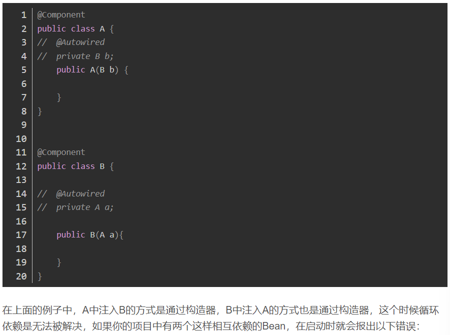
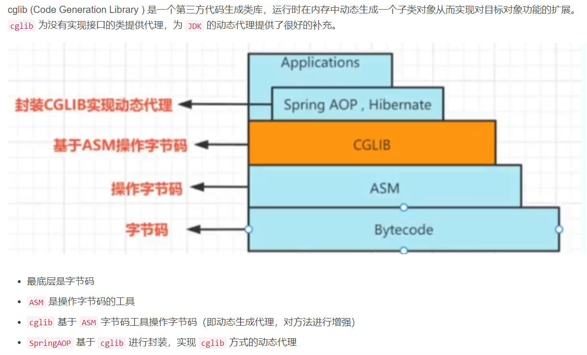
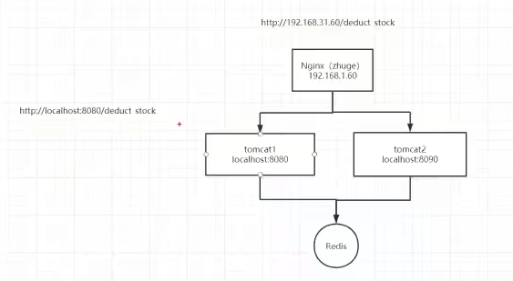

# Spring
## Spring Framework
### Spring特性
#### 


##### IOC 和 DI 的支持
Spring 的核心就是一个大的工厂容器，可以维护所有对象的创建和依赖关系，Spring 工厂用于生成 Bean，并且管理 Bean 的生命周期，实现高内聚低耦合的设计理念

##### AOP 编程的支持
Spring 提供了面向切面编程，对程序进行增强可以很方便的实现

##### 声明式事务的支持
支持通过配置就实现对事务的管理，而不需要通过硬编码的方式，以前重复的一些事务提交、回滚的 JDBC 代码，都可以不用自己写了

##### 快捷测试的支持
Spring 对 Junit 提供支持，可以通过注解快捷地测试 Spring 程序

##### 快速集成功能
方便集成各种优秀框架，Spring 不排斥各种优秀的开源框架，其内部提供了对各种优秀框架（如：Struts、Hibernate、MyBatis、Quartz 等）的直接支持

##### 复杂 API 模板封装
Spring 对 JavaEE 开发中非常难用的一些 API（JDBC、JavaMail、远程调用等）都提供了模板化的封装，这些封装 API 的提供使得应用难度大大降低

### Spring模块
#### Spring 框架是分模块存在，除了最核心的
 Core Container是必要模块之外，其他模块都是可选，大约有 20 多个模块。


Spring各模块的依赖关系


##### Core Container是Spring 框架的核⼼模块，也可以说是基础模块，主要提供 IoC 、DI功能的⽀持。Spring 其他所有的功能基本都需要依赖于该模块


##### AOP模块


##### 数据访问/整合模块


##### Web模块


### Spring中设计模式的应用
#### 


1、工厂模式 : Spring 容器本质是一个大工厂，使用工厂模式通过 BeanFactory、ApplicationContext 创建 bean 对象。
2、代理模式 : Spring AOP 功能功能就是通过代理模式来实现的，分为动态代理和静态代理。
3、单例模式 : Spring 中的 Bean 默认都是单例的，这样有利于容器对 Bean 的管理。
4、模板模式 : Spring 中 JdbcTemplate、RestTemplate 等以 Template 结尾的对数据库、网络等等进行操作的模板类，就使用到了模板模式。
5、观察者模式: Spring 事件驱动模型就是观察者模式很经典的一个应用。
6、适配器模式 :Spring AOP 的增强或通知 (Advice) 使用到了适配器模式、Spring MVC 中也是用到了适配器模式适配 Controller。
7、策略模式：Spring 中有一个 Resource 接口，它的不同实现类，会根据不同的策略去访问资源。

### IOC
#### Spring源码概括
IOC、AOP、Transactional、循环依赖的概括


##### IOC 控制反转
###### IOC（Inversion of Control，控制反转）

一句话概括IOC：由Spring容器控制所有对象（控制对象的生命周期和对象间的关系），对象里需要用到的依赖由容器把依赖注入进去。


####### 引入IOC之前和引入IOC之后
######## 以前是我们想要什么，就自己创建什么，现在是我们需要什么，容器就给我们送来什么。依赖被注入到对象，而不是创建或寻找依赖对象。


####### 目的
目的1：降低代码之间的耦合度

目的2：池化技术，重复使用，节省内存，减少CPU消耗

目的3：对象的调用关系由Spring管理，用三级缓存解决了循环依赖问题

###### Spring的IOC容器
####### Spring的IOC容器是一个IOC Service Provider，即实现IOC的载体，Spring提供了两种 IoC 容器，分别为 BeanFactory 和 ApplicationContext。
######## ApplicationContext容器
######### ApplicationContext 是 BeanFactory 功能加强的一个子接口，也被称为应用上下文，是一个功能更加全面的容器，我们一般使用ApplicationContext，它提供了BeanFactory额外的功能
########## 可以这么形容，BeanFactory 是 Spring 的“心脏”，ApplicationContext 是完整的“身躯”
包含的关系


########## 额外功能
1,环境感知;    

2,容器的继承体系;    

3,国际化相关;    

4,事件发布/响应机制;    

5,统一的资源管理;  

6,AOP的功能;

######### ApplicationContext的属性
########## BeanFactory(DefaultListableBeanFactory)
########### beanDefinitionMap(ConcurrentHashMap)
注册BeanDefinition的Map

########### beanPostProcessors(List)
注册Bean后置处理器的List

########### beanPostProcessorCache(Object)
Bean后置处理器的分类汇总


########### singletonObjects(ConcurrentHashMap)
一级缓存

########### earlySingletonObjects(ConcurrentHashMap)
二级缓存

发生循环依赖才会用到

########### singletonFactories(HashMap)
三级缓存

没发生循环依赖，Bean一般先在三级缓存，后在一级缓存，不会经过二级缓存

########## BeanFactoryPostProcessors(List)
注册BeanFactory后置处理器的List

######## BeanFactory容器
BeanFactory 是spring提供的最简单最基本的 IoC 容器，这个容器只提供了IOC/DI的功能;这个容器中最主要个方法就是getBean()方法

##### IOC容器启动流程
###### 容器启动阶段
####### ApplicationContext
######## 创建BeanFactory
ConfigurableListableBeanFactory

创建BeanDefinitionReader

####### BeanDefinitionReader
######## 解析BeanDefinition
######### xml，properties，yaml，json等文件里有Bean定义信息，就是要把这些解析为BeanDefinition
########## 定义Bean的方式
基于XML的配置

########### 基于注解的配置
annotation自动注册bean

############ 自动装配Bean
############# 什么是自动装配？
Spring IOC 容器知道所有 Bean 的配置信息，此外，通过 Java 反射机制还可以获知实现类的结构信息，如构造方法的结构、属性等信息。掌握所有 Bean 的这些信息后，Spring IOC 容器就可以按照某种规则对容器中的 Bean 进行自动装配，而无须通过显式的方式进行依赖配置。
```
Spring 提供的这种方式，可以按照某些规则进行 Bean 的自动装配，<bean>元素提供了一个指定自动装配类型的属性：autowire="<自动装配类型>"
```
############# 类型
############## no
默认方式，手动装配方式，需要通过ref设定bean的依赖方式

############## byName
根据bean的名字进行装配，当一个bean的名称和其他bean的属性一致，则自动装配

############## byType
根据bean的类型进行装配，当一个bean的属性类型与其他bean的属性的数据类型一致，则自动装配

############## constructor
根据构造器进行装配，如果bean的构造器有与其他bean类型相同的属性，则进行自动装配

############## autodetect
如果有默认构造器，则以constructor方式进行装配，否则以byType方式进行装配

############# byType和byName的区别
############## 


byName（根据名称进行匹配）变量的名称

byType（根据类型进行匹配）变量的声明类型

####### BeanFactory
注册BeanDefinition到BeanFactory里的BeanDefinitionMap，key为BeanName，value为BeanDefinition

######## 执行BeanFactory后置处理器

对BeanDefinition进行增强
实现BeanFactoryPostProcessor接口的有多个类，按一定顺序进行增强

BeanFactoryPostProcessor接口是BeanDefinitionRegistryPostProcessor接口的父类

######## 注册Bean的后置处理器

实例化并注册 BeanPostProcessor 接口的实现类
BeanPostProcessor接口是对Bean进行增强，此处仅注册，到初始化Bean时，在初始化前后进行Bean增强

同样有多个类，有一定顺序

###### 创建Bean阶段
####### Bean的生命周期

从无到有(IOC)，从有到增强(AOP)
Bean是Spring框架在运行时管理的对象
######## 5个阶段，其中，初始化和销毁阶段分为多步骤


######### 


######## BeanFactory遍历BeanDefinitionMap的每一个BeanDefinition进行创建Bean处理
#########  实例化 Instantiation
########## 实例化前置处理
########### 扩展点
InstantiationAwareBeanProcessor可以作为实例化前后的扩展点


########## 实例化：通过反射将BeanDefinition进行实例化
IOC  ==>  反射 

实例化后置处理

######### 属性注入/属性填充 Populate
########## Bean实例化后对将Bean的引入和值注入到Bean的属性中。
执行相关bean属性依赖注入
########### DI 依赖注入
############ 注入方式
构造方法注入

############# 属性注入
############## 通过setter方法注入
byName跟byType两种注入模型均是依赖setter方法
    // byName,根据setter方法的名字来查找对应的依赖，例如setA,那么就是去容器中查找名字为a的Bean
    // byType,根据setter方法的参数类型来查找对应的依赖，例如setXx(A a)，就是去容器中查询类型为A的bean

############# 工厂方法注入
静态工厂方法注入

实例工厂方法注入

######### 初始化 Initialization
########## 执行Aware接口中的方法
########### 为什么Aware接口非要在初始化前执行呢
这样做的目的是因为，初始化会依赖Aware接口提供的状态
实现了某个Aware接口，就表示，此处设置的值，初始化要用到

########### 细节
############ BeanNameAware（Aware）
如果Bean类实现了BeanNameAware接口的话，则执行setBeanName()方法，Spring将Bean的Id传递给setBeanName()方法

############ BeanFactoryAware（Aware）
如果Bean类实现了BeanFactoryAware接口的话，Spring将执行setBeanFactory()方法，将BeanFactory容器实例传入

############ ApplicationContextAware（Aware）
如果Bean类实现了ApplicationContextAware接口的话，Spring将调用Bean的setApplicationContext()方法，将bean所在应用上下文引用传入进来

########## BeanPostProcessor#processBeforeInitialization（初始化前置处理）
########### 如果Bean实现了BeanPostProcessor接口，Spring就将调用processBeforeInitialization()方法
在此阶段执行@PostConstruct注解标注的方法


########## InitializingBean（初始化）
########### 是否实现InitializingBean接口
如果Bean 实现了InitializationBean接口，Spring将执行afterPropertiesSet()方法

########### 是否配置自定义init方法
如果bean使用init-method声明了初始化方法，该方法也会被调用
Bean自身的initMethod
Bean自身在配置文件中定义的Init方法

########## BeanPostProcessor#processAfterInitialization（初始化后置处理）
########### 如果Bean 实现了BeanPostProcessor接口，Spring就将调用processAfterInitialization()方法
############ AOP  ==>   字节码增强

Note：只有后置处理，没有前置处理
创建AOP动态代理

自动代理机制的实现其实很简单，就是通过Bean的后置处理器，在创建Bean的最后一步对Bean进行代理，并将代理对象放入到容器中

######### 使用中
Bean已经准备就绪，可以被应用程序使用了。他们将一直驻留在应用上下文中，直到应用上下文被销毁

######### 销毁 Destruction
########## 是否实现DisposableBean接口
如果bean实现了DisposableBean接口，Spring将调用它的destory()方法

########## 是否配置自定义destory方法
如果bean使用了destory-method 声明销毁方法，该方法也会被调用
Bean自身在配置文件中定义的destory方法

##### 三级缓存解决循环依赖
###### 


####### 什么是循环依赖
【A注入了B，B注入了A】  或者 【A注入了A】


####### 什么情况下循环依赖可以被处理
/Spring解决循环依赖的前置条件
######## 只有单例的Bean才存在循环依赖问题
/出现循环依赖的Bean都是单例
ProtoType(原型)情况下，Spring会直接抛出异常原因很简单，AB 循环依赖，A 实例化的时候，发现依赖 B，创建 B 实例，创建 B 的时候发现需要 A，创建 A1 实例……无限套娃，直接把系统干垮。

######## 第四种可以而第五种不可以的原因是 Spring 在创建 Bean 时默认会根据自然排序进行创建，所以 A 会先于 B 进行创建
（很多博客上说，只能解决setter方法的循环依赖，这是错误的）


######### 总结
########## 都采用setter方法注入时，Spring可以支持
Spring 能解决 setter 注入的循环依赖，是因为实例化和属性赋值是分开的，所以里面有操作的空间

########## 都采用构造器注入时，Spring不支持
如果都是构造器注入，那么都得在实例化这一步完成注入，所以自然是无法支持了

Caused by: org.springframework.beans.factory.BeanCurrentlyInCreationException: Error creating bean with name 'a': Requested bean is currently in creation: Is there an unresolvable circular reference?
 
通过构造器注入，也就是实例化的时候，是有参构造，这时就需要注入，如果需要注入的Bean不存在，那就无法实例化了



########## 两者都有，得分情况
先创建的Bean采用构造器注入后创建的Bean，Spring不支持

后创建的Bean采用构造器注入先创建的Bean，Spring可以支持

####### Spring是如何解决的循环依赖


######## 


######### 简单的循环依赖（没有AOP）
########## 


########### 在没有AOP时，三级缓存没任何作用


B中提前注入了一个没有经过初始化的A类型对象不会有问题吗？

答：不会
虽然在创建B时会提前给B注入了一个还未初始化的A对象，但是在创建A的流程中一直使用的是注入到B中的A对象的引用，之后会根据这个引用对A进行初始化，所以这是没有问题的。

######### 结合了AOP的循环依赖
########## 三级缓存实际上跟Spring中的AOP相关，这个对象工厂用于延迟创建代理对象


########### 三级缓存存在的目的
这个工厂的目的在于延迟对实例化阶段生成的对象的代理，只有真正发生循环依赖的时候，才去提前生成代理对象，否则只会创建一个工厂并将其放入到三级缓存中，但是不会去通过这个工厂去真正创建对象

如果出现了循环依赖，那没有办法，只有给Bean先创建代理，但是没有出现循环依赖的情况下，设计之初就是让Bean在生命周期的最后一步完成代理而不是在实例化后就立马完成代理。

########### 三级缓存提高了效率吗
没有，不管有没有结合AOP，都没有提高效率


######## 一级缓存：放完整对象
二级缓存：如果有AOP放代理对象；如果没有AOP放实例化对象
三级缓存：放使用实例化对象创建的对象工厂（该工厂在有AOP时，其getObject()方法会创建代理对象返回；否则，会返回实例化对象）


######## 创建循环依赖Bean过程
1、getBean(A)
将A实例化后放入三级缓存
A属性注入时发现依赖B

2、getBean(B)
将B实例化后放入三级缓存
B属性注入时发现依赖A

3、getBean(A) 第二次获取A
从缓存里找A对象。依次从⼀级到三级缓存查询 A，将三级缓存处理后存入二级缓存（（此处，如果没有AOP，则三级缓存的A和二级缓存的A一样；否则二级缓存是代理对象）），同时删除三级缓存中的 A，返回二级缓存的A

4、B继续属性注入
属性注入A
初始化B
将B放入一级缓存，同时删除二级和三级缓存

5、A 继续属性赋值
属性注入B
初始化A（如果有AOP，初始化后置处理时，已经生成代理对象，此处就不再生成）
将A放入一级缓存，同时删除二级和三级缓存

6、最后，⼀级缓存中保存着实例化、初始化都完成的 A、B 对象

### AOP
#### 目的
##### 高内聚，低耦合，模块化
###### 把应用的业务逻辑与系统的服务分离开来（解耦），进行内聚性开发，提高代码模块化功能。eg.日志和事务管理
主要应用于处理一些具有横切性质的系统级服务，如日志收集、事务管理、安全检查、缓存、对象池管理等。


#### 术语
##### 主要
###### 切面 Aspect（切面的定义）
切面就是对横切关注点的抽象

###### 切入点 Pointcut（切面的范围）
对连接点进行拦截的定位

###### 通知/增强 Advice
拦截到连接点之后要执行的代码

##### 其他
###### 连接点 JoinPoint
被拦截到的点，因为 Spring 只支持方法类型的连接点，所以在 Spring 中连接点指的就是被拦截到的方法，实际上连接点还可以是字段或者构造器

###### 引介 Introduction
引介是一种特殊的增强，可以动态地为类添加一些属性和方法

###### 目标对象 Target
代理的目标对象

###### 代理 Proxy
向⽬标对象应⽤通知之后创建的代理对象

###### 织入 Weaving
织入是将增强添加到目标类的具体连接点上的过程

#### 底层实现
##### 代理设计模式
###### 定义：由于某些原因，需要给某对象提供一个代理，以控制对该对象的访问。这时，代理对象作为访问对象和目标对象之间的中介。
代理==增强==中介


面试关键字：设计模式、动态代理、Spring、Dubbo

###### 使用场景


###### 代理模式优缺点
####### 优
######## 功能增强
代理对象可以扩展目标对象的功能

######## 降耦合
代理模式能将客户端与目标对象分离，在一定程度上降低了系统的耦合度，起到一个中介作用和保护目标对象的作用

####### 缺
增加了系统的复杂度

###### SpringAOP和AspectJ框架


###### 分类
####### 静态代理与动态代理的区别
静态代理是实际的字节码文件，动态代理是类加载过程中动态生成的字节码文件


动态代理扩展性高，静态代理扩展性低


####### 静态代理
######## 


######### 


优点：在不修改目标对象的前提下，能通过代理对象对目标对象的功能进行扩展

缺点：代理对象需要与目标对象实现一样的接口，所以会有很多代理类，一旦接口增加方法，目标对象与代理对象都需进行维护

####### 动态代理
######## Spring AOP是基于动态代理的。
如果目标对象实现了接口，AOP就会使用JDK动态代理方式创建代理对象。
如果目标对象没有实现接口，AOP就会使用CGLIB动态代理方式创建代理对象。


######### JDK动态代理
########## 动态代理利用了JDK API，动态地在内存中构建代理对象，从而实现对目标对象的代理功能，动态代理又被称为JDK代理或接口代理
运行时计算生成，这种场景使用最多的是动态代理技术，在 java.lang.reflect.Proxy 类中，就是用了 ProxyGenerator.generateProxyClass 来为特定接口生成形式为 $Proxy 的代理类的二进制字节流
所以，动态代理就是想办法，根据接口或目标对象，计算出代理类的字节码，然后再加载到 JVM 中使用


########## 实现接口 

通过实现InvocationHandler接口并重写其中invoke方法
########### java.lang.reflect.Proxy
invoke

########## 使用
########### public class ProxyFactory {
    // 目标方法
    public Object target;
    public ProxyFactory(Object target) {
        this.target = target;
    }

    public Object getProxyInstance() {
        return Proxy.newProxyInstance(
                // 参数1：目标对象的类加载器
                target.getClass().getClassLoader(),
                // 参数2：目标对象的接口类型
                target.getClass().getInterfaces(),
                // 参数3：事件处理器
                new InvocationHandler() {
                    /**
                     *
                     * @param proxy  代理对象
                     * @param method 代理对象调用的方法
                     * @param args   代理对象调用方法时实际的参数
                     * @return
                     * @throws Throwable
                     */
                    @Override
                    public Object invoke(Object proxy, Method method, Object[] args) throws Throwable {
                        System.out.println("我是前置增强");
                        method.invoke(target, args);
                        System.out.println("我是后置增强");
                        return null;
                    }
                }
        );
    }
}


########## 源码
########### public final class $Proxy0 extends Proxy implements Landlord {
    private static Method m3;
    
    // $Proxy0 类的构造方法
    // 参数为 invocationHandler，就是我们自定义的 InvocationHandler
    public $Proxy0(InvocationHandler invocationHandler) {
        super(invocationHandler);
    }

    static {
        m3 = Class.forName("com.company.proxy.Landlord").getMethod("apartmentToRent", new Class[0]);
    }

/*我们的代理类实际上是实现了 Landlord 的接口，然后重写了 Landlord 接口中的 apartmentToRent 方法

当外界调用代理类的 apartmentToRent() 方法时，实际上是调用的我们自定义的 new InvocationHandler() 类里面的 invoke 方法*/
    public final void apartmentToRent() {
        this.h.invoke(this, m3, null);
        return;
    }
}

Proxy#newProxyInstance源码

```
public static Object newProxyInstance(ClassLoader loader,Class<?>[] interfaces,InvocationHandler h){
    // 拿到 $Proxy0 的 Class  （cl = class com.sun.proxy.$Proxy0）
    Class<?> cl = getProxyClass0(loader, intfs);
    // 根据 Class 拿到其构造方法  （cons = public com.sun.proxy.$Proxy0(java.lang.reflect.InvocationHandler)）
    final Constructor<?> cons = cl.getConstructor(constructorParams);
    // 根据构造方法传入参数进行实例化
    return cons.newInstance(new Object[]{h});
}
```
通过反射创建代理对象

######### chlib动态代理
########## 定义
cglib动态代理是JDK动态代理的补充，如果需要代理的对象有接口，就用JDK动态代理；那些没有接口的但需要代理的对象，就用cglib动态代理



########### 继承类 

无接口的情况用此，继承被代理类
############ net.sf.cglib.proxy
intercept

########## 使用
########### UserServiceImpl是需要代理的类


############ public class UserLogProxy implements MethodInterceptor {
    /**
     * 生成 CGLIB 动态代理类方法
     *
     * @param target
     * @return
     */
    public Object getLogProxy(Object target) {
        // 增强器类，用来创建动态代理类
        Enhancer enhancer = new Enhancer();

        // 设置代理类的父类字节码对象
        enhancer.setSuperclass(target.getClass());

        // 设置回调
        enhancer.setCallback(this);

        // 创建动态代理对象并返回
        return enhancer.create();

    }

    /**
     * @param o         代理对象
     * @param method      目标对象中的方法的Method实例
     * @param objects     实际参数
     * @param methodProxy   代理类对象中的方法的Method实例
     * @return
     * @throws Throwable
     */
    @Override
    public Object intercept(Object o, Method method, Object[] objects, MethodProxy methodProxy) throws Throwable {
        System.out.println("前置输出");
        Object result = methodProxy.invokeSuper(o, objects);
        return result;
    }
}


########## 源码
########### public class UserServiceImpl$$EnhancerByCGLIB$$cd9788d extends UserServiceImpl implements Factory {
    final List findUserList() {
        // 是否设置了回调
        MethodInterceptor methodInterceptor = this.CGLIB$CALLBACK_0;
        if (methodInterceptor == null) {
            UserServiceImpl$$EnhancerByCGLIB$$cd9788d.CGLIB$BIND_CALLBACKS(this);
            methodInterceptor = this.CGLIB$CALLBACK_0;
        }
        // 设置回调，需要调用 intercept 方法
        if (methodInterceptor != null) {
            return (List) methodInterceptor.intercept(this, CGLIB$findUserList$0$Method, CGLIB$emptyArgs, CGLIB$findUserList$0$Proxy);
        }
        // 无回调，调用父类的 findUserList 即可
        return super.findUserList();
    }
    final List CGLIB$findUserList$0() {
        return super.findUserList();
    }
}


### Data Access/Integration
#### ORM
##### Mybatis
###### #{}和${}的区别
#将传入的数据都当成一个字符串，会对自动传入的数据加一个双引号

$将传入的数据直接显示生成在sql中

###### 分页实现
####### 逻辑分页
自带的RowBounds进行分页，它是一次性查询很多数据，然后在数据中再进行检索，并非是一次性查询出所有数据

####### 物理分页
利用原生的sql关键字limit

利用interceptor来拼接sql

使用Interceptor拦截器

PageHelper工具

###### 支持延迟加载
延迟加载的原理是调用的时候触发加载，而不是在初始化的时候就加载信息

设置lazyLoadingEnabled=true即可

###### 一级缓存
####### 基于PerpetualCache的HashMap本地缓存，它的声明周期是和SQLSession一致
默认开启

可能会出现脏数据

###### 二级缓存
基于PerpetualCache的HashMap本地缓存不同在于其存储作用域为Mapper级别

如果多个SQLSession之间需要共享缓存，则需要使用到二级缓存

Ehcache

###### Executor执行器
####### SimpleExecutor
每执行一次update或select，就开启一个Statement对象，用完立刻关闭Statement

####### ReuseExecutor
执行update或select，以sql作为key查找Statement对象

存在就使用，不存在就创建，用完后，不关闭Statement对象，而是放置于Map内

####### BatchExecutor
######## 执行update，都添加到批处理中（addBatch()），等待统一执行（executeBatch()）
与JDBC批处理相同

###### 自定义插件
Executor拦截执行器的方法（log记录）

StatementHandler拦截Sql语法构建的处理

ParameterHandler拦截参数的处理

ResultSetHandler拦截结果集的处理

Hibernate

JPA

#### Transaction
详见SpringBoot的@Transactional()注解

### Web
#### Spring MVC
##### 工作流程
###### 


####### Spring MVC的工作流程

1、客户端向服务端发送一次请求，这个请求会先到前端控制器 DispatcherServlet(也叫中央控制器)。
2、DispatcherServlet 接收到请求后会调用 HandlerMapping 处理器映射器。由此得知，该请求该由哪个 Controller 来处理（并未调用 Controller，只是得知）
3、DispatcherServlet 调用 HandlerAdapter 处理器适配器，告诉处理器适配器应该要去执行哪个 Controller
4、HandlerAdapter 处理器适配器去执行 Controller 并得到 ModelAndView(数据和视图)，并层层返回给 DispatcherServlet
5、DispatcherServlet 将 ModelAndView 交给 ViewReslover 视图解析器解析，然后返回真正的视图。
6、DispatcherServlet 进行视图渲染，将模型数据填充到视图中
7、DispatcherServlet 将结果响应给客户端
######## 核心组件
######### DispatcherServlet
(核心)
前置控制器，是整个流程控制的核心，控制其他组件的执行，进行统一调度，降低组件之间的耦合性，相当于总指挥

######### HandlerMapping
DispatcherServlet 接收到请求之后，通过 HandlerMapping 将不同的请求映射到不同的 Handler

######### HandlerAdapter
处理器适配器，Handler 执行业务方法之前，需要进行一系列的操作，包括表单数据的验证、数据类型的转换、将表单数据封装到 JavaBean 等，这些操作都是由 HandlerApapter 来完成，开发者只需将注意力集中业务逻辑的处理上，DispatcherServlet 通过 HandlerAdapter 执行不同的 Handler

######### Handler
处理器，完成具体的业务逻辑，相当于 Servlet 或 Action

######### ModelAndView
装载了模型数据和视图信息，作为 Handler 的处理结果，返回给 DispatcherServlet

######### ViewResolver
视图解析器，DispatcheServlet 通过它将逻辑视图解析为物理视图，最终将渲染结果响应给客户端

######### HandlerInterceptor
处理器拦截器，是一个接口，如果需要完成一些拦截处理，可以实现该接口

######### HandlerExecutionChain
处理器执行链，包括两部分内容：Handler 和 HandlerInterceptor（系统会有一个默认的 HandlerInterceptor，如果需要额外设置拦截，可以添加拦截器）

Spring MVC 虽然整体流程复杂，但是实际开发中很简单，大部分的组件不需要开发人员创建和管理，只需要通过配置文件的方式完成配置即可，真正需要开发人员进行处理的只有 Handler（Controller） 、View 、Model。
当然我们现在大部分的开发都是前后端分离，Restful 风格接口，后端只需要返回 Json 数据就行了。

##### Restful风格的API请求响应流程


加入了@ResponseBody这个注解后，整体的流程上和使用 ModelAndView 大体上相同，但是细节上有一些不同
1、客户端向服务端发送一次请求，这个请求会先到前端控制器 DispatcherServlet
2、DispatcherServlet 接收到请求后会调用 HandlerMapping 处理器映射器。由此得知，该请求该由哪个 Controller 来处理
3、DispatcherServlet 调用 HandlerAdapter 处理器适配器，告诉处理器适配器应该要去执行哪个 Controller
4、Controller 被封装成了 ServletInvocableHandlerMethod，HandlerAdapter 处理器适配器去执行 invokeAndHandle 方法，完成对 Controller 的请求处理
5、HandlerAdapter 执行完对 Controller 的请求，会调用 HandlerMethodReturnValueHandler 去处理返回值，主要的过程：
5.1. 调用 RequestResponseBodyMethodProcessor，创建 ServletServerHttpResponse（Spring 对原生 ServerHttpResponse 的封装）实例
5.2.使用 HttpMessageConverter 的 write 方法，将返回值写入 ServletServerHttpResponse 的 OutputStream 输出流中
5.3.在写入的过程中，会使用 JsonGenerator（默认使用 Jackson 框架）对返回值进行 Json 序列化
6、执行完请求后，返回的 ModealAndView 为 null，ServletServerHttpResponse 里也已经写入了响应，所以不用关心 View 的处理

## Spring Boot
### 特点
#### 简化配置
“习惯优于配置/约定大于配置”的设计概念，自动化配置，默认配置

##### 自动配置
@EnableAutoConfiguration

##### 核心配置文件
bootstrap配置文件

application配置文件

.properties和.yml

#### 简化部署
内嵌tomcat（tomcat：web服务器，提供web服务，别人就能够访问了，提供RESTFUL API）

#### 简化整合
/简化集成
整合各项功能，通过starter依赖

创建SpringBoot项目：使用官方地址生成 http://start.spring.io

### SpringBoot启动原理
#### 


### 注解
#### 理解：注解本质上是一个标记
有了标记之后，就可以在编译或运行阶段去识别这些标记，然后做一些事情，这就是注解的用处

通过使用注解，开发人员可以声明某个类、方法或字段具有特定的行为或作用

#### Spring注解与SpringBoot注解的关系
Spring Boot在Spring框架的基础上引入了一些新的注解以及简化了Spring一些注解的使用

Spring注解是用于配置和控制Spring框架的核心功能，而Spring Boot注解是在Spring框架基础上提供的简化配置和开发的特殊注解

注解可以标记在类上、方法上、属性上等

注解自身也可以设置一些值

#### 注解的生命周期（3种）
通过@Retention(xxx)声明
##### RetentionPolicy.SOURCE
给编译器用的，不会写入 class 文件

示例，Override注解，是给编译器用的，编译器编译的时候检查没问题就结束了，不会写入class文件


##### RetentionPolicy.CLASS
会写入 class 文件，在类加载阶段丢弃，也就是运行的时候就没这个信息了

##### RetentionPolicy.RUNTIME
会写入 class 文件，永久保存，可以通过反射获取注解信息

示例，Autowired注解，生命周期是RUNTIME，所以在运行的时候可以通过反射得到注解的信息，还能拿到标记的值required


#### 常用注解
##### 启动类注解/启动注解
###### @SpringBootApplication
启动类注解，是复合注解，由3个注解组成


####### @SpringBootConfiguration
加载配置文件

（声明当前类是配置类，将当前类配置加载到Spring的IOC容器中）
@SpringBootConfiguration 注解，继承自@Configuration注解

二者功能也一致，标注当前类是配置类， 并会将当前类内声明的一个或多个以@Bean注解标记的方法的实例纳入到spring容器中，并且实例名就是方法名

######## @Configuration
声明当前类是一个配置类（相当于一个 Spring 配置的 xml 文件）

####### @EnableAutoConfiguration
开启自动配置

（自动将配置加载到Spring的IOC容器中）
可以帮助SpringBoot应用将所有符合条件的@Configuration配置都加载到IoC容器中

######## SpringBoot自动配置原理


######### 


自动装配核心功能的实现实际是通过 AutoConfigurationImportSelector类

AutoConfigurationImportSelector实现了ImportSelector接口，这个接口的作用就是收集需要导入的配置类，配合@Import()就可以将相应的类导入到 Spring 容器中

########## 获取注入类的方法是 selectImports()，它实际调用的是getAutoConfigurationEntry，这个方法是获取自动装配类的关键，主要流程可以分为这么几步:
1、获取注解的属性，用于后面的排除
2、获取所有需要自动装配的配置类的路径：这一步是最关键的，从 META-INF/spring.factories 获取自动配置类的路径
3、去掉重复的配置类和需要排除的重复类，把需要自动加载的配置类的路径存储起来
```
    protected AutoConfigurationImportSelector.AutoConfigurationEntry getAutoConfigurationEntry(AnnotationMetadata annotationMetadata) {
        if (!this.isEnabled(annotationMetadata)) {
            return EMPTY_ENTRY;
        } else {
            //1.获取到注解的属性
            AnnotationAttributes attributes = this.getAttributes(annotationMetadata);
            //2.获取需要自动装配的所有配置类，读取META-INF/spring.factories，获取自动配置类路径
            List<String> configurations = this.getCandidateConfigurations(annotationMetadata, attributes);
            //3.1.移除重复的配置
            configurations = this.removeDuplicates(configurations);
            //3.2.处理需要排除的配置
            Set<String> exclusions = this.getExclusions(annotationMetadata, attributes);
            this.checkExcludedClasses(configurations, exclusions);
            configurations.removeAll(exclusions);
            configurations = this.getConfigurationClassFilter().filter(configurations);
            this.fireAutoConfigurationImportEvents(configurations, exclusions);
            return new AutoConfigurationImportSelector.AutoConfigurationEntry(configurations, exclusions);
        }
    }
```

####### @ComponentScan
组件扫描和自动装配

(自动扫描并加载Bean定义到Spring的IOC容器中)
自动扫描并加载符合条件的组件或bean定义，最终将这些bean定义加载到容器中

可以通过basePackages等属性指定@ComponentScan自动扫描的范围

如果不指定，则默认Spring框架实现从声明@ComponentScan所在类的package进行扫描，默认情况下是不指定的，所以SpringBoot的启动类最好放在root package下

##### SpringMVC相关注解
Web相关注解
###### 修饰类或方法的注解
####### @RequestMapping
@RequestMapping 是 Spring Web 应用程序中最常被用到的注解之一。这个注解会将 HTTP 请求映射到 MVC 和 REST 控制器的处理方法上

######## 用于指定URL映射
用于建立请求URL和处理请求方法之间的对应关系

修饰类/方法


####### @ResponseBody
表示返回的是数据而不是视图，将方法返回的对象直接在浏览器上展示成json格式

###### 修饰类的注解
####### @RestController
是复合注解，@Controller+@ResponseBody的组合体


它替代了传统的@Controller和@ResponseBody的组合使用，方便编写和处理RESTful风格的API，将方法返回的对象直接在浏览器上展示成json格式

注解在类上，意味着，该 Controller 的所有方法都默认加上了@ResponseBody

在一个使用了@RestController注解的类中，所有的方法都会默认返回数据，而不是返回视图。这意味着可以直接返回对象、集合、字符串等数据类型，而不需要再封装为ModelAndView对象或使用其他方式来处理返回值。

######## @Controller
用于标识一个类为RESTful Web服务的控制器

######## @ResponseBody
表示返回的是数据而不是视图

###### 修饰方法的注解
####### 组合注解
######## 幂等性概念
幂等性：HTTP/1.1中的定义是指一次和多次请求某一个资源对于资源本身应该具有同样的结果（网络超时等问题除外）。也就是说，其任意多次执行对资源本身所产生的影响均与一次执行的影响相同

这里需要关注几个重点：

幂等不仅仅只是一次（或多次）请求对资源没有副作用（比如查询数据库操作，没有增删改，因此没有对数据库有任何影响）。
幂等还包括第一次请求的时候对资源产生了副作用，但是以后的多次请求都不会再对资源产生副作用。
幂等关注的是以后的多次请求是否对资源产生的副作用，而不关注结果。
网络超时等问题，不是幂等的讨论范围。
幂等性是系统服务对外一种承诺（而不是实现），承诺只要调用接口成功，外部多次调用对系统的影响是一致的。声明为幂等的服务会认为外部调用失败是常态，并且失败之后必然会有重试。

 http协议明确规定，put、get与delete请求都是具有幂等性的，而post为非幂等性请求，就是说接口被定义为post请求可访问时，说明这个接口对数据库的影响是非幂等性的。

######## 幂等性接口

支持多次执行或重试，且多次执行的结果一致（多次执行和一次执行的结果一样）
######### @GetMapping
查
@RequestMapping(method=RequestMethod.GET)的缩写


用于指定GET请求

@PutMapping
改

@DeleteMapping
删

######## 非幂等性接口

多次执行的结果不一致
######### @PostMapping
增
@RequestMapping(method=RequestMethod.POST)的缩写

###### 修饰方法形参的注解
####### @RequestBody
请求参数（json,xml等）到指定类型（与json,xml数据结构对应的类）入参

通过HttpMessageConverter读取RequestBody并反序列化为Object（泛指）对象

####### @RequestParam
获取请求参数的值


####### @PathVariable
获取url中的数据


####### @RequestHeader
把Request请求header部分的值绑定到方法的参数上

####### @CookieValue
把Request header中关于cookie的值绑定到方法的参数上

@ModelAttribute("xxx")

##### 容器相关注解
###### 定义Bean相关注解
####### 类上
######## @Component
可以用于注册所有bean

元注解

代替写xml配置文件去定义Bean

######## 组合了@Component的注解
######### @RestController
@Controller
主要用于注册controller层（控制层/MVC层）的bean

######### @Service
主要用于注册service层（业务逻辑层/服务层）的bean

######### @Repository
主要用于注册dao层（数据访问层）的bean

######### @Entity
与数据库中表相对应

####### 方法上
######## @Bean
有此注解的方法产生一个Bean

注解在方法上，声明当前方法的返回值为一个 Bean

返回的 Bean 对应的类中可以定义 init()方法和 destroy()方法，然后在@Bean(initMethod=”init”,destroyMethod=”destroy”)定义，在构造之后执行 init，在销毁之前执行 destroy。


####### @Component与@Bean的区别
总结：
@Bean自定义性更强；
第三方库中的类只能用@Bean。


###### 调用/注入Bean
####### 知识回顾：byType和byName的区别
######## 


byName（根据名称进行匹配）变量的名称

byType（根据类型进行匹配）变量的声明类型

####### 使用较多
######## @Autowired
是Spring提供的注解

默认注入方式是byType

当一个接口存在多个实现类(byType无法唯一确定)的情况下，注入方式会变为byName

######### 可以搭配使用@Qualifier注解显示指定名称
########## @Qualifier
指定按照名称去装配bean

该注解通常跟 @Autowired 一起使用，当想对注入的过程做更多的控制，@Qualifier 可帮助配置，比如两个以上相同类型的 Bean 时 Spring 无法抉择，用到此注解

######### 示例
举例：SmsService接口有两个实现类，SmsServiceImpl1和SmsServiceImpl2，且它们都已经被Spring容器所管理


######## @Resource
是JDK提供的注解

默认注入方式是byName

当一个接口存在多个实现类(byName无法唯一确定)的情况下，注入方式会变为byType

######### 可以通过@Resource的name属性显示指定名称


######### 示例
举例：SmsService接口有两个实现类，SmsServiceImpl1和SmsServiceImpl2，且它们都已经被Spring容器所管理


####### 使用较少
@Inject

@Required

###### 注入参数
####### @Value
可用在字段，构造器参数跟方法参数，指定一个默认值，支持 #{} 跟 ${} 两个方式。一般将 SpringbBoot 中的 application.properties 配置的属性值赋值给变量

###### 指定Bean作用域
####### @Scope
指定Bean作用域

作用在类上和方法上

@Scope注解共有三个属性，分别为value、scopeName、proxyMode


######## value属性

指定Bean的作用域
######### 5种取值
########## singleton
表示该bean是单例的（默认）

适用无会话状态的Bean

########## prototype
表示该bean是多例的，即每次使用该bean时都会新建一个对象，每次从Spring容器获取 Bean，都会返回一个新的实例

########## Web应用中适用
########### request
在一次http请求中，一个bean对应一个实例

 每一次 HTTP 请求都会产生一个新的 Bean，该 Bean 仅在当前 HTTP Request 内有效

########### session
在一个httpSession中，一个bean对应一个实例

同一个 HTTP Session 共享一个 Bean，不同的 HTTP Session 使用不同的 Bean

########### global session
同一个全局 Session 共享一个 Bean，只用于基于 Protlet 的 Web 应用，Spring5 中已经不存在了

######## proxyMode属性

指定代理模式
代理模式决定了代理对象的创建方式

ScopedProxyMode是一个枚举类，该类共定义了四个枚举值，分别为NO、DEFAULT、INTERFACE、TARGET_CLASS，其中DEFAULT和NO的作用是一样的

#########  4种取值
########## DEFAULT
默认值，不使用代理，等于NO

########## INTERFACES
使用基于接口的代理(jdk dynamic proxy)

########## TARGET_CLASS
使用基于类的代理(cglib dynamic proxy)

########## NO
禁用代理。目标Bean不会被代理。

##### AOP注解
###### 切面的应用
####### Step1
######## @EnableAspectJAutoProxy
开启 Spring 对 AspectJ 代理的支持（启动类上）

####### Step2
######## @Aspect
######### 声明一个切面（类上） 
表明这是一个定义切面的类
Note:除了@Aspect，还要加@Component注解

######## @Pointcut
#########  声明切点（属性/方法上）
@PointCut(xxx)，切入点，括号里指明哪个包
表明在什么范围内应用该切面

也可以自定义一个注解作为使用切面的标识

######## 声明Advice（通知/增强）

AOP的5种环绕方式
######### @Before
########## 在方法执行之前执行（方法上）
表明在目标方法之前要做的操作

######### @After
########## 在方法执行之后执行（方法上）
表明在目标方法之后要做的操作

######### @Around
########## 在方法执行时执行，替代目标方法（方法上）
表明在目标方法执行时要做的操作，会覆盖掉目标方法

######### @AfterReturning
表明在目标方法返回时要做的操作（方法上）

######### @AfterThrowing
表明在目标方法返回时要做的操作（方法上）


###### 扩展
####### @Order
多个切面的情况下，可以通过 @Order 指定先后顺序，数字越小，优先级越高

@DeclareParents

##### 事务注解
###### @Transactional()
####### propagation
事务传播机制
Spring 事务的传播机制说的是，多个方法相互调用时，Spring 如何处理事务的行为

事务传播机制是使用简单的 ThreadLocal 实现的，所以，如果调用的方法是在新线程调用的，事务传播实际上是会失效的

######## Spring的7种事务传播机制


######### Propagation.REQUIRED和Propagation.NESTED一致
默认

如果当前存在事务，就加入该事务
如果当前没有事务，就创建一个新事务

######### Propagation.MANDATORY
mandatory:强制性

如果当前存在事务，就加入该事务
如果当前不存在事务，就抛出异常

######### Propagation.REQUIRES_NEW
无论当前存不存在事务，都创建新事务

也就是说不管外部⽅法是否开启事务， Propagation.REQUIRES_NEW 修饰的内部⽅法会新开启⾃⼰的事务，且开启的事务相互独⽴，互不⼲扰。

######### Propagation.SUPPORTS
如果当前存在事务，就加入该事务
如果当前不存在事务，就以非事务执行

######### Propagation.NOT_SUPPORTED
无论当前存不存在事务，都以非事务执行

######### Propagation.NEVER
如果当前存在事务，则抛出异常
如果当前不存在事务，就以非事务执行

####### isolation
事务隔离级别
######## Isolation.DEFAULT
使用后端数据库默认的隔离界别，MySQL 默认可重复读，Oracle 默认读已提交

Isolation.READ_UNCOMMITTED

Isolation.READ_COMMITTED

Isolation.REPEATABLE_READ

Isolation.SERIALIZABLE

timeout

readOnly

rollbackFor

noRollbackFor

###### Spring事务本质就是对数据库事务的支持
没有数据库的事务支持，Spring 是无法提供事务功能的。Spring 只提供统一事务管理接口，具体实现都是由各数据库自己实现，数据库事务的提交和回滚是通过数据库自己的事务机制实现。

###### 目的
事务管理对于企业应⽤来说是⾄关重要的，即使出现异常情况，它也可以保证数据的⼀致性。
当 @Transactional 注解作⽤于类上时，该类的所有 public ⽅法将都具有该类型的事务属性，同时，我们也可以在⽅法级别使⽤该标注来覆盖类级别的定义。如果类或者⽅法加了这个注解，那么这个类⾥⾯的⽅法抛出异常，就会回滚，数据库⾥⾯的数据也会回滚。

###### 事务的两种实现方式


###### 声明式事务的实现原理
####### AOP
该注解建立在AOP之上，本质是通过AOP功能，对方法前后进行拦截，将事务处理的功能编织到拦截的方法中。

###### 声明式事务的失效情形


###### @Transactional(rollbackFor = Exception.class)
注解了解吗？
 @Transactional 注解中如果不配置 rollbackFor 属性,那么事务只会在遇到 RuntimeException 的时候才会回滚，加上 rollbackFor=Exception.class ,可以让事务在遇到⾮运⾏时异常时也回滚

##### 导入配置文件注解
###### @PropertySource
####### 引入单个properties文件
@PropertySource(value = {"classpath : xxxx/xxx.properties"})

####### 引入多个properties文件
@PropertySource(value = {"classpath : xxxx/xxx.properties"，"classpath : xxxx.properties"})

###### @ImportResource
导入xml配置文件

###### @Import
导入额外的配置信息

##### 单元测试注解
###### Junit
####### 常用注解
@Test

@Ignore

@Before

@After

@BeforeClass

@AfterClass

####### 常用断言
@Test(timeout=5000)

@Test(expected=XXXExecption.class)

Assert.assertEquals("提示语"，5，result)

assertTrue(String message, boolean condition)

assertFalse(String message, boolean condition)

assertEquals(String message, XXX expected, XXX actual)

assertArrayEquals(String message, XXX[] expected, XXX[] actuals)

asssertNotNull(String message, Object object)

assertNull(String message, Object object)

assertSame(String message, Object expected, Object actual)

assertNotSame(String message, Object unexpected, Object actual)

assertThat(String reason, T actual, Matcher matcher)

####### SSM框架上使用
######## 创建一个测试基类
######### @RunWith(SpringRunner.class)
/@RunWith(SpringJUnit4ClassRunner.class)
让测试在Spring容器环境下执行

ContextConfiguration加载所需的配置文件（可以以字符数组的形式加载）

@Transactional开启事务：已经配置了注解式事务

@Rollback设置测试后回滚，默认属性为true，即回滚

创建DaoTest测试类继承测试基类

创建ServiceTest测试类继承测试基类

创建ControllerTest测试类继承测试基类


### 热部署
#### spring-boot-devtools
##### 在maven项目下，pom.xml文件中的dependencies中添加spring-boot-devtools依赖
在配置文件application.yml中添加

#### Spring Loaded
在maven项目下，pom.xml文件中的build中添加spring-loaded依赖

JRebel插件

## Spring Cloud
### 微服务架构
#### 微服务
##### 定义
微服务架构是一种架构模式，提倡根据业务拆分成一个个服务，能单独部署、启动或销毁，每个服务有独立进程，拥有独立的数据库，可以使用不同的编程语言

##### 优点
高内聚，聚焦一块业务，单一职责原则

低耦合，可以独立开发（能被小团体单独开发），独立部署，能使用不同的语言开发，可以有自己的数据库

##### 缺点
多服务运维难度，随着服务的增加，运维的压力也在增大

###### 开发人员要处理分布式系统的复杂性
服务间通信成本问题

系统集成测试问题

数据一致性问题

性能和监控问题

#### 4个核心问题与解决方案
（归其本质，是网络不可靠）
路由问题（服务很多，客户端该怎么访问?）：API网关

##### 通信问题（这么多服务?服务之间如何通信?）
###### 微服务之间的通信
HTTP通信、RPC通信

消息通信

事件驱动的通信

高可用问题（这么多服务? 如何治理?）：注册与发现

服务降级问题（服务挂了怎么办?）：熔断机制

#### 微服务技术栈
##### 主流解决方案
/微服务治理框架


###### Spring cloud Alibaba
阿里中间件团队主导的一个新生项目，正处于高速迭代中。其次，对于中国用户来说，Spring Cloud Alibaba 还有一个非常特殊的意义：它将曾经红极一时的 Dubbo，以及阿里巴巴的强力消息中间件 RocketMQ 融入 Spring Cloud 体系。目前 Spring Cloud Alibaba 官网在 Spring 官网已经上线，也在 Spring Initializr 上线。

####### Nacos
一个更易于构建云原生应用的动态服务发现、配置管理和服务管理平台

####### Dubbo
RPC框架

####### RocketMQ
开源的分布式消息系统，基于高可用分布式集群技术，提供低延时的、高可靠的消息发布与订阅服务

####### Sentinel
把流量作为切入点，从流量控制、熔断降级、系统负载保护等多个维度保护服务的稳定性

####### Seata
阿里巴巴开源产品，一个易于使用的高性能微服务分布式事务解决方案

####### Arthas
开源的Java动态追踪工具，基于字节码增强技术，功能非常强大

###### Apache Dubbo Zookeeper
SpringBoot + Dubbo + Zookeeper

###### SpringCloudNetflix
(过时了)
现状：已停更。随着 Netflix 宣布 Eureka 2.0 不再开发，Hystrix、Ribbon、Archaius 不再维护，Zuul 被 Spring Cloud Gateway 代替。Spring Cloud 也宣布这些模块对应的在 spring-cloud-netflix 项目里的模块也不再维护，并且在 RoadMap 中宣布 Ilford 版本发布的时候删除这些维护模块。Netflix 在 Spring Cloud 历史中会逐渐消失。

服务网格（Server Mesh） istio

##### SpringBoot与SpringCloud的关系
###### SpringBoot
用于构建微服务

专注于快速方便的开发单个个体微服务

SpringBoot可以离开SpringCloud独立使用

###### SpringCloud
用于协调微服务

关注全局的微服务协调治理框架

SpringCloud离不开SpringBoot，属于依赖关系

##### SpringCloud与Dubbo的区别


最大区别：Spring Cloud 抛弃了Dubbo的RPC通信，采用的是基于HTTP的REST方式

严格来说，这两种方式各有优劣。虽然从一定程度上来说，Spring Cloud牺牲了服务调用的性能，但也避免了上面提到的原生RPC带来的问题。而且REST相比RPC更为灵活，服务提供方和调用方的依赖只依靠一纸契约，不存在代码级别的强依赖，这个优点在当下强调快速演化的微服务环境下，显得更加合适

#### Spring Cloud NetFlix
核心组件
（过时了）
##### 服务注册与发现（Service registration and discovery）  Eureka
###### 服务注册
####### Euraka Server
######## 心跳机制，失效剔除，自我保护机制
对服务维持心跳，剔除不可用的服务，心跳失败比例在15分钟内低于85%，会将当前实例注册信息保护起来，让这些实例不会过期。
为了性能考虑，Eureka Server会维护一份只读的服务清单来返回给客户端（每隔30s更新）

######## 基本工作流程
1、Eureka Client向Eureka Server注册，将自己的客户端信息提交给Eureka Server

2、Eureka Client通过向Eureka Server发送心跳来续约服务

3、如果某个Eureka Client不可用，Eureka Server剔除该Eureka Client

######## 实现原理
双层Map，第一层key是服务名，第二层key是实例名，value是服务地址加端口

######## 高可用
######### 集群
只有最后一个挂掉，才最终挂掉；但会缓存到本地，所以全挂了也可以进行服务间调用。

相互注册

######## 使用
spring-cloud-starter-eureka-server

@EnableEurekaServer

###### 服务发现
####### Eureka Client
######## 基本工作流程
Eureka Client向Eureka Server请获取所有服务实例清单，缓存到本地，通过服务名访问
（为了性能考虑，Eureka Server会维护一份只读的服务清单来返回给客户端（每隔30s更新））

######## 使用
spring-cloud-starter-eureka

@EnableDiscoveryClient

###### 角色划分
注册中心（Register Service）

服务提供者（Provider Service）

服务消费者（Consumer Service）

##### 服务通信（Service-to-service calls） Feign
Feign是一个声明式RESTful网络请求客户端


基于Feign的动态代理机制，根据注解和选择的机器，拼接请求URL地址，发起请求

Feign整合了ribbon和hystrix，除了提供这两者的强大功能之外，它还提供了一种声明式的web服务客户端定义方式

ribbon也是通过发起http请求，来进行调用
feign在ribbon基础上进一步封装，简化服务调用，使调用远程就像调用本地方法一样，只需创建一个接口并用注解的方式来配置它

###### 使用
spring-cloud-starter-feign

通过注解@EnableFeignClients开启FeignClient的功能

在接口上加@FeignClient注解来声明一个FeignClient，格式为@FeignClient("服务名")，例如@FeignClient(name="osg-p0002")

##### 服务网关（Routing） Zuul


如果前端、移动端要调用后端系统，统一从Zuul网关进入，再转发请求给对应的服务

路由转发，过滤拦截

面向服务的映射关系

###### 应用
构建网关

####### 请求路由
如果前端、移动端要调用后端系统，统一从Zuul网关进入，由Zuul网关转发请求给对应的服务，通过与Eureka进行整合，将自身注册为Eureka下的应用，从Eureka下获取所有服务的实例，来进行服务的路由

####### 请求过滤
实现过滤：只需继承ZuulFilter抽象类并实现它定义的4个抽象函数就可以完成对请求的拦截过滤。

filterType 过滤类型（pre 路由映射,routing 请求转发,post,error）

filterOrder 执行顺序 int

shouldFilter 执行条件 boolean

run 具体操作

###### 业务应用场景
权限集成

限流

动态路由

灰度发布

###### 原理
Filter链

###### 使用
spring-cloud-starter-zuul

@EnableZuulProxy

##### 断路器（Circuit Breakers） Hystrix
/服务容错保护
###### Hystrix提供了熔断器功能，能够阻止分布式系统中出现联动故障
在微服务架构中，存在着那么多的服务单元，若一个单元出现故障，就很容易因依赖关系而引发故障的蔓延，最终导致整个系统的瘫痪，这样的架构相较传统架构更加不稳定，为了解决这样的问题，产生了断路器等一系列的服务保护机制。

###### 相关概念
####### 服务雪崩
服务雪崩效应是一种因服务提供者的不可用导致服务调用者的不可用，并将不可用逐渐放大的过程

某个微服务的调用响应时间过长，或者不可用，进而引起系统崩溃

####### 断路器
用于防止服务雪崩，监控方法调用过程的失败。一旦该方法调用发生的失败次数在一段时间内达到一定的阈值，那么这个断路器将会跳闸，调用该方法直接返回异常，而不会再真实调用

####### 服务熔断
针对服务端：某个服务超时或异常，引起熔断~，类似于保险丝(自我熔断)

熔断：依赖的下游服务故障触发熔断，避免引发本系统崩溃；系统自动执行和恢复

熔断机制是应对雪崩效应的一种微服务链路保护机制

当某个微服务不可用或者响应时间太长时，会进行服务降级

进而熔断该节点微服务的调用，快速返回“错误”的响应信息

####### 服务降级
针对客户端：从整体网站请求负载考虑，当某个服务熔断或者关闭之后，服务将不再被调用，此时在客户端，我们可以准备一个 FallBackFactory ，返回一个默认的值(缺省值)。会导致整体的服务下降，但是好歹能用，比直接挂掉强。

降级：服务分优先级，牺牲非核心服务（不可用），保证核心服务稳定；从整体负荷考虑；

在整体资源不够时，适当放弃部分服务，将主要的资源投放到核心服务中

当某个服务熔断之后，服务器将不再被调用

客户端可以自己准备一个本地的fallback回调，返回一个缺省值

####### 资源隔离
将系统中的服务提供者隔离起来，一个服务提供者延迟升高或者失败，并不会导致整个系统失败

####### 服务限流
限流：限制并发的请求访问量，超过阈值则拒绝；

####### 区分服务熔断与服务降级
触发原因不太一样，服务熔断一般是某个服务（下游服务）故障引起，而服务降级一般是从整体负荷考虑；管理目标的层次不太一样，熔断其实是一个框架级的处理，每个微服务都需要（无层级之分），而降级一般需要对业务有层级之分（比如降级一般是从最外围服务开始）
实现方式不太一样，服务降级具有代码侵入性(由控制器完成/或自动降级)，熔断一般称为自我熔断

###### 通过Hystrix的线程池发起请求
发起请求是通过发起Hystrix的线程池来走的，不同的服务走不同的线程池，实现了不同服务调用的隔离，通过统计接口超时次数返回默认值，实现服务熔断和降级

不同的服务对应不同的线程池，实现了不同服务调用的隔离，避免了服务雪崩的问题

###### 使用
spring-cloud-starterr-hystrix

@EnableCircuitBreaker

####### 服务熔断
######## @HystrixCommand
服务熔断，在服务端操作，针对某个方法，在方法上@HystrixCommand(fallbackMethod ="hystrixGet")
hystrixGet为备选响应方案FallBack
失败的调用到一定阀值，缺省是5秒内20次调用失败，就会启动熔断机制。

在函数上增加@HystrixCommand(fallback Method = "helloFallback")注解来指定回调方法
Hystrix默认超时时间为2秒，超过2秒执行回调方法。

SpringCloud框架里熔断机制通过Hystrix实现

####### 服务降级
服务降级，在客户端操作，针对整个服务请求。指定降级配置类，在类上@FeignClient(value="",fallbackFactory= xxx.class)

xxx.class implements FallbackFactory，重写方法

尽可能的把系统资源让给优先级高的服务。一般在高峰期，为了保证核心功能服务的可用性，都要对某些服务降级处理。比如当双11活动时，把交易无关的服务统统降级，如查看蚂蚁深林，查看历史订单等等。
降级后的处理方案：默认值，静态页面，缓存数据，稍后重试

##### 负载均衡（Load balancing） Ribbon
###### 客户端负载均衡
####### Ribbon


服务间发起请求时，基于Ribbon做负载均衡，从一个服务的多台机器中选择一台

######## 服务消费
调用被@LoadBalanced注解修饰过的RestTemplate

######## LoadBalancerClient
负载均衡核心类

从一个服务的多台机器中选择一台
一个服务可能有多个实例，那访问哪个呢？随机，轮询，权重

######## 负载均衡策略
RandomRule

RoundRobinRule

RetryRule

...

######## 使用
spring-cloud-starter-ribbon

######### @LoadBalanced
负载均衡原理：维护了被@LoadBalanced注解修饰过的RestTemplate列表，并给该列表中RestTemplate对象添加了拦截器，拦截器将远程调度方法交给了Ribbon负载均衡器LoadBalancerClient处理

###### 服务端负载均衡
Feign(其也是依赖于Ribbon，只是将调用方式RestTemplete 更改成Service 接口)

### 自学参考
SpringCloud Netflix 中文文档：https://springcloud.cc/spring-cloud-netflix.html
SpringCloud 中文API文档(官方文档翻译版)：https://springcloud.cc/spring-cloud-dalston.html
SpringCloud中国社区：http://springcloud.cn/
SpringCloud中文网：https://springcloud.cc

## RPC
RPC（Remote Process Call）==远程过程调用==服务间的通信==进程间的通信（服务间通信的，都叫RPC）

RPC框架有很多，有dubbo、gRPC（谷歌的）、Thrift、HSF（High Speed Service Framework）

面试题：
1、有了解过dubbo吗，简单介绍下dubbo结构
2、如何设计个rpc框架

### RPC两个核心模块：通讯，序列化
#### 决定RPC效率的是通讯效率（建立网络）和序列化反序列化的效率（传输数据的类型）
一次完整的RPC调用流程（同步调用，异步另说）如下：
1）服务消费方（client）调用以本地调用方式调用服务；
2）client stub接收到调用后负责将方法、参数等组装成能够进行网络传输的消息体；
3）client stub找到服务地址，并将消息发送到服务端；
4）server stub收到消息后进行解码；
5）server stub根据解码结果调用本地的服务；
6）本地服务执行并将结果返回给server stub；
7）server stub将返回结果打包成消息并发送至消费方；
8）client stub接收到消息，并进行解码；
9）服务消费方得到最终结果。
RPC框架的目标就是要2~8这些步骤都封装起来，这些细节对用户来说是透明的，不可见的。


#### 通讯


#### 序列化
序列化，是指对象转为字符串；反序列化，是指字符串转为对象。需要将参数进行序列化再发给其他服务。


### Dubbo
在国内应用非常广泛的一款高性能 Java RPC 框架。阿里开源的，后面贡献给Apache了。

三大核心能力：面向接口的远程方法调用，智能容错和负载均衡，以及服务自动注册和发现

#### 4类角色（组件）
服务提供者（Provider）：暴露服务的服务提供方，服务提供者在启动时，向注册中心注册自己提供的服务。

服务消费者（Consumer）: 调用远程服务的服务消费方，服务消费者在启动时，向注册中心订阅自己所需的服务，服务消费者，从提供者地址列表中，基于负载均衡算法，选一台提供者进行调用，如果调用失败，再选另一台调用。

注册中心（Registry）：注册中心返回服务提供者地址列表给消费者，如果有变更，注册中心将基于长连接推送变更数据给消费者

监控中心（Monitor）：服务消费者和提供者，在内存中累计调用次数和调用时间，定时每分钟发送一次统计数据到监控中心

#### Dubbo架构（Dubbo的服务注册与发现机制）


0、服务容器负责启动，加载，运行服务提供者。
1、服务提供者在启动时，向注册中心注册自己提供的服务。
2、服务消费者在启动时，向注册中心订阅自己所需的服务。
3、注册中心返回服务提供者地址列表给消费者，如果有变更，注册中心将基于长连接推送变更数据给消费者。
4、服务消费者，从提供者地址列表中，基于负载均衡算法，选一台提供者进行调用，如果调用失败，再选另一台调用。失败自动切换，重试其它服务器。可以设置重试次数。
5、服务消费者和提供者，在内存中累计调用次数和调用时间，定时每分钟发送一次统计数据到监控中心。

#### 服务调用
服务调用重点阐述的是客户端Consumer发起一个 RPC 服务调用时的所有实现细节，它包括服务发现、故障转移、路由转发、负载均衡等方面，是 Dubbo 实现灰度发布、多环境隔离的理论指导。


##### 路由转发（过滤）
路由机制即设置一定的规则对Provider列表进行过滤。负载均衡时，只在过滤后的Provider中进行选择。


##### 负载均衡
注：负载均衡+智能路由是Dubbo灰度发布的基础

Dubbo 默认提供了随机、加权随机、最少活跃连接、一致性 Hash 等负载均衡算法。

##### 故障转移
远程服务调用通常涉及到网络等因素，因此并不能保证 100% 成功，当调用失败时应该采用什么策略呢？
Dubbo 提供了下面五种策略：

1）failover: 失败后选择另外一Provider进行重试，重试次数可配置，适合实现幂等服务的场景
2）failfast: 快速失败，失败后立即返回错误
3）failsafe: 调用失败后打印错误日志，返回成功，通常用于记录审计日志等场景
4）failback: 调用失败后，返回成功，但会在后台定时无限次重试，重启后不再重试
5）forking: 并发调用，收到第一个响应结果后返回给客户端。通常适合实时性要求比较高的场景。但这一策略浪费服务器资源，通常可以通过 forks 参数设置并发调用度。

#### 灵活扩展机制
Dubbo 出现之后迅速成为微服务领域最受欢迎的框架，除操作简单这个原因外，还有扩展机制的功劳。Dubbo 高度灵活的扩展机制堪称“王者级别的设计”。

##### 基于SPI设计理念
Dubbo 所有的底层能力都通过接口来定义。用户在扩展时只需要实现对应的接口，定义一个统一的扩展目录（META-INF.dubbo.internal）存放所有的扩展定义即可。

## 设计模式
### 学习参考
https://refactoringguru.cn/design-patterns/catalog

这个是哥哥看到讲的最好的网站:
https://refactoring.guru/design-patterns

#### 如何学
Step1:把代码跟着敲一遍，看清楚哪些用了接口，哪些用了抽象类，怎么调用的，有啥好处，哪里用到相似的，找到哪些设计模式很相似，或者这个设计模式嵌套了另一个设计模式（比如Template模式被很多模式用到）。
Step2:已经有一些想法，知道接口和抽象类的不同和好处，每个模式的例子都有印象了，跟着UML图还原设计模式。
Step3:找到相关源码，看怎么使用，之后再项目中刻意练习

主要学设计模式的思想和应用场景
1.应用场景（解决什么问题）
2.思想（解决方案）
3.效果（优缺点）

### 设计模式要干的事情就是解耦，
创建型模式是将创建和使用代码解耦，
结构型模式是将不同功能代码解耦，
行为型模式是将不同的行为代码解耦
设计模式是前辈们对代码开发经验的总结，是解决特定问题的一系列套路，是一套用来提高代码可复用性、可维护性、可读性、稳健性以及安全性的解决方案。

设计模式的本质是面向对象设计原则的实际运用，是对类的封装性、继承性和多态性以及类的关联关系和组合关系的充分理解。

### 指导思想
#### 不能为了设计模式而用设计模式，使用时要牢记核心原则
因为设计模式无非就是做抽象，写一堆和业务无关的代码。抽象程度太高，无关代码会变多。如果设计的不好还会让接任者或者自己长时间后难以阅读和修改。

#### 所有的设计都是糟糕的，工程不是造艺术品
要做好这块工程的设计有一天没法适应技术环境、业务环境甚至组织架构的演变而不断迭代设计甚至推翻重新设计的心理准备，不要过于追求完美。

### 核心原则
#### 开闭原则 (最基础和重要)
对扩展开放，对修改关闭

用抽象构建框架，用实现扩展细节。当软件需要变化时，尽量通过扩展软件实体的行为来实现变化，而不是通过修改已有的代码来实现变化。

#### 哥哥的思路
设计模式是为了让程序拥有更好的（排序分先后）：

1、代码可重用性。相同功能的代码，不用多次编写
2、可扩展性（对扩展开放）。当需要增加新功能时，非常方便
3、可靠性（对修改关闭）。当增加新的功能后，对原来的功能没有影响
4、可读性。不能一个函数做好几件事以至于逻辑上难以准确把握它是干嘛的。不能过于晦涩，读代码时需多次频繁跳转，以至于别人只有看文档或者梳理思维导图才能看懂。如果项目演变为大型项目，这块代码有可能没法更新

而所谓的高内聚，低耦合，我觉得是一种达到上述前3个目标的手段而已，这里把它摘出来

### Spring中设计模式的应用
#### 


1、工厂模式 : Spring 容器本质是一个大工厂，使用工厂模式通过 BeanFactory、ApplicationContext 创建 bean 对象。
2、代理模式 : Spring AOP 功能功能就是通过代理模式来实现的，分为动态代理和静态代理。
3、单例模式 : Spring 中的 Bean 默认都是单例的，这样有利于容器对 Bean 的管理。
4、模板模式 : Spring 中 JdbcTemplate、RestTemplate 等以 Template 结尾的对数据库、网络等等进行操作的模板类，就使用到了模板模式。
5、观察者模式: Spring 事件驱动模型就是观察者模式很经典的一个应用。
6、适配器模式 :Spring AOP 的增强或通知 (Advice) 使用到了适配器模式、Spring MVC 中也是用到了适配器模式适配 Controller。
7、策略模式：Spring 中有一个 Resource 接口，它的不同实现类，会根据不同的策略去访问资源。

### 分类
#### 创建型模式
Creational patterns
和对象创建有关

##### 细分
###### 常用
####### 单例模式  (Singleton)
######## 饿汉式
在类加载时就创建单例对象

优：绝对线程安全，效率高

缺：不管用不用都占着空间，浪费内存

######## 懒汉式
被外部调用时才创建单例对象

######## 双重锁定（双重检查锁，Double-Check Locking）
解决线程不安全问题

volatile object instance;//4.volatile避免指令重排
if(instance == null){//3.加此后，只有实例没创建才会考虑加锁，性能变好
    synchronized(此类){//2.加此后，线程问题解决，但不管实例有没有创建都会走此，性能不好
        if(instance == null){//1.光有此会有线程问题，创建多个实例
            instance = new 单例对象；
        }
    }
}
return instance;

######## 破坏单例
######### 反射破坏单例
通过反射获取私有构造方法，暴力初始化

解决：在构造方法中加校验，若已创建实例则报错

######### 序列化破坏单例
反序列化后的对象会重新创建实例

解决：在单例中加入readReslove()方法，返回单例对象

Note：这样只是返回了自己私有化的对象，但确实更新创建了新的对象，浪费资源

######## 其它单例模式
注册式单例模式（枚举式单例模式（百毒不侵的），容器式单例模式（是非线程安全的））

线程单例实现 ThreadLocal      （ ThreadLocal不能保证其创建的对象是全局唯一的，但能保证在单个线程中是唯一的，天生线程安全的）

工厂模式  (Factory)

抽象工厂模式  (Abstract Factory)

###### 不常用
建造者模式  (Builder)

####### 原型模式  (Prototype)
和单例模式相关，这个是多实例

#### 结构型模式
Structural patterns
关注将对象与类组装成一个复杂的类时怎么保持灵活性与高效性

##### 细分
###### 常用
####### 代理模式  (Proxy)
代理对象用于增强目标对象的行为

######## 静态代理
######### 特点
目标角色固定（只给1个人代理）

在应用程序执行前就得到目标角色，手动完成代理操作，如果被代理类增加了新方法，代理类需同步增加，违背开闭原则

有可能存在多个代理，引起“类爆炸”

######### 实现
和目标角色（即被代理人）实现同一个行为接口
通过构造器将目标角色传入
相似行为调用目标角色的方法
前后进行增强行为

######## 动态代理
######### 特点
目标角色不固定（采用在运行时动态生成代码的方式，可扩展，遵循开闭原则）

在应用程序执行时动态创建目标对象

######### 实现
JDK动态代理（实现接口  效率低  通过反射机制调用）

CGLIB动态代理（继承被代理对象  效率高  通过FastClass机制）

适配器模式  (Adapter)

装饰者模式/装饰模式  (Decorator)

###### 不常用
桥接模式  (Bridge)

门面模式/外观模式  (Facade)

组合模式  (Composite)

享元模式  (Flyweight)

#### 行为模式
Behavioral patterns
关注对象间的信息交互/赋值时如何保持灵活性与高效性

##### 细分
###### 常用
策略模式  (Strategy)

观察者模式  (Observer)

####### 模板模式/模板方法模式  (Template)
抽象类定义整个流程骨架（父类模板，子类扩展）

eg.JdbcTemplate   

职责链模式  (Chain Of Responsibility)

###### 不常用
状态模式  (State)

迭代器模式  (Iterator)

访问者模式  (Visitor)

备忘录模式  (Memento)

命令模式  (Command)

解释器模式  (Interpreter)

中介模式/中介者模式  (Mediator)

## 分布式
### 分布式理论
#### CAP理论
CAP 是一个已经被证实的理论，一个分布式系统最多只能同时满足两项。
它可以作为我们进行架构设计、技术选型的考量标准。

##### 细节
###### C
一致性  Consistency

####### 目标
######## 多副本数据一致（强一致性）
在任何时间查询每个结点数据都必须一致，从任意结点读取到的数据都是最新的状态，主从节点同时成功或失败

####### 实现
1. 写入主数据库后要将数据同步到从数据库。

2. 写入主数据库后，在向从数据库同步期间要将从数据库锁定，待同步完成后再释放锁，以免在新数据写入成功后，向从数据库查询到旧的数据。

####### 特点
1. 由于存在数据同步的过程，写操作的响应会有一定的延迟。

2. 为了保证数据一致性会对资源暂时锁定，待数据同步完成释放锁定资源。

3. 如果请求数据同步失败的结点则会返回错误信息，一定不会返回旧数据。

###### A
可用性  Availability

####### 目标
######## 服务一直正常响应
服务一直可用，而且是正常响应时间。系统能够很好的为用户服务，不出现用户操作失败或者访问超时等用户体验不好的情况。

####### 实现
1. 写入主数据库后要将数据同步到从数据库。 

2. 由于要保证从数据库的可用性，不可将从数据库中的资源进行锁定。 

3. 即时数据还没有同步过来，从数据库也要返回要查询的数据，哪怕是旧数据，如果连旧数据也没有则可以按照约定返回一个默认信息，但不能返回错误或响应超时。

####### 特点
所有请求都有响应，且不会出现响应超时或响应错误

###### P
分区容忍性  Partition tolerance

####### 目标
######## 网络部分故障不影响整体
分布式系统在遇到某节点或网络分区故障时，仍能对外提供服务。
1. 主数据库向从数据库同步数据失败不影响读写操作。
 2. 其一个结点挂掉不影响另一个结点对外提供服务。

####### 实现
1. 尽量使用异步取代同步操作，例如使用异步方式将数据从主数据库同步到从数据，这样结点之间能有效的实现松耦合。 

2. 添加从数据库结点，其中一个从结点挂掉其它从结点提供服务。

####### 特点
分区容忍性是分布式系统具备的基本能力

##### CAP组合方式
在分布式系统中，分区容忍性是必须保证的。分区容忍的前提下，一致性和可用性是矛盾的。当发生网络分区的时候，如果要继续服务，那么强一致性和可用性只能2选1。


注册中心ZooKeeper、Eureka、Nacos中：
● ZooKeeper 保证的是 CP
● Eureka 保证的则是 AP
● Nacos 不仅支持 CP 也支持 AP

#### BASE理论
BASE理论是对CAP中AP的一个扩展


##### ACID与BASE(酸碱平衡)
ACID能够保证事务的强一致性

BASE保证事务的最终一致性（柔性事务）

要根据具体业务场景，在ACID和BASE之间寻求平衡

#### 高可用与高可靠
高可靠: 无故障运行时间长（单次）

高可用: 无故障运行时间/服务总时间比例高（整体）

##### 示例
高可靠Reliability vs 高可用Availability 的极端例子
假想一个服务，可靠性很高，平均来说可以稳定运行10年，但是一旦服务中断，要用一年的时间来恢复，那么它的可用性只有90%。
假想另一个服务，可靠性很差，运行10秒就会宕机，但是恢复服务只需要1ms, 那么它的可用性是99.99%

重要的业务，肯定高可靠 > 高可用
其它估计是高可用 > 高可靠

#### SOA与微服务
##### 两者都是为了处理复杂架构而出现的分布式系统，都需要系统直接的通信，协调


###### SOA（中央管理）
（Service Oriented Architecture）
“面向服务的架构”

####### 管理
######## 着重中央管理
因为涉及到ESB，可能会出现单点故障

ESB（企业服务总线，Enterprise Services Bus）：为了集成不同系统，不同协议的服务，ESB 做了消息的转化解释和路由工作，让不同的服务互联互通

####### 目标
确保应用能够交互操作

####### 特点
每个组件都需要了解通用的交流组件ESB

组件一般比较大型，发布新版本一般更复杂

###### 微服务（分散管理，去中心化）
####### 管理
######## 着重分散管理，去中心化
每个服务故障只会影响当前的服务

####### 目标
执行新功能、快速拓展开发团队

####### 特点
可以采用不同的技术栈进行组合

更容易的扩展，它基本上是独立的，更容易的发布新的版本

### 分布式定时任务
#### 定时任务
按照约定时间执行预期逻辑的通用模式

#### 为什么需要分布式定时任务


##### 单机版定时任务致命痛点
###### 存在单点故障风险，无法保证高可用；开启多实例的话，无分布式协调机制
Spring Task 并不是为分布式环境设计的，不支持集群配置的，如果部署到多个节点上，各个节点之间并没有任何协调通讯机制，集群的节点之间是不会共享任务信息的，每个节点上的任务都会按时执行，导致任务的重复执行。

##### 分布式定时任务对单机版痛点的解决
保证节点【高可用】和【分布式调度一致性】

#### 单机版
##### Crontab
Linux内置的可执行命令，可以实现按照 cron 表达式生成的时间执行指定的系统指令或 shell 脚本

###### 优点
方便快捷实现简易的定时任务功能

###### 缺点
与Linux机器绑定，当机器扩容或者更换时需要重新配置Crontab

###### 使用
crond 守护进程是通过 Linux 启动时的 init 进程启动，crond 每分钟会检查/etc/crontab 配置文件中是否有需要执行的任务，并通过 /var/log/cron 文件输出定时任务的执行情况。用户可以使用 Crontab 命令管理/etc/crontab 配置文件

##### Spring Task
Spring框架提供

###### 底层原理
在初始化 bean 时借助 ScheduledAnnotationBeanPostProcessor 拦截 @Scheduled 注解所标识的方法，并根据每个方法及其注解配置构建相应的 Task 实例注册到 ScheduledTaskRegistrar 中。

并在单例 bean 初始化完成后通过 afterSingletonsInstantiated 回调设置 ScheduledTaskRegistrar 中的调度器 TaskScheduler，其底层**依赖于 jdk 并发包中的 ScheduledThreadPoolExecutor **实现，并在 afterPropertiesSet 时将所有 Task 添加到 TaskScheduler 中调度执行。


###### 优点
对Java用户来说，开箱即用，方便快捷

支持多种任务执行模式，包括带时区配置的 corn，固定延迟，固定速率等。

###### 缺点
默认为单线程执行，若前一个任务执行时间较长会导致后续任务饥饿阻塞，需要用户自行配置线程池

###### 使用
####### 1、启动类上开启功能 @EnableScheduling
@EnableScheduling
@SpringBootApplication
public class App {

    public static void main(String[] args) {
        SpringApplication.run(App.class, args);
    }
}

####### 2、xml或@Scheduled(cron="")注解的方式指定方法的执行周期
@Component
public class MyTask {  

    @Scheduled(cron = "0 0 1 * * *")
    public void test() {
        System.out.println("test");  
    }  

}

###### SpringTask部署多实例+redis分布式锁
每个定时任务都在Redis中设置一个Key-Value的分布式锁，Key为自定义的每个定时任务的名字（如task1:redis:lock），Value为服务器Ip，同时设置合适的过期时间（例如设置为5min），只有获取到锁的服务才能执行任务，其他服务则只能等待轮询。

每个节点在执行时，都要进行以下操作：
1.是否存在Key，若不存在，则设置Key-Value，Value为当前节点的IP
2.若存在Key，则比较Value是否是当前Ip，若是则获取到了锁继续执行定时任务，若不是，则没有获取到锁就不往下执行并定时任务轮询 直到它抢到锁为止。

#### 开源分布式框架
##### XXL-Job
###### XXLJob 一次完整的任务调度通讯流程：首先调度中心向执行器内嵌 Server 发送 http 调度请求，然后执行器执行对应的任务逻辑，待任务执行完成或超时后执行器发送 http 回调向调度中心返回调度结果。
调度器和执行器通过 restful api 进行通信，调度中心和执行器均无状态支持集群部署

###### 设计思想
####### 调度和任务的解耦
提高了系统整体的可用性，稳定性，扩展性

####### 架构图
######## 


######### 调度模块（调度中心）
########## 负责发起调度请求
支持可视化，动态管理（实时生效），高级特性

######### 执行模块（执行器）
########## 负责接收调度请求并执行任务逻辑
任务就是JobHandler

官方文档：https://www.xuxueli.com/xxl-job/#/

大众点评员工开源

###### 优点
操作简单，功能丰富，在多家公司投入使用，可以较好满足生产级别的需求

可观测性比其他开源框架好

###### 缺点
需要依赖外置 DB，增加了数据库的使用成本和维护复杂度

依赖 DB 锁（基于竞争数据库锁保证只有一个节点执行任务）保证集群分布式调度的一致性,当短时任务量不断增多将对 db 造成较大压力，成为性能瓶颈

相较于无中心模式需要额外部署调度器，调度器和执行器均需要常驻同时为保证高可用均至少两台，当无任务执行时造成不必要的资源成本浪费

###### 使用
####### XXLJob 分为中心式调度器和分布式执行器两部分组成，在使用时需要分别启动（参考官网的快速入门即可，本人有实操成功哦）
######## 启动调度中心
配置所依赖的 db 配置

######## 启动执行器
1.引入相关依赖

######### 2.进行相关配置（配置调度中心的地址等）
xxl.job.admin.addresses=http://127.0.0.1:8080/xxl-job-admin
xxl.job.accessToken=
xxl.job.executor.appname=xxl-job-executor-sample
xxl.job.executor.address=
xxl.job.executor.ip=
xxl.job.executor.port=9999
xxl.job.executor.logpath=/data/applogs/xxl-job/jobhandler
xxl.job.executor.logretentiondays=30


######### 3.添加配置类XxlJobConfig.java（这是写死的，都一样）
Bean定义：xxlJobExecutor（将上一步的配置都设置进Bean里）


######### 4.添加定时任务（通常使用基于方法的Bean模式）
########## BEAN模式（方法形式）
Bean模式任务，支持基于方法的开发方式，每个任务对应一个方法。每个任务只需要开发一个方法，并添加”@XxlJob”注解即可，更加方便、快速。支持自动扫描任务并注入到执行器容器。


########## 扩展
########### bean模式分两种
一种是类上面，使用@JobHandler(value = "testJobHandler")

一种是方法上，使用@XxlJob("testJobHandler")

######### 5.在控制台（web页面）上【任务管理】中新增上一步添加的定时任务，配置该任务的执行策略
JobHandler此处填的就是@xxlJob()中的value值，本例中就是testJobHandler


##### Elastic Job
###### 依赖于Zookeeper，通过zookeeper的注册与发现，可以动态的添加服务器。
使用 zookeeper 作为注册中心进行分布式调度协调以及 leader 节点的选举，通过注册中心的临时节点的变化来感知服务器的增减，每当 leader 节点选举，服务器上下线，分片总数变更时均会触发后续的重新分片，由 leader 节点在下次定时任务触发时进行具体的分片划分，再由各节点从注册中心中获取分片信息，作为任务的运行参数进行执行。

###### elastic-job 是由当当网基于quartz 二次开发之后的分布式调度解决方案 ， 由两个相对独立的子项目Elastic-Job-Lite和Elastic-Job-Cloud组成 。一般使用 ElasticJob-Lite 即可满足需求。
Elastic-Job-Lite定位为轻量级无中心化解决方案，使用jar包的形式提供分布式任务的协调服务。

Elastic-Job-Cloud使用Mesos的解决方案，额外提供资源治理、应用分发以及进程隔离等服务

###### 缺点
框架整体较重，需要依赖外置注册中心zk，增加了至少三台服务器的使用成本和维护复杂度 

随着任务量的不断增多，zk 作为有状态中间件将会成为性能瓶颈

可观测能力弱，需要额外引入 db 并配置事件追踪

###### 架构图


###### 使用
####### 1、在yaml中配置注册中心zk的地址以及任务的配置信息
elasticjob:
  regCenter:
    serverLists: localhost:6181
    namespace: elasticjob-lite-springboot
  jobs:
    simpleJob:
      elasticJobClass: org.apache.shardingsphere.elasticjob.lite.example.job.SpringBootSimpleJob
      cron: 0/5 * * * * ?
      timeZone: GMT+08:00
      shardingTotalCount: 3
      shardingItemParameters: 0=Beijing,1=Shanghai,2=Guangzhou

####### 2、实现对应的接口即可标识对应的任务，同时通过配置监听器来实现任务执行前后回调


##### Quartz
###### 架构图


###### 缺
quartz 的分布式仅解决了集群高可用的问题，并没有解决任务分片的问题，不能实现水平扩展

当碰到大量短任务时，各个节点频繁的竞争数据库锁，节点越多这种情况越严重。性能会很低下

需要持久化业务 Bean 到底层数据表中，系统侵入性相当严重

没有图形化管理页面

#### Serverless JOB
##### 解决开源分布式框架的痛点
运维复杂，维护成本高

任务常驻，资源浪费，资源利用率低

### 分布式锁与幂等
#### JVM锁与分布式锁的区别
1个进程里的多线程   vs  多进程

JVM只能解决多线程问题，不能解决多进程（多服务）问题，没办法跨多个tomcat去锁资源的。有多个应用程序（多个JVM）同时操作数据库，JVM锁只能在每个应用程序内部拿锁，即JVM只对单个服务起作用。

线上很少用单机部署， 都是多台机器部署，前台整Nginx。

##### 




#### 幂等
##### 什么是幂等性？
幂等性是一个数学概念，用在接口上就可以理解为：同一个接口，多次发出同一个请求，请求的结果是一致的。

一句话概括，就是：多次调用如一次

##### 什么是幂等性问题？
在系统的运行中，可能会出现这样的问题：
1. 用户在填写某些form表单时，保存按钮不小心快速点了两次，表中竟然产生了两条重复的数据，只是id不一样。
2. 开发人员在项目中为了解决接口超时问题，通常会引入了重试机制。第一次请求接口超时了，请求方没能及时获取返回结果（此时有可能已经成功了），于是会对该请求重试几次，这样也会产生重复的数据。
3. mq消费者在读取消息时，有时候会读取到重复消息，也会产生重复的数据。
这些都是常见的幂等性问题。

在分布式系统里，只要下游服务有写（保存、更新）的操作，都有可能会产生幂等性问题。

##### 幂等和防重
幂等和防重有些不同，防重强调的防止数据重复，幂等强调的是多次调用如一次，防重包含幂等。

##### 怎么保证接口幂等性？


###### 解决方案
####### insert前先select
在保存数据的接口中，在insert前，先根据requestId等字段先select一下数据。如果该数据已存在，则直接返回，如果不存在，才执行  insert操作。

####### 加唯一索引
加唯一索引是个非常简单但很有效的办法，如果重复插入数据的话，就会抛出异常，为了保证幂等性，一般需要捕获这个异常。
如果是java程序需要捕获：DuplicateKeyException异常，如果使用了spring框架还需要捕获：MySQLIntegrityConstraintViolationException异常。

####### 加悲观锁
更新逻辑，比如更新用户账户余额，可以加悲观锁，把对应用户的哪一行数据锁住。同一时刻只允许一个请求获得锁，其他请求则等待。

select * from user id=123 for update;

这种方式有一个缺点，获取不到锁的请求一般只能报失败，比较难保证接口返回相同值。

####### 加乐观锁
更新逻辑，也可以用乐观锁，性能更好。可以在表中增加一个timestamp或者version字段，例如version:

在更新前，先查询一下数据，将version也作为更新的条件，同时也更新version：

update user set amount=amount+100,version=version+1 where id=123 and version=1;

更新成功后，version增加，重复更新请求进来就无法更新了。

####### 建防重表
有时候表中并非所有的场景都不允许产生重复的数据，只有某些特定场景才不允许。这时候，就可以使用防重表的方式。

例如消息消费中，创建防重表，存储消息的唯一ID，消费时先去查询是否已经消费，已经消费直接返回成功。

####### 状态机
有些业务表是有状态的，比如订单表中有：1-下单、2-已支付、3-完成、4-撤销等状态，可以通过限制状态的流动来完成幂等。

####### 分布式锁
直接在数据库上加锁的做法性能不够友好，可以使用分布式锁的方式，目前最流行的分布式锁实现是通过Redis，具体实现一般都是使用Redission框架。

####### token机制
请求接口之前，需要先获取一个唯一的token，再带着这个token去完成业务操作，服务端根据这个token是否存在，来判断是否是重复的请求。

#### 分布式锁
分布式锁是在分布式环境下，锁定全局唯一资源，使得请求处理串行化，实现类似于互斥锁的效果。

##### 目的
● 防止重复下单，解决业务层幂等问题

● 解决MQ消息消费幂等性问题，如发送消息重复、消息消费端去重等

● 状态的修改行为需要串行处理，避免出现数据错乱

#### 实现方案
##### 方案一：redis实现
Redis实现分布式锁，是当前应用最广泛的分布式锁实现方式。

###### 方案细分
####### Redis普通锁（针对解决单机版问题，但如果该机器挂掉，就不能用了）
Redis执行命令是单线程的，Redis实现分布式锁就是利用这个特性。
加锁了之后如果机器宕机，那这个锁就无法释放，所以需要加入过期时间，而且过期时间需要和setNx同一个原子操作，在Redis2.8之前需要用lua脚本，但是redis2.8之后redis支持nx和ex操作是同一原子操作。

######## 实际的redis底层命令
# NX/XX: NX 代表not exist时进行set,  XX 代表already exist时进行set
# EX/PX: EX代表秒, PX代表毫秒
SET ${key} ${value} NX PX ${ttl}

set key value NX EX expire-time
SET resource_name my_random_value NX PX 30000
一般过期时间设置为30秒
Note:EX时间单位为秒；可换成PX时间单位为毫秒
● EX seconds – 设置键key的过期时间，单位时秒
● PX milliseconds – 设置键key的过期时间，单位是毫秒
● NX – 只有键key不存在的时候才会设置key的值
● XX – 只有键key存在的时候才会设置key的值
● KEEPTTL -- 保持 key 之前的有效时间TTL

######## 原子方法加锁和解锁
原子方法加锁和解锁：加锁不能是2个命令，而要1个命令又设置key又设置过期时间（eg.5秒）
解锁也不能是2个命令，而要1个命令又校验value又解锁
反例：校验value是自己的，此时发生卡顿（eg.GC）,在没执行下一行解锁前，锁失效了，被其他线程加锁了，也不可避免地把别人的释放了。

######## 避免死锁
避免死锁：所以要设过期时间，防止中途宕机（或系统挂了或运维重启）无法解锁，其他请求进不来

Note：程序报错是可以解决的，只要在finally里释放锁就行，不会有死锁问题

程序执行时间>锁过期时间：即还没执行完程序，锁已经过期释放，其他请求会请求进来

######## 比较删除解锁
比较删除解锁，设置value为UUID作为加锁线程的唯一标识：线程A解锁时校验value值，是本身设的value才解锁，否则说明有线程B进来了，如果此时释放掉锁，又会有线程C进来，那么锁是永久失效的，所以需要校验value值，如果不是本线程的value，则需进行报错或相应处理

设置过期时间较长（eg.60s）：治标不治本

######## 更好的解决方案：给锁续期
获取锁的主线程内部开一个分线程，进行定时任务，如果锁存在就给锁续期；锁不存在就代表程序结束了释放了锁，就把定时任务也结束。

单独开一个线程（设置为守护线程，当非守护线程（eg.主程序）都结束，它也就结束了）：

定时任务（2.5s执行一次，最好是过期时间的一半） 	ttl lock (time to leave)

TTL 命令：以秒为单位返回 key 的剩余过期时间

离过期少于2.5s就再续2.5s，此时过期时间又变成5s，这样保证redis锁永不过期


######### Q：那和不设过期时间有什么区别
给锁续期不会造成死锁，因为是通过应用程序加的，如果是宕机断电，这个定时任务也不会执行了


####### Redisson  高可用分布式锁（Redis高可用分布式锁，针对Redis集群Redis Cluster）
一般生产中都是使用Redission客户端，非常良好地封装了分布式锁的api，而且支持RedLock。

Redission封装了锁的实现，其继承了java.util.concurrent.locks.Lock的接口，让我们像操作我们的本地Lock一样去操作Redission的Lock。


######## Redission不仅提供了Java自带的一些方法(lock,tryLock)，还提供了异步加锁，对于异步编程更加方便。
######### 加锁 tryLock方法
########## 尝试加锁:首先会尝试进行加锁，由于保证操作是原子性，那么就只能使用lua脚本，相关的lua脚本如下


########### 可以看见他并没有使用我们的sexNx来进行操作，而是使用的hash结构，我们的每一个需要锁定的资源都可以看做是一个HashMap，锁定资源的节点信息是Key,锁定次数是value。通过这种方式可以很好的实现可重入的效果，只需要对value进行加1操作，就能进行可重入锁。当然这里也可以用之前我们说的本地计数进行优化。
● 如果尝试加锁失败，判断是否超时，如果超时则返回false。
● 如果加锁失败之后，没有超时，那么需要在名字为redisson_lock__channel+lockName的channel上进行订阅，用于订阅解锁消息，然后一直阻塞直到超时，或者有解锁消息。
● 重试步骤以上三步，直到最后获取到锁，或者某一步获取锁超时。

######### 解锁 unlock方法
也是通过lua脚本进行解锁，如果是可重入锁，只是减1。如果是非加锁线程解锁，那么解锁失败。


有一半以上主节点拿到锁就认为拿到锁了，但分片时多个都会被分片

框架redisson（redis+son=redis的儿子）已经实现了Redis高可用分布式锁，直接引入依赖来用就可以了，以上Redis普通锁会出现的问题解决都有实现。同jedis类似，也是操作Redis的客户端，jedis是对redis原生命令的实现，而redisson的功能非常强大，实现了很多高可用分布式的功能。

https://github.com/redisson/redisson/wiki/目录


######## 使用
######### 1.引入依赖


######### 2.在Bean容器中初始化Redis客户端


支持多种模式（单体，哨兵sentinel，集群，主从，复制）


######### 3.三行代码实现分布式锁


Note：Redisson实现了给锁续期以及其他问题的解决。


######## Redisson加锁和解锁的底层源码是通过Lua脚本实现的，Lua脚本保证原子执行。


定时任务通过方法嵌套调用来实现的，每次延迟10s

######## 依旧存在的问题
######### 1）性能问题，一个线程获取redis锁，其他阻塞
高并发分布式锁如何实现（如何提高性能）

参考ConcurrentHashMap 支持高并发，又是线程安全的。

分段锁设计

把总共200的库存，分成10份，每份20，分别是不同的key，把10份分散放在redis集群的不同节点1上，多个线程分别减不同段，这样可以把并发提高了10倍。


分布式锁语义就与高并发相悖，把并行的改成串行操作，性能不好

2）redis主从锁失效问题：主从节点，异步复制（先响应客户端，后复制），主节点挂了，从节点成为主节点，但它丢失了锁。

####### RedLock红锁
RedLock实现原理：同zookeeper，多个独立的Redis节点，超过半数加锁成功，才算成功加锁。性能不好，还不如直接用zookeeper实现分布式锁。


##### 方案二：zookeeper实现


ZooKeeper也是常见分布式锁实现方法

ZooKeeper是以Paxos算法为基础的分布式应用程序协调服务。Zk的数据节点和文件目录类似，所以我们可以用此特性实现分布式锁。我们以某个资源为目录，然后这个目录下面的节点就是我们需要获取锁的客户端，未获取到锁的客户端注册需要注册Watcher到上一个客户端，可以用下图表示。

/lock是我们用于加锁的目录,/resource_name是我们锁定的资源，其下面的节点按照我们加锁的顺序排列。


所以我们可以用此特性实现分布式锁。以某个资源为目录，然后这个目录下面的节点就是我们需要获取锁的客户端，每个服务在目录下创建节点，如果它的节点，序号在目录下最小，那么就获取到锁，否则等待。释放锁，就是删除服务创建的节点。
ZK实际上是一个比较重的分布式组件，实际上应用没那么多了，所以用ZK实现分布式锁，其实相对也比较少。


##### 方案三：mysql实现（数据库-乐观锁）
用数据库实现分布式锁比较简单，就是创建一张锁表，数据库对字段作唯一性约束。
加锁的时候，在锁表中增加一条记录即可；释放锁的时候删除记录就行。
如果有并发请求同时提交到数据库，数据库会保证只有一个请求能够得到锁。
这种属于数据库 IO 操作，效率不高，而且频繁操作会增大数据库的开销，因此这种方式在高并发、高性能的场景中用的不多。

#### Redis与Zookeeper比较
##### redis
AP（注重系统可用性）并发更高

key-value缓存

有主从架构
有集群
异步复制，先响应客户端，再同步到从节点

##### zookeeper
CP（注重数据一致性）更健壮

key-value缓存，不同是树形存储结构

有主从架构
有集群（leader,follower,follower）
同步复制，半数以上都同步成功才响应客户端
ZAB崩溃恢复机制（选举原理）：只有复制的多的才有机会从follower变为leader

### 分布式事务
#### 事务、本地事务和分布式事务
##### 事务
事务由一组操作构成，要么全部成功，要么全部失败

##### 分布式事务场景
###### 1、跨JVM进程（微服务架构）Note：即使2个微服务访问同一个数据库也会产生分布式事务
1个数据库同一个JVM进程（本地事务）  vs 1个数据库跨JVM进程（分布式事务）

###### 2、跨数据库实例（分库分表）
1个数据库（本地事务）  vs 多个数据库（分布式事务）

##### 分布式事务分类
###### 刚性事务（强一致性）：满足CAP的CP理论
XA 协议（2PC、JTA、JTS）、3PC，但由于同步阻塞，处理效率低，不适合大型网站分布式场景。

###### 柔性事务（最终一致性）：满足BASE理论
TCC/FMT、Saga（状态机模式、Aop模式）、本地事务消息、消息事务（半消息）

##### 本地事务
基于关系型数据库的事务

数据库事务的四大特性：ACID


##### 分布式事务
分布式事务其实就是将对同一数据库事务的概念扩大到了对多个数据库的事务。目的是为了保证分布式系统中的数据一致性。

分布式系统环境下由不同的服务之间通过网络远程协作完成事务

业务相关的多个操作，保证他们同时成功同时失败

数据库本身只能保证单机事务，对于分布式事务，只能靠业务系统解决。

在分布式架构的基础上，由于网络问题，传统数据库事务无法使用了，就会导致分布式事务问题。

远程调用失败可能是远程服务处理失败，也可能是处理成功进行反馈时失败，所以远程调用失败就对事务进行回滚会出现不一致的问题。


问题：把更新DB和发送消息到MQ放一个事务里，这样不就能保证原子操作了吗？
这个方案有两点错误：
1）网络的2将军问题：发送消息失败，无法确定是没发送成功，还是发送成功返回时失败的
2）把网络调用放数据库事务里，可能会因为网络的延时导致数据库长事务。严重的会阻塞整个数据库，风险加大。

#### 分布式事务解决方案
##### 解决方案的比较


##### 强一致性CP方案
###### XA（全局事务，DTP模型）
全局事务是指分布式事务处理环境中，需要操作多个数据库共同完成一个工作，这个工作即是一个全局事务。
全局事务基于DTP模型实现。

####### 分布式事务处理模型DTP
DTP（Distributed Transaction Processing Reference Model）

######## DTP 模型定义如下角色：


● AP（Application Program）：即应用程序（服务），可以理解为使用 DTP 分布式事务的程序。

● RM（Resource Manager）：即资源管理器（数据库），控制着分支事务。比如：数据库、消息中间件、缓存等。可以理解为事务的参与者，一般情况下是指一个数据库实例，通过资源管理器对该数据库进行控制，资源管理器控制着分支事务。DTP只是一套实现分布式事务的规范，RM具体的实现是由数据库厂商来完成的。

● TM（Transaction Manager）：事务管理器（全局事务管理），控制着全局事务。通过RM提供的XA接口来协调和管理RM。DTP只是一套实现分布式事务的规范，并没有定义具体如何实现分布式事务，TM可以采用2PC、3PC、Paxos等协议实现分布式事务。

####### XA规范
XA是DTP模型定义的接口，用于向TM提供该RM的提交、回滚等能力。

所有参与者都要实现三个接口：Prepare、Commit、Rollback

目前主流数据库基本都支持XA事务: MySQL, Oracle, SQL Server, PostgreSQL

######## XA 方案
DTP 模型定义TM和RM之间通讯的接口规范叫 XA，简单理解为数据库提供的 2PC 接口协议，基于数据库的 XA 协议来实现 2PC 又称为 XA 方案
三个角色之间的交互方式如下：
1. TM 向 AP 提供应用程序编程接口，AP 通过 TM 提交及回滚事务。 
2. TM 通过 XA 接口来通知 RM 数据库事务的开始、结束以及提交、回滚等。


####### 2PC
2PC (2 Phase commit，两阶段提交协议)，2 是指两个阶段，P是指准备阶段，C是指提交阶段 

######## 2个阶段


######### 准备阶段（Prepare phase）
TM给每个RM发送 Prepare 消息，所有RM准备执行事务，并写本地的 Undo/Redo 日志，但不提交事务，锁住资源，准备就绪则向TM报告

（Undo 日志是记录修改前的数据，用于数据库回滚，Redo 日志是记录修改后的数据，用于提交事务后写入数据文件）

######### 提交阶段（commit phase）
TM 会接受 RM 在准备阶段的执行回复，只要有任一个RM执行失败，TM 会通知所有 RM 执行回滚操作，否则，TM 将会通知所有 RM 提交该事务。RM根据TM的指令执行提交或者回滚操作，并释放事务处理过程中使用的锁资源。注意：必须在最后阶段释放锁资源。

####### 3PC
######## 3PC-三阶段提交协议
三阶段提交（3PC）是二阶段提交（2PC）的一种改进版本 ，为解决两阶段提交协议的单点故障和同步阻塞问题。但3PC仍存在宕机如何解决的问题。

######## 与两阶段提交不同的是，三阶段提交有两个改动点
######### ● 引入超时机制，解决了2PC的单点故障问题。
      这里的超时的机制作用于 预提交阶段 和 提交阶段。如果等待 预提交请求超时，参与者直接回到准备阶段之前。如果等待提交请求超时，那参与者就会提交事务了。

● 3PC将2PC的准备阶段一分为二。保证了在最后提交阶段之前各参与节点的状态是一致的。

######## 三阶段提交


1. CanCommit: 准备阶段。协调者询问所有参与者是否能完成事务，有一个返回no或超时则广播abort，都为yes进入下阶段

2. PreCommit: 预提交阶段。协调者广播preCommit，参与者收到后执行事务(不Commit)写Undo和Redo，搞定后发Ack

3. DoCommit: 提交阶段。参与者都Ack了则协调者广播doCommit，让参与者commit

##### 最终一致性(AP->BASE)方案
###### 内部系统/微服务架构
####### TCC
TCC是Try,Confirm,Cancel三个单词的缩写，其实是一个应用层面的2PC协议

2PC/3PC都是数据库层面的，TCC是业务层面的

TCC如何解决2PC存在的问题的：答案是不断重试

######## 三阶段


1. Try预处理: 尝试执行，完成所有业务检查（一致性），预留业务资源(准隔离性)

2. Confirm确认: 使用预留资源执行事务，要满足幂等

3. Cancel撤销: 取消执行，释放预留资源，也要满足幂等


TCC需要注意三种异常处理分别是空回滚、幂等、悬挂

TCC特点如下：
● 并发度较高，无长期资源锁定。
● 开发量较大，需要提供Try/Confirm/Cancel接口。
● 一致性较好，不会发生SAGA已扣款最后又转账失败的情况
● TCC适用于订单类业务，对中间状态有约束的业务

时序图


####### SAGA
Saga是一篇数据库论文sagas提到的一个方案。其核心思想是将长事务拆分为多个本地短事务，由Saga事务协调器协调，如果正常结束那就正常完成，如果某个步骤失败，则根据相反顺序依次调用补偿操作。

Saga模型是把一个分布式事务拆分为多个本地事务，每个本地事务都有相应的执行模块和补偿模块（对应TCC中的Confirm和Cancel），当Saga事务中任意一个本地事务出错时，可以通过调用相关的补偿方法恢复之前的事务，达到事务最终一致性。

把上面的转账作为例子，一个成功完成的SAGA事务时序图如下


Saga一旦到了Cancel阶段，那么Cancel在业务逻辑上是不允许失败了。如果因为网络或者其他临时故障，导致没有返回成功，那么TM会不断重试，直到Cancel返回成功。

Saga事务的特点：
● 并发度高，不用像XA事务那样长期锁定资源
● 需要定义正常操作以及补偿操作，开发量比XA大
● 一致性较弱，对于转账，可能发生A用户已扣款，最后转账又失败的情况

####### 可靠消息-本地消息表
本地消息表这个方案最初是 eBay 提出的，此方案的核心是通过本地事务保证数据业务操作和消息的一致性，然后通过定时任务将消息发送至消息中间件，在MQ反馈发送成功后删除该消息日志，否则等待定时任务下一周期重试。消费者监听 MQ，如果消费者接收到消息并且业务处理完成后向 MQ 发送 ack（即消息确认），此时说明消费者正常消费消息完成，MQ 将不再向消费者推送消息，否则消费者会不断重试向消费者来发送消息。

######## 例如，可以在订单库新增一个消息表，将新增订单和新增消息放到一个事务里完成，然后通过轮询的方式去查询消息表，将消息推送到MQ，库存服务去消费MQ。


总结：
1. 本地事务与消息发送的原子性问题——本地消息表。
2. 事务参与方接收消息的可靠性——使用 MQ 的 ack机制（即消费者的消息确认机制），若没有回应 ack 则 MQ 会重复通知。MQ会按照间隔 1min、5min、10min、30min、1h、2h、5h、10h的方式，逐步拉大通知间隔，直到达到通知要求的时间窗口上限，进入死信队列，通过监控报警由人工进行处理。


本地消息表这种方案实现了最终一致性，需要在业务系统里增加消息表，业务逻辑中多一次插入的DB操作，所以性能会有损耗，而且最终一致性的间隔主要有定时任务的间隔时间决定

####### 可靠消息表-MQ事务消息
RocketMQ 就很好的支持了事务消息，我们只需要定义好事务反查接口即可。

RocketMQ关键点：反查事务状态接口。RocketMQ会定期（默认1min）扫描所有预发送但还没确认的消息，回调发送方，询问这条消息是发出去还是取消。

######## 步骤
Step1：第一步先给 Broker 发送事务消息即半消息，半消息不是说一半消息，而是这个消息对消费者来说不可见，然后发送成功后发送方再执行本地事务。

Step2：再根据本地事务的结果向 Broker 发送 Commit 或者 RollBack 命令。

Step3：并且 RocketMQ 的发送方会提供一个反查事务状态接口，如果一段时间内半消息没有收到任何操作请求，那么 Broker 会通过反查接口得知发送方事务是否执行成功，然后执行 Commit 或者 RollBack 命令。

######### Step4
如果是 Commit 那么订阅方就能收到这条消息，然后再做对应的操作，做完了之后再消费这条消息即可。

如果是 RollBack 那么订阅方收不到这条消息，等于事务就没执行过。


对比本地消息表会发现，RocketMQ最大的改变其实是把“创建并扫描消息表”这件事不让业务方做，而是让消息中间件完成，对性能的损耗和业务的入侵更小。

###### 外部系统/第三方系统
####### 最大努力通知
最大努力将业务处理结果通知到接收方，但不保证一定通知到。

当消息无法被接收方接收时，由接收方主动查询消息。

######## 实现
1.有一定的消息重复通知机制。

2.定期消息校对机制。通知方提供状态查询接口，由接收方主动向通知方查询消息。eg.支付结果查询

######## 以支付通知为例，业务系统调用支付平台进行支付，支付平台进行支付，进行操作支付之后支付平台会去同步通知业务系统支付操作是否成功，如果不成功，会一直异步重试，但是会有一个最大通知次数，如果超过这个次数后还是通知失败，就不再通知，业务系统自行调用支付平台提供一个查询接口，供业务系统进行查询支付操作是否成功。
######### 


执行流程：
1. 业务系统调用支付平台支付接口， 并在本地进行记录，支付状态为支付中
2. 支付平台进行支付操作之后，无论成功还是失败，同步给业务系统一个结果通知
3. 如果通知一直失败则根据重试规则异步进行重试，达到最大通知次数后，不再通知
4. 支付平台提供查询订单支付操作结果接口
5. 业务系统根据一定业务规则去支付平台查询支付结果

对账（事后）

#### 分布式事务框架
##### 框架比较


##### 框架
###### Seata框架
Seata 是由阿里中间件团队发起的开源项目 Fescar，后更名为 Seata，它是一个是开源的分布式事务框架。

Seata 也是从两段提交演变而来的一种分布式事务解决方案，提供了 AT、TCC、SAGA 和 XA 等事务模式。

传统 2PC 的问题在 Seata 中得到了解决。
主要优点是性能较好，且不长时间占用连接资源，它以高效并且对业务 0 侵入的方式解决微服务场景下面临的分布式事务问题，它目前提供 AT 模式（即 2PC）及 TCC 模式的分布式事务解决方案。

Seata 把一个分布式事务理解成一个包含了若干分支事务的全局事务。全局事务的职责是协调其下管辖的分支事务达成一致，要么一起成功提交，要么一起失败回滚。此外，通常分支事务本身就是一个关系数据库的本地事务，下图是全局事务与分支事务的关系图：


####### 与传统 2PC 的模型类似，Seata 定义了 3 个组件来协议分布式事务的处理过程


● Transaction Coordinator（TC）：事务协调器，它是独立的中间件，需要独立部署运行，它维护全局事务的运行状态，接收 TM 指令发起全局事务的提交与回滚，负责与 RM 通信协调各各分支事务的提交或回滚。

● Transaction Manager（TM）： 事务管理器，TM 需要嵌入应用程序中工作，它负责开启一个全局事务，并最终向 TC 发起全局提交或全局回滚的指令。

● Resource Manager（RM）：资源管理者，控制分支事务，负责分支注册、状态汇报，并接收事务协调器 TC 的指令，驱动分支（本地）事务的提交和回滚。

####### 示例
######## 还拿新用户注册送积分举例Seata的分布式事务过程


具体的执行流程如下：
1. 用户服务的 TM 向 TC 申请开启一个全局事务，全局事务创建成功并生成一个全局唯一的 XID。
2. 用户服务的 RM 向 TC 注册分支事务，该分支事务在用户服务执行新增用户逻辑，并将其纳入 XID 对应全局事务的管辖。
3. 用户服务执行分支事务，向用户表插入一条记录。
4. 逻辑执行到远程调用积分服务时（XID 在微服务调用链路的上下文中传播）。积分服务的 RM 向 TC 注册分支事务，该分支事务执行增加积分的逻辑，并将其纳入 XID 对应全局事务的管辖。
5. 积分服务执行分支事务，向积分记录表插入一条记录，执行完毕后，返回用户服务。
6. 用户服务分支事务执行完毕。
7. TM 向 TC 发起针对 XID 的全局提交或回滚决议。
8. TC 调度 XID 下管辖的全部分支事务完成提交或回滚请求。

####### Seata实现2PC与传统2PC的差别
架构层次方面：传统 2PC 方案的 RM 实际上是在数据库层，RM 本质上就是数据库自身，通过 XA 协议实现，而 Seata 的 RM 是以 jar 包的形式作为中间件层部署在应用程序这一侧的。
两阶段提交方面：传统 2PC无论第二阶段的决议是 commit 还是 rollback ，事务性资源的锁都要保持到 Phase2 完成才释放。而 Seata 的做法是在 Phase1 就将本地事务提交，这样就可以省去 Phase2 持锁的时间，整体提高效率。

###### DTM框架
跨语言分布式事务管理器

DTM是一款变革性的分布式事务框架，提供了傻瓜式的使用方式，极大的降低了分布式事务的使用门槛，改变了“能不用分布式事务就不用”的行业现状。 dtm 的应用范围非常广，可以应用于以下常见的领域：

dtm-labs/dtm支持了TCC、XA、SAGA、二阶段消息、最大努力通知（二阶段消息），提供了HTTP、gRPC协议支持，非常容易接入。

dtm-labs/dtm已支持了Python、Java、PHP、C#、Node等语言的客户端，参见：各语言SDK。

####### 应用常见领域
● 非单体的订单系统，大幅简化架构

● 秒杀系统，做到在Redis中精准扣库存

● 保证缓存与DB的一致性

● 微服务架构中跨服务更新数据保证一致性

####### 更多
Github:
https://github.com/dtm-labs/dtm
DTM开源项目文档：https://dtm.pub/guide/start.html

#### 更多
https://segmentfault.com/a/1190000040321750
https://zhuanlan.zhihu.com/p/263555694

### 分布式ID
https://zhuanlan.zhihu.com/p/152179727

### 分布式限流
计数器

漏桶算法

令牌桶算法

### 分布式一致性算法
paxos算法

raft算法

