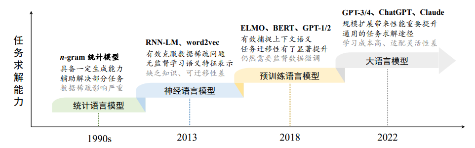

# LLM发展历程

## 1. n-gram
- 具有固定上下文长度 𝑛 的统计语言模型
- 根据一个固定长度的前缀来预测目标单词（预测下一个词的出现概率）

## 2. Word Embedding（“词嵌入”，分布式词向量，稠密向量的非零表征，隐含语义的特征表示）
- what
    - 词转为对应的向量，用于在后续任务中提取语义特征
    - 词向量表即词和向量一一对应的字典

## 3. 预训练语言模型（Pre-trained Language Model, PLM）
- 与早期的词嵌入模型相比，预训练语言模型在**训练架构**与**训练数据**两个方面进行了改进与创新
- 以 ELMo、BERT (Google)、GPT-1 (OpenAI) 为代表的预训练语言模型确立了“预训练-微调”这一任务求解范式。

## 4. 大语言模型（Large Language Model, LLM）
- 大语言模型泛指具有**超大规模参数**或者经过**超大规模数据**训练所得到的语言模型
    - 通常参数规模有10-1000B（百亿、千亿甚至万亿）
    - 通常数据规模有1B (数十亿)

