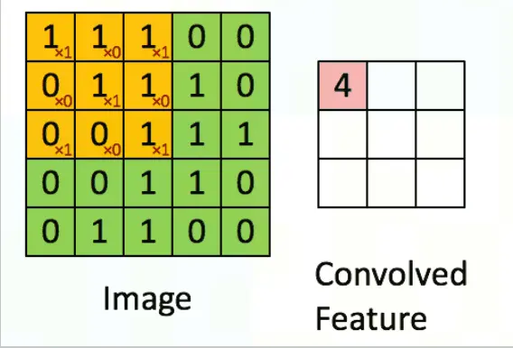

# 神经网络
## 1. 欠拟合与过拟合
- 欠拟合（Underfitting）：模型在训练数据上表现不佳，无法很好捕捉到数据的特征和模式的现象
- 过拟合（Overfitting）：模型在训练数据上表现很好，但在未见过的测试数据上表现较差的现象（泛化能力差， 记忆了训练数据）
    - 通常发生在模型过于复杂或者训练数据较少的情况下
    - 解决方式
        - 数据增强（Data Augmentation）：可以对数据进行扩增，如旋转、缩放、翻转等，从而增加训练数据的多样性，减少模型对于训练数据的过拟合
        - 提前停止（Early Stopping）：在训练过程中监控模型在验证数据上的性能，当性能开始下降时，提前停止训练，避免过拟合
        - 正则化（Regularization）：可以通过在模型的损失函数中引入正则化项来限制模型的参数值，从而减少模型的复杂度，防止过拟合
## 2. 直观表现
- 是由多个点和线组成的
    - 每一个点: 神经元
        - 每个非输入层的神经元都是一个非线性的激活函数，都有一个偏置参数
        - 神经元接收多个输入值（通常用向量表示），对输入值进行加权求和；然后通过一个激活函数（Activation Function）进行非线性映射，生成神经元的输出
    - 每一条线: 连接相邻两层的神经元，代表一个权重，形容了连接的强弱

## 3. 分层结构
### 3.1. 层的分类
#### 3.1.1. 按功能和特点
- 全连接层
- 激活层
- 规范化层/归一化层
- 卷积层
- 池化层
- 循环层
- 嵌入层

##### 3.1.1.1. 全连接层(Fully Connected Layer)
两层之间，每层的每个神经元都和另一层的所有神经元都相连

##### 3.1.1.2. 激活层
激活层为非线性映射，没有激活函数，无论网络有多深，输出都只是输入的线性组合，这将大大限制网络的表示能力。

在实践中，ReLU（Rectified Linear Unit）及其变种是最常用的激活函数，因为它们的计算效率高，并且能够在一定程度上缓解梯度消失问题。激活函数通常应用于卷积层的输出上，为网络引入非线性，增加模型的深度和复杂度，使模型能够捕捉更加复杂的特征。

- 激活函数：加入激活函数就是给模型引入非线性能力
    - 每个非输入层的神经元是一个激活函数，激活函数本质是一个非线性的函数
    - 激活函数引入了非线性操作，使得神经网络可以更好地拟合复杂的非线性关系
    - 通过激活函数的处理，入参和返参的结构没有变，只调整了其中的值
    - 如果单看一个神经元，激活函数的入参和返参都是一个数；一般同一层的神经元使用同样的激活函数，会进行同一层的神经元作为向量一起计算，那么激活函数的入参和返参就是同样结构为【该层神经元数*1】的列向量
    - 入参：加权求和的结果
    - 返参：对入参非线性处理的结果
    - 选择合适的激活函数对于模型的性能至关重要
- 常用激活函数（不同的激活函数，特点和作用不同）
    - Sigmoid函数
        - 将输入映射到[0, 1]之间
        - 常用于二分类问题或者作为输出层的激活函数
        - 可能会导致梯度消失问题
    - Tanh函数
        - 将输入映射到[-1, 1]之间
        - 常用于二分类问题或者作为输出层的激活函数
        - 可能会导致梯度消失问题
        - Sigmoid和tanh的特点是将输出映射在[0,1]和[-1,1]之间，说明Sigmoid和tanh适合做概率值的处理，例如LSTM中的各种门；而ReLU就不行，因为ReLU无最大值限制，可能会出现很大值。
        - tanh 函数可以由 sigmoid 函数经过平移和拉伸得到，两者函数曲线形状相似
        - tanh 函数可以理解为是基于 sigmoid 函数的一种改进的激活函数
    - Softmax函数
        - 将输入映射为概率分布（输出的向量的每一个值都为正而且元素之和为一）
        - 常用于多分类问题的输出层
    - ReLU（Rectified Linear Unit）
        - 将负数输入映射为0，保留正数输入
        - 常用于隐藏层的激活函数
        - 适合用于深层网络的训练，而Sigmoid和tanh则不行，因为它们会出现梯度消失。
        - 经过实际实验发现，使用 ReLU 作为激活函数，模型收敛的速度比 sigmoid 和 tanh 快
        - ReLU 有可能会导致梯度爆炸问题，解决方法是梯度截断
        - ReLU的变体：都是为了解决 ReLU 的 Dead ReLU 问题
            - Leaky ReLU
                - 其在z>0的部分与ReLU一样保持不变；在z<0的部分，采用一个非常小的斜率0.01
                - 但是该方法的缺点是效果并不稳定，所以实际实验中使用该方法的并不多
            - PReLU
                - 可学习参数作为z<0的斜率
            - RReLU
                - 随机数作为z<0的斜率
            - ELU（指数线性单元）

##### 3.1.1.3. 规范化层/归一化层
是深度学习中常用的技术，旨在通过调整网络中间层的输出，使其具有稳定的分布。这有助于加快训练速度，提高模型性能，并且还能起到一定的正则化效果。

为什么要进行归一化处理？ 归一化可以减少内部协变量偏移（internal covariate shift），即保证网络各层输入分布的稳定性，从而使模型训练更加稳定和快速。归一化通常在卷积操作和激活函数之间进行。

##### 3.1.1.4. 卷积层

在被卷积矩阵上移动做乘法和加法得到提取后的特征

因为卷积层能够有效地提取图像特征，并减少模型中参数的数量（相比于全连接层），从而降低过拟合的风险并提高模型的泛化能力。卷积操作保持了图像的空间层次结构，使得网络能够利用图像的局部空间相关性。

##### 3.1.1.5. 池化层
压缩特征，保留主要特征

池化操作可以认为是将一张分辨率高的图片转化为分辨率较低的图片

池化层通常跟随在卷积层之后，其主要作用是进行下采样或降维，减少数据的空间大小，从而减少计算量和参数数量，防止过拟合。

三种池化策略
- 最大池化
- 最小池化
- 平均池化

#### 3.1.2. 按位置
- 输入层/第一层神经元
    - 模型的输入：能表示原始数据信息的向量
- 隐层/中间层(Hidden Layer)
    - 输入层和输出层之间的神经元集合
    - 隐层的神经元数量、激活函数的选择以及层次结构的设计等因素都会对神经网络的性能和学习能力产生影响，因此在设计和训练神经网络时，隐层的设置通常需要经验和调优
- 输出层/最后一层神经元
    - 模型的输出

## 4. MLP,Multiple-Layer Perceiver(多层感知器)

- MLP是最基本的神经网络，属于前馈神经网络（Feedforward Neural Network)。在前馈神经网络中，信息在网络中从输入层（Input Layer）经过多个中间层（Hidden Layers）传递到输出层（Output Layer），并且信息在网络中只能向前传播，不会形成循环。前馈神经网络也被称为无记忆神经网络（Memoryless Neural Network），因为网络中没有存储之前计算的状态。
- 优点：具有较强的非线性建模能力；可以进行端到端的学习；可以并行计算
- 缺点：容易陷入局部最优；容易过拟合；全连接的结构太过复杂，参数超级多

## 5. 神经网络本质：整个神经网络，就是一个有成千上万个可调节参数的超级大函数
### 5.1. 模型的整体表示
f(x;$\theta$)

其中，$\theta$为要更新的参数

### 5.2. 模型参数 = 权重参数 + 偏置参数
- 权重参数(w, weight)
    - 神经网络每一条线代表一个权重，是一个权重参数
- 偏置参数(b, bias)
    - 神经网络中每个非输入层的神经元有一个偏置参数

当我们讨论机器如何学习时，我们其实就是在讨论：电脑如何设置成千上万的模型参数，从而让它能够正确帮我们解决问题

### 5.3. 超参数(Hyperparameters)
人为设置的，不属于模型参数的范畴

是在机器学习算法中需要手动设置的参数，用于控制模型的学习过程和性能。与模型参数不同，超参数的值不能通过训练数据自动学习得到，而需要在训练之前由人工设置。

超参数的选择会影响模型的性能和训练速度，因此合理的超参数选择对于获得良好的模型性能非常重要。

#### 5.3.1. 常见的超参数
- Batch Size(批大小)
- Learning Rate(学习率)
- Epochs(迭代次数)
- 正则化(Regularization)
- 激活函数
- 网络结构（层数、神经元数量等）
- 损失函数
- 优化算法

#### 5.3.2. Batch Size(批大小)
一次参数更新中使用的样本数量

在目前大多数模型的训练过程中，训练数据通常被划分为多个小批次（Batch）进行处理，每个批次包含一定数量的样本。

批大小的选择会直接影响模型的训练速度和内存占用。
- 较大的批大小可以加速训练过程，因为可以利用硬件的并行性进行计算，但可能会占用更多的内存。
- 较小的批大小则可以减小内存占用，但可能导致计算效率较低。

合适的批大小通常需要根据具体的任务和硬件资源进行选择，常见的取值范围通常在几十到几千之间。

#### 5.3.3. Learning Rate(学习率)
学习率用于控制模型在每一轮训练中对权重进行更新的步伐大小。具体来说，学习率决定了在梯度下降优化算法中，每次更新权重时权重的变化量。

学习率可以是恒定的，可以衰减，也可以自动调整

图中左边是参数向量，右边是梯度向量，我们是以梯度的倍数去调节左边的参数的，这个倍数其实就是学习率。

#### 5.3.4. Epochs(迭代次数)
表示模型在整个训练数据集上的训练次数

迭代次数的大小会影响模型的性能
- 过少迭代次数可能导致欠拟合
- 过多迭代次数可能导致过拟合

#### 5.3.5. 正则化(Regularization)
正则化是一种限制模型的参数值，减少模型的复杂度，从而避免模型在训练数据上过拟合的技术。

正则化方法
- L1 正则化(L1 Regularization，也称为 Lasso 正则化)
    - 一句话概括：把某些参数的权重变成0
    - L1 正则化可以用于控制神经网络中的参数稀疏性，使得模型权重倾向于稀疏化，从而减小模型复杂性，提高模型泛化能力
- L2 正则化(L2 Regularization，也称为 Ridge 正则化)
    - 一句话概括：抑制模型的一些权重取值过大
    - L2 正则化可以用于控制神经网络中的参数值的大小，使得模型权重趋向于较小的值，从而减小模型复杂性，提高模型泛化能力
- Dropout 正则化
    - 一句话概括：扔掉一些神经元
    - Dropout 可以随机地设置某些神经元的输出为零，从而迫使网络在训练过程中不依赖于特定的神经元，从而减小模型复杂性，提高模型泛化能力

#### 5.3.6. 损失函数/目标函数/成本函数/目标损失函数(Loss Function)

用于评估模型的表现好坏
- 在监督式学习中用来度量模型预测值与真实标签之间差异的函数
- 损失函数的大小取决于模型对训练数据的综合表现

##### 5.3.6.1. 公式

L(y,f(x;$\theta$))

- 入参：模型参数
    - 直观看，入参是模型输出层结果，但本轮的模型参数唯一影响这个结果，所以真正的入参是所有的成千上万的模型参数
- 返参：一个实数

##### 5.3.6.2. 常用损失函数
###### 5.3.6.2.1. 交叉熵损失函数(Cross-Entropy Loss Function)
是一种用于测量两个概率分布之间差异的数学函数

公式

对模型输出层中与真实标签对应的那个概率值取负对数

真实标签的概率值越大，Loss就越小

适用

语言模型的损失函数几乎都是交叉熵损失函数

语言模型里，我们经常去依据前文的信息去预测下一个单词会是什么；神经网络最后输出的其实也是一个所有词的概率分布。此时，交叉熵损失函数可以帮助我们度量模型预测的概率分布与我们真正想要的概率分布之间的差异。

常用于分类任务中，特别是在神经网络中作为损失函数

###### 5.3.6.2.2. 平方损失函数(Quadratic Loss Function)
适用

一般不用此

不适用于分类问题，而适用于预测的输出值是一个实数值的任务中

在强化学习的TD算法里，我们会用到它

公式

预测值与真实值的差的平方的二分之一

###### 5.3.6.2.3. 均方误差 (MSE) 

#### 5.3.7. 优化算法
优化算法就是决定在更新参数时如何调整步长、方向等因素，以最小化损失函数的值。

最常见的优化算法：小批量梯度下降

- 常用参数更新方法
    - 梯度下降：在一个方向上更新和调整模型的参数，来最小化损失函数
    - 随机梯度下降（Stochastic gradient descent，SGD）  
        - 对每个训练样本进行参数更新，每次执行都进行一次更新，且执行速度更快
    - 小批量梯度下降（Mini Batch Gradient Descent）
        - 对每个批次中的n个训练样本执行一次更新
        - 使用小批量梯度下降的优点
            - 可以减少参数更新的波动，最终得到效果更好和更稳定的收敛
            - 可以使用上矩阵优化方法，使计算小批量数据的梯度更加高效
        - 通常来说，小批量样本的大小范围是从50到256，可以根据实际问题而有所不同。
        - 在训练神经网络时，通常都会选择小批量梯度下降算法
    - 动量（Momentum）技术
        - 通过优化相关方向的训练和弱化无关方向的振荡，来加速SGD训练
    - Adam算法
        - 即自适应时刻估计方法（Adaptive Moment Estimation），能计算每个参数的自适应学习率。这个方法不仅存储了AdaDelta先前平方梯度的指数衰减平均值，而且保持了先前梯度M(t)的指数衰减平均值，这一点与动量类似

## 6. 神经网络的训
学习过程就是反复去做梯度下降，让损失最小化的过程

### 6.0. LLM 的训练目标
LLM 的训练目标通常是最大似然估计（Maximum Likelihood Estimation，MLE）。最大似然估计是统计学中一种常用的参数估计方法，其核心思想是通过最大化似然函数来估计模型参数，使得在该参数下观测到的数据出现的概率最大。

在LLM的训练过程中，使用的数据通常是大量的文本语料库。训练目标是最大化模型生成训练数据中观察到的文本序列的概率。具体来说，对于每个文本序列，模型根据前文生成下一个词的条件概率分布，并通过最大化生成的词序列的概率来优化模型参数。

为了最大化似然函数，可以使用梯度下降等优化算法来更新模型参数，使得模型生成的文本序列的概率逐步提高。在训练过程中，通常会使用批量训练（batch training）的方法，通过每次处理一小批数据样本来进行参数更新。

### 6.1. 前向传播(Forward Propagation)
是神经网络训练的第一步

在神经网络中，从输入层到输出层的方向，进行信息传递的过程

在前向传播中，输入数据通过神经网络的多个层（包括输入层、隐藏层和输出层）按照预定的权重和偏置进行计算，从输入层传递到输出层，最终得到神经网络的预测结果

### 6.2. 反向传播(Back Propagation)
反向传播就是公式从输出到输入的方向

反向传播是前向传播的逆过程，通过计算损失函数对神经网络输出的梯度，从输出层到输入层逐层的传播，计算每一层的梯度，并用于更新模型参数

反向传播的基本思想是根据链式法则计算损失函数对模型参数的梯度

#### 6.2.1. 梯度下降(Gradient Descent)
梯度下降就是更新模型参数，让损失做最大的下降的一次操作

负梯度向量其实告诉了我们，怎么去调节每一个参数，可以让神经网络的损失下降的最快。

#### 6.2.2. 梯度
梯度是一个向量，向量的维度就是模型参数的个数

它表示了这个多元函数在某一点上变化最快的方向和变化率，沿着这个方向，函数值的变化最大。

直观理解：最陡的方向

#### 6.2.3. 公式

假定每次训练我们使用 N 个样本，那么 Batch Size 就是 N。此时，Loss Function 就是这 N 个交叉熵函数的大小的平均值，我们是基于这个损失值去做反向传播，更新模型的参数的。

#### 6.2.4. 步骤
计算神经网络中各层权重和偏置的梯度并更新模型参数

- 1.计算梯度
    - 如何去计算那些梯度，变成了神经网络算法在工程实现上的核心问题。我们称之为反向传播算法
- 2.更新模型参数
新的参数值 = 旧的参数值 - 学习率 * 梯度中该参数对应的值

#### 6.2.5. why
让损失最小化，第一直觉就是求损失函数的最小值或极小值。但有成千上万参数的函数求最小值或极小值无法做到。

既然求不了最小值或极小值，那我们该怎么做呢？
多元函数是一个曲面，因为模型的参数是随机初始化的，所以函数的结果就随机的落在了曲面的一个点上。

那我们就计算在每个方向的斜率，找到斜率最大的那个方向（最陡的方向），也就是梯度。然后沿着梯度方向往下走。（斜率很大，就多走几步快速下降；斜率很小，就少走几步，防止调过头）

对于每个点都如此反复，一直这么做下去，那么它就迟早会落到一个低点了。

想象一个人在凹凸不平的连绵不绝的山丘里找下山的路

#### 6.2.6. 梯度上升和梯度下降
- 梯度上升
    - 让多元函数的所有参数都沿着梯度的正方向走
    - 此时函数值上升最快
    - 适用场景：我们在强化学习的策略学习中，最大化状态价值函数，会做梯度上升
- 梯度下降
    - 让多元函数的所有参数都沿着梯度的反方向走
    - 此时函数值下降最快
    - 适用场景：在更多的场合，我们为了最小化损失，会去做梯度下降

#### 6.2.7. 梯度消失问题和梯度爆炸问题
##### 6.2.7.1. what
- 梯度消失问题(Gradient Vanishing)
    - 现象
        - 反向传播到较深层时，梯度非常小，甚至趋于零，导致这些层的权重更新变得非常缓慢或停止更新，使得这些层的参数无法得到有效的训练。
    - 导致的原因和解决
        - 矩阵连乘
            - 在反向传播时，梯度会连乘，当梯度都小于1.0时，就会出现梯度消失；当梯度都大于1.0时，就会出现梯度爆炸
            - 解决：残差连接和 normalize
                - 由于使用了残差连接和 normalize 之后梯度消失和梯度爆炸已经极少出现了，所以目前可以认为矩阵连乘导致的梯度爆炸或梯度消失的问题已经解决了
        - 使用了Sigmoid和tanh激活函数
            - 解决：换用ReLU激活函数
- 梯度爆炸问题(Gradient  Explosion)
    - 现象
        - 反向传播到较深层时，梯度非常大，导致权重参数更新过大，从而使得模型的训练极不稳定
    - 导致原因
        - 矩阵连乘
            - 在反向传播时，梯度会连乘，当梯度都小于1.0时，就会出现梯度消失；当梯度都大于1.0时，就会出现梯度爆炸
    - 解决途径：
        - 梯度截断（也就是给一个最大值范围，如果超出了就取给定的最大值）
        - 残差连接和 normalize
            - 由于使用了残差连接和 normalize 之后梯度消失和梯度爆炸已经极少出现了，所以目前可以认为矩阵连乘导致的梯度爆炸或梯度消失的问题已经解决了

##### 6.2.7.2. why
反向传播过程中，深层的网络的梯度计算需要经过连乘的操作，从而可能导致梯度的值指数级地变化，从而使梯度变得非常大或非常小

##### 6.2.7.3.  how
归一化(Normalization)：将数据的均值变为0，方差变为1

## 7. 示例
### 7.1. 任务
识别手写数字

### 7.2. 特征提取

构成这张图的28*28=784个像素点的灰度

像素点的灰度：对于每一个像素，我们都给他赋一个从0到1的值。一个像素点越黑，他就越接近0；一个像素点越白，他就越接近1

将一张图表示为784维的、每个元素都在0到1之间的向量

### 7.3. 神经网络
#### 7.3.1. 整体结构

#### 7.3.2. 分层结构
##### 7.3.2.1. 输入层
784个神经元

##### 7.3.2.2. 隐层
2层
- 隐层的第1层：16个神经元
- 隐层的第2层：16个神经元

##### 7.3.2.3. 输出层
10个神经元，每个神经元分别代表0~9的手写数字

#### 7.3.3. 函数视角
共13002个模型参数
- 12960个权重参数：784*16+16*16+16*10=12960
- 42个偏置参数：16+16+10=42

线性代数表示（同一层的一起计算）
- 输入层表示为[784*1]的列向量
- 隐藏层第一层
    - active_function1([16 x 784] x [784 x 1] + [16 x 1]) = [16 x 1]
    - 细节
        - 权重矩阵【16 x 784】
        - 输入层【784 x 1】
        - 隐藏层第一层的16个偏置参数【16 x 1】
        - 激活函数 active_function1(【16 x 1】) = 【16 x 1】
- 隐藏层第二层
    - active_function2(【16 x 16】【16 x 1】+【16 x 1】)=【16 x 1】
- 输出层
    - active_function3(【10 x 16】【16 x 1】+【10 x 1】)=【10 x 1】

### 7.4. 识别的结果
输出层中值最大的神经元对应的手写数字

