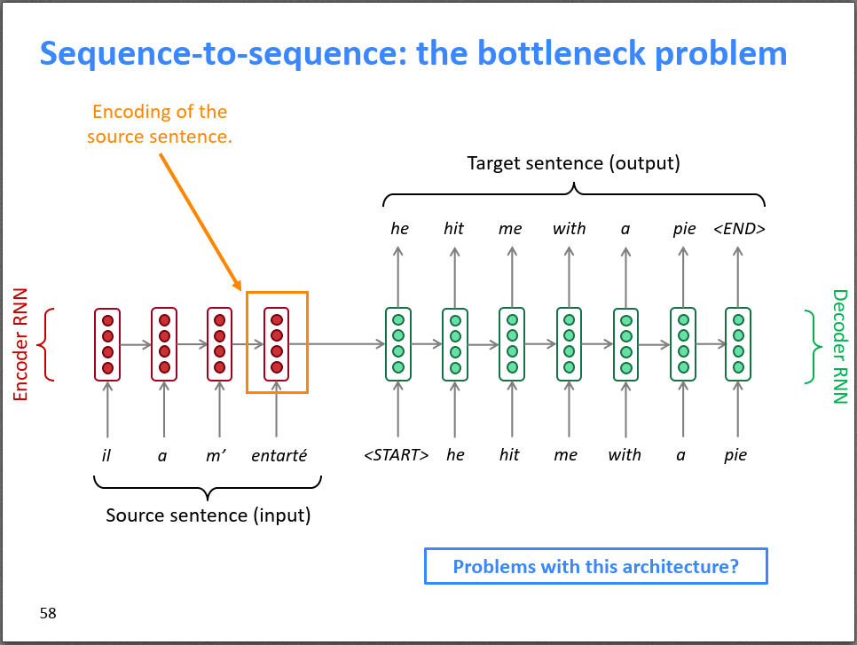

# Attention(注意力机制)
## 1. 朴素seq2seq的信息瓶颈

用Encoder RNN的最后一个神经元的隐状态作为Decoder RNN的初始隐状态。
这里存在一个问题：Encoder的最后一个隐状态（Context Vector）承载了源句子的所有信息，成为整个模型的“信息”瓶颈。

## 2. 注意力机制就是希望打破这个信息瓶颈。宏观来看，Attention直接把Decoder中的每一个隐层，和Encoder中的每一个隐层，都连接起来了！
我们在解码的时候，是一个词一个词生成的。对于每一个词，它不仅可以接受Context Vector作为辅助信息, 也可以通过“直连”线路去获取Encoder RNN中的其他的隐状态的信息，从而为Decoder的解码进行辅助。

## 3. 向量的点积(Dot Product)==矩阵的乘法
### 3.1. 向量的点积
点积的结果是一个标量，反映了两个向量的相似程度 

是线性代数中的一种运算，它是两个同维度向量之间的一种运算方式，通常用符号“·”表示。
也就是说，点积将两个向量中对应位置的元素相乘后再求和。

### 3.2. 矩阵的乘法
可以看成是多个向量同时计算点积

只要满足矩阵乘法的条件就可以计算

## 4. QKV : 每个词有q,k,v(query,key,value)

- query可以让你问一个关于这个词的问题，比如，非洲正在发生什么
- key可以查看所有其他词，帮助得出与query最有关联的答案
- value表示当前key对应的这个词的信息本身

Attention的QKV起源
- 有一种解释说，Attention中的Query，Key，Value的概念源于信息检索系统。举个简单的例子，当你在淘宝搜索某件商品时，你在搜索栏中输入的信息为Query，然后系统根据Query为你匹配Key，根据Query和Key的相似度得到匹配内容。

## 5. Attention机制的步骤
公式：

举例

假设序列里只有2个词，这是向量级别的运算，实际运算是所有词组成矩阵一同运算的

### 5.1. 注意力得分(Attention Score)（计算相关性）
- 分子部分
    - Decoder当前步与Encoder所有步(N步)分别进行点积计算，得到N个标量，即注意力得分(Attention Score)
    - 这N个标量构成一个N维向量，它反映了解码器中当前时间步的隐状态与编码器中各个时间步的隐状态的相关性打分
    - 自注意力为每个词和所有词分别求点积计算相关性

- 分母部分
    - 将计算的每个点积同倍缩小
    - 分母部分是点积的缩放，避免值太大，这样的注意力也叫缩放点积注意力(the scaled dot-product attention)
    - 这里的除以8（Q、K、V向量的维度64的根号值）更多的其实是一种基于实践的工程经验

### 5.2. 注意力分布(Attention Distribution)（获取概率密度分布）
- 将注意力得分使用Softmax函数得到概率分布，即注意力分布
- softmax()部分

这个Attention distribution告诉了Decoder在时刻t，更应该把“注意力”放在Encoder的哪些隐状态上。

### 5.3. 注意力输出(Attention Output)（求期望值）
- 将注意力分布作为权重，对所有词进行加权求和
- softmax()·V部分

既然注意力分布是一个概率密度函数，那注意力输出其实很类似数学期望

## 6. Self-Attention(自注意力)
和seq2seq的attention一模一样，唯一区别是，那个不是self，这个是self

## 7. Multi-Head Attention(多头注意力)
多头注意力的理解：多头指多个角度来分析

eg. 法语译为英语：Jane visite I'Afrique en septembre-->Jane visits Africa on september.

- head1角度：what's happen?

- head2角度：when?

- head3角度：who?

多个头的权重矩阵是不同的

计算出多头后，连起来，在乘以Wo，就是多头注意力的值

可学习的模型参数: 头数*QKV的3个权重矩阵+输出时的权重矩阵

## 8. Attention机制带来的好处

