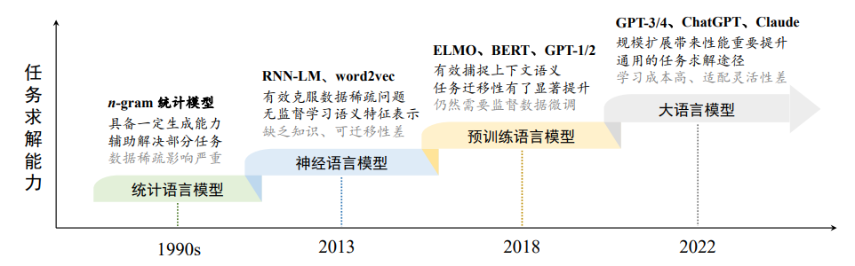

# LLM发展历程

## 1. n-gram
- 具有固定上下文长度 𝑛 的统计语言模型
- 根据一个固定长度的前缀来预测目标单词（预测下一个词的出现概率）

## 2. Word Embedding（“词嵌入”，分布式词向量，稠密向量的非零表征，隐含语义的特征表示）
- what
    - 词转为对应的向量，用于在后续任务中提取语义特征
    - 词向量表即词和向量一一对应的字典
- how
    - 独热编码（One-hot向量，One-hot编码，One-Hot Representation，基于词典空间的稀疏词向量表示）
        - 举例：假如词典中共有10000个词，则这个one-hot向量长度就是10000，该词在词典中所处位置对应的值为1，其他值为0
        - 优点：简单
        - 缺点
            - 向量维度非常大，且每个向量是稀疏的
            - 不同词的one-hot编码向量是正交的，在向量空间中无法表示近似关系，即使两个含义相近的词，它们的词向量点积也为0
    - Embedding (词嵌入，词向量)
        - 用维度有限的稠密的向量来表示所有的词汇，传统的Transformer中，词嵌入有512维；BERT中，词嵌入有768维和1024维两个版本。
        - one-hot与embedding的关系 
            - 词向量就是one hot的全连接层的权重矩阵参数
            - 例如，对于一个有30000个词汇量的词典V，每一个词都是30000维的一个稀疏向量。对于每一个词，我们给他乘一个30000*512的权重矩阵，最终就得到一个512维的向量了
        - 词向量算法代表：word2vec
            - word2vec是一个具有代表性的词嵌入学习模型，它构建了一个简化的浅层神经网络来学习词表示
            - 两种训练方式/两种模型
                - 连续词袋模型 CBOW （Continuous Bag of Words）
                    - CBOW模型根据上下文单词的平均向量来预测中心单词
                    - 思想：如果两个词的上下文很相似，那么这两个词很相似
                - Skip-gram模型
                    - 根据一个中心单词来预测它周围的上下文单词
                    - 思想：如果两个词很相似，那么这两个词的上下文也会很相似

## 3. 预训练语言模型（Pre-trained Language Model, PLM）
- 与早期的词嵌入模型相比，预训练语言模型在**训练架构**与**训练数据**两个方面进行了改进与创新
- 以 ELMo、BERT (Google)、GPT-1 (OpenAI) 为代表的预训练语言模型确立了“预训练-微调”这一任务求解范式。

## 4. 大语言模型（Large Language Model, LLM）
- 大语言模型泛指具有**超大规模参数**或者经过**超大规模数据**训练所得到的语言模型
    - 通常参数规模有10-1000B（百亿、千亿甚至万亿）
    - 通常数据规模有1B (数十亿)