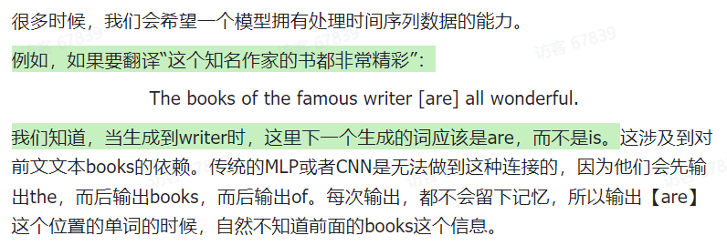
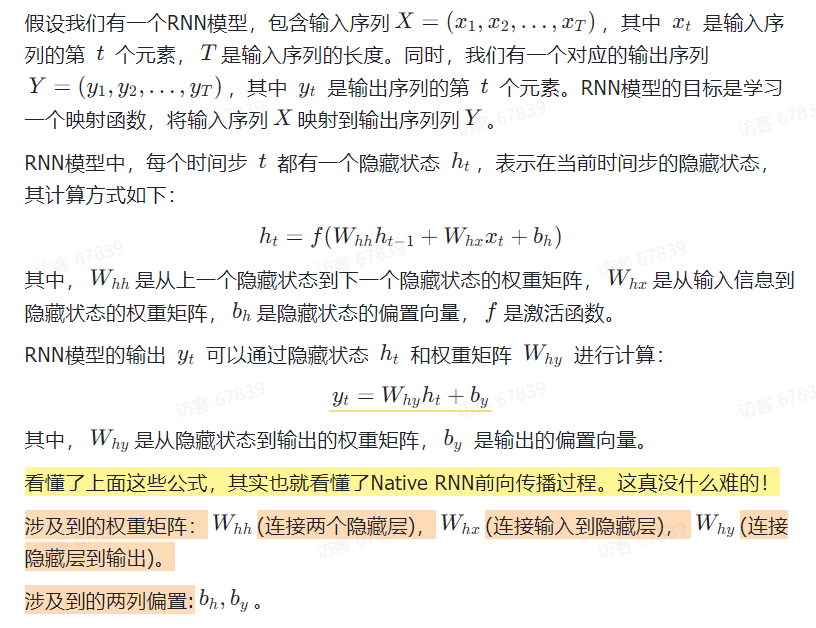
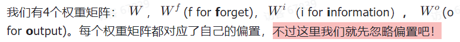
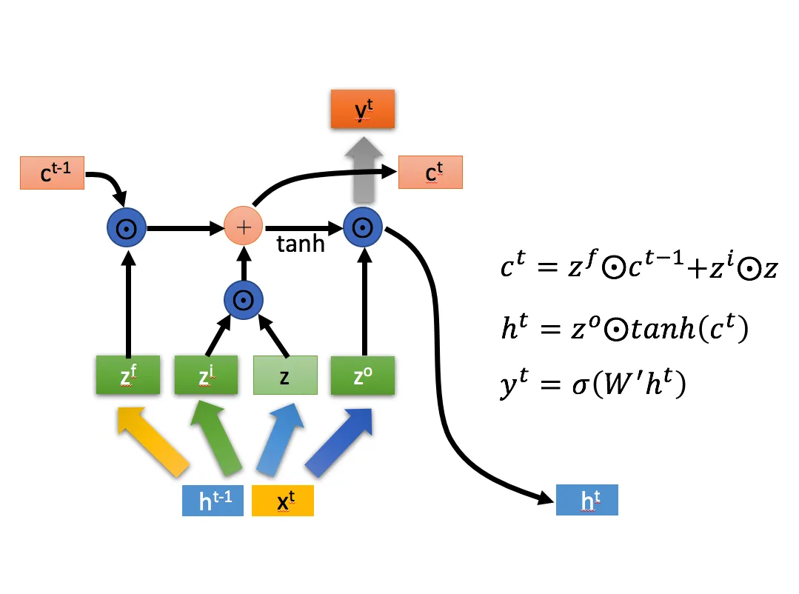
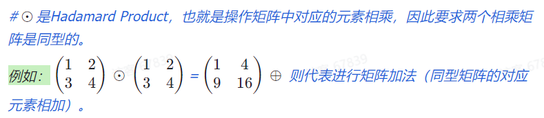
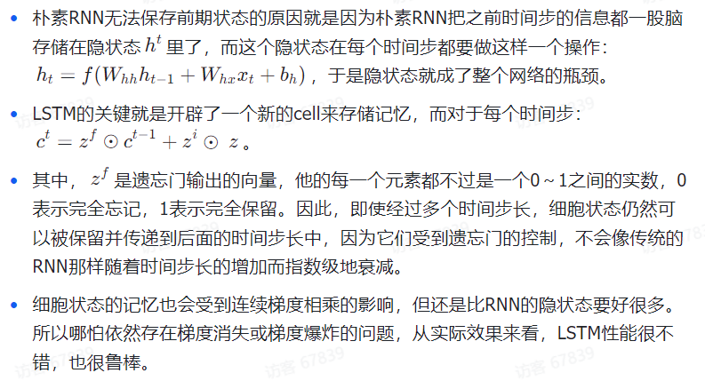
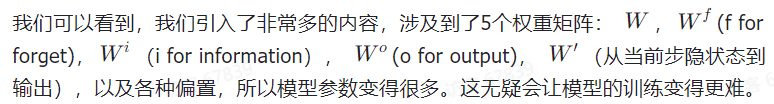

# RNNs
## 1. 优点
模型有了记忆力

## 2. 缺点
只能串行训练，无法并行训练

## 3. 适用
循环神经网络非常适合用于具有序列特征的数据的识别

## 4. 典型模型
### 4.1. Native RNN(传统RNN)
#### 4.1.1. 公式: 模型结构就是公式的表示

#### 4.1.2. 优点
模型有了记忆

#### 4.1.3. 缺点
记忆力过强，每个时间步的隐藏状态都包含了全部历史时刻的信息

导致的问题
- 信息价值逐渐降低
    - 因此随着时间步的增加，隐藏状态中的信息会越来越多，其中有价值的信息含量的比率会越来越少
    - 为了解决这个问题，我们要想办法给Native RNN引入遗忘机制
- 存在梯度消失问题
    - 处理长序列时存在梯度消失和梯度爆炸的问题
    - 梯度爆炸相对而言比较好解决，通过梯度裁剪、调整学习率等方法就可以很好的控制，但是处理梯度消失就非常的麻烦（所以后面我们也会更多的关注梯度消失的问题）。当梯度消失时，网络就很难学习到序列中的长期依赖关系。
    - 梯度消失会带来哪些问题呢？一个很明显的问题就是参数更新更多的受到临近词的影响，那些和当前时刻t较远的词对当前的参数更新影响很小。

### 4.2. LSTM
LSTM是Native RNN的变体，对Native RNN做了优化

Native RNN中，h代表记忆；LSTM中，c代表记忆

#### 4.2.1. 公式：别被图吓到，不难哦，图就是公式的表示

Note：因为xmind写不了公式，这里用括号表示下标

1.拼接x(t)和h(t-1)为一个新的更长的向量

2.计算出4个向量z,z(f),z(i),z(o)

#### 4.2.2. 3个阶段
##### 4.2.2.1. 忘记阶段
对上一个节点传进来的输入进行选择性忘记

忘记门控：z(f)

这个能力通过学习W(f)参数来实现

##### 4.2.2.2. 选择记忆阶段
记忆门控：z和z(i)

这个能力通过学习W和W(i)参数来实现

##### 4.2.2.3. 输出阶段
决定哪些将会被当成当前状态的输出

输出门控：z(o)

这个能力通过学习W(o)参数来实现

#### 4.2.3. 如何从图里看公式：从输出看到输入
不要从输入看到输出，这样会很混乱，而应该找准一个公式后，看哪些箭头指向了输出，从输出看到输入

##### 4.2.4. 优：缓解了梯度问题

##### 4.2.5. 缺

### 4.3. GRU
GRU是LSTM的变体，对LSTM做了优化

GRU很聪明的一点就在于，它采用了一些巧妙的构思，让一个门控同时可以进行遗忘和选择记忆，而LSTM则要使用多个门控，因此GRU很多时候都会更加实用。