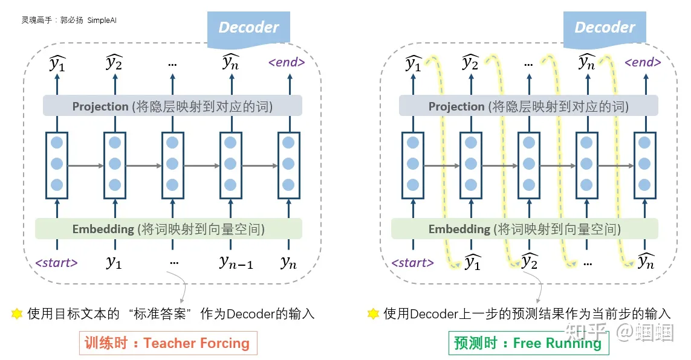
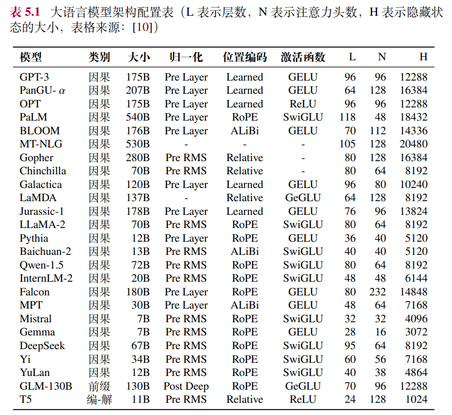
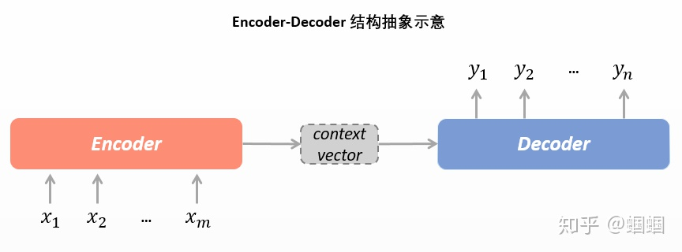

# 编码器和解码器
三种结构
- seq2seq结构/Encoder-Decoder结构
    - 代表：T5，BART，Transformer
        - Transformer 模型一开始是用来做 seq2seq 任务的，所以它包含 Encoder 和 Decoder 两个部分
- Encoder Only 结构
    - 代表：BERT
        - 完形填空形式，目标是理解，只需要encoder机制
- Decoder Only 结构
    - 代表：GPT
        - 补全形式，目标是生成，只需要decoder机制

自然语言理解和自然语言生成
- Encoder 架构被认为更适合去解决自然语言理解任务（如完形填空等）
- Decoder 架构更适合解决自然语言生成任务（如文本摘要等）

Encoder 和 Decoder 的区别
- Encoder 在抽取序列中某一个词的特征时能够看到整个序列中所有的信息，即上文和下文同时看到
- Decoder 中因为有 mask 机制的存在，使得它在编码某一个词的特征时只能看到自身和它之前的文本信息

- 为什么现在的LLM都是Decoder only的架构？
    - encoder-only不擅长做生成任务，decoder-only的模型用 next token prediction 预训练，兼顾理解和生成
    - 就生成任务而言，引入双向注意力并无实质好处。而Encoder-Decoder架构之所以能够在某些场景下表现更好，大概只是因为它多了一倍参数。所以，在同等参数量、同等推理成本下，Decoder-only架构就是最优选择了
    - decoder-only支持一直复用KV-Cache，对多轮对话更友好，因为每个Token的表示只和它之前的输入有关，而encoder-decoder就难以做到
## 1. Decoder Only训练时和推理时有区别
- 训练时：接受Encoder给出的表示向量和“标准答案”作为输入。
- 推理时：接受Encoder给出的表示向量和Decoder上一步的预测结果作为输入。这种使用上一步预测结果作为下一步输入的方式，我们称为自回归(Auto-regressive)。GPT就是一个自回归的文本生成模型。自回归形式天然适合Generative的场景，这不难理解，就像是我们写文章是从左往右边写边想的一样。

## 2. 一些典型的大语言模型的详细配置

## 3. seq2seq结构/Encoder-Decoder结构
seq2seq是一个很强大的模型，不但可以用来做机器翻译，还可以用来做很多NLP任务，比如自动摘要、对话系统等。

叫seq2seq的原因，在于其输入和输出都是一个词序列。那就是sequence to sequence，即seq2seq。<所以正确读音是 /si:k-tu:-si:k/噢！不要读错了>

构成
- Encoder(编码器)
    - 读取输入文本，将输入的文本（词序列）整体编码成一个表示向量，而后交给Decoder进行解码。
    - text(文本)=>Context Vector(表示向量)
    - Encoder RNN负责对源语言进行编码，学习源语言的隐含特征。Encoder RNN的最后一个神经元的隐状态作为Decoder RNN的初始隐状态。
- Decoder(解码器)
    - Context Vector(表示向量)=>text(文本)

