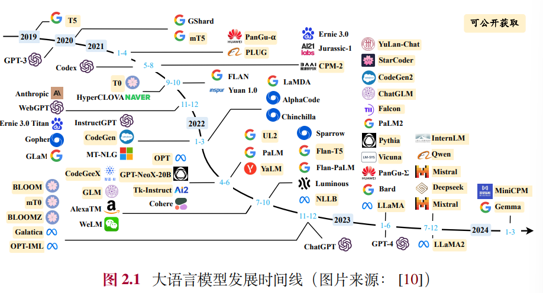
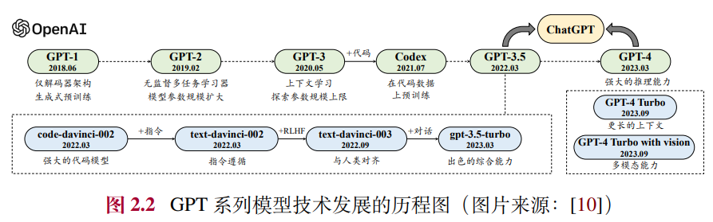
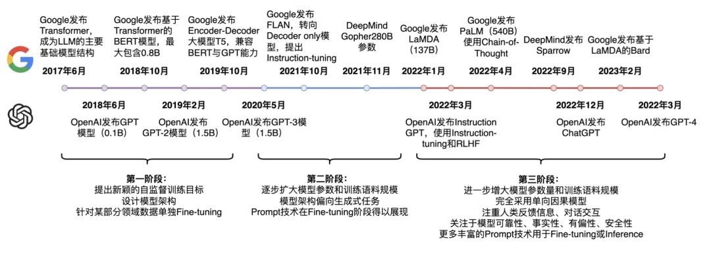

# GPT 自然语言生成
## 1. Transformer 到 GPT
模型名称GPT是生成式预训练（Generative Pretrained Transformer）的缩写

Decoder-Only Transformer

GPT是一个12层的Transformer解码器

12层解码器，768维词嵌入，12个注意力头

- 去掉了第二个Encoder-decoder Attention子层
    - 因为没有Encoder，第二个子层自然无法获得K和V
- 此时和Encoder的唯一差别是第一个多头注意力层有没有带掩码了
    - 如果没带掩码那就是Encoder，如果带了掩码那就是Decoder

## 2. GPT系列模型的技术演变

该图中实线表示在两个模型之间的进化路径上存在明确的证据（例如，官方声明新模型是基于基础模型开发的），而虚线表示相对较弱的进化关系。

GPT1到GPT4逐步扩大模型参数和训练语料规模

研发历程
- 早期探索阶段
    - GPT-1
        - GPT-1基于生成式、仅有解码器的Transformer架构开发，奠定了GPT系列模型的核心架构与基于自然语言文本的预训练方式，即预测下一个词元
    - GPT-2
        - GPT-2沿用了GPT-1的类似架构，将参数规模扩大到1.5B，并使用大规模网页数据集WebText进行预训练
- 路线确立（规模扩展）阶段
    - GPT-3
        - GPT-3模型将模型参数扩展到了175B的规模，与GPT-2相比，GPT-3直接将参数规模提升了100余倍，对于模型扩展在当时给出了一个极限尝试
        - 在GPT-3的论文中，它正式提出了"上下文学习"这一概念，使得大语言模型可以通过少样本学习的方式来解决各种任务。上下文学习可以指导大语言模型学会"理解"自然语言文本形式描述的新任务，从而消除了针对新任务进行微调的需要
        - GPT-3可以被看作从预训练语言模型到大语言模型演进过程中的一个重要里程碑，它证明了将神经网络扩展到超大规模可以带来大幅的模型性能提升，并且建立了以提示学习方法为基础技术路线的任务求解范式
- 能力增强阶段
    - OpenAI探索了两种主要途径来改进GPT-3模型，即代码数据训练和人类偏好对齐
        - 代码数据训练 Codex
            - 这是一个在大量GitHub代码数据集合上微调的GPT模型。实验结果表明，Codex可以解决非常困难的编程问题，还能显著提升大模型解决数学问题的能力。
            - 启发：对于可用于预训练的数据范围的扩展，可能并不局限于自然语言形式表达的文本数据
        - 人类偏好对齐
            - InstructGPT论文和RLHF强化学习对齐方法
                - OpenAI在2022年初发布了InstructGPT的学术论文，系统地介绍了如何将语言模型进行人类对齐。具体来说，主要引入了基于人类反馈的强化学习对齐方法RLHF（Reinforcement Learning from Human Feedback），在指令微调后使用强化学习加强模型的对齐能力
                - RLHF除了提高指令遵循能力，还有助于缓解有害内容的生成，这对于大语言模型在实际应用中的安全部署非常重要
    - GPT-3.5
        - 通过这些增强技术，OpenAI将改进后的具有更强能力的GPT模型命名为GPT-3.5模型
- 性能跃升阶段
    - ChatGPT
        - 基于GPT模型的人工智能对话应用服务，对于对话能力进行了针对性优化
        - 能力：拥有丰富的世界知识、复杂问题的求解能力、多轮对话的上下文追踪与建模能力、与人类价值观对齐的能力等。在后续的版本更迭中，ChatGPT进一步又支持了插件机制，通过现有工具或应用程序扩展了它的功能
        - 意义：ChatGPT一经推出就引发了社会的高度关注，对于人工智能的未来研究产生了重要影响
    - GPT-4
        - 输入由单一文本模态扩展到了图文双模态。在解决复杂任务方面的能力显著强于GPT-3.5，在一系列面向人类的考试中都获得了非常优异的结果
        - 意义：GPT-4发布后，微软的研究团队针对其进行了大规模人类生成问题的性能测试，实验结果表明GPT-4具有令人震撼的模型性能，论文作者认为GPT-4的到来展现出了通用人工智能的曙光
    - GPT-4V、GPT-4 Turbo以及多模态支持模型
        - 增强了多模态能力，分别由GPT-4 Turbo with Vision、DALL·E-3、TTS（Text-to-speech）以及Listen to voice samples等支持实现

