# Deepseek 技术解读
## 1. About
- HuggingFace : https://huggingface.co/deepseek-ai
- Github : https://github.com/deepseek-ai

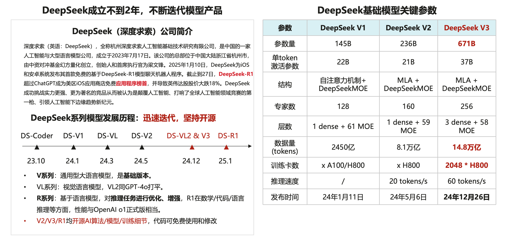

DeepSeek系列（都开源了，算法/模型/训练细节）
- V系列：通用型语言模型，基础版本
    - DeepSeek-V3
- R系列：推理模型
    - DeepSeek-R1-Zero
    - DeepSeek-R1
- VL系列：视觉语言模型
    - DeepSeek-VL2

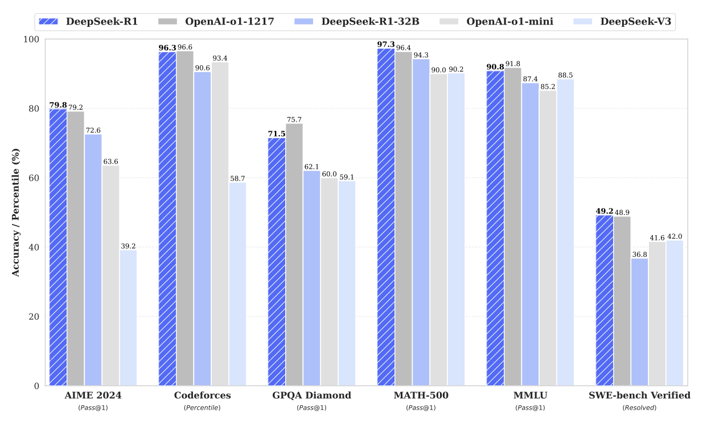

## 2. DeepSeek-V3、DeepSeek-R1-Zero 与 DeepSeek-R1 的关系

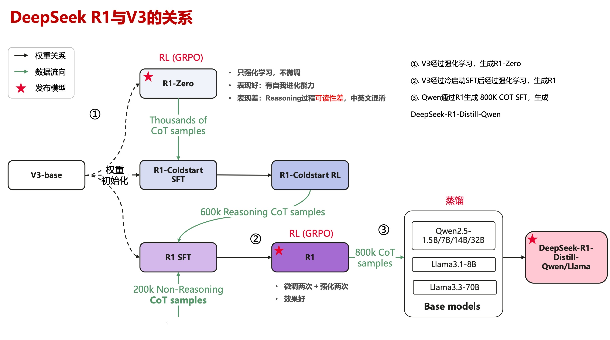

- 共同点
    - 三者都属于 MoE（混合专家）架构
        - ‌MoE（Mixture of Experts）是组合多个专家模型提升深度学习模型性能和效率的架构。‌其核心思想是通过引入多个专家模型（Experts），每个输入数据只选择和激活其中的一部分专家模型进行处理，从而减少计算量，提高训练和推理速度。‌MoE的概念在1991年就已提出，训练不容易收敛是其在大模型领域应用的主要障碍。
        - 对于任意输入，只有部分参数处于活跃状态
    - 三者都具有 671B 参数（Total Params），其中每个 Token（词元）的计算约激活 37B 参数（Activated Params），上下文长度（Context Length）为 128K
- 关系
    - DeepSeek-R1-Zero 来自于 DeepSeek-V3
    - DeepSeek-R1 来自于 DeepSeek-V3 和 DeepSeek-R1-Zero
        - DeepSeek-R1是具有推理（Reasoning）能力的V3
- 各自特点
    - DeepSeek-R1-Zero
        - DeepSeek-R1-Zero 最大的特点在于，该模型**仅使用强化学习**进行的训练，通过各种思维链（CoT，Chain of Thought）数据特别是Long CoT数据来激活模型的推理能力
        - R1-Zero展示出自我验证、反思和长链思维推理能力，甚至在推理方面得分略微超过R1
        - 虽然R1-Zero有一些明显的局限性，特别是在输出可读性和语言一致性方面，仍需要解决可读性差和语言混合等问题
        - 这大概是第一个公开验证大模型的推理（Reasoning）能力可以仅通过强化学习来完成训练
        - 在我们看来，R1-Zero的价值远超R1
    - DeepSeek-R1
        - 相比之下，DeepSeek-R1采用了**多阶段训练方法，加入少量CoT数据进行SFT作为冷启动，再进入强化学习**
        - 这种方法改善了 DeepSeek-R1-Zero 的语言可读性和连贯性，同时在推理之外的测试中实现了更好的性能

## 3. DeepSeek-R1/V3 的主要创新
DeepSeek 从模型结构到训推全流程的极致工程优化，带来大模型新范式。

多头潜注意力 (MLA) 机制和 DeepSeekMoE 是 V3 和 R1 模型提高计算效率，减少算力浪费的关键。其中 MLA 大概贡献了 2-4 倍的计算效率提升，DeepSeekMoE 大概贡献了4倍以上的计算效率提升。

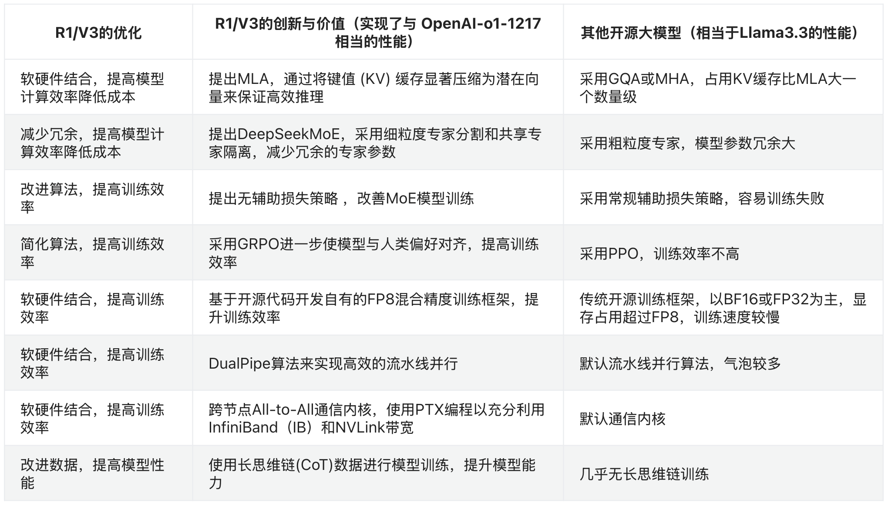

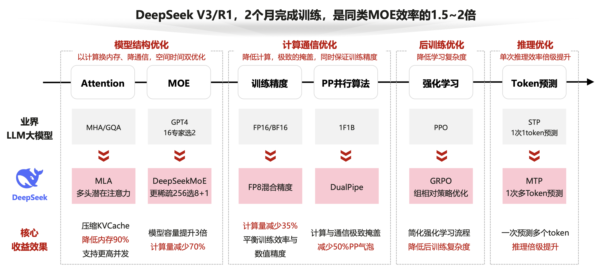

### 3.1. 多头潜注意力 (MLA, Multi-Head Latent Attention) -> KV压缩

- 实现：对 KV 进行低秩联合压缩
- 效果：显著减小键值缓存（KV Cache）的同时提高计算效率

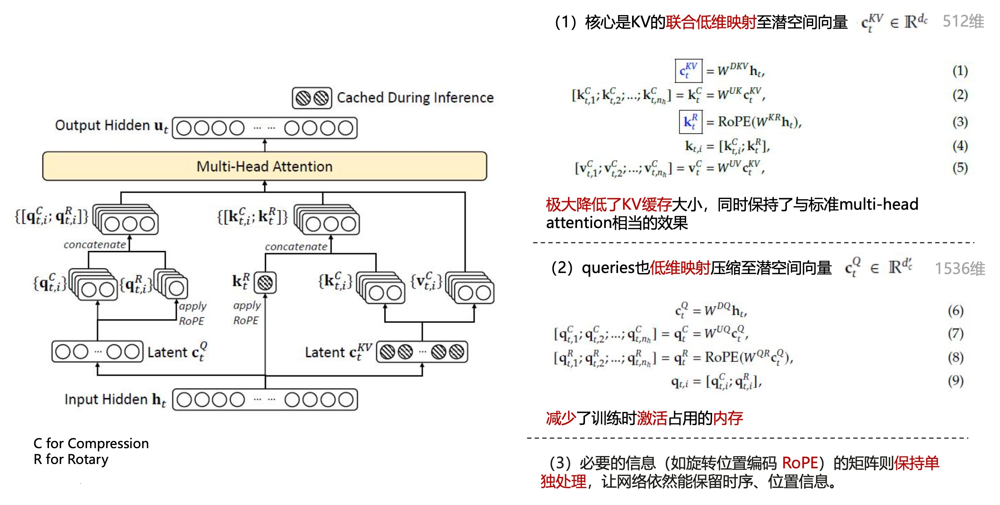

### 3.2. DeepSeekMoE -> MoE结构创新

- 实现：采用了细粒度专家+通才专家的思路，不再使用少数大专家的结构，而是使用大量极小的专家结构（专家数量多 + 每个专家的shape小 + 共享专家）
- 效果：大幅减少了资源消耗

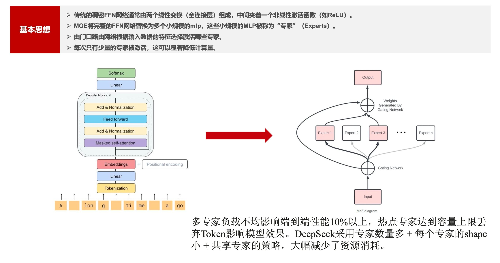

### 3.3. FP8混合精度 & DualPipe
大规模训练上首次使用FP8混合精度，结合Dualpipe通信优化。

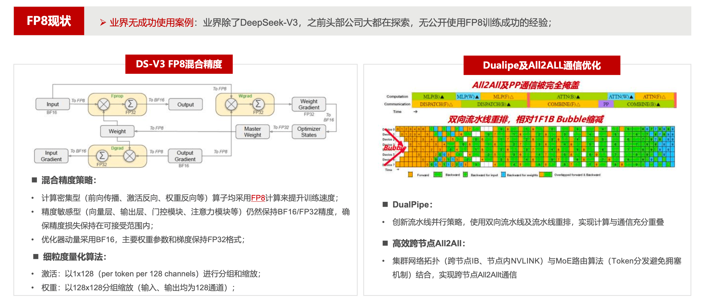

### 3.4. GRPO

GRPO 将强化学习流程的两个模型训练简化为一个模型的训练

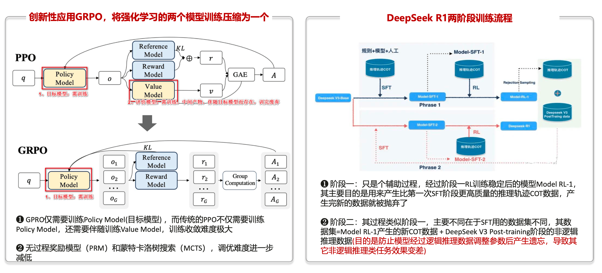

### 3.5. MTP (Multi-Token Prediction)
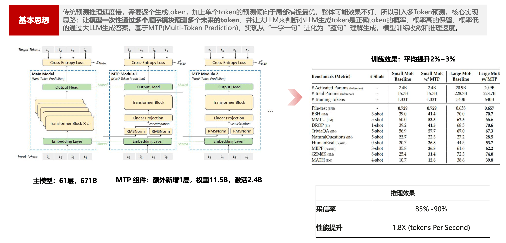

## 4. V3 的训练流程
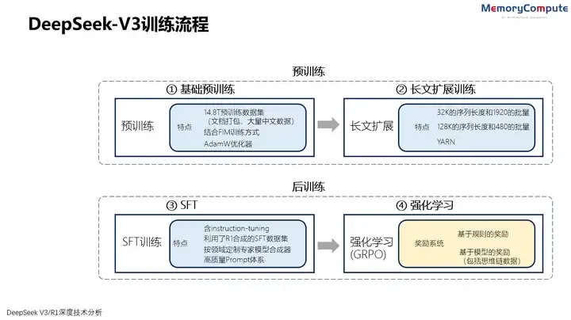

- 预训练
    - 基础预训练
        - 提高数学和编程样本的比例来优化预训练语料库，以提升推理能力
        - 基于中国互联网可用的语料库整合了更多的中文数据
        - 采用前缀-后缀-中间（PSM）框架来构建FIM训练数据
        - Fill-in-Middle（FIM，中间补全）是一种针对代码补全能力的预训练方式，模型在训练过程中学习使用上下文的语境来预测文段中间缺失的部分。FIM策略不会损害下一Token预测（NTP）能力，同时可使模型能够根据上下文线索准确预测中间文本。
        - V3使用 AdamW 优化器来预训练，同时避免过度拟合
    - 长文扩展训练
        - 使用YARN技术将上下文长度，按照两阶段训练扩展到128K，每个阶段包括1000步
        - 在第一阶段，使用32K的序列长度和1920的批量来执行1000步训练。在第二阶段，采用128K的序列长度和480个序列的批量大小执行1000步训练。
- 后训练
    - SFT 有监督精调
    - GRPO
        - 在以往的大模型训练中一般使用PPO（Proximal Policy Optimization）来形成梯度策略。PPO的代价在于需要维护较大的价值网络（也是一个神经网络），需要占用较大的显存与计算资源。
## 5. R1-Zero 的训练过程
R1-Zero 作为R1的无SFT版本，R1-Zero使用 DeepSeek-V3-Base 作为基础模型，直接使用 GRPO进行强化学习来提升模型的推理（Reasoning）性能, 根据准确度和格式进行训练奖励。

R1-Zero的训练过程具有重要意义：

1）在大模型训练领域，SFT 需要高质量的人工标注数据（标注过程一般需要很长周期、成本高，且可能因标记者的偏好而引入潜在偏差）。

2）复杂的推理任务可能超出了普通人类的能力。无SFT的纯强化学习方法也许可以使模型能够涌现出超越传统人类思维上限的超级推理能力。

3）无SFT的纯强化学习不依赖于显式标注，允许模型使用非自然语言表征方法进行“思考”，从而具有超越自然语言进行逻辑推理的潜力。

奖励的计算方式在很大程度上决定了强化学习训练的效果。DeepSeek-R1-Zero 的基于规则的奖励系统包括：

1）准确度奖励（Accuracy rewards）。评估响应是否正确。

2）格式奖励（Format rewards）。奖励模型将其思考过程置于“<think>”和“</think>”标签之间。

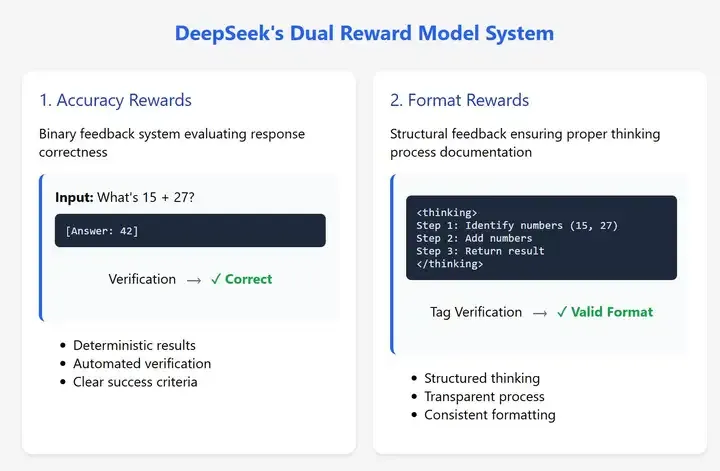

## 6. R1 的训练流程

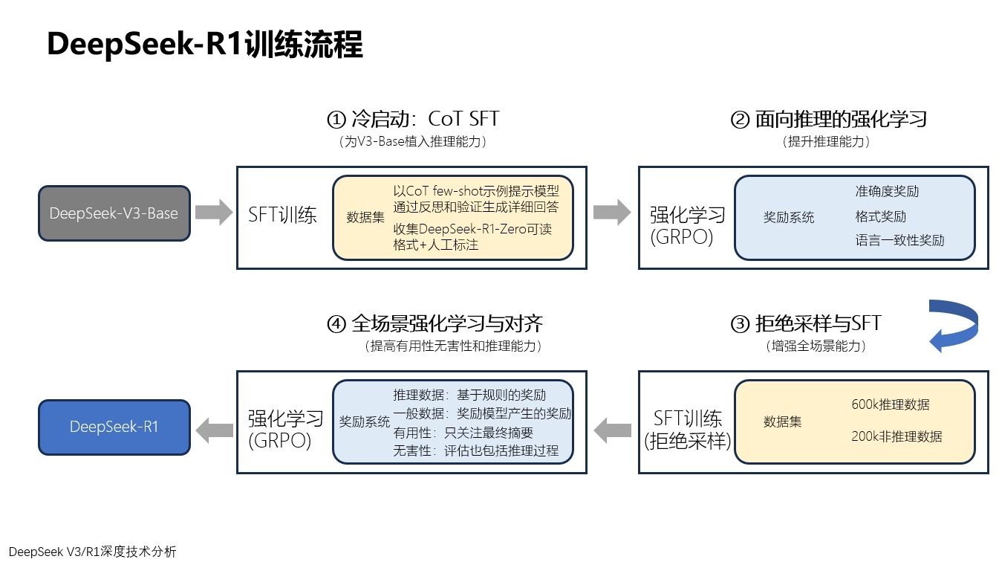

4个阶段：两个SFT阶段进行推理和非推理能力的能力植入，两个强化学习阶段旨在泛化学习推理模式并与人类偏好保持一致。

- 1.冷启动（Cold Start）: CoT SFT
    - 由于这一训练阶段主要采用CoT数据，我们更喜欢将其称为CoT SFT
    - 与R1-Zero不同，R1首先基于DeepSeek-V3-Base进行有监督精调（SFT），以克服强化学习的早期不稳定。DeekSeek认为这种基于人类先验知识冷启动并进行迭代训练的方式更适合推理模型。
    - 这一阶段可以显著增强可读性；同时后续的实验也证明了通过少量数据冷启动也能进一步提升推理能力
    - 长CoT数据合成方法：使用长CoT 的few-shot提示作为示例，直接提示模型通过反思和验证生成详细回答，以可读格式收集DeepSeek-R1-Zero 输出，并通过人工标注员的后处理来完善结果。在此步骤中收集了数千个冷启动样本以进行精调
    - 其中可读模式指为每个回答在末尾包含一个摘要，并过滤掉不易阅读的部分。其输出格式为 |special_token|<reasoning_process>|special_token|
。
- 2.面向推理的强化学习 GRPO
    - 基于GRPO进行强化学习，根据准确度和格式进行训练奖励
    - 为了解决语言混杂问题，还在强化学习训练中引入了语言一致性奖励，该奖励以CoT中目标语言单词的比例计算。
    - 此阶段主要提升模型的推理（Reasoning）性能，特别是在编码、数学、科学和逻辑推理等推理密集型任务，这些任务涉及定义明确且解决方案明确的问题。
    - 这阶段同DeepSeek-R1-Zero做法一样
- 3.拒绝采样与SFT
    - 这一阶段通过构建推理数据和非推理数据两部分，利用SFT进一步提升模型的通用能力
    - 分批进行了两个epoch的精调，样本量为800k。800k中包括600k推理数据和200k非推理数据。
    - 与主要侧重于推理的冷启动数据不同，此阶段结合了来自其他领域的数据，以增强模型在写作、角色扮演和其他通用任务中的能力。
    - 拒绝采样（Rejection Sampling）提供了一种桥梁，使用易于采样的分布来近似训练真正感兴趣的复杂分布。目标响应（ground-truth）从一组生成的回答经过拒绝采样生成，其分数由奖励系统确定。
    - 拒绝采样（Rejection Sampling）是一种蒙特卡洛方法，和重要性采样一样，都是在原始分布难以采样时，用一个易于采样的建议分布进行采样，通过拒绝原始分布之外的采样数据来获得采样结果。拒绝采样只是为了解决目标分布采样困难问题，该方法需要原始分布是已知的。
    - 600k推理数据的生成：
        - 1）通过从上一轮强化学习训练的检查点进行拒绝抽样，整理推理提示并生成推理轨迹（Reasoning Trajectories）。
        - 2）除基于规则奖励进行评估的数据外，还包括了基于奖励模型的V3判断生成数据（通过DeepSeek-V3的LLM-as-judge方式进行奖励）
        - 3）过滤掉了混合语言、长段落和代码块的思路链数据。
        - 4）对于每个提示（Prompt），会生成多个回答，然后并仅保留正确的响应。
    - 200k非推理数据的生成（如写作、事实问答、自我认知和翻译等）：
        - 1）采用DeepSeek-V3流程并复用V3 的部分 SFT 数据集。
        - 2）可调用V3生成潜在的思路链，再通过提示回答。
        - 3）对于更简单的查询（例如“你好”），不提供CoT回答。
- 4.全场景强化学习与对齐
    - 目的：平衡推理能力和通用能力，提高模型的有用性和无害性
    - 实现：RL训练，针对不同数据类型采用了不同的Prompt和奖励机制
        - 对于推理数据，使用DeepSeek-R1-Zero的方法，利用基于规则的奖励来指导数学、代码和逻辑推理领域的训练过程
        - 对于通用数据，采用奖励模型来捕捉复杂微妙场景中的人类偏好，使用DeepSeek-V3的RM进行奖励
        - 对于有用性，聚焦评估最终的总结内容，确保其对用户的实用性和相关性，同时减少对推理过程的干扰
        - 对于无害性，评估整个响应过程，包括推理和总结，识别并减少潜在风险、偏见或有害内容

## 7. DeepSeek-R1-Distill模型 -- 从MoE回归Dense（蒸馏SFT）
经验：要实现效果好的小模型，要具备把模型做大的能力。训练出一个效果好的大参数模型，然后再对其蒸馏，效果要远优于直接训小模型。与通过小模型进行SFT+RL训练相比，蒸馏较好性能模型的输出去做SFT会有更好效果，且成本也会低很多

尽管MoE架构有各种优点，特别是在通用的to C领域具备低成本的优势。但是MoE的架构特点使得其可能不太适用于专业应用场景（例如单一专家场景）和资源限制场景（例如端侧推理）。

蒸馏是将复杂的大型神经网络压缩为更小、更简单的神经网络，同时尽可能多的保留结果模型的性能的过程。此过程涉及训练较小的“学生“神经网络，通过其预测或内部表示的精调来学习模拟更大、更复杂的“教师”网络的行为。

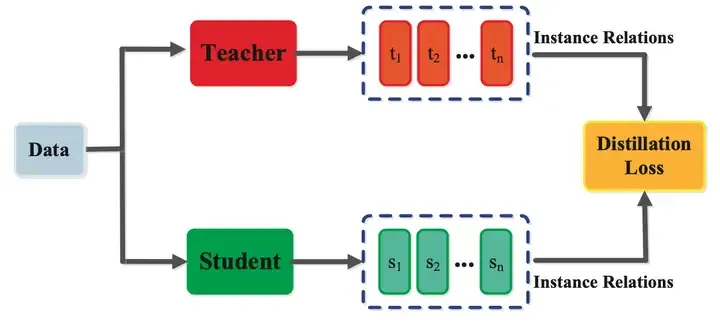

为了能够将推理能力迁移到MoE架构不适合的场景，DeepSeek选择Llama和Qwen系列开源大模型进行蒸馏，使相应的Dense模型也能获得推理能力。与使用强化学习相比，直接SFT更适合较小的大模型，蒸馏完成的Dense模型推理能力明显好于原开源模型。

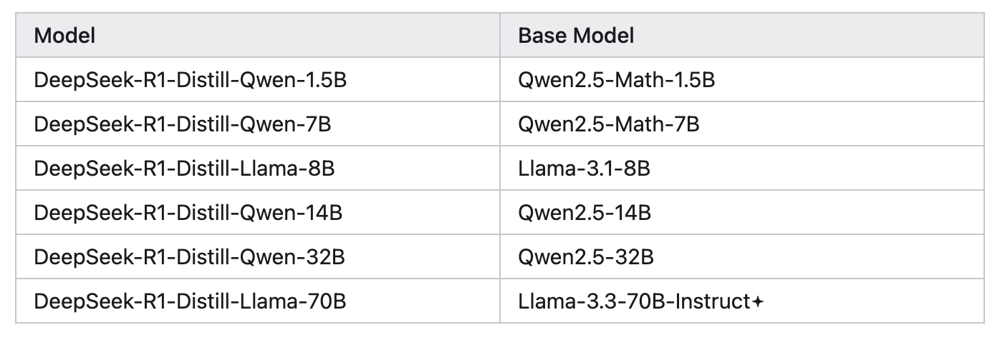

## 8. QWQ-32B 与 DeepSeek-R1 对比
### QWQ-32B
从基准测试上来看，32B的QwQ-32B效果明显优于DeepSeek-R1和DeepSeek-R1-Distilled-Llama-70B，可以接近DeepSeek-R1和o1-mini的水平。这里的基准测试包括数学推理，编程竞赛，通用能力，指令遵循以及函数调用等各个方面。特别地，QwQ-32B也整合了Agent能力，使其能够在使用工具和根据环境反馈调整推理的过程中进行批判性思考。

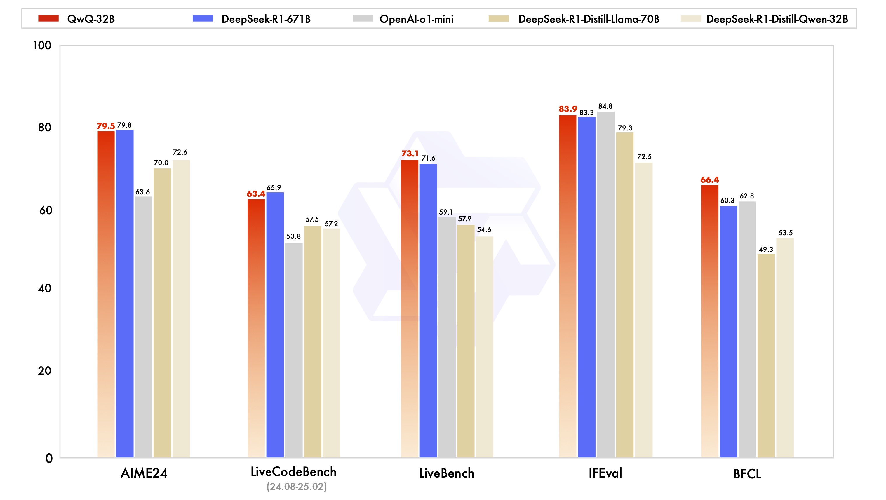

### 对比
同为主打推理的大模型，DeepSeek-R1的架构为MoE结构，QwQ-32B则属于典型的密集模型

- 密集模型（QwQ-32B)
    - 优点：训练难度相对低，过程简单直接推理连贯性好，所有神经元都参与计算和推理，能整体把握上下文信息
    - 缺点：计算成本高，训练和推理需大量计算资源和内存模型容量扩展受限，易过拟合，存储部署成本高
- MoE模型（DeepSeek-R1）
    - 优点：计算效率高，推理时只需激活部分专家模型容量大，可通过增加专家数量扩展
    - 缺点：训练复杂，需训练门控网络，考虑专家负载平衡存在路由开销，门控网络路由选择有额外计算和时间消耗

密集模型和 MoE 模型各有其独特的优势和局限性，不存在绝对的优劣之分。在实际应用中，我们需要根据具体的任务需求、数据特点、计算资源和预算等因素来选择合适的模型架构。

## 9. 推理模型 和 非推理模型
- 推理模型
    - 更像是一个「规划者」，能深入思考复杂任务
    - 选择考虑点：准确性和可靠性，复杂问题解决
    - 编写prompt建议
        - 保持提示词简洁明确，避免使用CoT提示，优先尝试零样本学习
        - 原因
            - 推理模型在处理简明直接的提示词时表现最佳。某些提示工程（如要求模型「一步一步思考」）可能并不会提升性能，有时反而会降低效果
            - 由于模型内置推理能力，因此无需特别提示它们「一步一步思考」或「解释推理过程」
            - 推理模型通常无需少样本示例即可产出优质结果，因此建议先尝试不含示例的提示词。如果对输出结果有更复杂的要求，再考虑在提示词中添加输入和期望输出的示例。请注意确保示例与提示词指令严格匹配，因为不一致可能导致性能下降
            - 推理模型就像一位经验丰富的高级同事——你只需告诉他们最终目标，就能相信他们自主完成所有细节工作
- 非推理模型
    - 则是一个「执行者」，能直接执行任务，延迟低、性价比更高
    - 选择考虑点：速度和成本，执行明确任务
    - 编写prompt建议
        - 使用CoT + Few shot
        - 原因
            - 非推理模型则更像一位新手同事——你需要提供明确详细的指示，才能让他们准确完成特定的输出任务
