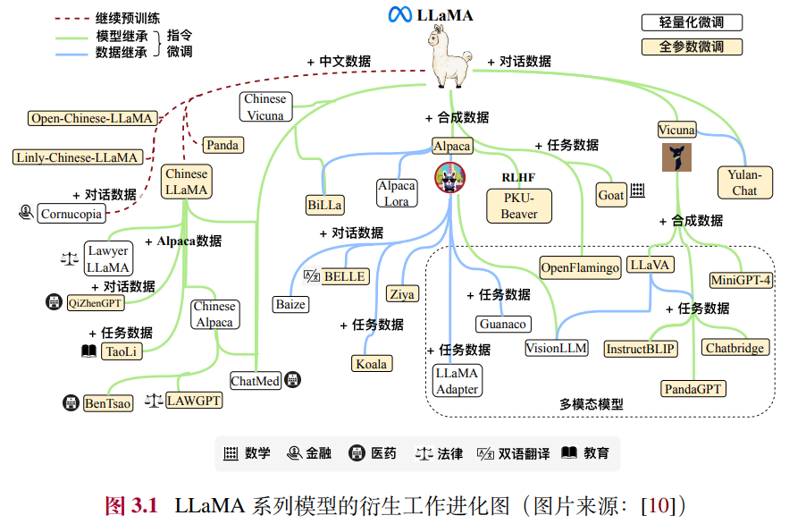

# LLaMA
## 1. About
- 公司 : Meta AI
- HF : https://huggingface.co/meta-llama
- 论文 : https://ai.meta.com/research/publications/the-llama-3-herd-of-models/
- 意义 : 自 2023 年 2 月发布以来，LLaMA 系列模型在学术界和工业界引起了广泛的关注，已经成为了最受欢迎的开源大语言模型之一，许多研究工作都是以其为基座模型进行指令微调或继续预训练，衍生出了众多变体模型，对于推动LLM技术的开源发展和研究进展做出了重要贡献

## 2. LLaMA变体模型（非官方）
众多研究人员纷纷通过指令微调或继续预训练等方法来进一步扩展 LLaMA 模型的功能和应用范围。其中，指令微调由于相对较低的计算成本，已成为开发定制化或专业化模型的首选方法，也因此出现了庞大的 LLaMA 家族。

根据指令微调所使用的指令类型分类
- 基础指令
    - Stanford Alpaca
    - Vicuna
- 中文指令
    - 目前常见的中文大语言模型有 Chinese LLaMA、Panda、Open-Chinese-LLaMA、Chinese Alpaca、YuLan-Chat 等。
- 垂域指令
    - 常见的垂域 LLaMA模型有 BenTsao（医学）、LAWGPT（法律）、TaoLi（教育）、Goat（数学）、Comucopia（金融）等。
- 多模态指令
    - 由于 LLaMA 模型作为纯语言模型的强大能力，许多的多模态模型都将其（或将其衍生模型）作为基础语言模型，搭配视觉模态的编码器，使
用多模态指令对齐视觉表征与文本。
    - LLaVA 、MiniGPT4 、InstructBLIP 和 PandaGPT

