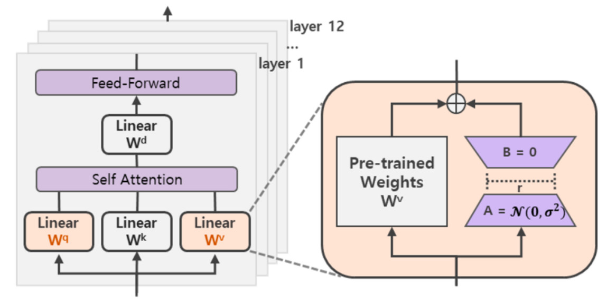
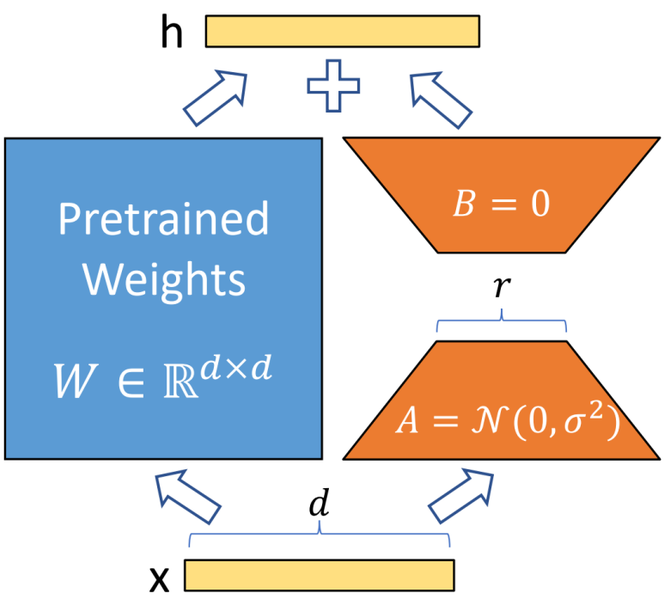
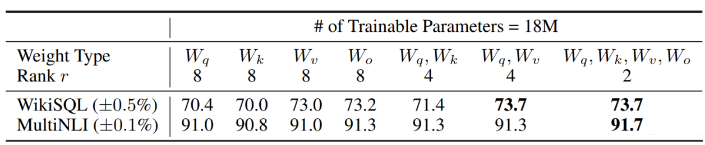
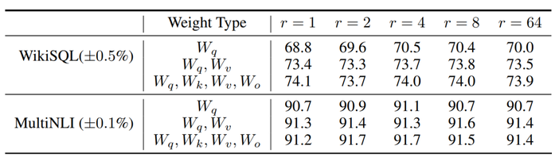
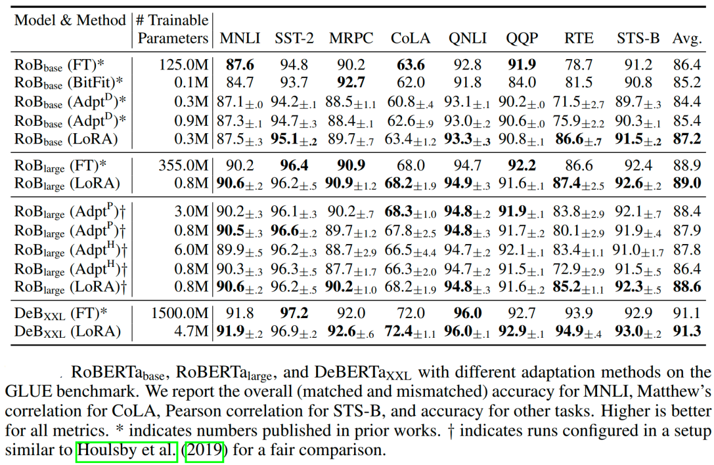
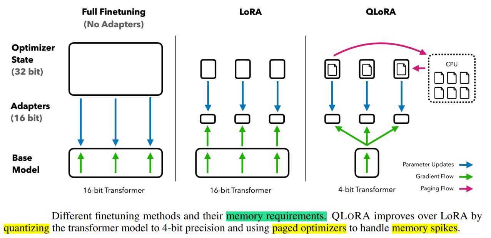

# 微调

SFT在LLM中应用的重要原因
- 特定性能提升
- 领域适应性
- 数据稀缺性

SFT数据重要性
- 数据质量 > 数据规模
- 挑选质量较高的数据，可以有效提高模型的性能
    - 数据质量可以通过ppl、reward model，文本质量分类模型等方式进行初步评估。经过人工进行后续筛选。
- 多样性的数据可以提高模型性能
- 数据结构
    - 问题和响应
    - {"prompt":"请帮我计算1+1等于几。","response":“2"}
- 是否使用含思维链（Reasoning_Content）数据
    - 使用深度推理模型，包括思维链数据
        - 使用DeepSeek-R1推理时，会生成思维链数据
        - 如果用含思维链数据（Reasoning_Content）训练 建议使用DeepSeek-R1及DeepSeek-R1-Distill系列的深度推理模型
        - {"prompt":"请帮我计算1+1等于几。","reasoning_content": "1加1在基本的十进制算术中等于2。","response":"2"}

SFT训练方式
- 全量更新
    - 全量更新在训练过程中对大模型的全部参数进行更新
- LoRA
    - 在固定预训练大模型本身的参数的基础上，在保留自注意力模块中原始权重矩阵的基础上，对权重矩阵进行低秩分解，训练过程中只更新低秩部分的参数

## PEFT
PEFT 只微调少量或者额外的参数，降低计算、存储成本

PEFT 有什么优点？
- 减少计算和存储成本：PEFT只涉及微调少量额外的模型参数，而冻结预训练llm的大部分参数，从而显着降低计算和存储成本
- 克服灾难性遗忘：在LLM的全面微调期间，灾难性遗忘可能发生在模型忘记它在预训练期间学到的知识的地方。PEFT通过只更新几个参数来克服这个问题。
- 低数据环境下更好的性能：PEFT方法在低数据环境下的表现优于完全微调，并且可以更好地推广到域外场景。
- 可移植性：与全面微调的大检查点相比，PEFT方法使用户能够获得价值几mb的小检查点。这使得来自PEFT方法的训练权重易于部署和用于多个任务，而无需替换整个模型。
- 与完全微调相当的性能：PEFT仅使用少量可训练参数即可实现与完全微调相当的性能。

## LoRA
神经网络包含很多全连接层，其借助于矩阵乘法得以实现，然而，很多全连接层的权重矩阵都是满秩的。

LoRA（论文：**LoRA: LOW-RANK ADAPTATION OF LARGE LANGUAGE MODELS**），该方法的核心思想就是**通过低秩分解来模拟参数的改变量，从而以极小的参数量来实现大模型的间接训练。**

在涉及到矩阵相乘的模块，在原始的PLM旁边增加一个新的通路，通过前后两个矩阵A,B相乘，第一个矩阵A负责降维，第二个矩阵B负责升维，中间层维度为r。

可训练层维度和预训练模型层维度一致为`d`，先将维度`d`通过全连接层降维至`r`，再从`r`通过全连接层映射回`d`维度，其中，`r<<d`，r是矩阵的秩，这样矩阵计算就从`d x d`变为`d x r + r x d`，参数量减少很多。

在下游任务训练时，固定模型的其他参数，只优化新增的两个矩阵的权重参数，将PLM（pre-trained language models，预训练语言模型）跟新增的通路两部分的结果加起来作为最终的结果（两边通路的输入跟输出维度是一致的），即`h=Wx+BAx`。第一个矩阵的A的权重参数会通过高斯函数初始化，而第二个矩阵的B的权重参数则会初始化为零矩阵，这样能保证训练开始时新增的通路BA=0从而对模型结果没有影响。

$$
h=W_{0} x+\Delta W x=W_{0} x+B A x
$$

在推理时，将左右两部分的结果加到一起即可，`h=Wx+BAx=(W+BA)x`，所以只要将训练完成的矩阵乘积`BA`跟原本的权重矩阵`W`加到一起作为新权重参数替换原本PLM的W即可，对于推理来说，不会增加额外的计算资源。

- 实验还发现，保证权重矩阵的种类的数量比起增加隐藏层维度r更为重要，增加r并不一定能覆盖更加有意义的子空间。
- 通过实验也发现，在众多数据集上LoRA在只训练极少量参数的前提下，最终在性能上能和全量微调匹配，甚至在某些任务上优于全量微调。

## QLoRA
QLORA 有一种低精度存储数据类型（4 bit），还有一种计算数据类型（BFloat16）。

实际上，这意味着无论何时使用 QLoRA 权重张量，我们都会将张量反量化为 BFloat16，然后执行 16 位矩阵乘法。

