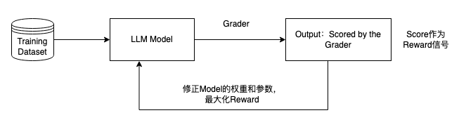

# 对齐 / 偏好对齐

Note: 不是所有对齐都用的强化学习，dpo直接偏好对齐就是避免使用强化学习的偏好对齐方法
- 在训练过程中产生新的数据和行为的是强化学习，反之不是强化学习

- 策略梯度 pg
- rlhf-ppo
- 近端策略优化 ppo (Proximal Policy Optimization) 
- grpo
- 拒绝抽样 ：对于每个提示，使用经过训练的模型生成多个响应，并对其进行评分以推断选择/拒绝的答案。这会创建符合策略的数据，其中两个响应都来自正在训练的模型，从而提高对齐稳定性。

## 偏好对齐
偏好对齐
- RFT训练（Reinforcement Fine-Tuning）
    - Group Relative Policy Optimization(GRPO) 群体相对策略优化
    - Proximal Policy Optimization（PPO）近端策略优化 
- DPO训练 (Direct Preference Optimization) 直接偏好优化
- KTO训练
- SimPO训练 (Simple Preference Optimization)
- RLHF训练

### RFT训练（Reinforcement Fine-Tuning）
RFT的核心是通过自动化生成的奖励信号驱动模型优化，让模型通过多轮试错和反馈逐步提升推理能力。**不需要单独训练奖励模型，通过Grader对输出打分，作为奖励信号优化模型权重。**

RFT将RL（对Agent的输出打分，基于打分迭代训练）和Fine-tuning的技术相结合。 RLHF同样也是需要人工反馈和Reward Model的训练将反馈转化为Reward信号。但是对于RFT来说，依赖Grader来分配Reward信号，帮助模型选择答案。

Grader通过比较模型的Response和Reference对模型打分（0-1）。 因此，这也解释了RFT需要更少数据的原因（几十条便可取得不错的效果）。 模型主要是找到产生我们想要的输出的模式，而不是直接生成输出，这样泛化性更强。



RFT调优包括两个步骤：
- 1、数据集收集：Prompt+Response数据。参考：https://cloud.baidu.com/doc/WENXINWORKSHOP/s/yliu6bqzw
- 2、模型优化训练：基于预置模型RFT训练，并通过调整训练参数，优化模型输出。

在RFT训练中，需要配置奖励规则，奖励规则中定义了如何评估模型输出效果的规则。目前预置三种奖励规则：
- 字符串比较（相等）：通过对比语料的Response和模型的输出是否一致来判断模型的效果，适合需要大模型输出标签、数值等比较明确的场景。完全匹配1分，哈希匹配阈值>0.3 得0.5分，否则0分。
- 字符串比较（包含）：通过对比模型的输出中是否包括准备语料的Response判断模型的效果。
- 字符串相似度对比：通过Edit Distance衡量语料的Response和模型的输出的相似度来判断模型的效果。
- 数学答案匹配：使用正则表达从模型的输出中抽取答案，和语料的Response对比是否一致。适合数学题计算等类似的场景。

强化学习方法支持GRPO及PPO两种方式：
- Group Relative Policy Optimization(GRPO)，采用群组采样方法，并使用更保守的策略更新方式，在训练中具备更高的效率。DeepSeekMath模型训练中使用了GRPO。
- Proximal Policy Optimization（PPO），是一种策略梯度方法，通过裁剪（clipping）机制来限制策略更新的幅度，从而防止策略发生过大的破坏性变化。迭代更新策略以最大化奖励，同时保持接近初始行为。它使用奖励模型来对响应进行评分，并需要仔细调整超参数，包括学习率、批量大小和 PPO 剪辑范围。

优势
- 数据准备快速：不需要人工标注偏好数据。
- 效率更高：模型自动寻找输出的最优值。

### DPO训练 (Direct Preference Optimization) 直接偏好优化
- Paper: https://arxiv.org/abs/2305.18290
- Code: https://github.com/eric-mitchell/direct-preference-optimization

DPO本身并不使用强化学习（RL），它是一种 避免使用强化学习的偏好对齐方法，是对传统 RLHF（Reinforcement Learning from Human Feedback）流程的一种改进。

当你仔细端详【对齐人类偏好】这个训练步骤时，你可能会感觉有些疑惑：
- 看起来，在训练奖励模型的过程中，我们就已经在考虑“什么回答是好的，什么回答是不好的”这个问题了。而对齐模型依然是在考虑这个问题。所以，我们能不能避开奖励模型的训练，直接一步到位训练对齐模型呢？
- 在实际rlhf-ppo的训练中，存在【显存占据大】、【超参多】、【模型训练不稳定】等一系列问题。那么在考虑“一步到位训练对齐模型”的过程中，我们是不是也能顺手做到绕过强化学习，采用一个更简单的方式（比如类似于sft）来使用偏好数据训练对齐模型呢？


基于这些考虑，DPO（Direct Preference Optimization）应运而生，正如它名字中Direct蕴含的含义一样，比起传统基于强化学习PPO的方式，它改进了以下两点：
- 不再训练奖励模型，直接使用人类标注的偏好数据，一步到位训练对齐模型。
- 不再使用强化学习的方法，通过数学推理，将原始的偏好对齐优化目标步步简化，最后通过类似于sft的方式，用更简化的步骤训练出对齐模型。


dpo（Direct Preference Optimization）：直接偏好优化 直接优化策略，以最大化选择响应而非拒绝响应的可能性。它不需要奖励建模，这使得它在计算上比 PPO 更高效，但在质量方面略差。

直接偏好优化方法，通过直接优化语言模型来实现对大模型输出的精确把控，不用进行强化学习，也可以准确判断和学习到使用者的偏好，且效果更加突出。

**DPO稳定、高效且计算量轻，无需拟合奖励模型，也无需在微调期间从LM采样或执行显著的超参数调整。实验表明，DPO 可以微调 LMs，使其与人类偏好保持一致，与现有方法一样或更好。**

与之前的 RLHF-PPO 方法不同，DPO 绕过了奖励建模步骤，并使用偏好数据直接优化语言模型。

DPO微调包含以下两个步骤：
- 数据集收集：prompt+chosen+rejected数据集。
    - prompt：
        - ①单轮对话场景，Prompt字段仅包含每轮对话的提问；
        - ②多轮对话场景，Prompt字段包含前几轮对话的问答及最后一轮的提问
    - chosen：Prompt字段对应的正偏好回答。
    - rejected：Prompt字段对应的负偏好回答。
- 优化训练：基于预置或SFT后的大模型，调整部分参数，训练您的偏好大模型。

Q：是不是DPO不含奖励模型训练的过程？
A：严格意义上讲，DPO是将奖励模型训练和强化学习融合在同个阶段进行，其目标函数是优化模型参数以最大化奖励的函数。

优势
- 操作更便捷：更容易实施和训练，只需匹配专有数据集和训练模型，即可发布服务。
- 运行更稳定：最大力度避免陷入局部最优，保证训练过程更可信、可靠。
- 效率更明显：与强化学习相比，节省训练步骤，需要的计算资源和数据更少，实现训练轻量化。
- 输出更有效：在情感控制、内容摘要和对话输出等语言任务中，效果优于RLHF。


DPO算法总览
1.  对一个问题，有两个回答 choice 和 reject，不是一个一定正确，一个一定不正确；而是训练出的语言模型，更加prefer哪一种，即希望语言模型以哪一种方式来回答。
2.  准备两个模型 model\_gen 和 model\_gen\_ref，其实是一模一样的模型，只不过在训练过程中，只会训练其中一个，另外一个是不训练的（冻结的）。
3.  把choice 和 reject两份数据，分别输入到两个模型中计算，可以得到4份概率；
4.  4份数据中，其中有2份是想要的，2份是不想要的；2份想要的做减法得到`pro_log_diff`，2份不想要的做减法得到 `pro_log_diff_ref`
5.  `pro_log_diff`和`pro_log_diff_ref`，计算KL散度；惩罚policy模型对正样本概率的下降和负样本概率的上升
6.  以KL散度计算Loss


#### DPO目标函数
$$
\mathcal{L}_{\mathrm{DPO}}\left(\pi_{\theta} ; \pi_{\mathrm{ref}}\right)=-\mathbb{E}_{\left(x, y_{w}, y_{l}\right) \sim \mathcal{D}}\left[\log \sigma\left(\beta \log \frac{\pi_{\theta}\left(y_{w} \mid x\right)}{\pi_{\text {ref }}\left(y_{w} \mid x\right)}-\beta \log \frac{\pi_{\theta}\left(y_{l} \mid x\right)}{\pi_{\text {ref }}\left(y_{l} \mid x\right)}\right)\right]
$$

通过这种方式，绕过了显式奖励建模步骤，同时也避免了执行强化学习优化的需要。

逐步分析这个优化目标：首先， $\sigma$ 函数里面的值越大，  $L\_{DPO}$  越小。

-   对于人类偏好结果$y_w$ ，我们期望 $\pi_{\theta}(y_w \mid x)$ 越大越好；
-   对于人类非偏好结果 $y_l$，我们期望 $\pi_{\theta}(y_l \mid x)$ 越小越好。

#### DPO优化目标推导过程

1.首先，我们有一个对齐人类偏好阶段的总优化目标函数，它是在假设我们已经有一个奖励函数 $r$
的基础上设计的，我们的目标是找到能使这个目标值最大化的对齐模型 $\pi$


2.然后，我们从这个目标函数出发，找到 $\pi$ 的显式解（也就是在任意已有的奖励函数 $r$ 的基础上最优的 $\pi$）：


其中，$Z(x)$ 是人为定义的partition function，它形式为


3.接着，由于在实际训练中，我们肯定是在最优的奖励函数上去训练最优的对齐模型 $\pi$，所以我们对上式的符号稍加更改，令星号代表最优，则有：


4.然后，由于我们的训练目标是尽量绕过奖励模型，直接使用偏好数据，通过类似sft的方式一步到位训练对齐模型，所以我们将上式从 $\pi$ 的显式解中推出奖励函数 $r$（用最优对齐模型 $\pi^*$ 表示出最优奖励模型 $r^*$）。接下来，我们只需要关注如何构造奖励函数的训练目标，然后把这个式代入训练目标中，就可以一步到位训练对齐模型。


5.现在，问题回到“奖励模型的训练上”来了。在奖励模型的训练过程中，通常使用**偏好排序**对奖励模型进行训练，有2种数据标注的方式，分别是【成对回答偏好标注】和【多回答偏好标注】。
- 只生成2个回答，<prompt x, chosen y1, reject y2>，即对于一个prompt，我们只生成2个回答，让人工对这两个回答的偏好做排序，我们希望奖励模型对chosen回答的给分尽量高于对reject回答的给分。
    - BT模型：只生成2个回答
- 生成K个（K > 2）回答，<prompt x, y1, ..., yK>，假设人工标注后的偏好排序组合为（比如人工人为偏好从大到小应该为y2 > y3 > y1 >... > yK），那么我们希望奖励模型对 
 这个排序的总得分要大于其余任何可能的偏好排序。
    - PT模型：生成k (k>2)个回答

6.奖励模型的总体优化目标


7.奖励模型优化目标的最终形式


8.【成对】偏好数据下DPO的优化目标

### KTO训练
Q：KTO训练和DPO训练有什么不同？
A：训练过程中KTO方法需要对输出结果进行二元判断，符合预期/不符合预期，所以其收集的数据为Prompt+Chosen或Rejected；DPO训练依赖人类反馈，需要对输出结果进行偏好性判断，两个输出的倾向程度，所以其收集的数据为Prompt+Chosen和Rejected。

KTO(Kahneman-Tversky Optimisation):

Kahneman-Tversky优化方法，根据用户正向或负向反馈进行模型训练，高效对齐用户行为偏好。

KTO微调包含以下两个步骤：
- 数据集收集：Prompt+Chosen/Rejected数据集。
    - Prompt：
        - ①单轮对话场景，Prompt字段仅包含每轮对话的提问；
        - ②多轮对话场景，Prompt字段包含前几轮对话的问答及最后一轮的提问
    - Chosen：Prompt字段对应的正偏好回答。
    - Rejected：Prompt字段对应的负偏好回答。
- 优化训练：基于预置或SFT后的大模型，调整部分参数，训练您的偏好大模型。

优势
- 成本节省：普通强化学习训练，重度依赖人类反馈，KTO训练可以做到Prompt和response的高效对齐，节省人类反馈的成本，同时具备时效性。
- 客观真实：普通强化学习训练，人类主观意识干扰过多，KTO训练可以使模型服务在符合人类预期的基础上，做到更加的客观和真实。

### SimPO训练 (Simple Preference Optimization)
SimPO是一种用于优化和提升预训练大模型性能的技术。它旨在通过简单而高效的方式，调整模型参数，从而在保持模型性能的同时，减少计算资源和内存的消耗。SimPO 主要关注参数效率，这意味着它能够在不大幅增加模型参数的情况下，显著提升模型的性能。

SimPO微调包含以下两个步骤：
- 数据集收集：prompt+chosen+rejected数据集。
    - prompt：
        - ①单轮对话场景，Prompt字段仅包含每轮对话的提问；
        - ②多轮对话场景，Prompt字段包含前几轮对话的问答及最后一轮的提问
    - chosen：Prompt字段对应的正偏好回答。
    - rejected：Prompt字段对应的负偏好回答。
- 优化训练：基于预置或SFT后的大模型，调整部分参数，训练您的偏好大模型。

优势
- 提升效率：消除对奖励模型的依赖，简化了训练流程，降低了模型训练的复杂度和资源消耗，训练时间和GPU消耗大幅减少。
- 性能优势：性能却明显优于DPO及其变体，避免了训练和推理不一致的问题，更准确符合用户的数据预期。
### RLHF训练

RLHF的成功取决于人类提供的反馈的质量，根据任务和环境，反馈的质量可能是主观的和可变的。因此，开发有效且可扩展的收集和处理反馈的方法非常重要。


RLHF 比传统的机器学习和强化学习提供了更多的指导，能够捕捉到人类偏好的全部内容，从而驱使人工智能系统与人类价值观相一致。即使 RLHF 不能完全解决对内部调整的担忧，它所识别的失败以及它赋予奖励和政策模型的知识也适用于提高社会和合作环境中人工智能的安全性、可靠性和可信度。

- 收集人类反馈
    - 收集人类反馈为RLHF的基础步骤
    - 在初始模型被训练之后，人类训练者提供对模型表现的反馈。他们根据质量或正确性排名不同的模型生成的输出或行为。这些反馈被用来创建强化学习的奖励信号。
- **奖励模型训练**
    - 奖励模型（Reward Model, RM）训练的最终目的是刻画模型的输出是否在人类看来表现不错
    - 需要有一个【标准】，告诉待训练的模型，什么回答才是人类喜欢的。这个标准就是奖励模型，它将对各个回答进行打分。
    - 在训练奖励模型时，我们可以采用【偏好排序】来标注数据集。即对于一个prompt，我们可以产出若干个回答。然后让人工对这若干个回答进行偏好排序，我们就用这些数据来训练模型
    - 奖励模型接收一系列文本并返回标量的奖励值，数值和人类的偏好相对应
    - 输入：prompt + response
    - 输出：标量数字，表明response质量
- **强化学习训练/对齐模型训练**（Reinforcement Learning, RL）
    - 用于描述和解决智能体（agent）在与环境的交互过程中通过学习策略以达成回报最大化或实现特定目标的问题
    - 对齐模型根据prompt自生成回答，并采用训练好的奖励模型对回答进行打分，对齐模型会根据评分结果不断调整自己的输出分布
    - 至少需要以下三个基本要素：
        - 策略（policy）：基于该语言模型，接收prompt作为输入，然后输出一系列文本（或文本的概率分布）。
        - 动作空间（action space）：词表所有token在所有输出位置的排列组合（单个位置通常有50k左右的token候选）。
        - 奖励函数（reward）：基于奖励模型计算得到初始reward，再叠加上一个约束项。
            - 奖励是使强化学习agent能够调整其行动策略的反馈信号，当agent进行训练时，它会调整自己的策略，并采取一系列行动，使其回报最大化

## 模型 & 训练方式 & 超参数

常用于训练的开源模型
- deepseek
    - DeepSeek-R1-Distill-Qwen-14/7B
    - DeepSeek-R1
    - DeepSeek V3
- qwen
    - QwQ-32B
    - Qwen2.5-7B-Instruct
- llama
    - Meta-Llama-3.1-8B

训练方式
- 全量更新
- LoRA

超参数
- 迭代轮次（Epoch）
- 学习率（Learning Rate）
    - Critic学习率
    - Actor学习率
- 全局批大小（GlobalBatchsize）
- 序列长度(Sequence Length)
    - max_length+max_prompt_len应当小于序列长度
- max_prompt_len (Prompt Length)
- max_length (response Length)
- 正则化系数（Weight Decay）
    - 控制正则化项对模型参数的影响强度。适当增大系数可以增强正则化效果，防止过拟合，但过高的系数可能导致模型欠拟合
- 预热比例（Learning Rate Warmup）
    - 训练初期学习率预热步数占用总的训练步数的比例。学习率预热可以提高模型稳定性和收敛速度
- kl_coeff（KL Coefficient）
    - 对reward增加KL-Penalty的系数
    - 增大KL系数会使模型更紧密地逼近目标分布，减小生成文本的多样性
    - 减小KL系数则允许模型生成更加多样化的文本，但可能偏离目标分布。
- DPO中偏好损失类型（Loss Type)
    - 可选择的类型包括sigmoid、ipo、kto_pair。sigmoid适用于一般情况，提供稳定训练过程，ipo可以纠正模型过度自信的问题，kto可以使模型更符合用户偏好

## 强化学习

预测与决策
- 预测仅仅产生一个针对输入数据的信号，并期望它和未来可观测到的信号一致，这不会使未来情况发生任何改变
- 决策和预测任务不同，决策往往会带来“后果”，因此决策者需要为未来负责

面向预测任务的有监督学习与面向决策任务的强化学习的区别
- 感知环境,改变环境：相比于有监督学习中的“模型”，强化学习中的“智能体”强调机器不但可以感知周围的环境信息，还可以通过做决策来直接改变这个环境，而不只是给出一些预测信号
- 多轮：决策任务往往涉及多轮交互，即序贯决策（sequential decision making）；而预测任务总是单轮的独立任务。如果决策也是单轮的，那么它可以转化为“判别最优动作”的预测任务
- 考虑未来,长期最优：因为决策任务是多轮的，智能体就需要在每轮做决策时考虑未来环境相应的改变，所以当前轮带来最大奖励反馈的动作，在长期来看并不一定是最优的
- 数据分布变化：有监督学习的数据都是给定的，训练数据集背后的数据分布是完全不变的；在强化学习中，数据是在智能体与环境交互的过程中得到的。如果智能体不采取某个决策动作，那么该动作对应的数据就永远无法被观测到，所以当前智能体的训练数据来自之前智能体的决策结果。因此，智能体的策略不同，与环境交互所产生的数据分布就不同。
- 目标不同
    - 有监督学习目标：最小化损失函数（最小化模型函数在整个数据分布上的泛化误差）
    - 强化学习目标：最大化价值


强化学习
- 广泛地讲，强化学习是机器通过与环境交互来实现目标的一种计算方法。
- 机器和环境的一轮交互是指，机器在环境的一个状态下做一个动作决策，把这个动作作用到环境当中，这个环境发生相应的改变并且将相应的奖励反馈和下一轮状态传回机器。
- 这种交互是迭代进行的，机器的目标是最大化在多轮交互过程中获得的累积奖励的期望。
- 智能体（agent）：做决策的机器
- 智能体有3种关键要素，即感知、决策和奖励

强化学习的两个实体：智能体（Agent）与环境（Environment）

强化学习的环境：动态的随机过程
- 是一个动态的随机过程
    - 智能体决策的动作的随机性
    - 环境基于当前状态和智能体动作来采样下一刻状态的随机性
- 环境的外来的干扰因素：智能体的动作
- 环境的下一刻状态的概率分布将由当前状态和智能体决策的动作来共同决定
- 对于一个随机过程，其最关键的要素就是状态以及状态转移的条件概率分布

强化学习的目标：价值 value
- 在强化学习中，我们关注**回报的期望**，并将其定义为**价值（value）**，这就是强化学习中智能体学习的优化目标
- 本轮奖励信号：奖励信号往往由实数标量来表示，一般是诠释当前状态或动作的好坏的及时反馈信号
- 整体回报（return）：整个交互过程的每一轮获得的奖励信号可以进行累加，形成智能体的整体回报（return）


强化学习分类
- 无状态和有状态
    - 无状态的强化学习
        - 决策动作不会改变环境
        - 包含
            - 多臂老虎机
    - 有状态的强化学习
        - 决策动作会改变环境
        - 包含
            - 马尔可夫决策过程
- 基于模型和无模型
    - 基于模型的强化学习（model-based reinforcement learning）
        - 包含
            - 两种基于动态规划的强化学习算法：策略迭代和价值迭代
            - Dyna-Q 算法（它的环境模型是通过采样数据估计得到的）
        - 策略迭代和价值迭代通常只适用于有限马尔可夫决策过程，即状态空间和动作空间是离散且有限的
    - 无模型的强化学习（model-free reinforcement learning）
        - 马尔可夫决策过程的状态转移概率是无法写出来的，在这种情况下，智能体只能和环境进行交互，通过采样到的数据来学习
        - 不需要事先知道环境的奖励函数和状态转移函数，而是直接使用和环境交互的过程中采样到的数据来学习，这使得它可以被应用到一些简单的实际场景中
        - 包含
            - 无模型的强化学习中的两大经典算法：Sarsa 和 Q-learning，它们都是基于时序差分（temporal difference，TD）的强化学习算法
            - DQN算法
            - DQN改进算法：Double DQN 和 Dueling DQN
            - 之后的方法也大多是无模型的强化学习算法
- 基于价值和基于策略
    - 基于价值的方法
        - 学习一个价值函数，然后根据函数导出一个策略，学习过程中并不存在一个显式的策略
        - 包含
            - Q-learning、DQN 及 DQN 改进算法，其中 Q-learning 是处理有限状态的算法，而 DQN 可以用来解决连续状态的问题
    - 基于策略的方法
        - 直接显式地学习一个策略函数
        - 包含
            - 策略梯度算法 
            - Actor-Critic 算法
                - 有没有什么方法既学习价值函数，又学习策略函数呢？答案就是 Actor-Critic
                - 需要明确的是，Actor-Critic 算法本质上是基于策略的算法，因为这一系列算法的目标都是优化一个带参数的策略，只是会额外学习价值函数，从而帮助策略函数更好地学习
                - TRPO、PPO、DDPG、SAC 等深度强化学习算法都是在 Actor-Critic 框架下进行发展的
- 同策略和异策略
    - 同策略（on-policy）
        - 需要学习的智能体和跟环境交互的智能体是同一个
        - 包含
            - 策略梯度算法（PG）
        - 特点
            - 每次更新参数θ后，就需要重新采样轨迹了，每次采样的轨迹只能使用一次，所以PG会花很多时间去采样数据，可以说大多数时间都在采样数据，同策略的算法非常耗费时间  
    - 异策略（off-policy）
        - 需要学习的智能体和跟环境交互的智能体不是同一个，是2个智能体
        - 实现：重要性采样，乘上一个重要性权重来修正两个分布的差异
        - 特点
            - 收集的数据可以用很多次，同一笔数据可以执行梯度上升很多次，更新参数很多次
        - 包含
            - Actor-Critic算法

## NLP中的强化学习


## RLHF中的四个重要角色


RLHF通常由3个阶段组成：
- **有监督微调 (SFT)**
    - 预训练 LM 在高质量数据集上进行有监督微调，得到SFT Model 
- **偏好采样和奖励学习 (RM)**
    - 一个prompt采样多个输出，由人类对输出进行标注排序（更偏好哪个输出），得到Reward Model
- **强化学习微调 (PPO)**


如上图，**在RLHF-PPO阶段，一共有四个主要模型**，分别是：

-   **Actor Model/Policy Model**：演员模型/策略模型，这就是**想要训练的目标语言模型**
-   **Critic Model**：评论家模型/评价模型，它的作用是**预估总收益**$V_{t}$
-   **Reward Model**：奖励模型，它的作用是**计算即时收益** $R_{t}$
-   **Reference Model（Ref Model）**：参考模型，它的作用是**在RLHF阶段给语言模型增加一些“约束”，防止语言模型训歪**（朝不受控制的方向更新，效果可能越来越差）

其中:

- **Actor/Critic Model**在RLHF阶段是**需要训练**的（图中给这两个模型加了粗边，就是表示这个含义）；
    - 在RLHF中，不仅要训练模型**生成符合人类喜好的内容的能力（Actor）**，也要提升模型**对人类喜好量化判断的能力（Critic）**。这就是Critic模型存在的意义。
- 而**Reward/Reference Model**是**参数冻结**的。
- Actor和Reference来自于Step1的SFT
- Reward和Critic来自于Step2的RW
- Critic/Reward/Reference Model共同组成了一个“奖励-loss”计算体系（自己命名的，为了方便理解），综合它们的结果计算loss，用于更新Actor和Critic Model


## KL散度
“防止模型训歪”换一个更详细的解释是：希望训练出来的Actor模型既能达到符合人类喜好的目的，又尽量让它和SFT模型不要差异太大。简言之，希望两个模型的输出分布尽量相似。那什么指标能用来衡量输出分布的相似度呢？自然而然想到了KL散度。

- log_probs：Actor模型每个输出token的概率
- ref_log_probs：Ref模型每个输出token的概率

那么这两个模型的输出分布相似度就可以用ref_log_probs - log_probs来衡量，值越小意味着两个分布的相似性越高

$$ 
KL[Actor(X) || Ref(X)] = E_{x\sim Actor(x)}[log\frac{Actor(x)}{Ref(x)}] = log\_probs - ref\_log\_probs
$$

在计算损失函数时，有一项 $R_{t} - KL$散度，即KL散度前带了负号，所以这里我写成`ref_log_probs - log_probs`这样的形式，更方便大家从直觉上理解这个公式

## 优势（Advantage）
**对NLP任务来说，如果Critic对** $A_{t}$ **的总收益预测为** $V_{t}$ **，但实际执行** $A_{t}$ **后的总收益是** $R_{t} + \gamma * V_{t+1}$ **，我们就定义优势为(使用时序差分方法做误差估计)：**

$$
Adv_{t} = R_{t} + \gamma * V_{t+1} - V_{t}
$$

在loss函数中，用优势Adv替代价值V

## RLHF-PPO的训练过程


- 第一步，准备一个batch的prompts
- 第二步，将这个batch的prompts喂给Actor模型，让它生成对应的responses
- 第三步，把prompt+responses喂给我们的Critic/Reward/Reference模型，让它生成用于计算actor/critic loss的数据，按照强化学习的术语，称这些数据为经验（experiences）
- 第四步，根据这些经验，实际计算出actor/critic loss，然后更新Actor和Critic模型
    - 这一个batch的经验值将被用于n次模型更新
    - 收集一个batch的经验是非常耗时的，一个batch的经验，只用于计算1次loss，更新1次Actor和Critic模型，好像有点太浪费了，所以，自然而然想到，1个batch的经验，能不能用来计算ppo-epochs次loss，更新ppo-epochs次Actor和Critic模型

## RLHF中的loss计算
Actor和Critic模型都会做参数更新，所以loss也分成2个：

Actor loss： 用于评估Actor是否产生了符合人类喜好的结果，将作用于Actor的BWD上。
Critic loss：用于评估Critic是否正确预测了人类的喜好，将作用于Critic的BWD上。

$$
L^{CLIP}(\theta) = \mathbb{E}_t \left[ \min \left( 
    r_t(\theta) \hat{A}_t, \  
    \text{clip}(r_t(\theta), 1-\epsilon, 1+\epsilon) \hat{A}_t 
\right) \right]
$$

- $\theta$是策略网络的参数

- 重要性采样比率：
$$ r_t(\theta) = \frac{\pi_\theta(a_t|s_t)}{\pi_{\theta_\text{old}}(a_t|s_t)} $$

- $\hat{A}_t$是时刻 t 的优势函数估计值
    - 决定更新方向。若$\hat{A}_t>0$，鼓励该动作；若 $\hat{A}_t<0$，则抑制该动作。
- $\epsilon$是超参数，用于限制策略更新的幅度


## 马尔可夫决策过程（Markov decision process，MDP）
- 马尔可夫决策过程（Markov decision process，MDP）是强化学习的重要概念
- 如果要用强化学习去解决一个实际问题，第一步要做的事情就是把这个实际问题抽象为一个马尔可夫决策过程，也就是明确马尔可夫决策过程的各个组成要素。

### 马尔可夫过程
#### 随机过程（stochastic process）
- 随机过程的研究对象是随时间演变的随机现象（例如天气随时间的变化、城市交通随时间的变化）
- 在随机过程中，随机现象在某时刻的取值是一个向量随机变量，用 $S_t$ 表示，所有可能的状态组成状态集合 $S$。
- 某时刻状态通常取决于**历史每一时刻**的状态

下一时刻状态 $S_{t+1}$ 的概率表示为：
$P(S_{t+1}|S_1,...,S_t)$

#### 马尔可夫性质（Markov property）
当且仅当某时刻的状态**只取决于上一时刻**的状态时，一个随机过程被称为具有马尔可夫性质（Markov property）

用公式表示为：
$P(S_{t+1}|S_t) = P(S_{t+1}|S_1,...,S_t)$

- 也就是说，当前状态是未来的充分统计量，即下一个状态只取决于当前状态，而不会受到过去状态的影响。
- 需要明确的是，具有马尔可夫性并不代表这个随机过程就和历史完全没有关系。因为虽然时刻的状态只与时刻的状态有关，但是时刻的状态其实包含了时刻的状态的信息，通过这种**链式的关系，历史的信息被传递到了现在**。
- 马尔可夫性质可以大大简化运算，因为只要当前状态可知，所有的历史信息都不再需要了，**利用当前状态信息就可以决定未来**。

#### 马尔可夫过程 / 马尔可夫链（Markov process / Markov chain）
指具有马尔可夫性质的随机过程

通常用元组 $(S, P)$ 描述一个马尔可夫过程
- $S$ 是有限状态集合
    - 假设有n个状态，此时 $S=\{s_1,s_2,...,s_n\}$
- $P$ 是状态转移矩阵（state transition matrix），定义了所有状态对之间的转移概率
    - 矩阵中 $P(s_j|s_i)$ 表示从状态 $s_i$ 转移到状态 $s_j$ 的概率
    - 从某个状态出发，到达其他状态的概率和必须为 1，即状态转移矩阵的每一行的和为 1


给定一个马尔可夫过程，我们就可以从某个状态出发，根据它的状态转移矩阵生成一个状态序列（episode），这个步骤也被叫做**采样（sampling）**。例如，从 $s_1$ 出发，可以生成序列 $s_1-s_2-s_3-s_6$ 或序列 $s_1-s_1-s_2-s_3-s_4-s_5-s_3-s_6$ 等。生成这些序列的概率和状态转移矩阵有关。

### 马尔可夫奖励过程（Markov reward process, MRP）
一个马尔可夫奖励过程由 $(S, P, r, \gamma)$ 构成
- $S$ 是有限状态集合
- $P$ 是状态转移矩阵
- $r$ 是奖励函数，每个状态对应一个奖励函数 r(s)，指转移到该状态时可以获得奖励的期望
- $\gamma$ 是折扣因子（discount factor），取值范围为[0,1)
    - 引入折扣因子的理由为远期利益具有一定不确定性，有时我们更希望能够尽快获得一些奖励，所以我们需要对远期利益打一些折扣
    - 接近1的（对远期利益折扣小）更关注长期的累计奖励
    - 接近0的（对远期利益折扣大）更关注短期奖励


图中每个状态旁红色的数字即为奖励，例如进入状态 $s_2$ 奖励为 -2，进入状态 $s_4$ 奖励为 10
#### 回报 Return
在一个马尔可夫奖励过程中，从第 t 时刻状态 $S_t$ 开始，直到终止状态时，所有奖励的衰减之和称为回报 $G_t$，公式如下：

$$
G_t = R_t + \gamma R_{t+1} + \gamma ^2 R_{t+2} + ... = \sum_{k = 0}^{\infty} \gamma ^k R_{t+k}
$$

比如选取 $s_1$ 为起始状态， 设置 $\gamma=0.5$，采样到一条状态序列为 $s_1-s_2-s_3-s_6$，就可以计算出回报 $G_1$:

$$
G_1 = -1 + 0.5 * (-2) + 0.5 ^2 * (-2) = -2.5
$$

### 价值函数

如果只考虑即时奖励，目光似乎太短浅了。当下的状态和动作会影响到未来的状态和动作，进而影响到未来的整体收益。

一种更好的设计方式是：t时刻状态s的总收益 = 身处状态s能带来的即时收益 + 从状态s出发后能带来的未来收益

$$
V_{t} = R_{t} + \gamma V_{t+1}  
$$

其中： &#x20;

-   $V_{t}$ ： `t` 时刻的总收益，注意这个收益蕴涵了“即时”和“未来”的概念
-   $R_{t}$ ： `t` 时刻的即时收益
-   $V_{t+1}$ ： `t+1` 时刻的总收益，注意这个收益蕴涵了“即时”和“未来”的概念。而 $V_{t+1}$ 对 $V_{t}$ 来说就是“未来”。
-   $\gamma$ ：折扣因子。它决定了我们在多大程度上考虑将“未来收益”纳入“当下收益”。


在马尔可夫奖励过程中，一个状态的期望回报（即从这个状态出发的未来累积奖励的期望）被称为这个状态的价值（value）

所有状态的价值就组成了价值函数（value function），价值函数的输入为某个状态，输出为这个状态的价值

$$
V(s)=E[G_t|S_t=s]
$$


```python
def compute(P, rewards, gamma, states_num):
    ''' 利用贝尔曼方程的矩阵形式计算解析解,states_num是MRP的状态数 '''
    rewards = np.array(rewards).reshape((-1, 1))  #将rewards写成列向量形式
    value = np.dot(np.linalg.inv(np.eye(states_num, states_num) - gamma * P),
                   rewards)
    return value


V = compute(P, rewards, gamma, 6)
print("MRP中每个状态价值分别为\n", V)
```

```python
MRP中每个状态价值分别为
 [[-2.01950168]
 [-2.21451846]
 [ 1.16142785]
 [10.53809283]
 [ 3.58728554]
 [ 0.        ]]
```


### 马尔可夫决策过程（Markov decision process，MDP）
马尔可夫过程和马尔可夫奖励过程都是自发改变的随机过程；而如果有一个外界的“刺激”来共同改变这个随机过程，就有了马尔可夫决策过程

我们将这个来自外界的刺激称为智能体（agent）的动作，在马尔可夫奖励过程（MRP）的基础上加入动作，就得到了马尔可夫决策过程（MDP）。

马尔可夫决策过程由元组 $(S, A, P, r, \gamma)$ 构成
- $S$ 是状态集合（可以是有限的或无限的）
- $A$ 是动作的集合
- $P(s_{'}|s,a)$ 是状态转移函数，表示状态 $s$ 在执行动作 $a$ 之后到达状态 $s_{'}$ 的概率
- $r(s,a)$ 是奖励函数，此时奖励可以同时取决于状态 $s$ 和动作 $a$，在奖励函数只取决于状态 $s$ 时，则退化为$r(s)$
- $\gamma$ 是折扣因子

注意，在上面 MDP 的定义中，我们不再使用类似 MRP 定义中的**状态转移矩阵**方式，而是直接表示成了**状态转移函数**
- 一是因为此时状态转移与动作也有关，变成了一个三维数组，而不再是一个矩阵（二维数组）
- 二是因为状态转移函数更具有一般意义，例如，如果状态集合不是有限的（例如连续状态的 MDP 环境），就无法用数组表示，但仍然可以用状态转移函数表示


马尔可夫决策过程是一个与时间相关的不断循环的过程
- 智能体根据当前状态 $S_t$ 选择动作 $A_t$
- MDP根据奖励函数和状态转移函数得到 $S_{t+1}$ 和 $R_t$ 并反馈给智能体


#### 策略 Policy
智能体根据当前状态从动作的集合 $A$ 中选择一个动作的函数，被称为策略。

智能体的策略通常用字母 $\pi$ 表示，策略 $\pi(a|s)=P(A_t=a|S_t=s)$是一个函数，表示在输入状态 $s$ 情况下采取动作 $a$ 的概率

- 确定性策略（deterministic policy）
    - 在每个状态时只输出一个确定性的动作，即只有该动作的概率为 1，其他动作的概率为 0
- 随机性策略（stochastic policy）
    - 在每个状态时输出的是关于动作的概率分布，然后根据该分布进行采样就可以得到一个动作

#### 贝尔曼期望方程


MRP和MDP的关系：MDP下将每个状态下所有可行的决策的情况的奖励或转移概率加权求和就是MRP的奖励或转移概率

#### 蒙特卡洛方法 / 统计模拟方法（Monte-Carlo methods）
蒙特卡罗算法是基于采样的方法，给定策略
$\pi$，让智能体与环境进行交互，就会得到很多条轨迹。 每条轨迹都有对应的回报，把每条轨迹的回报进行平均，就可以知道某一个策略下对应状态的价值。


### 策略的占用度量（occupancy measure）

占用度量表示动作状态对 (s,a) 被访问到的概率

### 基于价值的最优策略
强化学习的目标通常是找到一个策略，使得智能体从初始状态出发能获得最多的期望回报，也就是最大的价值 

最优策略可能有很多个，其价值都为最大价值，我们都将其表示为 $\pi^*(s)$


## 策略梯度算法（Policy Gradient，PG）
- 策略梯度算法PG就是蒙特卡罗与神经网络结合的算法
- 将深度学习与强化学习相结合时，策略 π 就是一个网络，用 θ 表示 π 的参数。
- 目标：
    - 寻找一个最优策略并最大化这个策略在环境中的期望回报
    - 在PG算法中，因为策略是一个概率，不能直接用来迭代，所以将其转化为函数形式
        - 有个策略π的网络，输入状态 $s_t$，它会输出每一个 $a_t$ 的概率 
        - $π(a∣s)=P(a∣s,θ)$
        - 在s状态下进行什么动作的策略，实际是s状态下，参数θ给定后，动作的概率分布（每一个动作有一个概率，所有动作概率和为1）
    - 使用带有θ参数的函数对策略进行近似，通过更新参数θ，逼近最优策略

策略梯度公式：
- 每一个轨迹τ都有一个概率和一个轨迹的总奖励R，每个轨迹加权求和得到期望奖励
- 目标：最大化期望奖励
- 实现：梯度上升的方式更新参数
    - 和目标loss最小化的梯度下降更新参数思路一样，只不过一个最大化一个最小化，所以实现相反，一个梯度上升一个梯度下降
- 迭代步骤
    - 1.跟环境做互动，采样很多轨迹（蒙特卡罗算法思路）
    - 2.计算期望奖励（蒙特卡罗算法思路）
        - 假设有一个函数$f(x)$，$x$需要从分布$p$中采样。应该如何怎么计算$f(x)$的期望值呢？假设分布$p$不能做积分，那么可以从分布$p$尽可能多采样更多的$x_i$。这样就会得到更多的$f(x)$，取它的平均值就可以近似$f(x)$的期望值。
    - 3.求梯度（神经网络算法思路）
    - 4.梯度上升最大化期望奖励，更新参数θ（神经网络算法思路）
        - 提高总奖励大的轨迹τ对应的动作a的概率，降低总奖励小的概率，来达到更高的期望奖励

一条轨迹，表示为 $τ$
- 其中$s$表示状态，$a$表示行动（在s1状态做了a1动作，形成了s2状态，在s2状态做了a2动作，依此类推）

$$
\tau=\left\{s_{1}, a_{1}, s_{2}, a_{2}, \cdots, s_{t}, a_{t}\right\}
$$

一条轨迹所发生的概率，表示为 $p_{\theta}(\tau)$，$θ$ 是策略网络的参数
- $p_{\theta}\left(a_{t} \mid s_{t}\right)$ 是智能体的动作，actor要采取什么样的动作取决于策略网络的参数$θ$，是actor自己控制的，策略网络的参数$θ$也是可以更新的
- $p\left(s_{t+1} \mid s_{t}, a_{t}\right)$ 是环境的变化，是不会变的，无法控制的

$$
\begin{aligned} p_{\theta}(\tau) & =p\left(s_{1}\right) p_{\theta}\left(a_{1} \mid s_{1}\right) p\left(s_{2} \mid s_{1}, a_{1}\right) p_{\theta}\left(a_{2} \mid s_{2}\right) p\left(s_{3} \mid s_{2}, a_{2}\right) \ldots \\ & =p\left(s_{1}\right) \prod_{t=1}^{T} p_{\theta}\left(a_{t} \mid s_{t}\right) p\left(s_{t+1} \mid s_{t}, a_{t}\right)\end{aligned}
$$

一条轨迹的总奖励，表示为$R(τ)$ 

目标就是最大化期望奖励 $\bar{R}_{\theta}$

$$
\bar{R}_{\theta}=\sum_{\tau} R(\tau) p_{\theta}(\tau)=E_{\tau \sim p_{\theta}(\tau)}[R(\tau)]
$$


期望值没有办法算，所以是用采样的方式来采样
N 条轨迹 τ，去计算每一条轨迹的对数概率和这条轨迹的总奖励的乘积，然后计算平均值

每一条轨迹的对数概率，通过把轨迹拆解为每一时刻actor的策略的对数概率，再把所有时刻策略的对数概率求和得来


存在问题：每次更新参数θ后，就需要重新采样轨迹了，每次采样的轨迹只能使用一次，所以PG会花很多时间去采样数据，可以说大多数时间都在采样数据，同策略的算法非常耗费时间


## Actor-Critic算法

基于值函数的方法只学习一个价值函数，而基于策略的方法只学习一个策略函数。那么，一个很自然的问题是，有没有什么方法既学习价值函数，又学习策略函数呢？答案就是 Actor-Critic算法，它是基于值函数的方法和基于策略的方法的叠加。

需要明确的是，Actor-Critic 算法本质上是基于策略的算法，因为这一系列算法的目标都是优化一个带参数的策略，只是会额外学习价值函数，从而帮助策略函数更好地学习。

REINFORCE与Actor-Critic对比
- REINFORCE 通过蒙特卡洛采样的方法对策略梯度的估计是无偏的，但是方差非常大。采用 Actor-Critic 算法方差较低。
- REINFORCE 算法基于蒙特卡洛采样，只能在序列结束后进行更新，这同时也要求任务具有有限的步数，而 Actor-Critic 算法则可以在每一步之后都进行更新，并且不对任务的步数做限制


我们将 Actor-Critic 分为两个部分：Actor（策略网络）和 Critic（价值网络）
- Actor 要做的是与环境交互，并在 Critic 价值函数的指导下用策略梯度学习一个更好的策略。
- Critic 要做的是通过 Actor 与环境交互收集的数据学习一个价值函数，这个价值函数会用于判断在当前状态什么动作是好的，什么动作不是好的，进而帮助 Actor 进行策略更新。

Actor与环境交互计算期望奖励，Critic用Actor采样的轨迹和计算的期望奖励进行学习更新策略的参数

那么，Actor和Critic有不同的分布该怎么办？重要性采样，乘上一个重要性权重来修正两个分布的差异


## PPO算法
OpenAI PPO Paper: https://arxiv.org/pdf/1707.06347

- PPO其实就是**避免在使用重要性采样时由于在**$θ$**下的 **$p_θ(a_t∣s_t)$**与在**$θ′$** 下的**$p_{θ′}(a_t∣s_t)$**差太多，导致重要性采样结果偏差较大而采取的算法**
- PPO希望在训练的过程中，学习出来的$θ$和$θ′$越像越好
- PPO的两种形式（使$θ$跟$θ′$不要差距太大的两种做法）
    - PPO-惩罚（PPO-penalty）
        - KL散度用来衡量$θ$跟$θ′$的相似程度
        - 
        - 动态调整β以自适应KL惩罚
            - 如果 $KL(θ, θ^k ) > KLmax$，增加$β$；
            - 如果 $KL(θ, θ^k ) < KLmin$，减少 $β$
    - PPO-截断（PPO-clip）
        - 裁剪（clip）函数 clip(x,l,r) 把 x 限制在 [l,r] 内


## Reference
- Hands-on Reinforcement Learning: https://hrl.boyuai.com
- https://wdndev.github.io/llm_interview_note
- https://zhuanlan.zhihu.com/p/721073733