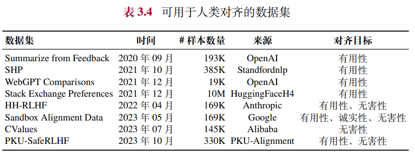

# LLM 数据工程

- 数据集 & 数据采集
- 数据清洗
    - 质量过滤
    - 敏感内容过滤
    - 数据去重
- tokenizer 词元化 / 分词
- 数据调度（Data Scheduling）：数据配比 & 数据课程

## 1. 数据集 & 数据采集
## 1.0. 数据类型

- 预训练
    - 纯文本：⽤于预训练Post-pretrain。特定⾏业⽅向/场景下的⼤规模⽆标注数据语料。
- 微调
    - Prompt+Response：⽤于文本生成场景的有监督微调SFT。单轮或多轮的⽂本对话数据，提问与回答⼀⼀对应。
    - Role(user+assistant)：⽤于文本生成场景的有监督微调SFT。单轮或多轮的文本对话数据，提问与回答—一对应，支持多角色类型与Function Call工具调用。
    - 多模态
        - Prompt+图片：⽤于图像生成场景的有监督微调SFT，文本提问与图片回答—一对应。
        - Prompt+Image+Response：用于图像理解场景的有监督微调SFT，单轮或多轮的图文混合对话数据，支持单图或多图场景。
- 对齐
    - Prompt+Chosen/Rejected：用于偏好对齐KTO。单轮或多轮的⽂本对话数据，每个提示语存在对应的正或负偏好回答。
    - Prompt+Chosen+Rejected：用于偏好对齐DPO。单轮或多轮的⽂本对话数据，每个提示语存在对应的正负偏好回答。
    - Prompt+多Response排序：⽤于RLHF奖励模型微调。单轮或多轮的⽂本对话数据，单个提问对应多个回答，多个回答间带有先后排序关系。
    - Prompt集：⽤于RLHF强化学习微调。

### 1.1. 数据集
### 1.1.1. 常用的预训练数据集
- 网页
- 书籍
- Wikipedia（维基百科）
    - 除了通过维基百科的官方提供的下载方式，Hugging Face 上也有相应的维基百科数据集。在实际应用中，可以根据需求选择特定时间段或特定内容的数据。例如 LLaMA 使用的是 2022 年 6 月至 8 月的维基百科数据。
- 代码
    - GitHub
    - StackOverflow
- 混合型
- 预训练数据集 FindWeb
    - https://huggingface.co/datasets/HuggingFaceFW/fineweb
    - https://huggingface.co/datasets/HuggingFaceFW/fineweb-edu
    - https://huggingface.co/datasets/HuggingFaceFW/fineweb-2

### 1.1.2. 常用的微调数据集
三种主要类型
- NLP任务数据集
    - 在指令微调被提出前，早期的研究通过收集不同自然语言处理任务（如文本分类和摘要等）的实例，创建了有监督的多任务训练数据集。这些多任务训练数据集成为了构建指令微调数据集的重要来源之一。一般的方法是使用人工编写的任务描述来扩充原始的多任务训练数据集，从而得到可以用于指令微调的NLP任务数据集。
    - P3 和 FLAN 是两个代表性的基于NLP任务的指令微调数据集。
- 日常对话数据集
    - 日常对话数据集是基于真实用户对话构建的，其中查询主要是由真实用户提出的，而回复是由人类标注员回答或者语言模型所生成。主要的对话类型包括开放式生成、问答、头脑风暴和聊天。
    - 三个较为常用的日常对话数据集包括ShareGPT、OpenAssistant 和 Dolly。
- 合成数据集
    - 合成数据集通常是使用大语言模型基于预定义的规则或方法进行构建的。
    - Self-Instruct-52K 和 Alpaca-52K 是两个具有代表性的合成数据集

### 1.1.3. 常用的对齐数据集

### 1.2. 数据采集
找原始数据的两个选择
- 自己爬取（像OpenAI和Anthropic就是这么做的）
- 使用已爬网页的公开仓库，如CommonCrawl
    - [https://commoncrawl.org/](https://commoncrawl.org/)
    - CommonCrawl 数据有两种主要格式：WARC 和 WET。
        - WARC（Web ARChive 格式）文件包含爬取的原始数据，包括完整的页面 HTML 和请求元数据。
        - WET（WARC 封装文本）文件则提供了这些网站的纯文本版本。
    - 低预算团队可以直接采用WET数据，如果有更多预算，可以考虑自己从WARC中抽取出文本内容，数据质量会更高

### 1.3. 评估数据的好坏
在数据集的代表性子集上训练小模型，并在评估任务集上评估它们
- 使用小模型是为了控制训练成本和时间
- 重要的是选择一个多样化且具有代表性的数据集-评估任务集，并尽量避免对任何一个单独的基准过度拟合（overfit），因为这可能会损害预训练后获得的LLM的泛化能力

## 2. 数据清洗
一般来说，需要构建并使用系统化的数据处理框架，从而保证预训练数据的质量。

系统化的数据处理框架
- datatrove
    - https://github.com/huggingface/datatrove
- Data-Juicer
    - https://github.com/modelscope/data-juicer

### 2.1. 质量过滤
- 目的 : 去除低质量内容
- 2种数据清洗方法
    - 基于启发式规则的方法
        - 不同类型的文本数据往往需要设计不同的清洗规则。例如，在处理 Reddit 数据时，可以通过过滤点赞数过少的帖子来剔除低质量内容；而在处理代码语料时，可以过滤掉非代码相关格式的数据。
        - 规则
            - 基于语种的过滤
            - 基于简单统计指标的过滤
            - 基于关键词的过滤
    - 基于分类器的方法
        - 训练用于判别数据质量的文本分类器
        - 为了减少数据的误筛，可以使用多个分类器进行联合过滤或召回，从而来实现对低质量文本的高可信过滤。
        - 此外，也可以针对不同的评估维度训练不同的分类器，并采用类似集成的方式对于语料进行全面的过滤。
        - 目前常用来实现分类器的方法包括轻量级模型（如 FastText 等）、可微调的预训练语言模型（如 BERT、BART 或者 LLaMA 等）以及闭源大语言模型 API（如GPT-4、Claude 3）。
- 为了平衡效率与准确性，可以针对具体数据集合进行清洗策略的灵活组合。例如，可以首先利用启发式规则进行初步筛选，以快速排除不符合要求的文档，随后再采用分类器方法进一步精细过滤，确保最终筛选出的语料具有较好的文本质量。在这一过程中，还可以同时应用多种分类器，可以先使用轻量级分类器进行数据过滤，进而使用更为有效但是资源消耗更高的分类器在粗滤后的数据上再次进行选择。

### 2.2. 敏感内容过滤
- 目的 : 去除有毒内容和隐私信息
- 过滤有毒内容
    - 采用基于分类器的过滤方法。Jigsaw 评论数据集提供了用于训练毒性分类器的数据
- 过滤隐私内容
    - 一种直接且有效的方法是使用启发式方法，如关键字识别，来检测和删除这些私人信息

### 2.3. 数据去重 Deduplicating the data
- 对预训练数据进行去重处理是一个重要步骤
- 数据去重的意义
    - 去重已被证明与模型性能的提升相关，并可以减少模型对预训练数据的死记硬背，有助于更好的泛化能力
    - 去重等同于提高训练效率，移除了重复数据后，模型可以用更少的训练迭代达到相同的性能水平，对于给定数量的训练token数，模型将能接触到更多样化的数据
- 数据去重的方法
    - 用于去重的匹配方法
        - 精确匹配算法（即每个字符完全相同）
        - 近似匹配算法（基于某种相似性度量）
    - 常见的方法依赖哈希技术（hashing techniques）来加速过程，或者构建高效的数据结构来索引数据（例如后缀数组，suffix arrays）
    - 此外，为了避免数据集污染问题，还需要从预训练数据集中删除在测试集中可能出现的重复或者相关文本，从而防止训练集和测试集之间的重叠
- 计算粒度
    - 去重可以在句子级别、文档级别和数据集级别等多种粒度上进行
- 现有的数据集往往采用多阶段、多粒度的方式来实现高效的去重
    - 首先针对数据集和文档级别进行去重，旨在去除那些具有高度相似甚至完全一致内容的文档，例如多个 URL 可能具有相同的网页内容，或者网页数据集和新闻数据集中包含相同的新闻文档。随后，可以进一步在句子级别实现更为精细的去重。例如，可以计算两个句子之间公共子串的长度，当其长度过长时直接删除某一个句子。
- 去重效率和去重效果的权衡
    - 例如，RefinedWeb 在文档层面采用了开销较小的近似匹配技术来实现去重，而在句子层面则采用了精确匹配算法来确保去重的准确性。

## 3. 数据调度（Data Scheduling）：数据配比 & 数据课程
数据调度：就是给LLM编排学习课程计划

主要关注两个方面
- 数据配比 / 数据混合（各个数据源的混合比例）
- 数据课程，Data Curriculum（各数据源用于训练的顺序）

### 3.1. 数据配比
数据混合通常在数据集合层面上设置（即整个预训练数据的整体分布），也可以在不同训练阶段采用不同的混合数据比例。

#### 3.1.1. 典型的数据分布
重要参考：LLaMA
- LLaMA 的预训练数据主要包括超过 80% 的网页数据、来自 GitHub 和 StackExchange 的 6.5% 代码密集型数据、4.5% 的书籍数据，以及来自 arXiv 的 2.5% 科学数据，这个数据配比成为了训练大语言模型的一个重要参考

目前一些代表性的LLM的数据混合配比情况

#### 3.1.2. 常见数据混合策略
- 增加数据源的多样性
    - 在收集预训练数据时，需要注意引入数据多样性更高的数据源，如包含网页数据、各类型书籍、代码数据等
- 优化数据混合
    - 除了手动设置数据混合配比外，还可以使用可学习的方法来优化数据组成
- 优化特定能力
    - 大语言模型的模型能力在很大程度上取决于数据选择和配比，可以通过增加特定数据源的比例来增强某些对应的模型能力
    - 例如，可以通过使用更多的数学文本和代码数据来增强大语言模型的数学推理和编程能力，而增加书籍数据的比例可以提高模型捕捉文本长程依赖关系的能力 

### 3.2. 数据课程，Data Curriculum（各数据源用于训练的顺序）
数据课程是指按照特定的顺序安排预训练数
据进行模型的训练。更广泛地说，它可以指训练期间在不同阶段使用不同的数据源混合配比。

原则 : 从简单/通用的数据开始，逐渐引入更具挑战性/专业化的数据（基本技能 → 目标技能）
- 相关研究表明，为了学习某些特定的技能，按照技能依赖顺序编排对应数据集的学习方法（例如，基本技能 → 目标技能）比直接在相关的特定语料库上学习效果更好

一种较为实用的方法是首先使用多个候选策略训练多个小型语言模型，然后从中选择一个最优的训练策略

继续预训练具体应用
- 由于预训练阶段需要耗费大量的计算资源，目前针对数据课程的研究工作主要集中在继续预训练（Continual Pre-training）这一方面
- 具体应用
    - 代码能力
        - CodeLLaMA
            - 采用的数据课程为：2T 通用词元 → 500B 代码密集型词元
        - CodeLLaMA-Python
            - 采用的数据课程为：2T 通用词元 → 500B 代码相关的词元 → 100B Python 代码相关的词元
    - 数学能力
        - 将CodeLLaMA 作为基座模型的数学LLM：Llemma
            - 采用的数据课程为：2T 通用词元 → 500B 代码相关的词元 → 50∼200B 数学相关的词元
        - 值得注意的是，Llemma 的继续预训练数据中还包含5％的通用领域数据，这可以看做一种模型能力的“正则化”技术，加强对于原始基座模型通用能力的保持
    - 长文本能力
        - CodeLLaMA 将 LLaMA-2的上下文窗口从 4K 扩展到了 100K
            - 采用的数据课程为：2.5T 词元，4K 上下文窗口 → 20B 词元，16K 上下文窗口
        - 通过使用这种训练序列长度由短到长的数据课程，能够使模型获得较好的长文本建模能力，同时可以节省长文本模型的训练时间。

## 4. 数据对预训练效果的影响
- 数据数量的影响
    - 整体上，语言模型的性能会随着训练数据数量的增加而提升，符合扩展法则
- 数据质量的影响
    - 在获取充足数量的预训练数据后，数据质量直接决定了模型的实际性能。
    - 通过显著提升数据质量，使得语言模型在参数、数据、算力更加节约的情况下就能展现出与更大规模模型相匹敌甚至更为优异的性能
    - 如果模型在包含事实性错误的、过时的数据上进行训练，那么它在处理相关主题时可能会产生不准确或虚假的信息，这种现象被称为“幻觉”
    - 重复数据的影响
        - 重复数据对于模型训练及最终性能会带来不良影响。此外，重复数据可能会降低大语言模型利用上下文中信息的能力。这会削弱模型在上下文学习中的泛化能力，使其难以适应各种复杂的语言环境和任务需求。
        - 通常的建议是对于预训练数据进行精细的去重操作
    - 有偏、有毒、隐私内容的影响
        - 一旦数据中包含有偏、有毒、隐私的内容，将会对于模型造成严重的不良影响。在有偏内容上训练可能会导致语言模型学习并复制这些偏见，进而在其生成的文本中表现出对诸如种族、性别和年龄的偏好或歧视。进一步，如果训练数据中包含有毒内容，模型则可能会产生侮辱性、攻击性或其他有害的输出；而在含有隐私内容的数据上训练可能会导致模型在输出中无意中泄露或利用个人数据。这些问题对于大语言模型的对齐带来了很大挑战。例如，通过精心设计的提示或利用模型的特定弱点，攻击者可能诱使模型输出不当或有害的信息
        - 需要通过严格的数据过滤和预处理方法来尽量减少有偏见、有毒或包含隐私信息的数据
- 数据集污染
    - 定义 : 在进行模型评测时，可能会发现某些评估基准所包含的数据，实际上已出现在预训练数据或者微调数据中，这种现象被称为基准泄漏或数据集污染
    - 影响 : 这种情况破坏了评估集合构建的初衷，使得不同模型之间的对比失去了公平性