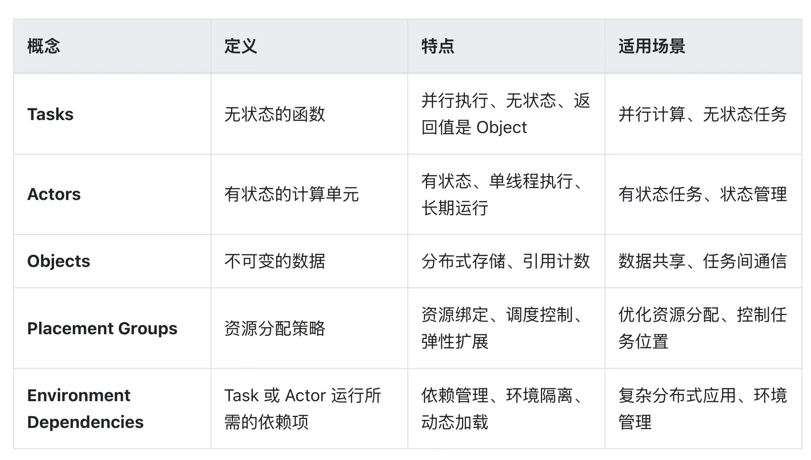

# ray

ray概念：https://segmentfault.com/a/1190000046195156

- rank: 全局进程号且全局唯一，从0开始，如果一个GPU上分配一个进程的话，rank0指0卡上的进程
- local_rank: 在单个node上进程的相对序号,从0开始,local_rank在node之间相互独立,全局不唯一，node里唯一
- node: 节点(容器/物理节点)，一个node上通常有多个GPU
    - node_rank: 标识第几台node
    - nnodes: 节点数量
    - nproc_per_node: 每个节点上的进程数
    - ngprus_per_node: 每个节点上可用的GPU卡数
- world_size: 全局进程总个数，即在一个分布式任务中rank的数量
- Group: 进程组，一个分布式任务对应了一个进程组。只有用户需要创立多个进程组时才会用到group来管理，默认情况下只有一个group