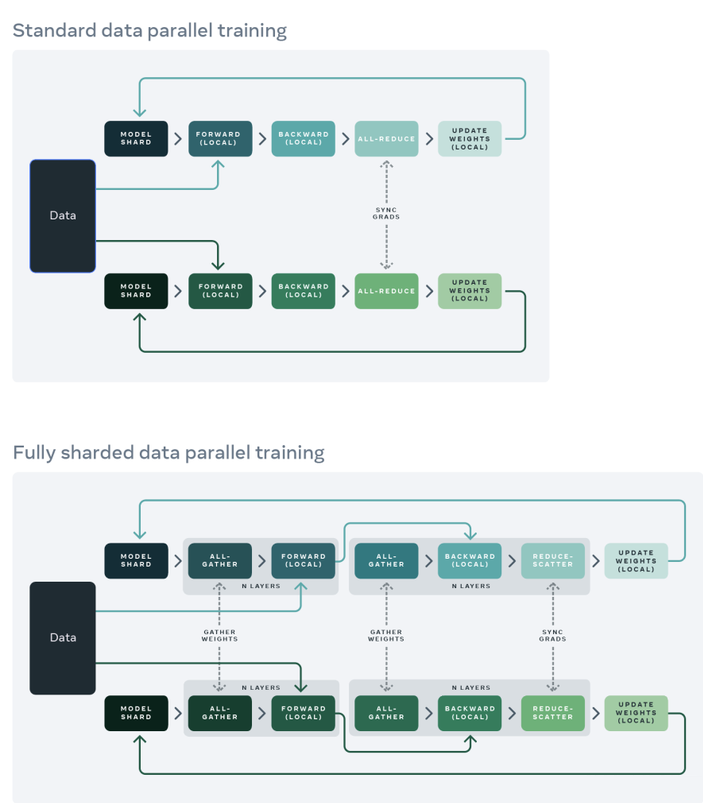
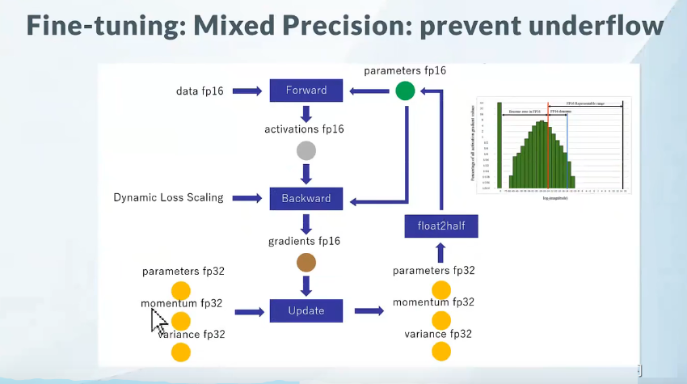
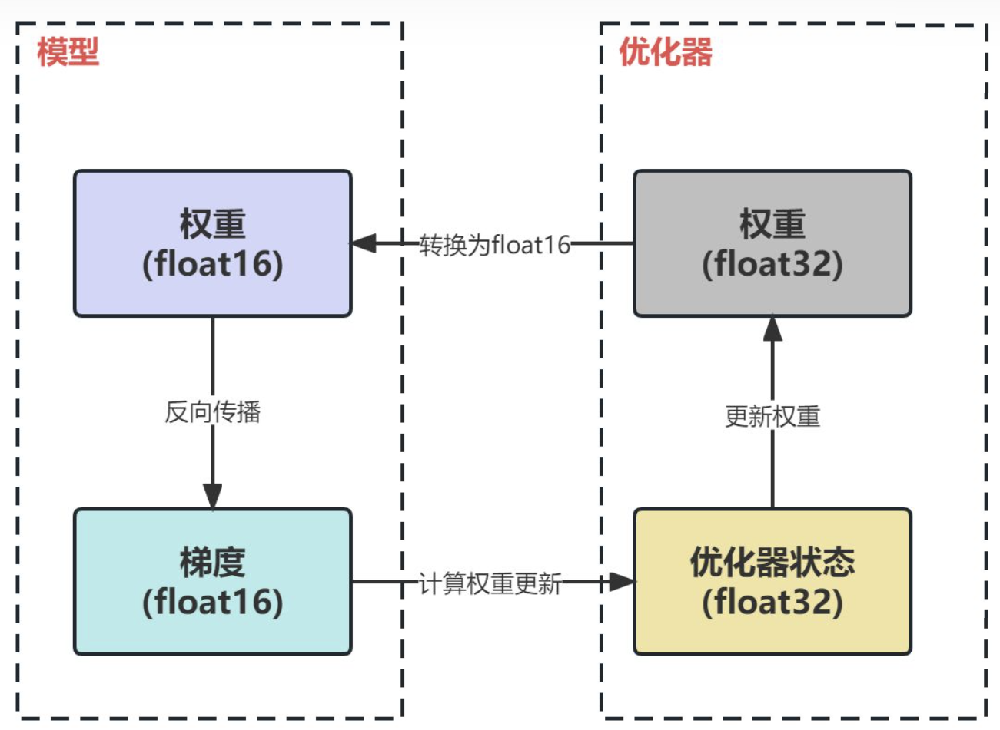
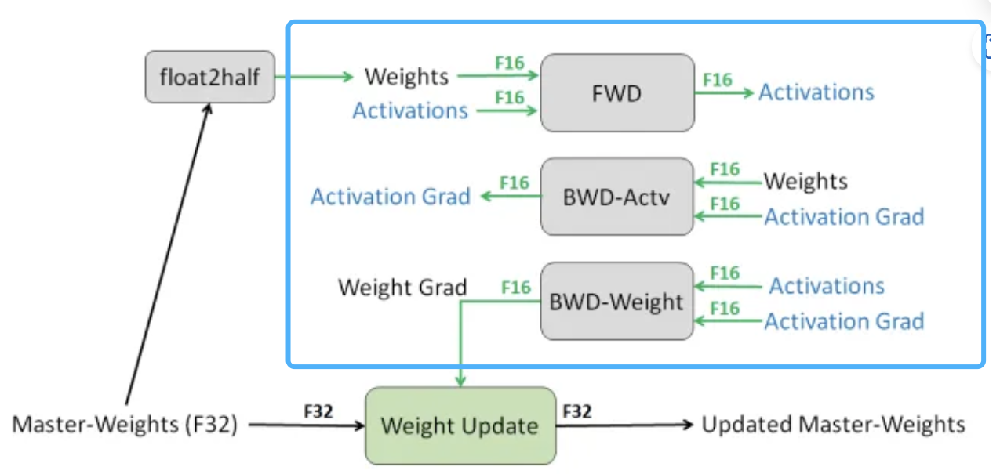
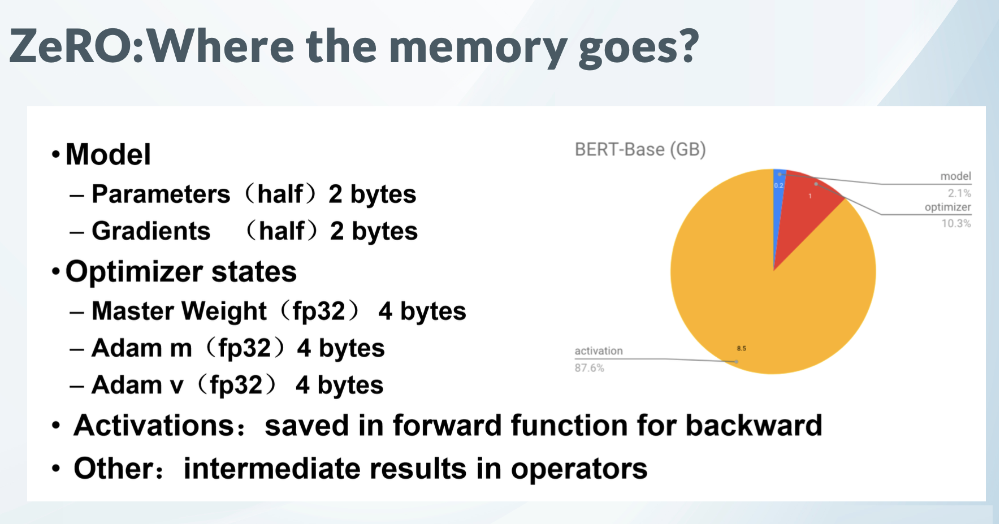

# 分布式训练框架
训练框架对比
- 小 (<10B参数): torchrun/accelerate都行
- 中（10B-100B参数）: deepspeed
- 大（>100参数）: 得上megatron

## 0. Pytorch三种数据并行方案
- DP（torch.nn.DataParallel）
    - 目前，基本上 DP 已经被弃用
    - DP只用于单机情况（单进程多线程模式），不支持多级多卡
    - 使用普通的All-Reduce机制
- DDP（torch.nn.DistributedDataParallel）
    - 相较于DP，DDP传输的数据量更少，训练更高效
    - DDP适用于单机和多机情况，真正实现分布式训练
    - DDP数据传输过程：
        - 前向传播的输出和loss的计算都是在每个cuda独立计算的，梯度all-reduce到所有的CUDA(传输梯度)，这样初始参数相同，para.grad也相同，反向传播后参数就还是保持一致的，其他没有数据传输了。
        - DDP在各进程梯度计算完成之后，各进程需要将梯度进行汇总平均，然后再由 rank=0 的进程，将其广播到所有进程后，各进程用该梯度来独立的更新参数。由于DDP各进程中的模型，初始参数一致 (初始时刻进行一次广播)，而每次用于更新参数的梯度也一致；因此，各进程的模型参数始终保持一致
    - 不足：要求整个模型加载到一个GPU上
- FSDP（torch.distributed.fsdp.FullyShardedDataParallel）
    - PyTorch FSDP 受 DeepSpeed ZeRO 启发而获得灵感
    - 是一种新型数据并行训练方法
    -  将模型参数、梯度和优化器状态跨数据并行工作线程进行分片，并且可以选择将模型参数分片卸载到 CPU
### DP和DDP的区别

DP 和 DDP 的主要差异有以下几点：
- DP 是基于单进程多线程的实现，只用于单机情况，而 DDP 是多进程实现的，每个 GPU 对应一个进程，适用于单机和多机情况，真正实现分布式训练，并且因为每个进程都是独立的 Python 解释器，DDP 避免了 GIL 带来的性能开销。
- 参数更新的方式不同。DDP在各进程梯度计算完成之后，各进程需要将梯度进行汇总平均，然后再由 rank=0 的进程，将其广播到所有进程后，各进程用该梯度来独立的更新参数（而 DP是梯度汇总到 GPU0，反向传播更新参数，再广播参数给其他剩余的 GPU）。由于DDP各进程中的模型，初始参数一致 (初始时刻进行一次广播)，而每次用于更新参数的梯度也一致；因此，各进程的模型参数始终保持一致（而在DP中，全程维护一个 optimizer，对各个GPU上梯度进行求平均，而在主卡进行参数更新，之后再将模型参数广播到其他GPU）。相较于DP，DDP传输的数据量更少，训练更高效，不存在 DP 中负载不均衡的问题。目前，基本上 DP 已经被弃用。
- DDP 支持模型并行，而 DP 并不支持，这意味如果模型太大单卡显存不足时，只能使用DDP。

### DDP 和 FSDP的区别


- DDP
    - 每个GPU上都有一个模型副本，向前和向后传递的序列只在自己的数据分片上进行
- FSDP
    -   **Model shard**：每个GPU上仅存在**模型的分片**。
    -   **All-gather**：每个GPU通过all-gather从其他GPU收集所有**权重**，以在本地计算前向传播。
    -   **Forward（local）**：在本地进行前向操作。前向计算和后向计算都是利用完整模型。
    -   **All-gather**：然后在后向传播之前再次执行此**权重**收集。
    -   **Backward（local）**：本地进行后向操作。前向计算和后向计算都是利用完整模型，此时每个GPU上也都是**全部梯度**。
    -   **Reduce-Scatter**：在向后传播之后，局部**梯度**被聚合并且通过 Reduce-Scatter 在各个GPU上分片，每个分片上的梯度是聚合之后本分片对应的那部分。
    -   **Update Weight（local）**：每个GPU更新其局部**权重**分片。


## 1. DeepSpeed
DeepSpeed 是由 Microsoft 提供的分布式训练工具，旨在支持更大规模的模型和提供更多的优化策略和工具。

**DeepSpeed 提出了 ZeRO**

解锁ZeRO/FSDP的关键是我们可以把DDP之中的All-Reduce操作分解为独立的 Reduce-Scatter 和 All-Gather 操作。

### 为什么需要Deepspeed

-   分布式计算环境中，主节点负责协调其他节点和进程的工作
-   pytorch官方提供的分布式训练工具Accelerate只支持nvlink，而T4，3090这类显卡是PIX ，检测方式：nvidia-smi topo -m；deepspeed支持更大规模的模型训练
-   混合精度训练
-   ZeRO可以减少内存占用，优化大模型训练，将模型参数分成了三个部分：Optimizer States、Gradient 和 Model Parameter。在使用 ZeRO 进行分布式训练时，可以选择 ZeRO-Offload 和 ZeRO-Stage3 等不同的优化技术。

### DeepSpeed 优化点
与其他框架相比，DeepSpeed支持更大规模的模型和提供更多的优化策略和工具。其中，主要优势在于支持更大规模的模型、提供了更多的优化策略和工具（例如 ZeRO 和 Offload 等）

DeepSpeed 为分布式训练提供了各种优化技术支持，如内存优化（ZeRO 技术、梯度检查点）、数据并行、混合精度训练等，使得整个训练过程变得更加高效、稳定。为了更加适配大模型时代的用户需求

-   DeepSpeed 还提供了 mpi、gloo 和 nccl 等通信策略，可以根据具体情况进行选择和配置。在使用 DeepSpeed 进行分布式训练时，可以根据具体情况选择合适的通信库，例如在 CPU 集群上进行分布式训练，可以选择 mpi 和 gloo；如果是在 GPU 上进行分布式训练，可以选择 nccl。
-   `ZeRO`（Zero Redundancy Optimizer）是**一种用于大规模训练优化的技术，主要是用来减少内存占用**。ZeRO 将模型参数分成了三个部分：Optimizer States、Gradient 和 Model Parameter。在使用 ZeRO 进行分布式训练时，可以选择 ZeRO-Offload 和 ZeRO-Stage3 等不同的优化技术。
-   **混合精度训练**是指在训练过程中同时使用FP16（半精度浮点数）和FP32（单精度浮点数）两种精度的技术。使用FP16可以大大减少内存占用，从而可以训练更大规模的模型。在使用混合精度训练时，需要使用一些技术来解决可能出现的梯度消失和模型不稳定的问题，例如动态精度缩放和混合精度优化器等。
-   **用 3D 并行化实现万亿参数模型训练**\*\*：\*\*  DeepSpeed 实现了三种并行方法的灵活组合：ZeRO 支持的数据并行，流水线并行和张量切片模型并行。3D 并行性适应了不同工作负载的需求，以支持具有**万亿**参数的**超大型模型**，同时实现了近乎完美的显存扩展性和吞吐量扩展效率。此外，其提高的通信效率使用户可以在网络带宽有限的常规群集上以 2-7 倍的速度训练有数十亿参数的模型。
-   **ZeRO-Offload 使 GPU 单卡能够训练 10 倍大的模型**\*\*：\*\*  为了同时利用 CPU 和 GPU 内存来训练大型模型，我们扩展了 ZeRO-2。我们的用户在使用带有**单张英伟达 V100 GPU** 的机器时，可以在不耗尽显存的情况下运行**多达 130 亿个参数的模型**，模型规模扩展至现有方法的10倍，并保持有竞争力的吞吐量。此功能使数十亿参数的模型训练更加大众化，，并为许多深度学习从业人员打开了一扇探索更大更好的模型的窗户。
-   **通过 DeepSpeed Sparse Attention 用6倍速度执行10倍长的序列**\*\*：\*\*  DeepSpeed提供了稀疏 attention kernel ——一种工具性技术，可支持长序列的模型输入，包括文本输入，图像输入和语音输入。与经典的稠密 Transformer 相比，它支持的**输入序列长一个数量级**，并在保持相当的精度下获得最高 6 倍的执行速度提升。它还比最新的稀疏实现快 1.5–3 倍。此外，我们的稀疏 kernel 灵活支持稀疏格式，使用户能够通过自定义稀疏结构进行创新。
-   **1 比特 Adam 减少 5 倍通信量**\*\*：\*\*  Adam 是一个在大规模深度学习模型训练场景下的有效的（也许是最广为应用的）优化器。然而，它与通信效率优化算法往往不兼容。因此，在跨设备进行分布式扩展时，通信开销可能成为瓶颈。我们推出了一种 1 比特 Adam 新算法，以及其高效实现。该算法**最多可减少 5 倍通信量**，同时实现了与Adam相似的收敛率。在通信受限的场景下，我们观察到分布式训练速度提升了 3.5 倍，这使得该算法可以扩展到不同类型的 GPU 群集和网络环境。

### DeepSpeed 通信策略
deepspeed 还提供了 mpi、gloo 和 nccl 等通信策略，可以根据具体情况进行选择和配置。

-   `mpi`是一种跨节点通信库，常用于 CPU 集群上的分布式训练；
-   `gloo` 是一种高性能的分布式训练框架，支持 CPU 和 GPU 上的分布式训练；
-   `nccl` 是 NVIDIA 提供的 GPU 专用通信库，被广泛应用于 GPU 上的分布式训练。

在使用 DeepSpeed 进行分布式训练时，可以根据具体情况选择合适的通信库。通常情况下，如果是在 CPU 集群上进行分布式训练，可以选择 mpi 和 gloo；如果是在 GPU 上进行分布式训练，可以选择 nccl。

```bash
export CUDA_LAUNCH_BLOCKING=1
```

### 混合精度训练
在 DeepSpeed 中，可以通过在配置文件中设置 `“bf16.enabled”: true` 来启用 BF16 混合精度训练，减少占用内存。混合精度训练是指在训练过程中同时使用FP16（半精度浮点数）和FP32（单精度浮点数）两种精度的技术。

在训练过程中，deepspeed会自动将一部分操作转换为FP16格式，并根据需要动态调整精度缩放因子，从而保证训练的稳定性和精度。







-   **将权重转换为FP16**：在这一步中，神经网络的权重（或参数）最初是FP32格式，被转换为低精度的FP16格式。这减少了内存的占用，并允许更快的计算，因为FP16操作需要更少的内存，并且可以被硬件更快地处理。 &#x20;
-   **计算梯度**：神经网络的前向和后向通道是使用较低精度的FP16权重进行的。这一步计算损失函数相对于网络权重的梯度（部分导数），在优化过程中用于更新权重。
-   **将梯度转换为FP32**：在FP16中计算梯度后，它们被转换回高精度的FP32格式。这种转换对于保持数值稳定性和避免使用低精度算术时可能出现的梯度消失或爆炸等问题至关重要。 &#x20;
-   **乘以学习率和更新权重**：现在是FP32格式，梯度被乘以学习率（一个标量值，决定了优化过程中的步长）。乘积被用来更新原始FP32神经网络权重。学习率有助于控制优化过程的收敛性，对于实现良好的性能至关重要。


NVIDIA Tesla V100 不支持BF16

#### 混合精度显存占用分析

##### （1）**模型状态**（model states）

假设模型的参数量是 $Ψ$ ，使用Adam为优化器进行混合精度训练。

1.  由于模型的参数和梯度使用float16，所以显存消耗分别为 $2Ψ$ 和 $2Ψ$ 。
2.  Adam会维护一个float32的模型备份副本，消耗 $4Ψ$ 显存。Adam优化器本身会为模型的每个参数维护两个float32的辅助变量（fp32的momentum和fp32的variance），所以显存消耗占用为 $4Ψ+4Ψ$ 。

总的来说，模型会消耗 $2Ψ+2Ψ=4Ψ$ ，Adam优化器这消耗$ 4Ψ+4Ψ+4Ψ=12Ψ $。最终的总消耗为 $4Ψ+12Ψ=16Ψ $。



\*\*这里为了方便讨论，将优化器显存占用表示为 **$KΨ$** (不同的优化器不同)，则混合精度训练的显存占用为 **$4Ψ+KΨ$** 。 \*\*

来看一个例子，**GPT-2**含有1.5B个参数，如果用fp16格式，只需要`1.5G*2Byte=3GB`显存

但是模型状态实际上需要耗费`1.5*16=24GB`, 相比之下，激活值可以用[activation checkpointing](https://arxiv.org/pdf/1604.06174.pdf "activation checkpointing")来大大减少，所以模型状态就成了头号显存杀手，它也是ZeRO的重点优化对象。而其中Adam状态又是第一个要被优化的。

比如说有一个模型参数量是1M，在一般的深度学习框架中(比如说PyTorch)，一般是32位存储。32位存储的意思就是1个参数用32个bit来存储。那么这个拥有1M参数量的模型所需要的存储空间的大小即为：1M \* 32 bit = 32Mb = 4MB。因为1 Byte = 8 bit。现在的quantization技术就是减少参数量所占的位数：比如我用16位存储，那么：所需要的存储空间的大小即为：1M \* 16 bit = 16Mb = 2MB。

##### **（2）剩余状态**（residual states）

&#x20;除了模型状态之外的显存占用，包括**激活值（activation）、各种临时缓冲区（buffer）以及无法使用的显存碎片（fragmentation）**。

显然，激活在训练中也会消耗大量的显存。一个具体的例子，模型为1.5B的GPT-2，序列长度为1K，batch size为32，则消耗显存为60GB。Activation checkpointing(或者activation recomputation)则是一种常见的降低激活占用显存的方法。该方法以33%的重计算为代价，将激活的显存占用减少至总激活的均分更。即激活显存占用从60GB降低至8GB。

尽管激活的显存占用已经显著减少，但是对于更大的模型来说，激活所占用的显存也会非常大。例如，对于100B参数量的GPT模型且batch size为32，即使用来activation checkpointing，显存占用也需要60GB。

**临时缓存区(Temporary buffers)**。对于大模型，用于存储中间结果的临时buffer也会消耗大量显存。例如在all-reduce时，需要一个平坦的buffer来融合所有的梯度，从而改善吞吐量。例如，跨设备的all-reduce操作会随着消息的增大而增加。虽然，梯度本文是fp16的张量，但是有些操作中可能需要融合的buffer为fp32。当模型尺寸很大时，临时的buffer也不小。例如，对于1.5B参数的模型，一个fp32的buffer需要6GB的显存。

**显存碎片**。即使在有足够显存的情况下，也可能会导致Out of Memory，这是由于显存碎片导致的。在进程发出显存请求时，如果没有连续的显存来满足请求，即使总的显存仍然足够，该请求也会失败。当训练非常大的模型时，可以观察到明显的显存碎片。极端情况下，可能会导致30%的显存碎片。

### DeepSpeed的核心技术：**Zero**（Zero Redundancy Optimizer，3D优化与卸载）
在deepspeed中通过`zero_optimization.stage=0/1/2/3` 设置，卸载通过`zero_optimization.offload_optimizer.device`设置

`ZeRO-0`：禁用所有类型的分片，仅使用 DeepSpeed 作为 DDP (Distributed Data Parallel)

`ZeRO-1`：分割Optimizer States，减少了4倍的内存，通信容量与数据并行性相同

`ZeRO-2`：分割Optimizer States与Gradients，8x内存减少，通信容量与数据并行性相同

`ZeRO-3`：分割Optimizer States、Gradients与Parameters，内存减少与数据并行度和复杂度成线性关系。

`ZeRO-Infinity`是ZeRO-3的拓展。允许通过使用 NVMe 固态硬盘扩展 GPU 和 CPU 内存来训练大型模型。ZeRO-Infinity 需要启用 ZeRO-3。


ZeRO-Offload和ZeRO-Stage3是DeepSpeed中的不同的Zero-Redundancy Optimization技术，用于加速分布式训练，主要区别在资源占用和通信开销方面。

-   `ZeRO-Offload`将模型参数分片到不同的GPU上，通过交换节点间通信来降低显存占用，但需要进行额外的通信操作，因此可能会导致训练速度的下降。
-   `ZeRO-Stage3`将模型参数分布在CPU和GPU上，通过CPU去计算一部分梯度，从而减少显存占用，但也会带来一定的计算开销。

## 2. Megatron-LM
Megatron-LM是由 NVIDIA 开发的一款专门为训练大语言模型而设计的深度学习代码库。这个代码库旨在解决大型模型训练过程中所遇到的一系列技术挑战，包括显存限制、计算效率以及不同的并行策略带来的通信问题。这些优化技术可以在很大程度上提高训练效率和速度，实现跨 GPU 的高效分布式训练。

引入了一系列分布式训练的优化技巧，支持多种并行化策略

数据并行，通过在每个工作节点复制模型，并将输入数据切分多份分配给多个节点，定期同步所有梯度来提升 GPU 的使用效率

模型并行，包括张量并行和流水线并行，通过在多个工作节点上分配模型和计算来克服单个 GPU 容量限制的问题

Megatron-LM 还支持混合精度训练和 FlashAttention 功能

## 分布式训练并行策略选择

上面讲述了各种分布式并行策略，以下是进行分布式训练时针对不同的服务器资源类型（单机多卡、多机多卡），如何选择并行策略非常粗略的概述。

### 8.1 单机单卡场景

当你的模型可以在单张 GPU 卡进行训练时，正常使用。

当你的模型不能在单张 GPU 卡进行训练时，

-   ZeRO + Offload CPU 和 NVMe（可选的）。
-   启用以**内存为中心的平铺** 。

如果最大层无法放置在单张GPU，则使用 ZeRO - 启用以**内存为中心的平铺** (MCT)。 它允许您通过自动分割层并按顺序执行来运行任意大的层。 MCT 减少了 GPU 上实时参数的数量，但不影响激活内存。

### 8.2 单机多卡场景

当你的模型可以在单张 GPU 卡进行训练时，可以选择 DDP 或 ZeRO：

-   DDP：分布式 DP。
-   ZeRO：可能会更快，也可能不会更快，具体取决于所使用的情况和配置。

当你的模型不能在单张 GPU 卡进行训练时，可以选择 PP、ZeRO、TP：

-   PP
-   ZeRO
-   TP

如果使用 NVLINK 或 NVSwitch 进行节点内通信，这三者应该基本处于同等水平。

如果没有这些， PP 将比 TP 或 ZeRO 更快。 TP 的大小也可能产生影响，最好在您特定设置上进行试验以找到最优的方式。

注意： TP 几乎总是在单个节点内进行使用。 即：TP 大小 <= 每个节点的 GPU 数。

### 8.3 多机多卡场景

当服务器节点间网络通信速度较快时，可以选择 ZeRO、PP+TP+DP：

-   ZeRO - 因为它几乎不需要对模型进行任何修改。
-   PP+TP+DP - 通信较少，但需要对模型进行大量更改。

当您服务器节点间网络通信速度较慢，并且 GPU 内存仍然不足时，可以选择 DP+PP+TP+ZeRO-1。

这里采用 PP 与 ZeRO-1 进行混合并行，**那么 PP 能与 DeepSpeed ZeRO 2/3一起训练吗**？

答：PP + ZeRO 2/3 不推荐一起训练。 PP 需要累积梯度（accumulate gradients），但 ZeRO2 需要对梯度进行分块（chunk）。 即使能够实现，也没有真正的性能提升。

将两者结合使用来提高效率并不容易，PP + ZeRO 2 实际上比 ZeRO2（无 PP）更慢且内存效率低。如果用户内存不足，用户可以使用 ZeRO3 代替 ZeRO2 + PP。而正因为如此，在 DeepSpeed 中， PP + ZeRO 2/3 之间不兼容。但可以将 PP 与 ZeRO 1 进行组合使用。

这里多说一点：即使该方法效率不高，但是 ColossalAI 为了支持更多的并行训练方法。ColossalAI 还是提供了 ZeRO 3 + PP + TP 一起组合的方案。

#### 8.4 假如有超多的8卡A100节点（DGX A100），如何应用3D并行策略？

参考Megatron-Turing NLG 530B

-   首先，张量并行。3种并行方式里，张量并行（TP）对于GPU之间的通信要求最高，而节点内有NVLINK通信速度可以达到600GB/s。
-   其次，流水线并行，每个节点负责一部分层，每35个节点组成一路完整的流水线，也就是一个完整的模型副本，这里一个模型副本需280卡。
-   最后，数据并行，官方也做了8路，10路，12路的并行实验，分别使用280个节点，350个节点和420个节点。

集群规模越大，单个GPU利用率越低。

#### 8.5 如果想构建这样一个大规模并行训练系统，训练框架如何选？

可以参考Megatron-Turing NLG 530B，NVIDIA [Megatron-LM](https://link.zhihu.com/?target=https://github.com/NVIDIA/Megatron-LM "Megatron-LM") + Microsoft [DeepSpeed](https://link.zhihu.com/?target=https://github.com/microsoft/DeepSpeed "DeepSpeed")

BLOOM则是PP+DP用DeepSpeed，TP用Megatron-LM

当然还有一些其他的训练框架，在超大规模下或许也能work。

参考：

-   [Details about pipeline parallelism implementation in DeepSpeed · Issue #1110 ·](https://github.com/microsoft/DeepSpeed/issues/1110 "Details about pipeline parallelism implementation in DeepSpeed · Issue #1110 ·")
-   [DeepSpeed/deepspeed/runtime/pipe/engine.py ](https://github.com/microsoft/DeepSpeed/blob/master/deepspeed/runtime/pipe/engine.py "DeepSpeed/deepspeed/runtime/pipe/engine.py ")
-   [How PP and ZeRO stage 2+ work together? · Issue #682](https://github.com/hpcaitech/ColossalAI/issues/682 "How PP and ZeRO stage 2+ work together? · Issue #682")
-   [\[zero\] ZeRO supports pipeline parallel by ver217 · Pull Request #477 ](https://github.com/hpcaitech/ColossalAI/pull/477 "\[zero] ZeRO supports pipeline parallel by ver217 · Pull Request #477 ")
