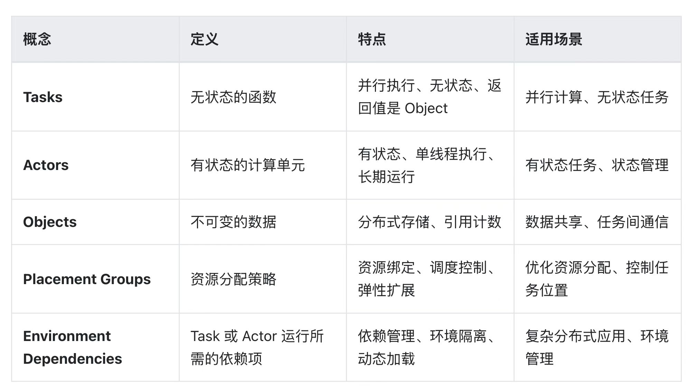

# Ray 分布式计算框架

- Github: https://github.com/ray-project/ray
- 官方文档：https://docs.ray.io/en/latest/index.html
- Paper：https://arxiv.org/abs/1712.09381

ray概念：https://segmentfault.com/a/1190000046195156

## 分布式计算概念
- 全局进程编号 rank
    - 全局进程号且全局唯一，从0开始，如果一个GPU上分配一个进程的话，rank0指0卡上的进程
- 局部进程编号 local_rank
    - 在单个node上进程的相对序号,从0开始,local_rank在node之间相互独立,全局不唯一，node里唯一
- node: 节点(容器/物理节点)，一个node上通常有多个GPU
    - 节点编号 node_rank: 标识第几台node
    - nnodes: 节点数量
    - nproc_per_node: 每个节点上的进程数
    - ngprus_per_node: 每个节点上可用的GPU卡数
- 全局总进程数 world_size
    - 全局进程总个数，即在一个分布式任务中rank的数量
- Group: 进程组，一个分布式任务对应了一个进程组。只有用户需要创立多个进程组时才会用到group来管理，默认情况下只有一个group
- 主节点 master (master_ip+master_port)
    - 主节点负责协调所有其他节点和进程的工作
    - 主节点还负责监控系统状态、处理任务分配和结果汇总等任务，因此是整个系统的关键部分
    - 为了确定主节点，我们需要知道它的IP地址和端口号