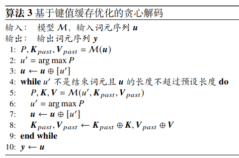
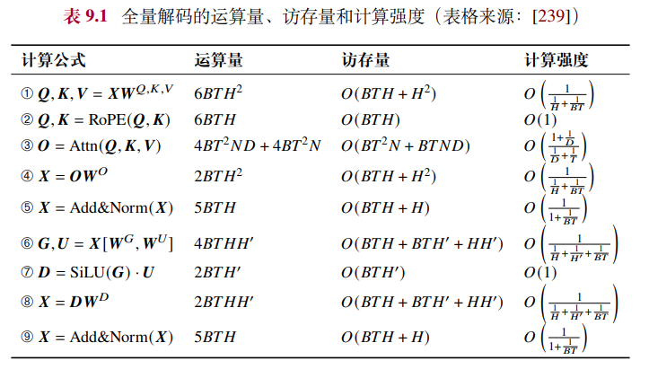
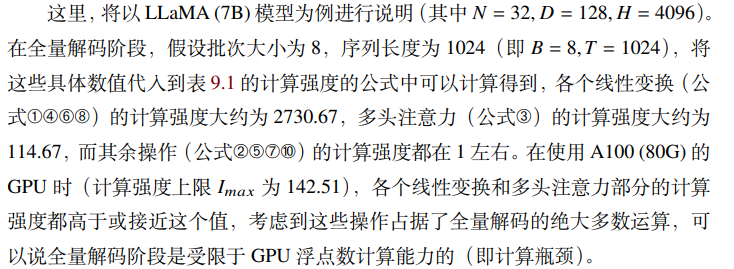
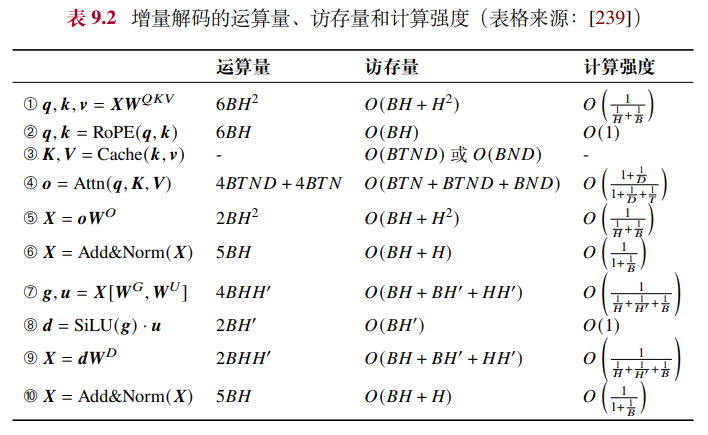

# LLM推理
## 1. 解码效率的定量评估指标
- GPU性能评估
    - GPU算力 : 算力是指 GPU 每秒能够进行的浮点运算次数，单位是 FLOP/s
    - GPU带宽 : 带宽是该显卡每秒能够进行的显存读写量，单位是 byte/s
    - GPU计算强度上限 : 算力和带宽的比值被称为该 GPU 的计算强度上限 𝐼𝑚𝑎𝑥，单位为 FLOP/byte
- 模型性能评估
    - 模型的运算量 : 运算量是指运行该模型需要的总浮点计算数，单位为 FLOP
    - 模型的访存量 : 访存量是运行该模型的过程中所需的显存读写量，单位为 byte
    - 模型的计算强度 : 运算量和访存量的比值被称为该模型的计算强度 𝐼，单位为 FLOP/byte
- 带宽瓶颈和计算瓶颈
    - 带宽瓶颈 / 显存瓶颈
        - 当模型的计算强度 𝐼 小于GPU 的计算强度上限 𝐼𝑚𝑎𝑥 时，这说明 GPU 的理论最高显存读写速度低于实际运算所需速度，因此模型实际的运行效率将主要受到显存读写速度的影响，这种情况称为带宽瓶颈；
    - 反之，当 𝐼 大于 𝐼𝑚𝑎𝑥 时，说明 GPU 的理论最高浮点运算速度低于实际运算所需速度，因此模型的运行效率将主要受到算力的影响，这种情况称为计算瓶颈。

## 2. 自回归生成算法
由于自回归算法的序列化生成特点，使得解码算法存在效率较低的问题。

## 3. 全量解码阶段与增量解码阶段
### 3.1. 全量解码阶段 / 预填充阶段（第一次）- 计算瓶颈
对于输入序列，一次性地计算其状态并缓存键值矩阵
（算法 3 第 1 至 3 行）

以 LLaMA 模型为例，全量解码的运算量、访存量和计算强度：

全量解码阶段是受限于 GPU 浮点数计算能力（即计算瓶颈）

### 3.2. 增量解码阶段 / 解码阶段（之后多次）- 带宽瓶颈/显存瓶颈
只计算上一步新生成词元的状态，并不断地以自回归方式生成新词元并对应更新键值缓存，直到生成结束（算法 3 第 4-9 行）

解码时需要用到之前每一个token的KV值，如果不缓存KV值，就要每次都重新计算完整的KV值

**解码阶段的低效问题主要出现在增量解码阶段，存在显存瓶颈**

以 LLaMA 模型为例，增量解码的运算量、访存量和计算强度

增量解码阶段是受限于 GPU 显存读写速度的（即显存瓶颈），这种问题通常被称为内存墙（Memory Wall）问题

## 4. 增量解码阶段（显存瓶颈）的改进方法
### 4.1. 系统优化（直接解决系统级别的内存墙问题）
针对“内存墙”问题，一个直观的解决方案是减少相关操作的访存量，从而达到提升计算强度的目的。

优化方法
- FlashAttention
- PagedAttention
- 批次管理优化

### 4.2. 解码策略优化（针对自回归解码策略的改进方法）
#### 4.2.1. 推测解码（Speculative Decoding）
- 推测解码不会降低大模型解码的质量，实验测试表明能够带来约两倍左右的解码加速，是目前使用较多的解码策略优化方案。
- 生成草稿token序列，然后进行并行验证草稿token序列的哪部分可以被采纳

#### 4.2.2. 非自回归解码（Non-autoregressive Decoding）
- 非自回归解码
    - 基于输入并行地一次性生成所有的词元
    - 这种方法的生成质量和自回归方法有一定差距
- 半自回归解码
    - 每次生成一组词元
    - Medusa 在 Vicuna 模型的基础上，额外训练了两个预测头来分别预测第2个和第3个词，因此可以达到一次生成3个次元的效果

#### 4.2.3. 早退机制（Early Exiting）
- 可能不需要经过所有层的计算，模型就可以较为可靠地预测下一个词的生成。基于这种想法，研究人员提出了基于早退机制的生成方式。
- 早退机制
    - 传统早退机制
        - 设置早退判断条件，条件满足时，结束网络层的前向传播，不进行后续层的计算，直接生成结果
    - 混合深度方法
        - 动态调整每一层的计算量
        - 与传统早退机制直接跳过后续所有层相比，混合深度方法有选择性的跳过了部分层，因此可以更好地利用模型中不同层的特性

#### 4.2.4. 级联解码（Cascade Inference）
- 考虑到不能请求的难易度不同，分别使用不同规模的模型来处理请求，从而最小化解码时间
- 多个模型排序（模型从小到大，效率从高到低），将请求依次给排好序的模型进行生成任务，引入一个专门训练的二分类模型来判断生成结果是否符合任务要求，如果结果可靠则不再给之后的模型进行生成，否则让之后的模型进行处理
- 用户可以根据需求设定分类器的判断阈值，从而平衡生成效率和生成质量