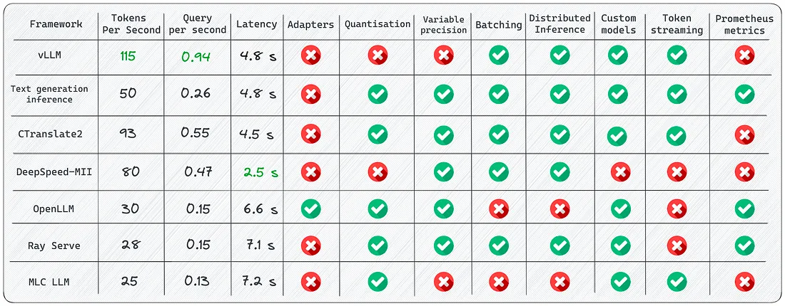
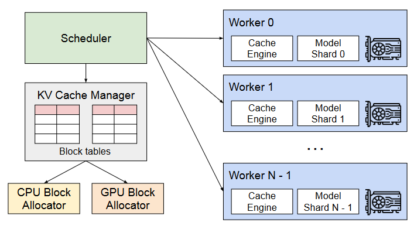
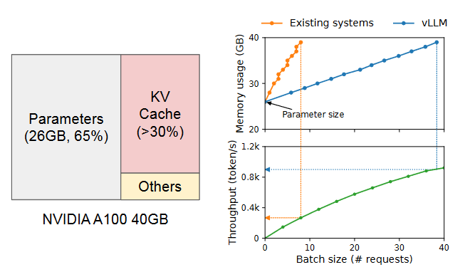
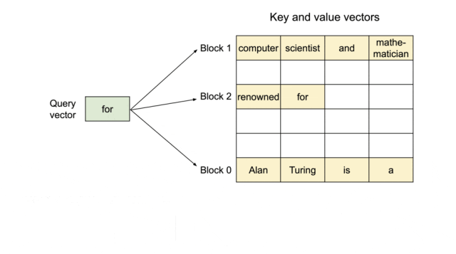
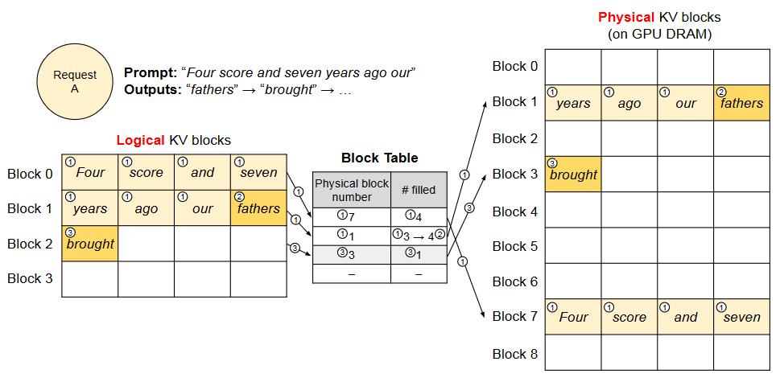
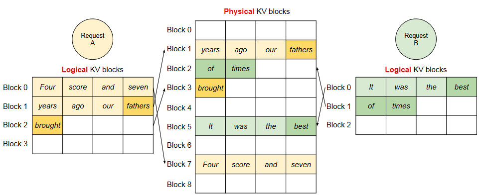

# 推理引擎 / 推理框架 / 推理加速引擎
## 概览


- vllm
    - continus batching，而不是static batching
    - PagedAttention对kv cache的有效管理
- Text Generation Inference (TGI)
    - HuggingFace 推出的一个项目，作为支持 HuggingFace Inference API 和 Hugging Chat 上的LLM 推理的工具，旨在支持大型语言模型的优化推理
    - Continuous batching
    - flash-attention 和 Paged Attention
    - 项目架构：
        - launcher 启动器（下载模型、启动server、启动router）
        - router 和 serve 负责主要的逻辑处理与模型调用
            - router : 是一个webserver 负责接收请求，然后放在 buffer 中，等收集到一定量的数据后，一个 batch 一个 batch 的以 rpc 的方式发送给 server 的去处理
            - server (Python gRPC服务) ： 在每个显卡上都启动了一个 server
- faster transformer (NVIDIA FasterTransformer (FT)) 
    - 是一个用于实现基于Transformer的神经网络推理的加速引擎
    - 英伟达新推出了TensorRT-LLM，相对来说更加易用，后续FasterTransformer将不再为维护了
    - 与 NVIDIA TensorRT 等其他编译器相比，FT 的最大特点是它支持以分布式方式进行 Transformer 大模型推理
    - 在底层，节点间或节点内通信依赖于 MPI 、 NVIDIA NCCL、Gloo等
    - 除了使用 C ++ 作为后端部署，FasterTransformer 还集成了 TensorFlow（使用 TensorFlow op）、PyTorch （使用 Pytorch op）和 Triton 作为后端框架进行部署。当前，TensorFlow op 仅支持单 GPU，而 PyTorch op 和 Triton 后端都支持多 GPU 和多节点
- TensorRT-LLM 英伟达家的
- Triton

## vLLM
vLLM的吞吐量比HuggingFace Transformers（HF）高14x-24倍，比HuggingFace Text Generation Inference（TGI）高2.2x-2.5倍。

### 1.1 使用
1.安装
```
pip install vllm
```
2.安装完成后，运行examples/offline_inference.py即可，命令行运行

3.离线批量推理offline_inference代码

```python
from vllm import LLM, SamplingParams

# Sample prompts
prompts = [
    "Funniest joke ever:",
    "The capital of France is",
    "The future of AI is",
]

# Create a sampling params objec
sampling_params = SamplingParams(temperature=0.95, top_p=0.95, max_tokens=200)

# Create an LLM
llm = LLM(model="huggyllama/llama-13b")

# Generate texts from the prompts. The output is a list of RequestOutput objects
# that contain the prompt, generated text, and other information.
outputs = llm.generate(prompts, sampling_params)

# Print the outputs
for output in outputs:
    prompt = output.prompt
    generated_text = output.outputs[0].text
    print(f"Prompt: {prompt!r}, Generated text: {generated_text!r}")
```

### vLLM架构
vLLM 采用一种集中式调度器（scheduler）来协调分布式 GPU 工作器（worker）的执行。KV 缓存管理器由 PagedAttention 驱动，能以分页方式有效管理 KV 缓存。具体来说，KV 缓存管理器通过集中式调度器发送的指令来管理 GPU 工作器上的物理 KV 缓存内存。



### 1.2 核心优化点

**Continuous batching**

一旦一个batch中的某个seq完成生成，发射了一个end-of-seq token，就可以在其位置插入新的seq继续生成token，从而达到比static batching更高的GPU利用率


**PagedAttention：解决内存瓶颈**

受操作系统中虚拟内存和分页的经典思想启发的注意力算法，这就是模型加速的秘诀。
- PagedAttention是对kv cache所占空间的分页管理
- PagedAttention 允许在非连续的内存空间中存储连续的键和值
- 具体来说，PagedAttention 将每个序列的 KV 缓存划分为块，每个块包含固定数量 token 的键和值（可以将块视为页面，将 token 视为字节，将序列视为进程）
- 通过**块表**将连续逻辑块映射到非连续物理块中
- 在注意力计算期间，PagedAttention 内核可以有效地识别和获取这些块
- 在 PagedAttention 中，**内存浪费只会发生在序列的最后一个块中**。
- PagedAttention 还有另一个关键优势 —— **高效的内存共享**。例如在并行采样中，多个输出序列是由同一个提示（prompt）生成的。在这种情况下，提示的计算和内存可以在输出序列中共享。（同一个输入prompt采样多个输出时，可以共享输入prompt）

KV 缓存有其自己的独特性质：
- 内存占用大
- 动态且不可预测
    - KV 缓存的大小取决于序列长度，这是高度可变和不可预测的
    - 它会在模型生成新 token 的过程中随时间动态地增长，而且它的持续时间和长度是无法事先知晓的



上图（左）展示了一个 130 亿参数的 LLM 在一台 40GB RAM 的英伟达 A100 GPU 上的内存分布
- 65% 的内存都分配给了模型权重
- 30% 的内存是用于存储 KV 缓存
- 其余占比很小的内存则是用于其它数据，包括激活 —— 评估 LLM 时创建的临时张量

**KV 缓存的管理方式就成了决定最大批量大小的关键**。如图（右）所示，如果管理方式很低效，KV 缓存内存就会极大限制批量大小，并由此限制 LLM 的吞吐量。



图示例：其键和值向量分布在三个块上，并且这三个块在物理内存上并不相邻连续。





### 1.3 **优点**

-   **文本生成的速度**\*\*：\*\* 实验多次，发现vLLM的推理速度是最快的；
-   **高吞吐量服务**\*\*：\*\* 支持各种解码算法，比如parallel sampling, beam search等；
-   **与OpenAI API兼容**\*\*：\*\* 如果使用OpenAI API，只需要替换端点的URL即可；

### 1.4 **缺点**

-   **添加自定义模型**：虽然可以合并自己的模型，但如果模型没有使用与vLLM中现有模型类似的架构，则过程会变得更加复杂。例如，增加Falcon的支持，这似乎很有挑战性；
-   **缺乏对适配器（LoRA、QLoRA等）的支持**：当针对特定任务进行微调时，开源LLM具有重要价值。然而，在当前的实现中，没有单独使用模型和适配器权重的选项，这限制了有效利用此类模型的灵活性。
-   **缺少权重量化**：有时，LLM可能不需要使用GPU内存，这对于减少GPU内存消耗至关重要。

这是LLM推理最快的库。得益于其内部优化，它显著优于竞争对手。尽管如此，它在支持有限范围的模型方面确实存在弱点。

**使用vLLM的开发路线可以参考：**[**https://github.com/vllm-project/vllm/issues/244**](https://link.zhihu.com/?target=https%3A//github.com/vllm-project/vllm/issues/244 "https://github.com/vllm-project/vllm/issues/244")

## Text Generation Inference (TGI)
Text generation inference是用于文本生成推断的Rust、Python和gRPC服务器，在HuggingFace中已有LLM 推理API使用。

#### 2.1使用

**使用docker运行web server**

```bash
mkdir data
docker run --gpus all --shm-size 1g -p 8080:80 \
-v data:/data ghcr.io/huggingface/text-generation-inference:0.9 \
  --model-id huggyllama/llama-13b \
  --num-shard 1
```

**查询实例**

```bash
# pip install text-generation
from text_generation import Client

client = Client("http://127.0.0.1:8080")
prompt = "Funniest joke ever:"
print(client.generate(prompt, max_new_tokens=17 temperature=0.95).generated_text)
```

#### 2.2**功能**

-   **内置服务评估**\*\*：\*\* 可以监控服务器负载并深入了解其性能；
-   **使用flash attention（和v2）和Paged attention优化transformer推理代码**\*\*：\*\* 并非所有模型都内置了对这些优化的支持，该技术可以对未使用该技术的模型可以进行优化；

#### 2.3 **优点**

-   **所有的依赖项都安装在Docker中**\*\*：\*\* 会得到一个现成的环境；
-   **支持HuggingFace模型**\*\*：\*\* 轻松运行自己的模型或使用任何HuggingFace模型中心；
-   **对模型推理的控制**：该框架提供了一系列管理模型推理的选项，包括精度调整、量化、张量并行性、重复惩罚等；

#### 2.4**缺点**

-   **缺乏对适配器的支持**\*\*：\*\* 需要注意的是，尽管可以使用适配器部署LLM（可以参考[https://www.youtube.com/watch?v=HI3cYN0c9ZU](https://link.zhihu.com/?target=https%3A//www.youtube.com/watch%3Fv%3DHI3cYN0c9ZU "https://www.youtube.com/watch?v=HI3cYN0c9ZU")），但目前还没有官方支持或文档；
-   **从源代码（Rust+CUDA内核）编译**\*\*：\*\* 对于不熟悉Rust的人，将客户化代码纳入库中变得很有挑战性；
-   **文档不完整**：所有信息都可以在项目的自述文件中找到。尽管它涵盖了基础知识，但必须在问题或源代码中搜索更多细节；

**使用Text generation inference的开发路线可以参考：**[**https://github.com/huggingface/text-generation-inference/issues/232**](https://link.zhihu.com/?target=https%3A//github.com/huggingface/text-generation-inference/issues/232 "https://github.com/huggingface/text-generation-inference/issues/232")

## Reference
- https://blog.vllm.ai/2023/06/20/vllm.html
- https://www.eula.club/blogs/%E5%9F%BA%E4%BA%8EvLLM%E5%8A%A0%E9%80%9F%E5%A4%A7%E6%A8%A1%E5%9E%8B%E6%8E%A8%E7%90%86%E5%B9%B6%E8%AF%84%E4%BC%B0%E6%80%A7%E8%83%BD.html