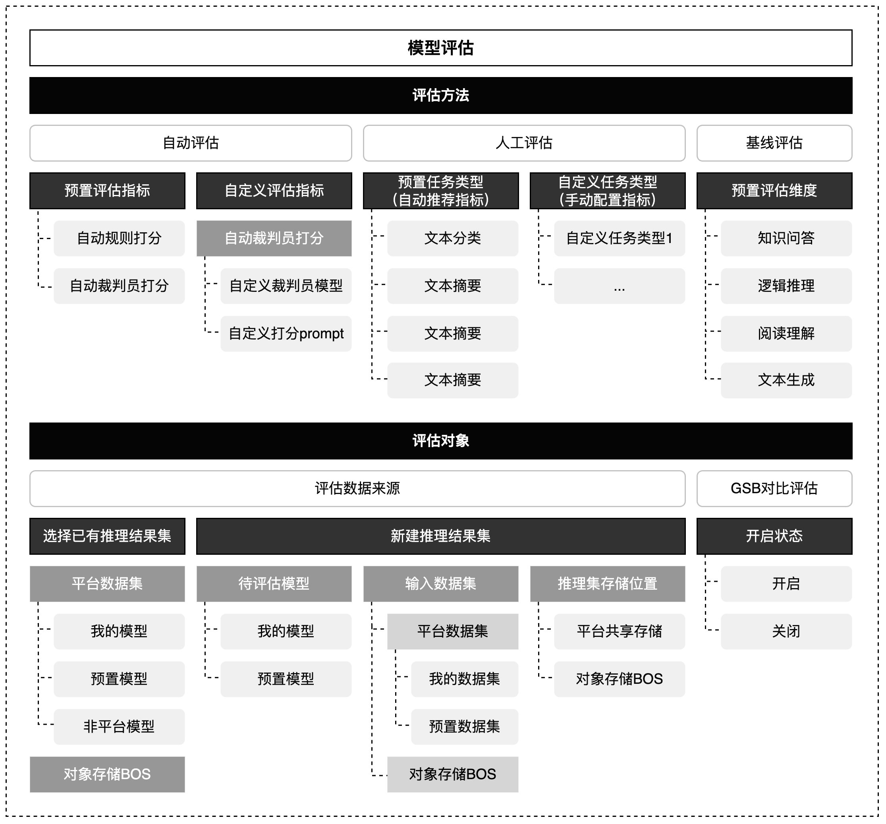
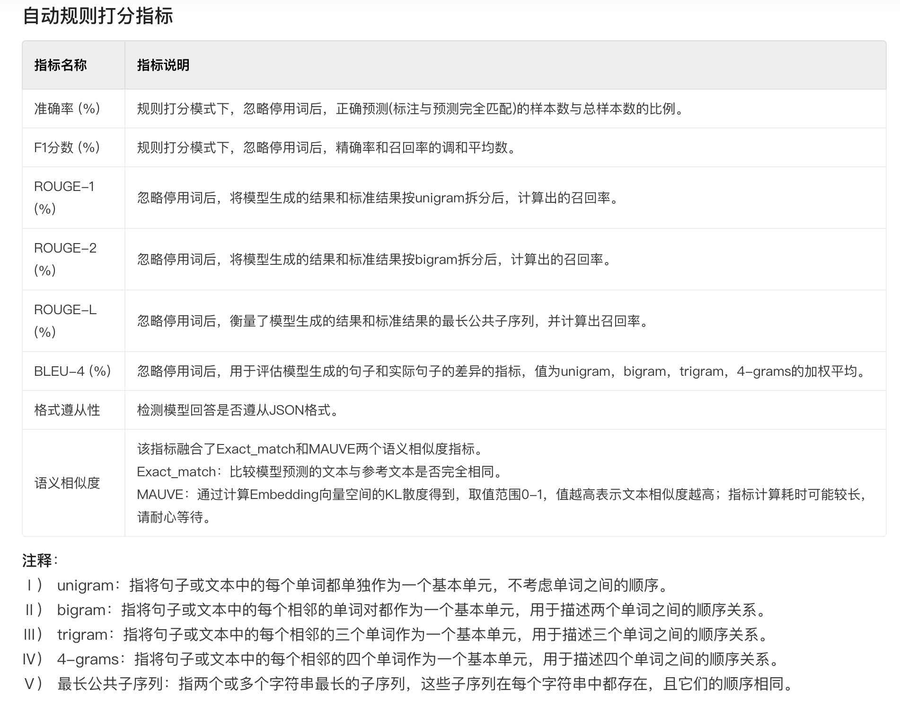

# LLM 评估 与 常见问题
## 模型评估
- Automated benchmarks 自动评测/自动规则打分
    - 使用精选数据集和指标（如 MMLU）评估特定任务上的模型。它非常适合具体任务，但抽象和创造能力较差。它也容易受到数据污染
    - 使用预置的相似度或准确率打分规则对比模型生成结果与真实标注的差异，从而计算模型指标
- Model-based evaluation 模型评测/自动裁判员打分
    - 使用判断和奖励模型来评估模型输出。它与人类偏好高度相关，但受到对其自身输出的偏见和不一致的评分的影响
    - 使用能力更强的大模型作为裁判员，对被评估模型的生成结果进行自动化打分，适用于开放性或复杂问答场景。
    - 提供以下自动裁判员指标：事实性错误、情感倾向性和语义连贯性。
    - 允许您自定义打分Prompt，设置自定义评估指标
- Human evaluation 人工评测
    - 它涉及人工提示模型并对响应进行评分。方法包括从氛围检查到具有特定指导方针的系统注释和大规模社区投票（竞技场）。它更适合主观任务，但事实准确性较不可靠
    - 人工评估可综合人类专家的主观见解、经验等从不同评价维度对模型回复进行打分，用于评估模型回复的效果
    - GSB对比评估（两两对比或多个模型对比）
    - 人工打分规则配置（配置多个维度，人工从多个方面多个维度进行打分）
- Feedback signal : 分析错误模式以识别特定弱点，例如遵循复杂指令的局限性、缺乏特定知识或易受对抗性提示的影响。这可以通过更好的数据生成和训练参数来改进

### 评估数据集 就是 测试集
在人工智能模型开发过程中，通常是将数据集划分为训练集、验证集和测试集三个部分。其中，训练集用来训练模型，验证集则用于调整模型的超参数和选择合适的模型，而测试集则是在模型训练完成后，用于最终评估模型的性能，这就是评估数据集（即测试集）。

通过对评估数据集的评估，可以了解模型在不同场景下的表现，从而更好地优化模型。同时，评估数据集还可以用来验证模型的泛化能力，即模型在未见过的数据上的表现如何。

### 人工评测 ———— GSB对比评估
支持对两个模型进行效果好坏的对比或者对同一模型在不同prompt/参数配置下的效果好坏对比。 评估时可选择Good、Same、Bad三个选项。Good表示：基准模型比对比模型好；Same表示：基准模型和对比模型一样好或一样差；Bad表示：基准模型比对比模型差。

### 基线评测
基线评测需要使用固定数据集，所以仅对模型开放，已有推理结果集不支持基线评估。当前预置了知识问答、逻辑推理、阅读理解、文本生成四种能力的基线评估数据集，开启基线评测后展示。

评估维度
- 知识问答	
    - 对模型在常识性问题、垂类专业知识回答能力综合打分
    - 知识问答评估维度主要侧重于模型的阅读理解和知识储备能力。将通过设定一系列知识问答题目，观察模型是否能够准确理解用户的问题，并运用模型知识进行正确的回答。
- 逻辑推理	
    - 对模型在数据推理、上下文对话逻辑推理能力综合打分
    - 逻辑推理评估维度将检验大模型的逻辑推理能力。这将包括对模型的推理深度、逻辑连贯性进行评估，考核模型在面对复杂问题时的解决策略和能力。
- 阅读理解	
    - 对模型在不同长度的文本阅读理解、代码能力做综合打分
    - 阅读理解评估维度考察模型对文本内容的理解和解析能力，这包括对文本的场景理解、隐含意图、以及情感倾向的识别。考核模型理解和解析复杂文本信息的能力。
- 文本生成	
    - 对模型在文本生成、文本创作质量及创意程度综合打分
    - 在文本生成能力的评估中，我们将观察大模型是否能够根据给定的输入生成语义连贯、自然、符合题材或语法规则的文本，考核模型是否具备深入理解语言结构和规则的能力，同时也考察模型是否具有创新性和趣味性，以生成吸引人的内容。

## 常见问题一：LLM 幻觉
- 幻觉指的是一本正经的胡说八道：看似流畅自然的表述，实则不符合事实或者是错误的
- 幻觉影响了模型的可靠性和可信度，因此需要解决LLM的幻觉问题
- 幻觉不一定是有害的，特别是在一些需要创造力或灵感的场合，对幻觉的容忍度取决于具体的应用场景
- 幻觉分类
    - 事实性问题（Factuality）
        - 事实性错误：模型回答与事实不一致
        - 事实性虚构：模型回答在真实世界无法考证
    - 忠诚度问题（Faithfulness）
        - 违背指令：模型回答没有遵从指令
        - 违背上文：模型回答和上下文内容存在不一致
    - 自我矛盾（self-Contradiction）
        - 模型回答内部问题存在逻辑矛盾，比如COT多步推理之间存在矛盾。
- 为什么LLM会产生幻觉
    - 训练数据的重复性
    - 数据噪声的影响
    - 解码过程中的随机性
    - 训练与实际应用中的解码差异
- 什么时候最容易产生幻觉
    - 错误的上下文信息
    - 上下文与内置知识的冲突
    - 处理长文本
    - 处理数值
    - 逻辑推断障碍
- 如何度量幻觉
    - 人工评估：成本高
    - 自动评估
        - 命名实体误差 （命名实体是否存在）
        - 蕴含率 （句子数量占比）
    - 模型评估
    - 问答系统
    - 利用信息提取系统
- 如何缓解幻觉
    - 创建高质量无噪声的数据集
    - 利用外部知识验证正确性 RAG
    - 采样多个输出并检查其一致性
    - 修改解码策略

## 常见问题二：LLM 重复 / LLM 复读机问题
### 出现重复的原因
- 数据偏差
    - 如果训练数据中存在大量的重复文本或者某些特定的句子或短语出现频率较高，模型在生成文本时可能会倾向于复制这些常见的模式
- 缺乏多样性的训练数据
    - 如果训练数据中缺乏多样性的语言表达和语境，模型可能无法学习到足够的多样性和创造性，导致复读机问题的出现
- 训练目标的限制
    - 预测下一个词这样的训练目标可能使得模型更倾向于生成与输入相似的文本，导致复读机问题的出现

### 如何缓解问题
- 多样性训练数据
    - 使用多样性的语料库来训练模型，避免数据偏差和重复文本的问题。这可以包括从不同领域、不同来源和不同风格的文本中获取数据。
- 温度参数调整
    - 温度参数是用来控制生成文本的多样性的一个参数。通过调整温度参数的值，可以控制生成文本的独创性和多样性。较高的温度值会增加随机性，从而减少复读机问题的出现。
- Beam搜索调整：
    - 在生成文本时，可以调整Beam搜索算法的参数。Beam搜索是一种常用的生成策略，它在生成过程中维护了一个候选序列的集合。通过调整Beam大小和搜索宽度，可以控制生成文本的多样性和创造性。
- 后处理和过滤
    - 对生成的文本进行后处理和过滤，去除重复的句子或短语，以提高生成文本的质量和多样性。可以使用文本相似度计算方法或规则来检测和去除重复的文本。

## 常见问题三：为什么SFT之后感觉LLM傻了?

性能下降或产生一些“傻”的行为可能的原因
- 过拟合
    - 如果微调数据集相对较小，或者模型的容量（参数数量）较大，模型可能会过拟合微调数据，导致在新的输入上表现不佳。过拟合可能导致模型过于依赖微调数据的特定样本，而无法泛化到更广泛的输入。
- 缺乏多样性
    - 微调数据集可能缺乏多样性，未能涵盖模型在新任务上可能遇到的各种输入情况。这可能导致模型在面对新的、与微调数据集不同的输入时出现困惑或错误的预测。

可尝试的方法
- 调整模型的超参数，以提高模型的性能和泛化能力
- 对于过拟合
    - 使用正则化技术（如权重衰减、dropout）来减少过拟合的风险
- 对于缺乏多样性
    - 收集更多的训练数据，以增加数据的多样性和覆盖范围
    - 进行数据增强，通过对微调数据进行一些变换或扩充来增加多样性

## 常见问题四：灾难性遗忘
灾难性遗忘（Catastrophic Forgetting）是指在模型微调过程中，**当模型在新任务上进行训练时，可能会忘记之前学习到的知识，导致在旧任务上的性能下降**。这种现象常见于神经网络模型的迁移学习或连续学习场景中。

在微调大语言模型时，灾难性遗忘可能出现的原因包括：

1.  **数据分布差异**：微调过程中使用的新任务数据与预训练数据或旧任务数据的分布存在差异。如果新任务的数据分布与预训练数据差异较大，模型可能会过度调整以适应新任务，导致旧任务上的性能下降。
2.  **参数更新冲突**：微调过程中，对新任务进行训练时，模型参数可能会被更新，导致之前学习到的知识被覆盖或丢失。新任务的梯度更新可能会与旧任务的梯度更新发生冲突，导致旧任务的知识被遗忘。

为了解决灾难性遗忘问题，可以尝试以下方法：

1.  **经验回放（Replay Buffer）**：在微调过程中，使用一个缓冲区来存储旧任务的样本，然后将旧任务的样本与新任务的样本一起用于训练。这样可以保留旧任务的知识，减少灾难性遗忘的发生。
2.  **弹性权重共享（Elastic Weight Consolidation）**：通过引入正则化项，限制模型参数的变动范围，以保护之前学习到的知识。这种方法可以在微调过程中平衡新任务和旧任务之间的重要性。
3.  **保留通用数据**：在进行领域数据训练时，仍然需要保留一部分通用数据用于模型训练。这样可以确保模型仍然能够学习到通用的语言和知识，从而保持一定的通用能力。
4.  **增量学习**：使用增量学习（Incremental Learning）的方法，将领域数据与通用数据逐步交替进行训练。这样可以在学习新领域的同时，保持对通用知识的记忆。
5.  **多任务学习（Multi-Task Learning）**：在微调过程中，同时训练多个相关任务，以提高模型的泛化能力和抗遗忘能力。通过共享模型参数，可以在不同任务之间传递知识，减少灾难性遗忘的影响。
6.  **预训练和微调**：在领域数据训练之前，可以使用大规模通用数据进行预训练，获得一个通用的基础模型。然后，在领域数据上进行微调，以适应特定领域的任务。这样可以在保留通用能力的同时，提升领域任务的性能。
7.  **强化学习**：使用强化学习的方法，通过给模型设置奖励机制，鼓励模型在领域任务上表现好，同时保持一定的通用能力。
8.  **领域适应技术**：使用领域适应技术，如领域自适应（Domain Adaptation）和领域对抗训练（Domain Adversarial Training），帮助模型在不同领域之间进行迁移学习，从而减少遗忘通用能力的问题。
9.  **数据重采样**：在进行领域数据训练时，可以使用数据重采样的方法，使得模型在训练过程中能够更多地接触到通用数据，从而缓解遗忘通用能力的问题。

## 常见问题四：领域模型词表扩增是不是有必要的？

领域模型的词表扩增可以有助于提升模型在特定领域任务上的性能，但是否有必要取决于具体的情况。以下是一些考虑因素：

1.  **领域特定词汇**：如果目标领域中存在一些特定的词汇或术语，而这些词汇在通用的预训练模型的词表中没有覆盖到，那么词表扩增就是必要的。通过将这些领域特定的词汇添加到模型的词表中，可以使模型更好地理解和处理这些特定的词汇。
2.  **领域特定上下文**：在某些领域任务中，词汇的含义可能会受到特定上下文的影响。例如，在医学领域中，同一个词汇在不同的上下文中可能具有不同的含义。如果领域任务中的上下文与通用预训练模型的训练数据中的上下文有较大差异，那么词表扩增可以帮助模型更好地理解和处理领域特定的上下文。
3.  **数据稀缺性**：如果目标领域的训练数据相对较少，而通用预训练模型的词表较大，那么词表扩增可以帮助模型更好地利用预训练模型的知识，并提升在目标领域任务上的性能。

需要注意的是，词表扩增可能会增加模型的计算和存储成本。因此，在决定是否进行词表扩增时，需要综合考虑领域特定词汇的重要性、数据稀缺性以及计算资源的限制等因素。有时候，简单的词表截断或者使用基于规则的方法来处理领域特定词汇也可以取得不错的效果。最佳的词表扩增策略会因特定任务和领域的需求而有所不同，建议根据具体情况进行评估和实验。
