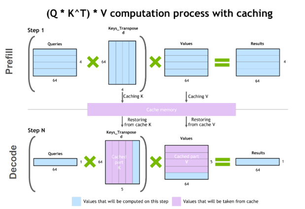
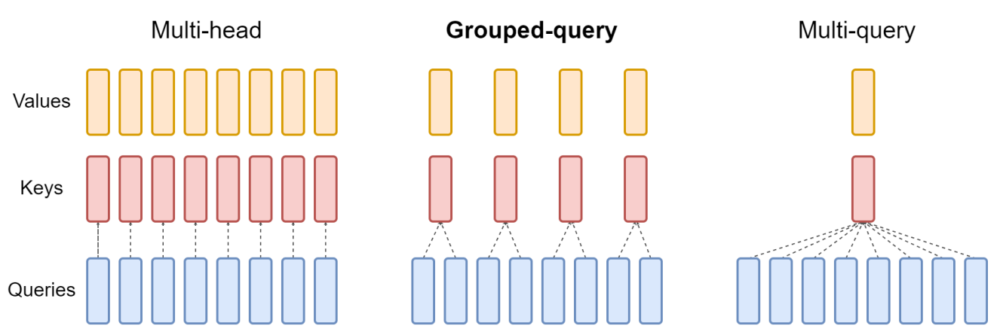

# 优化技术
## 1. 优化技术概览

优化点都是从时间和空间两方面来考虑

- 全过程优化
    - 注意力优化（计算优化）
        - KV Cache：缓存KV，避免重复计算
        - MQA 多查询注意力：KV共享
        - GQA 分组查询注意力：分组KV共享
        - Flash Attention V1、V2
        - PagedAttention
    - 批次管理优化
        - 动态批处理 / 连续批处理 /continus batching / In-flight batching 
    - 分布式/并行化
        - 将模型分布在多个 GPU 上
        - 在多 GPU/节点 上分担计算和存储压力
    - 量化/混合精度
        - 将模型参数从高精度转换为低精度，在不显著影响效果的前提下降低计算负担
    - 剪枝/稀疏化Sparsity/正则化技术
        - 移除不重要的权重或神经元，减少参数数量
        - 正则化技术：dropout & L1 & L2
    - 早退机制 / 提前停止
- 训练优化
    - 解决的问题
        - 适配到已有的GPU资源，使模型可在资源受限情况下训练（空间）
        - 加速训练收敛，降低训练时间，提速（时间）
        - 稳定训练过程，防止梯度爆炸和梯度消失
        - 高吞吐量，提高资源利用率，减少浪费
    - 主要技术和方法
        - 激活值重新计算
        - 梯度累积
        - 超参数调整
            - 动态学习率调整：使用调整超参数的现代优化器（AdamW、Lion），使用余弦退火、衰减、预热 warm-up策略，帮助模型更快收敛或改善稳定性
            - 批大小的选择
        - 通用优化
            - 注意力优化
            - 批次管理优化
            - 分布式/并行化
            - 混合精度训练
            - 剪枝/正则化技术：dropout & L1 & L2
            - 早退机制/提前停止
                - 在验证损失不再改善时停止训练，节省计算资源
- 推理优化
    - 解决的问题
            - 减少模型大小、内存占用和计算需求，使模型可部署在资源受限设备（如移动设备）（空间）
            - 降低推理时间，提速，确保低延迟，优化用户体验（时间）
            - 高吞吐量，提高资源利用率，减少浪费
    - 主要技术和方法
        - 训练后模型压缩优化
            - 量化 Quantization / 混合精度
                - 降低模型权重和激活值的精度（如从32位浮点数到8位整数），减少内存占用和计算成本
            - 剪枝 / 稀疏 Sparsity / 正则化技术
                - 移除不重要的权重或神经元，减少参数数量，降低推理时间
            - 蒸馏 Distillation / 知识蒸馏
                - 训练较小模型以模仿较大模型的行为，保留大部分性能，同时显著减少模型大小
        - 解码策略优化
            - 推测解码（Speculative Decoding）
                - 生成草稿token序列，并行验证保留可采纳的多个token，加速自回归解码
            - 非自回归解码（Non-autoregressive Decoding）
                - 一次生成多个token，减少序列依赖，提升速度
            - 早退机制（Early Exiting）
                - 在满足条件时提前结束推理，节省计算
            - 级联解码（Cascade Inference）
                - 把多个模型按效率排序（越往后的模型越大生成质量越高），依次进行生成，直到符合想要的质量后停止
        - 通用优化
            - 注意力优化
            - 批次管理优化
            - 混合精度推理
            - 分布式/并行化
            - 剪枝
            - 早退

## 2. 注意力机制优化
- 传统
    - 缩放点积注意力 SDPA， scaled dot-product attention
    - 多头注意力 MHA，multi-head attention
        - 当使用八个并行注意力头时，每个注意力头的维度都会减少（例如 d_model/8）。这使得计算成本与单头注意力相似
- kv cache （用空间换时间）: 
    - 解码的时候为了减少冗余计算KV值，所以将之间计算出的KV缓存了下来
    - 缓存KV后，每次只需要计算一个token的KV值
    - 存在的问题：内存需求随着批量大小和序列长度线性增长，限制了可服务的吞吐量，并对长上下文输入提出了挑战
- MQA 和 GQA 等优化通过减少存储的key头和value头的数量来帮助减少 KV 缓存所需的内存
    - MQA 多查询注意力
        - 在多个注意力头之间共享键和值
    - GQA 分组查询注意力
        - 最初使用 MHA 训练的模型可以使用原始训练计算的一小部分通过 GQA 进行“升级训练”。它们获得接近 MHA 的质量，同时保持接近 MQA 的计算效率。
- Flash Attention V1、V2
    - 修改某些计算的顺序，以更好地利用 GPU 的内存层次结构
    - 优化注意力机制，将其复杂度从二次方转化为线性，从而加快训练和推理速度
    - FlashAttention 使用“平铺”一次性完全计算并写出最终矩阵的一小部分，而不是分步对整个矩阵进行部分计算，写出中间的中间值。
- PagedAttention 
    - KV缓存的分页高效管理
    - 将连续的键和值存储在内存中的不连续空间中
    - 这些块的大小是固定的，消除了因不同请求需要不同分配等挑战而产生的低效率。这极大地限制了内存浪费，从而实现了更大的批量大小（从而提高了吞吐量）

下图显示多头注意力有多个键值头（左）。分组查询注意力（中心）的键值头多于一个，但少于查询头的数量，这是内存需求和模型质量之间的平衡。多查询注意力（右）具有单个键值头，有助于节省内存。

## 3. 动态批处理 / 连续批处理 /continus batching / In-flight batching 
- 同时执行多个不同的请求
- 传统批处理/static batching：对于批次中的每个请求，LLM 可能会生成不同数量的tokens，并且不同tokens有不同的执行时间。因此，批次中的所有请求都必须等待最长token的处理完成，而生成长度的巨大差异可能会加剧这种情况
- 通过动态批处理，服务器运行时会立即从批处理中剔除已完成的序列，而不是等待整个批处理完成后再继续处理下一组请求。然后，它开始执行新请求，而其他请求仍在进行中。因此，动态批处理可以极大地提高实际用例中 GPU 的整体利用率。
