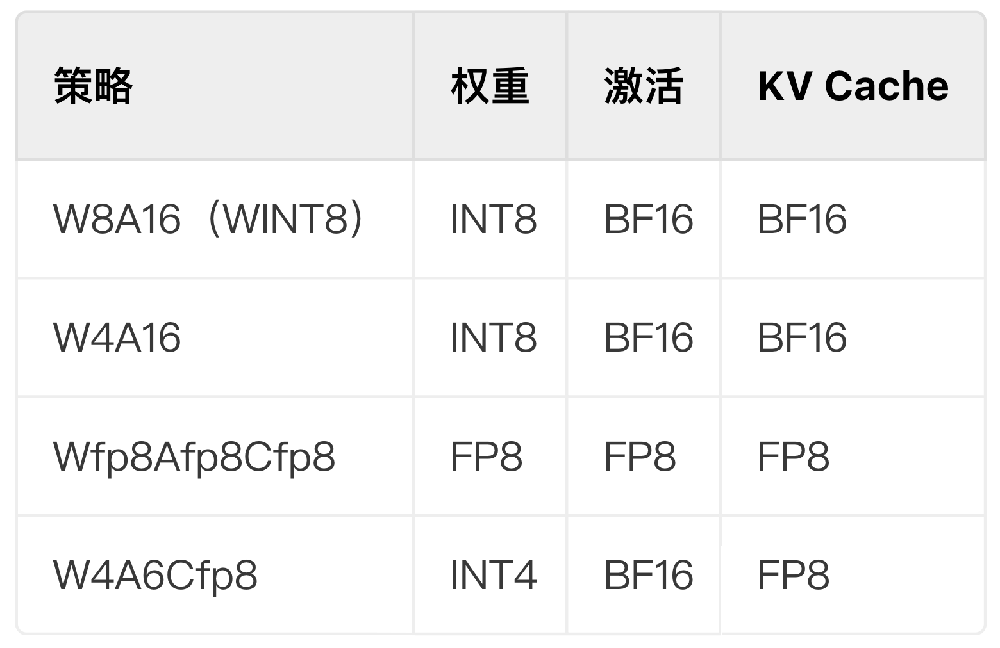

# 低资源部署策略/模型压缩技术 (修改模型权重本身来减少每个 GPU 上的内存使用)
## 1. 模型量化 / Quantization / 混合精度
降低模型的精度可以带来多种好处。如果模型占用的内存空间较少，则可以在相同数量的硬件上安运行更大的模型。量化还意味着可以在相同的带宽上传输更多参数，这有助于加速带宽有限的模型。

### 量化压缩策略
模型压缩过程后，高比特浮点数会映射到低比特量化空间，从而达到降低显存占用、提升推理性能等目的。

量化方法：开源模型量化主要使用GPTQ、Simple PTQ。

精度说明：未压缩前的精度都是BF16；压缩后精度默认为INT；FP精度特殊标识。

WxAxCx中W、A、C分别代表模型权重（weight）、激活（activation）和键值缓存（kv cache），数字x代表模型压缩后相应部分的比特数。

## 2. 模型剪枝 / 稀疏 Sparsity / 正则化
与模型量化不同，模型蒸馏和模型剪枝则通过精简模型的结构，进而减少参数的数量。

## 3. 模型蒸馏 / Distillation
与模型量化不同，模型蒸馏和模型剪枝则通过精简模型的结构，进而减少参数的数量。

缩小模型大小的另一种方法是通过称为蒸馏的过程将其知识转移到较小的模型。此过程涉及训练较小的模型（称为学生）来模仿较大模型（教师）的行为

模型蒸馏通过调用教师模型产生问答对，再通过精调得到成本更低、特定任务效果更好的学生模型。

- 第一步：构建蒸馏数据
- 第二步：训练学生模型
- 第三步：发布蒸馏模型

训练方式
- 全量更新
- LoRA