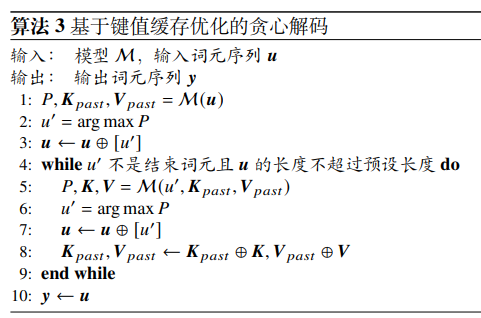
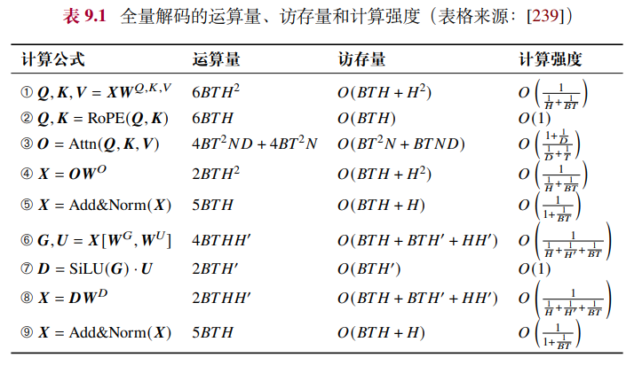
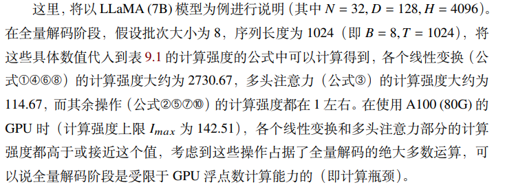
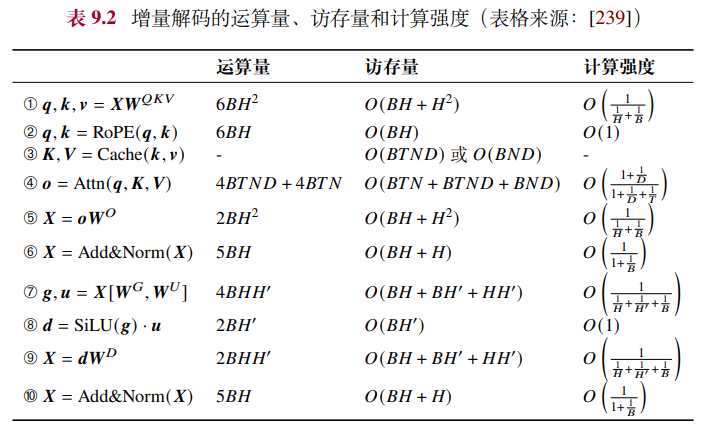
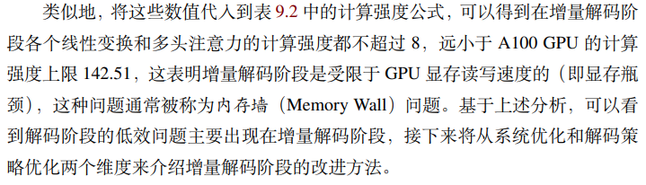
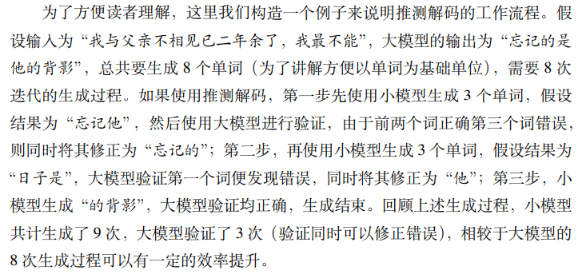
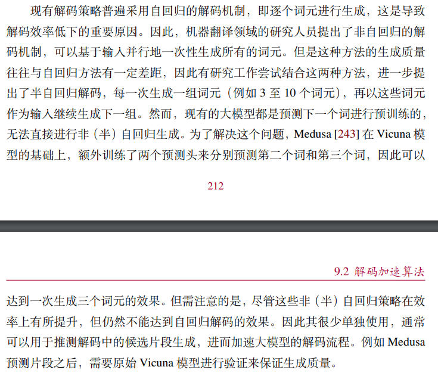
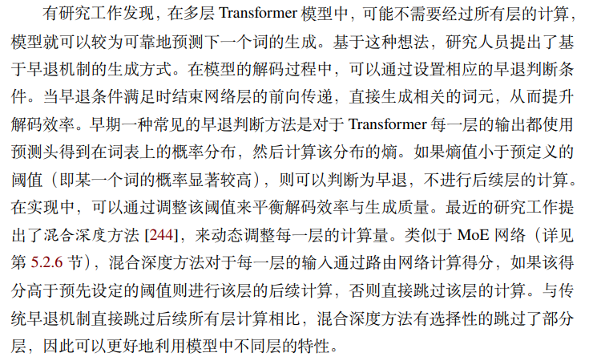
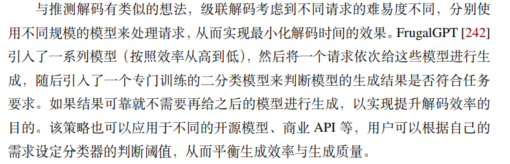

# 解码加速算法
## 1. 解码效率的定量评估指标
- GPU性能评估
    - GPU算力 : 算力是指 GPU 每秒能够进行的浮点运算次数，单位是 FLOP/s
    - GPU带宽 : 带宽是该显卡每秒能够进行的显存读写量，单位是 byte/s
    - GPU计算强度上限 : 算力和带宽的比值被称为该 GPU 的计算强度上限 𝐼𝑚𝑎𝑥，单位为 FLOP/byte
- 模型性能评估
    - 模型的运算量 : 运算量是指运行该模型需要的总浮点计算数，单位为 FLOP
    - 模型的访存量 : 访存量是运行该模型的过程中所需的显存读写量，单位为 byte
    - 模型的计算强度 : 运算量和访存量的比值被称为该模型的计算强度 𝐼，单位为 FLOP/byte
- 带宽瓶颈和计算瓶颈
    - 带宽瓶颈 / 显存瓶颈
        - 当模型的计算强度 𝐼 小于GPU 的计算强度上限 𝐼𝑚𝑎𝑥 时，这说明 GPU 的理论最高显存读写速度低于实际运算所需速度，因此模型实际的运行效率将主要受到显存读写速度的影响，这种情况称为带宽瓶颈；
    - 反之，当 𝐼 大于 𝐼𝑚𝑎𝑥 时，说明 GPU 的理论最高浮点运算速度低于实际运算所需速度，因此模型的运行效率将主要受到算力的影响，这种情况称为计算瓶颈。

## 2. 自回归生成算法
由于自回归算法的序列化生成特点，使得解码算法存在效率较低的问题。

## 3. 全量解码阶段与增量解码阶段
### 3.1. 全量解码阶段（第一次）- 计算瓶颈
对于输入序列，一次性地计算其状态并缓存键值矩阵
（算法 3 第 1 至 3 行）

以 LLaMA 模型为例，全量解码的运算量、访存量和计算强度：

全量解码阶段是受限于 GPU 浮点数计算能力（即计算瓶颈）

### 3.2. 增量解码阶段（之后多次）- 带宽瓶颈/显存瓶颈
只计算上一步新生成词元的状态，并不断地以自回归方式生成新词元并对应更新键值缓存，直到生成结束（算法 3 第 4-9 行）

**解码阶段的低效问题主要出现在增量解码阶段，存在显存瓶颈**

以 LLaMA 模型为例，增量解码的运算量、访存量和计算强度

增量解码阶段是受限于 GPU 显存读写速度的（即显存瓶颈），这种问题通常被称为内存墙（Memory Wall）问题

## 4. 增量解码阶段（显存瓶颈）的改进方法
### 4.1. 系统优化（直接解决系统级别的内存墙问题）
针对“内存墙”问题，一个直观的解决方案是减少相关操作的访存量，从而达到提升计算强度的目的。

优化方法
- FlashAttention
- PagedAttention
- 批次管理优化

### 4.2. 解码策略优化（针对自回归解码策略的改进方法）
#### 4.2.1. 推测解码（Speculative Decoding）
推测解码不会降低大模型解码的质量，
实验测试表明能够带来约两倍左右的解码加速，是目前使用较多的解码策略优化方案。

#### 4.2.2. 非自回归解码（Non-autoregressive Decoding）

#### 4.2.3. 早退机制（Early Exiting）
可能不需要经过所有层的计算，模型就可以较为可靠地预测下一个词的生成。基于这种想法，研究人员提出了基于早退机制的生成方式。

#### 4.2.4. 级联解码（Cascade Inference）
多个模型按效率从高到低排序，将请求依次给排好序的模型，引入一个专门训练的二分类模型来判断生成结果是否符合任务要求，如果结果可靠则结束

