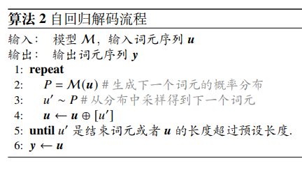
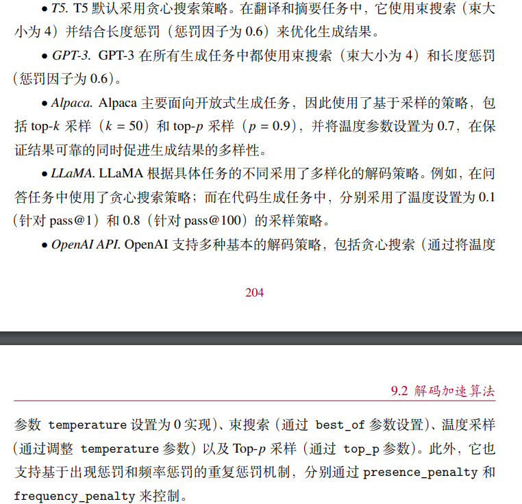
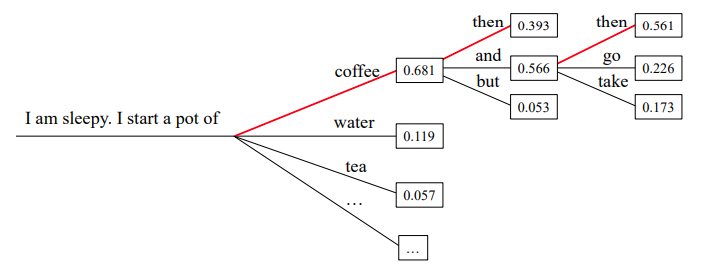
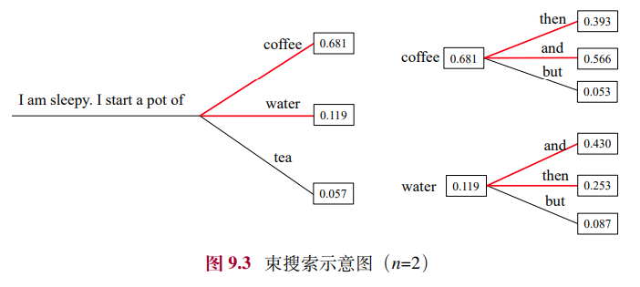
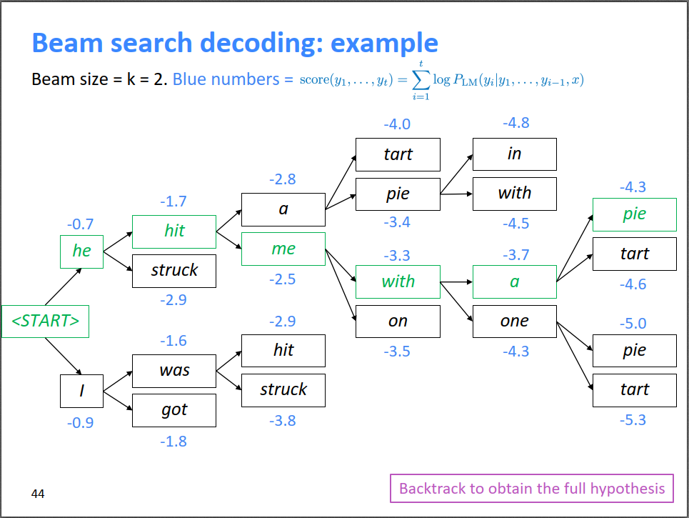
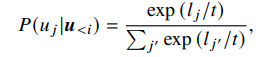
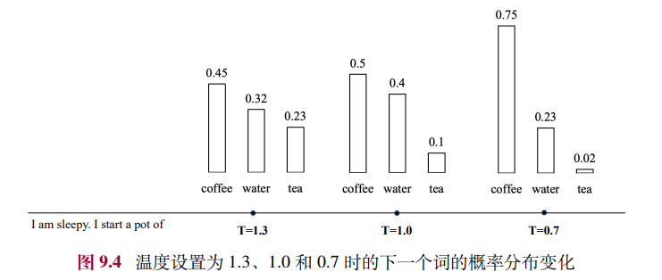
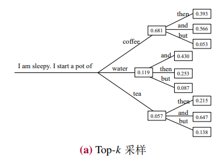
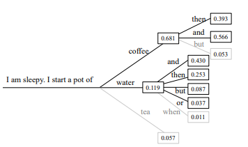
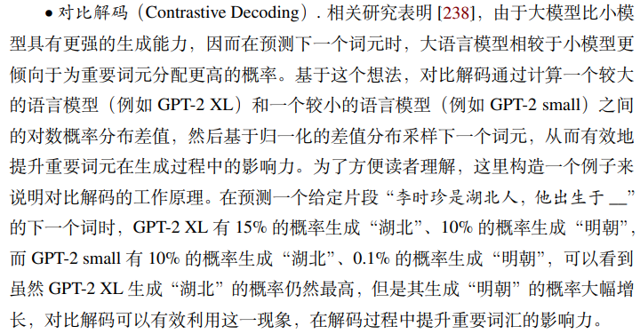

# 解码策略
## 1. 解码的定义
在自回归架构中，模型针对输入内容逐个单词生成输出内容，这个过程一般被称为解码。

在这个过程中，解码策略主要关注如何基于概率分布选择合适的下一个词

大语言模型的生成方式本质是一个概率采样过程，需要合适的解码策略来生成合适的输出内容。

## 2. 代表性LLM的解码设置

## 3. 常见解码策略
### 3.1. 贪心搜索（Greedy Search）
选概率最高的token（确定性）

效果在不同类型的任务中具有一定的差异。
- 在机器翻译和文本摘要等任务中，任务输出高度依赖于输入内容，贪心搜索通常能够获得不错的结果，
- 但是在开放式生成任务（如故事生成和对话系统）中，贪心搜索有时会因为过于关注局部最优，而生成不自然、重复的句子

#### 3.1.1. 贪心搜索的改进策略
##### 3.1.1.1. 束搜索（Beam Search）
一般不采用贪心搜索，而采用此

保留前n个最高概率的token, 并最终选取整体概率最高的作为输出内容，这里的n被称为束大小（Beam Size）。

当 𝑛 = 1，束搜索就退化为贪心搜索

如n=2时，每步选择概率最高的2个token，生成结束后选择整体生成概率最高的候选句子作为最后的输出。

在实践中，束的数量通常设定在 3 到 6 的范围内，设置过大的束会显著增加运算开销，并可能会导致性能下降

每一步都多选几个可能的序列作为候选，最后综合考虑，选出最优组合

Beam search作为一种剪枝策略，并不能保证得到全局最优解，但它能以较大的概率得到全局最优解，同时相比于穷举搜索极大的提高了搜索效率。

当beam search结束时，需要从n条完全路径中选一个打分最高的路径作为最终结果。

##### 3.1.1.2. 长度惩罚/长度归一化（Length Penalty）
由于束搜索中需要比较不同长度候选句子的概率，如果没有长度惩罚，传统的束搜索会倾向于生成较短的句子，因为每生成一个单词，都会乘以一个小于 1的概率，使得句子的生成概率逐渐变小。

因此，可以在生成概率的计算中引入长度惩罚，通过将句子概率除以其长度的指数幂 𝛼，对于句子概率进行归一化处理，从而鼓励模型生成更长的句子。

在实践中，𝛼 通常设置为 0.6 到 0.7 之间的数值。

##### 3.1.1.3. 重复惩罚
为了缓解贪心搜索重复生成的问题，这些重复惩罚方法不止适用于贪心搜索，对于随机采样也均适用。

类型
- n-gram Penalty（n-元惩罚）
    - 强制避免生成重复的连续 𝑛 个词元，实践中 𝑛 通常设置为 3 到 5 之间的整数
    - “一刀切”地完全避免某些短语的生成
- Presence Penalty（出现惩罚）
    - 是否出现
    - 出现惩罚在生成过程中会将已经生成词元的 logits 减去惩罚项 𝛼 来降低该词元之后生成的概率
    - 在实践中，𝛼 的取值范围通常在 0.1 到 1 之间。
    - 相对“温和”，而不是“一刀切”地完全避免某些短语的生成
- Frequency Penalty（频率惩罚）
    - 出现了几次
    - 频率惩罚会记录每个词元生成的数目，然后减去出现次数乘以惩罚项 𝛼，因此如果一个词元生成得越多，惩罚也就越大
    - 在实践中，𝛼 的取值范围通常在 0.1 到 1 之间。
    - 相对“温和”，而不是“一刀切”地完全避免某些短语的生成

### 3.2. 概率采样/随机采样（Probability Sampling）
概率分布采样（随机性和多样性）

基于采样的策略为选择除最高概率的其他词留有一定的可能性，从而增加了生成文本的多样性和随机性。

#### 3.2.1. 概率采样的改进策略
##### 3.2.1.1. Temperature 采样（Temperature Sampling）
调节softmax函数中的温度系数
    

其中，l表示每个候选词元的logit, t是温度系数

温度系数的大小对采样结果的影响：降低温度系数t会使得概率分布更加集中，从而增加了高概率词元的采样可能性，同时降低了低概率词元的采样可能
- 而当 𝑡 趋近于 0 时，实际上等同于贪心搜索，即总是选择概率最高的词
- 当温度系数 𝑡 设置为 1 时，该公式退化为标准的随机采样方法
- 当 𝑡 趋近于无穷大时，温度采样会退化为均匀采样

##### 3.2.1.2. Top-k 采样（Top-k Sampling）
直接剔除概率较低的词元，限制模型从概率最高的前 𝑘 个token中进行采样

k=3，即从前3个概率最高的token中进行采样

##### 3.2.1.3. Top-p 采样 / 核采样（Top-p Sampling / Nucleus Sampling）
累积概率小于或等于阈值p的前几个token中进行采样

具体实现：按照概率将token从高到低排序，不断将token添加到可选集合中，直到可选集合累积概率首次超过阈值p

p=0.8，即从累积概率小于等于0.8的前几个高概率的token中进行采样

##### 3.2.1.4. 对比解码（Contrastive Decoding）

