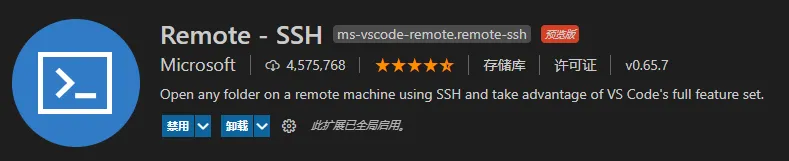
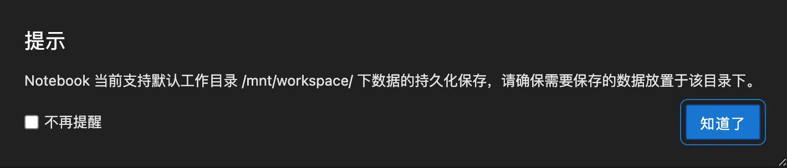

# AI 资源

## 模型下载和托管
### Hugging Face
### Kaggle
### modelscope（魔搭，对标国外的HuggingFace，是transformers库的封装）
### hf-mirror (推荐)
下模型可以在这个网站
https://hf-mirror.com/

https://zhuanlan.zhihu.com/p/22926606806
下模型/数据集参考这个回答

会快很多，而且无需代理

支持多线程分块，比代码下载快

32B如果网好也就5，6分钟

## 模型收集
- 把r1的zz审查去了的：https://huggingface.co/perplexity-ai/r1-1776

## 数据集下载和托管
### Hugging Face
### Kaggle
### modelscope

## GPU资源
你折腾的基础环境一定要和这个一样，不然很可能你的代码在我这跑不了，在云上建容器选镜像时会让你选这些的
- cuda12.4
- pytorch:2.5.1+cu124
- ubuntu20.04LTS或ubuntu22.24LTS


GPU资源
- 付费
    - 租AutoDL
    - FunHPC
    - 租魔搭
- 免费
    - google colab
    - kaggle colab
    - 腾讯云

### Google Colab
https://colab.research.google.com/github/googlecolab/colabtools/blob/main/notebooks/colab-github-demo.ipynb

### Kaggle
### Hugging Face
### GitHub Action
### AutoDL
- 数据：阿里云盘
- 镜像：CodeWithGPU

#### vscode remote ssh
Note: 如果使用镜像创建，第一次拉取镜像需要超级长的时间

Step1:安装vscode插件remote-ssh



Step2:后续教程：[http://www.php.cn/faq/497482.html](http://www.php.cn/faq/497482.html)

连接时输入ip和密码：
```
ssh test@61.153.7.125
```
### modelscope 魔搭
账号：Nikkiu



### 哥哥推荐的多级多卡训练平台 FunHPC

FunHPC平台: https://funhpc.com/

怎样在FunHPC乐算云上高效进行多机多卡模型训练: https://zhuanlan.zhihu.com/p/719277870?zpf=1817908409871237120

### 腾讯云高性能工作空间（Cloud Studio）
特点：每月5万分钟免费时长，配置为T4显卡（16G显存）+8核CPU+32G内存，支持在线VSCode开发，适合AI应用部署。

网址：https://cloudstudio.net/

使用教程：https://blog.csdn.net/qq_45349888/article/details/144878428
