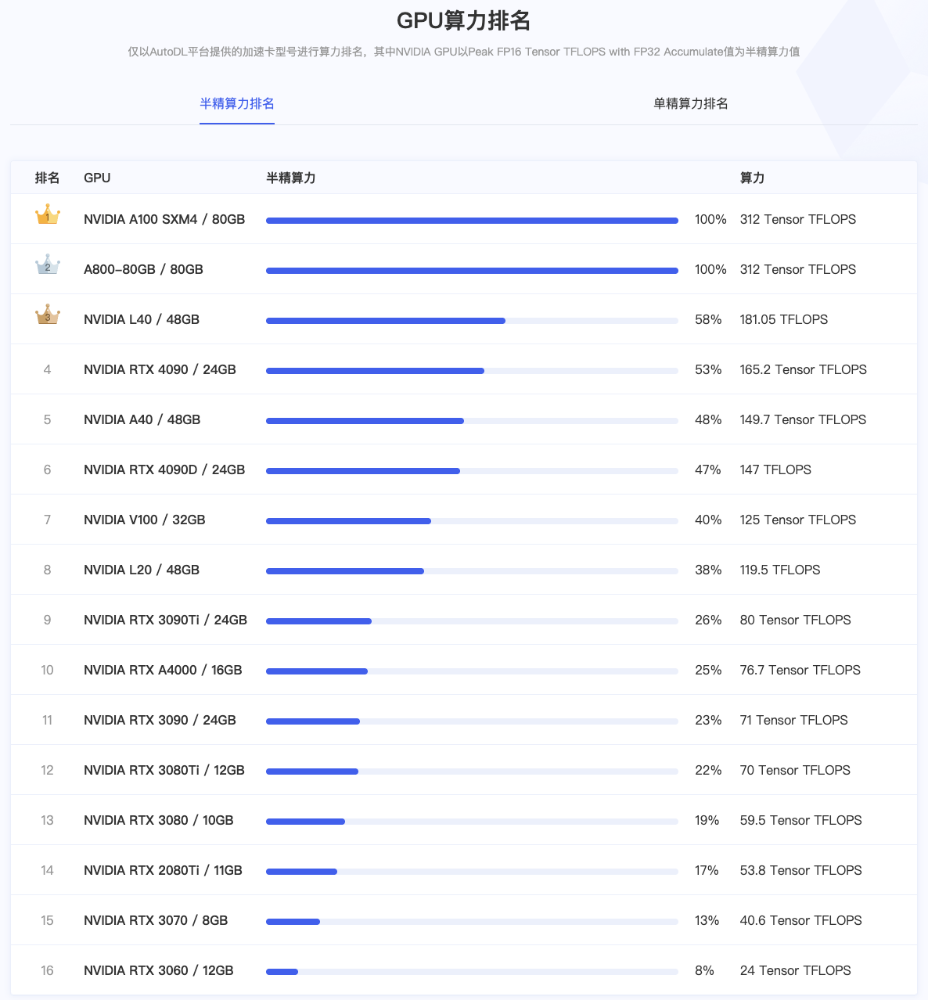
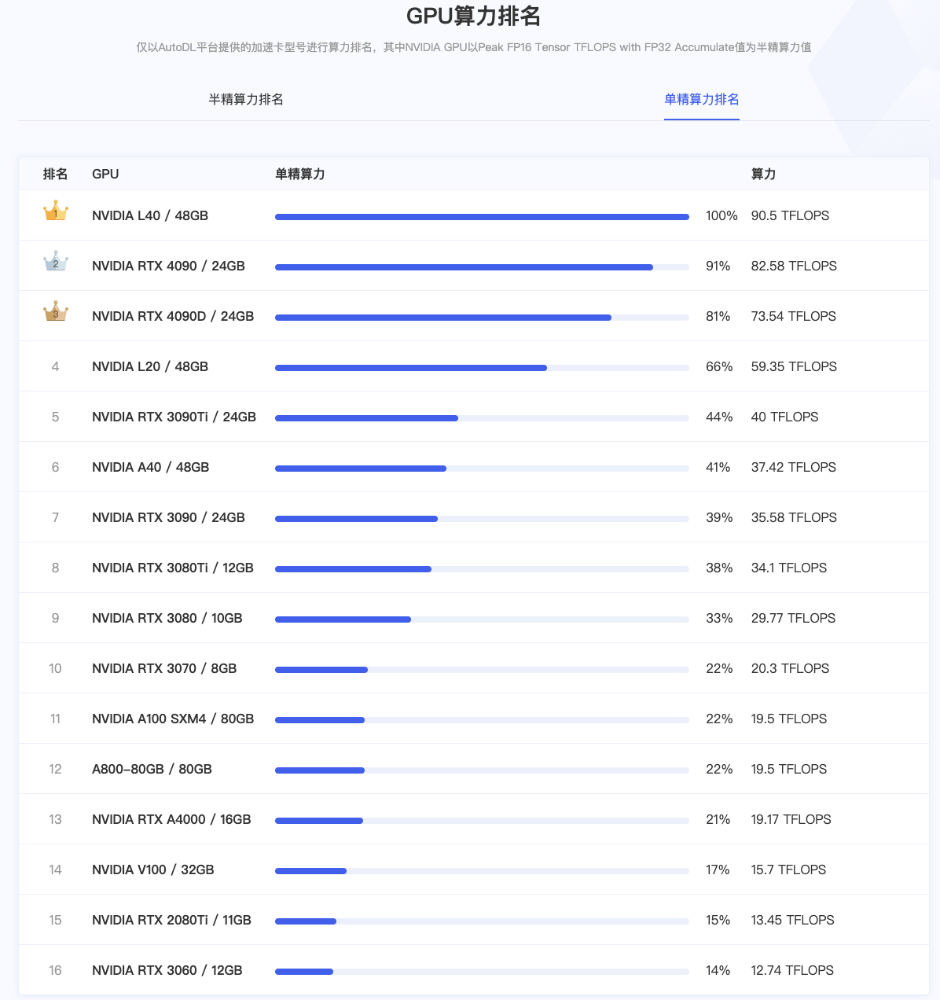
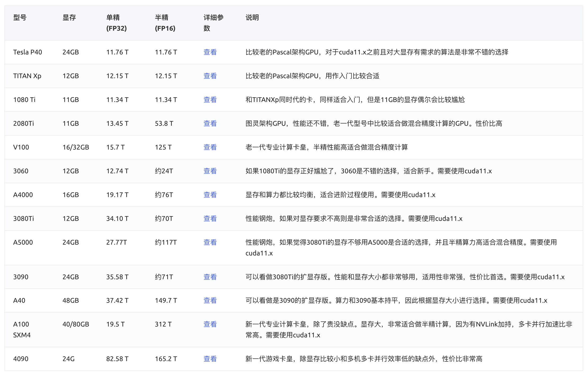
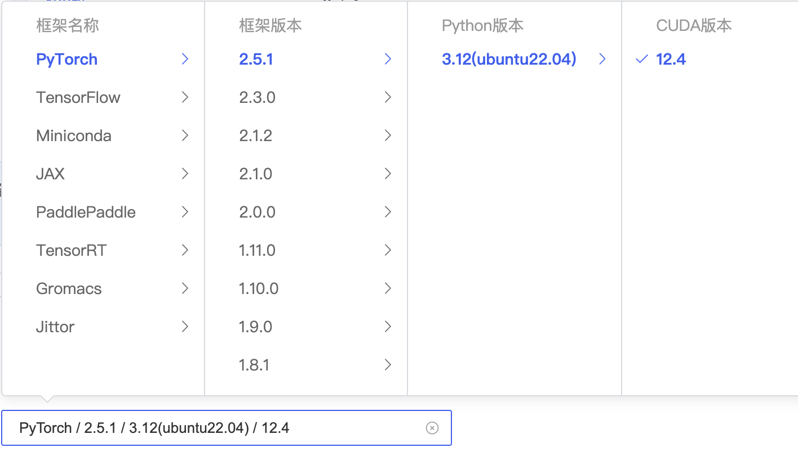

# 了解GPU
GPU算力排名





单精度：L40 > 4090 > 4090D > L20 > 3090Ti > A40 > 3090 > 3080Ti > 3080 > 3070 > A100 > A800 > A4000 > V100 > 2080Ti > 3060

半精度：A100 > A800 > L40 > 4090 > A40 > 4090D > V100 > L20 > 3090Ti > A4000 > 3090 > 3080Ti > 3080 > 2080Ti > 3070 > 3060

GPU型号介绍



cuda需在11.1及以上

GPU、CPU、内存的机制为：按租用的GPU数量成比例分配CPU和内存（如果租用两块GPU，那么CPU和内存就x2）

常买GPU型号
- 佛山 Tesla T4 16G：0.78/h
    - CPU8核，内存56G，系统盘30G，数据盘50G SSD
- 内蒙B区/重庆A区/西北B区/北京B区 4090 24G: 1.88-2.28/h（西北地区有1.88/h的）
    - 数据盘 50G
    - 可能不一样的：CPU核数/内存/CPU型号/驱动/CUDA

# AutoDL使用教程
- 学生认证可享会员价（只需要学校邮箱验证，每一年认证一次）
- 登录方式：微信
- 免密登录：使用ssh-keygen命令生成密钥文件
    - ssh-keygen -t rsa
    - 直接3个回车即可生成
    - 可以看到密钥文件路径
    - 打开公钥文件，复制公钥内容
        - cat ~/.ssh/id_rsa.pub
    - 在控制台->设置密钥登录->添加公钥
    - 运行中的实例重启一次即可实现免密登录
- 守护进程
    - 避免SSH会话连接中断导致任务失败
    - 输入screen，按回车键，执行任务；再打开另一个终端来查看GPU占用
- 
# 省钱绝招
https://autodl.com/docs/save_money/

- 无卡模式开机
    - 无卡模式开机使用0.5核；2GB内存；无GPU卡的配置，价格统一为￥0.1/小时
        - 如果不是无卡模式开机，至少￥0.88/小时（如2080Ti）
    - 无卡模式会释放GPU，置GPU为空闲状态，正常开机时如果GPU被其他用户租用，可能出现空闲GPU不足的情况。此时可以等待GPU释放或克隆实例
- 使用shutdown命令实现任务结束后关机

# 快捷工具：jupyterLab在线环境
- 文件浏览区可对实例中的目录和文件进行查看、新建、下载等操作
- 可打开实例Terminal终端环境

# 上传和下载数据
- FileZilla方式
- scp方式

# 数据保留逻辑
- 实例在数据在
- 实例的开关机不影响数据
- 需要注意实例的释放时间，实例释放后，数据也会被清除

# 实例中目录用途
- /rootautodl-pub:公开数据集
- /root/miniconda3
- 系统盘：/
    - 一般
    - 实例关机数据不会丢失，可存放代码等。会随保存镜像一起保存
    - 在系统盘存放训练文件xx并且在数据盘下存在模型xx后
- 数据盘：/root/autodl-tmp
    - 快
    - 实例关机数据不会丢失，可存放读写IO要求高的数据。但不会随保存镜像一起保存
    - 用于存在用户的个人数据，存放比较大的（数据，模型）
# 环境配置
- 基础镜像
    - Pytorch 2.5.1
    - Python 3.12
    - Ubuntu 22.04
    - CUDA 12.4


## jupyter初始配置
- jupyterLab在线环境打开实例Terminal终端环境
- （必要）更新系统依赖：apt-get update
- （非必要）安装工具包：apt-get install zip # 以安装zip工具为例
    - 跳过提示直接安装，添加“-y”参数
        - apt-get install -y zip
    - 关键词搜索筛选工具包：apt-cache search zip | grep file
- （必要）初始化conda: conda init (执行完成后关闭终端，重新开启一个终端，前面会有一个(base))
- （非必要）查看conda列表
    - conda list
    - conda list | grep cuda
- （非必要）查看conda所有的python版本：conda search python
- （必要）查看conda创建的环境
    - conda env list
- （非必要）安装python依赖包
    - 使用conda安装python依赖包（全局的依赖） # 以安装numpy为例
        - 搜索依赖: conda search numpy
        - 安装工具包：conda install numpy
        - 指定版本：conda install nummpy=1.22.3
- （必要）使用conda创建python虚拟环境（环境的挂载目录为/root/miniconda3/envs）
    - 创建我的环境 conda create -n <name> python=3.12
    - 激活我的环境 conda activate <name>
    - 退出当前环境 conda deactivate
    - 删除环境 conda remove -n <name> --all
## vscode远程开发
- （非必要）学术加速（不开很慢甚至无法下载相关文件）
    - 开启学术加速
        - source /etc/network_turbo
    - 关闭学术加速
        unset http_proxy && unset https_proxy
- （必要）vscode插件
    - Jupyter (以下的会自动安装)
        - Jupyter Cell Tags
        - Jupyter Keymap
        - Jupyter Notebook Renderes
        - Jupyter Slide Show
    - Python (以下的会自动安装)
        - Pylint
        - Python Debugger
    - Black Formatter
    - Git Graph
    - GitLens
- （必要）Ctrl + Shift + P -> python:select interpreter -> 添加python解释器
    - 测试补全
    - 查看跳转
- （非必要）debug: 项目根目录下，创建.vscode文件夹，里面的launch.json内容如上
```json
{
    "version": "0.2.0",
    "configurations": [
        {
            "name": "Python: Debug Current File",
            "type": "debugpy",
            "request": "launch",
            "program": "${file}",
            "console": "integratedTerminal",
            "justMyCode": false,
            "cwd": "${fileDirname}",
            "env": {
                "PATH": "/root/miniconda3/envs/verl/bin:$PATH", // 换成你自己的
                "CONDA_PREFIX": "/root/miniconda3/envs/verl", // 换成你自己的
                "CONDA_DEFAULT_ENV": "verl" // 换成你自己的
            }
        }
    ]
}
```
- （必要）在虚拟环境中使用pip命令安装python依赖包
    - 使用临时源安装 -i
    - qwen_debug安装包
        - pip install modelscope  
        - pip install transformers peft diffusers  
        - pip install torch
        - pip install transformers
        - pip install accelerate
# 命令
## 查看GPU的利用率：nvidia-smi -l 1
- 如果GPU占用率为0说明代码可能没有使用GPU，需检查代码。
- 如果GPU占用率忽高忽低、占用率峰值在50%以下，那么可能是数据预处理跟不上GPU的处理速度

## 查看CPU的占用率：控制台 -> 容器实例 -> 实例监控按钮
- 假设您的实例核心数为5，如果CPU占用率接近500%（即5个核心都正在高负载使用）那么可能是CPU数量不够，CPU出现了瓶颈，此时您可以迁移实例到更高CPU数量的主机上去或者升配。如果CPU占用率远没有达到500%的，说明您的代码没有把CPU的算力压榨出来，一般可以通过修改Torch Dataloader中的worker_num提高CPU负载，经验值num_worker = 略小于核心数量，最好测试不同worker num值对性能的影响。

## 查看文件和目录占用容量信息
df -h

## 查看GPU监控信息
nvidia-smi

## 查看框架版本信息
import torch
torch.__version__ # 示例："1.8.1+cu111"
torch.version.cuda

## 查看配置文件信息
cat /etc/os-release

## 检查当前使用的python和pip路径和版本
which python
which pip

python --version
