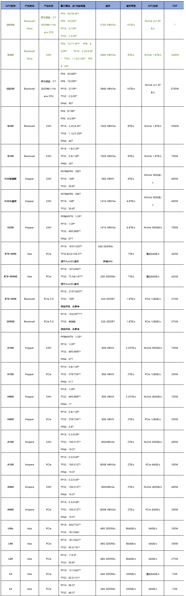

# GPU Usage
## 1. 大模型常见规格
一般模型的规格会体现在模型的名称上，例如 LLaMA2-13b，13b 就是其模型**参数量**的大小，意思是130亿的参数量。

如何查看
- huggingface上找到相应组织后，看模型的Collection

各模型汇总
- Llama
    - Llama 3.3：70B
    - Llama 3.2：1B，3B，11B（vision），90B（vision）
    - Llama 3.1：8B，70B，405B
    - Llama 3：8B，70B
- Qwen
    - Qwen 2.5：0.5B、1.5B、3B、7B、14B、32B、72B
    - QwQ：32B
- Deepseek
    - DeepSeek LLM：7B，67B  
    - DeepSeek V3：671B  
    - DeepSeek R1：671B，蒸馏版：（1.5B，7B，8B，14B，32B，70B）
- Gemini
    - Gemma 3：1B，4B，12B，27B

规格总结：
- 小型（<10B）：0.5B，1B，1.5B，3B，4B，7B，8B
- 中型（10B-100B）：11B，12B，14B，27B，32B，67B，70B，72B，90B
- 大型（>100B）：405B，671B

## 2. NVIDIA GPU 参数速查表

## 3. GPU介绍
GPU，即图形处理器（Graphics Processing Unit），是一种专门设计用于图形渲染和图像处理的处理器。与传统的中央处理器（CPU）相比，GPU具有更强大的并行处理能力。

NVIDIA 作为全球领先的 GPU 生产商，其显卡被广泛应用于游戏、深度学习、科学计算和图形处理等领域。随着 GPU 技术的不断升级，NVIDIA 推出了多个系列的显卡，涵盖了消费级、专业级和企业级市场。本文将对当前市面上流行的 NVIDIA GPU 型号进行排名，并探讨它们在不同应用场景中的表现。

NVIDIA 显卡系列
- GeForce系列：GeForce是NVIDIA的主要消费级图形处理器系列，用于电脑、游戏主机和笔记本电脑等设备。GeForce系列的显卡提供出色的图形性能和游戏体验，支持高分辨率、高帧率和实时光线追踪等先进技术。
- Quadro系列：Quadro是NVIDIA的专业级图形处理器系列，用于工作站和专业可视化应用。Quadro显卡具有高度精准的图形处理能力和对专业应用软件的优化支持，广泛应用于计算机辅助设计、医学成像、影视制作等领域。
- Tesla系列：Tesla是NVIDIA的高性能计算加速器系列，用于超级计算机和数据中心。Tesla采用GPU加速计算技术，可在科学计算、人工智能和深度学习等领域中提供强大的计算能力和数据处理能力。

1.消费级显卡
消费级显卡主要面向个人用户和游戏玩家，通常用于日常计算、3D 游戏以及家庭娱乐等场景。NVIDIA 的 GeForce 系列是这一领域的主打产品，提供高性能与价格的平衡。

|排名|GPU型号|架构|CUDA核心数|显存|主要用途|
|--|--|--|--|--|--|
|1|RTX 4090|Ada Lovelace|16384|24GB GDDR6X|4K游戏、3D渲染、VR|
|2|RTX 4080|Ada Lovelace|9728|16GB GDDR6X|高性能游戏、AI加速|
|3|RTX 4070 Ti|Ada Lovelace|7680|12GB GDDR6X|1440p游戏、创意工作|
|4|RTX 3070|Ampere|5888|8GB GDDR6|主流游戏、高帧率电竞|
|5|RTX 3060 Ti|Ampere|4864|8GB GDDR6|中高端游戏、图形设计|

在消费级市场，RTX 4090 是目前性能最强的显卡，搭载了 16384 个 CUDA 核心和 24GB 的 GDDR6X 显存，非常适合 4K 游戏、虚拟现实（VR）应用以及重度 3D 渲染任务。RTX 4080 和 RTX 4070 Ti 则提供了更高性价比的选择，适合不需要极致性能但仍要求流畅游戏体验的用户。

2.专业级显卡
专业级显卡主要应用于内容创作者、3D 建模、科学计算等领域，NVIDIA 的 Quadro 和 RTX A 系列显卡在这些市场中备受欢迎。它们通常具有更强的计算能力、更大的显存以及针对专业软件的优化。

|排名|GPU型号|架构|CUDA核心数|显存|主要用途|
|---|---|---|---|---|---|
|1|RTX A6000|Ampere|10752|48GB GDDR6|3D渲染、AI计算、工程设计|
|2|RTX A5000|Ampere|8192|24GB GDDR6|大数据处理、机器学习|
|3|Quadro RTX 8000|Turing|4608|48GB GDDR6|高级CAD、科学计算|
|4|Quadro RTX 6000|Turing|4608|24GB GDDR6|图像和视频编辑、3D建模|
|5|RTX A4000|Ampere|6144|16GB GDDR6|中端设计、动画制作|

在专业领域，RTX A6000 是最顶尖的 GPU，凭借 48GB 显存和超过 10000 个 CUDA 核心，非常适合大规模 AI 训练、3D 渲染和视频编辑。相比之下，RTX A5000 和 Quadro RTX 8000 在性价比方面表现出色，广泛应用于工程设计和大数据分析领域。

3.面向 AI 和机器学习的显卡
AI 和机器学习（ML）领域对 GPU 的需求非常高，尤其是在训练大型神经网络和深度学习模型时，GPU 的并行处理能力至关重要。NVIDIA 的 Tesla 系列和 A100 等产品在 AI 领域表现出色。

|排名|GPU型号|架构|CUDA核心数|显存|主要用途|
|---|---|---|---|---|---|
|1|NVIDIA H100|Hopper|16896|80GB HBM3|大规模AI训练|
|2|NVIDIA A100|Ampere|6912|40GB HBM2|AI推理、机器学习|
|3|NVIDIA V100|Volta|5120|32GB HBM2|神经网络训练、科学计算|
|4|Tesla T4|Turing|2560|16GB GDDR6|轻量AI推理、云推理|
|5|Tesla P100|Pascal|3584|16GB HBM2|数据中心加速、机器学习推理|

在 AI 领域，NVIDIA H100 是最新且最强的产品，专为大规模深度学习和 AI 模型训练设计。A100 依然是数据中心的主力 GPU，广泛应用于 AI 推理和机器学习任务中。

4.A800 与 H800
A800 和 H800 是 NVIDIA 专为中国市场推出的数据中心 GPU，它们是 A100 和 H100 的改进版本，主要区别在于受限的互连带宽，以符合出口管制要求。

A100 的 NVLink 互连带宽为 600GB/s，H100 的 NVLink 互连带宽高达 900GB/s

A800 与 H800 的 NVLink 互连带宽限制为 400GB/s，计算性能仍然强大，但 NVLink 互连速度有所降低，影响多 GPU 互联时的通信效率。对于单卡或较小规模的 GPU 计算任务，影响相对较小，而对于大规模分布式 AI 训练，可能会导致一定的性能下降。

## 4. 现有GPU资源
魔改版2080 Ti 共4张

哥哥主要有A800

## 5. 选择 GPU 用于 AI 机器学习和 LLM 的关键因素

1. 计算性能
- **FP16/TF32/FP8 Tensor Core 性能**：深度学习训练和推理通常使用这些低精度计算格式，计算性能越高，训练速度越快。  
- **FP32 性能**：用于部分模型计算需求。  
- **INT8 性能**：用于推理优化，影响 LLM 部署效率。  

2. 显存 (VRAM)
- **容量 (GB)**：LLM 训练和推理需要大量显存。例如：
  - **8GB–16GB**：适用于小型模型推理 (如 LLaMA 7B 量化后)。
  - **24GB–48GB**：适用于中等规模 LLM (13B–30B) 训练和推理。
  - **80GB+ (H100, A100, H800 等)**：适用于大型 LLM 训练 (如 GPT-4 级别)。
- **显存带宽 (GB/s)**：影响数据吞吐量，带宽越高，多 GPU 训练时效率更高。例如：
  - **H100 (HBM3) ≈ 3.35TB/s**，远高于 A100 (HBM2) 的 1.55TB/s。

3. NVLink / GPU 互连带宽
- 训练大型 LLM 时通常需要多个 GPU 联合计算，因此 **NVLink 互连带宽** 至关重要：
  - **H100 NVLink：900GB/s**
  - **H800 NVLink：400GB/s**
  - **A100 NVLink：600GB/s**
  - **A800 NVLink：400GB/s**
- 互连带宽越高，多 GPU 并行计算时数据传输瓶颈越少，训练效率更高。

4. 能效比 (TFLOPS/W)
- 训练 LLM 消耗大量电力，能效高的 GPU（如 H100）可以降低成本。

5. 软件生态
- **CUDA + cuDNN**：加速深度学习计算。  
- **TensorRT**：优化推理性能。  
- **PyTorch/XLA, DeepSpeed, Megatron-LM**：优化 LLM 训练。  
- **Multi-GPU 框架 (NCCL, FSDP, ZeRO, Triton)**：优化数据并行计算。

结论

如果预算充足，建议使用 **H100 (或 H800)** 进行大规模 LLM 训练，因其高显存、NVLink 带宽和计算效率。如果预算有限，可以选择 **A100/A800 或 RTX 4090**（单机推理）。

## 6. 模型文件有多大

大模型的文件大小与其参数量有关，通常大模型是以**半精度**存储的（一般放出来的模型文件都是fp16的）， nB 的模型文件大概是 2n GB多一些，例如 13B 的模型文件大小大约是 27GB 左右。

## 7. nB 模型推理需要多少显存
fp16加载到显存里做推理也是占 2n GB，和文件大小一致

## 8. nB 模型训练需要多少显存
基础显存：模型参数2n+梯度2n+优化器12n = 16nG 显存

激活值占用显存，和max len、batch size有关

解释：优化器部分必须用fp32（似乎fp16会导致训练不稳定），所以应该是 2+2+12=16，参考 ZeRO 论文

举例：7B 的 vicuna 在 fsdp 下总共 160G 显存勉强可以训练
    - 按照上面计算出 7 * 16 = 112G 是基础显存
    - 全量训练准备 20nG 大概是最低要求，除非内存充足，显存不够 offload 内存补

###  8.1. GPU 显存计算  version2

7B 
- 70亿 * 4 byte
  - 70亿参数
  - 每个参数 4 byte
  - 计算出总共多少GB，记为 a GB

全量微调 （需要5a GB）
- 模型本身 *1
- Gradient *1 
- Optimizer States * 2
- 变量 *1

LoRA (略比aGB大，训练的参数都不到原参数量的1%)  

Trainable: 20971520 | total: 7262703616 | Percentage: 0.2888%
- 模型本身 *1
- Gradient *1 * 1% 
- Optimizer States * 2 * 1%

### 8.2. gege version3

推理*2,训练*8

bf16

每个参数占2个字节

推理只有模型参数

训练，参数1，梯度1,优化器2,激活值不计，4份参数大小 * 2 = 8

## 9. 能否用4 * v100 32G训练vicuna 65b？
不能。

首先，llama 65b 的权重需要5 * v100 32G 才能完整加载到GPU

其次，vicuna 使用 flash-attention 加速训练，暂不支持 v100，需要 turing 架构之后的显卡

一般来说推理模型需要的显存约等于模型文件大小，全参训练需要的显存约为推理所需显存的三倍到四倍，正常来说，在不量化的情况下4张 v100 显卡推理 65b 的模型都会有一些吃力，无法进行训练，需要通过 LoRA 或者 QLoRA 采用低秩分解的方式才可以训练。

