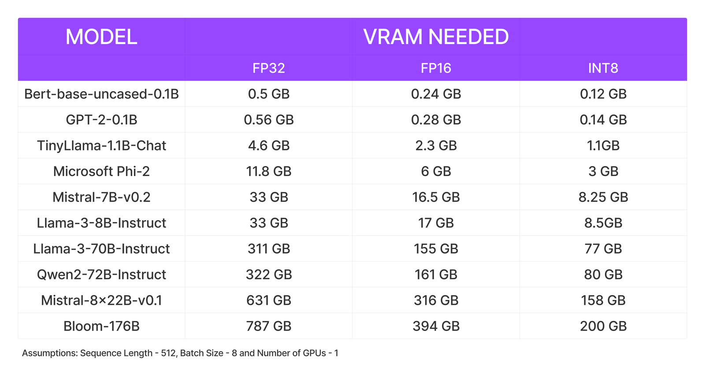
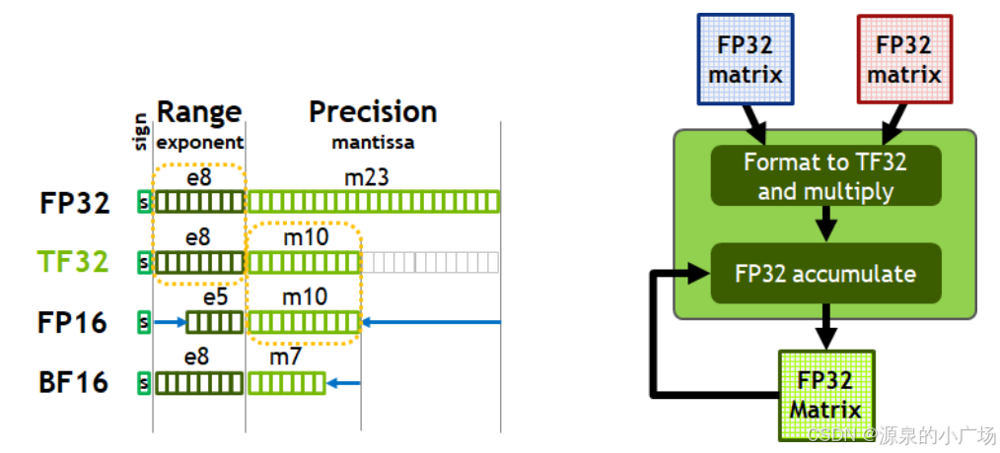
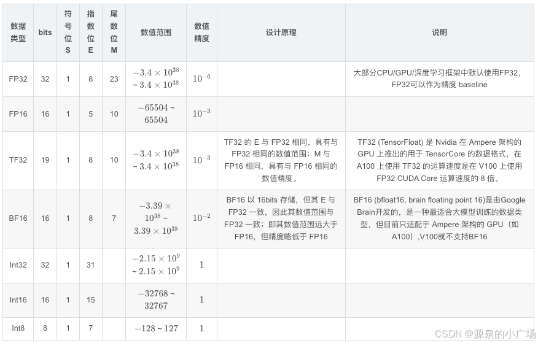
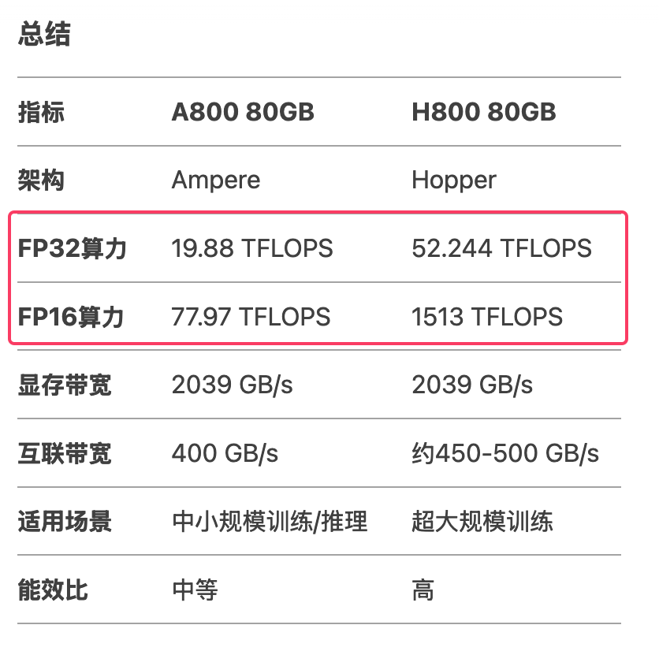
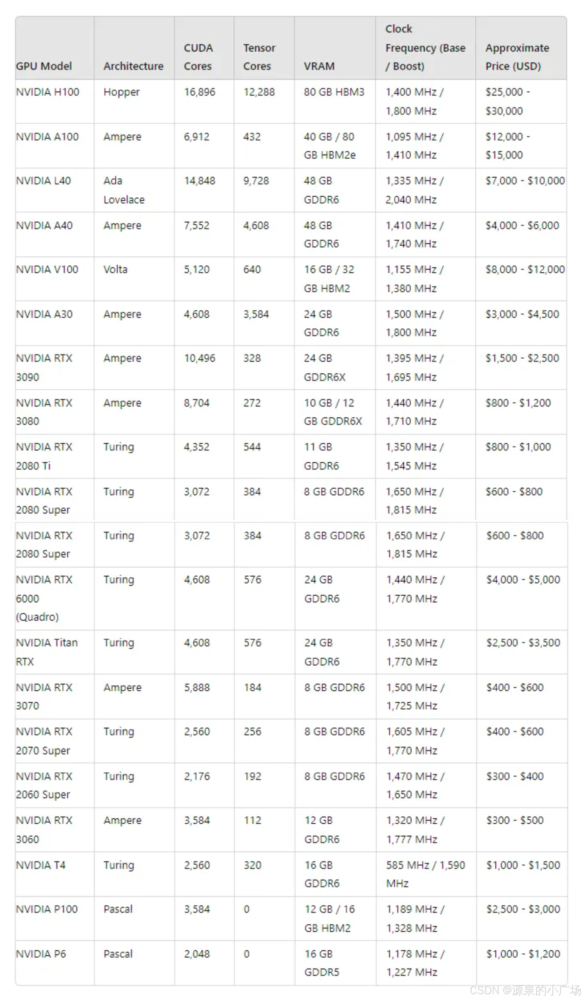
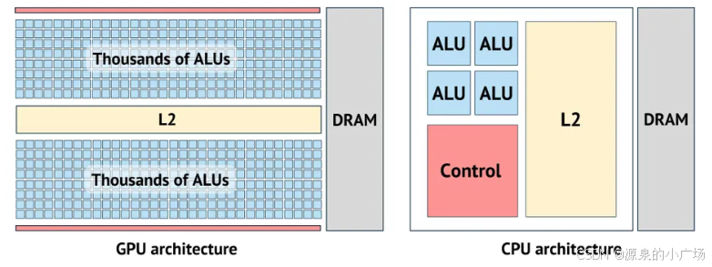
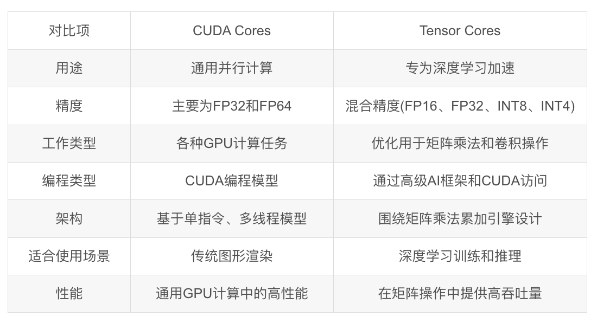
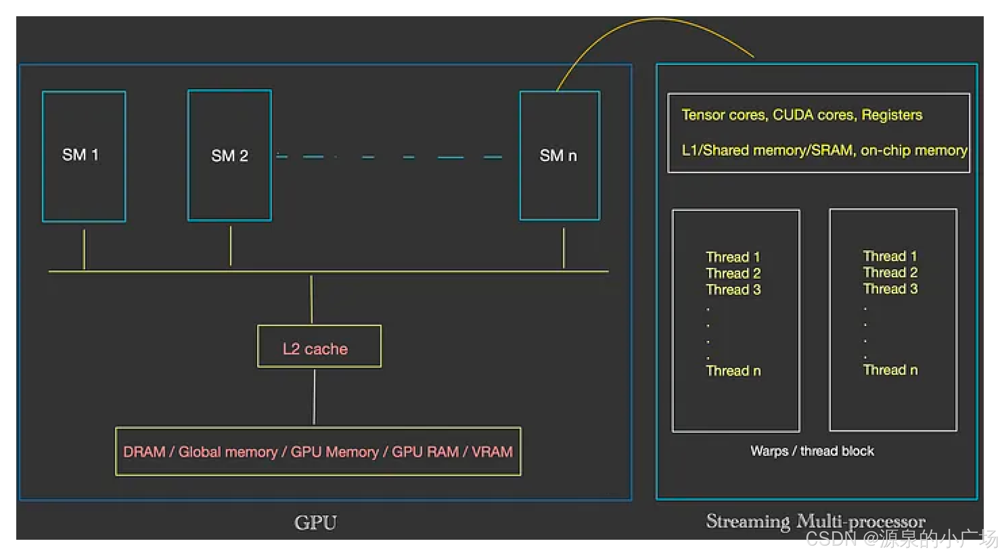
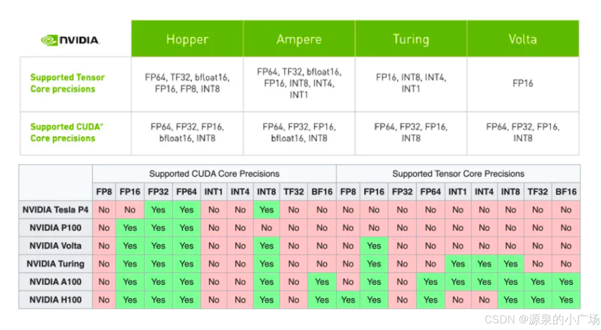
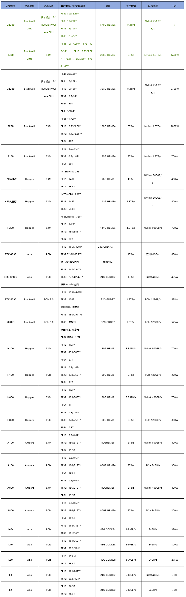

# GPU显存占用计算
从第一性原则出发，要回答的第一个问题就是，为什么要计算大模型占用的显存资源？一句话概括：显存太小，模型无法运行；显存太大，浪费金钱。所以从成本的角度来看，很有必要分析计算大模型的资源占用

当你手头想要部署某个开源大模型，你的老板可能会问你，需要多大的资源？这时候需要你来确定使用哪种GPU来运行模型。

## 显存占用计算在线工具
- https://rahulschand.github.io/gpu_poor/
- https://huggingface.co/spaces/hf-accelerate/model-memory-usage
- https://vram.asmirnov.xyz/
- https://huggingface.co/spaces/Vokturz/can-it-run-llm?ref=blog.runpod.io
## 1. 大模型常见规格
一般模型的规格会体现在模型的名称上，例如 LLaMA2-13b，13b 就是其模型**参数量**的大小，意思是130亿的参数量。

如何查看
- huggingface上找到相应组织后，看模型的Collection

各模型汇总
- Llama
    - Llama 3.3：70B
    - Llama 3.2：1B，3B，11B（vision），90B（vision）
    - Llama 3.1：8B，70B，405B
    - Llama 3：8B，70B
- Qwen
    - Qwen 2.5：0.5B、1.5B、3B、7B、14B、32B、72B
    - QwQ：32B
- Deepseek
    - DeepSeek LLM：7B，67B  
    - DeepSeek V3：671B  
    - DeepSeek R1：671B，蒸馏版：（1.5B，7B，8B，14B，32B，70B）
- Gemini
    - Gemma 3：1B，4B，12B，27B

规格总结：
- 小型（<10B）：0.5B，1B，1.5B，3B，4B，7B，8B
- 中型（10B-100B）：11B，12B，14B，27B，32B，67B，70B，72B，90B
- 大型（>100B）：405B，671B

## 参数量估算 (n B)

- 参数主要集中在注意力块和MLP块
    - 注意力块
        - QKVO 四个线性层
            - 形状
                - Q/O : [H * H]
                - K/V : [H * 1/4 H] (由于 repeat_kv=4)
            - 为了方便计算，也考虑到还有其他参数没有算进来，这里4个线性层都按[H * H]来算
            - 共 4 H^2
    - MLP块
        - gate/up/down 三个线性层 
            - 形状 [H * 4H] = 4H^2
            - 共 12 H^2
- 影响参数量的两大变量：
    - 层数: L
    - 隐状态维度(hidden_state): H
- 参数量估算：**16·L·H^2**
    - Llama-8B，L=32，H=4096
        - 按上述公式估算参数为 8,589,934,592
        - 实际参数量为 8,030,261,248

## 2. 模型文件有多大 (2n GB)

大模型的文件大小与其参数量有关，通常大模型是以**半精度**存储的（一般放出来的模型文件都是fp16的）， nB 的模型文件大概是 2n GB多一些，例如 13B 的模型文件大小大约是 27GB 左右。

如果一个 8B（即 80 亿，或 8 × 10⁹）参数的 LLM（大语言模型），每个参数占用 2 个字节，那么整体模型大小就是：16 × 10⁹ bytes

换算成更常用的单位：

字节（Bytes）：16,000,000,000 字节

千字节（KB）：16,000,000,000 ÷ 1024 ≈ 15,625,000 KB

兆字节（MB）：15,625,000 ÷ 1024 ≈ 15,258 MB

吉字节（GB）：15,258 ÷ 1024 ≈ 14.9 GB

## 3. nB 模型推理需要多少显存 (2n GB)
fp16加载到显存里做推理也是占 2n GB，和文件大小一致

一般来说推理模型需要的显存约等于模型文件大小

## 4. nB 模型训练需要多少显存
### 4.1. gege version3

推理x2,训练x8

bf16

每个参数占2个字节

推理只有模型参数

训练，参数1，梯度1,优化器2,激活值不计，4份参数大小 * 2 = 8

### 4.2. GPU 显存计算  version2

nB LLM 
- 模型文件大小： 2n GB
- 全量微调： 10n GB
- LoRA微调： 略比 2n GB 大，训练的参数都不到原参数量的1%

全量微调 （需要 10n GB）
- 模型本身 *1
- Gradient *1 
- Optimizer States * 2
- 激活值 *1

LoRA (略比2n GB大，训练的参数都不到原参数量的1%)  

Trainable: 20971520 | total: 7262703616 | Percentage: 0.2888%
- 模型本身 *1
- Gradient *1 * 1% 
- Optimizer States * 2 * 1%

### 4.3 version3

推理显存占用 = 参数量 * 2字节 * 1.2

（也就是4.1推理显存占用基础上乘以1.2）

参考来源：https://blog.runpod.io/understanding-vram-and-how-much-your-llm-needs/

### 4.4. 混合精度（详见blog和deepspeed处）
基础显存：模型参数2n+梯度2n+优化器12n = 16nG 显存

激活值占用显存，和max len、batch size有关

解释：优化器部分必须用fp32（似乎fp16会导致训练不稳定），所以应该是 2+2+12=16，参考 ZeRO 论文

举例：7B 的 vicuna 在 fsdp 下总共 160G 显存勉强可以训练
    - 按照上面计算出 7 * 16 = 112G 是基础显存
    - 全量训练准备 20nG 大概是最低要求，除非内存充足，显存不够 offload 内存补

### 4.5. 实践案例
- 只有4.3节实际案例没看，其他都看了 https://www.baseten.co/blog/llm-transformer-inference-guide/
- 英文原版 https://blog.csdn.net/weixin_65514978/article/details/141728918

## 5. 能否用4 * v100 32G训练vicuna 65b？
不能。推理都有些吃力，更无法进行全参数训练。

首先，llama 65b 的权重需要5 * v100 32G 才能完整加载到GPU (推理约需要65x2=130GB，5张v100才够放)

其次，vicuna 使用 flash-attention 加速训练，暂不支持 v100，需要 turing 架构之后的显卡

一般来说推理模型需要的显存约等于模型文件大小，全参训练需要的显存约为推理所需显存的三倍到四倍，正常来说，在不量化的情况下4张 v100 显卡推理 65b 的模型都会有一些吃力，无法进行训练，需要通过 LoRA 或者 QLoRA 采用低秩分解的方式才可以训练。

## 6. 全参数微调所需显存量的考虑因素
- 模型大小
- 批次大小
- 输入序列长度
- 计算平台和优化
    - 不同的计算平台和深度学习框架可能在显存使用方面存在差异。一些框架可能会提供显存优化的功能，例如梯度检查点（Gradient Checkpointing）或混合精度训练（Mixed Precision Training），以减少显存的使用。

## 7.样本量规模增大，训练出现OOM错解决方案

1.  **减少批量大小（Batch Size）**：将批量大小减小可以减少每个训练步骤中所需的内存量。较小的批量大小可能会导致训练过程中的梯度估计不稳定，但可以通过增加训练步骤的数量来弥补这一问题。
2.  **分布式训练**：使用多台机器或多个GPU进行分布式训练可以将训练负载分散到多个设备上，从而减少单个设备上的内存需求。通过分布式训练，可以将模型参数和梯度在多个设备之间进行同步和更新。
3.  **内存优化技术**：使用一些内存优化技术可以减少模型训练过程中的内存占用。例如，使用\*\*混合精度训练（Mixed Precision Training）**可以减少模型参数的内存占用；使用**梯度累积（Gradient Accumulation）\*\*可以减少每个训练步骤中的内存需求。
4.  **减少模型规模**：如果内存问题仍然存在，可以考虑减少模型的规模，例如减少模型的层数、隐藏单元的数量等。虽然这可能会导致模型性能的一定损失，但可以在一定程度上减少内存需求。
5.  **增加硬件资源**：如果条件允许，可以考虑增加硬件资源，例如增加内存容量或使用更高内存的设备。这样可以提供更多的内存空间来容纳更大规模的训练数据。
6.  **数据处理和加载优化**：优化数据处理和加载过程可以减少训练过程中的内存占用。例如，可以使用数据流水线技术来并行加载和处理数据，减少内存中同时存在的数据量。

# GPU 如何选择
## 1. 哥哥现有GPU资源
- 魔改版2080 Ti 共4张（家里）
- 哥哥主要有A800（公司）

a800和h800都是80G显存

算力差距好明显，他妈的我们组的48张h800都被一个人占得死死的，他能跑预训练

## 显存含义
显存，也称为视频随机存取存储器（Video Random Access Memory，VRAM），是一种用于GPU的特殊内存类型。是用于存储图形处理器（GPU）处理数据的专用存储器。显存的主要作用是为GPU提供快速访问数据的能力，包括图像、纹理、帧缓存等。显存的大小和速度直接影响图形处理能力，特别是在3D渲染、高分辨率视频处理、深度学习和其他需要大量数据处理的任务中。GPU都会配备一定的VRAM，如下图所示。

与系统RAM不同，系统RAM与CPU和其他组件共享，而VRAM则专用于GPU。确保GPU可以不间断地访问内存，从而提高了性能的稳定性和可预测性。GPU通过允许应用程序中的重复计算并行运行来补充CPU架构，而主程序则继续在CPU上运行。CPU可以被认为是整个系统的任务管理者，负责协调各种通用计算任务，而GPU则执行范围更窄但更专业化的任务（通常是数学计算）。利用并行计算的强大能力，GPU可以在相同的时间内完成比CPU更多的工作。CPU和GPU各有优势，CPU擅长处理复杂的逻辑和串行任务，而GPU擅长处理并行计算任务。显存则是GPU发挥其计算能力的重要支撑，足够大的显存容量和带宽可以防止因为数据传输瓶颈而导致的性能下降

## Cuda Cores和Tensor Cores

GPU携带了两种关键组成：Cuda Cores(CUDA 核心)和Tensor Cores(张量核心)，这个配置信息对于GPU的选择也是尤为重要

CUDA（Compute Unified Device Architecture）核心是 NVIDIA 于 2007 年开发的，是 GPU 的基本处理单元，能够处理广泛的并行计算任务。CUDA 核心在顺序处理方面表现出色，是传统图形渲染、物理仿真和通用 GPU 计算的主力。另一方面，Tensor Cores 是 NVIDIA 在 2017 年推出的 Volta 架构中引入的专用处理单元，并在后续几代产品中得到进一步改进。这些核心专门设计用于加速深度学习，特别是神经网络计算中常见的矩阵乘法和卷积操作。

从对比项目来看，对于深度学习、大模型任务来说，Tensor Cores显得更为关键。Tensor Cores 支持混合精度计算（FP16、INT8、INT4 等），在不显著降低计算精度的情况下，减少计算所需的内存和带宽。这使得 Tensor Cores 在处理深度学习工作负载时，比只支持单一精度（如 FP32、FP64）的 CUDA Cores 更高效

Tensor Cores 与 CUDA Cores共享 VRAM（显存），在 NVIDIA GPU 架构中，显存（VRAM）是一个公共资源，供所有类型的计算单元（包括 CUDA Cores 和 Tensor Cores）使用。如下图所示：

## 不同GPU对精度的支持力度
对于不同的精度，GPU架构和版本的不同，支持的力度存在差异。因此对于模型的训练、推理涉及的数值精度，需要按照实际情况选择GPU型号。

## 2. 选择 GPU 用于 AI 机器学习和 LLM 的关键因素

1. 计算性能
- **FP16/TF32/FP8 Tensor Core 性能**：深度学习训练和推理通常使用这些低精度计算格式，计算性能越高，训练速度越快。  
- **FP32 性能**：用于部分模型计算需求。  
- **INT8 性能**：用于推理优化，影响 LLM 部署效率。  

2. 显存 (VRAM)
- **容量 (GB)**：LLM 训练和推理需要大量显存。例如：
  - **8GB–16GB**：适用于小型模型推理 (如 LLaMA 7B 量化后)。
  - **24GB–48GB**：适用于中等规模 LLM (13B–30B) 训练和推理。
  - **80GB+ (H100, A100, H800 等)**：适用于大型 LLM 训练 (如 GPT-4 级别)。
- **显存带宽 (GB/s)**：影响数据吞吐量，带宽越高，多 GPU 训练时效率更高。例如：
  - **H100 (HBM3) ≈ 3.35TB/s**，远高于 A100 (HBM2) 的 1.55TB/s。

3. NVLink / GPU 互连带宽
- 训练大型 LLM 时通常需要多个 GPU 联合计算，因此 **NVLink 互连带宽** 至关重要：
  - **H100 NVLink：900GB/s**
  - **H800 NVLink：400GB/s**
  - **A100 NVLink：600GB/s**
  - **A800 NVLink：400GB/s**
- 互连带宽越高，多 GPU 并行计算时数据传输瓶颈越少，训练效率更高。

4. 能效比 (TFLOPS/W)
- 训练 LLM 消耗大量电力，能效高的 GPU（如 H100）可以降低成本。

5. 软件生态
- **CUDA + cuDNN**：加速深度学习计算。  
- **TensorRT**：优化推理性能。  
- **PyTorch/XLA, DeepSpeed, Megatron-LM**：优化 LLM 训练。  
- **Multi-GPU 框架 (NCCL, FSDP, ZeRO, Triton)**：优化数据并行计算。

结论

如果预算充足，建议使用 **H100 (或 H800)** 进行大规模 LLM 训练，因其高显存、NVLink 带宽和计算效率。如果预算有限，可以选择 **A100/A800 或 RTX 4090**（单机推理）。

## 3. NVIDIA GPU 参数速查表

## 4. GPU介绍
GPU，即图形处理器（Graphics Processing Unit），是一种专门设计用于图形渲染和图像处理的处理器。与传统的中央处理器（CPU）相比，GPU具有更强大的并行处理能力。

NVIDIA 作为全球领先的 GPU 生产商，其显卡被广泛应用于游戏、深度学习、科学计算和图形处理等领域。随着 GPU 技术的不断升级，NVIDIA 推出了多个系列的显卡，涵盖了消费级、专业级和企业级市场。本文将对当前市面上流行的 NVIDIA GPU 型号进行排名，并探讨它们在不同应用场景中的表现。

NVIDIA 显卡系列
- GeForce系列：GeForce是NVIDIA的主要消费级图形处理器系列，用于电脑、游戏主机和笔记本电脑等设备。GeForce系列的显卡提供出色的图形性能和游戏体验，支持高分辨率、高帧率和实时光线追踪等先进技术。
- Quadro系列：Quadro是NVIDIA的专业级图形处理器系列，用于工作站和专业可视化应用。Quadro显卡具有高度精准的图形处理能力和对专业应用软件的优化支持，广泛应用于计算机辅助设计、医学成像、影视制作等领域。
- Tesla系列：Tesla是NVIDIA的高性能计算加速器系列，用于超级计算机和数据中心。Tesla采用GPU加速计算技术，可在科学计算、人工智能和深度学习等领域中提供强大的计算能力和数据处理能力。

1.消费级显卡
消费级显卡主要面向个人用户和游戏玩家，通常用于日常计算、3D 游戏以及家庭娱乐等场景。NVIDIA 的 GeForce 系列是这一领域的主打产品，提供高性能与价格的平衡。

|排名|GPU型号|架构|CUDA核心数|显存|主要用途|
|--|--|--|--|--|--|
|1|RTX 4090|Ada Lovelace|16384|24GB GDDR6X|4K游戏、3D渲染、VR|
|2|RTX 4080|Ada Lovelace|9728|16GB GDDR6X|高性能游戏、AI加速|
|3|RTX 4070 Ti|Ada Lovelace|7680|12GB GDDR6X|1440p游戏、创意工作|
|4|RTX 3070|Ampere|5888|8GB GDDR6|主流游戏、高帧率电竞|
|5|RTX 3060 Ti|Ampere|4864|8GB GDDR6|中高端游戏、图形设计|

在消费级市场，RTX 4090 是目前性能最强的显卡，搭载了 16384 个 CUDA 核心和 24GB 的 GDDR6X 显存，非常适合 4K 游戏、虚拟现实（VR）应用以及重度 3D 渲染任务。RTX 4080 和 RTX 4070 Ti 则提供了更高性价比的选择，适合不需要极致性能但仍要求流畅游戏体验的用户。

2.专业级显卡
专业级显卡主要应用于内容创作者、3D 建模、科学计算等领域，NVIDIA 的 Quadro 和 RTX A 系列显卡在这些市场中备受欢迎。它们通常具有更强的计算能力、更大的显存以及针对专业软件的优化。

|排名|GPU型号|架构|CUDA核心数|显存|主要用途|
|---|---|---|---|---|---|
|1|RTX A6000|Ampere|10752|48GB GDDR6|3D渲染、AI计算、工程设计|
|2|RTX A5000|Ampere|8192|24GB GDDR6|大数据处理、机器学习|
|3|Quadro RTX 8000|Turing|4608|48GB GDDR6|高级CAD、科学计算|
|4|Quadro RTX 6000|Turing|4608|24GB GDDR6|图像和视频编辑、3D建模|
|5|RTX A4000|Ampere|6144|16GB GDDR6|中端设计、动画制作|

在专业领域，RTX A6000 是最顶尖的 GPU，凭借 48GB 显存和超过 10000 个 CUDA 核心，非常适合大规模 AI 训练、3D 渲染和视频编辑。相比之下，RTX A5000 和 Quadro RTX 8000 在性价比方面表现出色，广泛应用于工程设计和大数据分析领域。

3.面向 AI 和机器学习的显卡
AI 和机器学习（ML）领域对 GPU 的需求非常高，尤其是在训练大型神经网络和深度学习模型时，GPU 的并行处理能力至关重要。NVIDIA 的 Tesla 系列和 A100 等产品在 AI 领域表现出色。

|排名|GPU型号|架构|CUDA核心数|显存|主要用途|
|---|---|---|---|---|---|
|1|NVIDIA H100|Hopper|16896|80GB HBM3|大规模AI训练|
|2|NVIDIA A100|Ampere|6912|40GB HBM2|AI推理、机器学习|
|3|NVIDIA V100|Volta|5120|32GB HBM2|神经网络训练、科学计算|
|4|Tesla T4|Turing|2560|16GB GDDR6|轻量AI推理、云推理|
|5|Tesla P100|Pascal|3584|16GB HBM2|数据中心加速、机器学习推理|

在 AI 领域，NVIDIA H100 是最新且最强的产品，专为大规模深度学习和 AI 模型训练设计。A100 依然是数据中心的主力 GPU，广泛应用于 AI 推理和机器学习任务中。

4.A800 与 H800
A800 和 H800 是 NVIDIA 专为中国市场推出的数据中心 GPU，它们是 A100 和 H100 的改进版本，主要区别在于受限的互连带宽，以符合出口管制要求。

A100 的 NVLink 互连带宽为 600GB/s，H100 的 NVLink 互连带宽高达 900GB/s

A800 与 H800 的 NVLink 互连带宽限制为 400GB/s，计算性能仍然强大，但 NVLink 互连速度有所降低，影响多 GPU 互联时的通信效率。对于单卡或较小规模的 GPU 计算任务，影响相对较小，而对于大规模分布式 AI 训练，可能会导致一定的性能下降。

