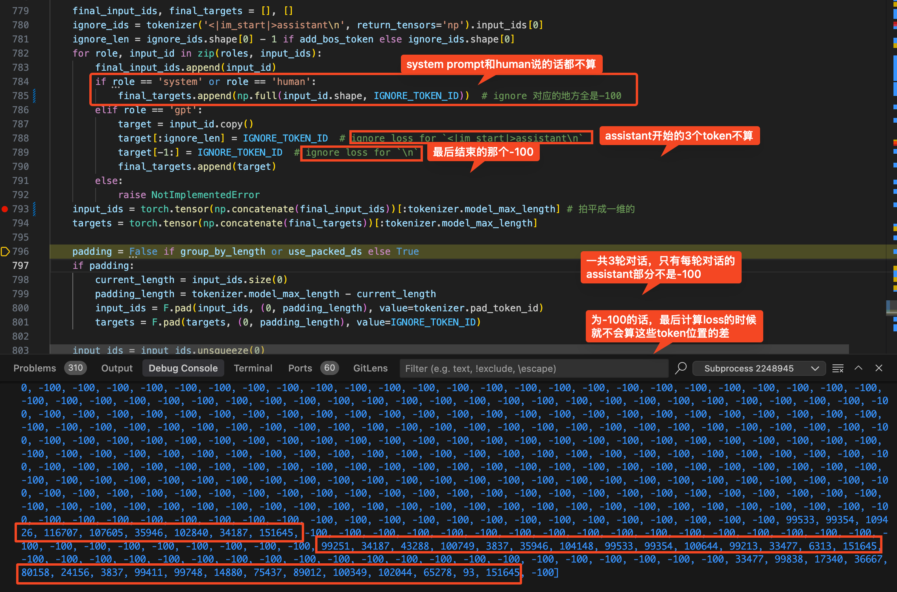
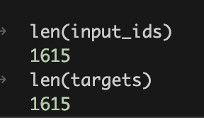
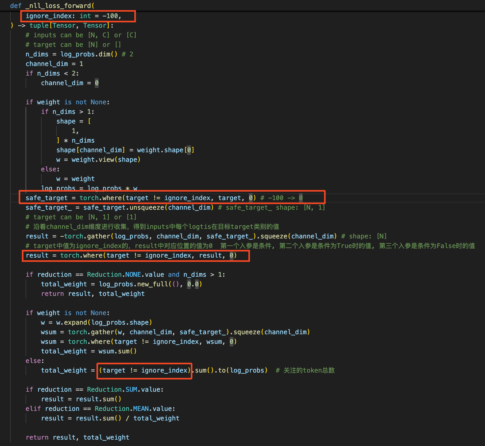

# 不传之秘
## 哥哥总结的不传之秘
- 训练性能
    - SFT 很容易导致在其他领域上的能力急剧下滑与遗忘
    - ppo相对容易能力下滑和遗忘
    - grpo根本不忘
- loss
    - 数据量小的时候（小于几十万条），loss 下降平缓只是证明训练过程没 bug，不能证明模型学得好
    - loss 中间有突刺或者下降不平缓，很可能模型就傻了
- 小模型与大模型
    - 小模型（小于7B）不能理解稍微复杂点的语言思考
    - 很多训练策略与结论在小模型上和大点儿的模型上是两个世界
    - 小模型最好学短思维链，大模型学长思维链
- 训练数据要点（一定不能让模型有通过记忆找到很类似的题解答，进行偷懒的机会）
    - 去重
    - 多样性
    - 先易后难学习（curriculum learning）
- 简单的方法比复杂的方法往往要好
- 模型是知行合一的，对自己生成的评分最高

## 多轮对话微调
一张图让你明白多轮对话是怎么微调的

下面那串数字是多轮对话的label ids，也叫targets，有一个input_ids和它一一对应

input_ids里每个token的id都是真的，targets里有部分是-100，只有assitant回复的部分是真的id

只有AI的多轮对话算，system和human都是-100，不计算loss

单轮的targets只有一小块不是-100，多轮（比如3轮）targets里就有3块不是-100

-100起什么作用呢？最后算交叉熵 loss的时候，-100的位置全部不算loss

只有不为ignore_index(-100)的地方参与了计算，最后loss算平均，分母也是只算不为-100的token个数

## 这个人偶尔会说点训模型过程中的不传之密
https://www.zhihu.com/people/ybq-29-32/posts

## 领域模型训练
一、领域模型训练的重要性
领域模型，即在某一专业领域性能特别好的模型，其重要性不言而喻。在实际应用中，领域模型需要处理大量专业任务，如法律模型的法规判断、医学模型的病症诊断等。这些任务要求模型具备高度的专业性和准确性，而领域模型正是通过专门训练来满足这些需求的。

二、领域模型训练的关键环节
1. Post-pretrain训练
Post-pretrain训练是领域模型训练的重要环节。在通用预训练（pretrain）阶段，模型已经学习到了大量的基础知识和语言能力。然而，为了进一步提升模型在特定领域的性能，需要进行post-pretrain训练。这一阶段的目的是让模型更好地认识领域的专有名词，理解领域的特定语境，从而提升模型的准确性和专业性。

2. 数据质量与配比
数据是模型训练的基础，数据的质量和配比直接影响模型的性能。在领域模型训练中，需要确保数据的高质量，并合理配比不同来源的数据。例如，在法律模型训练中，需要包含大量的法律法规、案例判决等数据；在医学模型训练中，则需要包含各种病症、药品、治疗方案等数据。同时，还需要注意数据的多样性，包括中英文、代码等不同类型的数据，以提升模型的泛化能力。

3. Channel loss的监控
在领域模型训练中，channel loss的监控也是非常重要的。Channel loss是指不同数据channel各自的loss，通过监控channel loss，可以了解模型在不同类型数据上的表现情况，从而调整训练策略。例如，如果发现某个channel的loss较高，可以针对该channel增加数据或调整训练参数，以提升模型在该类型数据上的性能。