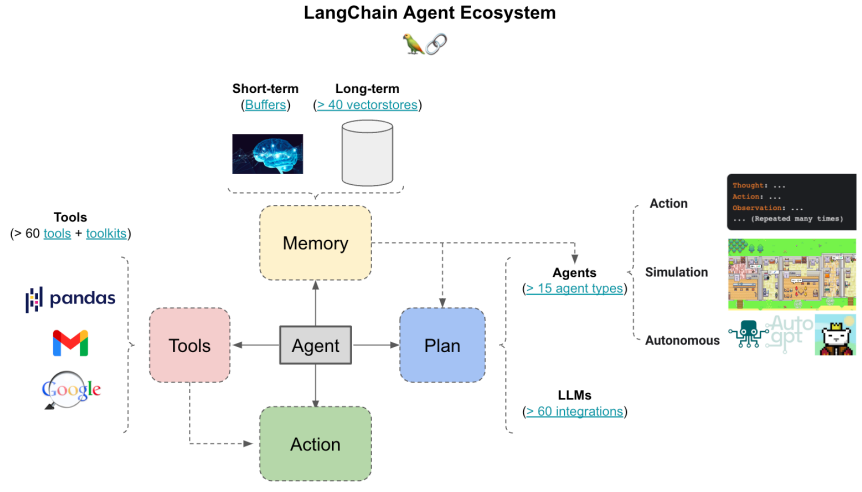

# Agent
## AI Agent四种设计方式

## AI Agent4种设计模式
https://blog.csdn.net/weixin_40774379/article/details/139133605

## 趋势：大语言模型的Agent化
大语言模型的Agent化，将语言模型转变为具备自主决策和执行能力的智能体。这意味着模型不仅能生成文本，还能理解上下文、制定计划并与外部环境交互，从而执行任务，如自动化客服、数据分析或个人助手等。

大语言模型的Agent化是在大模型本身基础上融合了Agent应用，加入了反思、工具应用等技术元素，使得大语言模型本身就成为一个AI Agent。
从而让大模型多了更多的功能，而不需要普通用户再去考虑复杂的提示词或者再去学习如何添加更多的功能。

比如OpenAI前段时间推出的能够推理的o1模型，就是一个AI Agent，可以通过思维链进行反思从而给予用户更好的答案。

Claude 3.5 Sonnet升级版便是Claude进一步Agent化的结果，大模型的直接升级让其实现能够直接操作电脑。Claude 3.5 Sonnet升级版的最大特点是具备计算机使用功能，引入了名为"computer use"的突破性功能，允许AI像人类一样操作计算机，包括查看屏幕、移动光标、点击按钮和输入文本等操作。

## LangChain Agent生态

## CoT 与 ReAct
CoT:Reasoning
用llm自身的能力做思维链，仅依赖模型本身的知识，不会用工具
Act-Only: Act
ReAct = Reasoning + Act
在思维链基础上加上工具的使用，交替思考和行动，思考->行动->思考->行动..

ReAct的实现核心是Prompt的定义

