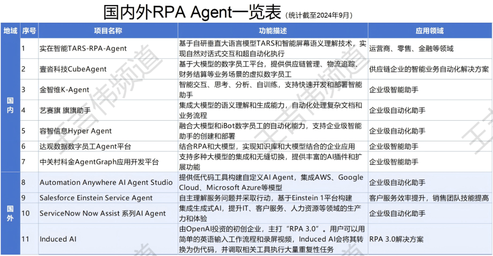
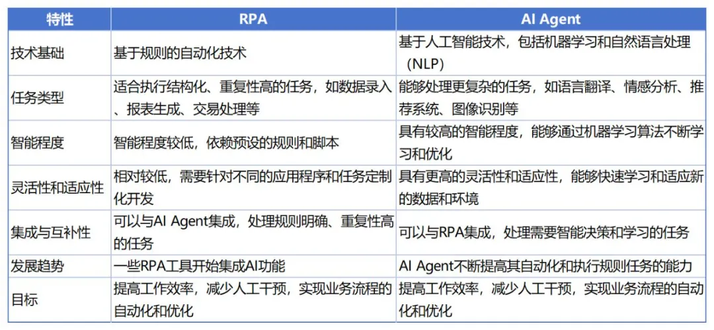
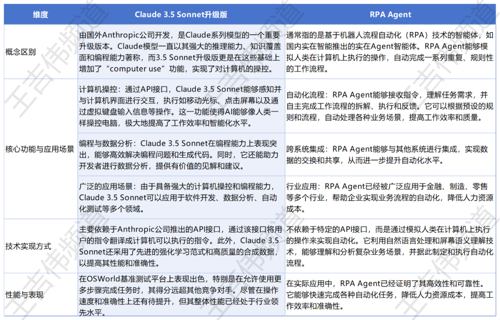

# AI Agent操作PC界面
<!-- more -->
## 关键词
RPA (Robotic Process Automation) 机器人流程自动化
RPA Agent  
Hyperautomation 超自动化
GUI (graphical user interface) 图形用户界面

## 趋势：大语言模型的Agent化
大语言模型的Agent化，将语言模型转变为具备自主决策和执行能力的智能体。这意味着模型不仅能生成文本，还能理解上下文、制定计划并与外部环境交互，从而执行任务，如自动化客服、数据分析或个人助手等。

大语言模型的Agent化是在大模型本身基础上融合了Agent应用，加入了反思、工具应用等技术元素，使得大语言模型本身就成为一个AI Agent。
从而让大模型多了更多的功能，而不需要普通用户再去考虑复杂的提示词或者再去学习如何添加更多的功能。

比如OpenAI前段时间推出的能够推理的o1模型，就是一个AI Agent，可以通过思维链进行反思从而给予用户更好的答案。

Claude 3.5 Sonnet升级版便是Claude进一步Agent化的结果，大模型的直接升级让其实现能够直接操作电脑。Claude 3.5 Sonnet升级版的最大特点是具备计算机使用功能，引入了名为"computer use"的突破性功能，允许AI像人类一样操作计算机，包括查看屏幕、移动光标、点击按钮和输入文本等操作。

## 原理
通过"API接口"和"屏幕识别"操作各种端侧应用 （这些技术早已经被RPA厂商发挥得淋漓尽致） 
- API用于启动各种应用 
- 屏幕识别用于定位和操作应用 
可以理解为AI Agent四种设计方式中的“tool use”  

## Company
Asana、Canva、Cognition、DoorDash、Replit 和 The Browser Company
## 代表性项目
### 微软UFO
微软推出的UFO（User Interface-Focused Agent）是专为Windows操作系统设计的智能体框架，它通过自然语言处理和图形用户界面分析，理解和执行用户的复杂请求。UFO采用双Agent架构，HostAgent负责分析用户请求并选择合适应用程序，而AppAgent在选定应用上执行动作。它能够在多应用程序间无缝操作，处理图像和文本信息，实现多模态输入。

UFO还允许自定义任务和控件，高度可扩展，且操作有保障措施，如提示用户确认敏感操作。由LLM驱动，UFO展现了Windows在AI领域的创新，为操作系统发展提供新方向。

项目地址：https://github.com/microsoft/UFO  

论文：https://arxiv.org/abs/2402.07939

### Cradle
Cradle是一个多模态AI Agent框架，由昆仑万维、北京智源人工智能研究院、新加坡南洋理工大学、北京大学等机构推出。Cradle使AI Agent无需训练便能像人一样直接控制键盘鼠标，实现任意开闭源软件交互。

官网链接：https://github.com/BAAI-Agents/Cradle 

论文：https://arxiv.org/abs/2403.16971

### ScreenAgent
ScreenAgent是一个由吉林大学人工智能学院开发的项目，利用视觉语言模型（VLM）直接控制电脑GUI，实现大模型直接操作电脑的目标。

项目链接：https://github.com/niuzaisheng/ScreenAgent

论文：https://arxiv.org/abs/2402.07945

### PyGPT
PyGPT是一个第三方软件，支持GPT-4、GPT-4V、GPT-3.5和DALL-E 3，以及Langchain/Llama-index提供的所有LLMs，如Llama 3、Mistral、Google Gemini和Anthropic Claude。它具有内置的互联网搜索、语音合成和识别、预设提示、对话历史记录、插件支持等功能。

官网链接：https://pygpt.net/

项目链接：https://github.com/szczyglis-dev/py-gpt

### DesktopGPT
DesktopGPT是由HIX.AI开发的一款桌面应用程序，它将ChatGPT的AI功能扩展到Windows操作系统，使用户能够在任何网站、应用程序、文档和电子邮件上利用人工智能。该程序支持多种AI模型，包括GPT-3.5 Turbo和GPT-4，提供键盘快捷键和预设模板以简化任务。

它还支持200多种语言，适用于Windows和macOS系统，并需要互联网连接。这款应用程序旨在提高生产力，使用户能够快速、轻松地在桌面上使用AI辅助工具。

官网链接：https://desktopgpt.hix.ai/

### Open Interpreter
Open Interpreter是一个开源项目，允许大型语言模型在本地计算机上执行多种编程语言代码，如Python、JavaScript和Shell。它通过自然语言处理技术，将用户的日常语言指令转换为可执行的代码，实现文件操作、数据处理、编程教学等多种功能。用户只需通过简单的语言输入，即可控制计算机完成复杂的任务。

Open Interpreter的安装和使用非常简便，通过pip安装后，在终端运行即可开始交互。此外，它还支持交互式调试和智能上下文理解，提供实时反馈和多步骤任务执行能力。

项目链接：https://github.com/OpenInterpreter/open-interpreter

官网链接：https://www.openinterpreter.com/

### Open-Interface
Open-Interface是一个基于大语言模型（LLM）的计算机自动化工具，它使计算机能够理解并执行自然语言指令，完成各种任务。该工具支持多平台，包括MacOS、Linux和Windows，用户可以通过简单的安装步骤和配置API密钥来使用。其核心功能包括将自然语言请求转化为操作步骤，并通过模拟输入执行这些步骤。它还具备根据屏幕截图进行纠错的能力，确保任务的准确性。

Open-Interface的系统架构设计使其能够处理复杂的用户请求，其成本效益和易于中断操作的特点，为用户提供了灵活的控制选项。

项目地址：https://github.com/AmberSahdev/Open-Interface

开发者博客: https://ambersah.dev/

## 大模型厂商推出的PC操作项目
### 腾讯AppAgent
AppAgent是由腾讯人工智能实验室与德州大学达拉斯分校合作开发的一个基于大型语言模型（LLMs）的多模态智能Agent框架。它的主要功能是模仿人类在手机上操作应用程序的行为，通过自主学习和模仿人类的点击和滑动手势，在手机上执行各种任务。

通过自主探索和观察人类示范，AppAgent能够学习并掌握使用各种应用的技巧，无需访问敏感数据。该Agent已在10种不同应用上成功执行社交媒体上发帖、帮助用户撰写和发送邮件、使用地图、在线购物、图像编辑等50个任务，展现出强大的适应性和学习效率。

项目地址：https://github.com/mnotgod96/AppAgent

### 阿里巴巴：MobileAgent
MobileAgent是阿里巴巴和北京交通大学开发的可以模拟人类操作手机的自主多模态AI Agent。它利用人工智能技术，特别是在多模态大型语言模型的应用，实现移动设备Agent的自主决策和交互。

MobileAgent是一个纯视觉解决方案，不需要系统代码，通过分析手机截图来理解和操作手机界面，实现即插即用。这款AIAgent能够模拟人类操作，自主完成购物、播放音乐、导航、写便签、发邮件等多种任务，且操作范围不受限制，可实现跨应用操作。MobileAgent具有自主任务规划和执行能力，用户无需进行探索和培训即可随时使用。此外，它还具备自反思能力，能够不断优化自身性能。

项目地址：https://github.com/X-PLUG/MobileAgent

### 智谱AI ：CogAgent
CogAgent是由智谱AI联合联合清华大学推出的多模态大模型，专门设计用于理解和导航图形用户界面（GUI）。该模型能够处理高达1120×1120分辨率的图像，具备视觉问答、视觉定位等能力。

CogAgent在多个图像理解基准测试中表现优异，包括VQAv2和STVQA等，并在电脑、手机GUI导航任务中大幅超越了基于LLM的方法。其核心技术包括高分辨率交叉注意力模块，有效降低计算成本。CogAgent-18B模型已在GitHub开源，提供网页版Demo，为自动化测试和智能交互等领域带来新的可能性。

论文地址：https://arxiv.org/abs/2312.08914

模型地址：https://link.juejin.cn/?target=https%3A%2F%2Fhuggingface.co%2FTHUDM%2Fcogagent-chat-hf

### 面壁智能：ProAgent
ProAgent是由面壁智能联合清华大学等机构推出的智能体流程自动化技术，它利用大型语言模型（LLMs）来创建能够动态适应并与队友协作的智能Agent。与传统RPA相比，ProAgent能够自主构建工作流，并在执行中处理复杂决策。

它通过引入DataAgent和ControlAgent来实现数据处理和逻辑控制，支持自然语言指令生成代码，并优化工作流构建过程。ProAgent在多智能体系统中展现了卓越的协作能力，特别是在与人类Agent合作时性能提升了超过10%。

项目地址：https://github.com/OpenBMB/ProAgent

## RPA Agent

## AI Agent 与 RPA

## Same(Control Computer)
## Lucid_Autonomy
https://github.com/RandomInternetPreson/Lucid_Autonomy

## skyvern
https://github.com/Skyvern-AI/skyvern

## computer_use_ootb
https://github.com/showlab/computer_use_ootb?tab=readme-ov-file

## mac_computer_use
https://github.com/deedy/mac_computer_use

## claude-computer-use-macos
https://github.com/PallavAg/claude-computer-use-macos

## Open-Interface
https://github.com/AmberSahdev/Open-Interface

## agent.exe
https://github.com/corbt/agent.exe

## open-interpreter
https://github.com/OpenInterpreter/open-interpreter

## J.A.R.V.I.S
https://github.com/BolisettySujith/J.A.R.V.I.S

## 01-app
https://github.com/OpenInterpreter/01-app

https://github.com/niuzaisheng/ScreenAgent 这里提到了相关项目
## 基准测试
OSWorld  
Windows Agent Arena  

## computer-use
https://github.com/anthropics/anthropic-quickstarts/tree/main/computer-use-demo

## Screen Parsing
### GPT-4V
### OmniParser
Github: https://github.com/microsoft/OmniParser

Model: https://huggingface.co/microsoft/OmniParser/tree/main