# LangChain
## 简介
### what
#### LangChain是一个用于快速构建LLM应用的开源框架
将一些使用LLM时的通用行为进行了抽象，封装为API，统一了使用方式，简化了开发流程

#### 它使应用程序能够：

具有上下文意识：将语言模型连接到上下文的来源（提示指令、少量示例、用于支撑其回应的内容等）。

进行推理：依靠语言模型来进行推理（关于如何基于提供的上下文回答问题、采取什么行动等）。

人机交互这块，模型能力附加

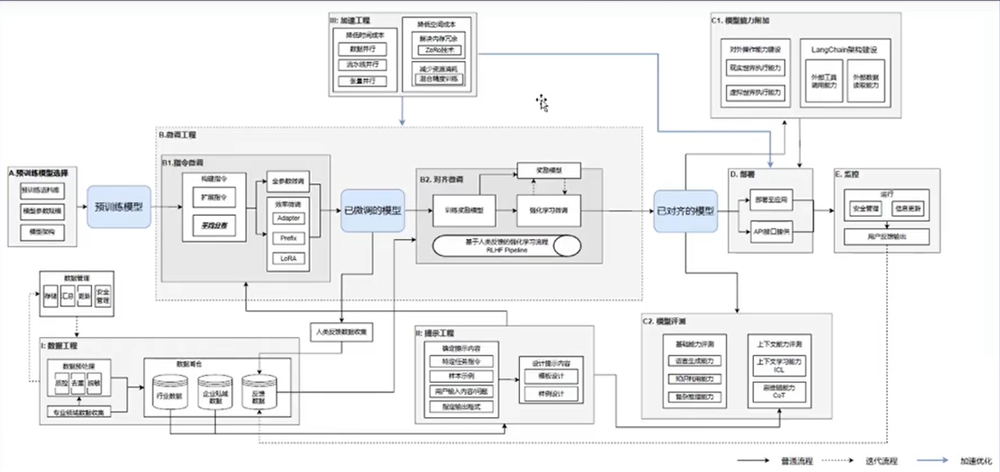

### how

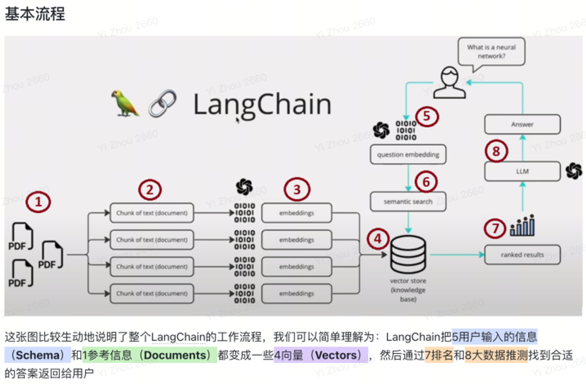

此处的Embedding的选择，很影响效果。
如果用OpenAI的语言模型，最好使用OpenAI的Embedding,效果会更好

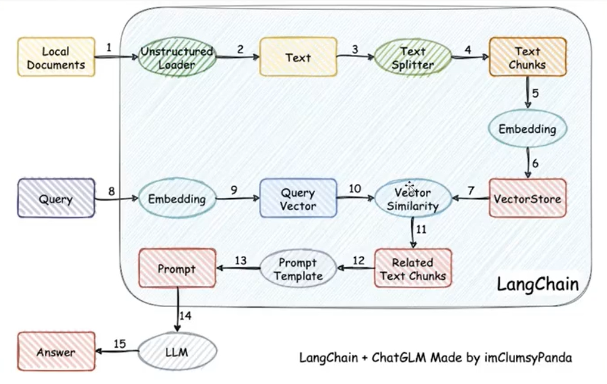

### langchain框架结构
聊天模式是会话模式的一种

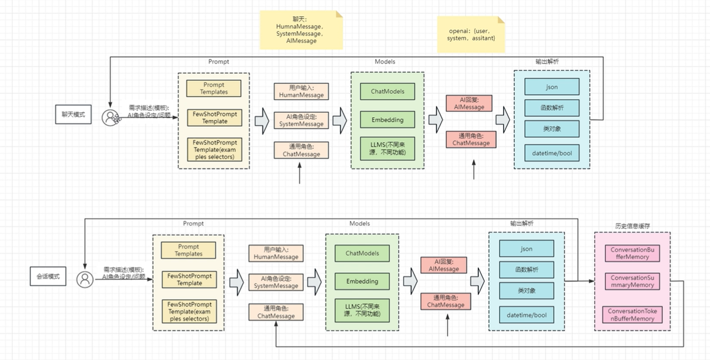

聊天模式、会话模式、检索模式都是一条链路过来的，中间没有任何的循环

agent模式，不符合预期会进行循环，直到符合预期，才输出给用户

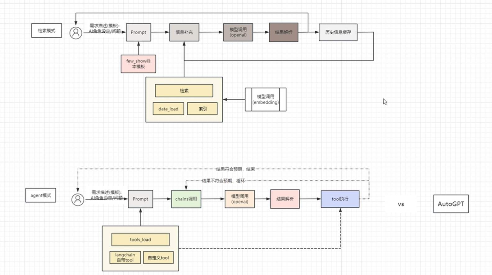

## 架构图(组件化设计)
### 
这些组件共同简化了整个LLM应用程序的生命周期
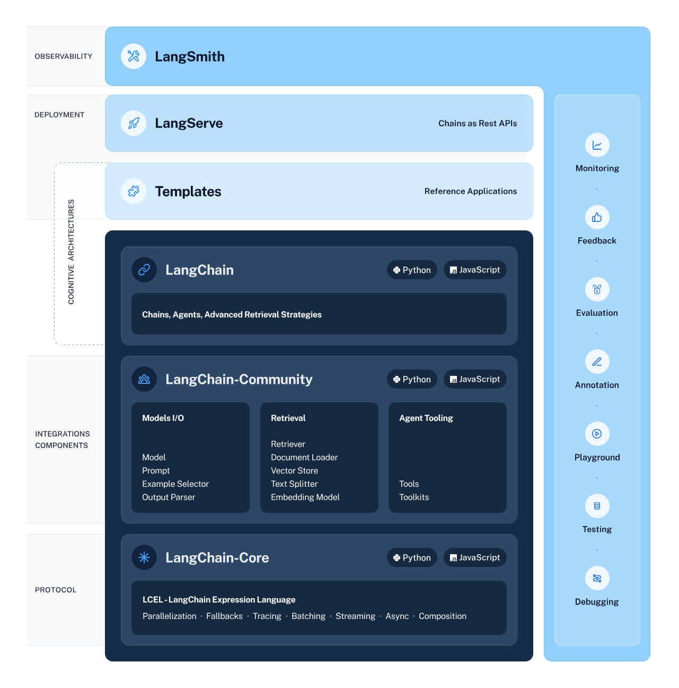

#### LangSmith(产品化)
#####  开发者平台(可观测平台)
Monitoring, Feedback, Evaluation, Annotation, Playground, Testing, Debugging
(监控、反馈、评估、注释、沙盒环境、测试和调试) Langchain的链

#### LangServe(部署)
##### Chains as Rest APIs
将LangChain的链作为REST API进行部署

#### LangChain库(开发)
##### Templates(模板)
###### Reference Applications
一系列易于部署的参考架构，适用于广泛的任务。
提供了参考应用程序的模板，帮助开发者快速部署LangChain应用。

##### langchain包：核心组件，构成应用程序认知架构的链条、代理和检索策略
###### Chains(链)
Off-the-shelf chains(内置的链)

Components

Agents(代理)

Advanced Retrieval Strategies(高级检索策略)

##### langchain-community包：集成组件/第三方集成
###### Model I/O(模型输入/输出处理)
Model(模型)

Prompt(提示)

Example Selector(示例选择器)

Output Parser(输出解析器)

###### Retrieval(检索)
Retriever(检索器)

Document Loader(文档加载器)

Vector Store(向量存储)

Text Splitter(文本分割器)

Embedding Model(嵌入模型)

###### Agent Tooling(代理工具)
Tools(工具)

Toolkits(工具集)

##### langchain-core包（框架基础）：LCEL(LangChain表达式语言, LangChain Expression Language)
Parallelization, Fallbacks, Tracing, Batching, Streaming, Async, Composition
(包括并行化、回退机制、追踪、批处理、流式处理、异步处理和组合等协议)

## 案例
### langchain-Chatchat
#### agent_executor(是一个chain)

智能体/人
##### agent(不是一个chain)

规划能力/大脑(planning)
###### llm_chain
####### prompt
######## prompt_template

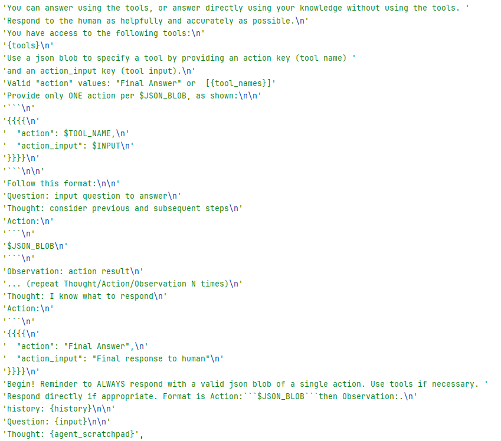

######## tools
######### 是一个chain的
########## search_knowledgebase_complex(搜索本地知识库)
########### Step1：llm_knowledge_chain

根据query和数据库名称，让llm输出哪个数据库查什么信息
############ ChatOpenAI或其他模型
callbacks

############ prompt

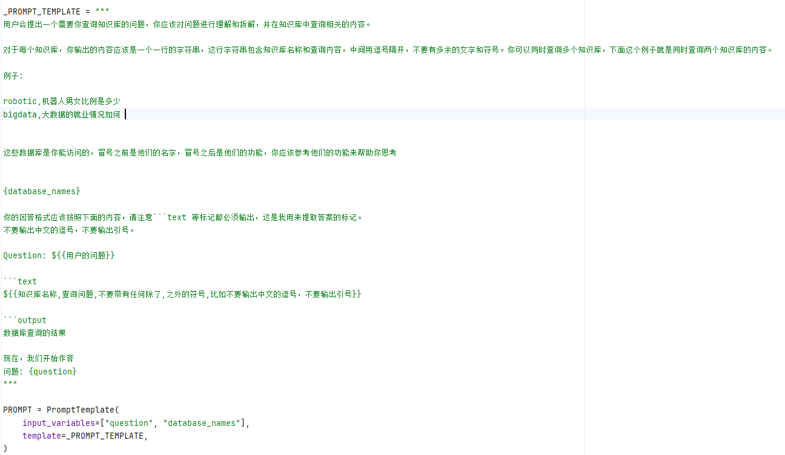

input_key: str = "question"

output_key: str = "answer"

########### Step2：搜索知识库
kb_doc_api.py里的def search_docs函数

########### Step3：rerank（可选，是否启用reranker模型）
############ 文档压缩
from langchain.retrievers.document_compressors.base import BaseDocumentCompressor

########### Step4：llm_chain

和search_internet一致
############ ChatOpenAI或其他模型
callbacks

############ prompt
prompt模板(如图)+context是搜索知识库的结果+question是用户的问题

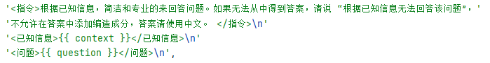

input_key: str = "question"

output_key: str = "answer"

########## calculate
########### llm_math_chain
############ ChatOpenAI或其他模型
callbacks

############ prompt

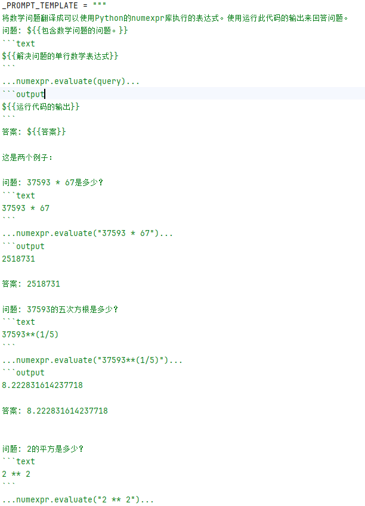

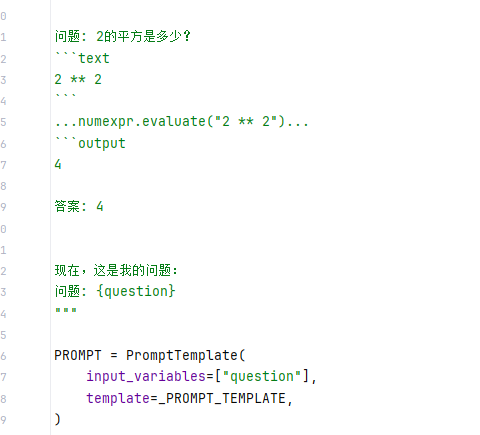

input_key: str = "question"

output_key: str = "answer"

########## weather_chack
########### llm_weather_chain
############ ChatOpenAI或其他模型
callbacks

############ prompt

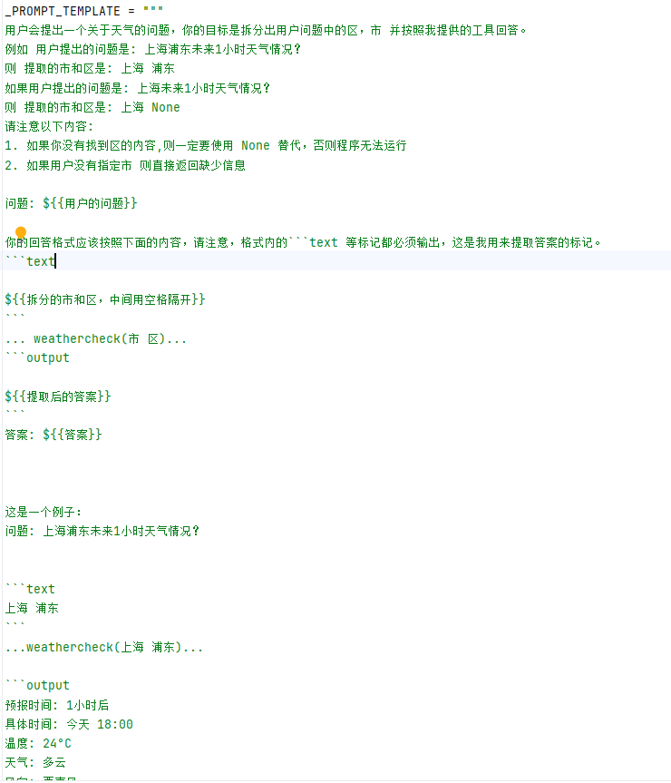

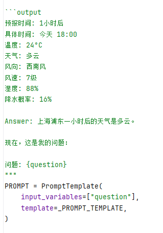

input_key: str = "question"

output_key: str = "answer"

########## search_internet
########### Step1：调API
调搜索引擎API

########### Step2：llm_chain
############ ChatOpenAI或其他模型
callbacks

############ prompt
prompt模板(如图)+context是搜索引擎搜索的结果+question是用户的问题

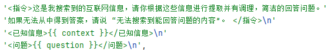

input_key: str = "question"

output_key: str = "answer"

######### 调API的
arxiv

shell

wolfram

search_youtube

####### model
######## ChatOpenAI或其他模型
callbacks

output_parser

###### stop
停止词

###### allowed_tools
tool_names

tools

memory

##### input
用户询问的问题

callbacks

## LangChain Python
### langchain基类
#### 
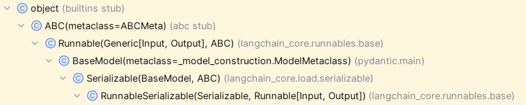

##### RunnableSerializable的子类
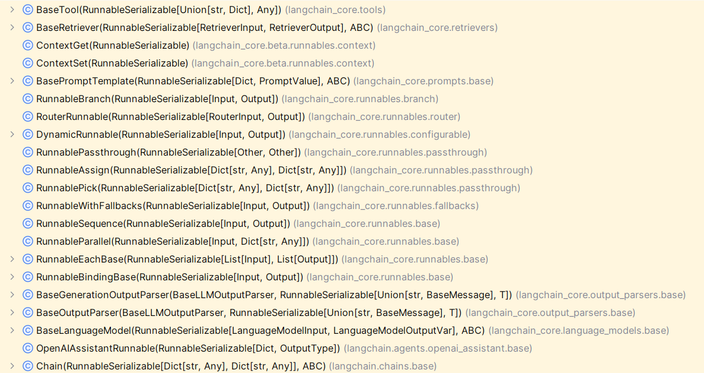

###### Chain
AgentExecutor

BasePromptTemplate

BaseLanguageModel

BaseOutputParser

BaseTool

BaseRetriever

#### LangChain Expression Language(LCEL, LangChain 表达式语言)
##### Runnable
###### 输入输出各有不同
####### Prompt
Dictionary=>PromptValue

####### LLM
Single string, list of chat messages or a PromptValue=>String

####### ChatModel
Single string, list of chat messages or a PromptValue=>ChatMessage

####### OutputParser
The output of an LLM or ChatModel=>Depends on the parser

####### Retriever
Single string=>List of documents

####### Tool
Single string, or dictionary, depending on the tool=>Depending on the tool

###  Model I/O
#### Interface with language models
与模型进行交互

与LLM交互的模块，包括规范输入、调用LLM、规范输出

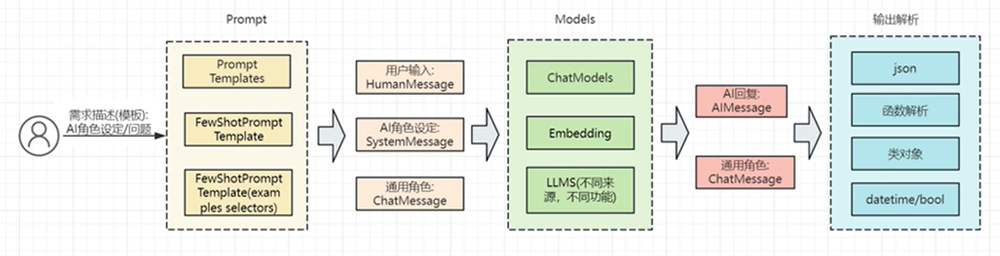

#### Prompts
模板化、动态选择和管理模型输入

##### Prompt templates(Prompt 模板)
带标记的文本字符串，结合用户的输入，生成Prompt

用户的指令和输入，通常是纯文本或者ChatMessage

##### Example selectors(示例选择器)
具体问题的示例

##### prompt
###### BasePromptTemplate
####### BaseChatPromptTemplate
######## ChatPromptTemplate
主要应用是在交互式聊天或对话系统中格式化和构建对话提示，以便根据特定的场景和参数定制对话

format_messages

####### StringPromptTemplate
######## PromptTemplate
######### 方法
from_template

format

FewShotPromptTemplate

###### BaseMessagePromptTemplate
####### BaseStringMessagePromptTemplate
######## SystemMessagePromptTemplate
系统消息提示词模板

HumanMessagePromptTemplate

###### BaseMessage
####### SystemMessage
系统消息，通常作为第一条消息

####### AIMessage
来自AI的Message

####### HumanMessage
来自人的Message

##### prompts
###### 源码位置
所有类源码都在langchain_core的prompts和example_selectors下

所有类都整合在langchain的prompts下
（基础的类整合在base.py中）

###### 基类

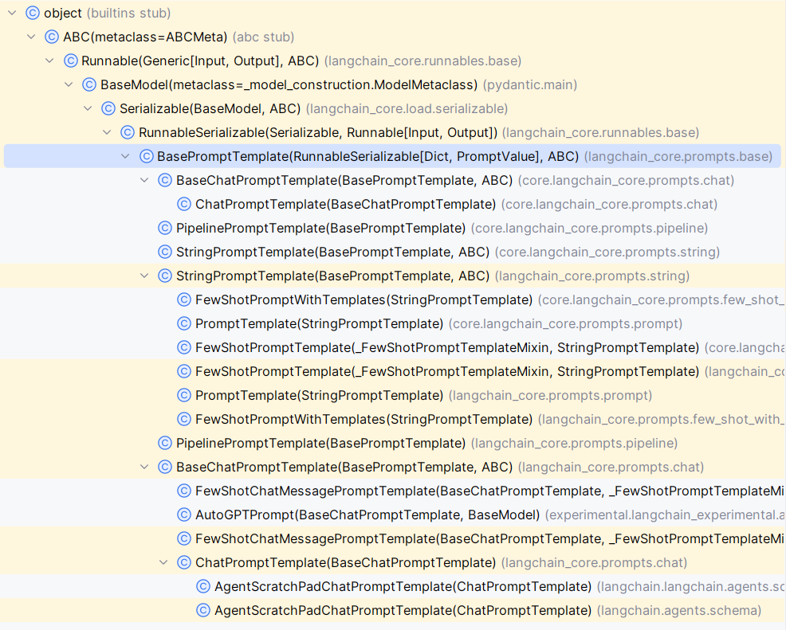

###### prompt = ChatPromptTemplate.from_messages([
    ("system", "You are world class technical documentation writer."),
    ("user", "{input}")
])
转换messages的格式
生成ChatPromptTemplate的一个实例并返回

###### prompt = ChatPromptTemplate.from_messages([
    ("system", "Answer the user's questions based on the below context:\n\n{context}"),
    MessagesPlaceholder(variable_name="chat_history"),
    ("user", "{input}")
])
####### MessagesPlaceholder(variable_name="chat_history")

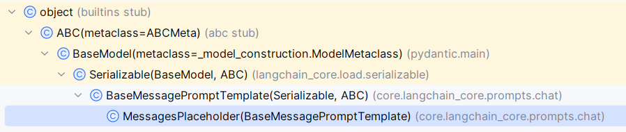

实例化的MessagesPlaceholder

是一个Prompt模板，将变量chat_history看作是一个消息列表

###### prompt = ChatPromptTemplate.from_template("""Answer the following question based only on the provided context:

<context>
{context}
</context>

Question: {input}""")
也是调用的from_messages方法

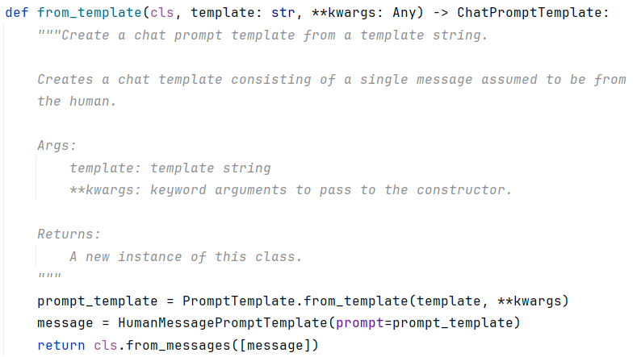

###### ChatPromptTemplate
####### from_messages
########     def from_messages(
        cls,
        messages: Sequence[MessageLikeRepresentation],
    ) -> ChatPromptTemplate:
        """
         Create a chat prompt template from a variety of message formats.
        """
        _messages = [_convert_to_message(message) for message in messages]

        # Automatically infer input variables from messages
        input_vars: Set[str] = set()
        for _message in _messages:
            if isinstance(
                _message, (BaseChatPromptTemplate, BaseMessagePromptTemplate)
            ):
                input_vars.update(_message.input_variables)

        return cls(input_variables=sorted(input_vars), messages=_messages)

######### _convert_to_message
########## 将多种格式的message转为
BaseMessage, 
BaseMessagePromptTemplate, BaseChatPromptTemplate
三种格式中的一种

def _convert_to_message(
    message: MessageLikeRepresentation,
) -> Union[BaseMessage, BaseMessagePromptTemplate, BaseChatPromptTemplate]:
    """Instantiate a message from a variety of message formats.

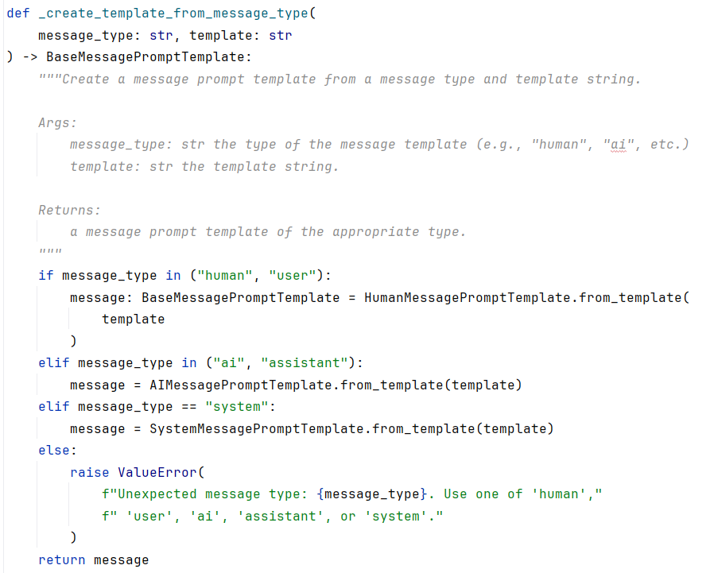

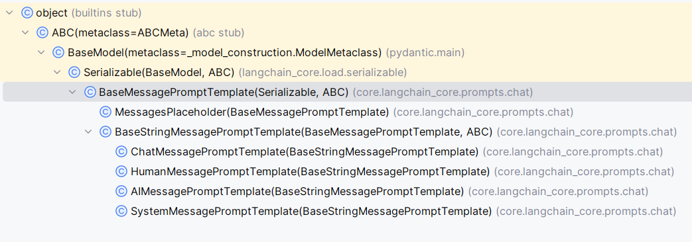

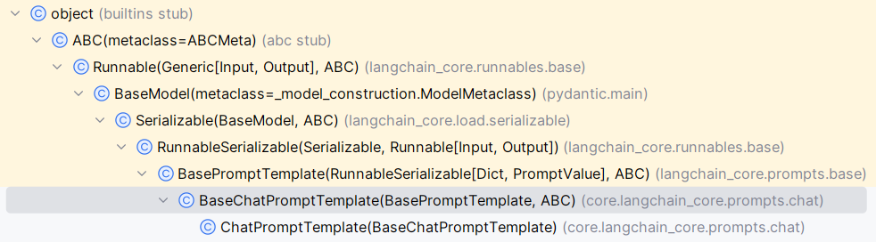

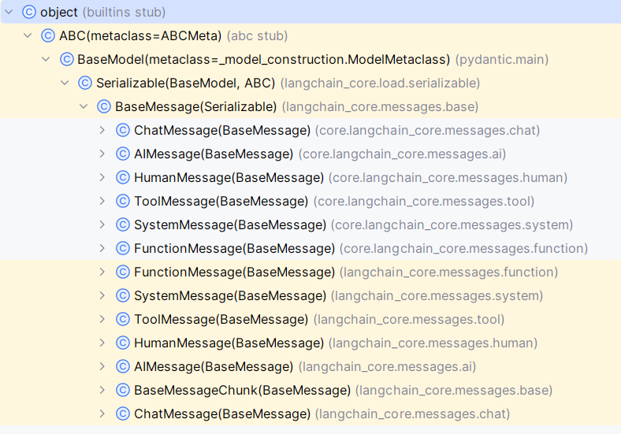

######### return cls(input_variables=sorted(input_vars), messages=_messages)
########## 这里的cls是一个类方法里面的特殊变量，它代指的是当前的类。
使用cls可以调用类的属性和方法，也可以实例化一个新的类对象。

创建一个当前类的实例并返回

####### 类的定义
class ChatPromptTemplate(BaseChatPromptTemplate):
    input_variables: List[str]
    """List of input variables in template messages. Used for validation."""
    messages: List[MessageLike]
    """List of messages consisting of either message prompt templates or messages."""
    validate_template: bool = False
    """Whether or not to try validating the template."""

#### Language models, LLM
##### 通过通用接口调用语言模型
可以将多个LLM结合使用

##### LLMs
###### LLM
####### OpenAI
######## GPT-4
https://openai.com/research/gpt-4

####### Google
######## PaLM
https://palm.com

####### Meta
######## Llama 2
https://ai.meta.com/llama

...

Models that take a text string as input and return a text string(纯文本=>纯文本)

##### Chat models
Models that are backed by a language model but take a list of Chat Messages as input and return a Chat Message

###### ChatMessage=>ChatMessage
type:  System, AI, Human

ChatMessage: type+text

Embeddings

##### LLM
###### BaseLanguageModel
####### 接口
######## predict
str=>str

######## predict_messages
List[BaseMessage]=>BaseMessage

generate_prompt

####### BaseLLM
######## LLM
######### BaseOpenAI
OpenAI

AzureOpenAI

AI21

QianfanLLMEndpoint

LlamaCpp

##### chat_models
###### 源码位置
基础的类源码在langchain_core的language_models的chat_models下

实现的类源码在langchain_community的chat_models下

所有的类都整合在langchain的chat_models下（基础的类整合在base.py中）

###### 经典：ChatOpenAI

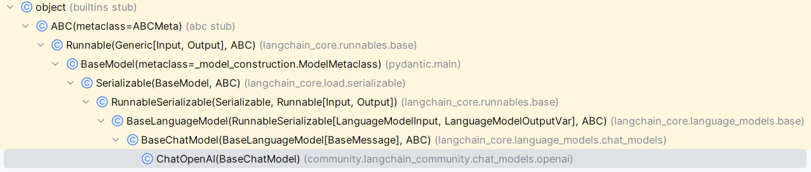

####### llm = ChatOpenAI()
llm.invoke("how can langsmith help with testing?")
######## 总结
######### 实例化
实例化ChatOpenAI对象，使用@root_validator()功能，调用validate_environment函数初始化

######### invoke
1.对用户输入进行数据格式的封装
2.重试调用openai的completion补全API，获取结果（缓存获取中间结果和历史结果）
3.对结果进行解析和封装，返回结果

####### 实例化
@root_validator()
    def validate_environment(cls, values: Dict) -> Dict:
        """Validate that api key and python package exists in environment."""
        if values["n"] < 1:
            raise ValueError("n must be at least 1.")
        if values["n"] > 1 and values["streaming"]:
            raise ValueError("n must be 1 when streaming.")

        values["openai_api_key"] = get_from_dict_or_env(
            values, "openai_api_key", "OPENAI_API_KEY"
        )
        # Check OPENAI_ORGANIZATION for backwards compatibility.
        values["openai_organization"] = (
            values["openai_organization"]
            or os.getenv("OPENAI_ORG_ID")
            or os.getenv("OPENAI_ORGANIZATION")
        )
        values["openai_api_base"] = values["openai_api_base"] or os.getenv(
            "OPENAI_API_BASE"
        )
        values["openai_proxy"] = get_from_dict_or_env(
            values,
            "openai_proxy",
            "OPENAI_PROXY",
            default="",
        )
        try:
            import openai

        except ImportError:
            raise ImportError(
                "Could not import openai python package. "
                "Please install it with `pip install openai`."
            )

        if is_openai_v1():
            client_params = {
                "api_key": values["openai_api_key"],
                "organization": values["openai_organization"],
                "base_url": values["openai_api_base"],
                "timeout": values["request_timeout"],
                "max_retries": values["max_retries"],
                "default_headers": values["default_headers"],
                "default_query": values["default_query"],
                "http_client": values["http_client"],
            }

            if not values.get("client"):
                values["client"] = openai.OpenAI(**client_params).chat.completions
            if not values.get("async_client"):
                values["async_client"] = openai.AsyncOpenAI(
                    **client_params
                ).chat.completions
        elif not values.get("client"):
            values["client"] = openai.ChatCompletion
        else:
            pass
        return values

####### invoke
######## BaseChatModel
######### 1）invoke
########## 
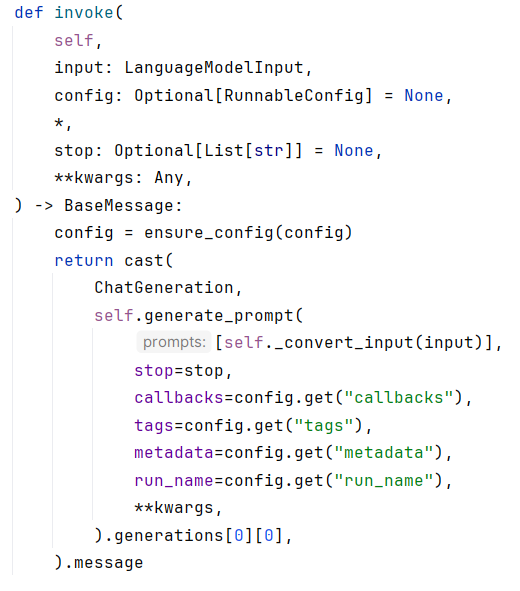

########### 细节
1.调用generate_prompt方法->LLMResult

2.取LLMResult.generations[0][0]结果，类型为Generation，这里转为ChatGeneration

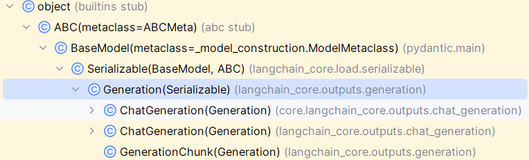

3.取ChatGeneration.message结果，类型为BaseMessage

########### 2）_convert_input

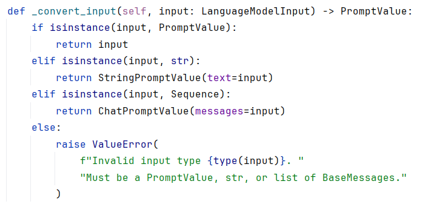

########### 3）generate_prompt
############ 
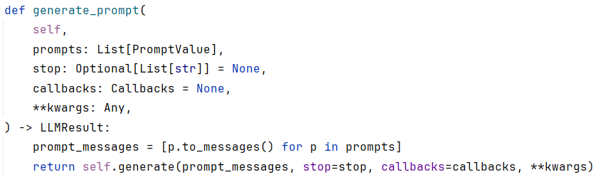

############# 4）generate
##############     def generate(
        self,
        messages: List[List[BaseMessage]],
        stop: Optional[List[str]] = None,
        callbacks: Callbacks = None,
        *,
        tags: Optional[List[str]] = None,
        metadata: Optional[Dict[str, Any]] = None,
        run_name: Optional[str] = None,
        **kwargs: Any,
    ) -> LLMResult:
        """Pass a sequence of prompts to the model and return model generations.

        """
        results = []
        for i, m in enumerate(messages):
            try:
                results.append(
                    self._generate_with_cache(
                        m,
                        stop=stop,
                        run_manager=run_managers[i] if run_managers else None,
                        **kwargs,
                    )
                )
            except BaseException as e:
                raise e
        llm_output = self._combine_llm_outputs([res.llm_output for res in results])
        generations = [res.generations for res in results]
        output = LLMResult(generations=generations, llm_output=llm_output) 
        return output
############### 5）_generate_with_cache
def _generate_with_cache(
        self,
        messages: List[BaseMessage],
        stop: Optional[List[str]] = None,
        run_manager: Optional[CallbackManagerForLLMRun] = None,
        **kwargs: Any,
    ) -> ChatResult:
      return self._generate(messages, stop=stop, **kwargs)

######## ChatOpenAI
######### 6）_generate
########## 
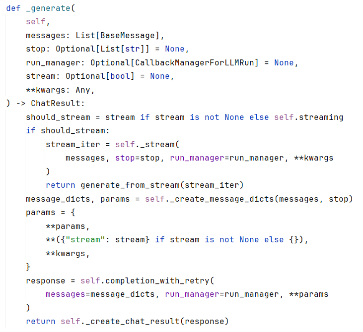

########### 7）_create_message_dicts
############ 
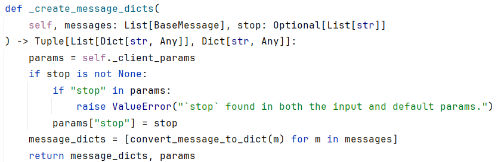

############# 8）convert_message_to_dict

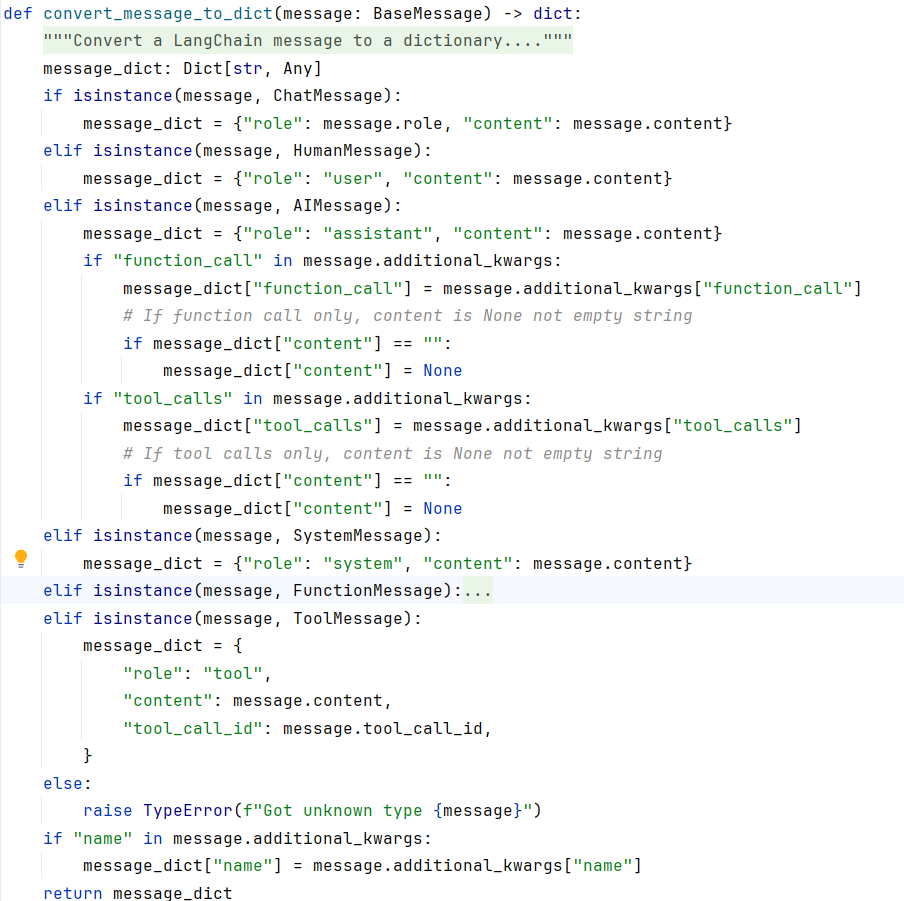

########### 9）completion_with_retry
############ 
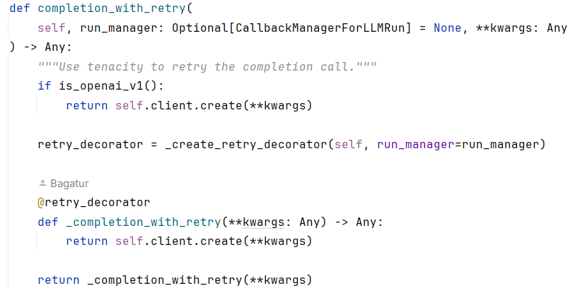

真正的调用openai的补全API

from openai import OpenAI

OpenAI().chat.completions.create(xxx)

疑问：self.client什么时候被赋值的

########### 10）_create_chat_result

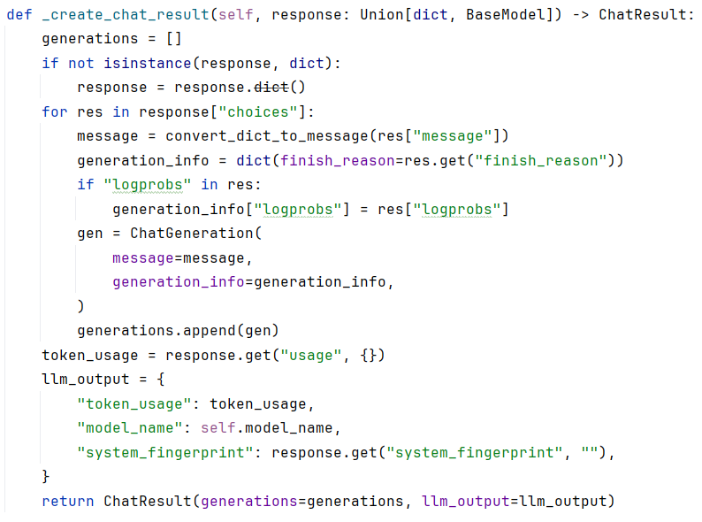

######### 11）_combine_llm_outputs

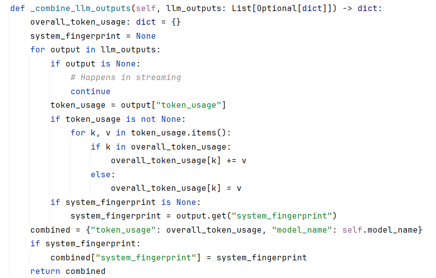

#### Output parsers
从模型中提取信息

List Parser

...

##### BaseLLMOutputParser[T]
###### BaseOutputParser
####### ListOutputParser
str=>List[str]

将输出格式化为逗号分隔的字符串列表

JSONAgentOutputParser

##### output_parsers
###### 源码位置
####### 源码
langchain_core的output_parsers下

langchain_core的outputs下

langchain_core的pydantic_v1下

所有的类都整合在langchain的output_parsers或schema或pydantic_v1下

###### output_parser = StrOutputParser()
实例化StrOutputParser

StrOutputParser

### Chains(链，工作流模块)
#### 作用
Construct sequences of calls(构造调用序列)

#### 特点
- 有状态（Stateful）：为任何 Chain 添加 Memory，即可为其赋予状态。

- 可观察（Observable）：向 Chain 传递 Callbacks，就执行主组件调用序列之外的附加功能，如日志记录。

- 可组合（Composable）：Chain API 足够灵活，便于将 Chain 与其他组件结合，包括其他 Chain。

#### Chain
##### 属性
###### memory
在chain开始的时候组装inputs

在chain结束的时候保存inputs和outputs

###### callbacks
回调，插桩，可在chain执行的过程中插桩

##### 源码位置
所有的源码都在langchain的chains下

##### 接口
###### invoke
####### 源码
########     def invoke(
        self,
        input: Dict[str, Any],
        config: Optional[RunnableConfig] = None,
        **kwargs: Any,
    ) -> Dict[str, Any]:
        config = ensure_config(config)
        callbacks = config.get("callbacks")
        tags = config.get("tags")
        metadata = config.get("metadata")
        run_name = config.get("run_name")
        include_run_info = kwargs.get("include_run_info", False)
        return_only_outputs = kwargs.get("return_only_outputs", False)

        inputs = self.prep_inputs(input) # 验证和准备chain的输入，包括添加来自memory的输入
        callback_manager = CallbackManager.configure(
            callbacks,
            self.callbacks,
            self.verbose,
            tags,
            self.tags,
            metadata,
            self.metadata,
        )
        new_arg_supported = inspect.signature(self._call).parameters.get("run_manager") # 看是否支持run_manager，即看_call的参数是否有run_manager
        run_manager = callback_manager.on_chain_start(
            dumpd(self),
            inputs,
            name=run_name,
        )
        try:
            outputs = (
                self._call(inputs, run_manager=run_manager) # chain的子类实现
                if new_arg_supported
                else self._call(inputs)
            )
        except BaseException as e:
            run_manager.on_chain_error(e)
            raise e
        run_manager.on_chain_end(outputs)
        final_outputs: Dict[str, Any] = self.prep_outputs( # 验证并准备chain的输出，并将此次运行的信息保存到memory中
            inputs, outputs, return_only_outputs
        )
        if include_run_info:
            final_outputs[RUN_KEY] = RunInfo(run_id=run_manager.run_id)
        return final_outputs
######### 逻辑
########## prep_inputs
########### 准备输入参数
验证和准备chain的输入，包括添加来自memory的输入

########### 和memory.load_memory_variables组合组装新的inputs
memory相关

########## ctx.on_chain_start
callback相关

########## self._call
抽象方法，子类实现

########## ctx.on_chain_error
callback相关

########## ctx.on_chain_end
callback相关

########## prep_outputs
########### 准备输出结果
验证并准备chain的输出，并将此次运行的信息保存到memory中

########### memory.save_context
############ 将inputs, outputs保存到memory
memory相关

####### 其他形式本质也是调用invoke
######## run
底层是__call__

######## __call__
底层是invoke

##### 实现
_call

###### 实现类
####### 所有的chain映射
type_to_loader_dict

APIChain

LLMChain

####### BaseQAWithSourcesChain
问答链

######## RetrievalQAWithSourcesChain
基于BaseRetriever实现问答

######## VectorDBQAWithSourcesChain
基于VectorStore实现问答

QAWithSourcesChain

###### 常见Chain
####### LLMChain
连接LLM

####### RouterChain
根据输入/上下文决定使用哪一条Chain、Prompt

####### SequentialChain
######## 串行执行Chain
单输入输出

多输入输出

####### StuffDocumentsChain
直接把内容填充到Document中

只适合文档比较小的，大文档就不适用了

RefineDocumentsChain

####### MapReduceDocumentsChain
将大文档分成小文档分别执行，然后合并结果

####### MapRerankDocumentsChain
适用于大文档的问答，会得到多个结果和分数，根据分数返回

#### chains的使用
chain = prompt | llm

chain = prompt | llm | output_parser

document_chain = create_stuff_documents_chain(llm, prompt)

retrieval_chain = create_retrieval_chain(retriever, document_chain)

retriever_chain = create_history_aware_retriever(llm, retriever, prompt)

chain.invoke({"input": "how can langsmith help with testing?"})

response = retrieval_chain.invoke({"input": "how can langsmith help with testing?"})

retriever_chain.invoke({
    "chat_history": chat_history,
    "input": "Tell me how"
})

### AgentExecutor(Agents模块，代理模块)
AgentExecutor=Agent+Memory+Tools

#### AgentExecutor._call
##### 源码流程图

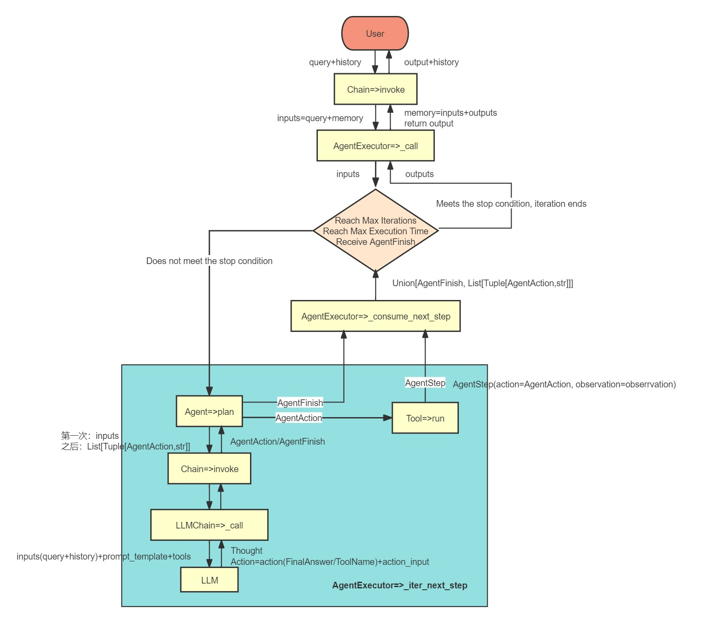

##### 迭代器
###### 停止条件
####### iterations>=self.max_iterations
迭代次数限制

####### time_elapsed>=self.max_execution_time
迭代时间限制

####### isinstance(next_step_output, AgentFinish)
停止信号AgentFinish

###### 迭代函数_take_next_step
####### 逻辑
######## _prepare_intermediate_steps
预处理参数

######## agent.plan
######### 抽象方法，在具体的Agent里实现
执行agent的plan方法, 得到AgentAction列表

######## tool
根据AgentAction得到tool或者tool不存在

######### 合法tool
tool.run

######### tool不存在
InvaildTool

######## result
将tool的执行结果append到result返回

####### _take_next_step源码
######## 
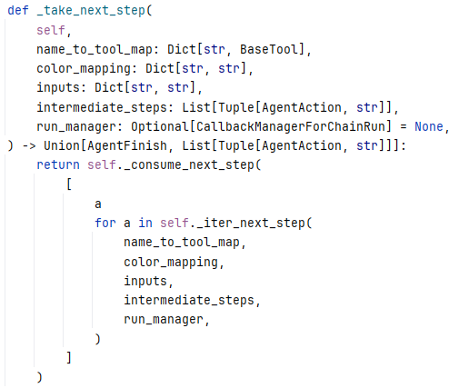

######### self._iter_next_step
########## 1.调LLM生成一个计划plan
plan要么是AgentFinish，要么是AgentAction

2.如果是AgentFinish则返回，结束

3.如果是AgentAction则调对应的工具

4.调对应工具生成observation

5.生成并返回AgentStep(action=agent_action, observation=observation)，结束

######### self._consume_next_step
########## 返回Union[AgentFinish, List[Tuple[AgentAction, str]]]
如果是AgentFinish，直接返回

########### 如果是AgentStep，则转换为List[Tuple[AgentAction,str]]后返回
return [
                (a.action, a.observation) for a in values if isinstance(a, AgentStep)
            ]

##### _call源码
    def _call(
        self,
        inputs: Dict[str, str],
        run_manager: Optional[CallbackManagerForChainRun] = None,
    ) -> Dict[str, Any]:
        """Run text through and get agent response."""
        # Construct a mapping of tool name to tool for easy lookup
        name_to_tool_map = {tool.name: tool for tool in self.tools}
        # We construct a mapping from each tool to a color, used for logging.
        color_mapping = get_color_mapping(
            [tool.name for tool in self.tools], excluded_colors=["green", "red"]
        )
        intermediate_steps: List[Tuple[AgentAction, str]] = []
        # Let's start tracking the number of iterations and time elapsed
        iterations = 0
        time_elapsed = 0.0
        start_time = time.time()
        # We now enter the agent loop (until it returns something).
        while self._should_continue(iterations, time_elapsed):
            next_step_output = self._take_next_step(
                name_to_tool_map,
                color_mapping,
                inputs,
                intermediate_steps,
                run_manager=run_manager,
            )
            if isinstance(next_step_output, AgentFinish):
                return self._return(
                    next_step_output, intermediate_steps, run_manager=run_manager
                )

            intermediate_steps.extend(next_step_output)
            if len(next_step_output) == 1:
                next_step_action = next_step_output[0]
                # See if tool should return directly
                tool_return = self._get_tool_return(next_step_action)
                if tool_return is not None:
                    return self._return(
                        tool_return, intermediate_steps, run_manager=run_manager
                    )
            iterations += 1
            time_elapsed = time.time() - start_time
        output = self.agent.return_stopped_response(
            self.early_stopping_method, intermediate_steps, **inputs
        )
        return self._return(output, intermediate_steps, run_manager=run_manager)

#### Agent
##### initialize_agent
工厂函数，构造AgentExecutor

##### 内置类型
###### AGENT TO CLASS
一个map, 映射agent type字符串到class

###### zero-shot-react-description
根据工具的描述来确定要使用的工具，可以提供任意数量的工具。要求为每个工具提供说明

最通用的操作代理

A zero shot agent that does a reasoning step before acting

ZeroShotAgent

###### react-docstore
####### 只允许存在两个工具，并且工具名必须为Lookup和Search
Search:从文档库中检索相关的页面

Lookup:从检索出的相关页面中，查找相关的具体内容

使用传统的检索方法来存储和检索信息

ReActDocstoreAgent

###### self-ask-with-search
根据需要执行搜索并问一些进一步的问题，以获得最终的答案

SelfAskDocstoreAgent

###### conversational-react-description
拥有记忆能力

ConversationalAgent

###### chat-zero-shot-react-description
ChatAgent

###### chat-conversational-react-description
ConversationalChatAgent

###### structured-chat-zero-shot-react-description
StructuredChatAgent

###### openai-functions
OpenAIFunctionsAgent

###### openai-multi-functions
OpenAIMultiFunctionsAgent

##### output parser
###### AgentOutputParser
OpenAIFunctionAgentOutputParser

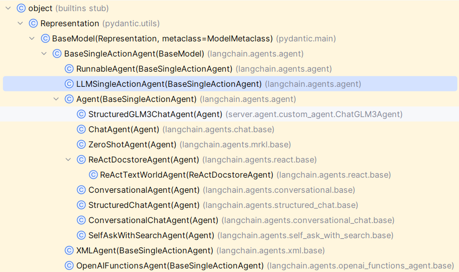

##### 核心方法：plan方法
###### LLMSingleActionAgent的实现
####### 
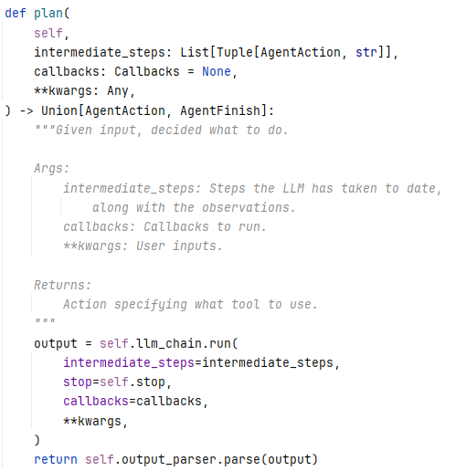

######## 走Chain的invoke方法 -> LLMChain的_call方法

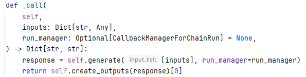

##### Agents(代理模块)
###### 有些时候，需要根据用户的输入动态选择要调用的LLM或者其他工具(Tools)，抽象为Agent
代理模块集成了各类工具，由LLM决定要不要使用工具以及使用什么工具

###### Planning(规划)
####### Task Decomposition
######## Chain-of-Thought
https://arxiv.org/abs/2201.11903

######## Tree of Thoughts
https://arxiv.org/abs/2305.10601

####### Self-Reflection
######## ReAct
https://react-lm.github.io

######## Reflexion
https://arxiv.org/abs/2303.11366

######## Chain of Hindsight
https://arxiv.org/abs/2302.02676

###### Memory(记忆)
Memory类型(Types of Memory)

MIPS(Maximum Inner Product Search)

Tools(工具)

##### BaseSingleActionAgent
###### 接口
plan

Agent

#### Memory(记忆模块)
记忆模块，记录对话，支持存储用户与LLM交互的上下文，以便优化后续的交互，是一个Key-Value存储。包括局部存储和全局存储(全局存储是可供不同chain共享的)

##### 补充历史上下文
Persist application state between runs of a chain

We call this ability to store information about past interactions "memory"

##### 常见Memory
###### ConversationBufferMemory
基于历史对话

###### ConversationBufferWindowMemory
基于最后k个对话

###### ConversationEntityMemory
从对话构建实体有关信息，基于实体信息

###### ConversationKGMemory
基于知识图谱

###### ConversationSummaryMemory
####### 对历史会话进行总结
优点是数据量可控，适合长对话

缺点是总结会消耗Token

###### ConversationSummaryBufferMemory
保留最近K个会话，并且会对会话进行总结

###### ConversationTokenBufferMemory
保留最后N个Token

###### VectorStoreRetrieverMemory
和向量数据库结合，基于相关度最高的K个Document

##### BaseMemory
memory是chain的状态，可以存储和获取chain的上下文

###### 接口
####### memory_variables
支持的变量key列表

####### load_memory_variables
加载已有的数据

####### save_context
将input和output保存到chain

####### clear
清除状态

实现

#### Tool
##### BaseTool
###### 接口
####### description
Agent主要根据description来判断接下来将要采用哪个工具来执行后续的操作

这个描述准确比较重要

####### _run
Tool的执行逻辑

是抽象方法，需要用户自行实现

####### run
调用的_run

###### 实现
JiraAction

GmailSearch

...

##### BaseToolKit
可以理解为Tool的列表

###### 接口
####### get_tools
返回BaseTool列表

###### 实现
####### VectorStoreToolkit
######## 包含的Tool
VectorStoreQATool

VectorStoreQAWithSourcesTool

######## 其他
基于VectorStore实现

#### 哥哥谈生产级的智能体应该具备哪些能力
##### LLM
###### 文本
Answer

Function Call

多模态

##### Prompt
###### 自定义
####### Template(脚本)
variables

fixed

placeholder

expression

运行时

##### LORA/Model Params
###### LORA
是专门领域的LLM

###### Model Params
LLM可调节的参数

##### Tools
###### APIs
调API的

###### retriever_tool
把检索知识库的能力作为一个工具

Environments(极轻量容器)

##### Knowledge Base(知识库，所有存起来的数据)
知识图谱

###### 数据库
MongoDB

####### K-V数据库
Redis

向量数据库

Retriever

文档切片

Embedding模型

##### Retriever
###### 问题
####### q1
######## 将user_query改写
model1

####### q2
######## 需求文档/tool description
model2

###### 资源(向量，高维空间)
####### KB Unit(Knowledge Base Unit)
embedding model

####### Tool API
embedding model

###### 匹配算法
####### network
q1+q2

####### network
KB Unit + Tool API

算加权分：相邻匹配和es最长子序列

Recall=>粗排=>精排

###### 结果
拿到与user_query,prompt需要的KB Unit/Tool API集合（一般5个）

##### Code
LLM生成前后流程控制

Callback

##### Agent Orchestration(Agent编排)
将复杂任务拆解（LLM可能要运行成千上万次，如：帮我写一个能跑起来的网站）

###### 类似Game Engine
####### 两种实现方式
######## Graph
LangGraph

AgentFlow

######## Language
SGLang

ProAgent

##### Hierarchy Memory(多级Memory)
###### Context Prompt
作为input的一部分传入

Messages

###### History/Memory
存储到向量数据库中进行检索

1.积累 2.裁剪/摘要

###### 分类
####### 有timeline的
时间胶囊

####### 无timeline的
存KB Unit再组织

##### 贯穿全流程的能力
###### 计费
各类型token数*单价

Tool Api调用次数*单价

memory占空间大小费用

###### A/B实验
####### tags
全链路trace追踪埋点+报表

###### Feedback
将KB Unit 和 Tool API的调用结果总结调用经验到description中

###### Observability(可观测性)
####### PlayGround（可观测可调试平台）
调试

####### 参考浏览器event lines
每个具体event按时间线，或串行或并行排列

######## 每个具体的event指
一次agent call

一次llm调用

一次callback回调

####### 传统互联网
log

metric

trace

### Retrieval(检索模块/集成数据源模块)
#### BaseLoader
Document加载器

##### 方法
###### load
List[Document]

###### load_and_split
List[Document]

###### lazy_load
Iterator[Document]

##### 子类
###### TextLoader
加载文本数据

###### RecursiveUrlLoader
从链接加载

###### WebBaseLoader
用urllib加载网页

BeautifulSoup解析网页

CSVLoader

DirectoryLoader

JSONLoader

###### UnstructuredBaseLoader
####### UnstructuredFileLoader
UnstructuredHTMLLoader

UnstructuredMarkdownLoader

#### Document
文本+meta信息

#### BaseDocumentTransformer
Document转换器

##### 方法
transform_documents

##### TextSplitter
文本分割

###### 方法
####### create_documents
List[Document]

####### split_text
List[str]

####### split_documents
List[Document]

###### 子类
RecursiveCharacterTextSplitter

####### CharacterTextSplitter
按字符拆分

####### NLTKTextSplitter
使用NLTK算法按自然语言拆分

SentenceTransformersTokenTextSplitter

#### Embeddings
向量表示

##### 方法
###### embed_documents
List[str]=>List[List[float]]

批量执行

###### embed_query
str=>List[float]

将文本向量化

##### QianfanEmbeddingsEndpoint
百度千帆

#### VectorStore
向量数据库

##### 方法
###### add_texts
iterable[str]=>List[str]

添加数据

###### delete
通过vector ID删除数据

###### add_documents
List[Document]=>List[str]

###### search
搜索数据

str=>List[Document]

##### 实现
###### AlibabaCloudOpenSearch
阿里云

Chroma

...

#### BaseRetriever
检索器

#### Retrieval(集成数据源模块/检索模块)
Note:发音[吹]
##### Interface with application-specific data
集成其他数据源的抽象

包括加载数据，数据向量化、向量数据的存储和获取

##### Document loaders(数据加载)
数据源加载器，包含文本和元数据
(A document is a piece of text and associated metadata)

###### 常见loaders
CSV

File Directory

HTML

JSON

Markdown

PDF

##### Document transformers(数据处理)
###### 将加载的Document进行进一步处理，以便更好的来使用
(Once you've loaded documents, you'll often want to transform them to better suit your application)
Text splitters

Post retrieval

##### Text embedding models
向量化

##### Vector stores(向量存储)
存储和搜索非结构化数据的最常见方式之一是将其向量化
(One of the most common ways to store and search over unstructured data is to embed it and store the resulting embedding vectors)

###### 常见向量数据库
####### Chroma
https://www.trychroma.com

https://github.com/chroma-core/chroma

####### Pinecone
https://www.pinecone.io

####### Weaviate
https://weaviate.io

####### Milvus
https://milvus.io

####### Faiss
https://faiss.ai

##### Retrievers(检索器)
A retriever is an interface that returns documents given an unstructured query

将Document和Language models结合

上一节的Vector stores可以作为Retrievers的backbone(骨干, 支撑)，但是也有其他的实现

### Callbacks(回调模块)
切面(Aspect)/钩子(Hook)/插桩

Log and stream intermediate steps of any chain

允许在使用Langchain构造应用的任意阶段插入用户自定义的Callback。

计费，流速控制，日志

#### CallbackManager
on_llm_start

on_chat_model_start

on_chain_start

on_tool_start

on_retriever_start

