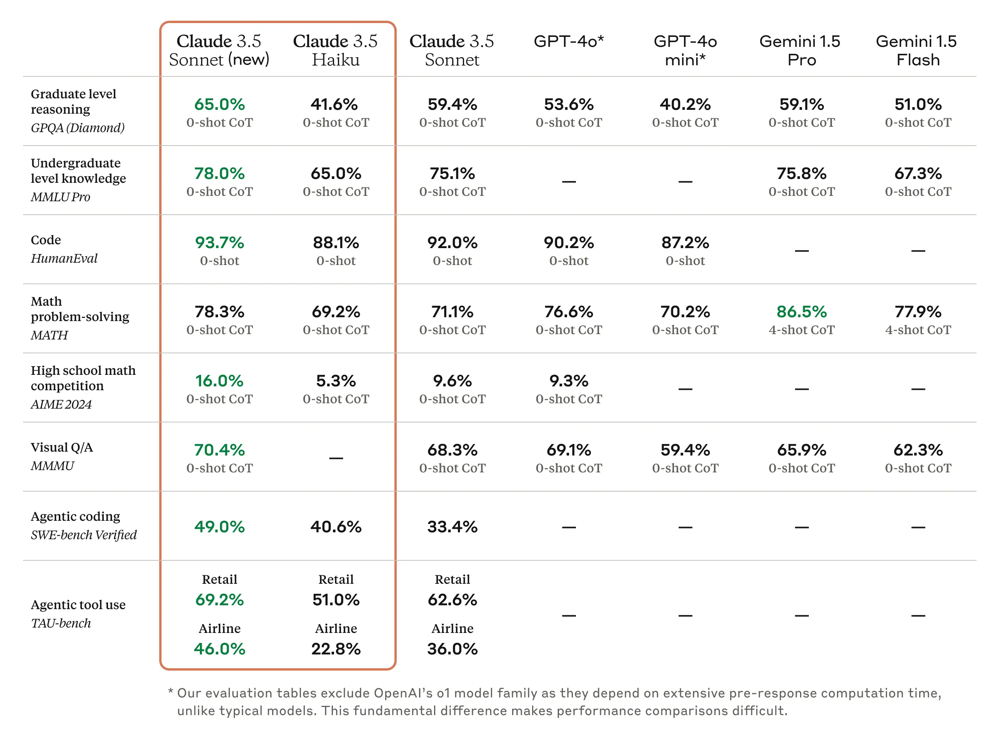

# Claude 3.5 Sonnet: Computer use
 
<!-- more -->
## 来源
公司：Anthropic

官方文章：

[1. Introducing computer use, a new Claude 3.5 Sonnet, and Claude 3.5 Haiku](https://www.anthropic.com/news/3-5-models-and-computer-use)

[2. Developing a computer use model](https://www.anthropic.com/news/developing-computer-use)

官方演示视频：

https://www.youtube.com/playlist?list=PLf2m23nhTg1NcDu3_eZavbTJ3Dow9QQRB

代码实现：

https://github.com/anthropics/anthropic-quickstarts/tree/main/computer-use-demo

## industry benchmarks
-  SWE-bench Verified（coding）
-  TAU-bench（an agentic tool use task）
-  OSWorld (evaluates AI models' ability to use computers like people do)
  
性能测评结果：

For OSWorld, Claude 3.5 Sonnet scored 14.9% in the screenshot-only category

## API
Anthropic API, Amazon Bedrock, and Google Cloud’s Vertex AI

支持通过Anthropic API、Amazon Bedrock和Google Cloud的Vertex AI进行调用
  

## Computer Use
use computers the way people do—by looking at a screen, moving a cursor, clicking buttons, and typing text

translate instructions (e.g., “use data from my computer and online to fill out this form”) into computer commands (e.g. check a spreadsheet; move the cursor to open a web browser; navigate to the relevant web pages; fill out a form with the data from those pages; and so on)

to interpret what’s happening on a screen and then use the software tools available to carry out tasks

Claude looks at screenshots of what’s visible to the user, then counts how many pixels vertically or horizontally it needs to move a cursor in order to click in the correct place. Training Claude to count pixels accurately was critical. 

self-correct and retry tasks when it encountered obstacles

- 1.将用户指令拆解为计算机的一个个命令
- 2.通过屏幕截图观察任务进度，使用工具执行任务
- 3.将光标定位到特定的位置
- 4.自我纠正和重试

## 未来发展方向
- 提高安全性
- 降成本
- 提速度
- 降低错误率，提升可靠性
- 支持更多操作（dragging, zooming, and so on）
- 改变观察屏幕截图到更细粒度的视频流
  - The “flipbook” nature of Claude’s view of the screen—taking screenshots and piecing them together, rather than observing a more granular video stream—means that it can miss short-lived actions or notifications.
  - Claude屏幕视图是 “翻书 ”式的，即截图并拼凑在一起，而不是观察更细粒度的视频流，这意味着它可能会错过短暂的操作或通知。