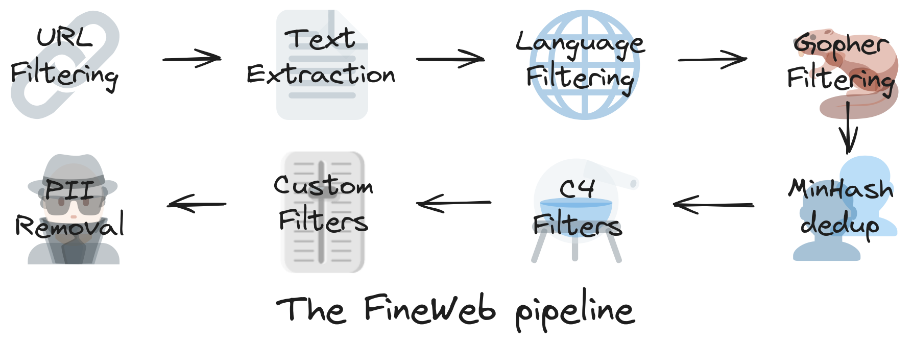

# 预训练数据集 FindWeb
https://huggingface.co/datasets/HuggingFaceFW/fineweb

https://huggingface.co/datasets/HuggingFaceFW/fineweb-edu

https://huggingface.co/datasets/HuggingFaceFW/fineweb-2

## 找原始数据
两个选择
- 自己爬取（像OpenAI和Anthropic就是这么做的）
- 使用已爬网页的公开仓库，如CommonCrawl
    - [https://commoncrawl.org/](https://commoncrawl.org/)

## 大规模处理
开源的数据处理库：https://github.com/huggingface/datatrove

## 评估数据的好坏
在数据集的代表性子集上训练小模型，并在评估任务集上评估它们
- 使用小模型是为了控制训练成本和时间
- 重要的是选择一个多样化且具有代表性的数据集-评估任务集，并尽量避免对任何一个单独的基准过度拟合（overfit），因为这可能会损害预训练后获得的大语言模型（LLM）的泛化能力

## FindWeb Pipeline

Step1: text extraction
CommonCrawl 数据有两种主要格式：WARC 和 WET。
- WARC（Web ARChive 格式）文件包含爬取的原始数据，包括完整的页面 HTML 和请求元数据。
- WET（WARC 封装文本）文件则提供了这些网站的纯文本版本。

低预算团队可以直接采用WET数据，如果有更多预算，可以考虑自己从WARC中抽取出文本内容，数据质量会更高

Step2: base filtering
- URL Filtering
- Language Filtering
- Repetition Filtering
- Quaility Filtering

### Deduplicating the data 数据去重
数据去重的意义
- 去重已被证明与模型性能的提升相关，并可以减少模型对预训练数据的死记硬背，有助于更好的泛化能力
- 去重等同于提高训练效率，移除了重复数据后，模型可以用更少的训练迭代达到相同的性能水平，对于给定数量的训练token数，模型将能接触到更多样化的数据

数据去重的方法：

识别甚至定义重复数据有不同的方法。常见的方法依赖哈希技术（hashing techniques）来加速过程，或者构建高效的数据结构来索引数据（例如后缀数组，suffix arrays）。方法还可以是“模糊的”（fuzzy），通过使用某种相似性度量（similarity metric）将文档标记为重复，或者“精确的”（exact），通过检查两个文档（或行、段落，或任何其他使用的粒度级别）之间的完全匹配来进行判断[9]。

