# LLM
## 知识点
### Part1 背景与基础知识
#### Chapter1 引言
##### LM的发展历程
###### total

###### detail
####### 统计语言模型（Statistical Language Model, SLM）
使用马尔可夫假设（Markov Assumption）来建立语言序列的预测模型，根据一个固定长度的前缀来预测目标单词（预测下一个词的出现概率）

######## n-gram（n元语言模型）
具有固定上下文长度 𝑛 的统计语言模型

####### 神经语言模型（Neural Language Model, NLM）
使用神经网络来建模文本序列的生成

######## Word Embedding（“词嵌入”，分布式词向量，稠密向量的非零表征，隐含语义的特征表示）
代表：word2vec是一个具有代表性的词嵌入学习模型，它构建了一个简化的浅层神经网络来学
习词表示

对比：One-Hot Representation（独热编码，基于词典空间的稀疏词向量表示）

目的：用于在后续任务中提取语义特征

####### 预训练语言模型（Pre-trained Language Model, PLM）
与早期的词嵌入模型相比，预训练语言模型在训练架构与训练数据两个方面进行了改进与创新

######## 代表
######### 早期：ELMo
########## 特点
提出使用大量的无标注数据训练双向 LSTM
（Bidirectional LSTM, biLSTM）网络，预训练完成后所得到的 biLSTM 可以用来学
习上下文感知的单词表示，这与 word2vec 学习固定的词表示有着显著不同

可以根据下游任务数据对 biLSTM 网络进行微调（Fine-Tuning），从而实现面向特定任务的模型优化

########## 缺点
长文本建模能力较弱

不容易并行训练

######### Transformer问世之后：BERT
########## 特点
采用了仅有编码器的 Transformer 架构，并通过在大规模无标注数据上使用专门设计的预训练任务来学习双向语言模型

########## 优点
长文本建模能力增强

可并行训练

########## 公司
Google

######### GPT-1
########## 公司
OpenAI

########## 特点
 采用了仅有解码器的 Transformer 架构，以及基于下一个词元预测的预训练任务进行模型的训练

以 ELMo、BERT、GPT-1 为代表的预训练语言模型确立了“预训练-微调”这一任务求解范式。

####### 大语言模型（Large Language Model, LLM）
######## Scaling Law（扩展法则）
通过规模扩展（如增加模型参数规模或数据规模）通常会带来下游任务的模型性能提升，这种现象通常被称为“扩展法则”（Scaling Law）

OpenAI 从参数、数据、算力三个方面深入地研究了规模扩展对于模型性能所带来的影响，建立了定量的函数关系，称之为“扩展法则”（Scaling Law）

######## Emergent Abilities（涌现能力）
大模型具有但小模型不具有的能力（在小型模型
中不存在但在大模型中出现的能力）

######### 为了区别这一能力上的差异，学术界将这些大型预训练语言模型命名为“大语言模型”
（Large Language Model, LLM）
值得注意的是，大语言模型不一定比小型预训练语言模型具有更强的任务效果，而且某些大语言模型中也可能不具有某种涌现能力。

######## 大语言模型泛指具有[超大规模参数]或者经过[超大规模数据]训练所得到的语言模型
######### 通常参数规模
百亿、千亿甚至万亿

######### 通常数据规模
数十亿

##### LLM的能力特点
###### 具有较为丰富的世界知识
不需要依靠逻辑、规则

海量的世界知识

###### 具有较强的通用任务解决能力
通过[文本补全/预测下一个token]的方式解决各种下游任务

本质上可以看作一个多任务学习过程，可能涉及
到情感分类（“... 这部电影真[好看]”）、数值计算（“3+4=[7]”）、知识推理（“中国陆
地面积最大的省份是[新疆]”）等非常多样的训练任务

###### 具有较好的复杂任务推理能力
尽管有些研究工作认为大语言模型不具备真正的推理能力，而是通过“记忆”数据模式来进行任务
求解，但在许多复杂应用场景中（参阅微软针对 GPT-4 的测试报告 [20]），大语言模型展现出了令人震撼的推理性能，这种现象很难完全通过数据模式的记忆与组合来进行解释。

###### 具有较强的人类指令遵循能力
能够直接通过自然语言描述下达任务指令（又称为“提示学习”）

不需要依靠规则

###### 具有较好的人类对齐能力
针对安全性/监管问题

目前广泛采用的对齐方式是基于人类反馈的强化学习技术，通过强化学习使得模型进行正确行为的加强以及错误行为的规避，进而建立较好的人类对齐能力。

###### 具有可拓展的工具使用能力
可以通过微调、上下文学习等方式掌握外部工具的使用，如搜索引擎与计算器

通过具有特殊功能的工具来加强
大语言模型的能力

工具的有效使用对于模型的任务理解能力和推理能力有着较高的要求，因此传统模型以及没有经过特殊微调的大语言模型往往不能很好地使用丰富的工具库。目前最先进的大语言模型如 GPT-4 等能够支持多种工具的使用，从而极大地提升了模型的任务解决能力。

##### 大语言模型关键技术概览
###### 规模扩展
LLM的一个关键成功因素

####### 扩展方向
参数扩展

数据（高质量数据）扩展

####### 关键
实现规模扩展的关键在于模型架构的可扩展性。Transformer 模型的可扩展性非常强，对于硬件并行优化的支持也比较友好，特别适合大语言模型的研发，很多工作也在进一步针对其进行优化与改进。

###### 数据工程
在通用的预训练范式下，模型能力本质上是来源于所见过的训练数据，因此数据工程就变得极为重要，不是简单的扩大数据规模就能够实现的。

####### 数据工程主要包括三个方面
对数据进行全面的采集，拓宽高质量的
数据来源

对数据精细的清洗，尽量提升用于大模型

训练的数据质量

设计有效的数据配比与数据课程，加强模型对于数据语义信息的利用效率

这三个方面的数据工程技术直接决定了最后大语言模型的性能水平。

###### 高效预训练
####### 使用大规模分布式训练算法优化大
语言模型的神经网络参数
在训练过程中，需要联合使用各种并行策略以及效率优化方法，包括 3D 并行（数据并行、流水线并行、张量并行）、ZeRO（内存冗余消除技术）等

####### 使用分布式优化框架
用分布式优化框架来简化并行算法的实现与部署，其中具有代表性的分布式训练软件包括
DeepSpeed [26] 和 Megatron-LM [27]，它们能够有效支持千卡甚至万卡的联合训练

####### 使用优化技巧
研发过程也需要关注较为实用的优化技巧，提升训练稳定性和优化效率，如混合精度训练

####### 使用沙盒测试
由于大语言模型的训练需要耗费大量的算力资源，通常需要开展基于小模型的沙盒测试实验，进而确定面向大模型的最终训练策略

###### 能力激发
设计合适的指令微调以及提示策略进行激发或诱导模型的任务求解能力

####### 2种实现途径
######## 指令微调
使用自然语言表达的任务描述以及期望的任务输出对于大语言模型进行指令
微调

指令微调无法向大模型注入新的知识，而是训练
大模型学会利用自身所掌握的知识与信息进行任务的求解

######## 提示学习
设计合适的提示策略去诱导大语言模型生成正确的问题答案

多种高级提示策略，包括上下文学习、思维链提示等

提示工程已经成为利用大语言模型能力的一个重要技术途径。

###### 人类对齐
较好地符合人类的价值观，避免生成有偏见、泄露隐私甚至对人类有害的内容。

####### 3H对齐标准
Helpfulness（有用性）

Honesty（诚实性）

Harmlessness（无害性）

####### 实践
OpenAI 提出了基于人类反馈的强化学习算法（Reinforcement Learning from
Human Feedback, RLHF）

由于强化学习算法的优化过程较为复杂，最近学术界开始涌现出一批使用监督微调的对齐方式，
从而简化 RLHF 优化过程的算法，如 DPO 算法等

###### 工具使用
####### 受限能力扩展
非自然语言形式的任务（如数值计算）

预训练数据之外的（超过数据时
间范围以及覆盖内容的）信息

GPT 系列模型通过插件机制来形成系统性的工具调用方式

####### 2种实现途径
指令微调

提示学习

#### Chapter2 基础介绍
##### LLM的构建过程
###### Pre-Training（预训练）
使用与下游任务无关的大规模数据进行模型参数的初始训练，从而找到模型参数较好的初始值

OpenAI 前首席科学家 Ilya Sutskever 在公开采访中指出大规模预训练本质上是在做一个世界知识的压缩，从而能够学习到一个编码世界知识的参数模型，这个模型能够通过解压缩所需要的知识来解决真实世界的任务。

####### 现有大模型技术路径
“解码器架构 + 预测下一个词”

####### 数据处理
0.收集

1.清洗 （去除掉可能包含有毒有害的内容）

2.Tokenization（词元化）

3.Batch（分批）

####### 数据规模
目前的开源模型普遍采用 2∼3T 规模的词元进行预训练，并有趋势进一步扩大这一规模。

####### 算力资源
这一过程对于算力需求量极高，一般来说训练百亿模型至少需要百卡规模的算力集群（如 A100
80G）联合训练数月时间（与具体的算力资源相关）；而训练千亿模型则需要千卡甚至万卡规模的算力集群，对于算力资源的消耗非常惊人。

####### 人才需求
尽管整体的预训练技术框架非常直观，但是实施过程中涉及到大量需要深入探索的经验性技术，如数据如何进行配比、如何进行学习率的调整、如何早期发现模型的异常行为等。预训练过程需要考虑各种实施细节，而这些细节有很多并没有公开发表的经验可循，需要研发人员具有丰富的训练经验和异常处理能力，避免大规模训练开始以后进行回退和反复迭代，从而减少算力资源的浪费，提升训练成功的几率。大语言模型的研发看似是一个算力需求型的工程，实际上相关人才是最重要的。可以说，一个大语言模型项目的核心训练人员的能力最后会决定模型的整体水平。

###### Fine-tuning（微调，指令微调，有监督微调）
####### 目前来说，比较广泛使用的微调技术是“指令微调”
（也叫做有监督微调，Supervised Fine-tuning, SFT）
值得一提的是，在 OpenAI 的论文和相关文档中，很少使用“指令微调”（Instruction Tuning）一词，主要是使用“监督微调”一词（即基于人类反馈的强化学习算法的第一步）。

####### 使用任务输入与输出的配对数据进行模型训练
这种模仿示例数据进行学习的过程本质属于机器学习中的模仿学习（Imitation Learning）。给定
一个特定任务，虽然可能存在很多解答方式，模仿学习旨在加强对于标准答案（即师傅的示范动作）的复刻学习。

微调不会教会LLM预训练学到的知识和能力，主要起到了对模型能力的激发作用，而不是知识注入作用

####### 数据规模
远小于预训练

通常来说，数十万到百万规模的指令微调数据能够有效地激发语言模型的通用任务解决能力，甚至有些工作认为数千条或者数万条高质量指令数据也能达到不错的微调效果。

####### 算力资源
需求相对较小

一般情况下，若干台单机八卡（A100-80G）的服务器就能在一天或数天的时间内完成百亿模型
的指令微调，当指令数据规模较大的时候可以进一步增加所需要的算力资源。

###### Alignment（对齐，人类对齐，对齐微调）
OpenAI在 2022 年初发布了 InstructGPT 的学术论文，系统地介绍了如何将语言模型进行人类对齐。具体来说，主要引入了基于人类反馈的强化学习对齐方法 RLHF
（Reinforcement Learning from Human Feedback），在指令微调后使用强化学习加强模型的对齐能力。

####### RLHF算法
在 RLHF 算法中，需要训练一个符合人类价值观的奖励模型（Reward Model）。为此，需要标注人员针对大语言模型所生成的多条输出进行偏
好排序，并使用偏好数据训练奖励模型，用于判断模型的输出质量。

目前还有很多工作试图通过消除奖励模型的使用，或其他使用 SFT 方式来达到与 RLHF 相似的效果，从而简化模型的对齐过程。

####### 算力资源
多于指令微调，远小于预训练

##### 性能提升理论
###### 扩展法则
####### 定义
建立模型性能与模型规模（𝑁）、数据规模（𝐷）和计算算力（𝐶）这三个因素之间的关系

####### 2种扩展法则
######## KM扩展法则
OpenAI 团队

######## Chinchilla 扩展法则
DeepMind 团队

####### 讨论
######## KM与Chinchilla的对比
尽管 KM 扩展法则和 Chinchilla 扩展法则具有相似的公式形式，但是在模型规模和数据规模的扩展上存在一定的差异。随着算力预算的增加，KM 扩展法则倾向于将更大的预算分配给模型规模的增加，而不是分配给数据规模的增加；而 Chinchilla 扩展法则主张两种规模参数应该以等比例关系增加。

######## Predictable Scaling（可预测的扩展）
######### 定义
在实践中，扩展法则可以用于指导大语言模型的训练，通过较小算力资源可靠地估计较大算力资源投入后的模型性能，这被称为可预测的扩展

######### 可预测性体现在2个方面
使用小模型的性能去预估大模型的性能

使用大模型的早期训练性能去估计训练完成后的
性能

######### 作用
减少实验成本

可以用于监控大语言模型的训练状态，如在早期识别异常性能

######## 任务层面的可预测性
整体上来说，语言建模损失较小的模型往往在下游任务中表现更好。然而，语言建模损失的减
少并不总是意味着模型在下游任务上的性能改善。

######### “逆向扩展”（Inverse Scaling）现象
随着语言建模损失的降低，任务性能却
出人意料地变差

根据 GPT-4 的报告，通过扩展法则可以准确预测某些任务能力（例如编码能力），但是对于有些任务的性能预测是非常困难的。此外，有些重要能力（例如上下文学习能
力）根据扩展法则是不可预测的，只有当模型大小超过一定规模时才会出现,如下文所讨论的涌现能力。

###### 涌现能力
####### 定义
######## 大模型具有但小模型不具有的能力（在小型模型
中不存在但在大模型中出现的能力）
“顿悟”（Grokking）

####### 3种典型涌现能力
######## 上下文学习（In-context Learning, ICL）
在 GPT-3 的论文中被正式提出

具体方式为，在Prompt中为语言模型提供自然语言指令和多个任务示例（Demonstration），无需显式的训练或梯度更新，仅输入文本的单词序列就能为测试样本生成预期的输出。

######## 指令遵循（Instruction Following）
指令遵循能力是指大语言模型能够按照
自然语言指令来执行对应的任务

为了获得这一能力，通常需要使用自
然语言描述的多任务示例数据集进行微调，称为指令微调（Instruction Tuning）或
监督微调（Supervised Fine-tuning）

相比于上下文学习能力，指令遵循能力整体上更容易获得，但是最终的任务执行效果
还取决于模型性能和任务难度决定。

######## 逐步推理（Step-by-step Reasoning）
具体来说，大语言模型可以在提示中引入任务相关的中间推理步骤来加强复杂任务的求解，从而获得更为可靠的答案。

利用思维链（Chain-of-Thought, CoT）提示策略来加强推理性能，思维链提示特别适合帮助大语言模型解决复杂数学问题

####### 讨论
类比而言，这种性能涌现模式与物理学中的相变现象有一定程度的相似，但是仍然缺乏相应的理论解释以及理论证实，甚至有些研究工作对于涌现能力是否存在提出质疑 

通常来说，很难统一界定大语言模型出现这些上述能力的临界规模（即具备
某种能力的最小规模），因为能力涌现会受到多种因素或者任务设置的影响。

最近的研究表明，经过了高质量的预训练与指令微调后，即使较小的语言模型（如
LLaMA-2 (7B)）也能够一定程度上展现出上述提到的三种能力，并且对于参数规
模的要求随着预训练数据规模的扩展以及数据质量的提升在不断下降。

###### 涌现能力与扩展法则的关系
扩展法则使用语言建模损失来衡量语言模
型的整体性能，整体上展现出了较为平滑的性能提升趋势，具有较好的可预测性，
但是指数形式暗示着可能存在的边际效益递减现象

涌现能力通常使用任务性
能来衡量模型性能，整体上展现出随规模扩展的骤然跃升趋势，不具有可预测性，
但是一旦出现涌现能力则意味着模型性能将会产生大幅跃升

由于这两种观点反
映了不同的模型性能提升趋势（持续改进 v.s. 性能跃升），可能在一些情况下会导
致不一致的发现与结论。

##### GPT系列模型的技术演变

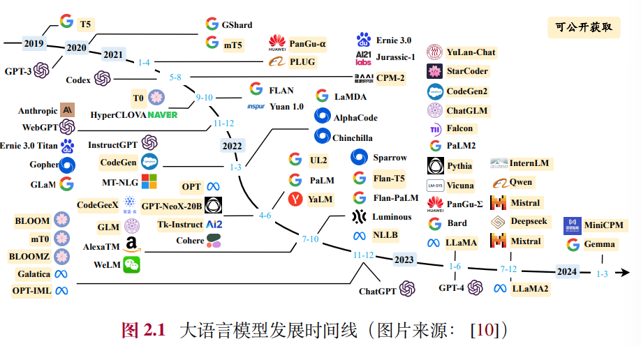

该图中 实线 表示在两个模型之间的进化路径上存在明确的证据（例如，官方声明新模型是基
于基础模型开发的），而 虚线 表示相对较弱的进化关系。

###### 研发历程
####### 早期探索阶段
######## GPT-1
模型名称 GPT 是生成式预训练（Generative Pre-Training）的缩写。

GPT-1 基于生成式、仅有解码器的 Transformer
架构开发，奠定了 GPT 系列模型的核心架构与基于自然语言文本的预训练方式，即预测下一个词元。

由于当时模型的参数规模还相对较小，模型仍然缺乏通用的任务求解能力，因而采用了无监督预训练和有监督微调相结合的范式。

######### 背景
与 GPT-1同期发布的预训练语言模型是大名鼎鼎的 BERT 模型。BERT 与 GPT-1 虽然都采
用了基于 Transformer 架构的预训练学习方式，但是它主要面向自然语言理解任务
（Natural Language Understanding, NLU），为此只保留了 Transformer 中的编码器，其
中 BERT-Large 模型在众多的自然语言理解任务上取得了非常重要的提升，成为当
时备受瞩目的“明星模型”。

######## GPT-2
GPT-2 沿用了 GPT-1 的类似架构，将参数规模扩大到 1.5B，并使用大规模网页数据集 WebText 进行预训练。

######### GPT-2 旨在探索通过扩大模型参数规模来提升模型性能，并且尝试去除针对特定任务所需要的微调环节。
它试图使用无监督预训练的语言模
型来解决各种下游任务，进而不需要使用标注数据进行显式的模型微调。

####### 路线确立（规模扩展）阶段
######## GPT-3
GPT-3 模型将模型参数扩展到了 175B 的规模，与 GPT-2 相比，GPT-3 直接将参数规模提升了 100 余倍，对于模型扩展在当时给出了一个极限尝试

在 GPT-3 的论文中，它正式提出了“上下文学习”这一概念，使得大语言模型可以通过少样本学习的方式来解决各种任务。上下文学习可以指导大语言模型学会“理解”自然语言文本形式描述的新任务，从而消除了针对新任务进行微调的需要。

基于这一学习范式，大语言模型的训练与利用可以通过语言建模的形式进行统一描述：模型预训练是在给定上下文条件下预测后续文本序列，模型使用则是根据任务描述以及示例数据来推理正确的任务解决方案。

######### 意义
GPT-3 可以被看作从预训练语言模型到大语言模型演进过程中的一个重要里程碑，它证明了将神经网络扩展到超大规模可以带来大幅的模型性能提升，并且建立了以提示学习方法为基础技术路线的任务求解范式

####### 能力增强阶段
OpenAI 探索了两种主要途径来改进GPT-3 模型，
即代码数据训练和人类偏好对齐

######## 改进
######### 代码数据训练
########## Codex
这是一个在大量 GitHub 代码数据集合上微调的 GPT 模型

实验结果表明，Codex 可以解决非常困难的编程问题，还能显著提升大模型解决数学问题的能力

########### 启发
对于可用于预训练的数据范围的扩展，可能并不局限于自然语言形式表达的文本数据

######### 人类对齐
########## InstructGPT论文和RLHF强化学习对齐方法
OpenAI在 2022 年初发布了 InstructGPT 的学术论文，系统地介绍了如何将语言模型进行人类对齐。具体来说，主要引入了基于人类反馈的强化学习对齐方法 RLHF
（Reinforcement Learning from Human Feedback），在指令微调后使用强化学习加强模型的对齐能力。

RLHF除了提高指令遵循能力，
还有助于缓解有害内容的生成，这对于大语言模型在实际应用中的安全部署非常重要。

######## GPT3.5
通过这些增强技术，OpenAI 将改进后的具有更强能力的 GPT 模型命名为 GPT-3.5 模型

####### 性能跃升阶段
######## ChatGPT
基于 GPT 模型的人工智能对话应用服务，
对于对话能力进行了针对性优化

######### 能力
拥有丰富的世界知识、复杂问题的求解能力、
多轮对话的上下文追踪与建模能力、与人类价值观对齐的能力等

在后续的版本更迭中，ChatGPT 进一步又支持了插件机制，通过现有工具或应用程序扩展了它
的功能

######### 意义
ChatGPT 一经推出就引发了社会的高度关注，对于人工智能的未来研究产生了重要影响

######## GPT-4
输入由单一文本模态扩展到了图文双模态

在解决复杂任务方面的能力显著强于 GPT-3.5，在一系列面向人类的考试中都获得了非常优异的结果

######### 意义
GPT-4 发布后，微软的研究团队针对其进行了大规模人类生成问题的性能测试，实验结果表明 GPT-4 具有令人震撼的模型性能，论文作者
认为 GPT-4 的到来展现出了通用人工智能的曙光

######## GPT-4V、GPT-4 Turbo以及多模态支持模型
######### GPT-4V
在多种应用场景中表现出了强大的视觉能力与综合任务解决能力

######### GPT-4 Turbo
2023.11

########## 升级版的 GPT-4 模型
提升了模型的整体能力（比 GPT-4 更强大），
扩展了知识来源（拓展到 2023 年 4 月），
支持更长上下文窗口（达到 128K），
优化了模型性能（价格更便宜），
引入了若干新的功能（如函数调用、可重复输出等）

增强了多模态能力，
分别由 GPT-4 Turbo with Vision、DALL·E-3、TTS（Text-to-speech）以及 Listen to
voice samples 等支持实现

#### Chapter3 LLM资源
##### 开源的 Model Checkpoint（模型检查点）
###### 国外
####### LLaMA
######## 公司
Meta AI

######## 意义
自 2023 年 2 月发布以来，LLaMA 系列模型在学术界和工业界引起了广泛的关注，已经成为了最受欢迎的开源大语言模型之一，许多研究工作都是以其为基座模型进行指令微调或继续预训练，衍生出了众多变体模型，对于推动LLM技术的开源发展和研究进展做出了重要贡献

######## 官方版本
######### LLaMA
2023.02

########## 7B、13B、30B 和 65B 四种参数规模版本
其中，13B 参数的版本在部分自然语言处理基准测试中超越了具有 175B 参数的 GPT-3 模型。

LLaMA 各个参数量版本都在超过 1T 词元的预训练语料上进行了训练，其中 65B 参数的模型
3.1 公开可用的模型检查点或 API版本在 2,048 张 80G 显存的 A100 GPU 上训练了近 21 天。

######### LLaMA-2
2023.07

7B、13B、34B（未开源）和 70B 四种参数规模版本，并且可用于商用

########## 优化点
扩充了预训练的词元量（达到了 2T），
同时将模型的上下文长度翻了一倍（达到 4,096 个词元），
并引入了分组查询注意力机制等技术来提升模型性能

######### LLaMA-2 Chat
面向对话应用的微调系列模型

########## 优化点
不仅在许多任务上具有更好的模型性能（例如代码生成、世界知识、阅读理解和数学推理），同时在应用中也更加安全

 同样具有四种参数规模的版本

######## LLaMA变体模型（非官方）
众多研究人员纷纷通过指令微调或继续预训练等方法来进一步扩展 LLaMA 模型的功能和应用范围。其中，指令微调由于相对较低的计算成本，已成为开发定制化或专业化模型的首选方法，也因此出现了庞大的 LLaMA 家族。

######### 根据指令微调所使用的指令类型分类
########## 基础指令
########### Stanford Alpaca
是第一个基于LLaMA (7B) 进行微调的开放式指令遵循模型

通过使用 Self-Instruct 方法借助大语言模型进行自动化的指令生成，Stanford Alpaca 生成了52K 条指令遵循样例数据（Alpaca-52K）用于训练，其指令数据和训练代码在随后的工作中被广泛采用

########### Vicuna
另一个流行的 LLaMA 变种，也受到了广泛关注

它并没有使用合成指令数据，主要是使用 ShareGPT 收集的用户日常对话数据进行训练，展现了基于 LLaMA 的语言模型在对话生成任务中的优秀实力

########## 中文指令
原始的 LLaMA 模型的训练语料主要以英语为主，在中文任务上的表现比较一般。为了使 LLaMA 模型能够有效地支持中文，研究人员通常会选择扩展原始词汇表，在中文数据上进行继续预训练，并用中文指令数据对其进行微调。

目前常见的中文大语言模型有 Chinese LLaMA、
Panda、Open-Chinese-LLaMA、Chinese Alpaca、YuLan-Chat 等。

########## 垂域指令
为了增强 LLaMA模型的垂域能力，很多工作基于搜集到的垂域相关的指令数据，或者采用垂域知识库以及相关专业文献等借助强大的闭源模型 API（例如 GPT-3.5、GPT-4 等）构建多轮对话数据，并使用这些指令数据对 LLaMA 进行指令微调。

常见的垂域 LLaMA模型有 BenTsao（医学）、LAWGPT（法律）、TaoLi（教育）、Goat（数学）、Comucopia（金融）等。

########## 多模态指令
由于 LLaMA 模型作为纯语言模型的强大能力，许多的多模态模型都将其（或将其衍生模型）作为基础语言模型，搭配视觉模态的编码器，使
用多模态指令对齐视觉表征与文本。

########### Vicuna
Note:基础指令那里也提到了此

与其他语言模型相比，Vicuna 在多模态语言
模型中受到了更多的关注，由此形成了一系列基于 Vicuna 的多模态模型，包括LLaVA 、MiniGPT4 、InstructBLIP 和 PandaGPT 。

除了使用不同种类的指令数据进行全参数微调外，研发人员还经常使用轻量化微调的技术训练 LLaMA 模型变体，以降低训练成本，方便用户部署。例如，AlpacaLoRA [76] 使用 LoRA 复现了 Stanford Alpaca。

####### Gemma
######## 公司
谷歌

2024.02

Gemma 的技术路线与谷歌另一款闭源多模态模型 Gemini 类似，但 Gemma 为纯语言模型，且专注于英语任务。

######## 版本
######### 有 2B 和 7B 两种参数规模
Gemma (2B) 预训练数据规模达到了 2T 词元，而 Gemma (7B) 的预训练数据规模达到了 6T 词元，两者的预训练语料都主要是英语数据。

Gemma 也提供了有监督微
调版本 Gemma IT，并与人类偏好进行了对齐

####### Mistral和Mixtral
######## 公司
Mistral AI

####### Falcon
######## 公司
阿布扎比的技术创新研究院（TII）

###### 国内
####### Qwen
######## 公司
Alibaba

2023.08

######## 版本
######### 现有从 0.5B 到 72B 的不同参数规模版本，其
中，14B 的 Qwen 的预训练数据规模达到了 3T 词元
根据 Qwen 的技术报告，2024
年 2 月最新发布的 Qwen-1.5 (72B) 在其评估的测试基准上优于 LLaMA-2 (70B) 的
表现，在语言理解、推理、数学等方面均展现出了优秀的模型能力。

Qwen 系列专门为代码、数学和多模态设计了专业化模型 Code-Qwen、Math-Qwen和 Qwen-VL，以及对应的对话式模型，可以供用户进行选择使用

####### ChatGLM
######## 公司
智谱 AI 和清华大学联合开发的

中英双语对话式模型

ChatGLM 系列模型参数量都是 6B，具备流畅对话的能力且部署门槛低，在语义、数学、推理、代码、知识等不同角度的评测中都取得了优异表现

######## 版本
最早发布于 2023 年 5 月，并一直进行迭代优化，目前已经更新到了ChatGLM-3，该系列还开源了基础模型 ChatGLM3-6B-Base 、长文本对话式模型 ChatGLM3-6B-32K 和进一步强化了对于长文本理解能力的 ChatGLM3-6B-128K。除了 ChatGLM 系列，智谱 AI 还致力于开发更强更大规模的 GLM-4。

####### Baichuan
######## 公司
百川智能

开源可商用大语言模型

######## 版本
######### Baichuan
########## 2023.06
支持中英双语，参数规模为 7B，预训练数据规模达到了1.2T 词元。

######### Baichuan-2
########## 2023.09
有 7B 和 13B 两种参数规模，预训练数据规模达到了 2.6T 词元

########### 优化点
性能进一步提升，全面超过Baichuan，还具备优秀的多语言能力和垂域应用潜力（如法律、医疗等领域）

####### MiniCPM
######## 公司
面壁智能与清华大学共同研发的

2024.02

MiniCPM 在训练前进行了模型沙盒实验，通过预先使用小模型广泛实验寻找更优的训练设置，并最终迁移至大模型上。
在训练方法上，MiniCPM 首先采用了稳定训练与退火的两阶段学习方法，然后进行了有监督微调和人类偏好对齐。

仅有 2B 的参数规模

同系列模型还包括 MiniCPM-2B-SFT（指令
微调版本）、MiniCPM-2B-DPO（DPO 对齐版本）、MiniCPM-V（多模态模型）等。

####### DeepSeek LLM
######## 公司
幻方公司

2023.11

主要支持中英双语

####### InternLM
######## 公司
上海人工智能实验室

####### YuLan-Chat
######## 公司
中国人民大学

中英双语系列对话模型

2023.06

##### 闭源模型的API接口
在闭源大语言模型领域，OpenAI 无疑是最具代表性和影响力的公司

###### OpenAI常用API
####### 常用语言模型API
######## GPT-3.5 Turbo
######### API
########## gpt-3.5-turbo
支持16K 词元的上下文长度

目前，开发者可以使用自己的数据来微调 GPT-3.5 Turbo，以便更好地适用于个性化的应用场景，例如提高模型的指令遵循能力、定制化输
出格式以及定制化语气等

######## GPT-4
是一个多模态模型，也是目前 GPT 系列效果最好的模型

######### API
gpt-4（基础版本，没有视觉功能）

gpt-4-32k（将上下文长度扩展到 32K）

gpt-4-vision-preview（带有视觉功能的 GPT-4 多模态版本）

######## GPT-4 Turbo
有更快的生成速度、更长的上下文窗口（最多 128K）以及更低的价格

######### API
gpt-4-turbo-preview

####### 文本表征API
可用于聚类、稠密信息检索等多种下游任务，可以为知识检索以及检索增强生成提供支持

######## API
######### text-embedding-ada-002
2022

可以提供1,536 维的向量表征，在英文文本表征基准测试 MTEB 获得了 61% 的平均得分

######### text-embedding-3-small
是一个更高效的文本表征模型，同样提供 1,536 维的向量表征，在 MTEB 的平均得分达到 62.3%

######### text-embedding-3-large
能够支持高达 3,072 维的向量表征，是三者中目前性能最好的模型，在 MTEB 的平均得分达到了 64.6%

这三个 API 支持的输入长度都是 8,191 个词元

##### 数据集
###### 常用的预训练数据集
网页

书籍

####### Wikipedia（维基百科）
除了通过维基百科的官方提供的下载方式4，Hugging Face 上也有相应的维基百科数据集 5。在实际应用中，可以根据需求选择特定时间段或特定内容的数据。例如 LLaMA 使用的是 2022 年 6 月至 8 月的维基百科数据。

####### 代码
 GitHub

StackOverflow

混合型

###### 常用的微调数据集
####### 三种主要类型
######## NLP任务数据集
在指令微调被提出前，早期的研究通过收集不同自然语言处理任务（如文本分类和摘要等）的实例，创建了有监督的多任务训练数据集。这些多任务训练数据集成为了构建指令微调数据集的重要来源之一。一般的方法是使用人工编写的任务描述来扩充原始的多任务训练数据集，从而得到可以用于指令微调的NLP任务数据集。

P3 和 FLAN 是两个代表性的基于NLP任务的指令微调数据集。

######## 日常对话数据集
日常对话数据集是基于真实用户对话构建的，其中查询主要是由真实用户提出的，而回复是由人类标注员回答或者语言模型所生成。主要的对话类型包括开放式生成、问答、头脑风暴和聊天。

三个较为常用的日常对话数据集包括
ShareGPT、OpenAssistant 和 Dolly。

######## 合成数据集
合成数据集通常是使用大语言模型基于预定义的规则或方法进行构建的。

Self-Instruct-52K 和 Alpaca-52K 是两个具有代表性的合成数据集

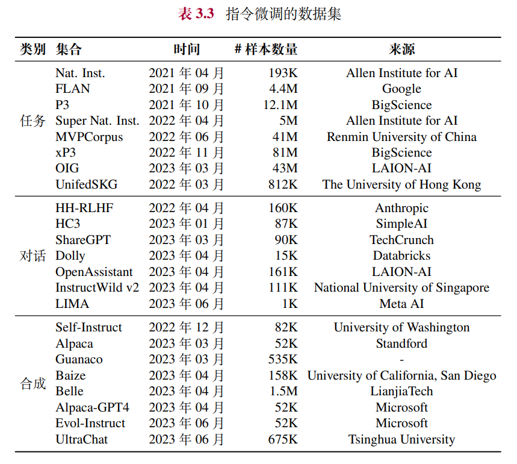

###### 常用的对齐数据集

##### 代表性代码库资源
###### Hugging Face 开源社区
Hugging Face 是一个致力于推动自然语言处理技术进步的开源社区，专注于为研究人员和工程师提供高效、易用且可重复的自然语言处理技术解决方案。这些解决方案既包括基础的技术流程，如预训练和微调，也涉及具体的应用任务，包括对话系统、翻译等。Hugging Face 平台上的代码大部分基于目前主流的深度学习框架实现完成的，如 PyTorch 和 TensorFlow。

为了满足广泛的研究与应用需求，
Hugging Face 发布了一系列代码库，包括 Transformers 、Datasets 和 Accelerate 等。

####### 代码库
######## Transformers
该代码库是一个使用 Transformer 架构构建模型的开源 Python库，提供了一系列预训练的模型与相关开发工具，在自然语言处理领域被广泛使
用。

######### 主要优势
########## 易于使用
对所有模型的 API进行了统一封装，研究者只需了解三个核心类（模型、配置和分词器），即可快速上手

########## 节省资源
鼓励模型开源共享，减少重复训练，节约计算资源

########## 广泛支持
提供数以万计的预训练模型，满足多样化需求

########## 全周期管理
简化模型训练到部署的过程，支持跨框架模型转换，易于设计模型和构建实验

######## Datasets
该代码库用于高效访问和共享自然语言处理任务相关的数据集，可以快速从远程 Hugging Face Hub 中加载数据集到本地。在使用中，用户仅需一行代码便能加载指定的数据集，同时，该库还集成了强大的数据处理能力，以满足各种复杂的数据操作需求。得益于软件框架 Apache Arrow 格式的支持，Datasets 能够实现大型数据集的零拷贝读取，从而减少内存占用，显著提升数据处理的效率。

######## Accelerate
该代码库是一个旨在简化模型分布式训练和混合精度训练的Python 库，专门针对 PyTorch 开发。 Accelerate 库全面支持分布式训练，实现了混合精度训练，并完善了并行训练时多设备的自动管理。该库降低了用户进行分布式训练的难度，仅通过少量代码，用户便能在各种分布式配置中执行 PyTorch 程序，从而便捷地使用大规模计算资源，有效加快模型训练的进度。此外，Accelerate还提供了一个可配置的命令行界面工具，进一步简化了训练环境的配置与测试流程。

###### DeepSpeed
DeepSpeed 是微软开发的一个加速深度学习模型训练的高性能库（与 PyTorch兼容），被广泛用于大语言模型的分布式训练，例如 MT-NLG 和 BLOOM等。

DeepSpeed 为分布式训练提供了各种优化技术支持，如内存优化（ZeRO 技术、梯度检查点）、数据并行、混合精度训练等，使得整个训练过程变得更加高效、稳定。为了更加适配大模型时代的用户需求，DeepSpeed 针对模型生成和强化学习分别开发了特制的优化框架：DeepSpeed-MII 和 DeepSpeed-Chat。

###### Megatron-LM
Megatron-LM是由 NVIDIA 开发的一款专门为训练大语言模型而设计的深度学习代码库。这个代码库旨在解决大型模型训练过程中所遇到的一系列技术挑战，包括显存限制、计算效率以及不同的并行策略带来的通信问题。这些优化技术可以在很大程度上提高训练效率和速度，实现跨 GPU 的高效分布式训练。

####### 引入了一系列分布式训练的优化技巧，
支持多种并行化策略
数据并行，通过在每个工作节点复制模型，并将输入数据切分多份分配给多个节点，定期同步所有梯度来提升 GPU 的使用效率

模型并行，包括张量并行和流水线并行，通过在多个工作节点上分配模型和计算来克服单个 GPU 容量限制的问题

Megatron-LM 还支持混合精度训练和 FlashAttention 功能

###### 本书配套资源
####### LLMSurvey
https://github.com/RUCAIBox/LLMSurvey/

2023 年 3 月末，笔者团队在预印版网站 arXiv 上发表了大语言模型英文综述论文《A Survey of Large Language Models》，全面介绍了大语言模型的主要技术路径与最新研究进展。该综述论文目前已迭代至 v13 版本，全文长达 123 页，收录了 946 篇参考文献，内容全面涵盖了大模型相关资源、预训练、指令微调、人类对齐、提示学习以及评测等多方面的技术介绍。同时建立了大模型综述资源网站：https://github.com/RUCAIBox/LLMSurvey/，收录了很多相关
论文与学习资源。自该综述文章推出以来，受到了广泛的关注。本书在此英文综述文章的基础上拓展而来，但是具有不同的定位目标：英文综述文章主要是面向学术前沿，力争覆盖目前最新的研究进展；本书则主要面向辅助教学，旨在形成一本大语言模型的入门级中文教材。

####### LLMBox
https://github.com/RUCAIBox/LLMBox

LLMBox 是作者团队围绕英文综述论文所开发的综合性大语言模型代码库，用于支持大模型训练与评测的学术研究工作。其中，训练部分涵盖了大语言模型的预训练、指令微调、对齐微调以及轻量化微调等多种训练策略，并为读者提供了 GPU 计算器来估算训练时所需的显存开销；评测部分支持了大量开源模型和商用 API 在多种下游任务上的评测，还设计了前缀缓存机制提升使用效率。LLMBox 在开发过程中，力求使用尽可能简短的代码展现相关技术的实现或调用，并提供了“一键运行”脚本，让读者能够更为容易地尝试大模型的各种训练与评测技术。

####### YuLan-Chat
YuLan-Chat 是中国人民大学自主研发的系列大语言模型，目前已研发至第三代版本，即 YuLan-Chat-3。YuLan-Chat-3 经历了完整的从头预训练、指令微调以及人类对齐的训练过程，包含 12B 的参数规模，预训练数据量达到 1.68T 词元。我们同时在 GitHub 上开源了三代 YuLan 的权重参数，以供读者进行尝试使用。本书所介绍的很多相关技术，均是作者团队在研发 YuLan-Chat系列模型过程中进行实践与思考所凝练。为了介绍方便，在后续章节中，将简称
YuLan-Chat-3 为 YuLan 模型。

### Part2 预训练
#### Chapter4 数据准备

##### 数据预处理
一般来说，需要构建并使用系统化的数据处理框架（如开源库 Data-Juicer），从而保证预训练数据的质量。

###### 重要步骤
####### 质量过滤
######## 目的
去除低质量内容

######## 2种数据清洗方法
######### 基于启发式规则的方法
不同类型的文本数据往往需要设计不同的清洗规则。例如，在处理Reddit 数据时，可以通过过滤点赞数过少的帖子来剔除低质量内容；而在处理代码语料时，可以过滤掉非代码相关格式的数据。

########## 规则
基于语种的过滤

基于简单统计指标的过滤

基于关键词的过滤

######### 基于分类器的方法
训练用于判别数据质量的文本分类器

为了减少数据的误筛，可以使用多个分类器进行联合过滤或召回，从而来实现对低质量文本的高可信过滤。

此外，也可以针对不同的评估维度训练不同的分类器，并采用类似集成的方式对于语料进行全面的过滤。

目前常用来实现分类器的方法包括轻量级模型（如 FastText 等）、可微调的预训练语言模型（如 BERT、BART 或者 LLaMA 等）以及闭源大语言模型 API（如GPT-4、Claude 3）。

为了平衡效率与准确性，可以针对具体数据集合进行清洗策略的灵活组合。例如，可以首先利用启发式规则进行初步筛选，以快速排除不符合要求的文档，随后再采用分类器方法进一步精细过滤，确保最终筛选出的语料具有较好的文本质
量。在这一过程中，还可以同时应用多种分类器，可以先使用轻量级分类器进行数据过滤，进而使用更为有效但是资源消耗更高的分类器在粗滤后的数据上再次进行选择。

####### 敏感内容过滤
######## 目的
去除有毒内容和隐私信息

######## 过滤有毒内容
采用基于分类器的过滤方法。Jigsaw 评论数据集提供了用于训练毒性分类器的数据

######## 过滤隐私内容
一种直接且有效的方法是使用启发式方法，如关键字识别，来检测和删除这些私人信息

####### 数据去重
对预训练数据进行去重处理是一个重要步骤。由于大语言模型具有较强的数据拟合与记忆能力，很容易习得训练数据中的重复模式，可能导致对于这些模式的过度学习

此外，为了避免数据集污染问题，还需要从预训练数据集中删除在测试集中可能出现的重复或者相关文本，从而防止训练集和测试集之间的重叠

######## 计算粒度
去重可以在句子级别、文档级别和数据集级别等多种粒度上进行

######## 用于去重的匹配方法
精确匹配算法（即每个字符完全相同）

近似匹配算法（基于某种相似性度量）

######## 现有的数据集往往采用多阶段、多粒度的方
式来实现高效的去重
首先针对数据集和文档级别进行去重，旨在去除那些具有高度相似甚至完全一致内容的文档，例如多个 URL 可能具有相同的网页内容，或者网页数据集和新闻数据集中包含相同的新闻文档。随后，可以进一步在句子级别实现更为精细的去重。例如，可以计算两个句子之间公共子串的长度，当其长度过长时直接删除某一个句子。

考虑到预训练数据集合的规模非常大，实现中可以综合考虑去重效率和去重效果之间的权衡。例如，RefinedWeb 在文档层面采用了开销较小的近似匹配技术来实现去重，而在句子层面则采用了精确匹配算法来确保去重的准确性。

###### 数据对预训练效果的影响
####### 数据数量的影响
整体上，语言模型的性能会随着训练数据数量的增加而提升，符合扩展法则

####### 数据质量的影响
在获取充足数量的预训练数据后，数据质量直接决定了模型的实际性能。通过显著提升数据质量，使得语言模型在参数、数据、算力更加节约的情况下就能展现出与更大规模模型相匹敌甚至更为优异的性能

######## 整体影响
大语言模型所掌握的知识信息来源于预训练数据，这意味着如果模型在包含事实性错误的、过时的数据上进行训练，那么它在处理相关主题时可能会产生不准确或虚假的信息，这种现象被称为“幻象”

######## 重复数据的影响
重复数据对于模型训练及最终性能会带来不良影响。此外，重复数据可能会降低大语言模型利用上下文中信息的能力。这会削弱模型在上下文学习中的泛化能力，使其难以适应各种复杂的语言环境和任务需求。

通常的建议是对于预训练数据进行精细的去重操作

######## 有偏、有毒、隐私内容的影响
一旦数据中包含有偏、有毒、隐私的内容，将会对于模型造成严重的不良影响。在有偏内容上训练可能会导致语言模型学习并复制这些偏见，进而在其生成的文本中表现出对诸如种族、性别和年龄的偏好或歧视。进一步，如果训练数据中包含有毒内容，模型则可能会产生侮辱性、攻击性或其他有害的输出；而在含有隐私内容的数据上训练可能会导致模型在输出中无意中泄露或利用个人数据。这些问题对于大语言模型的对齐带来了很大挑战。例如，通过精心设计的提示或利用模型的特定弱点，攻击者可能诱使模型输出不当或有害的信息

需要通过严格的数据过滤和预处理方法来尽量减少有偏见、有毒或包含隐私信息的数据

####### 数据集污染
######## 定义
在进行模型评测时，可能会发现某些评估基准所包含的数据，实际上已出现在预训练数据或者微调数据中，这种现象被称为基准泄漏或数据集污染

######## 影响
这种情况破坏了评估集合构建的初衷，使得不同模型之间的对比失去了公平性。

##### Tokenization（词元化，分词）
###### 目的
将原始文本分割成模型可识别和建模的词元序列，作为大语言模型的输入数据

###### 方式
####### 基于词汇的分词方法
######## 缺点
存在未登录词（Out-of-vocabulary, OOV）

基于字符的分词方式

####### 基于子词的分词方法
子词分词器（Subword Tokenizer）被广泛应用于基于 Transformer 的语言模型中，包括 BPE 分词、WordPiece 分词和 Unigram 分词三种常见方法。

######## 三种常见方法
######### BPE分词
########## 字节级别的 BPE（Byte-level BPE, B-BPE）是 BPE 算法的一种拓展
它将字节视为合并操作的基本符号，从而可以实现更细粒度的分割，且解决了未登录词问题。

采用这种词元化方法的代表性语言模型包括 GPT-2 、BART 和 LLaMA

######### WordPiece 分词
是谷歌内部非公开的分词算法，被 BERT 采用作为分词器 

######### Unigram 分词
采用这种分词方法的代表性模型包括 T5 和 mBART。

###### 分词器的选择
虽然直接使用已有的分词器较为方便，但是使用为预训练语料专门训练或设计的分词器会更加
有效，尤其是对于那些混合了多领域、多语言和多种格式的语料。

最近的大语言模型通常使用 SentencePiece 代码库为预训练语料训练定制化的分词器，这一代码库支持字节级别的 BPE 分词和 Unigram 分词。

首先，分词器必须具备无损重构的特性，即其分词结果能够准确无误地还原为原始输入文本。

其次，分词器应具有高压缩率，即在给定文本数据的情况下，经过分词处理后的词元数量应尽可能少，从而实现更为高效的文本编码和存储。

####### 值得注意的是，在扩展现有的大语言模型（如继续预训练或指令微调）的同时，还需要意识到原始分词器可能无法较好地适配实际需求。
以 LLaMA 为例，它基于主要包含英语文本的预训练语料训练了 BPE 分词器。因此，当处理中文等非英语数据时，该分词器可能表现不佳，甚至可能导致推理延迟的增加。

此外，为进一步提高某些特定能力（如数学能力），还可能需要针对性地设计分词器。

##### 数据调度（Data Scheduling）
数据调度：就是给LLM编排学习课程计划

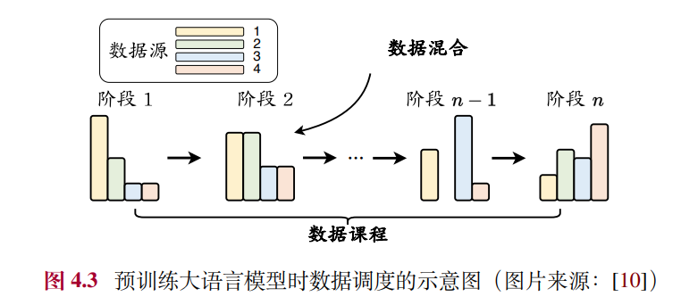

###### 主要关注两个方面
####### 数据混合（各个数据源的混合比例）
数据混合通常在数据集合层面上设置（即整个预训练数据的整体分布），也可以在不同训练阶段采用不同的混合数据比例。

在预训练期间，将根据混合比例从不同数据源中采样数据：数据源的权重越大，从中选择的数据就越多。

进一步，可能会对每个数据源的全部数据进行上采样或下采样，以创建特定的数据混合集合作为预训练数据。

######## 典型的数据分布
######### 重要参考：LLaMA
LLaMA 的预训练数据主要包括超过 80% 的网页数据、来自 GitHub 和 StackExchange 的 6.5% 代码密集型数据、4.5% 的书籍数据，以及来自 arXiv 的 2.5% 科学数据，这个数据配比成为了训练大语言模型的一个重要参考

######### 目前一些代表性的大语言模型
的数据混合配比情况

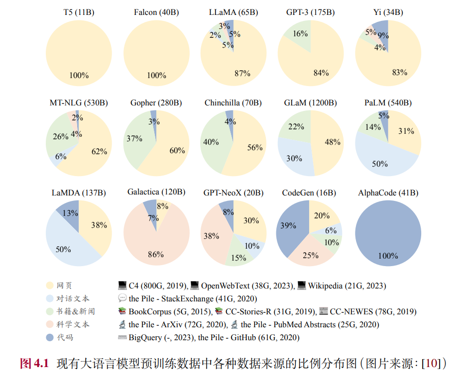

######## 常见数据混合策略
######### 增加数据源的多样性
在收集预训练数据时，需要注意引入数据多样性更高的数据源，如包含网页数据、各类型书籍、代码数据等

######### 优化数据混合
除了手动设置数据混合配比外，还可以使用可学习的方法来优化数据组成

######### 优化特定能力
大语言模型的模型能力在很大程度上取决于数据选择和配比，可以通过增加特定数据源的比例来增强某些对应的模型能力

例如，可以通过使用更多的数学文本和代码数据来增强大语言模型的数学推理和编程能力，而增加书籍数据的比例可以提高模型捕捉文本长程依赖关系的能力 

####### 数据课程，Data Curriculum（各数据源用于训练的顺序）
数据课程是指按照特定的顺序安排预训练数
据进行模型的训练。更广泛地说，它可以指训练期间在不同阶段使用不同的数据源混合配比。

######## 从简单/通用的数据开始，逐渐引入更具挑战性/专业化的数据（基本技能 → 目标技能）
相关研究表明，为了学习某些特定的技能，按照技能依赖顺序编排对应数据集的学习方法（例如，基本技能 → 目标技能）比直接在相关的特定语料库上学习效果更好

由于预训练阶段需要耗费大量的计算资源，目前针对数据课程的研究工作主要集中在继续预训练（Continual Pre-training）这一方面

######## 继续预训练具体应用
######### 代码能力
########## CodeLLaMA
采用的数据课程为：
2T 通用词元 → 500B 代码密集型词元

##########  CodeLLaMA-Python
采用的数据课程为：
2T 通用词元 → 500B 代码相关的词元 → 100B Python 代码相关的词元

######### 数学能力
########## 将CodeLLaMA 作为基座模型的数学LLM：Llemma
采用的数据课程为：
2T 通用词元 → 500B 代码相关的词元 →
 50∼200B 数学相关的词元

值得注意的是，Llemma 的继续预训练数据中还包含5％的通用领域数据，这可以看做一种模型能力的“正则化”技术，加强对于原始基座模型通用能力的保持

######### 长文本能力
########## CodeLLaMA 将 LLaMA-2
的上下文窗口从 4K 扩展到了 100K
采用的数据课程为：
2.5T 词元，4K 上下文窗口 → 20B 词元，16K 上下文窗口

通过使用这种训练序列长度由短到长的数据课程，能够使模型获得较好的长文本建模能力，同时可以节省长文本模型的训练时间。

一种较为实用的方法是首先使用多个候选策略训练多个小型语言模型，然后从中选择一个最优的训练策略

#### Chapter5 模型架构
##### 一些典型的大语言模型的详细配置

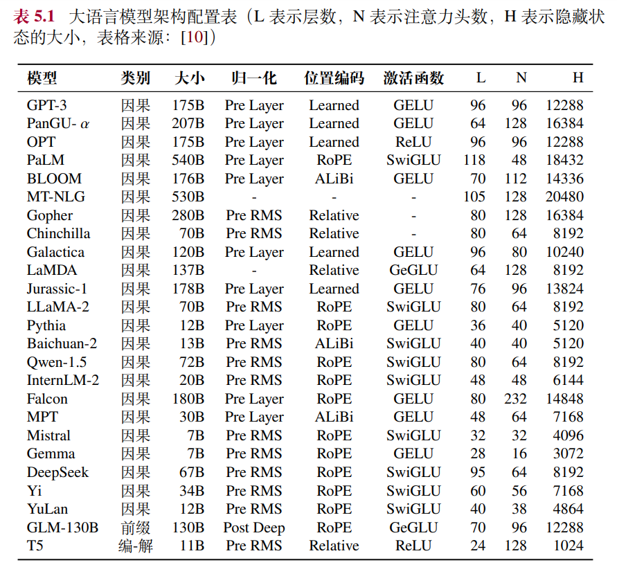

Chapter6 模型预训练

Part3 微调和对齐

###  Part4 大模型使用
#### Chapter9 解码与部署
##### 解码策略
###### 解码的定义
在自回归架构中，模型针对输入内容逐个单词生成输出内容，这个过程一般被称为解码。

####### 自回归解码流程

在这个过程中，解码策略主要关注如何基于概率分布选择合适的下一个词

大语言模型的生成方式本质是一个概率采样过程，需要合适的解码策略来生成合适的输出内容。

###### 常见解码策略
####### 贪心搜索（Greedy Search）
选概率最高的token（确定性）

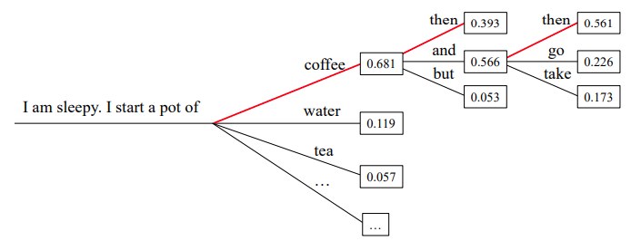

效果在不同类型的任务中具有一定的差异。
在机器翻译和文本摘要等任务中，任务输出高度依赖于输入内容，贪心搜索通常能够获得不错的结果，
但是在开放式生成任务（如故事生成和对话系统）中，贪心搜索有时会因为过于关注局部最优，而生成不自然、重复的句子

######## 贪心搜索的改进策略
######### 束搜索（Beam Search）
保留前n个最高概率的token, 并最终选取整体概率最高的作为输出内容，这里的n被称为束大小（Beam Size）。

当 𝑛 = 1，束搜索就退化为贪心搜索

如n=2时，每步选择概率最高的2个token，生成结束后选择整体生成概率最高的候选句子作为最后的输出。

在实践中，束的数量通常设定在 3 到 6 的范围内，设置过大的束会显著增加运算开销，并可能会导致性能下降

######### 长度惩罚/长度归一化（Length Penalty）
由于束搜索中需要比较不同长度候选句子的概率，如果没有长度惩罚，传统的束搜索会倾向于生成较短的句子，因为每生成一个单词，都会乘以一个小于 1的概率，使得句子的生成概率逐渐变小。

因此，可以在生成概率的计算中引入长度惩罚，通过将句子概率除以其长度的指数幂 𝛼，对于句子概率进行归一化处理，从而鼓励模型生成更长的句子。

在实践中，𝛼 通常设置为 0.6 到 0.7 之间的数值。

######### 重复惩罚
为了缓解贪心搜索重复生成的问题，这些重复惩罚方法不止适用于贪心搜索，对于随机采样也均适用。

########## 类型
########### n-gram Penalty（n-元惩罚）
强制避免生成重复的连续 𝑛 个词元，实践中 𝑛 通常设置为 3 到 5 之间的整数

“一刀切”地完全避免某些短语的生成

########### Presence Penalty（出现惩罚）
是否出现

出现惩罚在生成过程中会将已经生成词元的 logits 减去惩罚项 𝛼 来降低该词元之后生成的概率

在实践中，𝛼 的取值范围通常在 0.1 到 1 之间。

相对“温和”，而不是“一刀切”地完全避免某些短语的生成

########### Frequency Penalty（频率惩罚）
出现了几次

频率惩罚会记录每个词元生成的数目，然后减去出现次数乘以惩罚项 𝛼，因此如果一个词元生成得越多，惩罚也就越大

在实践中，𝛼 的取值范围通常在 0.1 到 1 之间。

相对“温和”，而不是“一刀切”地完全避免某些短语的生成

####### 概率采样/随机采样（Probability Sampling）
概率分布采样（随机性和多样性）

基于采样的策略为选择除最高概率的其他词留有一定的可能性，从而增加了生成文本的多样性和随机性。

######## 概率采样的改进策略
######### 温度采样（Temperature Sampling）
########## 调节softmax函数中的温度系数
其中，l表示每个候选词元的logit, t是温度系数

########## 温度系数的大小对采样结果的影响
########### 降低温度系数t会使得概率分布更加集中，从而增加了高概率词元的采样可能性，同时降低了低概
率词元的采样可能

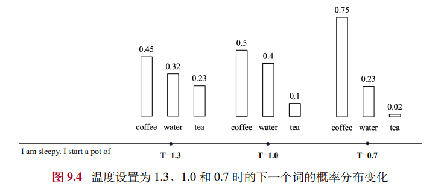

而当 𝑡 趋近于 0 时，实际上等同于贪心搜索，即总是选择概率最高的词

当温度系数 𝑡 设置为 1 时，该公式退化为标准的随机采样方法

当 𝑡 趋近于无穷大时，温度采样会退化为均匀采样

######### Top-k采样（Top-k Sampling）
直接剔除概率较低的词元，限制模型从概率最高的前 𝑘 个token中进行采样

k=3，即从前3个概率最高的token中进行采样

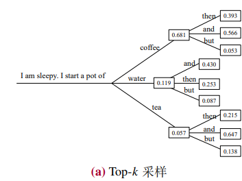

######### Top-p采样/核采样（Top-p Sampling/ Nucleus Sampling）
累积概率小于或等于阈值p的前几个token中进行采样

具体实现：按照概率将token从高到低排序，不断将token添加到可选集合中，直到可选集合累积概率首次超过阈值p

p=0.8，即从累积概率小于等于0.8的前几个高概率的token中进行采样

######### 对比解码（Contrastive Decoding）

###### 代表性llm的解码设置

##### 解码加速算法
###### 解码效率的定量评估指标（详见LLMBook）
####### GPU性能评估
######## GPU算力
算力是指 GPU 每秒能够进行的浮点运算次
数，单位是 FLOP/s

######## GPU带宽
带宽是该显卡每秒能够进行的显存读写量，单位是 byte/s

######## GPU计算强度上限
算力和带宽的比值被称为该 GPU 的计算强度上限 𝐼𝑚𝑎𝑥，单位为 FLOP/byte

####### 模型性能评估
######## 模型的运算量
运算量是指运行该模型需要的总浮点计算数，单位为 FLOP

######## 模型的访存量
访存量是运行该模型的过程中所需的显存读写量，单位为 byte

######## 模型的计算强度
运算量和访存量的比值被称为该模型的计算强度 𝐼，单位为 FLOP/byte

####### 带宽瓶颈和计算瓶颈
当模型的计算强度 𝐼 小于GPU 的计算强度上限 𝐼𝑚𝑎𝑥 时，这说明 GPU 的理论最高显存读写速度低于实际运算所需速度，因此模型实际的运行效率将主要受到显存读写速度的影响，这种情况称为带宽瓶颈；

反之，当 𝐼 大于 𝐼𝑚𝑎𝑥 时，说明 GPU 的理论最高浮点运算速度低于实际运算所需速度，因此模型的运行效率将主要受到算力的影响，这种情况称
为计算瓶颈。

由于自回归算法的序列化生成特点，使得解码算法存在效率较低的问题。

自回归生成算法

###### 全量解码阶段与增量解码阶段
####### 全量解码阶段（第一次）
对于输入序列，一次性地计算其状
态并缓存键值矩阵

（算法 3 第 1 至 3 行）

以 LLaMA 模型为例，全量解码的运算量、访存量和计算强度

######## 全量解码阶段是受限于 GPU 浮点数计算能力的（即计算瓶颈）

####### 增量解码阶段（之后）
只计算上一步新生成词元的状态，并不断地以自回归方式生成新词元并对应更新键值缓存，直到生成结束

（算法 3 第 4-9 行）

以 LLaMA 模型为例，增量解码的运算量、访存量和计算强度

######## 增量解码阶段是受限于 GPU 显存读写速度的（即显存瓶颈），这种问题通常被称为内存墙（Memory Wall）问题

解码阶段的低效问题主要出现在增量解码阶段，存在显存瓶颈

###### 增量解码阶段（显存瓶颈）的改进方法
####### 系统优化（直接解决系统级别的内存墙问题）
针对“内存墙”问题，一个直观的解决方案是减少相关操作的访存量，从而达到提升计算强度的目的。本节将介绍一些系统级优化方法来实现减少访存量的目的。

######## 优化方法
FlashAttention

PagedAttention

批次管理优化

####### 解码策略优化（针对自回归解码策略的改进方法）
######## 优化方法
######### 推测解码（Speculative Decoding）
推测解码不会降低大模型解码的质量，
实验测试表明能够带来约两倍左右的解码加速，是目前使用较多的解码策略优化
方案。

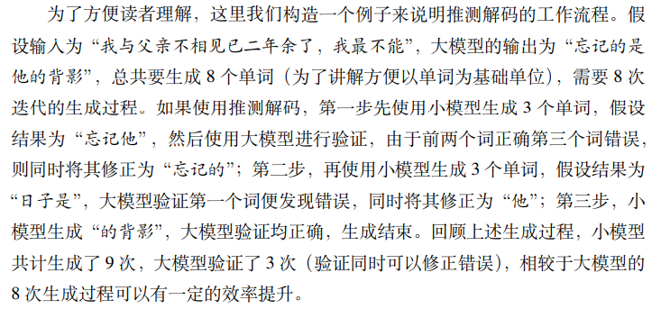

######### 非自回归解码（Non-autoregressive Decoding）

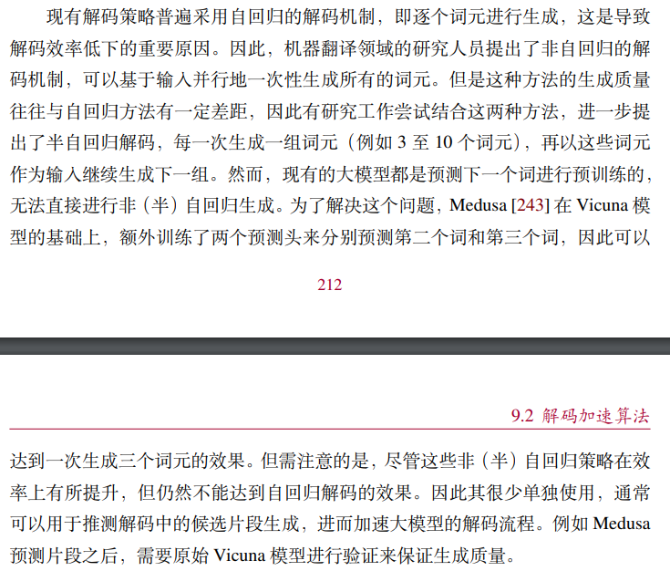

######### 早退机制（Early Exiting）
########## 可能不需要经过所有层的计算，模型就可以较为可靠地预测下一个词的生成。基于这种想法，研究人员提出了基于早退机制的生成方式。

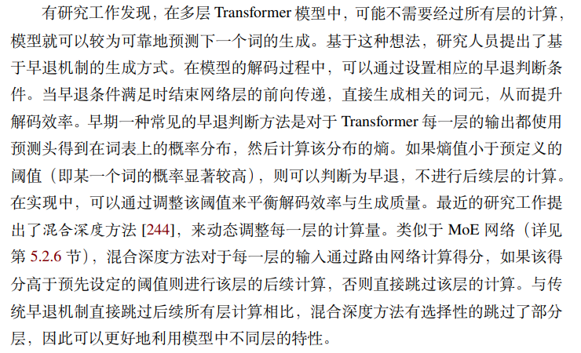

######### 级联解码（Cascade Inference）
########## 多个模型按效率从高到低排序，将请求依次给排好序的模型，引入一个专门训练的二分类模型来判断生成结果是否符合任务要求，如果结果可靠则结束

##### 低资源部署策略（模型压缩方法）
模型量化

###### 模型蒸馏
与模型量化不同，模型蒸馏和模型剪枝则通过精简模型的结构，进而减少参数的数量。

###### 模型剪枝
与模型量化不同，模型蒸馏和模型剪枝则通过精简模型的结构，进而减少参数的数量。

Part5 评测与应用

## 专业术语
token（词元）

LM（Language Model, 语言模型）

LLM（Large Language Model, 大语言模型）

### Prompt（提示）
Prompt Engineer（提示工程）

#### 提示学习
能够直接通过自然
语言描述下达任务指令

Prompt Template（提示模板）

### 编码器和解码器，自然语言理解和自然语言生成
编码器架构被认为更适合去解决自然语言理解任务（如完形填空等）

解码器架构更适合解决自然语言生成任务（如文本摘要等）

### 预训练和微调
预训练阶段旨在通过大规模无标注文本建立模型
的基础能力

微调阶段使用有标注数据对于模型进行特定任务的适配

### LM出现顺序
2018 -> GPT-1 -> BERT -> 2019 -> GPT-2 -> T5 -> 2020 -> GPT-3 -> 2021 -> Codex 
-> 2022 -> InstructGPT  -> ChatGPT -> 2023 -> LLaMA -> GPT-4 

