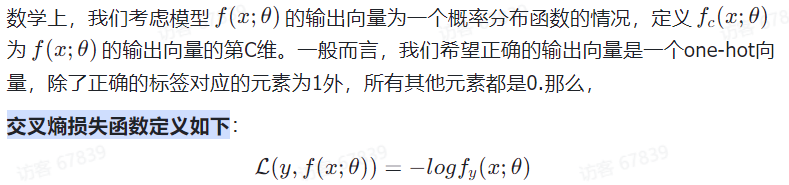
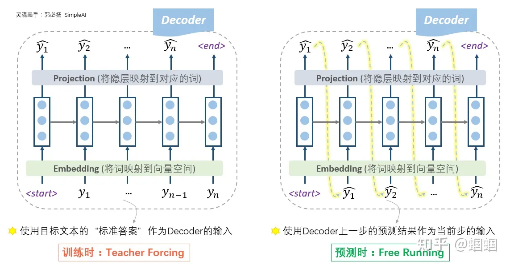
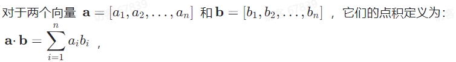
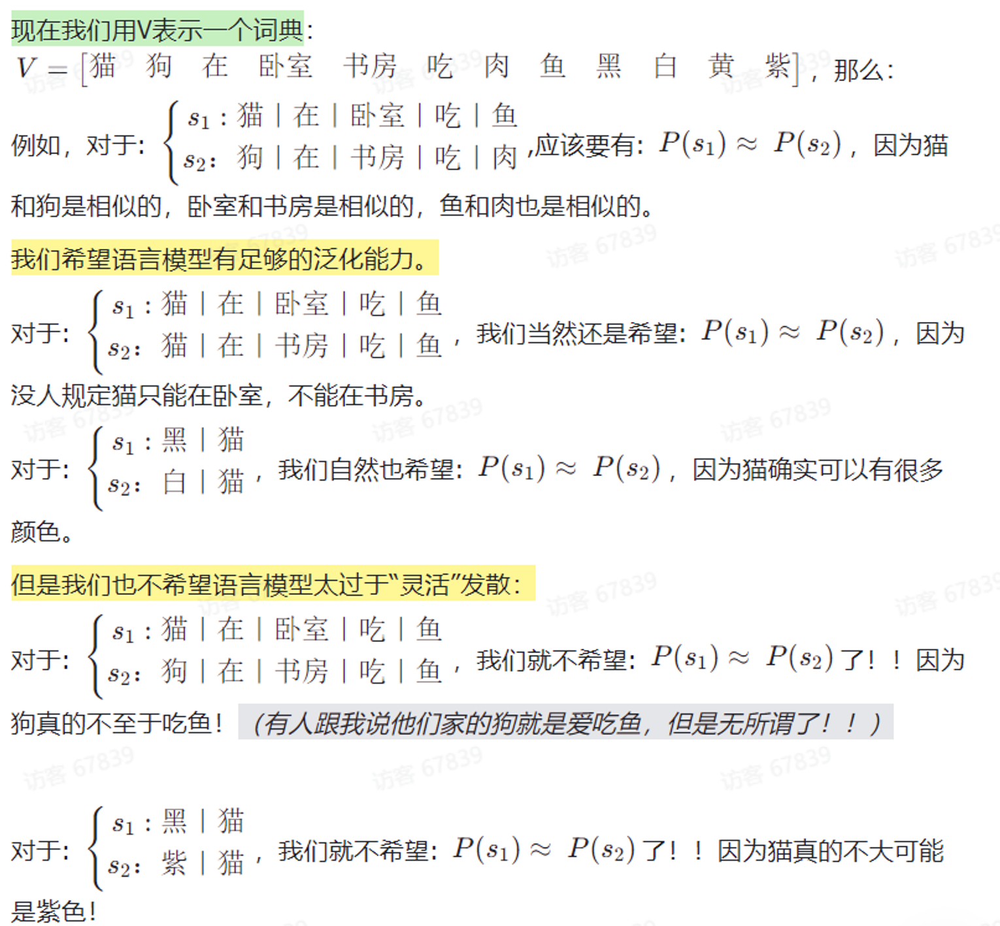

# NLP
## nlp
### 基本任务
#### Segment(分词，token化)
##### 重要概念
###### token
在自然语言处理中，Token（词元）通常指的是将句子或文本拆分成单个独立的单词或标点符号。这个过程称为分词或标记化，它是自然语言处理中的一项重要预处理任务。

猫｜在｜卧室｜吃｜鱼 就是一个拆分成词元的过程。

在表示英文的时候，Token（词元）和单词不一样，Token是一个比单词更小的分割单位。

##### what
将文本拆分成单个独立的单词或标点符号

##### how
###### 1.基于word的分词模型
优点：分词最直观的解决方式

####### 缺点：存在OOV的问题（out of vocabulary, 未登录词）(word模型的word数量太多，存在大量稀疏word，删掉它们又会导致OOV问题)
现存的英文单词数量太多了，随便加个前缀、后缀，变个时态什么的都变成新的单词了，所以英文单词的词典数量特别大，而且有很多低频稀疏词。很多模型在训练时都会去掉低频词，只保留高频词。那么这就存在一个问题，如果预测时遇到未登录词，则模型不认识，出现OOV的问题。

###### 2.基于character的分词模型
####### what
对26个字母训练word2vec，每个词由其字母的embedding拼接或者求平均得到

优点：解决了OOV问题

缺点：和word级别的模型效果差不多，并没有显著优势。而且如果用RNN来训练character级别的模型也有它的问题，就是训练起来非常慢，原来的一个word，现在变成了七八个character，时间步长增加了很多，训练和预测都更久了，而且梯度消失（爆炸）的问题也会更严重。

###### 3.子词模型(subword models)
####### what
对于英文来说，文字的粒度从细到粗依次是character, subword, word，character和word都很好理解，subword相当于英文中的词根、前缀、后缀等，如unfortunately中的un、ly、fortun(e)等就是subword，它们都是有含义的。

优：作为character和word的折中模型，解决了OOV问题，训练也不会特别慢

####### how
######## 1)模型结构和word模型完全一样，只不过把word换成了subword
最近比较流行的BERT，字典中既有相对比较常见的词，对于不太常见的词则用subwords/wordpieces来表示。

######### 关键点：怎样得到subword

######## 2)word和character模型的杂交模型
字典中的词用word分词模型，对于不太常见的词则用character分词模型

#### Embedding
##### Word Embedding(词嵌入)
###### what
词转为对应的向量

###### how
####### One-hot向量(One-hot编码，独热编码)
早期的NLP常用one-hot编码来表示词向量

假如词典中共有10000个词，则这个one-hot向量长度就是10000，该词在词典中所处位置对应的值为1，其他值为0

######## 优点
简单

######## 缺点
1. 词典中的词是不断增多的，比如英语，通过对原有的词增加前缀和后缀，可以变换出很多不同的词，one-hot编码会导致向量维度非常大，且每个向量是稀疏的；

2. 不同词的one-hot编码向量是正交的，在向量空间中无法表示近似关系，即使两个含义相近的词，它们的词向量点积也为0。

####### Embedding(词嵌入，词向量)
######## what
用维度有限的稠密的向量来表示所有的词汇，传统的Transformer中，词嵌入有512维；BERT中，词嵌入有768维和1024维两个版本。

######## one-hot与embedding的关系
Embedding的数学本质，就是以one hot为输入的单层全连接。世界上本没什么Embedding，有的只是one hot。

######### 我们通过把One-hot向量通过一个权重矩阵投射到词嵌入里。词向量就是one hot的全连接层的权重矩阵参数。
例如，对于一个有30000个词汇量的词典V，每一个词都是30000维的一个稀疏向量。对于每一个词，我们给他乘一个30000*512的权重矩阵，最终就得到一个512维的向量了。

解释一下为什么这些字词向量会有一些性质，比如向量的夹角余弦、向量的欧氏距离都能在一定程度上反应字词之间的相似性？这是因为，我们在用语言模型无监督训练时，是开了窗口的，通过前n个字预测下一个字的概率，这个n就是窗口的大小，同一个窗口内的词语，会有相似的更新，这些更新会累积，而具有相似模式的词语就会把这些相似更新累积到可观的程度。

######## 词向量从何而来/词向量算法
######### word2vec
是开源的生成词向量表的技术，词向量表即词和向量一一对应的字典

########## 两种训练方式/两种模型
########### 连续词袋 CBOW （Continuous Bag of Words）
CBOW模型根据上下文单词的平均向量来预测中心单词

思想：如果两个词的上下文很相似，那么这两个词很相似

词袋=BOW=Bag of Words

########### Skip-gram
根据一个中心单词来预测它周围的上下文单词

思想：如果两个词很相似，那么这两个词的上下文也会很相似

##### 关键词提取算法
###### TF-IDF算法(Term Frequency-Inverse Document Frequency,词频-逆文档频次算法)
是一种基于统计的计算方法，用于评估某个词的重要程度，即关键词

####### 论文中应用
######## 生成日志模板向量

######### TF
模板中每个词的TF=这个词在该模板中出现了几次/该模板总词数

######### IDF
模板中每个词的IDF=log(总模板数/(存在这个词的模板数+1))

每个模板对应的向量，是通过计算出每个词的TF,IDF，然后将模板中“每个词的TF*每个词的IDF*每个词对应的向量”相加求和

#### Language Generation(语言生成)
aim：生成自然语言文本，应用场景如机器翻译、文本摘要、对话系统、自动生成文章、生成代码、音乐和艺术创作等

##### how
1. 基于规则（Rule-based）生成：通过预定义的规则和模板来生成文本。这种方法通常适用于生成简单的文本，如问候语、固定格式的消息等，但对于复杂的文本生成任务来说，Rule-based 方法的扩展性有限。

2. 基于统计（Statistical-based）生成：使用统计模型来生成文本，如n-gram语言模型、隐马尔可夫模型（HMM）等。这种方法通过统计文本数据中的频率和概率信息，生成文本序列，但可能会受限于数据的数量和质量。

3. 基于机器学习（Machine Learning-based）生成：使用机器学习算法来生成文本。例如，循环神经网络（Recurrent Neural Networks, RNNs）和变种（如长短时记忆网络，LSTM）被广泛用于生成文本，因为它们能够处理序列数据和捕捉上下文信息。

4. 基于深度学习（Deep Learning-based）生成：使用深度学习模型来生成文本，如变种的生成对抗网络（Generative Adversarial Networks, GANs）和变分自编码器（Variational Autoencoders, VAEs）。这些模型通常能够生成更复杂和高质量的文本，但需要大量的训练数据和计算资源。

5. 基于预训练模型（Pre-trained Model-based）生成：利用预训练的模型，如GPT-3、BERT等，来生成文本。这些模型通过大量的无监督训练从大规模文本数据中学习到了丰富的语言知识，可以生成高质量且多样性的文本。

#### 其他
##### Text Classification(文本分类)
aim：将文本分为不同的预定义类别，如情感分类、主题分类、垃圾邮件分类等。

##### Named Entity Recognition,NER(命名实体识别)
aim：旨在识别文本中具有特定命名实体的片段，如人名、地名、组织名、时间、日期、货币、数量等

##### Dependency Parsing(句法分析)
aim：识别句子成分和句子成分间的依赖关系

##### 无监督学习的文本聚类
###### 聚类
####### what
聚类试图将数据集中的样本划分为若干个通常不相交的子集，每个子集称为一个簇（Cluster）。通过这样的划分，每个簇可能对应于一些潜在的类别

聚类过程仅能自动形成簇结构，簇所对应的含义需要由使用者来把握和命名。

聚类常用于寻找数据内在的分布结构，也可作为分类等其他学习任务的前驱过程

####### 算法
######## k-means
最经典

算法思想：以空间中k个点为中心进行聚类，通过迭代的方式，逐次更新各聚类中心的值，直到得到最好的聚类结果

DBSCAN

BIRCH

CURE

####### 使用场景
如信息检索、主题检测、文本概括等

##### 中文的NLP
###### jieba(结巴)
可以进行中文的分词，词性标注等任务

## 向量与模型
### 什么是向量
向量就是将各种信息映射到同一个多维空间中的一个点，再将这个点和空间原点连成一个向量，来表示信息。另外，向量是一种近似的表示，非精确的表示，向量的值与采用的计算模型有关。可以结合角度与距离两个维度来衡量不同信息的关联性。

### LLM与向量
LLM离不开向量。一方面是对模型的所有输入都需要转换为模型可理解的格式；一方面的模型的输入往往有限制，将输入转为向量可视为对输入的一种压缩。最主要的是，将输入向量化表示，可以一定程度上保留输入的语义，可以将文字表现完全不同但语义相似的信息关联起来。

### 向量的生成
向量也是依赖于模型生成，每种大模型都会有自己的一套向量生成算法，通过该算法生成的向量会更适应该模型，输出的效果会更好。

### 向量的存储方式
1. 聚类：当存储信息过多，导致向量检索时遍历所有向量一一对比的效率非常低时，可以将向量聚类（也就是分类），一般是通过向量之间的距离来归类

2. 有损压缩（也称为量化Quantization）：将不同向量聚类后，采用聚类中心点来代表该类中所有向量。

3. 分而治之：将高维度的向量拆分为多个小维度分别存储，在不同的小维度上进行聚类

## 神经网络
### 直观
是由多个点和线组成的

#### 构成
##### 每一个点
###### 神经元
每个非输入层的神经元都是一个非线性的激活函数，都有一个偏置参数

神经元接收多个输入值（通常用向量表示），对输入值进行加权求和；然后通过一个激活函数（Activation Function）进行非线性映射，生成神经元的输出

##### 每一条线
连接相邻两层的神经元

###### 代表一个权重
权重的大小，形容了连接的强弱

### 分层结构
#### 层的分类
##### 按功能和特点
###### 全连接层(Fully Connected Layer)
两层之间，每层的每个神经元都和另一层的所有神经元都相连

###### 激活层
####### 非线性映射
没有激活函数，无论网络有多深，输出都只是输入的线性组合，这将大大限制网络的表示能力。

在实践中，ReLU（Rectified Linear Unit）及其变种是最常用的激活函数，因为它们的计算效率高，并且能够在一定程度上缓解梯度消失问题。激活函数通常应用于卷积层的输出上，为网络引入非线性，增加模型的深度和复杂度，使模型能够捕捉更加复杂的特征。

####### 激活函数
######## 每个非输入层的神经元是一个激活函数，激活函数本质是一个非线性的函数
激活函数引入了非线性操作，使得神经网络可以更好地拟合复杂的非线性关系

通过激活函数的处理，入参和返参的结构没有变，只调整了其中的值

如果单看一个神经元，激活函数的入参和返参都是一个数；一般同一层的神经元使用同样的激活函数，会进行同一层的神经元作为向量一起计算，那么激活函数的入参和返参就是同样结构为【该层神经元数*1】的列向量

######## 入参
加权求和的结果

######## 返参
对入参非线性处理的结果

######## 常用激活函数
######### ReLU函数（Rectified Linear Unit）
将负数输入映射为0，保留正数输入

常用于隐藏层的激活函数

######### Sigmoid函数
将输入映射到[0, 1]之间

常用于二分类问题或者作为输出层的激活函数

可能会导致梯度消失问题

这个符号代表是Sigmoid激活函数

######### Tanh函数
将输入映射到[-1, 1]之间

也常用于二分类问题或者作为输出层的激活函数

可能会导致梯度消失问题

######### Softmax函数
将输入映射为概率分布（输出的向量的每一个值都为正而且元素之和为一）

常用于多分类问题的输出层

###### 规范化层/归一化层
是深度学习中常用的技术，旨在通过调整网络中间层的输出，使其具有稳定的分布。这有助于加快训练速度，提高模型性能，并且还能起到一定的正则化效果。

为什么要进行归一化处理？ 归一化可以减少内部协变量偏移（internal covariate shift），即保证网络各层输入分布的稳定性，从而使模型训练更加稳定和快速。归一化通常在卷积操作和激活函数之间进行。

###### 卷积层

动图见https://zhuanlan.zhihu.com/p/621812747

在被卷积矩阵上移动做乘法和加法得到提取后的特征

因为卷积层能够有效地提取图像特征，并减少模型中参数的数量（相比于全连接层），从而降低过拟合的风险并提高模型的泛化能力。卷积操作保持了图像的空间层次结构，使得网络能够利用图像的局部空间相关性。

###### 池化层
压缩特征，保留主要特征

池化操作可以认为是将一张分辨率高的图片转化为分辨率较低的图片

池化层通常跟随在卷积层之后，其主要作用是进行下采样或降维，减少数据的空间大小，从而减少计算量和参数数量，防止过拟合。

####### 三种池化策略
最大池化

最小池化

平均池化

循环层

嵌入层

##### 按位置
###### MLP,Multiple-Layer Perceiver(多层感知器)
####### 分层
######## 输入层/第一层神经元
######### 特征
########## 模型的输入
能表示原始数据信息的向量

########## 特征提取
将原始数据表示为向量

从原始数据中提取出用于表示样本的不同属性，将数据表现为一组特征

######## 隐层/中间层(Hidden Layer)
输入层和输出层之间的神经元集合

隐层的神经元数量、激活函数的选择以及层次结构的设计等因素都会对神经网络的性能和学习能力产生影响，因此在设计和训练神经网络时，隐层的设置通常需要经验和调优。

######## 输出层/最后一层神经元
模型的输出

####### 公式

####### 类型和架构
MLP是最基本的神经网络，属于前馈神经网络（Feedforward Neural Network)。在前馈神经网络中，信息在网络中从输入层（Input Layer）经过多个中间层（Hidden Layers）传递到输出层（Output Layer），并且信息在网络中只能向前传播，不会形成循环。前馈神经网络也被称为无记忆神经网络（Memoryless Neural Network），因为网络中没有存储之前计算的状态。

####### 优点
具有较强的非线性建模能力；可以进行端到端的学习；可以并行计算

####### 缺点
容易陷入局部最优；容易过拟合；全连接的结构太过复杂（想象一张很高清的图，例如你用苹果手机拍的照片。苹果手机的像素1200万，如果还是用全连接层的结构，那参数的数量会过于爆炸）。

####### 可调节的超参数
Batch Size，学习率，网络结构（层数、神经元数量等）、激活函数、优化算法等。MLP可以调节的超参数非常多，因此模型的调优非常复杂。

### 本质
#### 整个神经网络，就是一个有成千上万个可调节参数的超级大函数
##### 模型的整体表示

#### 模型参数
##### 模型参数 = 权重参数 + 偏置参数
###### 权重参数(w, weight)
神经网络每一条线代表一个权重，是一个权重参数

###### 偏置参数(b, bias)
神经网络中每个非输入层的神经元有一个偏置参数

当我们讨论机器如何学习时，我们其实就是在讨论：电脑如何设置成千上万的模型参数，从而让它能够正确帮我们解决问题

#### 超参数(Hyperparameters)
人为设置的，不属于模型参数的范畴

是在机器学习算法中需要手动设置的参数，用于控制模型的学习过程和性能。与模型参数不同，超参数的值不能通过训练数据自动学习得到，而需要在训练之前由人工设置。

超参数的选择会影响模型的性能和训练速度，因此合理的超参数选择对于获得良好的模型性能非常重要。

##### 常见的超参数
###### Batch Size(批大小)
一次参数更新中使用的样本数量

在目前大多数模型的训练过程中，训练数据通常被划分为多个小批次（Batch）进行处理，每个批次包含一定数量的样本。

-批大小的选择会直接影响模型的训练速度和内存占用。较大的批大小可以加速训练过程，因为可以利用硬件的并行性进行计算，但可能会占用更多的内存。较小的批大小则可以减小内存占用，但可能导致计算效率较低。合适的批大小通常需要根据具体的任务和硬件资源进行选择，常见的取值范围通常在几十到几千之间。

###### Learning Rate(学习率)
学习率（Learning rate）：用于控制模型在每一轮训练中对权重进行更新的步伐大小。具体来说，学习率决定了在梯度下降优化算法中，每次更新权重时权重的变化量。

学习率可以是恒定的，可以衰减，也可以自动调整

左边是参数向量，右边是梯度向量，我们是以梯度的倍数去调节左边的参数的，这个倍数其实就是学习率。

###### Epochs(迭代次数)
表示模型在整个训练数据集上的训练次数

注意，迭代次数和Batch Size本身并不是一个此消彼长的关系。哪怕采用Full  Batch，也可以迭代非常非常多次。

迭代次数的大小会影响模型的性能

###### 正则化(Regularization)
正则化是一种限制模型的参数值，减少模型的复杂度，从而避免模型在训练数据上过拟合的技术。

####### 正则化方法
######## L1 正则化
(L1 Regularization，
也称为 Lasso 正则化)
######### 一句话概括
把某些参数的权重变成0

L1 正则化可以用于控制神经网络中的参数稀疏性，使得模型权重倾向于稀疏化，从而减小模型复杂性，提高模型泛化能力

######## L2 正则化
(L2 Regularization，
也称为 Ridge 正则化)
######### 一句话概括
抑制模型的一些权重取值过大

L2 正则化可以用于控制神经网络中的参数值的大小，使得模型权重趋向于较小的值，从而减小模型复杂性，提高模型泛化能力

######## Dropout 正则化
######### 一句话概括
扔掉一些神经元

Dropout 可以随机地设置某些神经元的输出为零，从而迫使网络在训练过程中不依赖于特定的神经元，从而减小模型复杂性，提高模型泛化能力

###### 激活函数的选择
选择合适的激活函数对于模型的性能至关重要

网络结构（层数、神经元数量等）

#### 损失函数(Loss Function)
##### 别名
目标函数

成本函数

目标损失函数

##### 用于评估模型的表现好坏
在监督式学习中用来度量模型预测值与真实标签之间差异的函数

损失函数的大小取决于模型对训练数据的综合表现

##### 公式
###### 

####### 入参
######## 模型参数
直观看，入参是模型输出层结果，但本轮的模型参数唯一影响这个结果，所以真正的入参是所有的成千上万的模型参数

####### 返参
一个实数

##### 常用损失函数
###### 交叉熵损失函数(Cross-Entropy Loss Function)
是一种用于测量两个概率分布之间差异的数学函数

####### 公式
######## 对模型输出层中与真实标签对应的那个概率值取负对数

真实标签的概率值越大，Loss就越小

####### 适用
######## 语言模型的损失函数几乎都是交叉熵损失函数
语言模型里，我们经常去依据前文的信息去预测下一个单词会是什么；神经网络最后输出的其实也是一个所有词的概率分布。此时，交叉熵损失函数可以帮助我们度量模型预测的概率分布与我们真正想要的概率分布之间的差异。

常用于分类任务中，特别是在神经网络中作为损失函数

###### 平方损失函数(Quadratic Loss Function)
####### 适用
一般不用此

不适用于分类问题，而适用于预测的输出值是一个实数值的任务中

在强化学习的TD算法里，我们会用到它

####### 公式
预测值与真实值的差的平方的二分之一

#### 优化算法
优化算法就是决定在更新参数时如何调整步长、方向等因素，以最小化损失函数的值。

##### 最常见的优化算法
随机梯度下降

### 神经网络的训练
#### 学习过程
反复去做梯度下降，让损失最小化的过程

#### 前向传播(Forward Propagation)
是神经网络训练的第一步

##### 在神经网络中，从输入层到输出层的方向，进行信息传递的过程
传播方向就是公式从输入到输出的方向

在前向传播中，输入数据通过神经网络的多个层（包括输入层、隐藏层和输出层）按照预定的权重和偏置进行计算，从输入层传递到输出层，最终得到神经网络的预测结果。

#### 反向传播(Back Propagation)
##### 梯度下降(Gradient Descent)
###### 更新模型参数，让损失做最大的下降的一次操作
负梯度向量其实告诉了我们，怎么去调节每一个参数，可以让神经网络的损失下降的最快。

###### 具体操作
####### 公式
######## N为Batch Size

假定每次训练我们使用N个样本，那么Batch Size就是N。此时，Loss Function就是这N个交叉熵函数的大小的平均值，我们是基于这个损失值去做反向传播，更新模型的参数的。

####### 步骤
######## 1.计算梯度
如何去计算那些梯度，变成了神经网络算法在工程实现上的核心问题。我们称之为反向传播算法。

######### 梯度是一个向量
向量的维度就是模型参数的个数

######## 2.更新模型参数
新的参数值 = 旧的参数值 - 学习率 * 梯度中该参数对应的值

###### why
####### 让损失最小化，第一直觉就是求损失函数的最小值或极小值。但有成千上万参数的函数求最小值或极小值无法做到。
既然求不了最小值或极小值，那我们该怎么做呢？
多元函数是一个曲面，因为模型的参数是随机初始化的，所以函数的结果就随机的落在了曲面的一个点上。
那我们就计算在每个方向的斜率，找到斜率最大的那个方向（最陡的方向），也就是梯度。然后沿着梯度方向往下走。（斜率很大，就多走几步快速下降；斜率很小，就少走几步，防止调过头）
对于每个点都如此反复，一直这么做下去，那么它就迟早会落到一个低点了。
想象一个人在凹凸不平的连绵不绝的山丘里找下山的路

###### 梯度
是一个向量，它表示了这个多元函数在某一点上变化最快的方向和变化率，沿着这个方向，函数值的变化最大。

直观理解：最陡的方向

###### 梯度上升和梯度下降
####### 梯度上升
让多元函数的所有参数都沿着梯度的正方向走

此时函数值上升最快

######## 适用场景
我们在强化学习的策略学习中，最大化状态价值函数，会做梯度上升

####### 梯度下降
让多元函数的所有参数都沿着梯度的反方向走

此时函数值下降最快

######## 适用场景
在更多的场合，我们为了最小化损失，会去做梯度下降

###### 梯度消失问题和梯度爆炸问题
####### what
######## 梯度消失问题(Gradient Vanishing)
######### 反向传播到较深层时，梯度非常小，甚至趋于零
导致这些层的权重更新变得非常缓慢或停止更新，使得这些层的参数无法得到有效的训练。

特别是在使用激活函数为Sigmoid或Tanh等饱和激活函数时，因为这些函数在输入较大或较小的情况下会饱和并导致梯度变得非常小。（当输入接近1时，Sigmoid函数的输出值会接近于1，导数趋近于0。于是在反向传播过程中，梯度的乘积会趋近于零。）（为了缓解梯度消失问题，深度神经网络中常常使用其他类型的激活函数，如ReLU）

######## 梯度爆炸问题(Gradient  Explosion)
######### 反向传播到较深层时，梯度非常大
导致权重参数更新过大，从而使得模型的训练极不稳定

####### why
反向传播过程中，深层的网络的梯度计算需要经过连乘的操作，从而可能导致梯度的值指数级地变化，从而使梯度变得非常大或非常小

####### how
######## 归一化(Normalization)
将数据的均值变为0，方差变为1

##### 是梯度下降的具体实现
计算神经网络中各层权重和偏置的梯度并更新模型参数

##### 是前向传播的逆过程，通过计算损失函数对神经网络输出的梯度，从输出层到输入层逐层的传播，计算每一层的梯度，并用于更新模型参数。
反向传播就是公式从输出到输入的方向

##### 具体步骤

### 示例
#### 任务
识别手写数字

#### 特征提取
##### 构成这张图的28*28=784个像素点的灰度

###### 像素点的灰度
对于每一个像素，我们都给他赋一个从0到1的值。一个像素点越黑，他就越接近0；一个像素点越白，他就越接近1

将一张图表示为784维的、每个元素都在0到1之间的向量

#### 神经网络
##### 整体结构

##### 分层结构
###### 输入层
784个神经元

###### 隐层
####### 2层
######## 隐层的第1层
16个神经元

######## 隐层的第2层
16个神经元

###### 输出层
####### 10个神经元
每个神经元分别代表0~9的手写数字

######## 输出层的结果
每个神经元都有一个值的大小

##### 函数视角
###### 共13002个模型参数
####### 共12960个权重参数
784*16+16*16+16*10=12960

####### 共42个偏置参数
16+16+10=42

###### 线性代数表示（同一层的一起计算）
输入层表示为【784*1】的列向量

####### 隐藏层第一层
active_function1(【16*784】*【784*1】+【16*1】)=【16*1】

######## 细节
权重矩阵【16*784】

输入层【784*1】

隐藏层第一层的16个偏置参数【16*1】

激活函数 active_function1(【16*1】) = 【16*1】

####### 隐藏层第二层
active_function2(【16*16】【16*1】+【16*1】)=【16*1】

######## 细节
权重矩阵【16*16】

隐藏层第一层【16*1】

隐藏层第二层的16个偏置参数【16*1】

激活函数 active_function2(【16*1】) = 【16*1】

####### 输出层
active_function3(【10*16】【16*1】+【10*1】)=【10*1】

######## 细节
权重矩阵【10*16】

隐藏层第二层【16*1】

输出层的10个偏置参数【10*1】

激活函数 active_function3(【10*1】) = 【10*1】

######## 识别的结果
输出层中值最大的神经元对应的手写数字

##### 学习过程
###### 损失函数
####### 交叉熵损失函数
假如真实标签是7（要识别手写数字7的图片），模型实际输出如下，那么交叉熵函数结果为-log(0.1)，其中0.1为模型输出结果中真实标签对应的概率值

###### 梯度下降

## RNNs
### 优点
####  模型有了记忆力

### 缺点
只能串行训练，无法并行训练

### 适用
循环神经网络非常适合用于具有序列特征的数据的识别

### 典型模型
#### Native RNN(传统RNN)
##### 公式
###### 模型结构就是公式的表示

##### 优
模型有了记忆

##### 缺点
###### 记忆力过强
每个时间步的隐藏状态都包含了全部历史时刻的信息

####### 导致的问题
######## 信息价值逐渐降低
因此随着时间步的增加，隐藏状态中的信息会越来越多，其中有价值的信息含量的比率会越来越少

为了解决这个问题，我们要想办法给Native RNN引入遗忘机制

######## 存在梯度消失问题
处理长序列时存在梯度消失和梯度爆炸的问题

梯度爆炸相对而言比较好解决，通过梯度裁剪、调整学习率等方法就可以很好的控制，但是处理梯度消失就非常的麻烦（所以后面我们也会更多的关注梯度消失的问题）。当梯度消失时，网络就很难学习到序列中的长期依赖关系。

梯度消失会带来哪些问题呢？一个很明显的问题就是参数更新更多的受到临近词的影响，那些和当前时刻t较远的词对当前的参数更新影响很小。

#### LSTM
##### LSTM是Native RNN的变体，对Native RNN做了优化
Native RNN中，h代表记忆
LSTM中，c代表记忆

##### 公式
###### 别被图吓到，不难哦，图就是公式的表示

####### Note：因为xmind写不了公式，这里用括号表示下标
1.拼接x(t)和h(t-1)为一个新的更长的向量
2.计算出4个向量z,z(f),z(i),z(o)

######## 3个阶段
######### 1.忘记阶段
对上一个节点传进来的输入进行选择性忘记

忘记门控：z(f)

这个能力通过学习W(f)参数来实现

######### 2.选择记忆阶段
记忆门控：z和z(i)

这个能力通过学习W和W(i)参数来实现

######### 3.输出阶段
决定哪些将会被当成当前状态的输出

输出门控：z(o)

这个能力通过学习W(o)参数来实现

####### 

如何从图里看公式：从输出看到输入。
不要从输入看到输出，这样会很混乱，而应该找准一个公示后，看哪些箭头指向了输出，从输出看到输入

##### 优
###### 缓解了梯度问题

##### 缺

#### GRU
GRU是LSTM的变体，对LSTM做了优化

GRU很聪明的一点就在于，它采用了一些巧妙的构思，让一个门控同时可以进行遗忘和选择记忆，而LSTM则要使用多个门控，因此GRU很多时候都会更加实用。

## seq2seq结构/Encoder-Decoder结构(编码-解码器)
seq2seq是一个很强大的模型，不但可以用来做机器翻译，还可以用来做很多NLP任务，比如自动摘要、对话系统等。

叫seq2seq的原因，在于其输入和输出都是一个词序列。那就是sequence to sequence，即seq2seq。<所以正确读音是 /si:k-tu:-si:k/噢！不要读错了>

### 构成
#### Encoder(编码器)
读取输入文本，将输入的文本（词序列）整体编码成一个表示向量，而后交给Decoder进行解码。

text(文本)=>Context Vector(表示向量)

Encoder RNN负责对源语言进行编码，学习源语言的隐含特征。Encoder RNN的最后一个神经元的隐状态作为Decoder RNN的初始隐状态。

#### Decoder(解码器)
Context Vector(表示向量)=>text(文本)

##### 训练时和预测时有区别
训练时：接受Encoder给出的表示向量和“标准答案”作为输入。
预测时：接受Encoder给出的表示向量和Decoder上一步的预测结果作为输入。这种使用上一步预测结果作为下一步输入的方式，我们称为自回归(Auto-regressive)。GPT就是一个自回归的文本生成模型。自回归形式天然适合Generative的场景，这不难理解，就像是我们写文章是从左往右边写边想的一样。

##### Decode方式
###### Teacher Forcing
根据标准答案来Decode的方式

###### Free Running
根据上一步的输出作为下一步输入的Decode方式

###### Scheduled Sampling(计划采样)
####### 上两种方式的折中
Decoder一上来就瞎预测自己来跑，就像是我们高中盲目刷题，在完全没有老师指导的情况下不断积累自己瞎jb写题产生的经验，可能越走越偏；一直按照标准答案来训练，就像高中刷题时一直看着正确答案来写，如果真上了高考考场，没了标准答案，那就忽然蒙圈了。。
所以，更好的办法，也是更常用的办法，是老师只给适量的引导，学生也积极学习。

我们设置一个概率p，每一步，以概率p靠自己上一步的输入来预测，以概率1-p根据标准答案来预测。

##### Greedy Decoding(贪心算法) vs Beam Search
###### Greedy Decoding
一般不采纳

每一步都预测出概率最大的那个词

####### 问题
######## 只能保证每一步是最优的，但却无法保证预测出来的句子整体是最优的。

###### Beam Search
一般采用此

每一步都多选几个可能的序列作为候选，最后综合考虑，选出最优组合

Beam search作为一种剪枝策略，并不能保证得到全局最优解，但它能以较大的概率得到全局最优解，同时相比于穷举搜索极大的提高了搜索效率。

实践中，k一般等于5～10

####### 当beam search结束时，需要从n条完全路径中选一个打分最高的路径作为最终结果。

## Attention(注意力机制)
### 朴素seq2seq的信息瓶颈

用Encoder RNN的最后一个神经元的隐状态作为Decoder RNN的初始隐状态。
这里存在一个问题：Encoder的最后一个隐状态（Context Vector）承载了源句子的所有信息，成为整个模型的“信息”瓶颈。

### 注意力机制就是希望打破这个信息瓶颈。宏观来看，Attention直接把Decoder中的每一个隐层，和Encoder中的每一个隐层，都连接起来了！
我们在解码的时候，是一个词一个词生成的。对于每一个词，它不仅可以接受Context Vector作为辅助信息, 也可以通过“直连”线路去获取Encoder RNN中的其他的隐状态的信息，从而Decoder的解码进行辅助。

### 向量的点积(Dot Product)==矩阵的乘法
#### 向量的点积
点积的结果是一个标量，反映了两个向量的相似程度 

是线性代数中的一种运算，它是两个同维度向量之间的一种运算方式，通常用符号“·”表示。
也就是说，点积将两个向量中对应位置的元素相乘后再求和。

#### 矩阵的乘法
可以看成是多个向量同时计算点积

只要满足矩阵乘法的条件就可以计算

### Attention机制的步骤
（计算Decoder某一步的Attention）
#### 1.注意力得分(Attention Score)（计算相关性）
Decoder当前步与Encoder所有步(N步)分别进行点积计算，得到N个标量，即注意力得分(Attention Score)

这N个标量构成一个N维向量，它反映了解码器中当前时间步的隐状态与编码器中各个时间步的隐状态的相关性打分。

#### 2.注意力分布(Attention Distribution)（获取概率密度分布）
将注意力得分使用Softmax函数得到概率分布，即注意力分布

这个Attention distribution告诉了Decoder在时刻t，更应该把“注意力”放在Encoder的哪些隐状态上。

#### 3.注意力输出(Attention Output)（求期望值）
将注意力分布作为权重，对Encoder每一步进行加权求和

既然注意力分布是一个概率密度函数，那注意力输出其实很类似数学期望

### Attention机制带来的好处

## Transformer
### 为什么发布Transformer的文章名字叫Attention Is All You Need 呢？
原先NLP领域的模型的主流架构是RNN(一般是LSTM)+注意力机制，后者起到一个辅助作用

Transformer模型非常的激进，直接抛弃了作为模型主体的RNN，只保留了注意力机制

### 优点
#### 可以并行处理(parallel processing)
能在同一时间内对一个完整的句子进行处理，而不是逐词从左到右进行处理

### 整体结构
#### 

##### Self-Attention(自注意力)
###### 为每个词计算注意力
####### 公式
######## 没什么难的，和seq2seq的attention一模一样，唯一区别是，那个不是self，这个是self

<Note：内容来自吴恩达transformer视频>

####### 和seq2seq的attention的细微区别
######## 1.计算什么的attention
seq2seq：计算Decoder某一步的Attention

transformer：计算每个词的Attention

######## 2.在什么范围内计算相关性、获取概率密度分布、求期望值
seq2seq：Encoder所有步

transformer：序列中的所有词

####### 步骤
######## 1.注意力得分（计算相关性）
######### 1）每个词和所有词分别求点积计算相关性
分子部分

######### 2）将计算的每个点积同倍缩小
分母部分：是点积的缩放，避免值太大，这样的注意力也叫缩放点积注意力(the scaled dot-product attention)

这里的除以8（Q、K、V向量的维度64的根号值）更多的其实是一种基于实践的工程经验

######## 2.注意力分布（获取概率密度分布）
######### 将注意力得分使用Softmax函数得到概率分布，即注意力分布
softmax()部分

######## 3.注意力输出（求期望值）
######### 将注意力分布作为权重，对所有词分别进行加权求和
softmax()V部分

####### 每个词有q,k,v(query,key,value)
######## query可以让你问一个关于这个词的问题
比如，非洲正在发生什么

key可以查看所有其他词，帮助得出与query最有关联的答案

value表示当前key对应的这个词的信息本身

######## Attention的QKV起源
有一种解释说，Attention中的Query，Key，Value的概念源于信息检索系统。举个简单的例子，当你在淘宝搜索某件商品时，你在搜索栏中输入的信息为Query，然后系统根据Query为你匹配Key，根据Query和Key的相似度得到匹配内容。

####### 举例
######## 假设序列里只有2个词，这是向量级别的运算，实际运算是所有词组成矩阵一同运算的

假设序列里token数(词数)为n。那么该方程是【64*64】【64*n】=【64*n】

##### Multi-Head Attention(多头注意力)
可以理解为自注意力机制处理过程的循环，得到多个版本的表达，实际上需要并行计算，因为这些头之间没有任何依存关系

###### 多个头的权重矩阵是不同的

多头注意力的理解：多头指多个角度来分析

eg. 法语译为英语：Jane visite I'Afrique en septembre-->Jane visits Africa on september.

head1角度：what's happen?

head2角度：when?

head3角度：who？

<Note：内容来自吴恩达transformer视频>

###### 计算出多头后，连起来，在乘以Wo，就是多头注意力的值
####### Q K V都是d维向量

【512*512】【(8*64=512)*n】=【512*n】
最后的结果和输入矩阵的形状是一样的

####### 可学习的模型参数
头数*QKV的3个权重矩阵+输出时的权重矩阵

##### 大体结构
原版的Transformer有六个编码器和六个解码器，是一个比较深的网络结构

###### 1.Encoder重复N次（一般为6次）
####### 输入
######## 第一次
1.原文本序列Source

######### 2.Word Embedding(词嵌入)
########## 将每个词转为对应的向量
词向量的维度d是512，其形状是

用Xi表示每个词向量，形状为【512*1】
用X表示输入矩阵，形状为【512*n】，n为序列中词的个数

######### 3.PE,Positional Encoding(位置编码)
因为Transformer激进地放弃了自带时序处理能力的RNN，而Attention本身没有时序信息，顺序信息对于 NLP 来说又非常重要。所以 Transformer 中使用位置编码的方式来确定每个词的位置或不同单词之间的距离信息。

########## 是和word embedding有相同的维度的向量
其形状是【512*1】

用Pi表示

########## 正弦和余弦方程式的组合
目的：创建一个独一无二的位置编码向量，每个词的向量都是唯一的

######### 4.词嵌入和位置编码求和，表示为X
########## Xi+Pi
向量形状是【512*1】
矩阵形状是【512*n】

######### 5.与对应的权重矩阵相乘获得Q、K、V向量，都是维度d为64的向量
########## WqX=Q
【64*512】【512*n】=【64*n】

########## WkX=K
【64*512】【512*n】=【64*n】

########## WvX=V
【64*512】【512*n】=【64*n】

######## 之后
输出的【512*n】作为X

######### 与对应的权重矩阵相乘获得Q、K、V
########## WqX=Q
【64*512】【512*n】=【64*n】

########## WkX=K
【64*512】【512*n】=【64*n】

########## WvX=V
【64*512】【512*n】=【64*n】

####### 两个子层
######## 1）多头自注意力
一般为8个头

######## 2）前馈神经网络(FFNN,Feed Forward Neural Network)
本质是一个全连接

####### 输出
形状为【512*n】

###### 2.Decoder重复N次
（一般为6次）
（Note：编码器和解码器的Transformer层数一般一样，1是为了简单，2是为了对称）

####### 输入
######## 和Encoder的步骤一致
X形状为【512*m】，其中m为target的token数

Q、K、V的形状为【64*m】

####### 三个子层
######## 1）带掩码的多头自注意力
掩码的作用是屏蔽句子中还未预测出的后面部分

为随后的多头注意力提供Q

输出Q形状为【64*m】

######## 2）多头注意力/多头Encoder-Decoder注意力（这个是正常的注意力，和seq2seq中的attention一样，不是自注意力）
Encoder最后一次的输出形状为【512*n】的张量，通过一个共享参数的权重矩阵C转为8个Key矩阵和8个Value矩阵，作为K和V输入，形状为【64*n】，来自source序列

Q来自target序列，是带掩码的多头自注意力的输出【64*m】

Note：自注意力是指Q K V均来自自身，除了这个多头注意力是正常的注意力，另两处的多头注意力是自注意力

单头【m*64】【64*n】【n*64】=【m*64】
多头【512*512】【(8*64=512)*m】=【512*m】

3）前馈神经网络(FFNN,Feed Forward Neural Network)

####### 输出
【64*m】

##### 细节
###### Add&Norm
Batch Normal Layer

Add：进行残差连接（residual connection）的加法计算x+sublayer(x)

加一个residual connection，这样就可以做的很深

归一化norm：均值变0，方差变1

这里采用层归一化，这样训练更容易

Transformer 中的残差连接和层规范化是训练非常深度模型的重要工具

###### 输出位置的线性层和Softmax层
Decoder输出的是一个浮点型向量，如何把它变成一个词？这就是最后一个线性层和softmax要做的事情。

线性层就是一个简单的全连接神经网络，它将解码器生成的向量映射到logits向量中。

然后，softmax层将这些分数转化为概率（全部为正值，加起来等于1.0），选择其中概率最大的位置的词汇作为当前时间步的输出。

b是batch size批大小，n是序列的长度（待翻译的1句话的长度，不同的句子n是不一样的），d是divension维度（d是序列中每个词的维度）

### 模型整体的前向传播步骤
#### Encoder

#### Decoder

### 超参数
词嵌入的向量的维度

#### 编码器和解码器的层数
##### Transformer的魔改
###### Encoder-Only
BERT

###### Decoder-Only
GPT

注意力头的个数

## EncoderDecoder张量维度转换
### 超参数
#### d_model=512
词嵌入的向量的维度

#### d_ff=2048
Feed-Forward网络中隐藏层的维度/内层的维度

#### h=8
注意力的头数

#### dropout=0.1
是一种防止深度学习网络过拟合的技术，它是随机丢弃一部分神经元，从而增加网络的泛化能力

#### max_len=5000
序列的最大长度（位置编码事先准备的位置长度）

### 可训练参数（28*layer*d^2+27*layer*d+2*d+vocab*d
=168*d^2+196*d+vocab*d
=168*512^2+196*512+vocab*512
=44140544+vocab*512）
#### MultiHeadedAttention的4个线性变换的权重和偏置（18911232=6*3*4*(512*512+512)=layer*12*(d^2+d)）
##### 编码层子层1
4 * （512*512+512）

##### 解码层子层1
4 * （512*512+512）

##### 解码层子层2
4 * （512*512+512）

#### PositionwiseFeedForward的2个线性变换的权重和偏置
（25196544=6*2*(512*2048+2048+2048*512+512)=layer*2*(8*d^2+5*d)）
##### 编码层子层2
512*2048+2048+2048*512+512

##### 解码层子层3
512*2048+2048+2048*512+512

#### LayerNorm的2个参数：缩放参数和平移参数
(32768=(6*2+1+6*3+1)*(512+512)=(layer*5+2)*d)
d+d = 2d = 2 * 512

#### 词嵌入Embeddings(编码层和解码层和生成层共享参数)
词表大小vocab * d = vocab * 512

### 编码器
#### 输入
##### Inputs
(batch.size, src.seq.len)

#### Embeddings
##### 输入
###### Inputs
(batch.size, src.seq.len)

##### 过程
有一个src.vocab.len大小的词表，每个词对应512维的向量，组成矩阵(src.vocab.len,512)，src.seq的每个词从中找到对应的词向量，组成矩阵(src.seq.len, 512)

##### 输出
(batch.size, src.seq.len, 512)

#### PositionalEncoding
##### 输入
(batch.size, src.seq.len, 512)

##### 过程
###### 输出(batch.size, src.seq.len, 512)=
输入(batch.size, src.seq.len, 512)+位置编码(1,src.seq.len,512)
每个batch中的序列，都使用一样的位置编码

src.seq.len个位置，每个位置用一个512维度的向量来表示其位置编码，512个维度中，偶数位的256个用sin，奇数位的256个用cos

##### 输出
src_embed = (batch.size, src.seq.len, 512)

#### Encoder
##### 输入
x = src_embed = (batch.size, src.seq.len, 512)

mask = (batch.size, 1, src.seq.len)  取值全为1

##### 过程
###### EncoderLayer 1
####### 输入
x = (batch.size, src.seq.len, 512)

mask = (batch.size, 1, src.seq.len)  取值全为1

####### 过程
######## SublayerConnection 1
######### 输入
x = (batch.size, src.seq.len, 512)

sublayer=MultiHeadedAttention

######### 过程
########## 将x层归一化作为sublayer的入参
x = LayerNorm(x)

########## sublayer得到结果
########### MultiHeadedAttention
############ 输入：注意qkv是层归一化的x
q = LayerNorm(x) = (batch.size, src.seq.len, 512)

k =  LayerNorm(x) = (batch.size, src.seq.len, 512)

v =  LayerNorm(x) = (batch.size, src.seq.len, 512)

mask = (batch.size, 1, src.seq.len)  取值全为1

############ 中间步骤
############# qkv分别进行一次线性变换得到QKV
(batch.size, src.seq.len, 512) -> Linear network -> (batch.size, src.seq.len, 512)

 (batch.size, src.seq.len, 512)
-> view -> (batch.size, src.seq.len, 8, 64) 
-> transpose(1,2) ->  (batch.size, 8, src.seq.len, 64)

############# attention
############## 输入
############### Q
(batch.size, 8, src.seq.len, 64)

############### K
(batch.size, 8, src.seq.len, 64)

############### V
(batch.size, 8, src.seq.len, 64)

############### mask
(batch.size, 1, 1, src.seq.len)

############## 过程
############### 计算注意力得分
################ (batch.size, 8, src.seq.len, src.seq.len)
后两位是Q✖K的转置得到的：(src.seq.len,64)*(64*src.seq.len)=(src.seq.len, src.seq.len)

############### 计算注意力权重
(batch.size, 8, src.seq.len, src.seq.len)

############### 返回加权后的value和注意力权重
################ 加权后的value
################# (batch.size, 8, src.seq.len, 64)
后两位是注意力权重✖V得到的：(src.seq.len, src.seq.len)*(src.seq.len, 64) = (src.seq.len, 64)

################ 注意力权重
(batch.size, 8, src.seq.len, src.seq.len)

############## 输出
############### 加权后的value
(batch.size, 8, src.seq.len, 64)

############### 注意力权重
(batch.size, 8, src.seq.len, src.seq.len)

############# 拼接并进行一个线性变换
(batch.size, 8, src.seq.len, 64)  
-> transpose(1,2) -> (batch.size, src.seq.len, 8, 64) 
-> contiguous() and view -> (batch.size, src.seq.len, 512)

(batch.size, src.seq.len, 512) -> Linear network -> (batch.size, src.seq.len, 512)

############ 输出
(batch.size, src.seq.len, 512)

返回x+sublayer的结果

######### 输出
(batch.size, src.seq.len, 512)

######## SublayerConnection 2
######### 输入
x = (batch.size, src.seq.len, 512)

sublayer = PositionwiseFeedForward

######### 过程
########## 将x层归一化作为sublayer的入参
x = LayerNorm(x)

########## sublayer得到结果
########### PositionwiseFeedForward
############ 输入
(batch.size, src.seq.len, 512) 

############ 过程
(batch.size, src.seq.len, 512) 
-> self.w_1 -> (batch.size, src.seq.len, 2048)
-> relu -> (batch.size, src.seq.len, 2048)
-> dropout -> (batch.size, src.seq.len, 2048)
 -> self.w_2 -> (batch.size, src.seq.len, 512)

############ 输出
 (batch.size, src.seq.len, 512)

返回x+sublayer的结果

######### 输出
(batch.size, src.seq.len, 512)

####### 输出
 (batch.size, src.seq.len, 512)

###### EncoderLayer 2
####### 输入
x =  (batch.size, src.seq.len, 512)

mask = (batch.size, 1, src.seq.len)  取值全为1

####### 过程
同EncoderLayer 1

####### 输出
(batch.size, src.seq.len, 512)

###### EncoderLayer 3
####### 输入
x = (batch.size, src.seq.len, 512)

mask = (batch.size, 1, src.seq.len)  取值全为1

####### 过程
同EncoderLayer 1

####### 输出
(batch.size, src.seq.len, 512)

###### EncoderLayer 4
####### 输入
x = (batch.size, src.seq.len, 512)

mask = (batch.size, 1, src.seq.len)  取值全为1

####### 过程
同EncoderLayer 1

####### 输出
(batch.size, src.seq.len, 512)

###### EncoderLayer 5
####### 输入
x = (batch.size, src.seq.len, 512)

mask = (batch.size, 1, src.seq.len)  取值全为1

####### 过程
同EncoderLayer 1

####### 输出
(batch.size, src.seq.len, 512)

###### EncoderLayer 6
####### 输入
x = (batch.size, src.seq.len, 512)

mask = (batch.size, 1, src.seq.len)  取值全为1

####### 过程
同EncoderLayer 1

####### 输出
(batch.size, src.seq.len, 512)

###### LayerNorm
####### 输入
(batch.size, src.seq.len, 512)

####### 过程
x=LayerNorm(x)

####### 输出
(batch.size, src.seq.len, 512)

##### 输出
(batch.size, src.seq.len, 512)

#### 输出
memory = (batch.size, src.seq.len, 512)

### 解码器
#### 输入
##### Outputs
(Shifted Right)
###### tgt = (batch.size, tgt.seq.len=1，2，...)
序列长度tgt.seq.len从1开始依次递增1

#### Embeddings
##### 输入
tgt = (batch.size, tgt.seq.len)

##### 过程
有一个tgt.vocab.len大小的词表，每个词对应512维的向量，组成矩阵(tgt.vocab.len,512)，tgt.seq的每个词从中找到对应的词向量，组成矩阵(tgt.seq.len, 512)

##### 输出
(batch.size, tgt.seq.len, 512)

#### PositionalEncoding
##### 输入
(batch.size, tgt.seq.len, 512)

##### 过程
###### 输出(batch.size, tgt.seq.len, 512)=
输入(batch.size, tgt.seq.len, 512)+位置编码(1,tgt.seq.len,512)
每个batch中的序列，都使用一样的位置编码

tgt.seq.len个位置，每个位置用一个512维度的向量来表示其位置编码，512个维度中，偶数位的256个用sin，奇数位的256个用cos

##### 输出
tgt_embed = (batch.size, tgt.seq.len, 512)

#### Decoder
##### 输入
x = tgt_embed = (batch.size, tgt.seq.len, 512)

m = memory = (batch.size, src.seq.len, 512)

src_mask = (batch.size, 1, src.seq.len)  取值全为1

tgt_mask =  (batch.size,  tgt.seq.len, tgt.seq.len)   取值为下三角全为1，其他为0

##### DecoderLayer 1
###### 输入
x = (batch.size, tgt.seq.len, 512)

m = (batch.size, src.seq.len, 512)

src_mask = (batch.size, 1, src.seq.len)  取值全为1

tgt_mask =  (batch.size,  tgt.seq.len, tgt.seq.len)   取值为下三角全为1，其他为0

###### 过程
####### SublayerConnection 1
######## 输入
x = (batch.size, tgt.seq.len, 512)

sublayer=MultiHeadedAttention

######## 过程
######### 将x层归一化作为sublayer的入参
x = LayerNorm(x)

######### sublayer得到结果
########## MultiHeadedAttention
########### 输入：注意qkv是层归一化的x
q = LayerNorm(x) = (batch.size, tgt.seq.len, 512)

k =  LayerNorm(x) = (batch.size, tgt.seq.len, 512)

v =  LayerNorm(x) = (batch.size, tgt.seq.len, 512)

mask = tgt_mask =  (batch.size,  tgt.seq.len, tgt.seq.len)   取值为下三角全为1，其他为0

########### 中间步骤
############ qkv分别进行一次线性变换得到QKV
(batch.size, tgt.seq.len, 512) -> Linear network -> (batch.size, tgt.seq.len, 512)

 (batch.size, tgt.seq.len, 512)
-> view -> (batch.size, tgt.seq.len, 8, 64) 
-> transpose(1,2) ->  (batch.size, 8, tgt.seq.len, 64)

############ attention
############# 输入
############## Q
(batch.size, 8, tgt.seq.len, 64)

############## K
(batch.size, 8, tgt.seq.len, 64)

############## V
(batch.size, 8, tgt.seq.len, 64)

############## mask
tgt_mask =  (batch.size,  tgt.seq.len, tgt.seq.len)   取值为下三角全为1，其他为0

############# 过程
############## 计算注意力得分
############### (batch.size, 8, tgt.seq.len, tgt.seq.len)
后两位是Q✖K的转置得到的：(tgt.seq.len,64)*(64*tgt.seq.len)=(tgt.seq.len, tgt.seq.len)

############### 加掩码
对掩码为0的位置进行填充，使得对应位置的注意力得分变为一个很小的负数

############## 计算注意力权重
(batch.size, 8, tgt.seq.len, tgt.seq.len)

############## 返回加权后的value和注意力权重
############### 加权后的value
################ (batch.size, 8, tgt.seq.len, 64)
后两位是注意力权重✖V得到的：(tgt.seq.len, tgt.seq.len)*(tgt.seq.len, 64) = (tgt.seq.len, 64)

############### 注意力权重
(batch.size, 8, tgt.seq.len, tgt.seq.len)

############# 输出
############## 加权后的value
(batch.size, 8, tgt.seq.len, 64)

############## 注意力权重
(batch.size, 8, tgt.seq.len, tgt.seq.len)

############ 拼接并进行一个线性变换
(batch.size, 8, tgt.seq.len, 64)  
-> transpose(1,2) -> (batch.size, tgt.seq.len, 8, 64) 
-> contiguous() and view -> (batch.size, tgt.seq.len, 512)

(batch.size, tgt.seq.len, 512) -> Linear network -> (batch.size, tgt.seq.len, 512)

########### 输出
(batch.size, tgt.seq.len, 512)

返回x+sublayer的结果

######## 输出
(batch.size, tgt.seq.len, 512)

####### SublayerConnection 2
######## 输入
x = (batch.size, tgt.seq.len, 512)

sublayer=MultiHeadedAttention

######## 过程
######### 将x层归一化作为sublayer的入参
x = LayerNorm(x)

######### sublayer得到结果
########## MultiHeadedAttention
########### 输入：注意q是层归一化的x, k和v是没有层归一化的m
q = LayerNorm(x) = (batch.size, tgt.seq.len, 512)

k =  m = (batch.size, src.seq.len, 512)

v =  m = (batch.size, src.seq.len, 512)

mask = src_mask = (batch.size, 1, src.seq.len)  取值全为1

########### 中间步骤
############ qkv分别进行一次线性变换得到QKV
(batch.size, seq.len, 512) -> Linear network -> (batch.size, seq.len, 512)

 (batch.size, seq.len, 512)
-> view -> (batch.size, seq.len, 8, 64) 
-> transpose(1,2) ->  (batch.size, 8, seq.len, 64)

############ attention
############# 输入
############## Q
(batch.size, 8, tgt.seq.len, 64)

############## K
(batch.size, 8, src.seq.len, 64)

############## V
(batch.size, 8, src.seq.len, 64)

############## mask
src_mask = (batch.size, 1, src.seq.len)  取值全为1

############# 过程
############## 计算注意力得分
############### (batch.size, 8, tgt.seq.len, src.seq.len)
后两位是Q✖K的转置得到的：(tgt.seq.len,64)*(64*src.seq.len)=(tgt.seq.len, src.seq.len)

############## 计算注意力权重
(batch.size, 8, tgt.seq.len, src.seq.len)

############## 返回加权后的value和注意力权重
############### 加权后的value
################ (batch.size, 8, tgt.seq.len, 64)
后两位是注意力权重✖V得到的：(tgt.seq.len, src.seq.len)*(src.seq.len, 64) = (tgt.seq.len, 64)

############### 注意力权重
(batch.size, 8, tgt.seq.len, src.seq.len)

############# 输出
############## 加权后的value
(batch.size, 8, tgt.seq.len, 64)

############## 注意力权重
(batch.size, 8, tgt.seq.len, src.seq.len)

############ 拼接并进行一个线性变换
(batch.size, 8, tgt.seq.len, 64)  
-> transpose(1,2) -> (batch.size, tgt.seq.len, 8, 64) 
-> contiguous() and view -> (batch.size, tgt.seq.len, 512)

(batch.size, tgt.seq.len, 512) -> Linear network -> (batch.size, tgt.seq.len, 512)

########### 输出
(batch.size, tgt.seq.len, 512)

返回x+sublayer的结果

######## 输出
(batch.size, tgt.seq.len, 512)

####### SublayerConnection 3
######## 输入
x = (batch.size, tgt.seq.len, 512)

sublayer = PositionwiseFeedForward

######## 过程
######### 将x层归一化作为sublayer的入参
x = LayerNorm(x)

######### sublayer得到结果
########## PositionwiseFeedForward
########### 输入
(batch.size, tgt.seq.len, 512) 

########### 过程
(batch.size, tgt.seq.len, 512) 
-> self.w_1 -> (batch.size, tgt.seq.len, 2048)
-> relu -> (batch.size, tgt.seq.len, 2048)
-> dropout -> (batch.size, tgt.seq.len, 2048)
 -> self.w_2 -> (batch.size, tgt.seq.len, 512)

########### 输出
 (batch.size, tgt.seq.len, 512)

返回x+sublayer的结果

######## 输出
(batch.size, tgt.seq.len, 512)

###### 输出
(batch.size, tgt.seq.len, 512)

##### DecoderLayer 2
###### 输入
x = (batch.size, tgt.seq.len, 512)

m = (batch.size, src.seq.len, 512)

src_mask = (batch.size, 1, src.seq.len)  取值全为1

tgt_mask =  (batch.size,  tgt.seq.len, tgt.seq.len)   取值为下三角全为1，其他为0

###### 输出
(batch.size, tgt.seq.len, 512)

##### DecoderLayer 3
###### 输入
x = (batch.size, tgt.seq.len, 512)

m = (batch.size, src.seq.len, 512)

src_mask = (batch.size, 1, src.seq.len)  取值全为1

tgt_mask =  (batch.size,  tgt.seq.len, tgt.seq.len)   取值为下三角全为1，其他为0

###### 输出
(batch.size, tgt.seq.len, 512)

##### DecoderLayer 4
###### 输入
x = (batch.size, tgt.seq.len, 512)

m = (batch.size, src.seq.len, 512)

src_mask = (batch.size, 1, src.seq.len)  取值全为1

tgt_mask =  (batch.size,  tgt.seq.len, tgt.seq.len)   取值为下三角全为1，其他为0

###### 输出
(batch.size, tgt.seq.len, 512)

##### DecoderLayer 5
###### 输入
x = (batch.size, tgt.seq.len, 512)

m = (batch.size, src.seq.len, 512)

src_mask = (batch.size, 1, src.seq.len)  取值全为1

tgt_mask =  (batch.size,  tgt.seq.len, tgt.seq.len)   取值为下三角全为1，其他为0

###### 输出
(batch.size, tgt.seq.len, 512)

##### DecoderLayer 6
###### 输入
x = (batch.size, tgt.seq.len, 512)

m = (batch.size, src.seq.len, 512)

src_mask = (batch.size, 1, src.seq.len)  取值全为1

tgt_mask =  (batch.size,  tgt.seq.len, tgt.seq.len)   取值为下三角全为1，其他为0

###### 输出
(batch.size, tgt.seq.len, 512)

##### LayerNorm
###### 输入
(batch.size, tgt.seq.len, 512)

###### 过程
x=LayerNorm(x)

###### 输出
(batch.size, tgt.seq.len, 512)

##### 输出
(batch.size, tgt.seq.len, 512)

#### Generator
##### 输入
###### (batch.size, 512)
选取了输出序列里的最后一个词

##### 过程
###### Linear(512, tgt_vocab)
(batch.size, 512) -> (batch.size, tgt_vocab)

###### log_softmax
 (batch.size, tgt_vocab) ->  (batch.size, tgt_vocab)

##### 输出
######  ( batch.size, tgt_vocab)
每个词的概率，所有词的概率和为1

#### 输出
#####  (batch.size, tgt_vocab)
每个词的概率，所有词的概率和为1

## PTM,Pre-trained Model(预训练模型)
### 预训练思想
#### 共性学习
1. 将训练任务拆解成共性学习和特性学习两个步骤，预训练时进行共性学习，下游任务进行特性学习

2. 下游任务的模型参数不再是随机初始化，而是用预训练学到的共性信息对下游任务的模型进行参数初始化

### 预训练模型用于下游任务的两种策略
#### Fixed Feature Extractor(固定特征提取器)
##### 适用
这种策略适用于下游任务的数据量较少的情况，可以避免过拟合。

##### what
将预训练好的模型的权重冻结，只使用其特征提取器提取下游任务数据的特征，然后将这些特征输入到下游任务的模型中进行训练。总之，冻结原来的参数，只训练一个新的分类层。

#### Fine-Tuning(微调)
##### 适用
微调一般是在有监督学习的框架下进行的。

##### what
是一种迁移学习方法，指在预训练模型的基础上，对部分或全部的参数进行微小的修改，以适应新的任务。

## GPT(Generative Pretrained Transformer)
目的：自然语言生成

Decoder-Only  Transformer

### GPT是一个12层的Transformer解码器
12层解码器，768维词嵌入，12个注意力头

### 

#### 去掉了第二个Encoder-decoder Attention子层
因为没有Encoder，第二个子层自然无法获得K和V

#### 此时和Encoder的唯一差别是第一个多头注意力层有没有带掩码了
如果没带掩码那就是Encoder，如果带了掩码那就是Decoder。

### GPT1-GPT4：逐步扩大模型参数和训练语料规模

## Language Model,LM(语言模型)
### 起源
语音转文字(Speech Recognition)

输入法提示下一个词

### 定义
LM是一种用于生成自然语言文本的概率模型。本质上就是一个基于概率的自回归填字游戏。

#### 细节
##### 1.可以估计一个给定文本序列（通常是一个句子或者一个短语）在语言上的合理性或者说概率。

##### 2.可以根据先前的文本序列预测下一个词，从而实现文本生成

##### 3.可以根据上下文发现词或文本序列的相似性，相似文本序列的概率也相似
如果两个词的上下文很相似，那么这两个词很相似；

如果两个词很相似，那么这两个词的上下文也会很相似；

## BERT(Pre-training of Deep Bidirectional Transformers for Language Understanding)
目的：自然语言理解

Prompt

