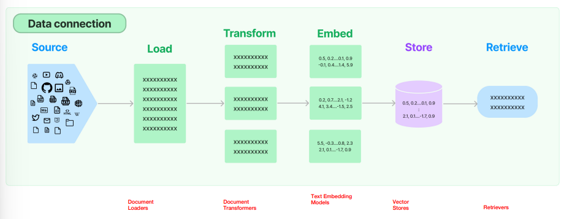
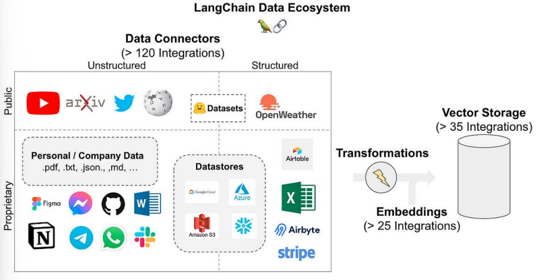

# RAG：检索增强生成
## 定义
RAG（Retrieval-Augmented Generation, 检索增强生成）

## 原生数据处理流

- 原生数据 Raw Data
- 数据加载 Document Loaders
- 数据处理 Document Transformers
- 数据向量化 Text Embedding Models
- 数据存储 Vector Stores
- 数据检索 Retrievers

## 问答场景中RAG的流程

- 用户发起问题 Question
- 将用户问题使用嵌入模型 Embedding Model 向量化
- 得到向量化过的用户问题 Question Vector
- 用向量化过的用户问题 Question Vector 检索向量数据库 Vector Database
- 通过语义相似性检索出Top k的向量
- 将Top K的向量对应语义内容和用户问题作为Prompt调用LLM
- LLM根据用户问题和检索到的数据信息给出问题的答案
- 用户得到答案
## LangChain数据生态

